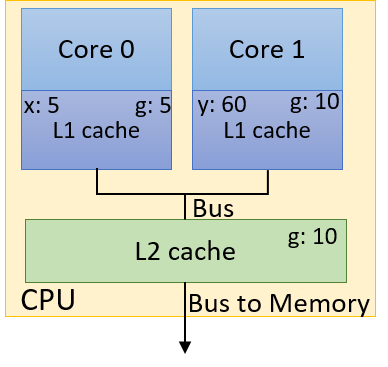

-   -   [11. Storage and the Memory
        Hierarchy](../C11-MemHierarchy/index.html){.nav-link}
        -   [11.1. The Memory
            Hierarchy](../C11-MemHierarchy/mem_hierarchy.html){.nav-link}
        -   [11.2. Storage
            Devices](../C11-MemHierarchy/devices.html){.nav-link}
        -   [11.3.
            Locality](../C11-MemHierarchy/locality.html){.nav-link}
        -   [11.4. Caching](../C11-MemHierarchy/caching.html){.nav-link}
        -   [11.5. Cache Analysis and
            Cachegrind](../C11-MemHierarchy/cachegrind.html){.nav-link}
        -   [11.6. Looking Ahead: Caching on Multicore
            Processors](../C11-MemHierarchy/coherency.html){.nav-link}
        -   [11.7. Summary](../C11-MemHierarchy/summary.html){.nav-link}
        -   [11.8.
            Exercises](../C11-MemHierarchy/exercises.html){.nav-link}

-   -   [12. Code Optimization](../C12-CodeOpt/index.html){.nav-link}
        -   [12.1. First Steps](../C12-CodeOpt/basic.html){.nav-link}
        -   [12.2. Other Compiler
            Optimizations](../C12-CodeOpt/loops_functions.html){.nav-link}
        -   [12.3. Memory
            Considerations](../C12-CodeOpt/memory_considerations.html){.nav-link}
        -   [12.4. Summary](../C12-CodeOpt/summary.html){.nav-link}

-   -   [13. The Operating System](../C13-OS/index.html){.nav-link}
        -   [13.1. Booting and Running](../C13-OS/impl.html){.nav-link}
        -   [13.2. Processes](../C13-OS/processes.html){.nav-link}
        -   [13.3. Virtual Memory](../C13-OS/vm.html){.nav-link}
        -   [13.4. Interprocess
            Communication](../C13-OS/ipc.html){.nav-link}
            -   [13.4.1. Signals](../C13-OS/ipc_signals.html){.nav-link}
            -   [13.4.2. Message
                Passing](../C13-OS/ipc_msging.html){.nav-link}
            -   [13.4.3. Shared
                Memory](../C13-OS/ipc_shm.html){.nav-link}
        -   [13.5. Summary and Other OS
            Functionality](../C13-OS/advanced.html){.nav-link}
        -   [13.6. Exercises](../C13-OS/exercises.html){.nav-link}

-   -   [14. Leveraging Shared Memory in the Multicore
        Era](index.html){.nav-link}
        -   [14.1. Programming Multicore
            Systems](multicore.html){.nav-link}
        -   [14.2. POSIX Threads](posix.html){.nav-link}
        -   [14.3. Synchronizing
            Threads](synchronization.html){.nav-link}
            -   [14.3.1. Mutual Exclusion](mutex.html){.nav-link}
            -   [14.3.2. Semaphores](semaphores.html){.nav-link}
            -   [14.3.3. Other Synchronization
                Constructs](other_syncs.html){.nav-link}
        -   [14.4. Measuring Parallel
            Performance](performance.html){.nav-link}
            -   [14.4.1. Parallel Performance
                Basics](performance_basics.html){.nav-link}
            -   [14.4.2. Advanced
                Topics](performance_advanced.html){.nav-link}
        -   [14.5. Cache Coherence](cache_coherence.html){.nav-link}
        -   [14.6. Thread Safety](thread_safety.html){.nav-link}
        -   [14.7. Implicit Threading with
            OpenMP](openmp.html){.nav-link}
        -   [14.8. Summary](summary.html){.nav-link}
        -   [14.9. Exercises](exercises.html){.nav-link}

-   -   [15. Looking Ahead: Other Parallel
        Systems](../C15-Parallel/index.html){.nav-link}
        -   [15.1. Hardware Acceleration and
            CUDA](../C15-Parallel/gpu.html){.nav-link}
        -   [15.2. Distributed Memory
            Systems](../C15-Parallel/distrmem.html){.nav-link}
        -   [15.3. To Exascale and
            Beyond](../C15-Parallel/cloud.html){.nav-link}

-   -   [16. Appendix 1: Chapter 1 for Java
        Programmers](../Appendix1/index.html){.nav-link}
        -   [16.1. Getting Started Programming in
            C](../Appendix1/getting_started.html){.nav-link}
        -   [16.2. Input/Output (printf and
            scanf)](../Appendix1/input_output.html){.nav-link}
        -   [16.3. Conditionals and
            Loops](../Appendix1/conditionals.html){.nav-link}
        -   [16.4. Functions](../Appendix1/functions.html){.nav-link}
        -   [16.5. Arrays and
            Strings](../Appendix1/arrays_strings.html){.nav-link}
        -   [16.6. Structs](../Appendix1/structs.html){.nav-link}
        -   [16.7. Summary](../Appendix1/summary.html){.nav-link}
        -   [16.8. Exercises](../Appendix1/exercises.html){.nav-link}

-   -   [17. Appendix 2: Using Unix](../Appendix2/index.html){.nav-link}
        -   [17.1. Unix Command Line and the Unix File
            System](../Appendix2/cmdln_basics.html){.nav-link}
        -   [17.2. Man and the Unix
            Manual](../Appendix2/man.html){.nav-link}
        -   [17.3. Remote Access](../Appendix2/ssh_scp.html){.nav-link}
        -   [17.4. Unix Editors](../Appendix2/editors.html){.nav-link}
        -   [17.5. make and
            Makefiles](../Appendix2/makefiles.html){.nav-link}
        -   [17.6 Searching: grep and
            find](../Appendix2/grep.html){.nav-link}
        -   [17.7 File Permissions](../Appendix2/chmod.html){.nav-link}
        -   [17.8 Archiving and Compressing
            Files](../Appendix2/tar.html){.nav-link}
        -   [17.9 Process Control](../Appendix2/pskill.html){.nav-link}
        -   [17.10 Timing](../Appendix2/timing.html){.nav-link}
        -   [17.11 Command
            History](../Appendix2/history.html){.nav-link}
        -   [17.12 I/0
            Redirection](../Appendix2/ioredirect.html){.nav-link}
        -   [17.13 Pipes](../Appendix2/pipe.html){.nav-link}
        -   [17.14 Dot Files and
            .bashrc](../Appendix2/dotfiles.html){.nav-link}
        -   [17.15 Shell
            Programming](../Appendix2/shellprog.html){.nav-link}
        -   [17.16 Getting System
            Information](../Appendix2/sysinfo.html){.nav-link}


-   [Dive Into Systems](../index-2.html)
-   [14. Leveraging Shared Memory in the Multicore Era](index.html)
-   [14.5. Cache Coherence](cache_coherence.html)
:::

::: content
::: sect1
## [](#_cache_coherence_and_false_sharing){.anchor}14.5. Cache Coherence and False Sharing {#_cache_coherence_and_false_sharing}

::: sectionbody
::: paragraph
Multicore caches can have profound implications on a multithreaded
program's performance. First, however, let's quickly review some of the
[basic concepts related to cache
design](../C11-MemHierarchy/caching.html#_cpu_caches){.page}:
:::

::: ulist
-   Data/instructions are not transported *individually* to the cache.
    Instead, data is transferred in *blocks*, and block sizes tend to
    get larger at lower levels of the memory hierarchy.

-   Each cache is organized into a series of sets, with each set having
    a number of lines. Each line holds a single block of data.

-   The individual bits of a memory address are used to determine which
    set, tag, and block offset of the cache to which to write a block of
    data.

-   A **cache hit** occurs when the desired data block exists in the
    cache. Otherwise, a **cache miss** occurs, and a lookup is performed
    on the next lower level of the memory hierarchy (which can be cache
    or main memory).

-   The **valid bit** indicates if a block at a particular line in the
    cache is safe to use. If the valid bit is set to 0, the data block
    at that line cannot be used (e.g., the block could contain data from
    an exited process).

-   Information is written to cache/memory based on two main strategies.
    In the **write-through** strategy, the data is written to cache and
    main memory simultaneously. In the **write-back** strategy, data is
    written only to cache and gets written to lower levels in the
    hierarchy after the block is evicted from the cache.
:::

::: sect2
### [](#_caches_on_multicore_systems){.anchor}14.5.1. Caches on Multicore Systems {#_caches_on_multicore_systems}

::: paragraph
[Recall](../C11-MemHierarchy/coherency.html#_looking_ahead_caching_on_multicore_processors){.page}
that, in shared memory architectures, each core can have its own cache
and that multiple cores can share a common cache. [Figure
1](#FigMulticoreCache) depicts an example dual-core CPU. Even though
each core has its own local L1 cache, the cores share a common L2 cache.
:::

::: {#FigMulticoreCache .imageblock .text-center}
::: content

:::

::: title
Figure 1. An example dual-core CPU with separate L1 caches and a shared
L2 cache
:::
:::

::: paragraph
Multiple threads in a single executable may execute separate functions.
Without a [**cache coherence**
strategy](../C11-MemHierarchy/coherency.html#_cache_coherency){.page} to
ensure that each cache maintains a consistent view of shared memory, it
is possible for shared variables to be updated inconsistently. As an
example, consider the dual-core processor in [Figure
1](#FigMulticoreCache), where each core is busy executing separate
threads concurrently. The thread assigned to Core 0 has a local variable
`x`, whereas the thread executing on Core 1 has a local variable `y`,
and both threads have shared access to a global variable `g`. [Table
1](#TabCache) shows one possible path of execution.
:::

+----------------------+----------------------+-----------------------+
| Time                 | Core 0               | Core 1                |
+======================+======================+=======================+
| 0                    | g = 5                | (other work)          |
+----------------------+----------------------+-----------------------+
| 1                    | (other work)         | y = g\*4              |
+----------------------+----------------------+-----------------------+
| 2                    | x += g               | y += g\*2             |
+----------------------+----------------------+-----------------------+

: Table 1. Problematic Data Sharing Due to Caching

::: paragraph
Suppose that the initial value of `g` is 10, and the initial values of
`x` and `y` are both 0. What is the final value of `y` at the end of
this sequence of operations? Without cache coherence, this is a very
difficult question to answer, given that there are at least three stored
values of `g`: one in Core 0's L1 cache, one in Core 1's L1 cache, and a
separate copy of `g` stored in the shared L2 cache.
:::

::: {#FigMCCacheExample .imageblock .text-center}
::: content

:::

::: title
Figure 2. A problematic update to caches that do not employ cache
coherency
:::
:::

::: paragraph
[Figure 2](#FigMCCacheExample) shows one possible erroneous result after
the sequence of operations in [Table 1](#TabCache) completes. Suppose
that the L1 caches implement a write-back policy. When the thread
executing on Core 0 writes the value 5 to `g`, it updates only the value
of `g` in Core 0's L1 cache. The value of `g` in Core 1's L1 cache still
remains 10, as does the copy in the shared L2 cache. Even if a
write-through policy is implemented, there is no guarantee that the copy
of `g` stored in Core 1's L1 cache gets updated! In this case, `y` will
have the final value of `60`.
:::

::: paragraph
A cache coherence strategy invalidates or updates cached copies of
shared values in other caches when a write to the shared data value is
made in one cache. The [Modified Shared Invalid
(MSI)](../C11-MemHierarchy/coherency.html#_the_msi_protocol){.page}
protocol (discussed in detail in [Chapter
11.6](../C11-MemHierarchy/coherency.html#_the_msi_protocol){.page}) is
one example of an invalidating cache coherency protocol.
:::

::: paragraph
A common technnique for implementing MSI is snooping. Such a **snoopy
cache** \"snoops\" on the memory bus for possible write signals. If the
snoopy cache detects a write to a shared cache block, it invalidates its
line containing that cache block. The end result is that the only valid
version of the block is in the cache that is written to, whereas *all
other* copies of the block in other caches are marked as invalid.
:::

::: paragraph
Employing the MSI protocol with snoooping would yield the correct final
assignment of `30` to variable `y` in the previous example.
:::
:::

::: sect2
### [](#_false_sharing){.anchor}14.5.2. False Sharing {#_false_sharing}

::: paragraph
Cache coherence guarantees correctness, but it can potentially harm
performance. Recall that when the thread updates `g` on Core 0, the
snoopy cache invalidates not only `g`, but the *entire cache line* that
`g` is a part of.
:::

::: paragraph
Consider our [initial attempt](_attachments/countElems_p.c) at
parallelizing the `countElems` function of the CountSort algorithm. For
convenience, the function is reproduced here:
:::

::: listingblock
::: content
``` {.highlightjs .highlight}
/*parallel version of step 1 (first cut) of CountSort algorithm:
 * extracts arguments from args value
 * calculates portion of the array this thread is responsible for counting
 * computes the frequency of all the elements in assigned component and stores
 * the associated counts of each element in counts array
*/
void *countElems(void *args){
    //extract arguments
    //ommitted for brevity
    int *array = myargs->ap;
    long *counts = myargs->countp;

    //assign work to the thread
    //compute chunk, start, and end
    //ommited for brevity

    long i;
    //heart of the program
    for (i = start; i < end; i++){
        val = array[i];
        counts[val] = counts[val] + 1;
    }

    return NULL;
}
```
:::
:::

::: paragraph
In our [previous discussion](synchronization.html#_data_races){.page} of
this function, we pointed out how data races can cause the `counts`
array to not populate with the correct set of counts. Let's see what
happens if we attempt to *time* this function. We add timing code to
`main` using `getimeofday` in the exact manner as shown in
[countElems_p\_v3.c](_attachments/countElems_p_v3.c). Benchmarking the
initial version of `countElems` as just shown on 100 million elements
yields the following times:
:::

::: listingblock
::: content
    $ ./countElems_p 100000000 0 1
    Time for Step 1 is 0.336239 s

    $ ./countElems_p 100000000 0 2
    Time for Step 1 is 0.799464 s

    $ ./countElems_p 100000000 0 4
    Time for Step 1 is 0.767003 s
:::
:::

::: paragraph
Even without any synchronization constructs, this version of the program
*still gets slower* as the number of threads increases!
:::

::: paragraph
To understand what is going on, let's revisit the `counts` array. The
`counts` array holds the frequency of occurrence of each number in our
input array. The maximum value is determined by the variable `MAX`. In
our example program, `MAX` is set to 10. In other words, the `counts`
array takes up 40 bytes of space.
:::

::: paragraph
Recall that the [cache
details](../C11-MemHierarchy/coherency.html#_looking_ahead_caching_on_multicore_processors){.page}
on a Linux system are located in the `/sys/devices/system/cpu/`
directory. Each logical core has its own cpu subdirectory called `cpuk`
where `k` indicates the *kth* logical core. Each `cpu` subdirectory in
turn has separate `index` directories that indicate the caches available
to that core.
:::

::: paragraph
The `index` directories contain files with numerous details about each
logical core's caches. The contents of a sample `index0` directory are
shown here (`index0` typically corresponds to a Linux system's L1
cache):
:::

::: listingblock
::: content
    $ ls /sys/devices/system/cpu/cpu0/cache/index0
    coherency_line_size      power            type
    level                    shared_cpu_list  uevent
    number_of_sets           shared_cpu_map   ways_of_associativity
    physical_line_partition  size
:::
:::

::: paragraph
To discover the cache line size of the L1 cache, use this command:
:::

::: listingblock
::: content
    $ cat /sys/devices/system/cpu/cpu0/cache/index0/coherency_line_size
    64
:::
:::

::: paragraph
The output reveals that L1 cache line size for the machine is 64 bytes.
In other words, the 40-byte `counts` array fits *within one cache line*.
:::

::: paragraph
Recall that with invalidating cache coherence protocols like MSI, every
time a program updates a shared variable, the *entire cache line in
other caches storing the variable is invalidated*. Let's consider what
happens when two threads execute the preceding function. One possible
path of execution is shown in [Table 2](#TabInvalidate) (assuming that
each thread is assigned to a separate core, and the variable `x` is
local to each thread).
:::

+----------------------+----------------------+-----------------------+
| Time                 | Thread 0             | Thread 1              |
+======================+======================+=======================+
| *i*                  | Reads array\[x\] (1) | ...​                   |
+----------------------+----------------------+-----------------------+
| *i+1*                | Increments           | Reads array\[x\] (4)  |
|                      | counts\[1\]          |                       |
|                      | (**invalidates cache |                       |
|                      | line**)              |                       |
+----------------------+----------------------+-----------------------+
| *i+2*                | Reads array\[x\] (6) | Increments            |
|                      |                      | counts\[4\]           |
|                      |                      | (**invalidates cache  |
|                      |                      | line**)               |
+----------------------+----------------------+-----------------------+
| *i+3*                | Increments           | Reads array\[x\] (2)  |
|                      | counts\[6\]          |                       |
|                      | (**invalidates cache |                       |
|                      | line**)              |                       |
+----------------------+----------------------+-----------------------+
| *i+4*                | Reads array\[x\] (3) | Increments            |
|                      |                      | counts\[2\]           |
|                      |                      | (**invalidates cache  |
|                      |                      | line**)               |
+----------------------+----------------------+-----------------------+
| *i+5*                | Increments           | ...​                   |
|                      | counts\[3\]          |                       |
|                      | (**invalidates cache |                       |
|                      | line**)              |                       |
+----------------------+----------------------+-----------------------+

: Table 2. A Possible Execution Sequence of Two Threads Running
`countElems`

::: ulist
-   During time step *i*, Thread 0 reads the value at `array[x]` in its
    part of the array, which is a 1 in this example.

-   During time steps *i + 1* to *i + 5*, each thread reads a value from
    `array[x]`. Note that each thread is looking at different components
    of the array. Not only that, each read of `array` in our sample
    execution yields unique values (so no race conditions in this sample
    execution sequence!). After reading the value from `array[x]`, each
    thread increments the associated value in `counts`.

-   Recall that the `counts` array *fits on a single cache line* in our
    L1 cache. As a result, every write to `counts` invalidates the
    *entire line* in *every other L1 cache*.

-   The end result is that, despite updating *different* memory
    locations in `counts`, any cache line containing `counts` is
    *invalidated* with *every update* to `counts`!
:::

::: paragraph
The invalidation forces all L1 caches to update the line with a
\"valid\" version from L2. The repeated invalidation and overwriting of
lines from the L1 cache is an example of **thrashing**, where repeated
conflicts in the cache cause a series of misses.
:::

::: paragraph
The addition of more cores makes the problem worse, given that now more
L1 caches are invalidating the line. As a result, adding additional
threads slows down the runtime, despite the fact that each thread is
accessing different elements of the `counts` array! This is an example
of **false sharing**, or the illusion that individual elements are being
shared by multiple cores. In the previous example, it appears that all
the cores are accessing the same elements of `counts`, even though this
is not the case.
:::
:::

::: sect2
### [](#_fixing_false_sharing){.anchor}14.5.3. Fixing False Sharing {#_fixing_false_sharing}

::: paragraph
One way to fix an instance of false sharing is to pad the array (in our
case `counts`) with additional elements so that it doesn't fit in a
single cache line. However, padding can waste memory, and may not
eliminate the problem from all architectures (consider the scenario in
which two different machines have different L1 cache sizes). In most
cases, writing code to support different cache sizes is generally not
worth the gain in performance.
:::

::: paragraph
A better solution is to have threads write to *local storage* whenever
possible. Local storage in this context refers to memory that is *local*
to a thread. The following solution reduces false sharing by choosing to
perform updates to a locally declared version of `counts` called
`local_counts`.
:::

::: paragraph
Let's revisit the final version of our `countElems` function (reproduced
from [countElems_p\_v3.c](_attachments/countElems_p_v3.c)):
:::

::: listingblock
::: content
``` {.highlightjs .highlight}
/*parallel version of CountSort algorithm step 1 (final attempt with mutexes):
 * extracts arguments from args value
 * calculates the portion of the array this thread is responsible for counting
 * computes the frequency of all the elements in assigned component and stores
 * the associated counts of each element in counts array
*/
void *countElems( void *args ){
    //extract arguments
    //omitted for brevity
    int *array = myargs->ap;
    long *counts = myargs->countp;

    long local_counts[MAX] = {0}; //local declaration of counts array

    //assign work to the thread
    //compute chunk, start, and end values (omitted for brevity)

    long i;

    //heart of the program
    for (i = start; i < end; i++){
        val = array[i];
        local_counts[val] = local_counts[val] + 1; //update local counts array
    }

    //update to global counts array
    pthread_mutex_lock(&mutex); //acquire the mutex lock
    for (i = 0; i < MAX; i++){
        counts[i] += local_counts[i];
    }
    pthread_mutex_unlock(&mutex); //release the mutex lock

    return NULL;
}
```
:::
:::

::: paragraph
The use of `local_counts` to accumulate frequencies in lieu of `counts`
is the major source of reduction of false sharing in this example:
:::

::: listingblock
::: content
``` {.highlightjs .highlight}
for (i = start; i < end; i++){
    val = array[i];
    local_counts[val] = local_counts[val] + 1; //updates local counts array
}
```
:::
:::

::: paragraph
Since cache coherence is meant to maintain a consistent view of shared
memory, the invalidations trigger only on *writes* to *shared values* in
memory. Since `local_counts` is not shared among the different threads,
a write to it will not invalidate its associated cache line.
:::

::: paragraph
In the last component of the code, the mutex enforces correctness by
ensuring that only one thread updates the shared `counts` array at a
time:
:::

::: listingblock
::: content
``` {.highlightjs .highlight}
//update to global counts array
pthread_mutex_lock(&mutex); //acquire the mutex lock
for (i = 0; i < MAX; i++){
    counts[i] += local_counts[i];
}
pthread_mutex_unlock(&mutex); //release the mutex lock
```
:::
:::

::: paragraph
Since `counts` is located on a single cache line, it will still get
invalidated with every write. The difference is that the penalty here is
at most `MAX` × *t* writes vs. *n* writes, where *n* is the length of
our input array, and *t* is the number of threads employed.
:::
:::
:::
:::

::: toc-menu
:::
:::
:::
:::

Copyright (C) 2020 Dive into Systems, LLC.

*Dive into Systems,* is licensed under the Creative Commons
[Attribution-NonCommercial-NoDerivatives 4.0
International](https://creativecommons.org/licenses/by-nc-nd/4.0/) (CC
BY-NC-ND 4.0).
