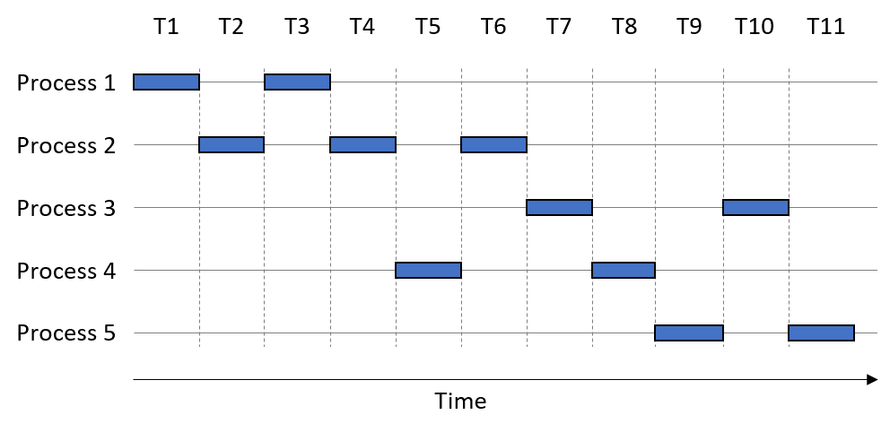
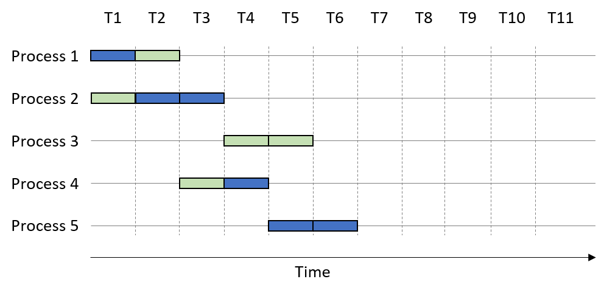
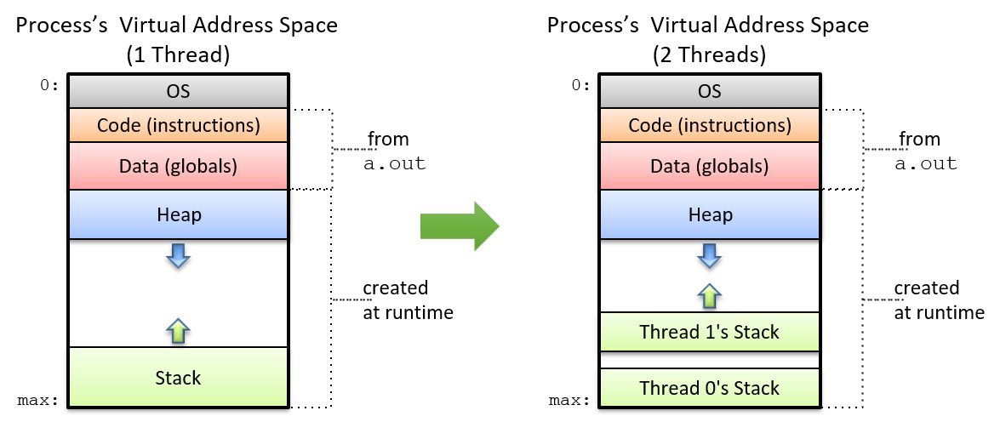

-   -   [11. Storage and the Memory
        Hierarchy](../C11-MemHierarchy/index.html){.nav-link}
        -   [11.1. The Memory
            Hierarchy](../C11-MemHierarchy/mem_hierarchy.html){.nav-link}
        -   [11.2. Storage
            Devices](../C11-MemHierarchy/devices.html){.nav-link}
        -   [11.3.
            Locality](../C11-MemHierarchy/locality.html){.nav-link}
        -   [11.4. Caching](../C11-MemHierarchy/caching.html){.nav-link}
        -   [11.5. Cache Analysis and
            Cachegrind](../C11-MemHierarchy/cachegrind.html){.nav-link}
        -   [11.6. Looking Ahead: Caching on Multicore
            Processors](../C11-MemHierarchy/coherency.html){.nav-link}
        -   [11.7. Summary](../C11-MemHierarchy/summary.html){.nav-link}
        -   [11.8.
            Exercises](../C11-MemHierarchy/exercises.html){.nav-link}

-   -   [12. Code Optimization](../C12-CodeOpt/index.html){.nav-link}
        -   [12.1. First Steps](../C12-CodeOpt/basic.html){.nav-link}
        -   [12.2. Other Compiler
            Optimizations](../C12-CodeOpt/loops_functions.html){.nav-link}
        -   [12.3. Memory
            Considerations](../C12-CodeOpt/memory_considerations.html){.nav-link}
        -   [12.4. Summary](../C12-CodeOpt/summary.html){.nav-link}

-   -   [13. The Operating System](../C13-OS/index.html){.nav-link}
        -   [13.1. Booting and Running](../C13-OS/impl.html){.nav-link}
        -   [13.2. Processes](../C13-OS/processes.html){.nav-link}
        -   [13.3. Virtual Memory](../C13-OS/vm.html){.nav-link}
        -   [13.4. Interprocess
            Communication](../C13-OS/ipc.html){.nav-link}
            -   [13.4.1. Signals](../C13-OS/ipc_signals.html){.nav-link}
            -   [13.4.2. Message
                Passing](../C13-OS/ipc_msging.html){.nav-link}
            -   [13.4.3. Shared
                Memory](../C13-OS/ipc_shm.html){.nav-link}
        -   [13.5. Summary and Other OS
            Functionality](../C13-OS/advanced.html){.nav-link}
        -   [13.6. Exercises](../C13-OS/exercises.html){.nav-link}

-   -   [14. Leveraging Shared Memory in the Multicore
        Era](index.html){.nav-link}
        -   [14.1. Programming Multicore
            Systems](multicore.html){.nav-link}
        -   [14.2. POSIX Threads](posix.html){.nav-link}
        -   [14.3. Synchronizing
            Threads](synchronization.html){.nav-link}
            -   [14.3.1. Mutual Exclusion](mutex.html){.nav-link}
            -   [14.3.2. Semaphores](semaphores.html){.nav-link}
            -   [14.3.3. Other Synchronization
                Constructs](other_syncs.html){.nav-link}
        -   [14.4. Measuring Parallel
            Performance](performance.html){.nav-link}
            -   [14.4.1. Parallel Performance
                Basics](performance_basics.html){.nav-link}
            -   [14.4.2. Advanced
                Topics](performance_advanced.html){.nav-link}
        -   [14.5. Cache Coherence](cache_coherence.html){.nav-link}
        -   [14.6. Thread Safety](thread_safety.html){.nav-link}
        -   [14.7. Implicit Threading with
            OpenMP](openmp.html){.nav-link}
        -   [14.8. Summary](summary.html){.nav-link}
        -   [14.9. Exercises](exercises.html){.nav-link}

-   -   [15. Looking Ahead: Other Parallel
        Systems](../C15-Parallel/index.html){.nav-link}
        -   [15.1. Hardware Acceleration and
            CUDA](../C15-Parallel/gpu.html){.nav-link}
        -   [15.2. Distributed Memory
            Systems](../C15-Parallel/distrmem.html){.nav-link}
        -   [15.3. To Exascale and
            Beyond](../C15-Parallel/cloud.html){.nav-link}

-   -   [16. Appendix 1: Chapter 1 for Java
        Programmers](../Appendix1/index.html){.nav-link}
        -   [16.1. Getting Started Programming in
            C](../Appendix1/getting_started.html){.nav-link}
        -   [16.2. Input/Output (printf and
            scanf)](../Appendix1/input_output.html){.nav-link}
        -   [16.3. Conditionals and
            Loops](../Appendix1/conditionals.html){.nav-link}
        -   [16.4. Functions](../Appendix1/functions.html){.nav-link}
        -   [16.5. Arrays and
            Strings](../Appendix1/arrays_strings.html){.nav-link}
        -   [16.6. Structs](../Appendix1/structs.html){.nav-link}
        -   [16.7. Summary](../Appendix1/summary.html){.nav-link}
        -   [16.8. Exercises](../Appendix1/exercises.html){.nav-link}

-   -   [17. Appendix 2: Using Unix](../Appendix2/index.html){.nav-link}
        -   [17.1. Unix Command Line and the Unix File
            System](../Appendix2/cmdln_basics.html){.nav-link}
        -   [17.2. Man and the Unix
            Manual](../Appendix2/man.html){.nav-link}
        -   [17.3. Remote Access](../Appendix2/ssh_scp.html){.nav-link}
        -   [17.4. Unix Editors](../Appendix2/editors.html){.nav-link}
        -   [17.5. make and
            Makefiles](../Appendix2/makefiles.html){.nav-link}
        -   [17.6 Searching: grep and
            find](../Appendix2/grep.html){.nav-link}
        -   [17.7 File Permissions](../Appendix2/chmod.html){.nav-link}
        -   [17.8 Archiving and Compressing
            Files](../Appendix2/tar.html){.nav-link}
        -   [17.9 Process Control](../Appendix2/pskill.html){.nav-link}
        -   [17.10 Timing](../Appendix2/timing.html){.nav-link}
        -   [17.11 Command
            History](../Appendix2/history.html){.nav-link}
        -   [17.12 I/0
            Redirection](../Appendix2/ioredirect.html){.nav-link}
        -   [17.13 Pipes](../Appendix2/pipe.html){.nav-link}
        -   [17.14 Dot Files and
            .bashrc](../Appendix2/dotfiles.html){.nav-link}
        -   [17.15 Shell
            Programming](../Appendix2/shellprog.html){.nav-link}
        -   [17.16 Getting System
            Information](../Appendix2/sysinfo.html){.nav-link}


-   [Dive Into Systems](../index-2.html)
-   [14. Leveraging Shared Memory in the Multicore Era](index.html)
-   [14.1. Programming Multicore Systems](multicore.html)
:::

::: content
::: sect1
## [](#_programming_multicore_systems){.anchor}14.1. Programming Multicore Systems {#_programming_multicore_systems}

::: sectionbody
::: paragraph
Most of the common languages that programmers know today were created
prior to the multicore age. As a result, many languages cannot
*implicitly* (or automatically) employ multicore processors to speed up
the execution of a program. Instead, programmers must specifically write
software to leverage the multiple cores on a system.
:::

::: sect2
### [](#_the_impact_of_multicore_systems_on_process_execution){.anchor}14.1.1. The Impact of Multicore Systems on Process Execution {#_the_impact_of_multicore_systems_on_process_execution}

::: paragraph
Recall that a [**process**](../C13-OS/processes.html#_processes){.page}
can be thought of as an abstraction of a running program. Each process
executes in its own virtual address space. The operating system (OS)
schedules processes for execution on the CPU; a **context switch**
occurs when the CPU changes which process it currently executes.
:::

::: paragraph
[Figure 1](#FigConcurrency1) illustrates how five example processes may
execute on a single-core CPU.
:::

::: {#FigConcurrency1 .imageblock}
::: content

:::

::: title
Figure 1. An execution time sequence for five processes as they share a
single CPU core
:::
:::

::: paragraph
The horizontal axis is time, with each time slice taking one unit of
time. A box indicates when a process is using the single-core CPU.
Assume that each process executes for one full time slice before a
context switch occurs. So, Process 1 uses the CPU during time steps T1
and T3.
:::

::: paragraph
In this example, the order of process execution is P1, P2, P1, P2, P4,
P2, P3, P4, P5, P3, P5. We take a moment here to distinguish between two
measures of time. The **CPU time** measures the amount of time a process
takes to execute on a CPU. In contrast, the **wall-clock time** measures
the amount of time a human perceives a process takes to complete. The
wall-clock time is often significantly longer than the CPU time, due to
context switches. For example, Process 1's CPU time requires two time
units, whereas its wall-clock time is three time units.
:::

::: paragraph
When the total execution time of one process overlaps with another, the
processes are running **concurrently** with each other. Operating
systems employed concurrency in the single-core era to give the illusion
that a computer can execute many things at once (e.g., you can have a
calculator program, a web browser, and a word processing document all
open at the same time). In truth, each process executes serially and the
operating system determines the [order in which processes execute and
complete](../C13-OS/processes.html#_multiprogramming_and_context_switching){.page}
(which often differs in subsequent runs).
:::

::: paragraph
Returning to the example, observe that Process 1 and Process 2 run
concurrently with each other, since their executions overlap at time
points T2-T4. Likewise, Process 2 runs concurrently with Process 4, as
their executions overlap at time points T4-T6. In contrast, Process 2
does *not* run concurrently with Process 3, because they share no
overlap in their execution; Process 3 only starts running at time T7,
whereas Process 2 completes at time T6.
:::

::: paragraph
A multicore CPU enables the OS to schedule a different process to each
available core, allowing processes to execute *simultaneously*. The
simultaneous execution of instructions from processes running on
multiple cores is referred to as **parallel execution**. [Figure
2](#FigConcurrency2) shows how our example processes might execute on a
dual-core system.
:::

::: {#FigConcurrency2 .imageblock}
::: content

:::

::: title
Figure 2. An execution time sequence for five processes, extended to
include two CPU cores (one in dark blue, the other in light green).
:::
:::

::: paragraph
In this example, the two CPU cores are colored differently. Suppose that
the process execution order is again P1, P2, P1, P2, P4, P2, P3, P4, P5,
P3, P5. The presence of multiple cores enables certain processes to
execute *sooner*. For example, during time unit T1, the first core
executes Process 1 while the second core executes Process 2. At time T2,
the first core executes Process 2 while the second executes Process 1.
Thus, Process 1 finishes executing after time T2, whereas Process 2
finishes executing at time T3.
:::

::: paragraph
Note that the parallel execution of multiple processes increases just
the number of processes that execute at any one time. In [Figure
2](#FigConcurrency2), all the processes complete execution by time unit
T7. However, each individual process still requires the same amount of
CPU time to complete as shown in [Figure 1](#FigConcurrency1). For
example, Process 2 requires three time units regardless of execution on
a single or multicore system (i.e., its *CPU time* remains the same). A
multicore processor increases the **throughput** of process execution,
or the number of processes that can complete in a given period of time.
Thus, while the CPU time of an individual process remains unchanged, its
wall-clock time may decrease.
:::
:::

::: sect2
### [](#_expediting_process_execution_with_threads){.anchor}14.1.2. Expediting Process Execution with Threads {#_expediting_process_execution_with_threads}

::: paragraph
One way to speed up the execution of a single process is to decompose it
into lightweight, independent execution flows called **threads**.
[Figure 3](#FigProcess) shows how a process's virtual address space
changes when it is multithreaded with two threads. While each thread has
its own private allocation of call stack memory, all threads *share* the
program data, instructions, and the heap allocated to the multithreaded
process.
:::

::: {#FigProcess .imageblock}
::: content

:::

::: title
Figure 3. Comparing the virtual address space of a single-threaded and a
multithreaded process with two threads
:::
:::

::: paragraph
The operating system schedules threads in the same manner as it
schedules processes. On a multicore processor, the OS can speed up the
execution of a multithreaded program by scheduling the different threads
to run on separate cores. The maximum number of threads that can execute
in parallel is equal to the number of physical cores on the system. If
the number of threads exceeds the number of physical cores, the
remaining threads must wait their turn to execute (similar to how
processes execute on a single core).
:::

::: sect3
#### [](#_an_example_scalar_multiplication){.anchor}An Example: Scalar Multiplication {#_an_example_scalar_multiplication}

::: paragraph
As an initial example of how to use multithreading to speed up an
application, consider the problem of performing scalar multiplication of
an array `array` and some integer `s`. In scalar multiplication, each
element in the array is scaled by multiplying the element with `s`.
:::

::: paragraph
A serial implementation of a scalar multiplication function follows:
:::

::: listingblock
::: content
``` {.highlightjs .highlight}
void scalar_multiply(int * array, long length, int s) {
    int i;
    for (i = 0; i < length; i++) {
      array[i] = array[i] * s;
    }
}
```
:::
:::

::: paragraph
Suppose that `array` has *N* total elements. To create a multithreaded
version of this application with *t* threads, it is necessary to:
:::

::: {.olist .arabic}
1.  Create *t* threads.

2.  Assign each thread a subset of the input array (i.e., *N*/*t*
    elements).

3.  Instruct each thread to multiply the elements in its array subset by
    `s`.
:::

::: paragraph
Suppose that the serial implementation of `scalar_multiply` spends 60
seconds multiplying an input array of 100 million elements. To build a
version that executes with *t*= 4 threads, we assign each thread one
fourth of the total input array (25 million elements).
:::

::: paragraph
[Figure 4](#singleCPU) shows what happens when we run four threads on a
single core. As before, the execution order is left to the operating
system. In this scenario, assume that the thread execution order is
Thread 1, Thread 3, Thread 2, Thread 4. On a single-core processor
(represented by the squares), each thread executes sequentially. Thus,
the multithreaded process running on one core will still take 60 seconds
to run (perhaps a little longer, given the overhead of creating
threads).
:::

::: {#singleCPU .imageblock .text-center}
::: content
{width="400"}
:::

::: title
Figure 4. Running four threads on a single-core CPU
:::
:::

::: paragraph
Now suppose that we run our multithreaded process on a dual-core system.
[Figure 5](#doubleCPU) shows the result. Again, assume *t* = 4 threads,
and that the thread execution order is Thread 1, Thread 3, Thread 2,
Thread 4. Our two cores are represented by shaded squares. Since the
system is dual-core, Thread 1 and Thread 3 execute in parallel during
time step T1. Threads 2 and 4 then execute in parallel during time step
T2. Thus, the multithreaded process that originally took 60 seconds to
run now runs in 30 seconds.
:::

::: {#doubleCPU .imageblock .text-center}
::: content
{width="400"}
:::

::: title
Figure 5. Running four threads on a dual-core CPU
:::
:::

::: paragraph
Finally, suppose that the multithreaded process (*t* = 4) is run on a
quad-core CPU. [Figure 6](#quadCPU) shows one such execution sequence.
Each of the four cores in [Figure 6](#quadCPU) is shaded differently. On
the quad-core system, each thread executes in parallel during time slice
T1. Thus, on a quad-core CPU, the multithreaded process that originally
took 60 seconds now runs in 15 seconds.
:::

::: {#quadCPU .imageblock .text-center}
::: content
{width="400"}
:::

::: title
Figure 6. Running four threads on a quad-core CPU
:::
:::

::: paragraph
In general, if the number of threads matches the number of cores (*c*)
and the operating system schedules each thread to run on a separate core
in parallel, then the multithreaded process should run in approximately
1/*c* of the time. Such linear speedup is ideal, but not frequently
observed in practice. For example, if there are many other processes (or
multithreaded processes) waiting to use the CPU, they will all compete
for the limited number of cores, resulting in **resource contention**
among the processes. If the number of specified threads exceeds the
number of CPU cores, each thread must wait its turn to run. We explore
other factors that often prevent linear speedup [later in this
chapter](performance.html#_measuring_the_performance_of_parallel_programs){.page}.
:::
:::
:::
:::
:::

::: toc-menu
:::
:::
:::
:::

Copyright (C) 2020 Dive into Systems, LLC.

*Dive into Systems,* is licensed under the Creative Commons
[Attribution-NonCommercial-NoDerivatives 4.0
International](https://creativecommons.org/licenses/by-nc-nd/4.0/) (CC
BY-NC-ND 4.0).
