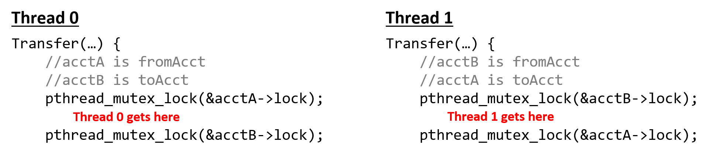

-   -   [11. Storage and the Memory
        Hierarchy](../C11-MemHierarchy/index.html){.nav-link}
        -   [11.1. The Memory
            Hierarchy](../C11-MemHierarchy/mem_hierarchy.html){.nav-link}
        -   [11.2. Storage
            Devices](../C11-MemHierarchy/devices.html){.nav-link}
        -   [11.3.
            Locality](../C11-MemHierarchy/locality.html){.nav-link}
        -   [11.4. Caching](../C11-MemHierarchy/caching.html){.nav-link}
        -   [11.5. Cache Analysis and
            Cachegrind](../C11-MemHierarchy/cachegrind.html){.nav-link}
        -   [11.6. Looking Ahead: Caching on Multicore
            Processors](../C11-MemHierarchy/coherency.html){.nav-link}
        -   [11.7. Summary](../C11-MemHierarchy/summary.html){.nav-link}
        -   [11.8.
            Exercises](../C11-MemHierarchy/exercises.html){.nav-link}

-   -   [12. Code Optimization](../C12-CodeOpt/index.html){.nav-link}
        -   [12.1. First Steps](../C12-CodeOpt/basic.html){.nav-link}
        -   [12.2. Other Compiler
            Optimizations](../C12-CodeOpt/loops_functions.html){.nav-link}
        -   [12.3. Memory
            Considerations](../C12-CodeOpt/memory_considerations.html){.nav-link}
        -   [12.4. Summary](../C12-CodeOpt/summary.html){.nav-link}

-   -   [13. The Operating System](../C13-OS/index.html){.nav-link}
        -   [13.1. Booting and Running](../C13-OS/impl.html){.nav-link}
        -   [13.2. Processes](../C13-OS/processes.html){.nav-link}
        -   [13.3. Virtual Memory](../C13-OS/vm.html){.nav-link}
        -   [13.4. Interprocess
            Communication](../C13-OS/ipc.html){.nav-link}
            -   [13.4.1. Signals](../C13-OS/ipc_signals.html){.nav-link}
            -   [13.4.2. Message
                Passing](../C13-OS/ipc_msging.html){.nav-link}
            -   [13.4.3. Shared
                Memory](../C13-OS/ipc_shm.html){.nav-link}
        -   [13.5. Summary and Other OS
            Functionality](../C13-OS/advanced.html){.nav-link}
        -   [13.6. Exercises](../C13-OS/exercises.html){.nav-link}

-   -   [14. Leveraging Shared Memory in the Multicore
        Era](index.html){.nav-link}
        -   [14.1. Programming Multicore
            Systems](multicore.html){.nav-link}
        -   [14.2. POSIX Threads](posix.html){.nav-link}
        -   [14.3. Synchronizing
            Threads](synchronization.html){.nav-link}
            -   [14.3.1. Mutual Exclusion](mutex.html){.nav-link}
            -   [14.3.2. Semaphores](semaphores.html){.nav-link}
            -   [14.3.3. Other Synchronization
                Constructs](other_syncs.html){.nav-link}
        -   [14.4. Measuring Parallel
            Performance](performance.html){.nav-link}
            -   [14.4.1. Parallel Performance
                Basics](performance_basics.html){.nav-link}
            -   [14.4.2. Advanced
                Topics](performance_advanced.html){.nav-link}
        -   [14.5. Cache Coherence](cache_coherence.html){.nav-link}
        -   [14.6. Thread Safety](thread_safety.html){.nav-link}
        -   [14.7. Implicit Threading with
            OpenMP](openmp.html){.nav-link}
        -   [14.8. Summary](summary.html){.nav-link}
        -   [14.9. Exercises](exercises.html){.nav-link}

-   -   [15. Looking Ahead: Other Parallel
        Systems](../C15-Parallel/index.html){.nav-link}
        -   [15.1. Hardware Acceleration and
            CUDA](../C15-Parallel/gpu.html){.nav-link}
        -   [15.2. Distributed Memory
            Systems](../C15-Parallel/distrmem.html){.nav-link}
        -   [15.3. To Exascale and
            Beyond](../C15-Parallel/cloud.html){.nav-link}

-   -   [16. Appendix 1: Chapter 1 for Java
        Programmers](../Appendix1/index.html){.nav-link}
        -   [16.1. Getting Started Programming in
            C](../Appendix1/getting_started.html){.nav-link}
        -   [16.2. Input/Output (printf and
            scanf)](../Appendix1/input_output.html){.nav-link}
        -   [16.3. Conditionals and
            Loops](../Appendix1/conditionals.html){.nav-link}
        -   [16.4. Functions](../Appendix1/functions.html){.nav-link}
        -   [16.5. Arrays and
            Strings](../Appendix1/arrays_strings.html){.nav-link}
        -   [16.6. Structs](../Appendix1/structs.html){.nav-link}
        -   [16.7. Summary](../Appendix1/summary.html){.nav-link}
        -   [16.8. Exercises](../Appendix1/exercises.html){.nav-link}

-   -   [17. Appendix 2: Using Unix](../Appendix2/index.html){.nav-link}
        -   [17.1. Unix Command Line and the Unix File
            System](../Appendix2/cmdln_basics.html){.nav-link}
        -   [17.2. Man and the Unix
            Manual](../Appendix2/man.html){.nav-link}
        -   [17.3. Remote Access](../Appendix2/ssh_scp.html){.nav-link}
        -   [17.4. Unix Editors](../Appendix2/editors.html){.nav-link}
        -   [17.5. make and
            Makefiles](../Appendix2/makefiles.html){.nav-link}
        -   [17.6 Searching: grep and
            find](../Appendix2/grep.html){.nav-link}
        -   [17.7 File Permissions](../Appendix2/chmod.html){.nav-link}
        -   [17.8 Archiving and Compressing
            Files](../Appendix2/tar.html){.nav-link}
        -   [17.9 Process Control](../Appendix2/pskill.html){.nav-link}
        -   [17.10 Timing](../Appendix2/timing.html){.nav-link}
        -   [17.11 Command
            History](../Appendix2/history.html){.nav-link}
        -   [17.12 I/0
            Redirection](../Appendix2/ioredirect.html){.nav-link}
        -   [17.13 Pipes](../Appendix2/pipe.html){.nav-link}
        -   [17.14 Dot Files and
            .bashrc](../Appendix2/dotfiles.html){.nav-link}
        -   [17.15 Shell
            Programming](../Appendix2/shellprog.html){.nav-link}
        -   [17.16 Getting System
            Information](../Appendix2/sysinfo.html){.nav-link}


-   [Dive Into Systems](../index-2.html)
-   [14. Leveraging Shared Memory in the Multicore Era](index.html)
-   [14.3. Synchronizing Threads](synchronization.html)
-   [14.3.1. Mutual Exclusion](mutex.html)
:::

::: content
::: sect2
### [](#_mutual_exclusion){.anchor}14.3.1. Mutual Exclusion {#_mutual_exclusion}

::: paragraph
*What is the mutex? The answer is out there, and it's looking for you,
and it will find you if you want it to.*
:::

::: paragraph
\~Trinity, explaining mutexes to Neo (Apologies to *The Matrix*)
:::

::: paragraph
To fix the data race, let's use a synchronization construct known as a
mutual exclusion lock, or **mutex**. Mutual exclusion locks are a type
of synchronization primitive that ensures that only one thread enters
and executes the code inside the critical section at any given time.
:::

::: paragraph
Before using a mutex, a program must first:
:::

::: {.olist .arabic}
1.  Declare the mutex in memory that's shared by threads (often as a
    global variable).

2.  Initialize the mutex before the threads need to use it (typically in
    the `main` function).
:::

::: paragraph
The Pthreads library defines a `pthread_mutex_t` type for mutexes. To
declare a mutex variable, add this line:
:::

::: listingblock
::: content
``` {.highlightjs .highlight}
pthread_mutex_t mutex;
```
:::
:::

::: paragraph
To initialize the mutex use the `pthread_mutex_init` function, which
takes the address of a mutex and an attribute structure, typically set
to `NULL`:
:::

::: listingblock
::: content
``` {.highlightjs .highlight}
pthread_mutex_init(&mutex, NULL);
```
:::
:::

::: paragraph
When the mutex is no longer needed (typically at the end of the `main`
function, after `pthread_join`), a program should release the mutex
structure by invoking the `pthread_mutex_destroy` function:
:::

::: listingblock
::: content
``` {.highlightjs .highlight}
pthread_mutex_destroy(&mutex);
```
:::
:::

#### The Mutex: Locked and Loaded {#_the_mutex_locked_and_loaded .discrete}

::: paragraph
The initial state of a mutex is unlocked, meaning it's immediately
usable by any thread. To enter a critical section, a thread must first
acquire a lock. This is accomplished with a call to the
`pthread_mutex_lock` function. After a thread has the lock, no other
thread can enter the critical section until the thread with the lock
releases it. If another thread calls `pthread_mutex_lock` and the mutex
is already locked, the thread will **block** (or wait) until the mutex
becomes available. Recall that [*blocking* implies that the thread will
not be scheduled](../C13-OS/processes.html#_process_state){.page} to use
the CPU until the condition it's waiting for (the mutex being available)
becomes true.
:::

::: paragraph
When a thread exits the critical section it must call the
`pthread_mutex_unlock` function to release the mutex, making it
available for another thread. Thus, at most one thread may acquire the
lock and enter the critical section at a time, which prevents multiple
threads from *racing* to read and update shared variables.
:::

::: paragraph
Having declared and initialized a mutex, the next question is where the
lock and unlock functions should be placed to best enforce the critical
section. Here is an initial attempt at augmenting the `countElems`
function with a mutex (The full source can be downloaded from
[countElems_p\_v2.c](_attachments/countElems_p_v2.c)):
:::

::: listingblock
::: content
``` {.highlightjs .highlight}
pthread_mutex_t mutex; //global declaration of mutex, initialized in main()

/*parallel version of step 1 of CountSort algorithm (attempt 1 with mutexes):
 * extracts arguments from args value
 * calculates component of the array that thread is responsible for counting
 * computes the frequency of all the elements in assigned component and stores
 * the associated counts of each element in counts array
*/
void *countElems( void *args ) {
    //extract arguments
    //ommitted for brevity
    int *array = myargs->ap;
    long *counts = myargs->countp;

    //assign work to the thread
    long chunk = length / nthreads; //nominal chunk size
    long start = myid * chunk;
    long end = (myid + 1) * chunk;
    long val;
    if (myid == nthreads - 1) {
        end = length;
    }
    long i;

    //heart of the program
    pthread_mutex_lock(&mutex); //acquire the mutex lock
    for (i = start; i < end; i++) {
        val = array[i];
        counts[val] = counts[val] + 1;
    }
    pthread_mutex_unlock(&mutex); //release the mutex lock

    return NULL;
}
```
:::
:::

::: paragraph
The mutex initialize and destroy functions are placed in `main` around
the thread creation and join functions:
:::

::: listingblock
::: content
``` {.highlightjs .highlight}
//code snippet from main():

pthread_mutex_init(&mutex, NULL); //initialize the mutex

for (t = 0; t < nthreads; t++) {
    pthread_create( &thread_array[t], NULL, countElems, &thread_args[t] );
}

for (t = 0; t < nthreads; t++) {
    pthread_join(thread_array[t], NULL);
}
pthread_mutex_destroy(&mutex); //destroy (free) the mutex
```
:::
:::

::: paragraph
Let's recompile and run this new program while varying the number of
threads:
:::

::: listingblock
::: content
    $ ./countElems_p_v2 10000000 1 1
    Counts array:
    999170 1001044 999908 1000431 999998 1001479 999709 997250 1000804 1000207

    $ ./countElems_p_v2 10000000 1 2
    Counts array:
    999170 1001044 999908 1000431 999998 1001479 999709 997250 1000804 1000207

    $ ./countElems_p_v2 10000000 1 4
    Counts array:
    999170 1001044 999908 1000431 999998 1001479 999709 997250 1000804 1000207
:::
:::

::: paragraph
Excellent, the output is *finally* consistent regardless of the number
of threads used!
:::

::: paragraph
Recall that another primary goal of threading is to reduce the runtime
of a program as the number of threads increases (in other words, to
*speed up* program execution). Let's benchmark the performance of the
`countElems` function. Although it may be tempting to use a command line
utility like `time -p`, recall that invoking `time -p` measures the
wall-clock time of the *entire* program (including the generation of
random elements) and *not* just the running of the `countElems`
function. In this case, it is better to use a system call like
`gettimeofday`, which allows a user to accurately measure the wall-clock
time of a particular section of code. Benchmarking `countElems` on 100
million elements yields the following run times:
:::

::: listingblock
::: content
    $ ./countElems_p_v2 100000000 0 1
    Time for Step 1 is 0.368126 s

    $ ./countElems_p_v2 100000000 0 2
    Time for Step 1 is 0.438357 s

    $ ./countElems_p_v2 100000000 0 4
    Time for Step 1 is 0.519913 s
:::
:::

::: paragraph
Adding more threads causes the program to get *slower*! This goes
against the goal of making programs *faster* with threads.
:::

::: paragraph
To understand what is going on, consider where the locks are placed in
the `countsElems` function:
:::

::: listingblock
::: content
``` {.highlightjs .highlight}
//code snippet from the countElems function from earlier
//the heart of the program
pthread_mutex_lock(&mutex); //acquire the mutex lock
for (i = start; i < end; i++){
    val = array[i];
    counts[val] = counts[val] + 1;
}
pthread_mutex_unlock(&mutex); //release the mutex lock
```
:::
:::

::: paragraph
In this example, we placed the lock around the *entirety* of the `for`
loop. Even though this placement solves the correctness problems, it's
an extremely poor decision from a performance perspective --- the
critical section now encompasses the entire loop body. Placing locks in
this manner guarantees that only one thread can execute the loop at a
time, effectively serializing the program!
:::

#### The Mutex: Reloaded {#_the_mutex_reloaded .discrete}

::: paragraph
Let's try another approach and place the mutex locking and unlocking
functions within every iteration of the loop:
:::

::: listingblock
::: content
``` {.highlightjs .highlight}
/*modified code snippet of countElems function:
 *locks are now placed INSIDE the for loop!
*/
//the heart of the program
for (i = start; i < end; i++) {
    val = array[i];
    pthread_mutex_lock(&m); //acquire the mutex lock
    counts[val] = counts[val] + 1;
    pthread_mutex_unlock(&m); //release the mutex lock
}
```
:::
:::

::: paragraph
This may initially look like a better solution because each thread can
enter the loop in parallel, serializing only when reaching the lock. The
critical section is very small, encompassing only the line
`counts[val] = counts[val] + 1`.
:::

::: paragraph
Let's first perform a correctness check on this version of the program:
:::

::: listingblock
::: content
    $ ./countElems_p_v3 10000000 1 1
    Counts array:
    999170 1001044 999908 1000431 999998 1001479 999709 997250 1000804 1000207

    $ ./countElems_p_v3 10000000 1 2
    Counts array:
    999170 1001044 999908 1000431 999998 1001479 999709 997250 1000804 1000207

    $ ./countElems_p_v3 10000000 1 4
    Counts array:
    999170 1001044 999908 1000431 999998 1001479 999709 997250 1000804 1000207
:::
:::

::: paragraph
So far so good. This version of the program also produces consistent
output regardless of the number of threads employed.
:::

::: paragraph
Now, let's look at performance:
:::

::: listingblock
::: content
    $ ./countElems_p_v3 100000000 0 1
    Time for Step 1 is 1.92225 s

    $ ./countElems_p_v3 100000000 0 2
    Time for Step 1 is 10.9704 s

    $ ./countElems_p_v3 100000000 0 4
    Time for Step 1 is 9.13662 s
:::
:::

::: paragraph
Running this version of the code yields (amazingly enough) a
*significantly slower* runtime!
:::

::: paragraph
As it turns out, locking and unlocking a mutex are expensive operations.
Recall what was covered in the discussion on [function call
optimizations](../C12-CodeOpt/loops_functions.html#_function_inlining){.page}:
calling a function repeatedly (and needlessly) in a loop can be a major
cause of slowdown in a program. In our prior use of mutexes, each thread
locks and unlocks the mutex exactly once. In the current solution, each
thread locks and unlocks the mutex *n/t* times, where *n* is the size of
the array, *t* is the number of threads, and *n/t* is the size of the
array component assigned to each particular thread. As a result, the
cost of the additional mutex operations slows down the loop's execution
considerably.
:::

#### The Mutex: Revisited {#_the_mutex_revisited .discrete}

::: paragraph
In addition to protecting the critical section to achieve correct
behavior, an ideal solution would use the lock and unlock functions as
little as possible, and reduce the critical section to the smallest
possible size.
:::

::: paragraph
The original implementation satisfies the first requirement, whereas the
second implementation tries to accomplish the second. At first glance,
it appears that the two requirements are incompatible with each other.
Is there a way to actually accomplish both (and while we are at it,
speed up the execution of our program)?
:::

::: paragraph
For the next attempt, each thread maintains a private, *local* array of
counts on its stack. Because the array is local to each thread, a thread
can access it without locking --- there's no risk of a race condition on
data that isn't shared between threads. Each thread processes its
assigned subset of the shared array and populates its local counts
array. After counting up all the values within its subset, each thread:
:::

::: {.olist .arabic}
1.  Locks the shared mutex (entering a critical section).

2.  Adds the values from its local counts array to the shared counts
    array.

3.  Unlocks the shared mutex (exiting the critical section).
:::

::: paragraph
Restricting each thread to update the shared counts array only once
significantly reduces the contention for shared variables and minimizes
expensive mutex operations.
:::

::: paragraph
The following is our revised `countElems` function. The full source code
for this final program can be accessed at
([countElems_p\_v3.c](_attachments/countElems_p_v3.c)):
:::

::: listingblock
::: content
``` {.highlightjs .highlight}
/*parallel version of step 1 of CountSort algorithm (final attempt w/mutexes):
 * extracts arguments from args value
 * calculates component of the array that thread is responsible for counting
 * computes the frequency of all the elements in assigned component and stores
 * the associated counts of each element in counts array
*/
void *countElems( void *args ) {
    //extract arguments
    //ommitted for brevity
    int *array = myargs->ap;
    long *counts = myargs->countp;

    //local declaration of counts array, initializes every element to zero.
    long local_counts[MAX] = {0};

    //assign work to the thread
    long chunk = length / nthreads; //nominal chunk size
    long start = myid * chunk;
    long end = (myid + 1) * chunk;
    long val;
    if (myid == nthreads-1)
        end = length;

    long i;

    //heart of the program
    for (i = start; i < end; i++) {
        val = array[i];

        //updates local counts array
        local_counts[val] = local_counts[val] + 1;
    }

    //update to global counts array
    pthread_mutex_lock(&mutex); //acquire the mutex lock
    for (i = 0; i < MAX; i++) {
        counts[i] += local_counts[i];
    }
    pthread_mutex_unlock(&mutex); //release the mutex lock

    return NULL;
}
```
:::
:::

::: paragraph
This version has a few additional features:
:::

::: ulist
-   The presence of `local_counts`, an array that is private to the
    scope of each thread (i.e., allocated in the thread's stack). Like
    `counts`, `local_counts` contains `MAX` elements, given that `MAX`
    is the maximum value any element can hold in our input array.

-   Each thread makes updates to `local_counts` at its own pace, without
    any contention for shared variables.

-   A single call to `pthread_mutex_lock` protects each thread's update
    to the global `counts` array, which happens only once at the end of
    each thread's execution.
:::

::: paragraph
In this manner, we reduce the time each thread spends in a critical
section to just updating the shared counts array. Even though only one
thread can enter the critical section at a time, the time each thread
spends there is proportional to `MAX`, not *n*, the length of the global
array. Since `MAX` is much less than *n*, we should see an improvement
in performance.
:::

::: paragraph
Let's now benchmark this version of our code:
:::

::: listingblock
::: content
    $ ./countElems_p_v3 100000000 0 1
    Time for Step 1 is 0.334574 s

    $ ./countElems_p_v3 100000000 0 2
    Time for Step 1 is 0.209347 s

    $ ./countElems_p_v3 100000000 0 4
    Time for Step 1 is 0.130745 s
:::
:::

::: paragraph
Wow, what a difference! Our program not only computes the correct
answers, but also executes faster as we increase the number of threads.
:::

::: paragraph
The lesson to take away here is this: to efficiently minimize a critical
section, use local variables to collect intermediate values. After the
hard work requiring parallelization is over, use a mutex to safely
update any shared variable(s).
:::

#### Deadlock {#_deadlock .discrete}

::: paragraph
In some programs, waiting threads have dependencies on one another. A
situation called **deadlock** can arise when multiple synchronization
constructs like mutexes are incorrectly applied. A deadlocked thread is
blocked from execution by another thread, which *itself* is blocked on a
blocked thread. Gridlock (in which cars in all directions cannot move
forward due to being blocked by other cars) is a common real-world
example of deadlock that occurs at busy city intersections.
:::

::: paragraph
To illustrate a deadlock scenario in code, let's consider an example
where multithreading is used to implement a banking application. Each
user's account is defined by a balance and its own mutex (ensuring that
no race conditions can occur when updating the balance):
:::

::: listingblock
::: content
``` {.highlightjs .highlight}
struct account {
    pthread_mutex_t lock;
    int balance;
};
```
:::
:::

::: paragraph
Consider the following naive implementation of a `Transfer` function
that moves money from one bank account to another:
:::

::: listingblock
::: content
``` {.highlightjs .highlight}
void *Transfer(void *args){
    //argument passing removed to increase readability
    //...

    pthread_mutex_lock(&fromAcct->lock);
    pthread_mutex_lock(&toAcct->lock);

    fromAcct->balance -= amt;
    toAcct->balance += amt;

    pthread_mutex_unlock(&fromAcct->lock);
    pthread_mutex_unlock(&toAcct->lock);

    return NULL;
}
```
:::
:::

::: paragraph
Suppose that Threads 0 and 1 are executing concurrently and represent
users A and B, respectively. Now consider the situation in which A and B
want to transfer money to each other: A wants to transfer 20 dollars to
B, while B wants to transfer 40 to A.
:::

::: paragraph
In the path of execution highlighted by [Figure 1](#deadlockFig), both
threads concurrently execute the `Transfer` function. Thread 0 acquires
the lock of `acctA` while Thread 1 acquires the lock of `acctB`. Now
consider what happens. To continue executing, Thread 0 needs to acquire
the lock on `acctB`, which Thread 1 holds. Likewise, Thread 1 needs to
acquire the lock on `acctA` to continue executing, which Thread 0 holds.
Since both threads are blocked on each other, they are in deadlock.
:::

::: {#deadlockFig .imageblock}
::: content

:::

::: title
Figure 1. An example of deadlock
:::
:::

::: paragraph
Although the OS provides some protection against deadlock, programmers
should be mindful about writing code that increases the likelihood of
deadlock. For example, the preceding scenario could have been avoided by
rearranging the locks so that each lock/unlock pair surrounds only the
balance update statement associated with it:
:::

::: listingblock
::: content
``` {.highlightjs .highlight}
void *Transfer(void *args){
    //argument passing removed to increase readability
    //...

    pthread_mutex_lock(&fromAcct->lock);
    fromAcct->balance -= amt;
    pthread_mutex_unlock(&fromAcct->lock);

    pthread_mutex_lock(&toAcct->lock);
    toAcct->balance += amt;
    pthread_mutex_unlock(&toAcct->lock);

    return NULL;
}
```
:::
:::

::: paragraph
Deadlock is not a situation that is unique to threads. Processes
(especially those that are communicating with one another) can deadlock
with one another. Programmers should be mindful of the synchronization
primitives they use and the consequences of using them incorrectly.
:::
:::

::: toc-menu
:::
:::
:::
:::

Copyright (C) 2020 Dive into Systems, LLC.

*Dive into Systems,* is licensed under the Creative Commons
[Attribution-NonCommercial-NoDerivatives 4.0
International](https://creativecommons.org/licenses/by-nc-nd/4.0/) (CC
BY-NC-ND 4.0).
