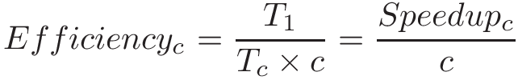

-   -   [11. Storage and the Memory
        Hierarchy](../C11-MemHierarchy/index.html){.nav-link}
        -   [11.1. The Memory
            Hierarchy](../C11-MemHierarchy/mem_hierarchy.html){.nav-link}
        -   [11.2. Storage
            Devices](../C11-MemHierarchy/devices.html){.nav-link}
        -   [11.3.
            Locality](../C11-MemHierarchy/locality.html){.nav-link}
        -   [11.4. Caching](../C11-MemHierarchy/caching.html){.nav-link}
        -   [11.5. Cache Analysis and
            Cachegrind](../C11-MemHierarchy/cachegrind.html){.nav-link}
        -   [11.6. Looking Ahead: Caching on Multicore
            Processors](../C11-MemHierarchy/coherency.html){.nav-link}
        -   [11.7. Summary](../C11-MemHierarchy/summary.html){.nav-link}
        -   [11.8.
            Exercises](../C11-MemHierarchy/exercises.html){.nav-link}

-   -   [12. Code Optimization](../C12-CodeOpt/index.html){.nav-link}
        -   [12.1. First Steps](../C12-CodeOpt/basic.html){.nav-link}
        -   [12.2. Other Compiler
            Optimizations](../C12-CodeOpt/loops_functions.html){.nav-link}
        -   [12.3. Memory
            Considerations](../C12-CodeOpt/memory_considerations.html){.nav-link}
        -   [12.4. Summary](../C12-CodeOpt/summary.html){.nav-link}

-   -   [13. The Operating System](../C13-OS/index.html){.nav-link}
        -   [13.1. Booting and Running](../C13-OS/impl.html){.nav-link}
        -   [13.2. Processes](../C13-OS/processes.html){.nav-link}
        -   [13.3. Virtual Memory](../C13-OS/vm.html){.nav-link}
        -   [13.4. Interprocess
            Communication](../C13-OS/ipc.html){.nav-link}
            -   [13.4.1. Signals](../C13-OS/ipc_signals.html){.nav-link}
            -   [13.4.2. Message
                Passing](../C13-OS/ipc_msging.html){.nav-link}
            -   [13.4.3. Shared
                Memory](../C13-OS/ipc_shm.html){.nav-link}
        -   [13.5. Summary and Other OS
            Functionality](../C13-OS/advanced.html){.nav-link}
        -   [13.6. Exercises](../C13-OS/exercises.html){.nav-link}

-   -   [14. Leveraging Shared Memory in the Multicore
        Era](index.html){.nav-link}
        -   [14.1. Programming Multicore
            Systems](multicore.html){.nav-link}
        -   [14.2. POSIX Threads](posix.html){.nav-link}
        -   [14.3. Synchronizing
            Threads](synchronization.html){.nav-link}
            -   [14.3.1. Mutual Exclusion](mutex.html){.nav-link}
            -   [14.3.2. Semaphores](semaphores.html){.nav-link}
            -   [14.3.3. Other Synchronization
                Constructs](other_syncs.html){.nav-link}
        -   [14.4. Measuring Parallel
            Performance](performance.html){.nav-link}
            -   [14.4.1. Parallel Performance
                Basics](performance_basics.html){.nav-link}
            -   [14.4.2. Advanced
                Topics](performance_advanced.html){.nav-link}
        -   [14.5. Cache Coherence](cache_coherence.html){.nav-link}
        -   [14.6. Thread Safety](thread_safety.html){.nav-link}
        -   [14.7. Implicit Threading with
            OpenMP](openmp.html){.nav-link}
        -   [14.8. Summary](summary.html){.nav-link}
        -   [14.9. Exercises](exercises.html){.nav-link}

-   -   [15. Looking Ahead: Other Parallel
        Systems](../C15-Parallel/index.html){.nav-link}
        -   [15.1. Hardware Acceleration and
            CUDA](../C15-Parallel/gpu.html){.nav-link}
        -   [15.2. Distributed Memory
            Systems](../C15-Parallel/distrmem.html){.nav-link}
        -   [15.3. To Exascale and
            Beyond](../C15-Parallel/cloud.html){.nav-link}

-   -   [16. Appendix 1: Chapter 1 for Java
        Programmers](../Appendix1/index.html){.nav-link}
        -   [16.1. Getting Started Programming in
            C](../Appendix1/getting_started.html){.nav-link}
        -   [16.2. Input/Output (printf and
            scanf)](../Appendix1/input_output.html){.nav-link}
        -   [16.3. Conditionals and
            Loops](../Appendix1/conditionals.html){.nav-link}
        -   [16.4. Functions](../Appendix1/functions.html){.nav-link}
        -   [16.5. Arrays and
            Strings](../Appendix1/arrays_strings.html){.nav-link}
        -   [16.6. Structs](../Appendix1/structs.html){.nav-link}
        -   [16.7. Summary](../Appendix1/summary.html){.nav-link}
        -   [16.8. Exercises](../Appendix1/exercises.html){.nav-link}

-   -   [17. Appendix 2: Using Unix](../Appendix2/index.html){.nav-link}
        -   [17.1. Unix Command Line and the Unix File
            System](../Appendix2/cmdln_basics.html){.nav-link}
        -   [17.2. Man and the Unix
            Manual](../Appendix2/man.html){.nav-link}
        -   [17.3. Remote Access](../Appendix2/ssh_scp.html){.nav-link}
        -   [17.4. Unix Editors](../Appendix2/editors.html){.nav-link}
        -   [17.5. make and
            Makefiles](../Appendix2/makefiles.html){.nav-link}
        -   [17.6 Searching: grep and
            find](../Appendix2/grep.html){.nav-link}
        -   [17.7 File Permissions](../Appendix2/chmod.html){.nav-link}
        -   [17.8 Archiving and Compressing
            Files](../Appendix2/tar.html){.nav-link}
        -   [17.9 Process Control](../Appendix2/pskill.html){.nav-link}
        -   [17.10 Timing](../Appendix2/timing.html){.nav-link}
        -   [17.11 Command
            History](../Appendix2/history.html){.nav-link}
        -   [17.12 I/0
            Redirection](../Appendix2/ioredirect.html){.nav-link}
        -   [17.13 Pipes](../Appendix2/pipe.html){.nav-link}
        -   [17.14 Dot Files and
            .bashrc](../Appendix2/dotfiles.html){.nav-link}
        -   [17.15 Shell
            Programming](../Appendix2/shellprog.html){.nav-link}
        -   [17.16 Getting System
            Information](../Appendix2/sysinfo.html){.nav-link}

-   [Dive Into Systems](../index-2.html)
-   [14. Leveraging Shared Memory in the Multicore Era](index.html)
-   [14.4. Measuring Parallel Performance](performance.html)
-   [14.4.1. Parallel Performance Basics](performance_basics.html)
:::

::: content
::: sect2
### {.anchor}14.4.1. Parallel Performance Basics {#_parallel_performance_basics}

::: sect3
#### {.anchor}Speedup {#_speedup}

::: paragraph
Suppose that a program takes T~*c*~ time to execute on *c* cores. Thus,
the serial version of the program would take T~1~ time.
:::

::: paragraph
The speedup of the program on *c* cores is then expressed by the
equation:
:::

::: imageblock
::: content

:::
:::

::: paragraph
If a serial program takes 60 seconds to execute, while its parallel
version takes 30 seconds on 2 cores, the corresponding speedup is 2.
Likewise if that program takes 15 seconds on 4 cores, the speedup is 4.
In an ideal scenario, a program running on *n* cores with *n* total
threads has a speedup of *n*.
:::

::: paragraph
If the speedup of a program is greater than 1, it indicates that the
parallelization yielded some improvement. If the speedup is less than 1,
then the parallel solution is in fact slower than the serial solution.
It is possible for a program to have a speedup greater than *n* (for
example, as a side effect of additional caches reducing accesses to
memory). Such cases are referred to as **superlinear speedup**.
:::
:::

::: sect3
#### {.anchor}Efficiency {#_efficiency}

::: paragraph
Speedup doesn't factor in the number of cores --- it is simply the ratio
of the serial time to the parallel time. For example, if a serial
program takes 60 seconds, but a parallel program takes 30 seconds on
four cores, it still gets a speedup of 2. However, that metric doesn't
capture the fact that it ran on four cores.
:::

::: paragraph
To measure the speedup per core, use efficiency:
:::

::: imageblock
::: content

:::
:::

::: paragraph
Efficiency typically varies from 0 to 1. An efficiency of 1 indicates
that the cores are being used perfectly. If efficiency is close to 0,
then there is little to no benefit to parallelism, as the additional
cores do not improve performance. If efficiency is greater than 1, it
indicates superlinear speedup.
:::

::: paragraph
Let's revisit the previous example, in which a serial program takes 60
seconds. If the parallel version takes 30 seconds on two cores, then its
efficiency is 1 (or 100%). If instead the program takes 30 seconds on
four cores, then the efficiency drops to 0.5 (or 50%).
:::
:::

::: sect3
#### {.anchor}Parallel Performance in the Real World {#_parallel_performance_in_the_real_world}

::: paragraph
In an ideal world, speedup is linear. For each additional compute unit,
a parallel program should achieve a commensurate amount of speedup.
However, this scenario rarely occurs in the real world. Most programs
contain a necessarily serial component that exists due to inherent
dependencies in the code. The longest set of dependencies in a program
is referred to as its **critical path**. Reducing the length of a
program's critical path is an important first step in its
parallelization. Thread synchronization points and (for programs running
on multiple compute nodes) communication overhead between processes are
other components in the code that can limit a program's parallel
performance.
:::

::: {.admonitionblock .warning}
+-----------------------------------+-----------------------------------+
|                                   | ::: title                         |
|                                   | Not all programs are good         |
|                                   | candidates for parallelism!       |
|                                   | :::                               |
|                                   |                                   |
|                                   | ::: paragraph                     |
|                                   | The length of the critical path   |
|                                   | can make some programs downright  |
|                                   | *hard* to parallelize. As an      |
|                                   | example, consider the problem of  |
|                                   | generating the \_n_th Fibonacci   |
|                                   | number. Since every Fibonacci     |
|                                   | number is dependent on the two    |
|                                   | before it, parallelizing this     |
|                                   | program efficiently is very       |
|                                   | difficult!                        |
|                                   | :::                               |
+-----------------------------------+-----------------------------------+
:::

::: paragraph
Consider the parallelization of the `countElems` function of the
CountSort algorithm from earlier in this chapter. In an ideal world, we
would expect the speedup of the program to be linear with respect to the
number of cores. However, let's measure its runtime (in this case,
running on a quad-core system with eight logical threads):
:::

::: listingblock
::: content
    $ ./countElems_p_v3 100000000 0 1
    Time for Step 1 is 0.331831 s

    $ ./countElems_p_v3 100000000 0 2
    Time for Step 1 is 0.197245 s

    $ ./countElems_p_v3 100000000 0 4
    Time for Step 1 is 0.140642 s

    $ ./countElems_p_v3 100000000 0 8
    Time for Step 1 is 0.107649 s
:::
:::

::: paragraph
[Table 1](#PerformanceBenchmarks) shows the speedup and efficiency for
these multithreaded executions:
:::

+-----------------+-----------------+-----------------+-----------------+
| Number of       | 2               | 4               | 8               |
| threads         |                 |                 |                 |
+=================+=================+=================+=================+
| Speedup         | 1.68            | 2.36            | 3.08            |
+-----------------+-----------------+-----------------+-----------------+
| Efficiency      | 0.84            | 0.59            | 0.39            |
+-----------------+-----------------+-----------------+-----------------+

: Table 1. Performance Benchmarks

::: paragraph
While we have 84% efficiency with two cores, the core efficiency falls
to 39% with eight cores. Notice that the ideal speedup of 8 was not met.
One reason for this is that the overhead of assigning work to threads
and the serial update to the `counts` array starts dominating
performance at higher numbers of threads. Second, resource contention by
the eight threads (remember this is a quad-core processor) reduces core
efficiency.
:::
:::

::: sect3
#### {.anchor}Amdahl's Law {#_amdahls_law}

::: paragraph
In 1967, Gene Amdahl, a leading computer architect at IBM, predicted
that the maximum speedup that a computer program can achieve is limited
by the size of its necessarily serial component (now referred to as
Amdahl's Law). More generally, Amdahl's Law states that for every
program, there is a component that can be sped up (i.e., the fraction of
a program that can be optimized or parallelized, *P*), and a component
that *cannot* be sped up (i.e., the fraction of a program that is
inherently serial, or *S*). Even if the time needed to execute the
optimizable or parallelizable component *P* is reduced to zero, the
serial component *S* will exist, and will come to eventually dominate
performance. Since *S* and *P* are fractions, note that *S* + *P* = 1.
:::

::: paragraph
Consider a program that executes on one core in time T~1~. Then, the
fraction of the program execution that is necessarily serial takes *S* ×
T~1~ time to run, and the parallelizable fraction of program execution
(*P* = 1 - *S*) takes *P* × T~1~ to run.
:::

::: paragraph
When the program executes on *c* cores, the serial fraction of the code
still takes *S* × T~1~ time to run (all other conditions being equal),
but the parallelizable fraction can be divided into *c* cores. Thus, the
maximum improvement for the parallel processor with *c* cores to run the
same job is:
:::

::: imageblock
::: content

:::
:::

::: paragraph
As *c* increases, the execution time on the parallel processor becomes
dominated by the serial fraction of the program.
:::

::: paragraph
To understand the impact of Amdahl's law, consider a program that is 90%
parallelizable and executes in 10 seconds on 1 core. In our equation,
the parallelizable component (*P*) is 0.9, while the serial component
(*S*) is 0.1. [Table 2](#TabAmdahl) depicts the corresponding total time
on *c* cores (T~*c*~) according to Amdahl's Law, and the associated
speedup.
:::

+-------------+-------------+-------------+-------------+-------------+
| Number of   | Serial time | Parallel    | Total Time  | Speedup     |
| cores       | (s)         | time (s)    | (T~*c*~ s)  | (over one   |
|             |             |             |             | core)       |
+=============+=============+=============+=============+=============+
| 1           | 1           | 9           | 10          | 1           |
+-------------+-------------+-------------+-------------+-------------+
| 10          | 1           | 0.9         | 1.9         | 5.26        |
+-------------+-------------+-------------+-------------+-------------+
| 100         | 1           | 0.09        | 1.09        | 9.17        |
+-------------+-------------+-------------+-------------+-------------+
| 1000        | 1           | 0.009       | 1.009       | 9.91        |
+-------------+-------------+-------------+-------------+-------------+

: Table 2. The Effect of Amdahl's Law on a 10-Second Program that is 90%
Parallelizable

::: paragraph
Observe that, over time, the serial component of the program begins to
dominate, and the effect of adding more and more cores seems to have
little to no effect.
:::

::: paragraph
A more formal way to look at this requires incorporating Amdahl's
calculation for T~*c*~ into the equation for speedup:
:::

::: imageblock
::: content

:::
:::

::: paragraph
Taking the limit of this equation shows that as the number of cores
(*c*) approaches infinity, speedup approaches 1/*S*. In the example
shown in [Table 2](#TabAmdahl), speedup approaches 1/0.1, or 10.
:::

::: paragraph
As another example, consider a program where *P* = 0.99. In other words,
99% of the program is parallelizable. As *c* approaches infinity, the
serial time starts to dominate the performance (in this example, *S* =
0.01). Thus, speedup approaches 1/0.01 or 100. In other words, even with
a million cores, the maximum speedup achievable by this program is only
100.
:::

::: sidebarblock
::: content
::: title
All is not lost: The limits of Amdahl's Law
:::

::: paragraph
When learning about Amdahl's Law, it's important to consider the
*intentions* of its originator, Gene Amdahl. In his own words, the law
was proposed to demonstrate \"*the continued validity of the single
processor approach, and the weakness of the multiple processor approach
in terms of application to real problems and their attendant
irregularities*^1^.\" In his 1967 paper Amdahl expanded on this concept,
writing: \"*For over a decade prophets have voiced the contention that
the organization of a single computer has reached its limits, and that
truly significant advances can be made only by interconnection of a
multiplicity of computers in such a manner as to permit cooperative
solution^1^.*\"
:::

::: paragraph
Subsequent work challenged some of the key assumptions made by Amdahl.
Read about the [Gustafson-Barsis
Law](performance_advanced.html#_gustafson_barsis_law){.page} for a
discussion on the limits of Amdahl's Law and a different argument on how
to think about the benefits of parallelism.
:::
:::
:::
:::

::: sect3
#### {.anchor}References {#_references}

::: {.olist .arabic}
1.  Gene Amdahl. \"Validity of the single processor approach to
    achieving large scale computing capabilities\" *Proceedings of the
    April 18-20, 1967, Spring Joint Computer Conference*. pp. 483---​485.
    ACM. 1967.
:::
:::
:::

::: toc-menu
:::
:::
:::
:::

Copyright (C) 2020 Dive into Systems, LLC.

*Dive into Systems,* is licensed under the Creative Commons
[Attribution-NonCommercial-NoDerivatives 4.0
International](https://creativecommons.org/licenses/by-nc-nd/4.0/) (CC
BY-NC-ND 4.0).
