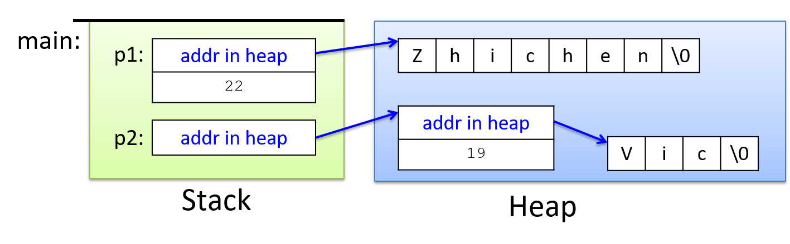

### [Dive Into Systems](../index-2.html) {#dive-into-systems .title}

-   -   [Dive Into Systems]{.nav-text}
        -   [Authors](../index-2.html){.nav-link}
        -   [Copyright](../copyright.html){.nav-link}
        -   [Acknowledgements](../acknowledgements.html){.nav-link}
        -   [Preface](../preface.html){.nav-link}
    -   [0. Introduction](../introduction.html){.nav-link}

-   -   [1. By the C, the Beautiful
        C](../C1-C_intro/index.html){.nav-link}
        -   [1.1. Getting Started Programming in
            C](../C1-C_intro/getting_started.html){.nav-link}
        -   [1.2. Input/Output (printf and
            scanf)](../C1-C_intro/input_output.html){.nav-link}
        -   [1.3. Conditionals and
            Loops](../C1-C_intro/conditionals.html){.nav-link}
        -   [1.4. Functions](../C1-C_intro/functions.html){.nav-link}
        -   [1.5. Arrays and
            Strings](../C1-C_intro/arrays_strings.html){.nav-link}
        -   [1.6. Structs](../C1-C_intro/structs.html){.nav-link}
        -   [1.7. Summary](../C1-C_intro/summary.html){.nav-link}
        -   [1.8. Exercises](../C1-C_intro/exercises.html){.nav-link}

-   -   [2. A Deeper Dive Into C](index.html){.nav-link}
        -   [2.1. Parts of Program Memory and
            Scope](scope_memory.html){.nav-link}
        -   [2.2. C Pointer Variables](pointers.html){.nav-link}
        -   [2.3. Pointers and
            Functions](pointers_functions.html){.nav-link}
        -   [2.4. Dynamic Memory
            Allocation](dynamic_memory.html){.nav-link}
        -   [2.5. Arrays in C](arrays.html){.nav-link}
        -   [2.6. Strings and the String
            Library](strings.html){.nav-link}
        -   [2.7. Structs](structs.html){.nav-link}
        -   [2.8. Input / Output in C](IO.html){.nav-link}
        -   [2.9. Advanced C Features](advanced.html){.nav-link}
            -   [2.9.1. Constants, switch, enum, and
                typedef](advanced_switch.html){.nav-link}
            -   [2.9.2. Command Line
                Arguments](advanced_cmd_line_args.html){.nav-link}
            -   [2.9.3. The void\*
                Type](advanced_voidstar.html){.nav-link}
            -   [2.9.4. Pointer
                Arithmetic](advanced_pointer_arithmetic.html){.nav-link}
            -   [2.9.5. C Libraries: Using, Compiling and
                Linking](advanced_libraries.html){.nav-link}
            -   [2.9.6. Writing and using your own C libraries (and
                compiling multiple .c and .h
                files)](advanced_writing_libraries.html){.nav-link}
            -   [2.9.7. Compiling C to Assembly and Compiling Assembly
                Code](advanced_assembly.html){.nav-link}
        -   [2.10. Summary](summary.html){.nav-link}
        -   [2.11. Exercises](exercises.html){.nav-link}

-   -   [3. C Debugging Tools](../C3-C_debug/index.html){.nav-link}
        -   [3.1. Debugging with GDB](../C3-C_debug/gdb.html){.nav-link}
        -   [3.2. GDB Commands in
            Detail](../C3-C_debug/gdb_commands.html){.nav-link}
        -   [3.3. Debugging Memory with
            Valgrind](../C3-C_debug/valgrind.html){.nav-link}
        -   [3.4. Advanced GDB
            Features](../C3-C_debug/gdb_advanced.html){.nav-link}
        -   [3.5. Debugging Assembly
            Code](../C3-C_debug/gdb_assembly.html){.nav-link}
        -   [3.6. Debugging Multi-threaded
            Programs](../C3-C_debug/gdb_pthreads.html){.nav-link}
        -   [3.7. Summary](../C3-C_debug/summary.html){.nav-link}

-   -   [11. Storage and the Memory
        Hierarchy](../C11-MemHierarchy/index.html){.nav-link}
        -   [11.1. The Memory
            Hierarchy](../C11-MemHierarchy/mem_hierarchy.html){.nav-link}
        -   [11.2. Storage
            Devices](../C11-MemHierarchy/devices.html){.nav-link}
        -   [11.3.
            Locality](../C11-MemHierarchy/locality.html){.nav-link}
        -   [11.4. Caching](../C11-MemHierarchy/caching.html){.nav-link}
        -   [11.5. Cache Analysis and
            Cachegrind](../C11-MemHierarchy/cachegrind.html){.nav-link}
        -   [11.6. Looking Ahead: Caching on Multicore
            Processors](../C11-MemHierarchy/coherency.html){.nav-link}
        -   [11.7. Summary](../C11-MemHierarchy/summary.html){.nav-link}
        -   [11.8.
            Exercises](../C11-MemHierarchy/exercises.html){.nav-link}

-   -   [12. Code Optimization](../C12-CodeOpt/index.html){.nav-link}
        -   [12.1. First Steps](../C12-CodeOpt/basic.html){.nav-link}
        -   [12.2. Other Compiler
            Optimizations](../C12-CodeOpt/loops_functions.html){.nav-link}
        -   [12.3. Memory
            Considerations](../C12-CodeOpt/memory_considerations.html){.nav-link}
        -   [12.4. Summary](../C12-CodeOpt/summary.html){.nav-link}

-   -   [13. The Operating System](../C13-OS/index.html){.nav-link}
        -   [13.1. Booting and Running](../C13-OS/impl.html){.nav-link}
        -   [13.2. Processes](../C13-OS/processes.html){.nav-link}
        -   [13.3. Virtual Memory](../C13-OS/vm.html){.nav-link}
        -   [13.4. Interprocess
            Communication](../C13-OS/ipc.html){.nav-link}
            -   [13.4.1. Signals](../C13-OS/ipc_signals.html){.nav-link}
            -   [13.4.2. Message
                Passing](../C13-OS/ipc_msging.html){.nav-link}
            -   [13.4.3. Shared
                Memory](../C13-OS/ipc_shm.html){.nav-link}
        -   [13.5. Summary and Other OS
            Functionality](../C13-OS/advanced.html){.nav-link}
        -   [13.6. Exercises](../C13-OS/exercises.html){.nav-link}

-   -   [14. Leveraging Shared Memory in the Multicore
        Era](../C14-SharedMemory/index.html){.nav-link}
        -   [14.1. Programming Multicore
            Systems](../C14-SharedMemory/multicore.html){.nav-link}
        -   [14.2. POSIX
            Threads](../C14-SharedMemory/posix.html){.nav-link}
        -   [14.3. Synchronizing
            Threads](../C14-SharedMemory/synchronization.html){.nav-link}
            -   [14.3.1. Mutual
                Exclusion](../C14-SharedMemory/mutex.html){.nav-link}
            -   [14.3.2.
                Semaphores](../C14-SharedMemory/semaphores.html){.nav-link}
            -   [14.3.3. Other Synchronization
                Constructs](../C14-SharedMemory/other_syncs.html){.nav-link}
        -   [14.4. Measuring Parallel
            Performance](../C14-SharedMemory/performance.html){.nav-link}
            -   [14.4.1. Parallel Performance
                Basics](../C14-SharedMemory/performance_basics.html){.nav-link}
            -   [14.4.2. Advanced
                Topics](../C14-SharedMemory/performance_advanced.html){.nav-link}
        -   [14.5. Cache
            Coherence](../C14-SharedMemory/cache_coherence.html){.nav-link}
        -   [14.6. Thread
            Safety](../C14-SharedMemory/thread_safety.html){.nav-link}
        -   [14.7. Implicit Threading with
            OpenMP](../C14-SharedMemory/openmp.html){.nav-link}
        -   [14.8. Summary](../C14-SharedMemory/summary.html){.nav-link}
        -   [14.9.
            Exercises](../C14-SharedMemory/exercises.html){.nav-link}

-   -   [15. Looking Ahead: Other Parallel
        Systems](../C15-Parallel/index.html){.nav-link}
        -   [15.1. Hardware Acceleration and
            CUDA](../C15-Parallel/gpu.html){.nav-link}
        -   [15.2. Distributed Memory
            Systems](../C15-Parallel/distrmem.html){.nav-link}
        -   [15.3. To Exascale and
            Beyond](../C15-Parallel/cloud.html){.nav-link}

-   -   [16. Appendix 1: Chapter 1 for Java
        Programmers](../Appendix1/index.html){.nav-link}
        -   [16.1. Getting Started Programming in
            C](../Appendix1/getting_started.html){.nav-link}
        -   [16.2. Input/Output (printf and
            scanf)](../Appendix1/input_output.html){.nav-link}
        -   [16.3. Conditionals and
            Loops](../Appendix1/conditionals.html){.nav-link}
        -   [16.4. Functions](../Appendix1/functions.html){.nav-link}
        -   [16.5. Arrays and
            Strings](../Appendix1/arrays_strings.html){.nav-link}
        -   [16.6. Structs](../Appendix1/structs.html){.nav-link}
        -   [16.7. Summary](../Appendix1/summary.html){.nav-link}
        -   [16.8. Exercises](../Appendix1/exercises.html){.nav-link}

-   -   [17. Appendix 2: Using Unix](../Appendix2/index.html){.nav-link}
        -   [17.1. Unix Command Line and the Unix File
            System](../Appendix2/cmdln_basics.html){.nav-link}
        -   [17.2. Man and the Unix
            Manual](../Appendix2/man.html){.nav-link}
        -   [17.3. Remote Access](../Appendix2/ssh_scp.html){.nav-link}
        -   [17.4. Unix Editors](../Appendix2/editors.html){.nav-link}
        -   [17.5. make and
            Makefiles](../Appendix2/makefiles.html){.nav-link}
        -   [17.6 Searching: grep and
            find](../Appendix2/grep.html){.nav-link}
        -   [17.7 File Permissions](../Appendix2/chmod.html){.nav-link}
        -   [17.8 Archiving and Compressing
            Files](../Appendix2/tar.html){.nav-link}
        -   [17.9 Process Control](../Appendix2/pskill.html){.nav-link}
        -   [17.10 Timing](../Appendix2/timing.html){.nav-link}
        -   [17.11 Command
            History](../Appendix2/history.html){.nav-link}
        -   [17.12 I/0
            Redirection](../Appendix2/ioredirect.html){.nav-link}
        -   [17.13 Pipes](../Appendix2/pipe.html){.nav-link}
        -   [17.14 Dot Files and
            .bashrc](../Appendix2/dotfiles.html){.nav-link}
        -   [17.15 Shell
            Programming](../Appendix2/shellprog.html){.nav-link}
        -   [17.16 Getting System
            Information](../Appendix2/sysinfo.html){.nav-link}


-   [Dive Into Systems](../index-2.html)
-   [2. A Deeper Dive Into C](index.html)
-   [2.7. Structs](structs.html)
:::

::: content
::: sect1
## [](#_c_structs){.anchor}2.7. C Structs {#_c_structs}

::: sectionbody
::: paragraph
In the previous chapter we introduced [C struct
types](../C1-C_intro/structs.html#_structs){.page}. In this chapter we
dive deeper into C structs, examine statically and dynamically allocated
structs, and combine structs and pointers to create more complex data
types and data structures.
:::

::: paragraph
We begin with a quick overview of statically declared structs. See the
previous chapter for more details.
:::

::: sect2
### [](#_review_of_the_c_struct_type){.anchor}2.7.1. Review of the C struct Type {#_review_of_the_c_struct_type}

::: paragraph
A **struct** type represents a heterogeneous collection of data; it's a
mechanism for treating a set of different types as a single, coherent
unit.
:::

::: paragraph
There are three steps to defining and using `struct` types in C
programs:
:::

::: {.olist .arabic}
1.  Define a `struct` type that defines the field values and their
    types.

2.  Declare variables of the `struct` type.

3.  Use *dot notation* to access individual field values in the
    variable.
:::

::: paragraph
In C, structs are [lvalues](../C1-C_intro/structs.html#_lvalues){.page}
(they can appear on the left-hand side of an assignment statement). The
value of a `struct` variable is the contents of its memory (all of the
bytes making up its field values). When calling functions with `struct`
parameters, the value of the `struct` argument (a copy of all of the
bytes of all of its fields) gets copied to the `struct` function
parameter.
:::

::: paragraph
When programming with structs, and in particular when combining structs
and arrays, it's critical to carefully consider the type of every
expression. Each field in a `struct` represents a specific type, and the
syntax for accessing field values and the semantics of passing
individual field values to functions follow those of their specific
type.
:::

::: paragraph
The following [full example program](_attachments/struct_review.c)
demonstrates defining a `struct` type, declaring variables of that type,
accessing field values, and passing structs and individual field values
to functions. (We omit some error handling and comments for
readability).
:::

::: listingblock
::: content
``` {.highlightjs .highlight}
#include <stdio.h>
#include <string.h>

/* define a new struct type (outside function bodies) */
struct studentT {
    char  name[64];
    int   age;
    float gpa;
    int   grad_yr;
};

/* function prototypes */
int checkID(struct studentT s1, int min_age);
void changeName(char *old, char *new);

int main(void) {
    int can_vote;
    // declare variables of struct type:
    struct studentT student1, student2;

    // access field values using .
    strcpy(student1.name, "Ruth");
    student1.age = 17;
    student1.gpa = 3.5;
    student1.grad_yr = 2021;

    // structs are lvalues
    student2 = student1;
    strcpy(student2.name, "Frances");
    student2.age = student1.age + 4;

    // passing a struct
    can_vote = checkID(student1, 18);
    printf("%s %d\n", student1.name, can_vote);

    can_vote = checkID(student2, 18);
    printf("%s %d\n", student2.name, can_vote);

    // passing a struct field value
    changeName(student2.name, "Kwame");
    printf("student 2's name is now %s\n", student2.name);

    return 0;
}

int checkID(struct studentT s, int min_age) {
    int ret = 1;

    if (s.age < min_age) {
        ret = 0;
        // changes age field IN PARAMETER COPY ONLY
        s.age = min_age + 1;
    }
    return ret;
}

void changeName(char *old, char *new) {
    if ((old == NULL) || (new == NULL)) {
        return;
    }
    strcpy(old,new);
}
```
:::
:::

::: paragraph
When run, the program produces:
:::

::: listingblock
::: content
    Ruth 0
    Frances 1
    student 2's name is now Kwame
:::
:::

::: paragraph
When working with structs, it's particularly important to think about
the types of the `struct` and its fields. For example, when passing a
`struct` to a function, the parameter gets a copy of the struct's value
(a copy of all bytes from the argument). Consequently, changes to the
parameter's field values *do not* change the argument's value. This
behavior is illustrated in the preceding program in the call to
`checkID`, which modifies the parameter's age field. The changes in
`checkID` have no effect on the corresponding argument's age field
value.
:::

::: paragraph
When passing a field of a `struct` to a function, the semantics match
the type of the field (the type of the function's parameter). For
example, in the call to `changeName`, the value of the `name` field (the
base address of the `name` array inside the `student2` struct) gets
copied to the parameter `old`, meaning that the parameter refers to the
same set of array elements in memory as its argument. Thus, changing an
element of the array in the function also changes the element's value in
the argument; the semantics of passing the `name` field match the type
of the `name` field.
:::
:::

::: sect2
### [](#_pointers_and_structs){.anchor}2.7.2. Pointers and Structs {#_pointers_and_structs}

::: paragraph
Just like other C types, programmers can declare a variable as a pointer
to a user-defined `struct` type. The semantics of using a `struct`
pointer variable resemble those of other pointer types such as `int *`.
:::

::: paragraph
Consider the `struct studentT` type introduced in the previous program
example:
:::

::: listingblock
::: content
``` {.highlightjs .highlight}
struct studentT {
    char  name[64];
    int   age;
    float gpa;
    int   grad_yr;
};
```
:::
:::

::: paragraph
A programmer can declare variables of type `struct studentT` or
`struct studentT *` (a pointer to a `struct studentT`):
:::

::: listingblock
::: content
``` {.highlightjs .highlight}
struct studentT s;
struct studentT *sptr;

// think very carefully about the type of each field when
// accessing it (name is an array of char, age is an int ...)
strcpy(s.name, "Freya");
s.age = 18;
s.gpa = 4.0;
s.grad_yr = 2020;

// malloc space for a struct studentT for sptr to point to:
sptr = malloc(sizeof(struct studentT));
if (sptr == NULL) {
    printf("Error: malloc failed\n");
    exit(1);
}
```
:::
:::

::: paragraph
Note that the call to `malloc` initializes `sptr` to point to a
dynamically allocated struct in heap memory. Using the `sizeof` operator
to compute `` malloc’s size request (e.g., `sizeof(struct studentT) ``)
ensures that `malloc` allocates space for *all* of the field values in
the struct.
:::

::: paragraph
To access individual fields in a pointer to a `struct`, the pointer
variable first needs to be **dereferenced**. Based on the rules for
[pointer dereferencing](pointers.html#_pointer_variables){.page}, you
may be tempted to access `struct` fields like so:
:::

::: listingblock
::: content
``` {.highlightjs .highlight}
// the grad_yr field of what sptr points to gets 2021:
(*sptr).grad_yr = 2021;

// the age field of what sptr points to gets s.age plus 1:
(*sptr).age = s.age + 1;
```
:::
:::

::: paragraph
However, because pointers to structs are so commonly used, C provides a
special operator (`→`) that both dereferences a `struct` and accesses
one of its field values. For example, `sptr→year` is equivalent to
`(*sptr).year`. Here are some examples of accessing field values using
this notation:
:::

::: listingblock
::: content
``` {.highlightjs .highlight}
// the gpa field of what sptr points to gets 3.5:
sptr->gpa = 3.5;

// the name field of what sptr points to is a char *
// (can use strcpy to init its value):
strcpy(sptr->name, "Lars");
```
:::
:::

::: paragraph
[Figure 1](#FigStructPointer) sketches what the variables `s` and `sptr`
may look like in memory after the code above executes. Recall that
`malloc` allocates memory from the heap, and local variables are
allocated on the stack.
:::

::: {#FigStructPointer .imageblock}
::: content

:::

::: title
Figure 1. The differences in memory layout between a statically
allocated struct (data on the stack) and a dynamically allocated struct
(data on the heap).
:::
:::
:::

::: sect2
### [](#_pointer_fields_in_structs){.anchor}2.7.3. Pointer Fields in Structs {#_pointer_fields_in_structs}

::: paragraph
Structs can also be defined to have pointer types as field values. For
example:
:::

::: listingblock
::: content
``` {.highlightjs .highlight}
struct personT {
    char *name;     // for a dynamically allocated string field
    int  age;
};

int main(void) {
    struct personT p1, *p2;

    // need to malloc space for the name field:
    p1.name = malloc(sizeof(char) * 8);
    strcpy(p1.name, "Zhichen");
    p1.age = 22;


    // first malloc space for the struct:
    p2 = malloc(sizeof(struct personT));

    // then malloc space for the name field:
    p2->name = malloc(sizeof(char) * 4);
    strcpy(p2->name, "Vic");
    p2->age = 19;
    ...

    // Note: for strings, we must allocate one extra byte to hold the
    // terminating null character that marks the end of the string.
}
```
:::
:::

::: paragraph
In memory, these variables will look like [Figure
2](#FigStructPointerField) (note which parts are allocated on the stack
and which are on the heap).
:::

::: {#FigStructPointerField .imageblock}
::: content

:::

::: title
Figure 2. The layout in memory of a struct with a pointer field.
:::
:::

::: paragraph
As structs and the types of their fields increase in complexity, be
careful with their syntax. To access field values appropriately, start
from the outermost variable type and use its type syntax to access
individual parts. For example, the types of the `struct` variables shown
in [Table 1](#TabStructFields) govern how a programmer should access
their fields.
:::

+----------------------+----------------------+-----------------------+
| Expression           | Type                 | Field Access Syntax   |
+======================+======================+=======================+
| ::: literal          | ::: literal          | ::: literal           |
|      p1              |      struct personT  |      p1.age, p1.name  |
| :::                  | :::                  | :::                   |
+----------------------+----------------------+-----------------------+
| ::: literal          | ::: literal          | ::: literal           |
|      p2              |                      |                       |
| :::                  |     struct personT * |     p2->age, p2->name |
|                      | :::                  | :::                   |
+----------------------+----------------------+-----------------------+

: Table 1. Struct field access examples

::: paragraph
Further, knowing the types of field values allows a program to use the
correct syntax in accessing them, as shown by the examples in [Table
2](#TabStructFieldAccess).
:::

+----------------------+----------------------+-----------------------+
| Expression           | Type                 | Example Access Syntax |
+======================+======================+=======================+
| ::: literal          | ::: literal          | ::: literal           |
|      p1.age          |      int             |      p1.age = 18;     |
| :::                  | :::                  | :::                   |
+----------------------+----------------------+-----------------------+
| ::: literal          | ::: literal          | ::: literal           |
|      p2->age         |      int             |      p2->age = 18;    |
| :::                  | :::                  | :::                   |
+----------------------+----------------------+-----------------------+
| ::: literal          | ::: literal          | ::: literal           |
|      p1.name         |      char *          |      p                |
| :::                  | :::                  | rintf("%s", p1.name); |
|                      |                      | :::                   |
+----------------------+----------------------+-----------------------+
| ::: literal          | ::: literal          | ::: literal           |
|      p2->name        |      char *          |      pr               |
| :::                  | :::                  | intf("%s", p2->name); |
|                      |                      | :::                   |
+----------------------+----------------------+-----------------------+
| ::: literal          | ::: literal          | ::: literal           |
|      p1.name[2]      |      char            |                       |
| :::                  | :::                  |     p1.name[2] = 'a'; |
|                      |                      | :::                   |
+----------------------+----------------------+-----------------------+
| ::: literal          | ::: literal          | ::: literal           |
|      p2->name[2]     |      char            |                       |
| :::                  | :::                  |    p2->name[2] = 'a'; |
|                      |                      | :::                   |
+----------------------+----------------------+-----------------------+

: Table 2. Accessing different struct field types

::: paragraph
In examining the last example, start by considering the type of the
outermost variable (`p2` is a pointer to a `struct personT`). Therefore,
to access a field value in the struct, the programmer needs to use `→`
syntax (`p2→name`). Next, consider the type of the `name` field, which
is a `char *`, used in this program to point to an array of `char`
values. To access a specific `char` storage location through the `name`
field, use array indexing notation: `p2→name[2] = 'a'`.
:::
:::

::: sect2
### [](#_arrays_of_structs){.anchor}2.7.4. Arrays of Structs {#_arrays_of_structs}

::: paragraph
Arrays, pointers, and structs can be combined to create more complex
data structures. Here are some examples of declaring variables of
different types of arrays of structs:
:::

::: listingblock
::: content
``` {.highlightjs .highlight}
struct studentT classroom1[40];   // an array of 40 struct studentT

struct studentT *classroom2;      // a pointer to a struct studentT
                                  // (for a dynamically allocated array)

struct studentT *classroom3[40];  // an array of 40 struct studentT *
                                  // (each element stores a (struct studentT *)
```
:::
:::

::: paragraph
Again, thinking very carefully about variable and field types is
necessary for understanding the syntax and semantics of using these
variables in a program. Here are some examples of the correct syntax for
accessing these variables:
:::

::: listingblock
::: content
``` {.highlightjs .highlight}
// classroom1 is an array:
//    use indexing to access a particular element
//    each element in classroom1 stores a struct studentT:
//    use dot notation to access fields
classroom1[3].age = 21;

// classroom2 is a pointer to a struct studentT
//    call malloc to dynamically allocate an array
//    of 15 studentT structs for it to point to:
classroom2 = malloc(sizeof(struct studentT) * 15);

// each element in array pointed to by classroom2 is a studentT struct
//    use [] notation to access an element of the array, and dot notation
//    to access a particular field value of the struct at that index:
classroom2[3].year = 2013;

// classroom3 is an array of struct studentT *
//    use [] notation to access a particular element
//    call malloc to dynamically allocate a struct for it to point to
classroom3[5] = malloc(sizeof(struct studentT));

// access fields of the struct using -> notation
// set the age field pointed to in element 5 of the classroom3 array to 21
classroom3[5]->age = 21;
```
:::
:::

::: paragraph
A function that takes an array of type `struct studentT` as a parameter
might look like this:
:::

::: listingblock
::: content
``` {.highlightjs .highlight}
void updateAges(struct studentT *classroom, int size) {
    int i;

    for (i = 0; i < size; i++) {
        classroom[i].age += 1;
    }
}
```
:::
:::

::: paragraph
A program could pass this function either a statically or dynamically
allocated array of `struct studentT`:
:::

::: listingblock
::: content
``` {.highlightjs .highlight}
updateAges(classroom1, 40);
updateAges(classroom2, 15);
```
:::
:::

::: paragraph
The semantics of passing `classroom1` (or `classroom2`) to `updateAges`
match the semantics of passing a statically declared (or dynamically
allocated) array to a function: the parameter refers to the same set of
elements as the argument, and thus changes to the array's values within
the function affect the argument's elements.
:::

::: paragraph
[Figure 3](#FigArrayStructFuncs) shows what the stack might look like
for the second call to the `updateAges` function (showing the passed
`classroom2` array with example field values for the struct in each of
its elements).
:::

::: {#FigArrayStructFuncs .imageblock}
::: content

:::

::: title
Figure 3. The memory layout of an array of struct studentT passed to a
function.
:::
:::

::: paragraph
As always, the parameter gets a copy of the value of its argument (the
memory address of the array in heap memory). Thus, modifying the array's
elements in the function will persist to its argument's values (both the
parameter and the argument refer to the same array in memory).
:::

::: paragraph
The `updateAges` function cannot be passed the `classroom3` array
because its type is not the same as the parameter's type: `classroom3`
is an array of `struct studentT *`, not an array of `struct studentT`.
:::
:::

::: sect2
### [](#_self_referential_structs){.anchor}2.7.5. Self-Referential Structs {#_self_referential_structs}

::: paragraph
A struct can be defined with fields whose type is a pointer to the same
`struct` type. These self-referential `struct` types can be used to
build linked implementations of data structures, such as linked lists,
trees, and graphs.
:::

::: paragraph
The details of these data types and their linked implementations are
beyond the scope of this book. However, we briefly show one example of
how to define and use a self-referential `struct` type to create a
linked list in C. Refer to a textbook on data structures and algorithms
for more information about linked lists.
:::

::: paragraph
A **linked list** is one way to implement a **list abstract data type**.
A list represents a sequence of elements that are ordered by their
position in the list. In C, a list data structure could be implemented
as an array or as a linked list using a self-referential `struct` type
for storing individual nodes in the list.
:::

::: paragraph
To build the latter, a programmer would define a `node` struct to
contain one list element and a link to the next node in the list. Here's
an example that could store a linked list of integer values:
:::

::: listingblock
::: content
``` {.highlightjs .highlight}
struct node {
    int data;           // used to store a list element's data value
    struct node *next;  // used to point to the next node in the list
};
```
:::
:::

::: paragraph
Instances of this `struct` type can be linked together through the
`next` field to create a linked list.
:::

::: paragraph
This example code snippet creates a linked list containing three
elements (the list itself is referred to by the `head` variable that
points to the first node in the list):
:::

::: listingblock
::: content
``` {.highlightjs .highlight}
struct node *head, *temp;
int i;

head = NULL;  // an empty linked list

head = malloc(sizeof(struct node));  // allocate a node
if (head == NULL) {
    printf("Error malloc\n");
    exit(1);
}
head->data = 10;    // set the data field
head->next = NULL;  // set next to NULL (there is no next element)

// add 2 more nodes to the head of the list:
for (i = 0; i < 2; i++) {
    temp = malloc(sizeof(struct node));  // allocate a node
    if (temp == NULL) {
        printf("Error malloc\n");
        exit(1);
    }
    temp->data = i;     // set data field
    temp->next = head;  // set next to point to current first node
    head = temp;        // change head to point to newly added node
}
```
:::
:::

::: paragraph
Note that the `temp` variable temporarily points to a malloc'ed `node`
that gets initialized and then added to the beginning of the list by
setting its `next` field to point to the node currently pointed to by
`head`, and then by changing the `head` to point to this new node.
:::

::: paragraph
The result of executing this code would look like [Figure
4](#FigLinkedList) in memory.
:::

::: {#FigLinkedList .imageblock .text-center}
::: content
{width="700"}
:::

::: title
Figure 4. The layout in memory of three example linked list nodes.
:::
:::
:::
:::
:::

::: toc-menu
:::
:::
:::
:::

Copyright (C) 2020 Dive into Systems, LLC.

*Dive into Systems,* is licensed under the Creative Commons
[Attribution-NonCommercial-NoDerivatives 4.0
International](https://creativecommons.org/licenses/by-nc-nd/4.0/) (CC
BY-NC-ND 4.0).
