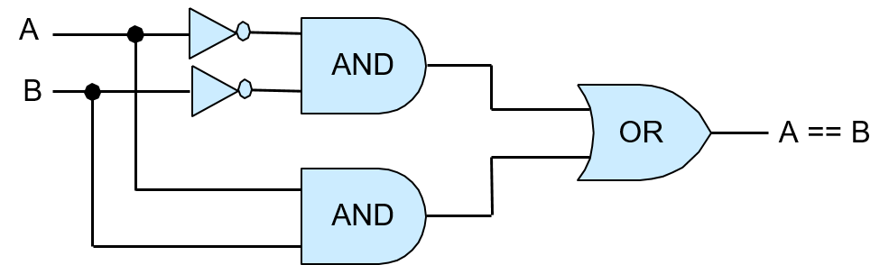
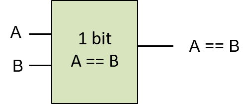
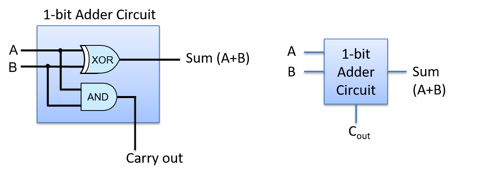

-   -   [4. Binary and Data
        Representation](../C4-Binary/index.html){.nav-link}
        -   [4.1. Number Bases and Unsigned
            Integers](../C4-Binary/bases.html){.nav-link}
        -   [4.2. Converting Between
            Bases](../C4-Binary/conversion.html){.nav-link}
        -   [4.3. Signed Binary
            Integers](../C4-Binary/signed.html){.nav-link}
        -   [4.4. Binary Integer
            Arithmetic](../C4-Binary/arithmetic.html){.nav-link}
            -   [4.4.1.
                Addition](../C4-Binary/arithmetic_addition.html){.nav-link}
            -   [4.4.2.
                Subtraction](../C4-Binary/arithmetic_subtraction.html){.nav-link}
            -   [4.4.3. Multiplication &
                Division](../C4-Binary/arithmetic_mult_div.html){.nav-link}
        -   [4.5. Overflow](../C4-Binary/overflow.html){.nav-link}
        -   [4.6. Bitwise
            Operators](../C4-Binary/bitwise.html){.nav-link}
        -   [4.7. Integer Byte
            Order](../C4-Binary/byte_order.html){.nav-link}
        -   [4.8. Real Numbers in
            Binary](../C4-Binary/floating_point.html){.nav-link}
        -   [4.9. Summary](../C4-Binary/summary.html){.nav-link}
        -   [4.10. Exercises](../C4-Binary/exercises.html){.nav-link}

-   -   [5. What von Neumann Knew: Computer
        Architecture](index.html){.nav-link}
        -   [5.1. The Origins of Modern Computing](hist.html){.nav-link}
        -   [5.2. The von Neumann Architecture](von.html){.nav-link}
        -   [5.3. Logic Gates](gates.html){.nav-link}
        -   [5.4. Circuits](circuits.html){.nav-link}
            -   [5.4.1. Arithmetic and Logic
                Circuits](arithlogiccircs.html){.nav-link}
            -   [5.4.2. Control Circuits](controlcircs.html){.nav-link}
            -   [5.4.3. Storage Circuits](storagecircs.html){.nav-link}
        -   [5.5. Building a Processor](cpu.html){.nav-link}
        -   [5.6. The Processor's Execution of Program
            Instructions](instrexec.html){.nav-link}
        -   [5.7. Pipelining Instruction
            Execution](pipelining.html){.nav-link}
        -   [5.8. Advanced Pipelining
            Considerations](pipelining_advanced.html){.nav-link}
        -   [5.9. Looking Ahead: CPUs Today](modern.html){.nav-link}
        -   [5.10. Summary](summary.html){.nav-link}
        -   [5.11. Exercises](exercises.html){.nav-link}

-   -   [6. Under the C: Dive into
        Assembly](../C6-asm_intro/index.html){.nav-link}

-   -   [7. 64-bit x86 Assembly](../C7-x86_64/index.html){.nav-link}
        -   [7.1. Assembly Basics](../C7-x86_64/basics.html){.nav-link}
        -   [7.2. Common
            Instructions](../C7-x86_64/common.html){.nav-link}
        -   [7.3. Additional Arithmetic
            Instructions](../C7-x86_64/arithmetic.html){.nav-link}
        -   [7.4. Conditional Control and
            Loops](../C7-x86_64/conditional_control_loops.html){.nav-link}
            -   [7.4.1.
                Preliminaries](../C7-x86_64/preliminaries.html){.nav-link}
            -   [7.4.2. If
                Statements](../C7-x86_64/if_statements.html){.nav-link}
            -   [7.4.3. Loops](../C7-x86_64/loops.html){.nav-link}
        -   [7.5. Functions in
            Assembly](../C7-x86_64/functions.html){.nav-link}
        -   [7.6. Recursion](../C7-x86_64/recursion.html){.nav-link}
        -   [7.7. Arrays in
            Assembly](../C7-x86_64/arrays.html){.nav-link}
        -   [7.8. Matrices in
            Assembly](../C7-x86_64/matrices.html){.nav-link}
        -   [7.9. Structs in
            Assembly](../C7-x86_64/structs.html){.nav-link}
        -   [7.10. Buffer
            Overflows](../C7-x86_64/buffer_overflow.html){.nav-link}
        -   [7.11. Exercises](../C7-x86_64/exercises.html){.nav-link}

-   -   [8. 32-bit x86 Assembly](../C8-IA32/index.html){.nav-link}
        -   [8.1. Assembly Basics](../C8-IA32/basics.html){.nav-link}
        -   [8.2. Common
            Instructions](../C8-IA32/common.html){.nav-link}
        -   [8.3. Additional Arithmetic
            Instructions](../C8-IA32/arithmetic.html){.nav-link}
        -   [8.4. Conditional Control and
            Loops](../C8-IA32/conditional_control_loops.html){.nav-link}
            -   [8.4.1.
                Preliminaries](../C8-IA32/preliminaries.html){.nav-link}
            -   [8.4.2. If
                Statements](../C8-IA32/if_statements.html){.nav-link}
            -   [8.4.3. Loops](../C8-IA32/loops.html){.nav-link}
        -   [8.5. Functions in
            Assembly](../C8-IA32/functions.html){.nav-link}
        -   [8.6. Recursion](../C8-IA32/recursion.html){.nav-link}
        -   [8.7. Arrays in Assembly](../C8-IA32/arrays.html){.nav-link}
        -   [8.8. Matrices in
            Assembly](../C8-IA32/matrices.html){.nav-link}
        -   [8.9. Structs in
            Assembly](../C8-IA32/structs.html){.nav-link}
        -   [8.10. Buffer
            Overflows](../C8-IA32/buffer_overflow.html){.nav-link}
        -   [8.11. Exercises](../C8-IA32/exercises.html){.nav-link}

-   -   [9. ARMv8 Assembly](../C9-ARM64/index.html){.nav-link}
        -   [9.1. Assembly Basics](../C9-ARM64/basics.html){.nav-link}
        -   [9.2. Common
            Instructions](../C9-ARM64/common.html){.nav-link}
        -   [9.3. Arithmetic
            Instructions](../C9-ARM64/arithmetic.html){.nav-link}
        -   [9.4. Conditional Control and
            Loops](../C9-ARM64/conditional_control_loops.html){.nav-link}
            -   [9.4.1.
                Preliminaries](../C9-ARM64/preliminaries.html){.nav-link}
            -   [9.4.2. If
                Statements](../C9-ARM64/if_statements.html){.nav-link}
            -   [9.4.3. Loops](../C9-ARM64/loops.html){.nav-link}
        -   [9.5. Functions in
            Assembly](../C9-ARM64/functions.html){.nav-link}
        -   [9.6. Recursion](../C9-ARM64/recursion.html){.nav-link}
        -   [9.7. Arrays in
            Assembly](../C9-ARM64/arrays.html){.nav-link}
        -   [9.8. Matrices in
            Assembly](../C9-ARM64/matrices.html){.nav-link}
        -   [9.9. Structs in
            Assembly](../C9-ARM64/structs.html){.nav-link}
        -   [9.10. Buffer
            Overflows](../C9-ARM64/buffer_overflow.html){.nav-link}
        -   [9.11. Exercises](../C9-ARM64/exercises.html){.nav-link}

-   -   [10. Key Assembly
        Takeaways](../C10-asm_takeaways/index.html){.nav-link}

-   -   [11. Storage and the Memory
        Hierarchy](../C11-MemHierarchy/index.html){.nav-link}
        -   [11.1. The Memory
            Hierarchy](../C11-MemHierarchy/mem_hierarchy.html){.nav-link}
        -   [11.2. Storage
            Devices](../C11-MemHierarchy/devices.html){.nav-link}
        -   [11.3.
            Locality](../C11-MemHierarchy/locality.html){.nav-link}
        -   [11.4. Caching](../C11-MemHierarchy/caching.html){.nav-link}
        -   [11.5. Cache Analysis and
            Cachegrind](../C11-MemHierarchy/cachegrind.html){.nav-link}
        -   [11.6. Looking Ahead: Caching on Multicore
            Processors](../C11-MemHierarchy/coherency.html){.nav-link}
        -   [11.7. Summary](../C11-MemHierarchy/summary.html){.nav-link}
        -   [11.8.
            Exercises](../C11-MemHierarchy/exercises.html){.nav-link}

-   -   [12. Code Optimization](../C12-CodeOpt/index.html){.nav-link}
        -   [12.1. First Steps](../C12-CodeOpt/basic.html){.nav-link}
        -   [12.2. Other Compiler
            Optimizations](../C12-CodeOpt/loops_functions.html){.nav-link}
        -   [12.3. Memory
            Considerations](../C12-CodeOpt/memory_considerations.html){.nav-link}
        -   [12.4. Summary](../C12-CodeOpt/summary.html){.nav-link}

-   -   [13. The Operating System](../C13-OS/index.html){.nav-link}
        -   [13.1. Booting and Running](../C13-OS/impl.html){.nav-link}
        -   [13.2. Processes](../C13-OS/processes.html){.nav-link}
        -   [13.3. Virtual Memory](../C13-OS/vm.html){.nav-link}
        -   [13.4. Interprocess
            Communication](../C13-OS/ipc.html){.nav-link}
            -   [13.4.1. Signals](../C13-OS/ipc_signals.html){.nav-link}
            -   [13.4.2. Message
                Passing](../C13-OS/ipc_msging.html){.nav-link}
            -   [13.4.3. Shared
                Memory](../C13-OS/ipc_shm.html){.nav-link}
        -   [13.5. Summary and Other OS
            Functionality](../C13-OS/advanced.html){.nav-link}
        -   [13.6. Exercises](../C13-OS/exercises.html){.nav-link}

-   -   [14. Leveraging Shared Memory in the Multicore
        Era](../C14-SharedMemory/index.html){.nav-link}
        -   [14.1. Programming Multicore
            Systems](../C14-SharedMemory/multicore.html){.nav-link}
        -   [14.2. POSIX
            Threads](../C14-SharedMemory/posix.html){.nav-link}
        -   [14.3. Synchronizing
            Threads](../C14-SharedMemory/synchronization.html){.nav-link}
            -   [14.3.1. Mutual
                Exclusion](../C14-SharedMemory/mutex.html){.nav-link}
            -   [14.3.2.
                Semaphores](../C14-SharedMemory/semaphores.html){.nav-link}
            -   [14.3.3. Other Synchronization
                Constructs](../C14-SharedMemory/other_syncs.html){.nav-link}
        -   [14.4. Measuring Parallel
            Performance](../C14-SharedMemory/performance.html){.nav-link}
            -   [14.4.1. Parallel Performance
                Basics](../C14-SharedMemory/performance_basics.html){.nav-link}
            -   [14.4.2. Advanced
                Topics](../C14-SharedMemory/performance_advanced.html){.nav-link}
        -   [14.5. Cache
            Coherence](../C14-SharedMemory/cache_coherence.html){.nav-link}
        -   [14.6. Thread
            Safety](../C14-SharedMemory/thread_safety.html){.nav-link}
        -   [14.7. Implicit Threading with
            OpenMP](../C14-SharedMemory/openmp.html){.nav-link}
        -   [14.8. Summary](../C14-SharedMemory/summary.html){.nav-link}
        -   [14.9.
            Exercises](../C14-SharedMemory/exercises.html){.nav-link}

-   -   [15. Looking Ahead: Other Parallel
        Systems](../C15-Parallel/index.html){.nav-link}
        -   [15.1. Hardware Acceleration and
            CUDA](../C15-Parallel/gpu.html){.nav-link}
        -   [15.2. Distributed Memory
            Systems](../C15-Parallel/distrmem.html){.nav-link}
        -   [15.3. To Exascale and
            Beyond](../C15-Parallel/cloud.html){.nav-link}

-   -   [16. Appendix 1: Chapter 1 for Java
        Programmers](../Appendix1/index.html){.nav-link}
        -   [16.1. Getting Started Programming in
            C](../Appendix1/getting_started.html){.nav-link}
        -   [16.2. Input/Output (printf and
            scanf)](../Appendix1/input_output.html){.nav-link}
        -   [16.3. Conditionals and
            Loops](../Appendix1/conditionals.html){.nav-link}
        -   [16.4. Functions](../Appendix1/functions.html){.nav-link}
        -   [16.5. Arrays and
            Strings](../Appendix1/arrays_strings.html){.nav-link}
        -   [16.6. Structs](../Appendix1/structs.html){.nav-link}
        -   [16.7. Summary](../Appendix1/summary.html){.nav-link}
        -   [16.8. Exercises](../Appendix1/exercises.html){.nav-link}

-   -   [17. Appendix 2: Using Unix](../Appendix2/index.html){.nav-link}
        -   [17.1. Unix Command Line and the Unix File
            System](../Appendix2/cmdln_basics.html){.nav-link}
        -   [17.2. Man and the Unix
            Manual](../Appendix2/man.html){.nav-link}
        -   [17.3. Remote Access](../Appendix2/ssh_scp.html){.nav-link}
        -   [17.4. Unix Editors](../Appendix2/editors.html){.nav-link}
        -   [17.5. make and
            Makefiles](../Appendix2/makefiles.html){.nav-link}
        -   [17.6 Searching: grep and
            find](../Appendix2/grep.html){.nav-link}
        -   [17.7 File Permissions](../Appendix2/chmod.html){.nav-link}
        -   [17.8 Archiving and Compressing
            Files](../Appendix2/tar.html){.nav-link}
        -   [17.9 Process Control](../Appendix2/pskill.html){.nav-link}
        -   [17.10 Timing](../Appendix2/timing.html){.nav-link}
        -   [17.11 Command
            History](../Appendix2/history.html){.nav-link}
        -   [17.12 I/0
            Redirection](../Appendix2/ioredirect.html){.nav-link}
        -   [17.13 Pipes](../Appendix2/pipe.html){.nav-link}
        -   [17.14 Dot Files and
            .bashrc](../Appendix2/dotfiles.html){.nav-link}
        -   [17.15 Shell
            Programming](../Appendix2/shellprog.html){.nav-link}
        -   [17.16 Getting System
            Information](../Appendix2/sysinfo.html){.nav-link}

-   [Dive Into Systems](../index-2.html)
-   [5. What von Neumann Knew: Computer Architecture](index.html)
-   [5.4. Circuits](circuits.html)
-   [5.4.1. Arithmetic and Logic Circuits](arithlogiccircs.html)
:::

::: content
::: sect2
### {.anchor}5.4.1. Arithmetic and Logic Circuits {#_arithmetic_and_logic_circuits}

::: paragraph
Arithmetic and Logic circuits implement the arithmetic and logic
instructions of an ISA that together make up the **arithmetic logic
unit** (ALU) of the processor. Arithmetic and logic circuits also
implement parts of other functionality in the CPU. For example,
arithmetic circuits are used to increment the program counter (PC) as
part of the first step of instruction execution, and they are used to
calculate memory addresses by combining instruction operand bits and
register values.
:::

::: paragraph
Circuit design often starts with implementing a 1-bit version of a
simple circuit from logic gates. This 1-bit circuit is then used as a
building block for implementing *M*-bit versions of the circuit. The
steps for designing a 1-bit circuit from basic logic gates are:
:::

::: {.olist .arabic}
1.  Design the truth table for the circuit: determine the number of
    inputs and outputs, and add a table entry for every permutation of
    input bit(s) that specifies the value of the output bit(s).

2.  Using the truth table, write an expression for when each circuit
    output is 1 in terms of its input values combined with AND, OR, NOT.

3.  Translate the expression into a sequence of logic gates, where each
    gate gets its inputs from either an input to the circuit or from the
    output of a preceding logic gate.
:::

::: paragraph
We follow these steps to implement a single-bit *equals* circuit:
bitwise equals (`A == B`) outputs 1 when the values of `A` and `B` are
the same, and it outputs 0 otherwise.
:::

::: paragraph
First, design the truth table for the circuit:
:::

+----------------------+----------------------+-----------------------+
| A                    | B                    | A == B output         |
+======================+======================+=======================+
| 0                    | 0                    | 1                     |
+----------------------+----------------------+-----------------------+
| 0                    | 1                    | 0                     |
+----------------------+----------------------+-----------------------+
| 1                    | 0                    | 0                     |
+----------------------+----------------------+-----------------------+
| 1                    | 1                    | 1                     |
+----------------------+----------------------+-----------------------+

: Table 1. Truth table for a simple equality circuit

::: paragraph
Next, write expressions for when `A == B` is 1 in terms of `A` and `B`
combined with AND, OR, and NOT. First, consider each row whose output is
1 separately, starting with the first row in the truth table:
:::

+----------------------+----------------------+-----------------------+
| A                    | B                    | A == B                |
+======================+======================+=======================+
| 0                    | 0                    | 1                     |
+----------------------+----------------------+-----------------------+

::: paragraph
For the input values in this row, construct a *conjunction* of
expressions of its inputs that evaluate to 1. A **conjunction** combines
subexpressions that evaluate to 0 or 1 with AND, and is itself 1 only
when both of its subexpressions evaluate to 1. Start by expressing when
each input evaluates to 1:
:::

::: listingblock
::: content
    NOT(A)    # is 1 when A is 0
    NOT(B)    # is 1 when B is 0
:::
:::

::: paragraph
Then, create their conjunction (combine them with AND) to yield an
expression for when this row of the truth table evaluates to 1:
:::

::: listingblock
::: content
    NOT(A) AND NOT(B)    # is 1 when A and B are both 0
:::
:::

::: paragraph
We do the same thing for the last row in the truth table, whose output
is also 1:
:::

+----------------------+----------------------+-----------------------+
| A                    | B                    | A == B                |
+======================+======================+=======================+
| 1                    | 1                    | 1                     |
+----------------------+----------------------+-----------------------+

::: listingblock
::: content
    A AND B   # is 1 when A and B are both 1
:::
:::

::: paragraph
Finally, create a **disjunction** (an OR) of each conjunction
corresponding to a row in the truth table that evaluates to 1:
:::

::: listingblock
::: content
    (NOT(A) AND NOT(B)) OR (A AND B)  # is 1 when A and B are both 0 or both 1
:::
:::

::: paragraph
At this point we have an expression for `A == B` that can be translated
to a circuit. At this step, circuit designers employ techniques to
simplify the expression to create a minimal equivalent expression (one
that corresponds to the fewest operators and/or shortest path length of
gates through the circuit). Designers must take great care when
minimizing a circuit design to ensure the equivalence of the translated
expression. There are formal methods for circuit minimization that are
beyond the scope of our coverage, but we will employ a few heuristics as
we develop circuits.
:::

::: paragraph
For our example, we directly translate the preceding expression to a
circuit. We may be tempted to replace (NOT(A) AND NOT(B)) with (A NAND
B), but note that these two expressions **are not** equivalent: they do
not evaluate the same for all permutations of A and B. For example, when
A is 1 and B is 0, (A == B) is 0 and (A NAND B) is 1.
:::

::: paragraph
To translate the expression to a circuit, start from the innermost
expression and work outward (the innermost will be the first gates,
whose outputs will be inputs to subsequent gates). The first set of
gates correspond to any negation of input values (NOT gates of inputs A
and B). Next, for each conjunction, create parts of the circuit feeding
input values into an AND gate. The AND gate outputs are then fed into OR
gate(s) representing the disjunction. The resulting circuit is shown in
[Figure 1](#Fig1bitequalcircuit).
:::

::: {#Fig1bitequalcircuit .imageblock .text-center}
::: content
{width="700"}
:::

::: title
Figure 1. The 1-bit equality circuit (A == B) constructed from AND, OR,
and NOT logic gates.
:::
:::

::: paragraph
To verify the correctness of this circuit, simulate all possible
permutations of input values A and B through the circuit and verify that
the output of the circuit matches its corresponding row in the truth
table for (A == B). For example, if A is 0 and B is 0, the two NOT gates
negate their values before being fed through the top AND gate, so the
input to this AND gate is (1, 1), resulting in an output of 1, which is
the top input value to the OR gate. The values of A and B (0, 0) are fed
directly though the bottom AND gate, resulting in output of 0 from the
bottom AND gate, which is the lower input to the OR gate. The OR gate
thus receives input values (1, 0) and outputs the value 1. So, when A
and B are both 0, the circuit correctly outputs 1. [Figure
2](#Fig1bitequalcircuitex) illustrates this example.
:::

::: {#Fig1bitequalcircuitex .imageblock .text-center}
::: content
{width="700"}
:::

::: title
Figure 2. An example showing how the 1-bit equality circuit computes (A
== B). Starting with input values 0 for A and 0 for B, the values
propagate through the gates making up the circuit to compute the correct
output value of 1 for A == B.
:::
:::

::: paragraph
Viewing the implementation of a 1-bit equality circuit as a unit allows
it to be abstracted from its implementation, and thus it can be more
easily used as a building block for other circuits. We represent this
abstraction of the 1-bit equality circuit (shown in [Figure
3](#Fig1bitequal)) as a box with its two inputs labeled *A* and *B* and
its single output labeled *A == B*. The internal gates that implement
the 1-bit equality circuit are hidden in this abstracted view of the
circuit.
:::

::: {#Fig1bitequal .imageblock .text-center}
::: content
{width="400"}
:::

::: title
Figure 3. The 1-bit equality circuit abstraction. This circuit can be
used as a building block in other circuits.
:::
:::

::: paragraph
Single-bit versions of NAND, NOR, and XOR circuits can be constructed
similarly, using only AND, OR, and NOT gates, starting with their truth
tables ([Table 2](#TableTruthNANDNORXOR)) and applying the same steps as
the 1-bit equality circuit.
:::

+-------------+-------------+-------------+-------------+-------------+
| A           | B           | A NAND B    | A NOR B     | A XOR B     |
+=============+=============+=============+=============+=============+
| 0           | 0           | 1           | 1           | 0           |
+-------------+-------------+-------------+-------------+-------------+
| 0           | 1           | 1           | 0           | 1           |
+-------------+-------------+-------------+-------------+-------------+
| 1           | 0           | 1           | 0           | 1           |
+-------------+-------------+-------------+-------------+-------------+
| 1           | 1           | 0           | 0           | 0           |
+-------------+-------------+-------------+-------------+-------------+

: Table 2. Truth table for the NAND, NOR, and XOR circuits.

::: paragraph
Multibit versions of these circuits are constructed from multiple
single-bit versions of the circuits in a similar way to how the [4-bit
AND](gates.html#_basic_logic_gates){.page} gate was constructed from
four 1-bit AND gates.
:::

::: sect3
#### {.anchor}Arithmetic Circuits {#_arithmetic_circuits}

::: paragraph
Arithmetic circuits are constructed using exactly the same method as we
used for constructing the logic circuits. For example, to construct a
1-bit adder circuit, start with the truth table for single-bit addition,
which has two input values, A and B, and two output values, one for the
SUM of A and B, and another output for overflow or CARRY OUT. [Table
3](#Table1bitadder) shows the resulting truth table for 1-bit add.
:::

+-----------------+-----------------+-----------------+-----------------+
| A               | B               | SUM             | CARRY OUT       |
+=================+=================+=================+=================+
| 0               | 0               | 0               | 0               |
+-----------------+-----------------+-----------------+-----------------+
| 0               | 1               | 1               | 0               |
+-----------------+-----------------+-----------------+-----------------+
| 1               | 0               | 1               | 0               |
+-----------------+-----------------+-----------------+-----------------+
| 1               | 1               | 0               | 1               |
+-----------------+-----------------+-----------------+-----------------+

: Table 3. Truth table for a 1-bit adder circuit.

::: paragraph
In the next step, for each output, SUM and CARRY OUT, create logical
expressions of when the output value is 1. These expressions are
expressed as disjunctions of per-row conjunctions of input values:
:::

::: listingblock
::: content
    SUM: (NOT(A) AND B) OR (A AND NOT(B))     # 1 when exactly one of A or B is 1
    CARRY OUT:  A AND B                       # 1 when both A and B are 1
:::
:::

::: paragraph
The expression for CARRY OUT cannot be simplified. However, the
expression for SUM is more complicated and can be simplified, leading to
a simpler circuit design. The first thing to note is that the SUM output
can also be expressed as (A XOR B). If we have an XOR gate or circuit,
expressing SUM as (A XOR B) results in a simpler adder circuit design.
If not, the expression using AND, OR, and NOT is used and implemented
using AND, OR, and NOT gates.
:::

::: paragraph
Let's assume that we have an XOR gate that we can use for implementing
the 1-bit adder circuit. The resulting circuit is shown in [Figure
4](#Fig1bitaddr).
:::

::: {#Fig1bitaddr .imageblock .text-center}
::: content

:::

::: title
Figure 4. The 1-bit adder circuit has two inputs, A and B, and two
outputs, SUM and CARRY OUT.
:::
:::

::: paragraph
The 1-bit adder circuit can be used as a building block for more
complicated circuits. For example, we may want to create *N*-bit adder
circuits for performing addition on values of different sizes (e.g.
1-byte, 2-byte, or 4-byte adder circuits). However, creating an *N*-bit
adder circuit from *N* 1-bit adder circuits requires more care than
creating an *N*-bit logic circuits from *N* 1-bit logic circuits.
:::

::: paragraph
When performing a multibit addition (or subtraction), individual bits
are summed in order from the least significant bit to the most
significant bit. As this bitwise addition proceeds, if the sum of the
*ith* bits results in a carry out value of 1, then an additional 1 is
added with the two *(i+1)st* bits. In other words, the carry out of the
*ith* bit adder circuit is an input value to the *(i+1)st* bit adder
circuit.
:::

::: paragraph
Thus, to implement a multibit adder circuit, we need a new 1-bit adder
circuit that has three inputs: A, B, and CARRY IN. To do this, follow
the steps above for creating a 1-bit adder circuit, with three inputs
(A, B, CARRY IN) and two outputs (SUM and CARRY OUT), starting with the
truth table for all possible permutations of its three inputs. We leave
the design of this circuit as an exercise for the reader, but we show
its abstraction as a 1-bit adder circuit in [Figure 5](#Fig1bitaddwcin).
:::

::: {#Fig1bitaddwcin .imageblock .text-center}
::: content
{width="350"}
:::

::: title
Figure 5. The 1-bit adder circuit with three inputs (A, B, and CARRY IN)
and two outputs (SUM and CARRY OUT).
:::
:::

::: paragraph
Using this version of a 1-bit adder circuit as a building block, we can
construct an *N*-bit adder circuit by feeding corresponding operand bits
through individual 1-bit adder circuits, feeding the CARRY OUT value
from the *ith* 1-bit adder circuit into the CARRY IN value of the
*(i+1)st* 1-bit adder circuit. The 1-bit adder circuit for the 0th bits
receives a value of 0 for its CARRY IN from another part of the CPU
circuitry that decodes the ADD instruction.
:::

::: paragraph
This type of *N*-bit adder circuit, built from *N* 1-bit adder circuits,
is called a **ripple carry adder**, shown in [Figure 6](#Figrippleaddr).
The SUM result *ripples* or propagates through the circuit from the
low-order to the high-order bits. Only after bit 0 of the SUM and CARRY
OUT values are computed will the bit 1 of the SUM and CARRY OUT be
correctly computed. This is because the 1st bit's CARRY IN gets its
value from the 0th bit's CARRY OUT, and so on for subsequent
higher-order bits of the result.
:::

::: {#Figrippleaddr .imageblock .text-center}
::: content

:::

::: title
Figure 6. A 4-bit ripple adder circuit created from four 1-bit adder
circuits.
:::
:::

::: paragraph
Circuits for other arithmetic and logic functions are constructed in
similar ways by combining circuits and logic gates. For example, a
subtraction circuit that computes (A - B) can be built from adder and
negation circuits that compute subtraction as (A + (-B)).
:::
:::
:::

::: toc-menu
:::
:::
:::
:::

Copyright (C) 2020 Dive into Systems, LLC.

*Dive into Systems,* is licensed under the Creative Commons
[Attribution-NonCommercial-NoDerivatives 4.0
International](https://creativecommons.org/licenses/by-nc-nd/4.0/) (CC
BY-NC-ND 4.0).
