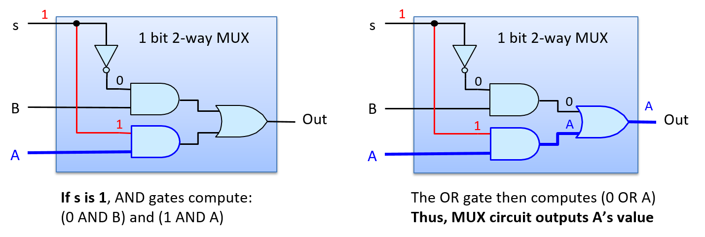
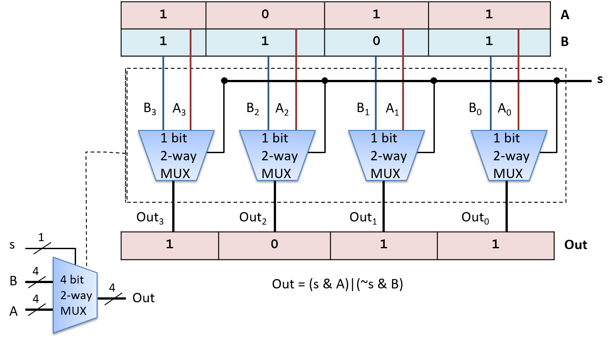
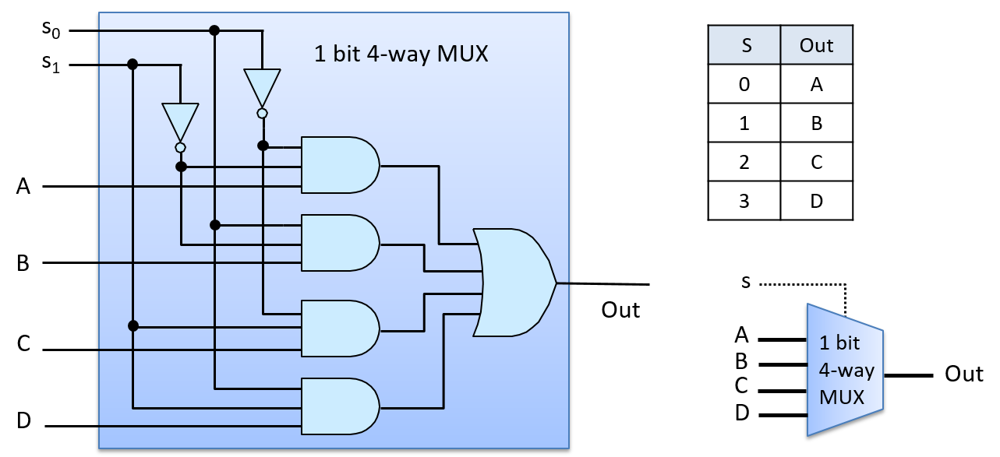

-   -   [4. Binary and Data
        Representation](../C4-Binary/index.html){.nav-link}
        -   [4.1. Number Bases and Unsigned
            Integers](../C4-Binary/bases.html){.nav-link}
        -   [4.2. Converting Between
            Bases](../C4-Binary/conversion.html){.nav-link}
        -   [4.3. Signed Binary
            Integers](../C4-Binary/signed.html){.nav-link}
        -   [4.4. Binary Integer
            Arithmetic](../C4-Binary/arithmetic.html){.nav-link}
            -   [4.4.1.
                Addition](../C4-Binary/arithmetic_addition.html){.nav-link}
            -   [4.4.2.
                Subtraction](../C4-Binary/arithmetic_subtraction.html){.nav-link}
            -   [4.4.3. Multiplication &
                Division](../C4-Binary/arithmetic_mult_div.html){.nav-link}
        -   [4.5. Overflow](../C4-Binary/overflow.html){.nav-link}
        -   [4.6. Bitwise
            Operators](../C4-Binary/bitwise.html){.nav-link}
        -   [4.7. Integer Byte
            Order](../C4-Binary/byte_order.html){.nav-link}
        -   [4.8. Real Numbers in
            Binary](../C4-Binary/floating_point.html){.nav-link}
        -   [4.9. Summary](../C4-Binary/summary.html){.nav-link}
        -   [4.10. Exercises](../C4-Binary/exercises.html){.nav-link}

-   -   [5. What von Neumann Knew: Computer
        Architecture](index.html){.nav-link}
        -   [5.1. The Origins of Modern Computing](hist.html){.nav-link}
        -   [5.2. The von Neumann Architecture](von.html){.nav-link}
        -   [5.3. Logic Gates](gates.html){.nav-link}
        -   [5.4. Circuits](circuits.html){.nav-link}
            -   [5.4.1. Arithmetic and Logic
                Circuits](arithlogiccircs.html){.nav-link}
            -   [5.4.2. Control Circuits](controlcircs.html){.nav-link}
            -   [5.4.3. Storage Circuits](storagecircs.html){.nav-link}
        -   [5.5. Building a Processor](cpu.html){.nav-link}
        -   [5.6. The Processor's Execution of Program
            Instructions](instrexec.html){.nav-link}
        -   [5.7. Pipelining Instruction
            Execution](pipelining.html){.nav-link}
        -   [5.8. Advanced Pipelining
            Considerations](pipelining_advanced.html){.nav-link}
        -   [5.9. Looking Ahead: CPUs Today](modern.html){.nav-link}
        -   [5.10. Summary](summary.html){.nav-link}
        -   [5.11. Exercises](exercises.html){.nav-link}

-   -   [6. Under the C: Dive into
        Assembly](../C6-asm_intro/index.html){.nav-link}

-   -   [7. 64-bit x86 Assembly](../C7-x86_64/index.html){.nav-link}
        -   [7.1. Assembly Basics](../C7-x86_64/basics.html){.nav-link}
        -   [7.2. Common
            Instructions](../C7-x86_64/common.html){.nav-link}
        -   [7.3. Additional Arithmetic
            Instructions](../C7-x86_64/arithmetic.html){.nav-link}
        -   [7.4. Conditional Control and
            Loops](../C7-x86_64/conditional_control_loops.html){.nav-link}
            -   [7.4.1.
                Preliminaries](../C7-x86_64/preliminaries.html){.nav-link}
            -   [7.4.2. If
                Statements](../C7-x86_64/if_statements.html){.nav-link}
            -   [7.4.3. Loops](../C7-x86_64/loops.html){.nav-link}
        -   [7.5. Functions in
            Assembly](../C7-x86_64/functions.html){.nav-link}
        -   [7.6. Recursion](../C7-x86_64/recursion.html){.nav-link}
        -   [7.7. Arrays in
            Assembly](../C7-x86_64/arrays.html){.nav-link}
        -   [7.8. Matrices in
            Assembly](../C7-x86_64/matrices.html){.nav-link}
        -   [7.9. Structs in
            Assembly](../C7-x86_64/structs.html){.nav-link}
        -   [7.10. Buffer
            Overflows](../C7-x86_64/buffer_overflow.html){.nav-link}
        -   [7.11. Exercises](../C7-x86_64/exercises.html){.nav-link}

-   -   [8. 32-bit x86 Assembly](../C8-IA32/index.html){.nav-link}
        -   [8.1. Assembly Basics](../C8-IA32/basics.html){.nav-link}
        -   [8.2. Common
            Instructions](../C8-IA32/common.html){.nav-link}
        -   [8.3. Additional Arithmetic
            Instructions](../C8-IA32/arithmetic.html){.nav-link}
        -   [8.4. Conditional Control and
            Loops](../C8-IA32/conditional_control_loops.html){.nav-link}
            -   [8.4.1.
                Preliminaries](../C8-IA32/preliminaries.html){.nav-link}
            -   [8.4.2. If
                Statements](../C8-IA32/if_statements.html){.nav-link}
            -   [8.4.3. Loops](../C8-IA32/loops.html){.nav-link}
        -   [8.5. Functions in
            Assembly](../C8-IA32/functions.html){.nav-link}
        -   [8.6. Recursion](../C8-IA32/recursion.html){.nav-link}
        -   [8.7. Arrays in Assembly](../C8-IA32/arrays.html){.nav-link}
        -   [8.8. Matrices in
            Assembly](../C8-IA32/matrices.html){.nav-link}
        -   [8.9. Structs in
            Assembly](../C8-IA32/structs.html){.nav-link}
        -   [8.10. Buffer
            Overflows](../C8-IA32/buffer_overflow.html){.nav-link}
        -   [8.11. Exercises](../C8-IA32/exercises.html){.nav-link}

-   -   [9. ARMv8 Assembly](../C9-ARM64/index.html){.nav-link}
        -   [9.1. Assembly Basics](../C9-ARM64/basics.html){.nav-link}
        -   [9.2. Common
            Instructions](../C9-ARM64/common.html){.nav-link}
        -   [9.3. Arithmetic
            Instructions](../C9-ARM64/arithmetic.html){.nav-link}
        -   [9.4. Conditional Control and
            Loops](../C9-ARM64/conditional_control_loops.html){.nav-link}
            -   [9.4.1.
                Preliminaries](../C9-ARM64/preliminaries.html){.nav-link}
            -   [9.4.2. If
                Statements](../C9-ARM64/if_statements.html){.nav-link}
            -   [9.4.3. Loops](../C9-ARM64/loops.html){.nav-link}
        -   [9.5. Functions in
            Assembly](../C9-ARM64/functions.html){.nav-link}
        -   [9.6. Recursion](../C9-ARM64/recursion.html){.nav-link}
        -   [9.7. Arrays in
            Assembly](../C9-ARM64/arrays.html){.nav-link}
        -   [9.8. Matrices in
            Assembly](../C9-ARM64/matrices.html){.nav-link}
        -   [9.9. Structs in
            Assembly](../C9-ARM64/structs.html){.nav-link}
        -   [9.10. Buffer
            Overflows](../C9-ARM64/buffer_overflow.html){.nav-link}
        -   [9.11. Exercises](../C9-ARM64/exercises.html){.nav-link}

-   -   [10. Key Assembly
        Takeaways](../C10-asm_takeaways/index.html){.nav-link}

-   -   [11. Storage and the Memory
        Hierarchy](../C11-MemHierarchy/index.html){.nav-link}
        -   [11.1. The Memory
            Hierarchy](../C11-MemHierarchy/mem_hierarchy.html){.nav-link}
        -   [11.2. Storage
            Devices](../C11-MemHierarchy/devices.html){.nav-link}
        -   [11.3.
            Locality](../C11-MemHierarchy/locality.html){.nav-link}
        -   [11.4. Caching](../C11-MemHierarchy/caching.html){.nav-link}
        -   [11.5. Cache Analysis and
            Cachegrind](../C11-MemHierarchy/cachegrind.html){.nav-link}
        -   [11.6. Looking Ahead: Caching on Multicore
            Processors](../C11-MemHierarchy/coherency.html){.nav-link}
        -   [11.7. Summary](../C11-MemHierarchy/summary.html){.nav-link}
        -   [11.8.
            Exercises](../C11-MemHierarchy/exercises.html){.nav-link}

-   -   [12. Code Optimization](../C12-CodeOpt/index.html){.nav-link}
        -   [12.1. First Steps](../C12-CodeOpt/basic.html){.nav-link}
        -   [12.2. Other Compiler
            Optimizations](../C12-CodeOpt/loops_functions.html){.nav-link}
        -   [12.3. Memory
            Considerations](../C12-CodeOpt/memory_considerations.html){.nav-link}
        -   [12.4. Summary](../C12-CodeOpt/summary.html){.nav-link}

-   -   [13. The Operating System](../C13-OS/index.html){.nav-link}
        -   [13.1. Booting and Running](../C13-OS/impl.html){.nav-link}
        -   [13.2. Processes](../C13-OS/processes.html){.nav-link}
        -   [13.3. Virtual Memory](../C13-OS/vm.html){.nav-link}
        -   [13.4. Interprocess
            Communication](../C13-OS/ipc.html){.nav-link}
            -   [13.4.1. Signals](../C13-OS/ipc_signals.html){.nav-link}
            -   [13.4.2. Message
                Passing](../C13-OS/ipc_msging.html){.nav-link}
            -   [13.4.3. Shared
                Memory](../C13-OS/ipc_shm.html){.nav-link}
        -   [13.5. Summary and Other OS
            Functionality](../C13-OS/advanced.html){.nav-link}
        -   [13.6. Exercises](../C13-OS/exercises.html){.nav-link}

-   -   [14. Leveraging Shared Memory in the Multicore
        Era](../C14-SharedMemory/index.html){.nav-link}
        -   [14.1. Programming Multicore
            Systems](../C14-SharedMemory/multicore.html){.nav-link}
        -   [14.2. POSIX
            Threads](../C14-SharedMemory/posix.html){.nav-link}
        -   [14.3. Synchronizing
            Threads](../C14-SharedMemory/synchronization.html){.nav-link}
            -   [14.3.1. Mutual
                Exclusion](../C14-SharedMemory/mutex.html){.nav-link}
            -   [14.3.2.
                Semaphores](../C14-SharedMemory/semaphores.html){.nav-link}
            -   [14.3.3. Other Synchronization
                Constructs](../C14-SharedMemory/other_syncs.html){.nav-link}
        -   [14.4. Measuring Parallel
            Performance](../C14-SharedMemory/performance.html){.nav-link}
            -   [14.4.1. Parallel Performance
                Basics](../C14-SharedMemory/performance_basics.html){.nav-link}
            -   [14.4.2. Advanced
                Topics](../C14-SharedMemory/performance_advanced.html){.nav-link}
        -   [14.5. Cache
            Coherence](../C14-SharedMemory/cache_coherence.html){.nav-link}
        -   [14.6. Thread
            Safety](../C14-SharedMemory/thread_safety.html){.nav-link}
        -   [14.7. Implicit Threading with
            OpenMP](../C14-SharedMemory/openmp.html){.nav-link}
        -   [14.8. Summary](../C14-SharedMemory/summary.html){.nav-link}
        -   [14.9.
            Exercises](../C14-SharedMemory/exercises.html){.nav-link}

-   -   [15. Looking Ahead: Other Parallel
        Systems](../C15-Parallel/index.html){.nav-link}
        -   [15.1. Hardware Acceleration and
            CUDA](../C15-Parallel/gpu.html){.nav-link}
        -   [15.2. Distributed Memory
            Systems](../C15-Parallel/distrmem.html){.nav-link}
        -   [15.3. To Exascale and
            Beyond](../C15-Parallel/cloud.html){.nav-link}

-   -   [16. Appendix 1: Chapter 1 for Java
        Programmers](../Appendix1/index.html){.nav-link}
        -   [16.1. Getting Started Programming in
            C](../Appendix1/getting_started.html){.nav-link}
        -   [16.2. Input/Output (printf and
            scanf)](../Appendix1/input_output.html){.nav-link}
        -   [16.3. Conditionals and
            Loops](../Appendix1/conditionals.html){.nav-link}
        -   [16.4. Functions](../Appendix1/functions.html){.nav-link}
        -   [16.5. Arrays and
            Strings](../Appendix1/arrays_strings.html){.nav-link}
        -   [16.6. Structs](../Appendix1/structs.html){.nav-link}
        -   [16.7. Summary](../Appendix1/summary.html){.nav-link}
        -   [16.8. Exercises](../Appendix1/exercises.html){.nav-link}

-   -   [17. Appendix 2: Using Unix](../Appendix2/index.html){.nav-link}
        -   [17.1. Unix Command Line and the Unix File
            System](../Appendix2/cmdln_basics.html){.nav-link}
        -   [17.2. Man and the Unix
            Manual](../Appendix2/man.html){.nav-link}
        -   [17.3. Remote Access](../Appendix2/ssh_scp.html){.nav-link}
        -   [17.4. Unix Editors](../Appendix2/editors.html){.nav-link}
        -   [17.5. make and
            Makefiles](../Appendix2/makefiles.html){.nav-link}
        -   [17.6 Searching: grep and
            find](../Appendix2/grep.html){.nav-link}
        -   [17.7 File Permissions](../Appendix2/chmod.html){.nav-link}
        -   [17.8 Archiving and Compressing
            Files](../Appendix2/tar.html){.nav-link}
        -   [17.9 Process Control](../Appendix2/pskill.html){.nav-link}
        -   [17.10 Timing](../Appendix2/timing.html){.nav-link}
        -   [17.11 Command
            History](../Appendix2/history.html){.nav-link}
        -   [17.12 I/0
            Redirection](../Appendix2/ioredirect.html){.nav-link}
        -   [17.13 Pipes](../Appendix2/pipe.html){.nav-link}
        -   [17.14 Dot Files and
            .bashrc](../Appendix2/dotfiles.html){.nav-link}
        -   [17.15 Shell
            Programming](../Appendix2/shellprog.html){.nav-link}
        -   [17.16 Getting System
            Information](../Appendix2/sysinfo.html){.nav-link}

-   [Dive Into Systems](../index-2.html)
-   [5. What von Neumann Knew: Computer Architecture](index.html)
-   [5.4. Circuits](circuits.html)
-   [5.4.2. Control Circuits](controlcircs.html)
:::

::: content
::: sect2
### {.anchor}5.4.2. Control Circuits {#_control_circuits}

::: paragraph
Control circuits are used throughout a system. On the processor, they
drive the execution of program instructions on program data. They also
control loading and storing values to different levels of storage
(between registers, cache, and RAM), and control hardware devices in the
system. Just like arithmetic and logic circuits, control circuits that
implement complicated functionality are built by combining simpler
circuits and logic gates.
:::

::: paragraph
A **multiplexer** (MUX) is an example of a control circuit that selects,
or chooses, one of several values. The CPU may use a multiplexer circuit
to select from which CPU register to read an instruction operand value.
:::

::: paragraph
An *N*-way multiplexer has a set of *N* input values and a single output
value selected from one of its inputs. An additional input value,
**Select** (S), encodes which of its *N* inputs is chosen for its
output.
:::

::: paragraph
The most basic two-way MUX selects between two 1-bit inputs, A and B.
The select input for a two-way multiplexer is a single bit: if the S
input is 1, it will select A for output; if it is 0 it will select B for
output. The truth table for a two-way 1-bit multiplexer is shown below.
The value of the selection bit (S) chooses either the value of A or B as
the MUX output value.
:::

+-----------------+-----------------+-----------------+-----------------+
| A               | B               | S               | out             |
+=================+=================+=================+=================+
| 0               | 0               | 0               | 0 (B's value)   |
+-----------------+-----------------+-----------------+-----------------+
| 0               | 1               | 0               | 1 (B's value)   |
+-----------------+-----------------+-----------------+-----------------+
| 1               | 0               | 0               | 0 (B's value)   |
+-----------------+-----------------+-----------------+-----------------+
| 1               | 1               | 0               | 1 (B's value)   |
+-----------------+-----------------+-----------------+-----------------+
| 0               | 0               | 1               | 0 (A's value)   |
+-----------------+-----------------+-----------------+-----------------+
| 0               | 1               | 1               | 0 (A's value)   |
+-----------------+-----------------+-----------------+-----------------+
| 1               | 0               | 1               | 1 (A's value)   |
+-----------------+-----------------+-----------------+-----------------+
| 1               | 1               | 1               | 1 (A's value)   |
+-----------------+-----------------+-----------------+-----------------+

: Table 1. Truth table for 1 bit multiplexer

::: paragraph
[Figure 1](#Fig2waymux) shows the two-way multiplexer circuit for
single-bit input.
:::

::: {#Fig2waymux .imageblock .text-center}
::: content

:::

::: title
Figure 1. A two-way 1-bit multiplexer circuit. The value of the signal
input (S) is used to pick which of its two inputs (A or B) will be the
circuit's output value: when S is 1, A is chosen; when S is 0, B is
chosen.
:::
:::

::: paragraph
[Figure 2](#FigmuxchooseA) shows how the multiplexer chooses A's output
with an S input value of 1. For example, suppose that the input values
are 1 for A, 0 for B, and 1 for S. S is negated before being sent to the
top AND gate with B (0 AND B), resulting in a 0 output value from the
top AND gate. S feeds into the bottom AND gate with A, resulting in (1
AND A), which evaluates to the value of A being output from the bottom
AND gate. The value of A (1 in our example) and 0 from the top AND gate
feed as input to the OR gate, resulting in (0 OR A) being output. In
other words, when S is 1, the MUX chooses the value of A as its output
(A's value being 1 in our example). The value of B does not affect the
final output of the MUX, because 0 will always be the output of the top
AND gate when S is 1.
:::

::: {#FigmuxchooseA .imageblock .text-center}
::: content

:::

::: title
Figure 2. A two-way 1-bit multiplexer circuit chooses (outputs) A when S
is 1.
:::
:::

::: paragraph
[Figure 3](#FigmuxchooseB) shows the path through the multiplexer when
the S input value 0 chooses B's output. If we consider the same input
for A and B as the example above, but change S to 0, then the negation
of 0 is input to the top AND gate resulting in (1 AND B), or B's value,
output from the top AND gate. The input to the bottom AND gate is (0 AND
A), resulting in 0 from the bottom AND gate. Thus, the input values to
the OR gate are (B OR 0), which evaluates to B's value as the MUX's
output (B's value being 0 in our example).
:::

::: {#FigmuxchooseB .imageblock .text-center}
::: content

:::

::: title
Figure 3. A two-way 1-bit multiplexer circuit chooses (outputs) B when S
is 0.
:::
:::

::: paragraph
A two-way 1- bit MUX circuit is a building block for constructing
two-way *N*-bit MUX circuits. For example, [Figure 4](#Fig4bitmux) shows
a two-way 4-bit MUX built from four 1-bit two-way MUX circuits.
:::

::: {#Fig4bitmux .imageblock .text-center}
::: content

:::

::: title
Figure 4. A two-way 4-bit multiplexer circuit built from four two-way
1-bit multiplexer circuits. A single signal bit, S, chooses either A or
B as output.
:::
:::

::: paragraph
An *N*-way multiplexer chooses one of *N* inputs as output. It requires
a slightly different MUX circuit than a two-way MUX, and needs
log~2~(*N*) bits for its Select input. The additional selection bits are
needed because with log~2~(*N*) bits, *N* distinct values can be
encoded, one for selecting each of the *N* inputs. Each distinct
permutation of the log~2~(*N*) Select bits is input with one of the *N*
input values to an AND gate, resulting in exactly one MUX input value
selected as the MUX output. [Figure 5](#Fig4waymux) shows an example of
a 1-bit four-way MUX circuit.
:::

::: {#Fig4waymux .imageblock .text-center}
::: content

:::

::: title
Figure 5. A four-way multiplexer circuit has four inputs and two
(log(4)) select bits that encode which of the four inputs should be
output by the multiplexer.
:::
:::

::: paragraph
The four-way MUX circuit uses four three-input AND gates and one
four-input OR gate. Multi-input versions of gates can be built by
chaining together multiple two-input AND (and OR) gates. For example, a
three-input AND gate is built from two two-input AND gates, where the
first AND gate takes two of the input values and the second AND gate
takes the third input value and the output from the first AND gate: (x
AND y AND z) is equivalent to ((x AND y) AND z).
:::

::: paragraph
To see how the four-way MUX circuit works, consider an S input value of
2 (0b10 in binary), as shown in [Figure 6](#Fig4waychooseC). The top AND
gate gets as input (NOT(S~0~) AND NOT(S~1~) AND A), or (1 AND 0 AND A),
resulting in 0 output from the top AND gate. The second AND gate gets
input values (0 AND 0 AND B), resulting in 0 output. The third AND gate
gets input values (1 AND 1 AND C), resulting in the value of C output.
The last AND gate gets (0 AND 1 AND D), resulting in 0 output. The OR
gate has inputs (0 OR 0 OR C OR 0), resulting in the value of C output
by the MUX (an S value of 2 chooses C).
:::

::: {#Fig4waychooseC .imageblock .text-center}
::: content
{width="700"}
:::

::: title
Figure 6. A four-way multiplexer circuit chooses C as output when the
Select input, S, is 2 (0b10).
:::
:::

::: paragraph
Demultiplexers and decoders are two other examples of control circuits.
A **demultiplexer** (DMUX) is the inverse of a multiplexer. Whereas a
multiplexer chooses one of *N* inputs, a demultiplexer chooses one of
*N* outputs. A DMUX takes a single input value and a selection input,
and has *N* outputs. Based on the value of S, it sends the input value
to exactly one of its *N* outputs (the value of the input is routed on
to one of *N* output lines). A DMUX circuit is often used to select one
of *N* circuits to pass a value. A **decoder** circuit takes an encoded
input and enables one of several outputs based on the input value. For
example, a decoder circuit that has an *N*-bit input value, uses the
value to enable (to set to 1) exactly one of its 2^N^ output lines (the
one corresponding to the encoding of the *N*-bit value). [Figure
7](#dmux) Shows an example of a two-way 1-bit DMUX circuit, whose
selection input value (s) chooses which of its two outputs gets the
input value A. It also shows an example of a 2-bit decoder circuit,
whose input bits determine which of four outputs get set to 1. The truth
tables for both circuits are also shown.
:::

::: {#dmux .imageblock .text-center}
::: content
{width="650"}
:::

::: title
Figure 7. A two-way 1-bit demultiplexer, and a 2-bit decoder, along with
their truth tables.
:::
:::
:::

::: toc-menu
:::
:::
:::
:::

Copyright (C) 2020 Dive into Systems, LLC.

*Dive into Systems,* is licensed under the Creative Commons
[Attribution-NonCommercial-NoDerivatives 4.0
International](https://creativecommons.org/licenses/by-nc-nd/4.0/) (CC
BY-NC-ND 4.0).
