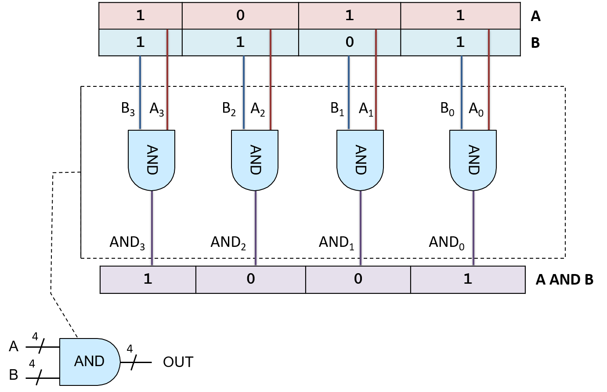
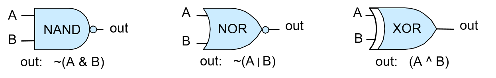

-   -   [4. Binary and Data
        Representation](../C4-Binary/index.html){.nav-link}
        -   [4.1. Number Bases and Unsigned
            Integers](../C4-Binary/bases.html){.nav-link}
        -   [4.2. Converting Between
            Bases](../C4-Binary/conversion.html){.nav-link}
        -   [4.3. Signed Binary
            Integers](../C4-Binary/signed.html){.nav-link}
        -   [4.4. Binary Integer
            Arithmetic](../C4-Binary/arithmetic.html){.nav-link}
            -   [4.4.1.
                Addition](../C4-Binary/arithmetic_addition.html){.nav-link}
            -   [4.4.2.
                Subtraction](../C4-Binary/arithmetic_subtraction.html){.nav-link}
            -   [4.4.3. Multiplication &
                Division](../C4-Binary/arithmetic_mult_div.html){.nav-link}
        -   [4.5. Overflow](../C4-Binary/overflow.html){.nav-link}
        -   [4.6. Bitwise
            Operators](../C4-Binary/bitwise.html){.nav-link}
        -   [4.7. Integer Byte
            Order](../C4-Binary/byte_order.html){.nav-link}
        -   [4.8. Real Numbers in
            Binary](../C4-Binary/floating_point.html){.nav-link}
        -   [4.9. Summary](../C4-Binary/summary.html){.nav-link}
        -   [4.10. Exercises](../C4-Binary/exercises.html){.nav-link}

-   -   [5. What von Neumann Knew: Computer
        Architecture](index.html){.nav-link}
        -   [5.1. The Origins of Modern Computing](hist.html){.nav-link}
        -   [5.2. The von Neumann Architecture](von.html){.nav-link}
        -   [5.3. Logic Gates](gates.html){.nav-link}
        -   [5.4. Circuits](circuits.html){.nav-link}
            -   [5.4.1. Arithmetic and Logic
                Circuits](arithlogiccircs.html){.nav-link}
            -   [5.4.2. Control Circuits](controlcircs.html){.nav-link}
            -   [5.4.3. Storage Circuits](storagecircs.html){.nav-link}
        -   [5.5. Building a Processor](cpu.html){.nav-link}
        -   [5.6. The Processor's Execution of Program
            Instructions](instrexec.html){.nav-link}
        -   [5.7. Pipelining Instruction
            Execution](pipelining.html){.nav-link}
        -   [5.8. Advanced Pipelining
            Considerations](pipelining_advanced.html){.nav-link}
        -   [5.9. Looking Ahead: CPUs Today](modern.html){.nav-link}
        -   [5.10. Summary](summary.html){.nav-link}
        -   [5.11. Exercises](exercises.html){.nav-link}

-   -   [6. Under the C: Dive into
        Assembly](../C6-asm_intro/index.html){.nav-link}

-   -   [7. 64-bit x86 Assembly](../C7-x86_64/index.html){.nav-link}
        -   [7.1. Assembly Basics](../C7-x86_64/basics.html){.nav-link}
        -   [7.2. Common
            Instructions](../C7-x86_64/common.html){.nav-link}
        -   [7.3. Additional Arithmetic
            Instructions](../C7-x86_64/arithmetic.html){.nav-link}
        -   [7.4. Conditional Control and
            Loops](../C7-x86_64/conditional_control_loops.html){.nav-link}
            -   [7.4.1.
                Preliminaries](../C7-x86_64/preliminaries.html){.nav-link}
            -   [7.4.2. If
                Statements](../C7-x86_64/if_statements.html){.nav-link}
            -   [7.4.3. Loops](../C7-x86_64/loops.html){.nav-link}
        -   [7.5. Functions in
            Assembly](../C7-x86_64/functions.html){.nav-link}
        -   [7.6. Recursion](../C7-x86_64/recursion.html){.nav-link}
        -   [7.7. Arrays in
            Assembly](../C7-x86_64/arrays.html){.nav-link}
        -   [7.8. Matrices in
            Assembly](../C7-x86_64/matrices.html){.nav-link}
        -   [7.9. Structs in
            Assembly](../C7-x86_64/structs.html){.nav-link}
        -   [7.10. Buffer
            Overflows](../C7-x86_64/buffer_overflow.html){.nav-link}
        -   [7.11. Exercises](../C7-x86_64/exercises.html){.nav-link}

-   -   [8. 32-bit x86 Assembly](../C8-IA32/index.html){.nav-link}
        -   [8.1. Assembly Basics](../C8-IA32/basics.html){.nav-link}
        -   [8.2. Common
            Instructions](../C8-IA32/common.html){.nav-link}
        -   [8.3. Additional Arithmetic
            Instructions](../C8-IA32/arithmetic.html){.nav-link}
        -   [8.4. Conditional Control and
            Loops](../C8-IA32/conditional_control_loops.html){.nav-link}
            -   [8.4.1.
                Preliminaries](../C8-IA32/preliminaries.html){.nav-link}
            -   [8.4.2. If
                Statements](../C8-IA32/if_statements.html){.nav-link}
            -   [8.4.3. Loops](../C8-IA32/loops.html){.nav-link}
        -   [8.5. Functions in
            Assembly](../C8-IA32/functions.html){.nav-link}
        -   [8.6. Recursion](../C8-IA32/recursion.html){.nav-link}
        -   [8.7. Arrays in Assembly](../C8-IA32/arrays.html){.nav-link}
        -   [8.8. Matrices in
            Assembly](../C8-IA32/matrices.html){.nav-link}
        -   [8.9. Structs in
            Assembly](../C8-IA32/structs.html){.nav-link}
        -   [8.10. Buffer
            Overflows](../C8-IA32/buffer_overflow.html){.nav-link}
        -   [8.11. Exercises](../C8-IA32/exercises.html){.nav-link}

-   -   [9. ARMv8 Assembly](../C9-ARM64/index.html){.nav-link}
        -   [9.1. Assembly Basics](../C9-ARM64/basics.html){.nav-link}
        -   [9.2. Common
            Instructions](../C9-ARM64/common.html){.nav-link}
        -   [9.3. Arithmetic
            Instructions](../C9-ARM64/arithmetic.html){.nav-link}
        -   [9.4. Conditional Control and
            Loops](../C9-ARM64/conditional_control_loops.html){.nav-link}
            -   [9.4.1.
                Preliminaries](../C9-ARM64/preliminaries.html){.nav-link}
            -   [9.4.2. If
                Statements](../C9-ARM64/if_statements.html){.nav-link}
            -   [9.4.3. Loops](../C9-ARM64/loops.html){.nav-link}
        -   [9.5. Functions in
            Assembly](../C9-ARM64/functions.html){.nav-link}
        -   [9.6. Recursion](../C9-ARM64/recursion.html){.nav-link}
        -   [9.7. Arrays in
            Assembly](../C9-ARM64/arrays.html){.nav-link}
        -   [9.8. Matrices in
            Assembly](../C9-ARM64/matrices.html){.nav-link}
        -   [9.9. Structs in
            Assembly](../C9-ARM64/structs.html){.nav-link}
        -   [9.10. Buffer
            Overflows](../C9-ARM64/buffer_overflow.html){.nav-link}
        -   [9.11. Exercises](../C9-ARM64/exercises.html){.nav-link}

-   -   [10. Key Assembly
        Takeaways](../C10-asm_takeaways/index.html){.nav-link}

-   -   [11. Storage and the Memory
        Hierarchy](../C11-MemHierarchy/index.html){.nav-link}
        -   [11.1. The Memory
            Hierarchy](../C11-MemHierarchy/mem_hierarchy.html){.nav-link}
        -   [11.2. Storage
            Devices](../C11-MemHierarchy/devices.html){.nav-link}
        -   [11.3.
            Locality](../C11-MemHierarchy/locality.html){.nav-link}
        -   [11.4. Caching](../C11-MemHierarchy/caching.html){.nav-link}
        -   [11.5. Cache Analysis and
            Cachegrind](../C11-MemHierarchy/cachegrind.html){.nav-link}
        -   [11.6. Looking Ahead: Caching on Multicore
            Processors](../C11-MemHierarchy/coherency.html){.nav-link}
        -   [11.7. Summary](../C11-MemHierarchy/summary.html){.nav-link}
        -   [11.8.
            Exercises](../C11-MemHierarchy/exercises.html){.nav-link}

-   -   [12. Code Optimization](../C12-CodeOpt/index.html){.nav-link}
        -   [12.1. First Steps](../C12-CodeOpt/basic.html){.nav-link}
        -   [12.2. Other Compiler
            Optimizations](../C12-CodeOpt/loops_functions.html){.nav-link}
        -   [12.3. Memory
            Considerations](../C12-CodeOpt/memory_considerations.html){.nav-link}
        -   [12.4. Summary](../C12-CodeOpt/summary.html){.nav-link}

-   -   [13. The Operating System](../C13-OS/index.html){.nav-link}
        -   [13.1. Booting and Running](../C13-OS/impl.html){.nav-link}
        -   [13.2. Processes](../C13-OS/processes.html){.nav-link}
        -   [13.3. Virtual Memory](../C13-OS/vm.html){.nav-link}
        -   [13.4. Interprocess
            Communication](../C13-OS/ipc.html){.nav-link}
            -   [13.4.1. Signals](../C13-OS/ipc_signals.html){.nav-link}
            -   [13.4.2. Message
                Passing](../C13-OS/ipc_msging.html){.nav-link}
            -   [13.4.3. Shared
                Memory](../C13-OS/ipc_shm.html){.nav-link}
        -   [13.5. Summary and Other OS
            Functionality](../C13-OS/advanced.html){.nav-link}
        -   [13.6. Exercises](../C13-OS/exercises.html){.nav-link}

-   -   [14. Leveraging Shared Memory in the Multicore
        Era](../C14-SharedMemory/index.html){.nav-link}
        -   [14.1. Programming Multicore
            Systems](../C14-SharedMemory/multicore.html){.nav-link}
        -   [14.2. POSIX
            Threads](../C14-SharedMemory/posix.html){.nav-link}
        -   [14.3. Synchronizing
            Threads](../C14-SharedMemory/synchronization.html){.nav-link}
            -   [14.3.1. Mutual
                Exclusion](../C14-SharedMemory/mutex.html){.nav-link}
            -   [14.3.2.
                Semaphores](../C14-SharedMemory/semaphores.html){.nav-link}
            -   [14.3.3. Other Synchronization
                Constructs](../C14-SharedMemory/other_syncs.html){.nav-link}
        -   [14.4. Measuring Parallel
            Performance](../C14-SharedMemory/performance.html){.nav-link}
            -   [14.4.1. Parallel Performance
                Basics](../C14-SharedMemory/performance_basics.html){.nav-link}
            -   [14.4.2. Advanced
                Topics](../C14-SharedMemory/performance_advanced.html){.nav-link}
        -   [14.5. Cache
            Coherence](../C14-SharedMemory/cache_coherence.html){.nav-link}
        -   [14.6. Thread
            Safety](../C14-SharedMemory/thread_safety.html){.nav-link}
        -   [14.7. Implicit Threading with
            OpenMP](../C14-SharedMemory/openmp.html){.nav-link}
        -   [14.8. Summary](../C14-SharedMemory/summary.html){.nav-link}
        -   [14.9.
            Exercises](../C14-SharedMemory/exercises.html){.nav-link}

-   -   [15. Looking Ahead: Other Parallel
        Systems](../C15-Parallel/index.html){.nav-link}
        -   [15.1. Hardware Acceleration and
            CUDA](../C15-Parallel/gpu.html){.nav-link}
        -   [15.2. Distributed Memory
            Systems](../C15-Parallel/distrmem.html){.nav-link}
        -   [15.3. To Exascale and
            Beyond](../C15-Parallel/cloud.html){.nav-link}

-   -   [16. Appendix 1: Chapter 1 for Java
        Programmers](../Appendix1/index.html){.nav-link}
        -   [16.1. Getting Started Programming in
            C](../Appendix1/getting_started.html){.nav-link}
        -   [16.2. Input/Output (printf and
            scanf)](../Appendix1/input_output.html){.nav-link}
        -   [16.3. Conditionals and
            Loops](../Appendix1/conditionals.html){.nav-link}
        -   [16.4. Functions](../Appendix1/functions.html){.nav-link}
        -   [16.5. Arrays and
            Strings](../Appendix1/arrays_strings.html){.nav-link}
        -   [16.6. Structs](../Appendix1/structs.html){.nav-link}
        -   [16.7. Summary](../Appendix1/summary.html){.nav-link}
        -   [16.8. Exercises](../Appendix1/exercises.html){.nav-link}

-   -   [17. Appendix 2: Using Unix](../Appendix2/index.html){.nav-link}
        -   [17.1. Unix Command Line and the Unix File
            System](../Appendix2/cmdln_basics.html){.nav-link}
        -   [17.2. Man and the Unix
            Manual](../Appendix2/man.html){.nav-link}
        -   [17.3. Remote Access](../Appendix2/ssh_scp.html){.nav-link}
        -   [17.4. Unix Editors](../Appendix2/editors.html){.nav-link}
        -   [17.5. make and
            Makefiles](../Appendix2/makefiles.html){.nav-link}
        -   [17.6 Searching: grep and
            find](../Appendix2/grep.html){.nav-link}
        -   [17.7 File Permissions](../Appendix2/chmod.html){.nav-link}
        -   [17.8 Archiving and Compressing
            Files](../Appendix2/tar.html){.nav-link}
        -   [17.9 Process Control](../Appendix2/pskill.html){.nav-link}
        -   [17.10 Timing](../Appendix2/timing.html){.nav-link}
        -   [17.11 Command
            History](../Appendix2/history.html){.nav-link}
        -   [17.12 I/0
            Redirection](../Appendix2/ioredirect.html){.nav-link}
        -   [17.13 Pipes](../Appendix2/pipe.html){.nav-link}
        -   [17.14 Dot Files and
            .bashrc](../Appendix2/dotfiles.html){.nav-link}
        -   [17.15 Shell
            Programming](../Appendix2/shellprog.html){.nav-link}
        -   [17.16 Getting System
            Information](../Appendix2/sysinfo.html){.nav-link}

-   [Dive Into Systems](../index-2.html)
-   [5. What von Neumann Knew: Computer Architecture](index.html)
-   [5.3. Logic Gates](gates.html)
:::

::: content
::: sect1
## {.anchor}5.3. Logic Gates {#_logic_gates}

::: sectionbody
::: paragraph
**Logic gates** are the building blocks of the digital circuitry that
implements arithmetic, control, and storage functionality in a digital
computer. Designing complicated digital circuits involves employing a
high degree of abstraction: a designer creates simple circuits that
implement basic functionality from a small set of basic logic gates;
these simple circuits, abstracted from their implementation, are used as
the building blocks for creating more complicated circuits (simple
circuits are combined together to create new circuits with more
complicated functionality); these more complicated circuits may be
further abstracted and used as a building block for creating even more
complicated functionality; and so on to build complete processing,
storage, and control components of a processor.
:::

::: sidebarblock
::: content
::: title
Transistors
:::

::: paragraph
Logic gates are created from transistors that are etched into a
semiconductor material (e.g. silicon chips). Transistors act as switches
that control electrical flow through the chip. A transistor can switch
its state between on or off (between a high or low voltage output). Its
output state depends on its current state plus its input state (high or
low voltage). Binary values are encoded with these high (1) and low (0)
voltages, and logic gates are implemented by arrangements of a few
transistors that perform switching actions on the inputs to produce the
logic gate's output. The number of transistors that can fit on an
integrated circuit (a chip) is a rough measure of its power; with more
transistors per chip, there are more building blocks to implement more
functionality or storage.
:::
:::
:::

::: sect2
### {.anchor}5.3.1. Basic Logic Gates {#_basic_logic_gates}

::: paragraph
At the lowest level, all circuits are built from linking logic gates
together. Logic gates implement boolean operations on boolean operands
(0 or 1). **AND**, **OR**, and **NOT** form a complete set of logic
gates from which any circuit can be constructed. A logic gate has one
(NOT) or two (AND and OR) binary input values and produces a binary
output value that is the bitwise logical operation on its input. For
example, an input value of 0 to a NOT gate outputs 1 (1 is NOT(0)). A
**truth table** for a logical operation lists the operation's value for
each permutation of inputs. [Table 1](#basiclogicops) shows the truth
tables for the AND, OR, and NOT logic gates.
:::

+-------------+-------------+-------------+-------------+-------------+
| A           | B           | A AND B     | A OR B      | NOT A       |
+=============+=============+=============+=============+=============+
| 0           | 0           | 0           | 0           | 1           |
+-------------+-------------+-------------+-------------+-------------+
| 0           | 1           | 0           | 1           | 1           |
+-------------+-------------+-------------+-------------+-------------+
| 1           | 0           | 0           | 1           | 0           |
+-------------+-------------+-------------+-------------+-------------+
| 1           | 1           | 1           | 1           | 0           |
+-------------+-------------+-------------+-------------+-------------+

: Table 1. Truth Tables for Basic Logic Operations.

::: paragraph
[Figure 1](#FIGandornot) shows how computer architects represent these
gates in circuit drawings.
:::

::: {#FIGandornot .imageblock .text-center}
::: content
{width="700"}
:::

::: title
Figure 1. The AND, OR, and NOT logic gates for single-bit inputs produce
a single-bit output.
:::
:::

::: paragraph
A multi-bit version of a logic gate (for *M*-bit input and output) is a
very simple circuit constructed using *M* one-bit logic gates.
Individual bits of the *M*-bit input value are each input into a
different one-bit gate that produces the corresponding output bit of the
*M*-bit result. For example, [Figure 2](#FIG4bitand) shows a 4-bit AND
circuit built from four 1-bit AND gates.
:::

::: {#FIG4bitand .imageblock .text-center}
::: content

:::

::: title
Figure 2. A 4-bit AND circuit built from four 1-bit AND gates.
:::
:::

::: paragraph
This type of very simple circuit, one that just expands input and output
bit width for a logic gate, is often referred to as an *M*-bit gate for
a particular value of *M* specifying the input and output bit width
(number of bits).
:::
:::

::: sect2
### {.anchor}5.3.2. Other Logic Gates {#_other_logic_gates}

::: paragraph
Even though the set of logic gates consisting of AND, OR, and NOT is
sufficient for implementing any circuit, there are other basic logic
gates that are often used to construct digital circuits. These
additional logic gates include NAND (the negation of A AND B), NOR (the
negation of A OR B), and XOR (exclusive OR). Their truth tables are
shown in [Table 2](#nandnorxorTT).
:::

+-------------+-------------+-------------+-------------+-------------+
| A           | B           | A NAND B    | A NOR B     | A XOR B     |
+=============+=============+=============+=============+=============+
| 0           | 0           | 1           | 1           | 0           |
+-------------+-------------+-------------+-------------+-------------+
| 0           | 1           | 1           | 0           | 1           |
+-------------+-------------+-------------+-------------+-------------+
| 1           | 0           | 1           | 0           | 1           |
+-------------+-------------+-------------+-------------+-------------+
| 1           | 1           | 0           | 0           | 0           |
+-------------+-------------+-------------+-------------+-------------+

: Table 2. NAND, NOR, XOR truth tables.

::: paragraph
The NAND, NOR, and XOR gates appear in circuit drawings, as shown in
[Figure 3](#Fignandnorxor).
:::

::: {#Fignandnorxor .imageblock .text-center}
::: content
{width="700"}
:::

::: title
Figure 3. The NAND, NOR, and XOR logic gates.
:::
:::

::: paragraph
The circle on the end of the NAND and NOR gates represents negation or
NOT. For example, the NOR gate looks like an OR gate with a circle on
the end, representing the fact that NOR is the negation of OR.
:::

::: sidebarblock
::: content
::: title
Minimal subsets of logic gates
:::

::: paragraph
NAND, NOR, and XOR are not necessary for building circuits, but they are
additional gates added to the set {AND, OR, NOT} that are commonly used
in circuit design. Any of these gates can be implemented from
transistors (the building block of logic gates), or can be implemented
from combinations of other gates.
:::

::: paragraph
Of the larger set {AND, OR, NOT, NAND, NOR, XOR}, there exist several
minimal subsets of logic gates that alone are sufficient for building
any circuit. For example, the subset {AND, NOT} is one minimal subset:
(A OR B) is equivalent to NOT(NOT(A) AND NOT(B)). Rather than using a
minimal subset of gates, we we use the set {AND, OR, NOT} because it is
the easiest set to understand.
:::

::: paragraph
Because NAND, NOR, and XOR are not necessary, their functionality can be
implemented by combining AND, OR, and NOT gates into circuits that
implement NAND, NOR, and XOR functions. For example, NOR can be built
using a NOT combined with an OR gate, `(A NOR B) ≡ NOT(A OR B)`), as
shown in [Figure 4](#Fignorasnotor).
:::

::: {#Fignorasnotor .imageblock .text-center}
::: content
{width="700"}
:::

::: title
Figure 4. The NOR gate can be implemented using an OR and a NOT gate.
The inputs, A and B, are first fed through an OR gate, and the OR gate's
output is input to a NOT gate (NOR is the NOT of OR).
:::
:::

::: paragraph
Today's integrated circuits chips are built using CMOS technology, which
uses NAND as the basic building block of circuits on the chip. The NAND
gate by itself makes up another minimal subset of complete logic gates.
:::
:::
:::
:::
:::
:::

::: toc-menu
:::
:::
:::
:::

Copyright (C) 2020 Dive into Systems, LLC.

*Dive into Systems,* is licensed under the Creative Commons
[Attribution-NonCommercial-NoDerivatives 4.0
International](https://creativecommons.org/licenses/by-nc-nd/4.0/) (CC
BY-NC-ND 4.0).
