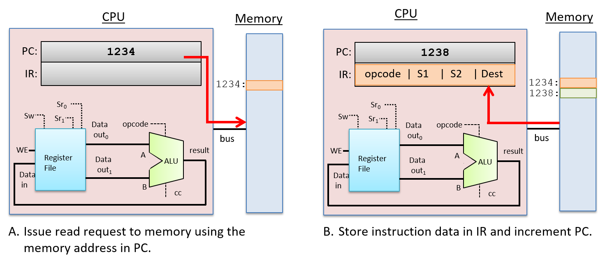
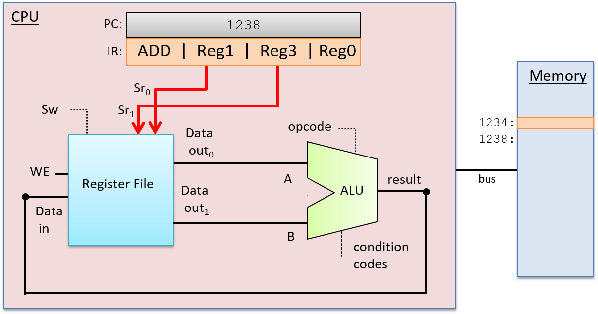
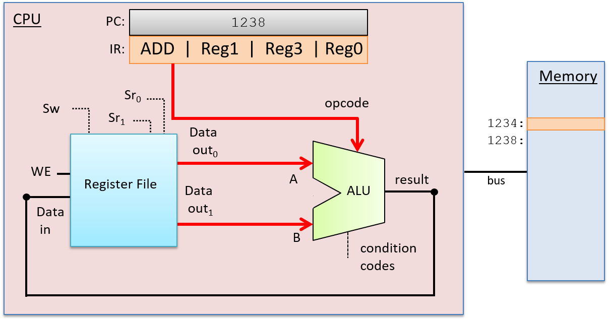
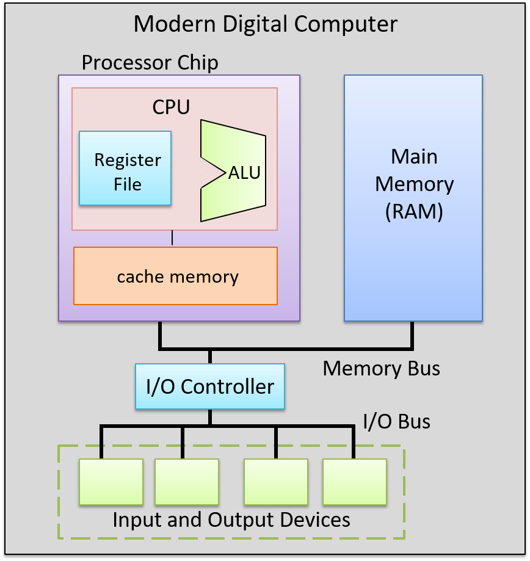

-   -   [4. Binary and Data
        Representation](../C4-Binary/index.html){.nav-link}
        -   [4.1. Number Bases and Unsigned
            Integers](../C4-Binary/bases.html){.nav-link}
        -   [4.2. Converting Between
            Bases](../C4-Binary/conversion.html){.nav-link}
        -   [4.3. Signed Binary
            Integers](../C4-Binary/signed.html){.nav-link}
        -   [4.4. Binary Integer
            Arithmetic](../C4-Binary/arithmetic.html){.nav-link}
            -   [4.4.1.
                Addition](../C4-Binary/arithmetic_addition.html){.nav-link}
            -   [4.4.2.
                Subtraction](../C4-Binary/arithmetic_subtraction.html){.nav-link}
            -   [4.4.3. Multiplication &
                Division](../C4-Binary/arithmetic_mult_div.html){.nav-link}
        -   [4.5. Overflow](../C4-Binary/overflow.html){.nav-link}
        -   [4.6. Bitwise
            Operators](../C4-Binary/bitwise.html){.nav-link}
        -   [4.7. Integer Byte
            Order](../C4-Binary/byte_order.html){.nav-link}
        -   [4.8. Real Numbers in
            Binary](../C4-Binary/floating_point.html){.nav-link}
        -   [4.9. Summary](../C4-Binary/summary.html){.nav-link}
        -   [4.10. Exercises](../C4-Binary/exercises.html){.nav-link}

-   -   [5. What von Neumann Knew: Computer
        Architecture](index.html){.nav-link}
        -   [5.1. The Origins of Modern Computing](hist.html){.nav-link}
        -   [5.2. The von Neumann Architecture](von.html){.nav-link}
        -   [5.3. Logic Gates](gates.html){.nav-link}
        -   [5.4. Circuits](circuits.html){.nav-link}
            -   [5.4.1. Arithmetic and Logic
                Circuits](arithlogiccircs.html){.nav-link}
            -   [5.4.2. Control Circuits](controlcircs.html){.nav-link}
            -   [5.4.3. Storage Circuits](storagecircs.html){.nav-link}
        -   [5.5. Building a Processor](cpu.html){.nav-link}
        -   [5.6. The Processor's Execution of Program
            Instructions](instrexec.html){.nav-link}
        -   [5.7. Pipelining Instruction
            Execution](pipelining.html){.nav-link}
        -   [5.8. Advanced Pipelining
            Considerations](pipelining_advanced.html){.nav-link}
        -   [5.9. Looking Ahead: CPUs Today](modern.html){.nav-link}
        -   [5.10. Summary](summary.html){.nav-link}
        -   [5.11. Exercises](exercises.html){.nav-link}

-   -   [6. Under the C: Dive into
        Assembly](../C6-asm_intro/index.html){.nav-link}

-   -   [7. 64-bit x86 Assembly](../C7-x86_64/index.html){.nav-link}
        -   [7.1. Assembly Basics](../C7-x86_64/basics.html){.nav-link}
        -   [7.2. Common
            Instructions](../C7-x86_64/common.html){.nav-link}
        -   [7.3. Additional Arithmetic
            Instructions](../C7-x86_64/arithmetic.html){.nav-link}
        -   [7.4. Conditional Control and
            Loops](../C7-x86_64/conditional_control_loops.html){.nav-link}
            -   [7.4.1.
                Preliminaries](../C7-x86_64/preliminaries.html){.nav-link}
            -   [7.4.2. If
                Statements](../C7-x86_64/if_statements.html){.nav-link}
            -   [7.4.3. Loops](../C7-x86_64/loops.html){.nav-link}
        -   [7.5. Functions in
            Assembly](../C7-x86_64/functions.html){.nav-link}
        -   [7.6. Recursion](../C7-x86_64/recursion.html){.nav-link}
        -   [7.7. Arrays in
            Assembly](../C7-x86_64/arrays.html){.nav-link}
        -   [7.8. Matrices in
            Assembly](../C7-x86_64/matrices.html){.nav-link}
        -   [7.9. Structs in
            Assembly](../C7-x86_64/structs.html){.nav-link}
        -   [7.10. Buffer
            Overflows](../C7-x86_64/buffer_overflow.html){.nav-link}
        -   [7.11. Exercises](../C7-x86_64/exercises.html){.nav-link}

-   -   [8. 32-bit x86 Assembly](../C8-IA32/index.html){.nav-link}
        -   [8.1. Assembly Basics](../C8-IA32/basics.html){.nav-link}
        -   [8.2. Common
            Instructions](../C8-IA32/common.html){.nav-link}
        -   [8.3. Additional Arithmetic
            Instructions](../C8-IA32/arithmetic.html){.nav-link}
        -   [8.4. Conditional Control and
            Loops](../C8-IA32/conditional_control_loops.html){.nav-link}
            -   [8.4.1.
                Preliminaries](../C8-IA32/preliminaries.html){.nav-link}
            -   [8.4.2. If
                Statements](../C8-IA32/if_statements.html){.nav-link}
            -   [8.4.3. Loops](../C8-IA32/loops.html){.nav-link}
        -   [8.5. Functions in
            Assembly](../C8-IA32/functions.html){.nav-link}
        -   [8.6. Recursion](../C8-IA32/recursion.html){.nav-link}
        -   [8.7. Arrays in Assembly](../C8-IA32/arrays.html){.nav-link}
        -   [8.8. Matrices in
            Assembly](../C8-IA32/matrices.html){.nav-link}
        -   [8.9. Structs in
            Assembly](../C8-IA32/structs.html){.nav-link}
        -   [8.10. Buffer
            Overflows](../C8-IA32/buffer_overflow.html){.nav-link}
        -   [8.11. Exercises](../C8-IA32/exercises.html){.nav-link}

-   -   [9. ARMv8 Assembly](../C9-ARM64/index.html){.nav-link}
        -   [9.1. Assembly Basics](../C9-ARM64/basics.html){.nav-link}
        -   [9.2. Common
            Instructions](../C9-ARM64/common.html){.nav-link}
        -   [9.3. Arithmetic
            Instructions](../C9-ARM64/arithmetic.html){.nav-link}
        -   [9.4. Conditional Control and
            Loops](../C9-ARM64/conditional_control_loops.html){.nav-link}
            -   [9.4.1.
                Preliminaries](../C9-ARM64/preliminaries.html){.nav-link}
            -   [9.4.2. If
                Statements](../C9-ARM64/if_statements.html){.nav-link}
            -   [9.4.3. Loops](../C9-ARM64/loops.html){.nav-link}
        -   [9.5. Functions in
            Assembly](../C9-ARM64/functions.html){.nav-link}
        -   [9.6. Recursion](../C9-ARM64/recursion.html){.nav-link}
        -   [9.7. Arrays in
            Assembly](../C9-ARM64/arrays.html){.nav-link}
        -   [9.8. Matrices in
            Assembly](../C9-ARM64/matrices.html){.nav-link}
        -   [9.9. Structs in
            Assembly](../C9-ARM64/structs.html){.nav-link}
        -   [9.10. Buffer
            Overflows](../C9-ARM64/buffer_overflow.html){.nav-link}
        -   [9.11. Exercises](../C9-ARM64/exercises.html){.nav-link}

-   -   [10. Key Assembly
        Takeaways](../C10-asm_takeaways/index.html){.nav-link}

-   -   [11. Storage and the Memory
        Hierarchy](../C11-MemHierarchy/index.html){.nav-link}
        -   [11.1. The Memory
            Hierarchy](../C11-MemHierarchy/mem_hierarchy.html){.nav-link}
        -   [11.2. Storage
            Devices](../C11-MemHierarchy/devices.html){.nav-link}
        -   [11.3.
            Locality](../C11-MemHierarchy/locality.html){.nav-link}
        -   [11.4. Caching](../C11-MemHierarchy/caching.html){.nav-link}
        -   [11.5. Cache Analysis and
            Cachegrind](../C11-MemHierarchy/cachegrind.html){.nav-link}
        -   [11.6. Looking Ahead: Caching on Multicore
            Processors](../C11-MemHierarchy/coherency.html){.nav-link}
        -   [11.7. Summary](../C11-MemHierarchy/summary.html){.nav-link}
        -   [11.8.
            Exercises](../C11-MemHierarchy/exercises.html){.nav-link}

-   -   [12. Code Optimization](../C12-CodeOpt/index.html){.nav-link}
        -   [12.1. First Steps](../C12-CodeOpt/basic.html){.nav-link}
        -   [12.2. Other Compiler
            Optimizations](../C12-CodeOpt/loops_functions.html){.nav-link}
        -   [12.3. Memory
            Considerations](../C12-CodeOpt/memory_considerations.html){.nav-link}
        -   [12.4. Summary](../C12-CodeOpt/summary.html){.nav-link}

-   -   [13. The Operating System](../C13-OS/index.html){.nav-link}
        -   [13.1. Booting and Running](../C13-OS/impl.html){.nav-link}
        -   [13.2. Processes](../C13-OS/processes.html){.nav-link}
        -   [13.3. Virtual Memory](../C13-OS/vm.html){.nav-link}
        -   [13.4. Interprocess
            Communication](../C13-OS/ipc.html){.nav-link}
            -   [13.4.1. Signals](../C13-OS/ipc_signals.html){.nav-link}
            -   [13.4.2. Message
                Passing](../C13-OS/ipc_msging.html){.nav-link}
            -   [13.4.3. Shared
                Memory](../C13-OS/ipc_shm.html){.nav-link}
        -   [13.5. Summary and Other OS
            Functionality](../C13-OS/advanced.html){.nav-link}
        -   [13.6. Exercises](../C13-OS/exercises.html){.nav-link}

-   -   [14. Leveraging Shared Memory in the Multicore
        Era](../C14-SharedMemory/index.html){.nav-link}
        -   [14.1. Programming Multicore
            Systems](../C14-SharedMemory/multicore.html){.nav-link}
        -   [14.2. POSIX
            Threads](../C14-SharedMemory/posix.html){.nav-link}
        -   [14.3. Synchronizing
            Threads](../C14-SharedMemory/synchronization.html){.nav-link}
            -   [14.3.1. Mutual
                Exclusion](../C14-SharedMemory/mutex.html){.nav-link}
            -   [14.3.2.
                Semaphores](../C14-SharedMemory/semaphores.html){.nav-link}
            -   [14.3.3. Other Synchronization
                Constructs](../C14-SharedMemory/other_syncs.html){.nav-link}
        -   [14.4. Measuring Parallel
            Performance](../C14-SharedMemory/performance.html){.nav-link}
            -   [14.4.1. Parallel Performance
                Basics](../C14-SharedMemory/performance_basics.html){.nav-link}
            -   [14.4.2. Advanced
                Topics](../C14-SharedMemory/performance_advanced.html){.nav-link}
        -   [14.5. Cache
            Coherence](../C14-SharedMemory/cache_coherence.html){.nav-link}
        -   [14.6. Thread
            Safety](../C14-SharedMemory/thread_safety.html){.nav-link}
        -   [14.7. Implicit Threading with
            OpenMP](../C14-SharedMemory/openmp.html){.nav-link}
        -   [14.8. Summary](../C14-SharedMemory/summary.html){.nav-link}
        -   [14.9.
            Exercises](../C14-SharedMemory/exercises.html){.nav-link}

-   -   [15. Looking Ahead: Other Parallel
        Systems](../C15-Parallel/index.html){.nav-link}
        -   [15.1. Hardware Acceleration and
            CUDA](../C15-Parallel/gpu.html){.nav-link}
        -   [15.2. Distributed Memory
            Systems](../C15-Parallel/distrmem.html){.nav-link}
        -   [15.3. To Exascale and
            Beyond](../C15-Parallel/cloud.html){.nav-link}

-   -   [16. Appendix 1: Chapter 1 for Java
        Programmers](../Appendix1/index.html){.nav-link}
        -   [16.1. Getting Started Programming in
            C](../Appendix1/getting_started.html){.nav-link}
        -   [16.2. Input/Output (printf and
            scanf)](../Appendix1/input_output.html){.nav-link}
        -   [16.3. Conditionals and
            Loops](../Appendix1/conditionals.html){.nav-link}
        -   [16.4. Functions](../Appendix1/functions.html){.nav-link}
        -   [16.5. Arrays and
            Strings](../Appendix1/arrays_strings.html){.nav-link}
        -   [16.6. Structs](../Appendix1/structs.html){.nav-link}
        -   [16.7. Summary](../Appendix1/summary.html){.nav-link}
        -   [16.8. Exercises](../Appendix1/exercises.html){.nav-link}

-   -   [17. Appendix 2: Using Unix](../Appendix2/index.html){.nav-link}
        -   [17.1. Unix Command Line and the Unix File
            System](../Appendix2/cmdln_basics.html){.nav-link}
        -   [17.2. Man and the Unix
            Manual](../Appendix2/man.html){.nav-link}
        -   [17.3. Remote Access](../Appendix2/ssh_scp.html){.nav-link}
        -   [17.4. Unix Editors](../Appendix2/editors.html){.nav-link}
        -   [17.5. make and
            Makefiles](../Appendix2/makefiles.html){.nav-link}
        -   [17.6 Searching: grep and
            find](../Appendix2/grep.html){.nav-link}
        -   [17.7 File Permissions](../Appendix2/chmod.html){.nav-link}
        -   [17.8 Archiving and Compressing
            Files](../Appendix2/tar.html){.nav-link}
        -   [17.9 Process Control](../Appendix2/pskill.html){.nav-link}
        -   [17.10 Timing](../Appendix2/timing.html){.nav-link}
        -   [17.11 Command
            History](../Appendix2/history.html){.nav-link}
        -   [17.12 I/0
            Redirection](../Appendix2/ioredirect.html){.nav-link}
        -   [17.13 Pipes](../Appendix2/pipe.html){.nav-link}
        -   [17.14 Dot Files and
            .bashrc](../Appendix2/dotfiles.html){.nav-link}
        -   [17.15 Shell
            Programming](../Appendix2/shellprog.html){.nav-link}
        -   [17.16 Getting System
            Information](../Appendix2/sysinfo.html){.nav-link}

-   [Dive Into Systems](../index-2.html)
-   [5. What von Neumann Knew: Computer Architecture](index.html)
-   [5.6. The Processor's Execution of Program
    Instructions](instrexec.html)
:::

::: content
::: sect1
## {.anchor}5.6. The Processor's Execution of Program Instructions {#_the_processors_execution_of_program_instructions}

::: sectionbody
::: paragraph
Instruction execution is performed in several stages. Different
architectures implement different numbers of stages, but most implement
the Fetch, Decode, Execute, and WriteBack phases of instruction
execution in four or more discrete stages. In discussing instruction
execution, we focus on these four stages of execution, and we use an ADD
instruction as our example. Our ADD instruction example is encoded as
shown in [Figure 1](#FigInstructionFormat).
:::

::: {#FigInstructionFormat .imageblock .text-center}
::: content
{width="700"}
:::

::: title
Figure 1. An example instruction format for a three-register operation.
The instruction is encoded in binary with subsets of its bits
corresponding to encodings of different parts of the instruction: the
operation (opcode), the two source registers (the operands), and the
destination register for storing the result of the operation. The
example shows the encoding of an ADD instruction in this format.
:::
:::

::: paragraph
To execute an instruction, the CPU first *fetches* the next instruction
from memory into a special-purpose register, the instruction register
(IR). The memory address of the instruction to fetch is stored in
another special-purpose register, the program counter (PC). The PC keeps
track of the memory address of the next instruction to fetch and is
incremented as part of executing the fetch stage, so that it stores the
value of the very next instruction's memory address. For example, if all
instructions are 32 bits long, then the PC's value is incremented by 4
(each byte, 8 bits, has a unique address) to store the memory address of
the instruction immediately following the one being fetched. Arithmetic
circuits that are separate from the ALU increment the PC's value. The
PC's value may also change during the WriteBack stage. For example, some
instructions jump to specific addresses, such as those associated with
the execution of loops, `if`-`else`, or function calls. [Figure
2](#Figfetchstage) shows the fetch stage of execution.
:::

::: {#Figfetchstage .imageblock .text-center}
::: content

:::

::: title
Figure 2. The fetch stage of instruction execution: the instruction at
the memory address value stored in the PC register is read from memory
and stored into the IR. The PC's value is also incremented at the end of
this stage (if instructions are 4 bytes, then the next address is 1238;
the actual instruction size varies by architecture and instruction
type).
:::
:::

::: paragraph
After fetching the instruction, the CPU *decodes* the instruction bits
stored in the IR register into four parts: the high-order bits of an
instruction encode the opcode, which specifies the operation to perform
(e.g. ADD, SUB, OR, ...​), and the remaining bits are divided into three
subsets that specify the two operand sources and the result destination.
In our example, we use registers for both sources and the result
destination. The opcode is sent on wires that are input to the ALU and
the source bits are sent on wires that are inputs to the register file.
The source bits are sent to the two read selection inputs (Sr~0~ and
Sr~1~) that specify which register values are read from the register
file. The Decode stage is shown in [Figure 3](#Figdecodestage).
:::

::: {#Figdecodestage .imageblock .text-center}
::: content

:::

::: title
Figure 3. The Decode stage of instruction execution: separate the
instruction bits in the IR into components and send them as input to the
ALU and register file. The opcode bits in the IR are sent to the ALU
selection input to choose which operation to perform. The two sets of
operand bits in the IR are sent to the selection inputs of the register
file to pick the registers from which to read the operand values. The
destination bits in the IR are sent to the register file in the
WriteBack stage. They specify the register to which to write the ALU
result.
:::
:::

::: paragraph
After the Decode stage determines the operation to perform and the
operand sources, the ALU performs the operation in the next stage, the
*Execution* stage. The ALU's data inputs come from the two outputs of
the register file, and its selection input comes from the opcode bits of
the instruction. These inputs propagate through the ALU to produce a
result that combines the operand values with the operation. In our
example, the ALU outputs the result of adding the value stored in Reg1
to the value stored in Reg3, and outputs the condition code values
associated with the result value. The Execution stage is shown in
[Figure 4](#Figexstage).
:::

::: {#Figexstage .imageblock .text-center}
::: content

:::

::: title
Figure 4. The Execution stage of instruction execution: the ALU performs
the specified operation (from the instruction opcode bits) on its input
values (from the register file outputs).
:::
:::

::: paragraph
In the *WriteBack* stage, the ALU result is stored in the destination
register. The register file receives the ALU's result output on its Data
in input, the destination register (from instructions bits in the IR) on
its write-select (S~w~) input, and 1 on its WE input. For example, if
the destination register is Reg0, then the bits encoding Reg0 in the IR
are sent as the S~w~ input to the register file to pick the destination
register. The output from the ALU is sent as the Data in input to the
register file, and the WE bit is set to 1 to enable writing the ALU
result into Reg0. The WriteBack stage is shown in [Figure
5](#Figrbstage).
:::

::: {#Figrbstage .imageblock .text-center}
::: content

:::

::: title
Figure 5. The WriteBack stage of instruction execution: the result of
the execution stage (the output from the ALU) is written to the
destination register in the register file. The ALU output is the
register file's Data in input, the destination bits of the instruction
go to the register file's write-selection input (S~w~), and the WE input
is set to 1 to enable writing the Data in value to the specified
destination register.
:::
:::

::: sect2
### {.anchor}5.6.1. Clock-Driven Execution {#_clock_driven_execution}

::: paragraph
A clock drives the CPU's execution of instructions, triggering the start
of each stage. In other words, the clock is used by the CPU to determine
when inputs to circuits associated with each stage are ready to be used
by the circuit, and it controls when outputs from circuits represent
valid results from one stage and can be used as inputs to other circuits
executing the next stage.
:::

::: paragraph
A CPU clock measures discrete time as opposed to continuous time. In
other words, there exists a time 0, followed by a time 1, followed by a
time 2, and so on for each subsequent clock tick. A processor's **clock
cycle time** measures the time between each clock tick. A processor's
**clock speed** (or **clock rate**) is `1/(clock cycle time)`. It is
typically measured in megahertz (MHz) or gigahertz (GHz). A 1-MHz clock
rate has one million clock ticks per second, and 1-GHz has one billion
clock ticks per second. The clock rate is a measure of how fast the CPU
can run, and is an estimate of the maximum number of instructions per
second a CPU can execute. For example, on simple scalar processors like
our example CPU, a 2-GHz processor might achieve a maximum instruction
execution rate of two billion instructions per second (or two
instructions every nanosecond).
:::

::: paragraph
Although increasing the clock rate on a single machine will improve its
performance, clock rate alone is not a meaningful metric for comparing
the performance of different processors. For example, some architectures
(such as RISC) require fewer stages to execute instructions than others
(such as CISC). In architectures with fewer execution stages a slower
clock may yield the same number of instructions completed per second as
on another architecture with a faster clock rate but more execution
stages. For a specific microprocessor, however, doubling its clock speed
will roughly double its instruction execution speed.
:::

::: sidebarblock
::: content
::: title
Clock Rates and Processor Performance
:::

::: paragraph
Historically, increasing the clock rate (along with designing more
complicated and powerful microarchitectures that a faster clock can
drive) has been a very effective way for computer architects to improve
processor performance. For example, in 1974, the Intel 8080 CPU ran at 2
MHz (a clock rate of two million cycles per second). The clock rate of
the Intel Pentium Pro, introduced in 1995, was 150 MHz (150 million
cycles per second), and the clock rate of the Intel Pentium 4,
introduced in 2000, was 1.3 GHz or (1.3 *billion* cycles per second).
Clock rates peaked in the mid to late 2000s with processors like the IBM
z10, which had a clock rate of 4.4 GHz.
:::

::: paragraph
Today, however, CPU clock rates have reached their limit due to problems
associated with handling heat dissipation of faster clocks. This limit
is known as the **power wall**. The power wall resulted in the
development of multicore processors starting in the mid 2000s. Multicore
processors have multiple \"simple\" CPU cores per chip, each core driven
by a clock whose rate has not increased from the previous-generation
core. Multicore processor design is a way to improve CPU performance
without having to increase the CPU clock rate.
:::
:::
:::

::: sect3
#### {.anchor}The Clock Circuit {#_the_clock_circuit}

::: paragraph
A clock circuit uses an oscillator circuit to generate a very precise
and regular pulse pattern. Typically, a crystal oscillator generates the
base frequency of the oscillator circuit, and the pulse pattern of the
oscillator is used by the clock circuit to output a pattern of
alternating high and low voltages corresponding to an alternating
pattern of 1 and 0 binary values. [Figure 6](#Figclockcycles) shows an
example clock circuit generating a regular output pattern of 1 and 0.
:::

::: {#Figclockcycles .imageblock .text-center}
::: content
{width="600"}
:::

::: title
Figure 6. The regular output pattern of 1 and 0 of a clock circuit. Each
sequence of 1 and 0 makes up a clock cycle.
:::
:::

::: paragraph
A **clock cycle** (or tick) is a 1 and 0 subsequence from the clock
circuit pattern. The transition from a 1 to a 0 or a 0 to a 1 is called
a **clock edge**. Clock edges trigger state changes in CPU circuits,
driving the execution of instructions. The rising clock edge (the
transition from 0 to 1 at the beginning of a new clock cycle) indicates
a state in which input values are ready for a stage of instruction
execution. For example, the rising edge transition signals that input
values to the ALU circuit are ready. While the clock's value is 1, these
inputs propagate through the circuit until the output of the circuit is
ready. This is called the **propagation delay** through the circuit. For
example, while the clock signal is 1 the input values to the ALU
propagate through the ALU operation circuits and then through the
multiplexer to produce the correct output from the ALU for the operation
combining the input values. On the falling edge (the transition from 1
to 0), the outputs of the stage are stable and ready to be propagated to
the next location (shown as \"output ready\" in [Figure
7](#Figrisingedge)). For example, the output from the ALU is ready on
the falling edge. For the duration of the clock value 0, the ALU's
output propagates to register file inputs. On the next clock cycle the
rising edge indicates that the register file input value is ready to
write into a register (shown as \"new input\" in [Figure
7](#Figrisingedge)).
:::

::: {#Figrisingedge .imageblock .text-center}
::: content
{width="550"}
:::

::: title
Figure 7. The rising edge of a new clock cycle triggers changes in the
inputs to the circuits it controls. The falling edge triggers when the
outputs are valid from the circuits it controls.
:::
:::

::: paragraph
The length of the clock cycle (or the clock rate) is bounded by the
longest propagation delay through any stage of instruction execution.
The execution stage and propagation through the ALU is usually the
longest stage. Thus, half of the clock cycle time must be no faster than
the time it takes for the ALU input values to propagate through the
slowest operation circuit to the ALU outputs (in other words, the
outputs reflect the results of the operation on the inputs). For
example, in our four-operation ALU (OR, ADD, AND, and EQUALS), the
ripple carry adder circuit has the longest propagation delay and
determines the minimum length of the clock cycle.
:::

::: paragraph
Because it takes one clock cycle to complete one stage of CPU
instruction execution, a processor with a four-stage instruction
execution sequence (Fetch, Decode, Execute, WriteBack; see [Figure
8](#Fig4cycleinstr)) completes at most one instruction every four clock
cycles.
:::

::: {#Fig4cycleinstr .imageblock .text-center}
::: content
{width="400"}
:::

::: title
Figure 8. Four-stage instruction execution takes four clock cycles to
complete.
:::
:::

::: paragraph
If, for example, the clock rate is 1 GHz, one instruction takes 4
nanoseconds to complete (each of the four stages taking 1 nanosecond).
With a 2-GHz clock rate, one instruction takes only 2 nanoseconds to
complete.
:::

::: paragraph
Although clock rate is a factor in a processor's performance, clock rate
alone is not a meaningful measure of its performance. Instead, the
average number of **cycles per instruction** (CPI) measured over a
program's full execution is a better measure of a CPU's performance.
Typically, a processor cannot maintain its maximum CPI for an entire
program's execution. A submaximum CPI is the result of many factors,
including the execution of common program constructs that change control
flow such as loops, `if`-`else` branching, and function calls. The
average CPI for running a set of standard benchmark programs is used to
compare different architectures. CPI is a more accurate measure of the
CPU's performance as it measures its speed executing a program versus a
measure of one aspect of an individual instruction's execution. See a
computer architecture textbook^1^ for more details about processor
performance and designing processors to improve their performance.
:::
:::
:::

::: sect2
### {.anchor}5.6.2. Putting It All Together: The CPU in a Full Computer {#_putting_it_all_together_the_cpu_in_a_full_computer}

::: paragraph
The data path (ALU, register file, and the buses that connect them) and
the control path (instruction execution circuitry) make up the CPU.
Together they implement the processing and control parts of the von
Neumann architecture. Today's processors are implemented as digital
circuits etched into silicon chips. The processor chip also includes
some fast on-chip cache memory (implemented with latch storage
circuits), used to store copies of recently used program data and
instructions close to the processor. See the [Storage and Memory
Hierarchy
Chapter](../C11-MemHierarchy/index.html#_storage_and_the_memory_hierarchy){.page}
for more information about on-chip cache memory.
:::

::: paragraph
[Figure 9](#Figmoderncomputer) shows an example of a processor in the
context of a complete modern computer, whose components together
implement the von Neumann architecture.
:::

::: {#Figmoderncomputer .imageblock .text-center}
::: content
{width="700"}
:::

::: title
Figure 9. The CPU in a full modern computer. Buses connect the processor
chip, main memory, and input and output devices.
:::
:::
:::

::: sect2
### {.anchor}5.6.3. Footnotes {#_footnotes}

::: {.olist .arabic}
1.  One suggestion is \"Computer Architecture: A Quantitative
    Approach\", by John Hennessy and David Patterson.
:::
:::
:::
:::

::: toc-menu
:::
:::
:::
:::

Copyright (C) 2020 Dive into Systems, LLC.

*Dive into Systems,* is licensed under the Creative Commons
[Attribution-NonCommercial-NoDerivatives 4.0
International](https://creativecommons.org/licenses/by-nc-nd/4.0/) (CC
BY-NC-ND 4.0).
