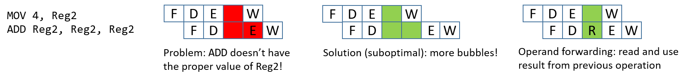
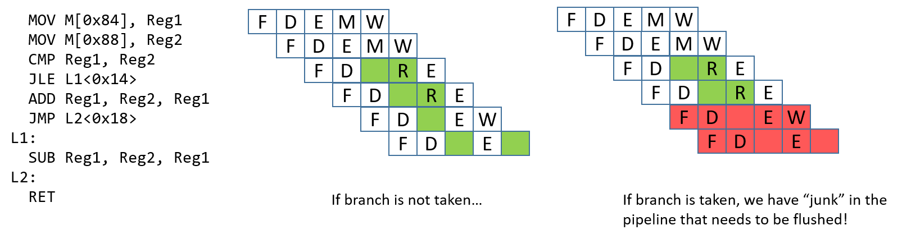

-   -   [4. Binary and Data
        Representation](../C4-Binary/index.html){.nav-link}
        -   [4.1. Number Bases and Unsigned
            Integers](../C4-Binary/bases.html){.nav-link}
        -   [4.2. Converting Between
            Bases](../C4-Binary/conversion.html){.nav-link}
        -   [4.3. Signed Binary
            Integers](../C4-Binary/signed.html){.nav-link}
        -   [4.4. Binary Integer
            Arithmetic](../C4-Binary/arithmetic.html){.nav-link}
            -   [4.4.1.
                Addition](../C4-Binary/arithmetic_addition.html){.nav-link}
            -   [4.4.2.
                Subtraction](../C4-Binary/arithmetic_subtraction.html){.nav-link}
            -   [4.4.3. Multiplication &
                Division](../C4-Binary/arithmetic_mult_div.html){.nav-link}
        -   [4.5. Overflow](../C4-Binary/overflow.html){.nav-link}
        -   [4.6. Bitwise
            Operators](../C4-Binary/bitwise.html){.nav-link}
        -   [4.7. Integer Byte
            Order](../C4-Binary/byte_order.html){.nav-link}
        -   [4.8. Real Numbers in
            Binary](../C4-Binary/floating_point.html){.nav-link}
        -   [4.9. Summary](../C4-Binary/summary.html){.nav-link}
        -   [4.10. Exercises](../C4-Binary/exercises.html){.nav-link}

-   -   [5. What von Neumann Knew: Computer
        Architecture](index.html){.nav-link}
        -   [5.1. The Origins of Modern Computing](hist.html){.nav-link}
        -   [5.2. The von Neumann Architecture](von.html){.nav-link}
        -   [5.3. Logic Gates](gates.html){.nav-link}
        -   [5.4. Circuits](circuits.html){.nav-link}
            -   [5.4.1. Arithmetic and Logic
                Circuits](arithlogiccircs.html){.nav-link}
            -   [5.4.2. Control Circuits](controlcircs.html){.nav-link}
            -   [5.4.3. Storage Circuits](storagecircs.html){.nav-link}
        -   [5.5. Building a Processor](cpu.html){.nav-link}
        -   [5.6. The Processor's Execution of Program
            Instructions](instrexec.html){.nav-link}
        -   [5.7. Pipelining Instruction
            Execution](pipelining.html){.nav-link}
        -   [5.8. Advanced Pipelining
            Considerations](pipelining_advanced.html){.nav-link}
        -   [5.9. Looking Ahead: CPUs Today](modern.html){.nav-link}
        -   [5.10. Summary](summary.html){.nav-link}
        -   [5.11. Exercises](exercises.html){.nav-link}

-   -   [6. Under the C: Dive into
        Assembly](../C6-asm_intro/index.html){.nav-link}

-   -   [7. 64-bit x86 Assembly](../C7-x86_64/index.html){.nav-link}
        -   [7.1. Assembly Basics](../C7-x86_64/basics.html){.nav-link}
        -   [7.2. Common
            Instructions](../C7-x86_64/common.html){.nav-link}
        -   [7.3. Additional Arithmetic
            Instructions](../C7-x86_64/arithmetic.html){.nav-link}
        -   [7.4. Conditional Control and
            Loops](../C7-x86_64/conditional_control_loops.html){.nav-link}
            -   [7.4.1.
                Preliminaries](../C7-x86_64/preliminaries.html){.nav-link}
            -   [7.4.2. If
                Statements](../C7-x86_64/if_statements.html){.nav-link}
            -   [7.4.3. Loops](../C7-x86_64/loops.html){.nav-link}
        -   [7.5. Functions in
            Assembly](../C7-x86_64/functions.html){.nav-link}
        -   [7.6. Recursion](../C7-x86_64/recursion.html){.nav-link}
        -   [7.7. Arrays in
            Assembly](../C7-x86_64/arrays.html){.nav-link}
        -   [7.8. Matrices in
            Assembly](../C7-x86_64/matrices.html){.nav-link}
        -   [7.9. Structs in
            Assembly](../C7-x86_64/structs.html){.nav-link}
        -   [7.10. Buffer
            Overflows](../C7-x86_64/buffer_overflow.html){.nav-link}
        -   [7.11. Exercises](../C7-x86_64/exercises.html){.nav-link}

-   -   [8. 32-bit x86 Assembly](../C8-IA32/index.html){.nav-link}
        -   [8.1. Assembly Basics](../C8-IA32/basics.html){.nav-link}
        -   [8.2. Common
            Instructions](../C8-IA32/common.html){.nav-link}
        -   [8.3. Additional Arithmetic
            Instructions](../C8-IA32/arithmetic.html){.nav-link}
        -   [8.4. Conditional Control and
            Loops](../C8-IA32/conditional_control_loops.html){.nav-link}
            -   [8.4.1.
                Preliminaries](../C8-IA32/preliminaries.html){.nav-link}
            -   [8.4.2. If
                Statements](../C8-IA32/if_statements.html){.nav-link}
            -   [8.4.3. Loops](../C8-IA32/loops.html){.nav-link}
        -   [8.5. Functions in
            Assembly](../C8-IA32/functions.html){.nav-link}
        -   [8.6. Recursion](../C8-IA32/recursion.html){.nav-link}
        -   [8.7. Arrays in Assembly](../C8-IA32/arrays.html){.nav-link}
        -   [8.8. Matrices in
            Assembly](../C8-IA32/matrices.html){.nav-link}
        -   [8.9. Structs in
            Assembly](../C8-IA32/structs.html){.nav-link}
        -   [8.10. Buffer
            Overflows](../C8-IA32/buffer_overflow.html){.nav-link}
        -   [8.11. Exercises](../C8-IA32/exercises.html){.nav-link}

-   -   [9. ARMv8 Assembly](../C9-ARM64/index.html){.nav-link}
        -   [9.1. Assembly Basics](../C9-ARM64/basics.html){.nav-link}
        -   [9.2. Common
            Instructions](../C9-ARM64/common.html){.nav-link}
        -   [9.3. Arithmetic
            Instructions](../C9-ARM64/arithmetic.html){.nav-link}
        -   [9.4. Conditional Control and
            Loops](../C9-ARM64/conditional_control_loops.html){.nav-link}
            -   [9.4.1.
                Preliminaries](../C9-ARM64/preliminaries.html){.nav-link}
            -   [9.4.2. If
                Statements](../C9-ARM64/if_statements.html){.nav-link}
            -   [9.4.3. Loops](../C9-ARM64/loops.html){.nav-link}
        -   [9.5. Functions in
            Assembly](../C9-ARM64/functions.html){.nav-link}
        -   [9.6. Recursion](../C9-ARM64/recursion.html){.nav-link}
        -   [9.7. Arrays in
            Assembly](../C9-ARM64/arrays.html){.nav-link}
        -   [9.8. Matrices in
            Assembly](../C9-ARM64/matrices.html){.nav-link}
        -   [9.9. Structs in
            Assembly](../C9-ARM64/structs.html){.nav-link}
        -   [9.10. Buffer
            Overflows](../C9-ARM64/buffer_overflow.html){.nav-link}
        -   [9.11. Exercises](../C9-ARM64/exercises.html){.nav-link}

-   -   [10. Key Assembly
        Takeaways](../C10-asm_takeaways/index.html){.nav-link}

-   -   [11. Storage and the Memory
        Hierarchy](../C11-MemHierarchy/index.html){.nav-link}
        -   [11.1. The Memory
            Hierarchy](../C11-MemHierarchy/mem_hierarchy.html){.nav-link}
        -   [11.2. Storage
            Devices](../C11-MemHierarchy/devices.html){.nav-link}
        -   [11.3.
            Locality](../C11-MemHierarchy/locality.html){.nav-link}
        -   [11.4. Caching](../C11-MemHierarchy/caching.html){.nav-link}
        -   [11.5. Cache Analysis and
            Cachegrind](../C11-MemHierarchy/cachegrind.html){.nav-link}
        -   [11.6. Looking Ahead: Caching on Multicore
            Processors](../C11-MemHierarchy/coherency.html){.nav-link}
        -   [11.7. Summary](../C11-MemHierarchy/summary.html){.nav-link}
        -   [11.8.
            Exercises](../C11-MemHierarchy/exercises.html){.nav-link}

-   -   [12. Code Optimization](../C12-CodeOpt/index.html){.nav-link}
        -   [12.1. First Steps](../C12-CodeOpt/basic.html){.nav-link}
        -   [12.2. Other Compiler
            Optimizations](../C12-CodeOpt/loops_functions.html){.nav-link}
        -   [12.3. Memory
            Considerations](../C12-CodeOpt/memory_considerations.html){.nav-link}
        -   [12.4. Summary](../C12-CodeOpt/summary.html){.nav-link}

-   -   [13. The Operating System](../C13-OS/index.html){.nav-link}
        -   [13.1. Booting and Running](../C13-OS/impl.html){.nav-link}
        -   [13.2. Processes](../C13-OS/processes.html){.nav-link}
        -   [13.3. Virtual Memory](../C13-OS/vm.html){.nav-link}
        -   [13.4. Interprocess
            Communication](../C13-OS/ipc.html){.nav-link}
            -   [13.4.1. Signals](../C13-OS/ipc_signals.html){.nav-link}
            -   [13.4.2. Message
                Passing](../C13-OS/ipc_msging.html){.nav-link}
            -   [13.4.3. Shared
                Memory](../C13-OS/ipc_shm.html){.nav-link}
        -   [13.5. Summary and Other OS
            Functionality](../C13-OS/advanced.html){.nav-link}
        -   [13.6. Exercises](../C13-OS/exercises.html){.nav-link}

-   -   [14. Leveraging Shared Memory in the Multicore
        Era](../C14-SharedMemory/index.html){.nav-link}
        -   [14.1. Programming Multicore
            Systems](../C14-SharedMemory/multicore.html){.nav-link}
        -   [14.2. POSIX
            Threads](../C14-SharedMemory/posix.html){.nav-link}
        -   [14.3. Synchronizing
            Threads](../C14-SharedMemory/synchronization.html){.nav-link}
            -   [14.3.1. Mutual
                Exclusion](../C14-SharedMemory/mutex.html){.nav-link}
            -   [14.3.2.
                Semaphores](../C14-SharedMemory/semaphores.html){.nav-link}
            -   [14.3.3. Other Synchronization
                Constructs](../C14-SharedMemory/other_syncs.html){.nav-link}
        -   [14.4. Measuring Parallel
            Performance](../C14-SharedMemory/performance.html){.nav-link}
            -   [14.4.1. Parallel Performance
                Basics](../C14-SharedMemory/performance_basics.html){.nav-link}
            -   [14.4.2. Advanced
                Topics](../C14-SharedMemory/performance_advanced.html){.nav-link}
        -   [14.5. Cache
            Coherence](../C14-SharedMemory/cache_coherence.html){.nav-link}
        -   [14.6. Thread
            Safety](../C14-SharedMemory/thread_safety.html){.nav-link}
        -   [14.7. Implicit Threading with
            OpenMP](../C14-SharedMemory/openmp.html){.nav-link}
        -   [14.8. Summary](../C14-SharedMemory/summary.html){.nav-link}
        -   [14.9.
            Exercises](../C14-SharedMemory/exercises.html){.nav-link}

-   -   [15. Looking Ahead: Other Parallel
        Systems](../C15-Parallel/index.html){.nav-link}
        -   [15.1. Hardware Acceleration and
            CUDA](../C15-Parallel/gpu.html){.nav-link}
        -   [15.2. Distributed Memory
            Systems](../C15-Parallel/distrmem.html){.nav-link}
        -   [15.3. To Exascale and
            Beyond](../C15-Parallel/cloud.html){.nav-link}

-   -   [16. Appendix 1: Chapter 1 for Java
        Programmers](../Appendix1/index.html){.nav-link}
        -   [16.1. Getting Started Programming in
            C](../Appendix1/getting_started.html){.nav-link}
        -   [16.2. Input/Output (printf and
            scanf)](../Appendix1/input_output.html){.nav-link}
        -   [16.3. Conditionals and
            Loops](../Appendix1/conditionals.html){.nav-link}
        -   [16.4. Functions](../Appendix1/functions.html){.nav-link}
        -   [16.5. Arrays and
            Strings](../Appendix1/arrays_strings.html){.nav-link}
        -   [16.6. Structs](../Appendix1/structs.html){.nav-link}
        -   [16.7. Summary](../Appendix1/summary.html){.nav-link}
        -   [16.8. Exercises](../Appendix1/exercises.html){.nav-link}

-   -   [17. Appendix 2: Using Unix](../Appendix2/index.html){.nav-link}
        -   [17.1. Unix Command Line and the Unix File
            System](../Appendix2/cmdln_basics.html){.nav-link}
        -   [17.2. Man and the Unix
            Manual](../Appendix2/man.html){.nav-link}
        -   [17.3. Remote Access](../Appendix2/ssh_scp.html){.nav-link}
        -   [17.4. Unix Editors](../Appendix2/editors.html){.nav-link}
        -   [17.5. make and
            Makefiles](../Appendix2/makefiles.html){.nav-link}
        -   [17.6 Searching: grep and
            find](../Appendix2/grep.html){.nav-link}
        -   [17.7 File Permissions](../Appendix2/chmod.html){.nav-link}
        -   [17.8 Archiving and Compressing
            Files](../Appendix2/tar.html){.nav-link}
        -   [17.9 Process Control](../Appendix2/pskill.html){.nav-link}
        -   [17.10 Timing](../Appendix2/timing.html){.nav-link}
        -   [17.11 Command
            History](../Appendix2/history.html){.nav-link}
        -   [17.12 I/0
            Redirection](../Appendix2/ioredirect.html){.nav-link}
        -   [17.13 Pipes](../Appendix2/pipe.html){.nav-link}
        -   [17.14 Dot Files and
            .bashrc](../Appendix2/dotfiles.html){.nav-link}
        -   [17.15 Shell
            Programming](../Appendix2/shellprog.html){.nav-link}
        -   [17.16 Getting System
            Information](../Appendix2/sysinfo.html){.nav-link}


-   [Dive Into Systems](../index-2.html)
-   [5. What von Neumann Knew: Computer Architecture](index.html)
-   [5.8. Advanced Pipelining Considerations](pipelining_advanced.html)
:::

::: content
::: sect1
## [](#_advanced_pipelined_instruction_considerations){.anchor}5.8. Advanced Pipelined Instruction Considerations {#_advanced_pipelined_instruction_considerations}

::: sectionbody
::: paragraph
Recall that
[pipelining](pipelining.html#_pipelining_making_the_cpu_faster){.page}
improves the performance of a processor by overlapping the execution of
multiple instructions. In our [earlier
discussion](pipelining.html#_pipelining_making_the_cpu_faster){.page} on
pipelining, we described a simple four-stage pipeline with the basic
stages of Fetch (F), Decode (D), Execute (E) and WriteBack (W). In our
discussion that follows, we also consider a fifth stage, Memory (M),
which represents an access to data memory. Our five-stage pipeline
therefore comprises the following stages:
:::

::: ulist
-   **Fetch (F):** reads an instruction from memory (pointed to by the
    program counter).

-   **Decode (D):** reads source registers and sets control logic.

-   **Execute (E):** executes the instruction.

-   **Memory (M):** reads from or writes to data memory.

-   **WriteBack (W):** stores a result in a destination register.
:::

::: paragraph
Recall that the compiler transforms lines of code into a series of
machine code instructions for the CPU to execute. Assembly code is a
human-readable version of machine code. The snippet below displays a
series of made-up assembly instructions:
:::

::: listingblock
::: content
    MOV M[0x84], Reg1     # move value at memory address 0x84 to register Reg1
    ADD 2, Reg1, Reg1     # add 2 to value in Reg1 and store result in Reg1
    MOV 4, Reg2           # copy the value 4 to register Reg2
    ADD Reg2, Reg2, Reg2  # compute Reg2 + Reg2, store result in Reg2
    JMP L1<0x14>          # jump to executing code at L1 (code address 0x14)
:::
:::

::: paragraph
Don't worry if you are having trouble parsing the snippet --- we cover
assembly in greater detail in [upcoming
chapters](../C7-x86_64/index.html#_assembly_chapter){.page}. For now, it
suffices to focus on the following set of facts:
:::

::: ulist
-   Every ISA defines a set of instructions.

-   Each instruction operates on one or more operands (i.e. registers,
    memory, or constant values).

-   Not all instructions require the same number of pipeline stages to
    execute.
:::

::: paragraph
In our previous discussion, it was assumed that every instruction takes
the same number of cycles to execute; however, this is usually not the
case. For example, the first `MOV` instruction requires all five stages,
as it requires the movement of data from memory to a register. In
contrast, the next three instructions require only four stages (F, D, E,
W) to execute given that the operations involve only registers, and not
memory. The last instruction (`JMP`) is a type of *branch* or
*conditional* instruction. Its purpose is to transfer the flow of
control to another part of the code. Specifically, addresses in the code
region of memory reference different *instructions* in an executable.
Since the `JMP` instruction does not update a general-purpose register,
the WriteBack stage is omitted, resulting in only three stages (F, D, E)
being required. We cover conditional instructions in greater detail in
the [upcoming
chapters](../C7-x86_64/conditional_control_loops.html#_conditional_control_and_loops){.page}
on assembly.
:::

::: paragraph
A **pipeline stall** results when any instruction is forced to wait for
another to finish executing before it can continue. Compilers and
processors do whatever they can to avoid pipeline stalls in order to
maximize performance.
:::

::: sect2
### [](#_pipelining_consideration_data_hazards){.anchor}5.8.1. Pipelining Consideration: Data Hazards {#_pipelining_consideration_data_hazards}

::: paragraph
A **data hazard** occurs when two instructions attempt to access common
data in an instruction pipeline. As an example, consider the first pair
of instructions from the code snippet above:
:::

::: listingblock
::: content
    MOV M[0x84], Reg1     # move value at memory address 0x84 to register Reg1
    ADD 2, Reg1, Reg1     # add 2 to value in Reg1 and store result in Reg1
:::
:::

::: {#FigDatahazard1 .imageblock .text-center}
::: content

:::

::: title
Figure 1. An example of a pipeline hazard arising from two instructions
simultaneously reaching the same pipeline stage.
:::
:::

::: paragraph
Recall that this `MOV` instruction requires five stages (as it involves
an access to memory), whereas the `ADD` instruction requires only four.
In this scenario, both instructions will attempt to write to register
`Reg1` at the same time (see [Figure 1](#FigDatahazard1)).
:::

::: paragraph
The processor prevents the aforementioned scenario by first forcing
every instruction to take five pipeline stages to execute. For
instructions that normally take fewer than five stages, the CPU adds a
\"no-operation\" (`NOP`) instruction (also called a pipeline \"bubble\")
to substitute for that phase.
:::

::: paragraph
However, the problem is still not fully resolved. Since the goal of the
second instruction is to add `2` to the value stored in register `Reg1`,
the `MOV` instruction needs to finish *writing* to register `Reg1`
before the `ADD` instruction can execute correctly. A similar problem
exists in the next two instructions:
:::

::: listingblock
::: content
    MOV 4, Reg2           # copy the value 4 to register Reg2
    ADD Reg2, Reg2, Reg2  # compute Reg2 + Reg2, store result in Reg2
:::
:::

::: {#dataHaz .imageblock .text-center}
::: content

:::

::: title
Figure 2. The processor can reduce the damage caused by pipeline hazards
by forwarding operands between instructions.
:::
:::

::: paragraph
These two instructions load the value `4` into register `Reg2` and then
multiply it by 2 (by adding to itself). Once again, bubbles are added to
enforce that each instruction takes five pipeline stages. In this case,
regardless of the bubbles, the second instruction's execute phase occurs
*before* the first instruction finishes writing the required value (`4`)
to register `Reg2`.
:::

::: paragraph
Adding more bubbles is a suboptimal solution, because it stalls the
pipeline. Instead, processors employ a technique called **operand
forwarding**, in which the pipeline reads the result from the previous
operation. Looking at [Figure 2](#dataHaz), while the instruction
`MOV 4, Reg2` executes, it forwards its results to the instruction
`ADD Reg2, Reg2, Reg2`. So, while the `MOV` instruction is writing to
register `Reg2`, the `ADD` instruction can use the updated value of
`Reg2` that it received from the `MOV` instruction.
:::
:::

::: sect2
### [](#_pipelining_hazards_control_hazards){.anchor}5.8.2. Pipelining Hazards: Control Hazards {#_pipelining_hazards_control_hazards}

::: paragraph
The pipeline is optimized for instructions that occur one after another.
Control changes in a program arising from conditionals such as `if`
statements or loops can seriously affect the pipeline performance. Let's
take a look at a different example code snippet, first in C:
:::

::: listingblock
::: content
``` {.highlightjs .highlight}
int result = *x; // x holds an int
int temp = *y;   // y holds another int

if (result <= temp) {
    result = result - temp;
}
else {
    result = result + temp;
}
return result;
```
:::
:::

::: paragraph
This snippet simply reads integer data from two different pointers,
compares the values, and then does different arithmetic based on the
result. Here is how the above code snippet may translate into assembly
instructions:
:::

::: listingblock
::: content
      MOV M[0x84], Reg1     # move value at memory address 0x84 to register Reg1
      MOV M[0x88], Reg2     # move value at memory address 0x88 to register Reg2
      CMP Reg1, Reg2        # compare value in Reg1 to value in Reg2
      JLE L1<0x14>          # switch code execution to L1 if Reg1 less than Reg2
      ADD Reg1, Reg2, Reg1  # compute Reg1 + Reg2, store result in Reg1
      JMP L2<0x20>          # switch code execution to L2 (code address 0x20)
    L1:
      SUB Reg1, Reg2, Reg1  # compute Reg1 - Reg2, store in Reg1
    L2:
      RET                   # return from function
:::
:::

::: paragraph
This sequence of instructions loads data from memory into two separate
registers, compares the values, and then does different arithmetic based
on whether the value in the first register is less than the value in the
second. The `if` statement is represented in the above example with two
instructions: the compare (`CMP`) instruction and a conditional jump
less than (`JLE`) instruction. We cover conditional instructions in
greater detail in the [upcoming
assembly](../C7-x86_64/conditional_control_loops.html#_conditional_control_and_loops){.page}
chapters; for now it is sufficient to understand that the `CMP`
instruction *compares* two registers, while the `JLE` instruction is a
special type of branch instruction that switches code execution to
another part of the program *if and only if* the condition (i.e. less
than or equal, in this case) is true.
:::

::: {.admonitionblock .warning}
+-----------------------------------+-----------------------------------+
|                                   | ::: title                         |
|                                   | Don't get overwhelmed by the      |
|                                   | details!                          |
|                                   | :::                               |
|                                   |                                   |
|                                   | ::: paragraph                     |
|                                   | Looking at assembly for the first |
|                                   | time can be understandably        |
|                                   | intimidating. If this is how you  |
|                                   | feel, try not to worry! We cover  |
|                                   | assembly in much greater detail   |
|                                   | in [coming                        |
|                                   | chapters](../C7-x86_64/inde       |
|                                   | x.html#_assembly_chapter){.page}. |
|                                   | The key takeaway is that code     |
|                                   | containing conditional statements |
|                                   | translates to a series of         |
|                                   | assembly instructions just like   |
|                                   | any other code snippet. However,  |
|                                   | unlike other code snippets,       |
|                                   | conditional statements are *not*  |
|                                   | guaranteed to execute in a        |
|                                   | particular way. The uncertainty   |
|                                   | surrounding how a conditional     |
|                                   | statement executes has large      |
|                                   | ramifications for the pipeline.   |
|                                   | :::                               |
+-----------------------------------+-----------------------------------+
:::

::: {#controlhazprob .imageblock .text-center}
::: content

:::

::: title
Figure 3. An example of a control hazard resulting from a conditional
branch.
:::
:::

::: paragraph
A **control hazard** occurs when the pipeline encounters a branch (or
conditional) instruction. When this happens, the pipeline has to
\"guess\" whether the branch will be taken. If the branch is not taken,
the process continues to execute the next instructions in sequence.
Consider the example in [Figure 3](#controlhazprob). If the branch is
taken, the next instruction that executes should be the `SUB`
instruction. However, it is impossible to know whether the branch is
taken until the `JLE` instruction finishes executing. At that point, the
`ADD` and `JMP` instructions have already been loaded into the pipeline.
If the branch *is* taken, these \"junk\" instructions in the pipeline
need to be removed, or **flushed**, before the pipeline can be reloaded
with new instructions. Flushing the pipeline is expensive.
:::

::: paragraph
There are a few options that hardware engineers can choose to implement
to help the processor deal with control hazards:
:::

::: ulist
-   **Stall the pipeline**: As a simple solution, whenever there is a
    branch, add lots of `NOP` bubbles and stall the pipeline until the
    processor is sure that the branch is taken. Although stalling the
    pipeline will fix the issue, it will also lead to a performance hit
    (see [Figure 4](#controlHaz)).

-   **Branch prediction**: The most common solution is to use a **branch
    predictor**, which will predict which way a branch will go, based on
    previous executions. Modern branch predictors are really good and
    accurate. However, this approach has recently caused some security
    vulnerabilities (e.g. Spectre^1^). [Figure 4](#controlHaz) depicts
    how a branch predictor may deal with the control hazard discussed.

-   **Eager execution**: In eager execution, the CPU executes both sides
    of the branch and performs a conditional transfer of data rather
    than control (implemented through the
    [cmov](../C7-x86_64/if_statements.html#_the_cmov_instructions){.page}
    and the
    [csel](../C9-ARM64/if_statements.html#_the_conditional_select_instruction){.page}
    instructions in x86 and ARMv8-A, respectively). A conditional
    transfer of data enables the processor to continue execution without
    disrupting the pipeline. However, not all code is capable of taking
    advantage of eager execution, which can be dangerous in the case of
    pointer dereferences and side effects.
:::

::: {#controlHaz .imageblock .text-center}
::: content

:::

::: title
Figure 4. Potential solutions for handling control hazards.
:::
:::

### References {#_references .discrete}

::: {.olist .arabic}
1.  Peter Bright. [Google: Software is never going to be able to fix
    Spectre-type
    bugs](https://arstechnica.com/gadgets/2019/02/google-software-is-never-going-to-be-able-to-fix-spectre-type-bugs/)
    *Ars Technica* 2019.
:::
:::
:::
:::

::: toc-menu
:::
:::
:::
:::

Copyright (C) 2020 Dive into Systems, LLC.

*Dive into Systems,* is licensed under the Creative Commons
[Attribution-NonCommercial-NoDerivatives 4.0
International](https://creativecommons.org/licenses/by-nc-nd/4.0/) (CC
BY-NC-ND 4.0).
