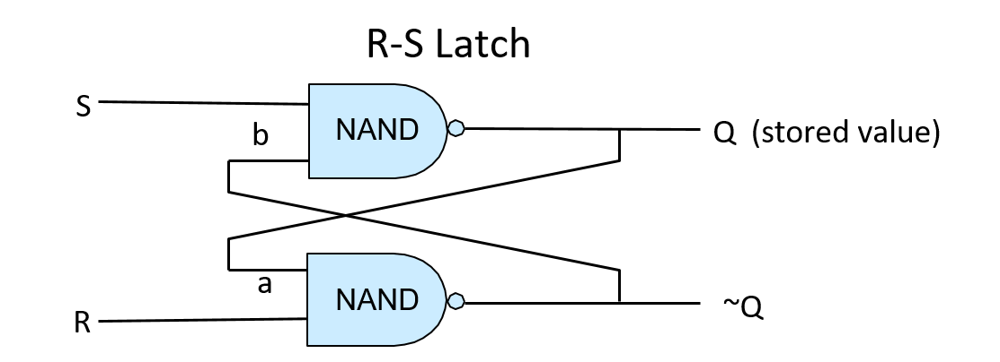
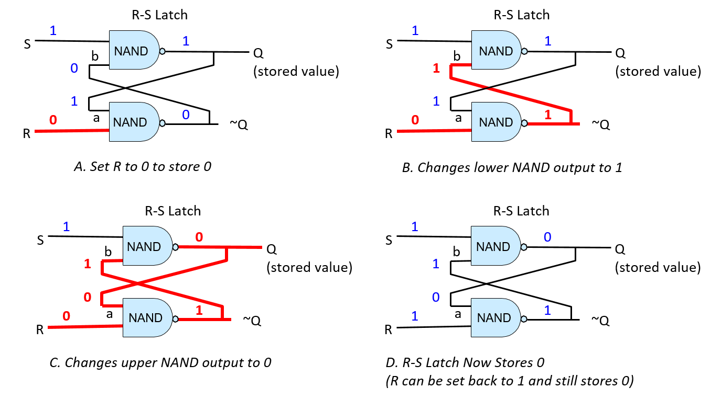

-   -   [4. Binary and Data
        Representation](../C4-Binary/index.html){.nav-link}
        -   [4.1. Number Bases and Unsigned
            Integers](../C4-Binary/bases.html){.nav-link}
        -   [4.2. Converting Between
            Bases](../C4-Binary/conversion.html){.nav-link}
        -   [4.3. Signed Binary
            Integers](../C4-Binary/signed.html){.nav-link}
        -   [4.4. Binary Integer
            Arithmetic](../C4-Binary/arithmetic.html){.nav-link}
            -   [4.4.1.
                Addition](../C4-Binary/arithmetic_addition.html){.nav-link}
            -   [4.4.2.
                Subtraction](../C4-Binary/arithmetic_subtraction.html){.nav-link}
            -   [4.4.3. Multiplication &
                Division](../C4-Binary/arithmetic_mult_div.html){.nav-link}
        -   [4.5. Overflow](../C4-Binary/overflow.html){.nav-link}
        -   [4.6. Bitwise
            Operators](../C4-Binary/bitwise.html){.nav-link}
        -   [4.7. Integer Byte
            Order](../C4-Binary/byte_order.html){.nav-link}
        -   [4.8. Real Numbers in
            Binary](../C4-Binary/floating_point.html){.nav-link}
        -   [4.9. Summary](../C4-Binary/summary.html){.nav-link}
        -   [4.10. Exercises](../C4-Binary/exercises.html){.nav-link}

-   -   [5. What von Neumann Knew: Computer
        Architecture](index.html){.nav-link}
        -   [5.1. The Origins of Modern Computing](hist.html){.nav-link}
        -   [5.2. The von Neumann Architecture](von.html){.nav-link}
        -   [5.3. Logic Gates](gates.html){.nav-link}
        -   [5.4. Circuits](circuits.html){.nav-link}
            -   [5.4.1. Arithmetic and Logic
                Circuits](arithlogiccircs.html){.nav-link}
            -   [5.4.2. Control Circuits](controlcircs.html){.nav-link}
            -   [5.4.3. Storage Circuits](storagecircs.html){.nav-link}
        -   [5.5. Building a Processor](cpu.html){.nav-link}
        -   [5.6. The Processor's Execution of Program
            Instructions](instrexec.html){.nav-link}
        -   [5.7. Pipelining Instruction
            Execution](pipelining.html){.nav-link}
        -   [5.8. Advanced Pipelining
            Considerations](pipelining_advanced.html){.nav-link}
        -   [5.9. Looking Ahead: CPUs Today](modern.html){.nav-link}
        -   [5.10. Summary](summary.html){.nav-link}
        -   [5.11. Exercises](exercises.html){.nav-link}

-   -   [6. Under the C: Dive into
        Assembly](../C6-asm_intro/index.html){.nav-link}

-   -   [7. 64-bit x86 Assembly](../C7-x86_64/index.html){.nav-link}
        -   [7.1. Assembly Basics](../C7-x86_64/basics.html){.nav-link}
        -   [7.2. Common
            Instructions](../C7-x86_64/common.html){.nav-link}
        -   [7.3. Additional Arithmetic
            Instructions](../C7-x86_64/arithmetic.html){.nav-link}
        -   [7.4. Conditional Control and
            Loops](../C7-x86_64/conditional_control_loops.html){.nav-link}
            -   [7.4.1.
                Preliminaries](../C7-x86_64/preliminaries.html){.nav-link}
            -   [7.4.2. If
                Statements](../C7-x86_64/if_statements.html){.nav-link}
            -   [7.4.3. Loops](../C7-x86_64/loops.html){.nav-link}
        -   [7.5. Functions in
            Assembly](../C7-x86_64/functions.html){.nav-link}
        -   [7.6. Recursion](../C7-x86_64/recursion.html){.nav-link}
        -   [7.7. Arrays in
            Assembly](../C7-x86_64/arrays.html){.nav-link}
        -   [7.8. Matrices in
            Assembly](../C7-x86_64/matrices.html){.nav-link}
        -   [7.9. Structs in
            Assembly](../C7-x86_64/structs.html){.nav-link}
        -   [7.10. Buffer
            Overflows](../C7-x86_64/buffer_overflow.html){.nav-link}
        -   [7.11. Exercises](../C7-x86_64/exercises.html){.nav-link}

-   -   [8. 32-bit x86 Assembly](../C8-IA32/index.html){.nav-link}
        -   [8.1. Assembly Basics](../C8-IA32/basics.html){.nav-link}
        -   [8.2. Common
            Instructions](../C8-IA32/common.html){.nav-link}
        -   [8.3. Additional Arithmetic
            Instructions](../C8-IA32/arithmetic.html){.nav-link}
        -   [8.4. Conditional Control and
            Loops](../C8-IA32/conditional_control_loops.html){.nav-link}
            -   [8.4.1.
                Preliminaries](../C8-IA32/preliminaries.html){.nav-link}
            -   [8.4.2. If
                Statements](../C8-IA32/if_statements.html){.nav-link}
            -   [8.4.3. Loops](../C8-IA32/loops.html){.nav-link}
        -   [8.5. Functions in
            Assembly](../C8-IA32/functions.html){.nav-link}
        -   [8.6. Recursion](../C8-IA32/recursion.html){.nav-link}
        -   [8.7. Arrays in Assembly](../C8-IA32/arrays.html){.nav-link}
        -   [8.8. Matrices in
            Assembly](../C8-IA32/matrices.html){.nav-link}
        -   [8.9. Structs in
            Assembly](../C8-IA32/structs.html){.nav-link}
        -   [8.10. Buffer
            Overflows](../C8-IA32/buffer_overflow.html){.nav-link}
        -   [8.11. Exercises](../C8-IA32/exercises.html){.nav-link}

-   -   [9. ARMv8 Assembly](../C9-ARM64/index.html){.nav-link}
        -   [9.1. Assembly Basics](../C9-ARM64/basics.html){.nav-link}
        -   [9.2. Common
            Instructions](../C9-ARM64/common.html){.nav-link}
        -   [9.3. Arithmetic
            Instructions](../C9-ARM64/arithmetic.html){.nav-link}
        -   [9.4. Conditional Control and
            Loops](../C9-ARM64/conditional_control_loops.html){.nav-link}
            -   [9.4.1.
                Preliminaries](../C9-ARM64/preliminaries.html){.nav-link}
            -   [9.4.2. If
                Statements](../C9-ARM64/if_statements.html){.nav-link}
            -   [9.4.3. Loops](../C9-ARM64/loops.html){.nav-link}
        -   [9.5. Functions in
            Assembly](../C9-ARM64/functions.html){.nav-link}
        -   [9.6. Recursion](../C9-ARM64/recursion.html){.nav-link}
        -   [9.7. Arrays in
            Assembly](../C9-ARM64/arrays.html){.nav-link}
        -   [9.8. Matrices in
            Assembly](../C9-ARM64/matrices.html){.nav-link}
        -   [9.9. Structs in
            Assembly](../C9-ARM64/structs.html){.nav-link}
        -   [9.10. Buffer
            Overflows](../C9-ARM64/buffer_overflow.html){.nav-link}
        -   [9.11. Exercises](../C9-ARM64/exercises.html){.nav-link}

-   -   [10. Key Assembly
        Takeaways](../C10-asm_takeaways/index.html){.nav-link}

-   -   [11. Storage and the Memory
        Hierarchy](../C11-MemHierarchy/index.html){.nav-link}
        -   [11.1. The Memory
            Hierarchy](../C11-MemHierarchy/mem_hierarchy.html){.nav-link}
        -   [11.2. Storage
            Devices](../C11-MemHierarchy/devices.html){.nav-link}
        -   [11.3.
            Locality](../C11-MemHierarchy/locality.html){.nav-link}
        -   [11.4. Caching](../C11-MemHierarchy/caching.html){.nav-link}
        -   [11.5. Cache Analysis and
            Cachegrind](../C11-MemHierarchy/cachegrind.html){.nav-link}
        -   [11.6. Looking Ahead: Caching on Multicore
            Processors](../C11-MemHierarchy/coherency.html){.nav-link}
        -   [11.7. Summary](../C11-MemHierarchy/summary.html){.nav-link}
        -   [11.8.
            Exercises](../C11-MemHierarchy/exercises.html){.nav-link}

-   -   [12. Code Optimization](../C12-CodeOpt/index.html){.nav-link}
        -   [12.1. First Steps](../C12-CodeOpt/basic.html){.nav-link}
        -   [12.2. Other Compiler
            Optimizations](../C12-CodeOpt/loops_functions.html){.nav-link}
        -   [12.3. Memory
            Considerations](../C12-CodeOpt/memory_considerations.html){.nav-link}
        -   [12.4. Summary](../C12-CodeOpt/summary.html){.nav-link}

-   -   [13. The Operating System](../C13-OS/index.html){.nav-link}
        -   [13.1. Booting and Running](../C13-OS/impl.html){.nav-link}
        -   [13.2. Processes](../C13-OS/processes.html){.nav-link}
        -   [13.3. Virtual Memory](../C13-OS/vm.html){.nav-link}
        -   [13.4. Interprocess
            Communication](../C13-OS/ipc.html){.nav-link}
            -   [13.4.1. Signals](../C13-OS/ipc_signals.html){.nav-link}
            -   [13.4.2. Message
                Passing](../C13-OS/ipc_msging.html){.nav-link}
            -   [13.4.3. Shared
                Memory](../C13-OS/ipc_shm.html){.nav-link}
        -   [13.5. Summary and Other OS
            Functionality](../C13-OS/advanced.html){.nav-link}
        -   [13.6. Exercises](../C13-OS/exercises.html){.nav-link}

-   -   [14. Leveraging Shared Memory in the Multicore
        Era](../C14-SharedMemory/index.html){.nav-link}
        -   [14.1. Programming Multicore
            Systems](../C14-SharedMemory/multicore.html){.nav-link}
        -   [14.2. POSIX
            Threads](../C14-SharedMemory/posix.html){.nav-link}
        -   [14.3. Synchronizing
            Threads](../C14-SharedMemory/synchronization.html){.nav-link}
            -   [14.3.1. Mutual
                Exclusion](../C14-SharedMemory/mutex.html){.nav-link}
            -   [14.3.2.
                Semaphores](../C14-SharedMemory/semaphores.html){.nav-link}
            -   [14.3.3. Other Synchronization
                Constructs](../C14-SharedMemory/other_syncs.html){.nav-link}
        -   [14.4. Measuring Parallel
            Performance](../C14-SharedMemory/performance.html){.nav-link}
            -   [14.4.1. Parallel Performance
                Basics](../C14-SharedMemory/performance_basics.html){.nav-link}
            -   [14.4.2. Advanced
                Topics](../C14-SharedMemory/performance_advanced.html){.nav-link}
        -   [14.5. Cache
            Coherence](../C14-SharedMemory/cache_coherence.html){.nav-link}
        -   [14.6. Thread
            Safety](../C14-SharedMemory/thread_safety.html){.nav-link}
        -   [14.7. Implicit Threading with
            OpenMP](../C14-SharedMemory/openmp.html){.nav-link}
        -   [14.8. Summary](../C14-SharedMemory/summary.html){.nav-link}
        -   [14.9.
            Exercises](../C14-SharedMemory/exercises.html){.nav-link}

-   -   [15. Looking Ahead: Other Parallel
        Systems](../C15-Parallel/index.html){.nav-link}
        -   [15.1. Hardware Acceleration and
            CUDA](../C15-Parallel/gpu.html){.nav-link}
        -   [15.2. Distributed Memory
            Systems](../C15-Parallel/distrmem.html){.nav-link}
        -   [15.3. To Exascale and
            Beyond](../C15-Parallel/cloud.html){.nav-link}

-   -   [16. Appendix 1: Chapter 1 for Java
        Programmers](../Appendix1/index.html){.nav-link}
        -   [16.1. Getting Started Programming in
            C](../Appendix1/getting_started.html){.nav-link}
        -   [16.2. Input/Output (printf and
            scanf)](../Appendix1/input_output.html){.nav-link}
        -   [16.3. Conditionals and
            Loops](../Appendix1/conditionals.html){.nav-link}
        -   [16.4. Functions](../Appendix1/functions.html){.nav-link}
        -   [16.5. Arrays and
            Strings](../Appendix1/arrays_strings.html){.nav-link}
        -   [16.6. Structs](../Appendix1/structs.html){.nav-link}
        -   [16.7. Summary](../Appendix1/summary.html){.nav-link}
        -   [16.8. Exercises](../Appendix1/exercises.html){.nav-link}

-   -   [17. Appendix 2: Using Unix](../Appendix2/index.html){.nav-link}
        -   [17.1. Unix Command Line and the Unix File
            System](../Appendix2/cmdln_basics.html){.nav-link}
        -   [17.2. Man and the Unix
            Manual](../Appendix2/man.html){.nav-link}
        -   [17.3. Remote Access](../Appendix2/ssh_scp.html){.nav-link}
        -   [17.4. Unix Editors](../Appendix2/editors.html){.nav-link}
        -   [17.5. make and
            Makefiles](../Appendix2/makefiles.html){.nav-link}
        -   [17.6 Searching: grep and
            find](../Appendix2/grep.html){.nav-link}
        -   [17.7 File Permissions](../Appendix2/chmod.html){.nav-link}
        -   [17.8 Archiving and Compressing
            Files](../Appendix2/tar.html){.nav-link}
        -   [17.9 Process Control](../Appendix2/pskill.html){.nav-link}
        -   [17.10 Timing](../Appendix2/timing.html){.nav-link}
        -   [17.11 Command
            History](../Appendix2/history.html){.nav-link}
        -   [17.12 I/0
            Redirection](../Appendix2/ioredirect.html){.nav-link}
        -   [17.13 Pipes](../Appendix2/pipe.html){.nav-link}
        -   [17.14 Dot Files and
            .bashrc](../Appendix2/dotfiles.html){.nav-link}
        -   [17.15 Shell
            Programming](../Appendix2/shellprog.html){.nav-link}
        -   [17.16 Getting System
            Information](../Appendix2/sysinfo.html){.nav-link}

-   [Dive Into Systems](../index-2.html)
-   [5. What von Neumann Knew: Computer Architecture](index.html)
-   [5.4. Circuits](circuits.html)
-   [5.4.3. Storage Circuits](storagecircs.html)
:::

::: content
::: sect2
### {.anchor}5.4.3. Storage Circuits {#_storage_circuits}

::: paragraph
**Storage circuits** are used to construct computer memory for storing
binary values. The type of computer memory built from storage circuits
is called **static RAM** (SRAM). It is used to build CPU register
storage and on-chip cache memory. Systems typically use **dynamic RAM**
(DRAM) for main memory (RAM) storage. The capacitor-based design of DRAM
requires that it be periodically refreshed with the value it stores,
hence the \"dynamic\" moniker. SRAM is circuit-based storage that does
not need to have its values refreshed, thus it is referred to as static
RAM. Circuit-based memory is faster but more expensive than
capacitor-based memory. As a result, SRAM tends to be used for storage
at the top of the [memory
hierarchy](../C11-MemHierarchy/mem_hierarchy.html#_the_memory_hierarchy){.page}
(CPU registers and on-chip cache memory), and DRAM for main memory (RAM)
storage. In this chapter, we focus on circuit-based memory like SRAM.
:::

::: paragraph
To store a value, a circuit must contain a feedback loop so that the
value is retained by the circuit. In other words, a storage circuit's
value depends on its input values and also its currently stored value.
When the circuit stores a value, its currently stored value and its
inputs together produce an output that matches the currently stored
value (i.e. the circuit continues to store the same value). When a new
value is written into a storage circuit, the circuit's input values
change momentarily to modify the behavior of the circuit, which results
in a new value being written into and stored in the circuit. Once
written, the circuit resumes a steady state of storing the newly written
value until the next write to the circuit occurs.
:::

::: sect3
#### {.anchor}RS Latch {#_rs_latch}

::: paragraph
A latch is a digital circuit that stores (or remembers) a 1-bit value.
One example is a **reset-set latch** (or RS latch). An RS latch has two
input values, S and R, and one output value, Q, which is also the value
stored in the latch. An RS latch may additionally output NOT(Q), the
negation of the stored value. [Figure 1](#Figrslatch) shows an RS latch
circuit for storing a single bit.
:::

::: {#Figrslatch .imageblock .text-center}
::: content
{width="750"}
:::

::: title
Figure 1. An RS latch circuit stores a 1-bit value.
:::
:::

::: paragraph
The first thing to note about the RS latch is the feedback loop from its
outputs to its inputs: the output of the top NAND gate (Q) is input (a)
to the bottom NAND gate, and the output of the bottom NAND gate (\~Q) is
input (b) to the top NAND gate. When inputs S and R are both 1, the RS
latch stores the value Q. In other words, when S and R are both 1, the
RS latch output value Q is stable. To see this behavior, consider
[Figure 2](#Figlatchstores1); this shows an RS latch that stores the
value 1 (Q is 1). When R and S are both 1, the feedback input value (a)
to the bottom NAND gate is the value of Q, which is 1, so the output of
the bottom NAND gate is 0 (1 NAND 1 is 0). The feedback input value (b)
to the top NAND gate is the output of the bottom NAND gate, which is 0.
The other input to the top NAND gate is 1, the value of S. The output of
the top gate is 1 (1 NAND 0 is 1). Thus, when S and R are both 1, this
circuit continuously stores the value of Q (1 in this example).
:::

::: {#Figlatchstores1 .imageblock .text-center}
::: content
{width="750"}
:::

::: title
Figure 2. An RS latch that stores a 1-bit value. R and S are both 1 when
the latch stores a value. The stored value is output Q.
:::
:::

::: paragraph
To change the value stored in an RS latch, the value of exactly one of R
or S is set to 0. When the latch stores the new value, R and S are set
back to 1. Control circuitry around the RS latch ensures that R and S
can never simultaneously be 0: at most one of them will have a value 0,
and a value of 0 for one of R or S means that a value is being written
into the RS latch. To store the value 0 in an RS latch, input R is set
to 0 (and the value of S stays at 1). To store the value 1 in an RS
latch, input S is set to 0 (and the value of R stays at 1). For example,
assume that the RS latch currently stores 1. To write 0 into the latch,
R's value is set to 0. This means that the values 0 and 1 are input to
the lower NAND gate which computes the result of (0 NAND 1), or is 1.
This output value of 1 is also input b to the top NAND gate (shown in
[Figure 3](#Figwrite0) B). With a new b input value of 1 and the S input
value 1, the upper NAND gate computes a new output value 0 for Q, which
is also fed as input a into the lower NAND gate (shown in [Figure
3](#Figwrite0) C). With a's value 0 and b's value 1, the latch now
stores 0. When R is eventually set back to 1 the RS latch continues to
store the value 0 (shown in [Figure 3](#Figwrite0) D).
:::

::: {#Figwrite0 .imageblock .text-center}
::: content

:::

::: title
Figure 3. To write 0 to an RS latch, momentarily set R to 0.
:::
:::
:::

::: sect3
#### {.anchor}Gated D Latch {#_gated_d_latch}

::: paragraph
A **gated D latch** adds circuitry to an RS latch to ensure that it
never receives an input of 0 to both R and S simultaneously. [Figure
4](#FiggatedD) shows the construction of a gated D latch.
:::

::: {#FiggatedD .imageblock .text-center}
::: content

:::

::: title
Figure 4. A gated D latch stores a 1-bit value. Its first set of NAND
gates control writes to the RS latch and ensure that the values of R and
S are never both simultaneously 0.
:::
:::

::: paragraph
The data input (D) to the gated D latch is the value to store into the
circuit (either 0 or 1). The Write Enable (WE) input controls writing a
value into the RS latch. When WE is 0, the output from both NAND gates
is 1, resulting in S and R input values of 1 to the RS latch (the RS
latch stores a value). The gated D latch writes the value of D into the
RS latch only when WE is 1. Because the data input (D) value is inverted
before it is sent to the bottom NAND gate, the input of only one of the
top or bottom NAND gates input is 1. This means that when the WE bit is
1, exactly one of R or S is 0. For example, when D is 1 and WE is 1, the
top NAND computes (1 NAND 1) and the bottom NAND gate computes (O NAND
1). As a result, the input to S from the top NAND gate is 0 and the
input to R from the bottom NAND gate is 1, resulting in writing the
value 1 into the RS latch. When the WE input is 0, both NAND gates
output 1, keeping R and S at 1. In other words, when WE is 0, the value
of D has no effect on the value stored in the RS latch; only when WE is
1 is the value of D written into the latch. To write another value into
the gated D latch, set D to the value to store and WE to 1.
:::
:::

::: sect3
#### {.anchor}CPU Register {#_cpu_register}

::: paragraph
Multibit storage circuits are built by linking several 1-bit storage
circuits together. For example, combining 32 1-bit D latches together
yields a 32-bit storage circuit that could be used as a 32-bit CPU
register, as shown in [Figure 5](#Figcpuregcircuit). The register
circuit has two input values: a 32-bit data value and a 1-bit Write
Enable signal. Internally, each 1-bit D latch takes as its D input one
bit of the register's 32-bit *Data in* input, and each 1-bit D latch
takes the register's WE input as its WE input. The register's output is
the 32-bit value stored across the 32 1-bit D latches that make up the
register circuit.
:::

::: {#Figcpuregcircuit .imageblock .text-center}
::: content

:::

::: title
Figure 5. A CPU register is built from multiple gated D latches (32 of
them for a 32-bit register). When its WE input is 1, the Data input is
written into the register. Its Data output is the stored value.
:::
:::
:::
:::

::: toc-menu
:::
:::
:::
:::

Copyright (C) 2020 Dive into Systems, LLC.

*Dive into Systems,* is licensed under the Creative Commons
[Attribution-NonCommercial-NoDerivatives 4.0
International](https://creativecommons.org/licenses/by-nc-nd/4.0/) (CC
BY-NC-ND 4.0).
