-   -   [4. Binary and Data
        Representation](../C4-Binary/index.html){.nav-link}
        -   [4.1. Number Bases and Unsigned
            Integers](../C4-Binary/bases.html){.nav-link}
        -   [4.2. Converting Between
            Bases](../C4-Binary/conversion.html){.nav-link}
        -   [4.3. Signed Binary
            Integers](../C4-Binary/signed.html){.nav-link}
        -   [4.4. Binary Integer
            Arithmetic](../C4-Binary/arithmetic.html){.nav-link}
            -   [4.4.1.
                Addition](../C4-Binary/arithmetic_addition.html){.nav-link}
            -   [4.4.2.
                Subtraction](../C4-Binary/arithmetic_subtraction.html){.nav-link}
            -   [4.4.3. Multiplication &
                Division](../C4-Binary/arithmetic_mult_div.html){.nav-link}
        -   [4.5. Overflow](../C4-Binary/overflow.html){.nav-link}
        -   [4.6. Bitwise
            Operators](../C4-Binary/bitwise.html){.nav-link}
        -   [4.7. Integer Byte
            Order](../C4-Binary/byte_order.html){.nav-link}
        -   [4.8. Real Numbers in
            Binary](../C4-Binary/floating_point.html){.nav-link}
        -   [4.9. Summary](../C4-Binary/summary.html){.nav-link}
        -   [4.10. Exercises](../C4-Binary/exercises.html){.nav-link}

-   -   [5. What von Neumann Knew: Computer
        Architecture](../C5-Arch/index.html){.nav-link}
        -   [5.1. The Origins of Modern
            Computing](../C5-Arch/hist.html){.nav-link}
        -   [5.2. The von Neumann
            Architecture](../C5-Arch/von.html){.nav-link}
        -   [5.3. Logic Gates](../C5-Arch/gates.html){.nav-link}
        -   [5.4. Circuits](../C5-Arch/circuits.html){.nav-link}
            -   [5.4.1. Arithmetic and Logic
                Circuits](../C5-Arch/arithlogiccircs.html){.nav-link}
            -   [5.4.2. Control
                Circuits](../C5-Arch/controlcircs.html){.nav-link}
            -   [5.4.3. Storage
                Circuits](../C5-Arch/storagecircs.html){.nav-link}
        -   [5.5. Building a Processor](../C5-Arch/cpu.html){.nav-link}
        -   [5.6. The Processor's Execution of Program
            Instructions](../C5-Arch/instrexec.html){.nav-link}
        -   [5.7. Pipelining Instruction
            Execution](../C5-Arch/pipelining.html){.nav-link}
        -   [5.8. Advanced Pipelining
            Considerations](../C5-Arch/pipelining_advanced.html){.nav-link}
        -   [5.9. Looking Ahead: CPUs
            Today](../C5-Arch/modern.html){.nav-link}
        -   [5.10. Summary](../C5-Arch/summary.html){.nav-link}
        -   [5.11. Exercises](../C5-Arch/exercises.html){.nav-link}

-   -   [6. Under the C: Dive into
        Assembly](../C6-asm_intro/index.html){.nav-link}

-   -   [7. 64-bit x86 Assembly](index.html){.nav-link}
        -   [7.1. Assembly Basics](basics.html){.nav-link}
        -   [7.2. Common Instructions](common.html){.nav-link}
        -   [7.3. Additional Arithmetic
            Instructions](arithmetic.html){.nav-link}
        -   [7.4. Conditional Control and
            Loops](conditional_control_loops.html){.nav-link}
            -   [7.4.1. Preliminaries](preliminaries.html){.nav-link}
            -   [7.4.2. If Statements](if_statements.html){.nav-link}
            -   [7.4.3. Loops](loops.html){.nav-link}
        -   [7.5. Functions in Assembly](functions.html){.nav-link}
        -   [7.6. Recursion](recursion.html){.nav-link}
        -   [7.7. Arrays in Assembly](arrays.html){.nav-link}
        -   [7.8. Matrices in Assembly](matrices.html){.nav-link}
        -   [7.9. Structs in Assembly](structs.html){.nav-link}
        -   [7.10. Buffer Overflows](buffer_overflow.html){.nav-link}
        -   [7.11. Exercises](exercises.html){.nav-link}

-   -   [8. 32-bit x86 Assembly](../C8-IA32/index.html){.nav-link}
        -   [8.1. Assembly Basics](../C8-IA32/basics.html){.nav-link}
        -   [8.2. Common
            Instructions](../C8-IA32/common.html){.nav-link}
        -   [8.3. Additional Arithmetic
            Instructions](../C8-IA32/arithmetic.html){.nav-link}
        -   [8.4. Conditional Control and
            Loops](../C8-IA32/conditional_control_loops.html){.nav-link}
            -   [8.4.1.
                Preliminaries](../C8-IA32/preliminaries.html){.nav-link}
            -   [8.4.2. If
                Statements](../C8-IA32/if_statements.html){.nav-link}
            -   [8.4.3. Loops](../C8-IA32/loops.html){.nav-link}
        -   [8.5. Functions in
            Assembly](../C8-IA32/functions.html){.nav-link}
        -   [8.6. Recursion](../C8-IA32/recursion.html){.nav-link}
        -   [8.7. Arrays in Assembly](../C8-IA32/arrays.html){.nav-link}
        -   [8.8. Matrices in
            Assembly](../C8-IA32/matrices.html){.nav-link}
        -   [8.9. Structs in
            Assembly](../C8-IA32/structs.html){.nav-link}
        -   [8.10. Buffer
            Overflows](../C8-IA32/buffer_overflow.html){.nav-link}
        -   [8.11. Exercises](../C8-IA32/exercises.html){.nav-link}

-   -   [9. ARMv8 Assembly](../C9-ARM64/index.html){.nav-link}
        -   [9.1. Assembly Basics](../C9-ARM64/basics.html){.nav-link}
        -   [9.2. Common
            Instructions](../C9-ARM64/common.html){.nav-link}
        -   [9.3. Arithmetic
            Instructions](../C9-ARM64/arithmetic.html){.nav-link}
        -   [9.4. Conditional Control and
            Loops](../C9-ARM64/conditional_control_loops.html){.nav-link}
            -   [9.4.1.
                Preliminaries](../C9-ARM64/preliminaries.html){.nav-link}
            -   [9.4.2. If
                Statements](../C9-ARM64/if_statements.html){.nav-link}
            -   [9.4.3. Loops](../C9-ARM64/loops.html){.nav-link}
        -   [9.5. Functions in
            Assembly](../C9-ARM64/functions.html){.nav-link}
        -   [9.6. Recursion](../C9-ARM64/recursion.html){.nav-link}
        -   [9.7. Arrays in
            Assembly](../C9-ARM64/arrays.html){.nav-link}
        -   [9.8. Matrices in
            Assembly](../C9-ARM64/matrices.html){.nav-link}
        -   [9.9. Structs in
            Assembly](../C9-ARM64/structs.html){.nav-link}
        -   [9.10. Buffer
            Overflows](../C9-ARM64/buffer_overflow.html){.nav-link}
        -   [9.11. Exercises](../C9-ARM64/exercises.html){.nav-link}

-   -   [10. Key Assembly
        Takeaways](../C10-asm_takeaways/index.html){.nav-link}

-   -   [11. Storage and the Memory
        Hierarchy](../C11-MemHierarchy/index.html){.nav-link}
        -   [11.1. The Memory
            Hierarchy](../C11-MemHierarchy/mem_hierarchy.html){.nav-link}
        -   [11.2. Storage
            Devices](../C11-MemHierarchy/devices.html){.nav-link}
        -   [11.3.
            Locality](../C11-MemHierarchy/locality.html){.nav-link}
        -   [11.4. Caching](../C11-MemHierarchy/caching.html){.nav-link}
        -   [11.5. Cache Analysis and
            Cachegrind](../C11-MemHierarchy/cachegrind.html){.nav-link}
        -   [11.6. Looking Ahead: Caching on Multicore
            Processors](../C11-MemHierarchy/coherency.html){.nav-link}
        -   [11.7. Summary](../C11-MemHierarchy/summary.html){.nav-link}
        -   [11.8.
            Exercises](../C11-MemHierarchy/exercises.html){.nav-link}

-   -   [12. Code Optimization](../C12-CodeOpt/index.html){.nav-link}
        -   [12.1. First Steps](../C12-CodeOpt/basic.html){.nav-link}
        -   [12.2. Other Compiler
            Optimizations](../C12-CodeOpt/loops_functions.html){.nav-link}
        -   [12.3. Memory
            Considerations](../C12-CodeOpt/memory_considerations.html){.nav-link}
        -   [12.4. Summary](../C12-CodeOpt/summary.html){.nav-link}

-   -   [13. The Operating System](../C13-OS/index.html){.nav-link}
        -   [13.1. Booting and Running](../C13-OS/impl.html){.nav-link}
        -   [13.2. Processes](../C13-OS/processes.html){.nav-link}
        -   [13.3. Virtual Memory](../C13-OS/vm.html){.nav-link}
        -   [13.4. Interprocess
            Communication](../C13-OS/ipc.html){.nav-link}
            -   [13.4.1. Signals](../C13-OS/ipc_signals.html){.nav-link}
            -   [13.4.2. Message
                Passing](../C13-OS/ipc_msging.html){.nav-link}
            -   [13.4.3. Shared
                Memory](../C13-OS/ipc_shm.html){.nav-link}
        -   [13.5. Summary and Other OS
            Functionality](../C13-OS/advanced.html){.nav-link}
        -   [13.6. Exercises](../C13-OS/exercises.html){.nav-link}

-   -   [14. Leveraging Shared Memory in the Multicore
        Era](../C14-SharedMemory/index.html){.nav-link}
        -   [14.1. Programming Multicore
            Systems](../C14-SharedMemory/multicore.html){.nav-link}
        -   [14.2. POSIX
            Threads](../C14-SharedMemory/posix.html){.nav-link}
        -   [14.3. Synchronizing
            Threads](../C14-SharedMemory/synchronization.html){.nav-link}
            -   [14.3.1. Mutual
                Exclusion](../C14-SharedMemory/mutex.html){.nav-link}
            -   [14.3.2.
                Semaphores](../C14-SharedMemory/semaphores.html){.nav-link}
            -   [14.3.3. Other Synchronization
                Constructs](../C14-SharedMemory/other_syncs.html){.nav-link}
        -   [14.4. Measuring Parallel
            Performance](../C14-SharedMemory/performance.html){.nav-link}
            -   [14.4.1. Parallel Performance
                Basics](../C14-SharedMemory/performance_basics.html){.nav-link}
            -   [14.4.2. Advanced
                Topics](../C14-SharedMemory/performance_advanced.html){.nav-link}
        -   [14.5. Cache
            Coherence](../C14-SharedMemory/cache_coherence.html){.nav-link}
        -   [14.6. Thread
            Safety](../C14-SharedMemory/thread_safety.html){.nav-link}
        -   [14.7. Implicit Threading with
            OpenMP](../C14-SharedMemory/openmp.html){.nav-link}
        -   [14.8. Summary](../C14-SharedMemory/summary.html){.nav-link}
        -   [14.9.
            Exercises](../C14-SharedMemory/exercises.html){.nav-link}

-   -   [15. Looking Ahead: Other Parallel
        Systems](../C15-Parallel/index.html){.nav-link}
        -   [15.1. Hardware Acceleration and
            CUDA](../C15-Parallel/gpu.html){.nav-link}
        -   [15.2. Distributed Memory
            Systems](../C15-Parallel/distrmem.html){.nav-link}
        -   [15.3. To Exascale and
            Beyond](../C15-Parallel/cloud.html){.nav-link}

-   -   [16. Appendix 1: Chapter 1 for Java
        Programmers](../Appendix1/index.html){.nav-link}
        -   [16.1. Getting Started Programming in
            C](../Appendix1/getting_started.html){.nav-link}
        -   [16.2. Input/Output (printf and
            scanf)](../Appendix1/input_output.html){.nav-link}
        -   [16.3. Conditionals and
            Loops](../Appendix1/conditionals.html){.nav-link}
        -   [16.4. Functions](../Appendix1/functions.html){.nav-link}
        -   [16.5. Arrays and
            Strings](../Appendix1/arrays_strings.html){.nav-link}
        -   [16.6. Structs](../Appendix1/structs.html){.nav-link}
        -   [16.7. Summary](../Appendix1/summary.html){.nav-link}
        -   [16.8. Exercises](../Appendix1/exercises.html){.nav-link}

-   -   [17. Appendix 2: Using Unix](../Appendix2/index.html){.nav-link}
        -   [17.1. Unix Command Line and the Unix File
            System](../Appendix2/cmdln_basics.html){.nav-link}
        -   [17.2. Man and the Unix
            Manual](../Appendix2/man.html){.nav-link}
        -   [17.3. Remote Access](../Appendix2/ssh_scp.html){.nav-link}
        -   [17.4. Unix Editors](../Appendix2/editors.html){.nav-link}
        -   [17.5. make and
            Makefiles](../Appendix2/makefiles.html){.nav-link}
        -   [17.6 Searching: grep and
            find](../Appendix2/grep.html){.nav-link}
        -   [17.7 File Permissions](../Appendix2/chmod.html){.nav-link}
        -   [17.8 Archiving and Compressing
            Files](../Appendix2/tar.html){.nav-link}
        -   [17.9 Process Control](../Appendix2/pskill.html){.nav-link}
        -   [17.10 Timing](../Appendix2/timing.html){.nav-link}
        -   [17.11 Command
            History](../Appendix2/history.html){.nav-link}
        -   [17.12 I/0
            Redirection](../Appendix2/ioredirect.html){.nav-link}
        -   [17.13 Pipes](../Appendix2/pipe.html){.nav-link}
        -   [17.14 Dot Files and
            .bashrc](../Appendix2/dotfiles.html){.nav-link}
        -   [17.15 Shell
            Programming](../Appendix2/shellprog.html){.nav-link}
        -   [17.16 Getting System
            Information](../Appendix2/sysinfo.html){.nav-link}


-   [Dive Into Systems](../index-2.html)
-   [7. 64-bit x86 Assembly](index.html)
-   [7.5. Functions in Assembly](functions.html)
:::

::: content
::: sect1
## [](#_functions_in_assembly){.anchor}7.5. Functions in Assembly {#_functions_in_assembly}

::: sectionbody
::: paragraph
In the previous section, we traced through simple functions in assembly.
In this section, we discuss the interaction between multiple functions
in assembly in the context of a larger program. We also introduce some
new instructions involved with function management.
:::

::: paragraph
Let's begin with a refresher on how the call stack is managed. Recall
that `%rsp` is the **stack pointer** and always points to the top of the
stack. The register `%rbp` represents the base pointer (also known as
the **frame pointer**) and points to the base of the current stack
frame. The **stack frame** (also known as the **activation frame** or
the **activation record**) refers to the portion of the stack allocated
to a single function call. The currently executing function is always at
the top of the stack, and its stack frame is referred to as the **active
frame**. The active frame is bounded by the stack pointer (at the top of
stack) and the frame pointer (at the bottom of the frame). The
activation record typically holds local variables for a function.
:::

::: paragraph
[Figure 1](#StackFrame) shows the stack frames for `main` and a function
it calls named `fname`. We will refer to the `main` function as the
*caller* function and `fname` as the *callee* function.
:::

::: {#StackFrame .imageblock .text-center}
::: content
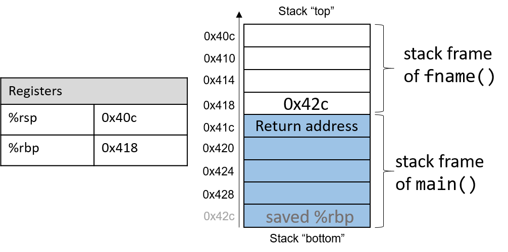{width="700"}
:::

::: title
Figure 1. Stack frame management
:::
:::

::: paragraph
In [Figure 1](#StackFrame), the current active frame belongs to the
callee function (`fname`). The memory between the stack pointer and the
frame pointer is used for local variables. The stack pointer moves as
local values are pushed and popped from the stack. In contrast, the
frame pointer remains relatively constant, pointing to the beginning
(the bottom) of the current stack frame. As a result, compilers like GCC
commonly reference values on the stack relative to the frame pointer. In
[Figure 1](#StackFrame), the active frame is bounded below by the base
pointer of `fname`, which is stack address 0x418. The value stored at
address 0x418 is the \"saved\" `%rbp` value (0x42c), which itself is an
address that indicates the bottom of the activation frame for the `main`
function. The top of the activation frame of `main` is bounded by the
**return address**, which indicates where in the `main` function program
execution resumes once the callee function `fname` finishes executing.
:::

::: {.admonitionblock .warning}
+-----------------------------------+-----------------------------------+
|                                   | ::: title                         |
|                                   | The return address points to code |
|                                   | segment memory, not stack memory  |
|                                   | :::                               |
|                                   |                                   |
|                                   | ::: paragraph                     |
|                                   | Recall that the call stack region |
|                                   | (stack memory) of a program is    |
|                                   | different from its code region    |
|                                   | (code segment memory). While      |
|                                   | `%rbp` and `%rsp` point to        |
|                                   | addresses in the stack memory,    |
|                                   | `%rip` points to an address in    |
|                                   | *code* segment memory. In other   |
|                                   | words, the return address is an   |
|                                   | address in code segment memory,   |
|                                   | not stack memory:                 |
|                                   | :::                               |
|                                   |                                   |
|                                   | ::: {#Program                     |
|                                   | Memory2 .imageblock .text-center} |
|                                   | ::: content                       |
|                                   | {width="450"} |
|                                   | :::                               |
|                                   |                                   |
|                                   | ::: title                         |
|                                   | Figure 2. The parts of a          |
|                                   | program's address space           |
|                                   | :::                               |
|                                   | :::                               |
+-----------------------------------+-----------------------------------+
:::

::: paragraph
[Table 1](#FunctionManagement) contains several additional instructions
that the compiler uses for basic function management.
:::

+-----------------------------------+-----------------------------------+
| Instruction                       | Translation                       |
+===================================+===================================+
| `leaveq`                          | ::: content                       |
|                                   | ::: paragraph                     |
|                                   | Prepares the stack for leaving a  |
|                                   | function. Equivalent to:          |
|                                   | :::                               |
|                                   |                                   |
|                                   | ::: listingblock                  |
|                                   | ::: content                       |
|                                   |     mov %rbp, %rsp                |
|                                   |     pop %rbp                      |
|                                   | :::                               |
|                                   | :::                               |
|                                   | :::                               |
+-----------------------------------+-----------------------------------+
| `callq addr <fname>`              | ::: content                       |
|                                   | ::: paragraph                     |
|                                   | Switches active frame to callee   |
|                                   | function. Equivalent to:          |
|                                   | :::                               |
|                                   |                                   |
|                                   | ::: listingblock                  |
|                                   | ::: content                       |
|                                   |     push %rip                     |
|                                   |     mov addr, %rip                |
|                                   | :::                               |
|                                   | :::                               |
|                                   | :::                               |
+-----------------------------------+-----------------------------------+
| `retq`                            | ::: content                       |
|                                   | ::: paragraph                     |
|                                   | Restores active frame to caller   |
|                                   | function. Equivalent to:          |
|                                   | :::                               |
|                                   |                                   |
|                                   | ::: listingblock                  |
|                                   | ::: content                       |
|                                   |     pop %rip                      |
|                                   | :::                               |
|                                   | :::                               |
|                                   | :::                               |
+-----------------------------------+-----------------------------------+

: Table 1. Common Function Management Instructions

::: paragraph
For example, the `leaveq` instruction is a shorthand that the compiler
uses to restore the stack and frame pointers as it prepares to leave a
function. When the callee function finishes execution, `leaveq` ensures
that the frame pointer is *restored* to its previous value.
:::

::: paragraph
The `callq` and `retq` instructions play a prominent role in the process
where one function calls another. Both instructions modify the
instruction pointer (register `%rip`). When the caller function executes
the `callq` instruction, the current value of `%rip` is saved on the
stack to represent the return address, or the program address at which
the caller resumes executing once the callee function finishes. The
`callq` instruction also replaces the value of `%rip` with the address
of the callee function.
:::

::: paragraph
The `retq` instruction restores the value of `%rip` to the value saved
on the stack, ensuring that the program resumes execution at the program
address specified in the caller function. Any value returned by the
callee is stored in `%rax` or one of its component registers (e.g.,
`%eax`). The `retq` instruction is usually the last instruction that
executes in any function.
:::

::: sect2
### [](#_function_parameters){.anchor}7.5.1. Function Parameters {#_function_parameters}

::: paragraph
Unlike IA32, function parameters are typically preloaded into registers
prior to a function call. [Table 2](#FunctionParameters) lists the
parameters to a function and the register (if any) that they are loaded
into prior to a function call.
:::

+-----------------------------------+-----------------------------------+
| Parameter                         | Location                          |
+===================================+===================================+
| Parameter 1                       | %rdi                              |
+-----------------------------------+-----------------------------------+
| Parameter 2                       | %rsi                              |
+-----------------------------------+-----------------------------------+
| Parameter 3                       | %rdx                              |
+-----------------------------------+-----------------------------------+
| Parameter 4                       | %rcx                              |
+-----------------------------------+-----------------------------------+
| Parameter 5                       | %r8                               |
+-----------------------------------+-----------------------------------+
| Parameter 6                       | %r9                               |
+-----------------------------------+-----------------------------------+
| Parameter 7+                      | on call stack                     |
+-----------------------------------+-----------------------------------+

: Table 2. Locations of Function Parameters.

::: paragraph
The first six parameters to a function are loaded into registers `%rdi`,
`%rsi`, `%rdx`, `%rcx`, `%r8`, and `%r9`, respectively. Any additional
parameters are successively loaded into the call stack based on their
size (4 byte offsets for 32-bit data, 8 byte offsets for 64-bit data).
:::
:::

::: sect2
### [](#_tracing_through_an_example){.anchor}7.5.2. Tracing Through an Example {#_tracing_through_an_example}

::: paragraph
Using our knowledge of function management, let's trace through the code
example first introduced at the beginning of this chapter. Note that the
`void` keyword is added to the parameter list of each function
definition to specify that the functions take no arguments. This change
does not modify the output of the program; however, it does simplify the
corresponding assembly.
:::

::: listingblock
::: content
``` {.highlightjs .highlight}
#include <stdio.h>

int assign(void) {
    int y = 40;
    return y;
}

int adder(void) {
    int a;
    return a + 2;
}

int main(void) {
    int x;
    assign();
    x = adder();
    printf("x is: %d\n", x);
    return 0;
}
```
:::
:::

::: paragraph
We compile this code with the command `gcc -o prog prog.c` and use
`objdump -d` to view the underlying assembly. The latter command outputs
a pretty big file that contains a lot of information that we don't need.
Use `less` and the search functionality to extract the `adder`,
`assign`, and `main` functions:
:::

::: listingblock
::: content
    0000000000400526 <assign>:
      400526:       55                      push   %rbp
      400527:       48 89 e5                mov    %rsp,%rbp
      40052a:       c7 45 fc 28 00 00 00    movl   $0x28,-0x4(%rbp)
      400531:       8b 45 fc                mov    -0x4(%rbp),%eax
      400534:       5d                      pop    %rbp
      400535:       c3                      retq

    0000000000400536 <adder>:
      400536:       55                      push   %rbp
      400537:       48 89 e5                mov    %rsp,%rbp
      40053a:       8b 45 fc                mov    -0x4(%rbp),%eax
      40053d:       83 c0 02                add    $0x2,%eax
      400540:       5d                      pop    %rbp
      400541:       c3                      retq

    0000000000400542 <main>:
      400542:       55                      push   %rbp
      400543:       48 89 e5                mov    %rsp,%rbp
      400546:       48 83 ec 10             sub    $0x10,%rsp
      40054a:       e8 e3 ff ff ff          callq  400526 <assign>
      40054f:       e8 d2 ff ff ff          callq  400536 <adder>
      400554:       89 45 fc                mov    %eax,-0x4(%rbp)
      400557:       8b 45 fc                mov    -0x4(%rbp),%eax
      40055a:       89 c6                   mov    %eax,%esi
      40055c:       bf 04 06 40 00          mov    $0x400604,%edi
      400561:       b8 00 00 00 00          mov    $0x0,%eax
      400566:       e8 95 fe ff ff          callq  400400 <printf@plt>
      40056b:       b8 00 00 00 00          mov    $0x0,%eax
      400570:       c9                      leaveq
      400571:       c3                      retq
:::
:::

::: paragraph
Each function begins with a symbolic label that corresponds to its
declared name in the program. For example, `<main>:` is the symbolic
label for the `main` function. The address of a function label is also
the address of the first instruction in that function. To save space in
the figures below, we truncate addresses to the lower 12 bits. So,
program address 0x400542 is shown as 0x542.
:::
:::

::: sect2
### [](#_tracing_through_main){.anchor}7.5.3. Tracing Through main {#_tracing_through_main}

::: paragraph
[Figure 3](#initialMain) shows the execution stack immediately prior to
the execution of `main`.
:::

::: {#initialMain .imageblock}
::: content
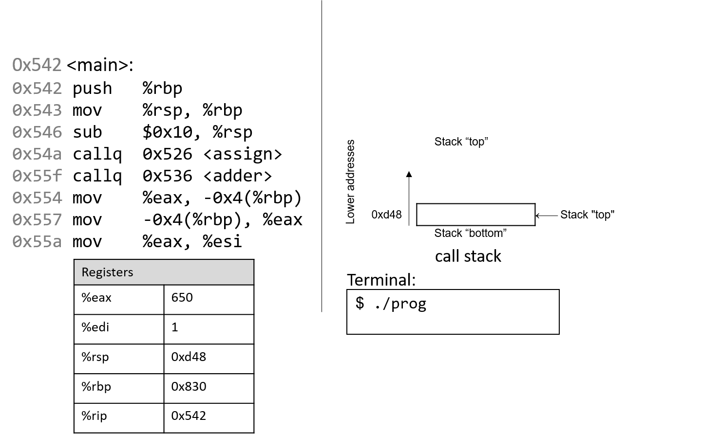
:::

::: title
Figure 3. The initial state of the CPU registers and call stack prior to
executing the main function
:::
:::

::: paragraph
Recall that the stack grows toward lower addresses. In this example,
`%rbp` initially is stack address 0x830, and `%rsp` initially is stack
address 0xd48. Both of these values are made up for this example.
:::

::: paragraph
Since the functions shown in the previous example utilize integer data,
we highlight component registers `%eax` and `%edi`, which initially
contain junk values. The red (upper-left) arrow indicates the currently
executing instruction. Initially, `%rip` contains address 0x542, which
is the program memory address of the first line in the `main` function.
:::

------------------------------------------------------------------------

::: imageblock
::: content

:::
:::

::: paragraph
The first instruction saves the current value of `%rbp` by pushing 0x830
onto the stack. Since the stack grows toward lower addresses, the stack
pointer `%rsp` is updated to 0xd40, which is 8 bytes less than 0xd48.
`%rip` advances to the next instruction in sequence.
:::

------------------------------------------------------------------------

::: imageblock
::: content

:::
:::

::: paragraph
The next instruction (`mov %rsp, %rbp`) updates the value of `%rbp` to
be the same as `%rsp`. The frame pointer (`%rbp`) now points to the
start of the stack frame for the `main` function. `%rip` advances to the
next instruction in sequence.
:::

------------------------------------------------------------------------

::: imageblock
::: content
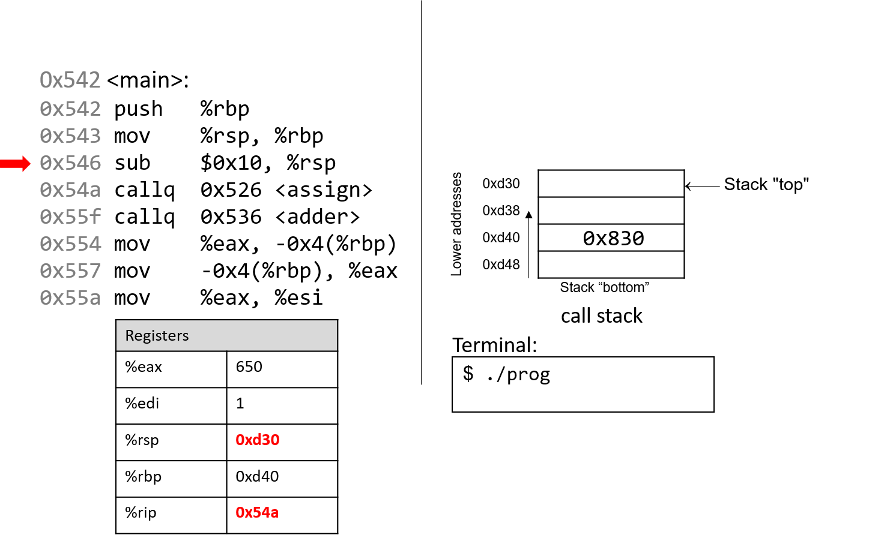
:::
:::

::: paragraph
The `sub` instruction subtracts 0x10 from the address of our stack
pointer, which essentially causes the stack to \"grow\" by 16 bytes,
which we represent by showing two 8-byte locations on the stack.
Register `%rsp` therefore has the new value of 0xd30. `%rip` advances to
the next instruction in sequence.
:::

------------------------------------------------------------------------

::: imageblock
::: content
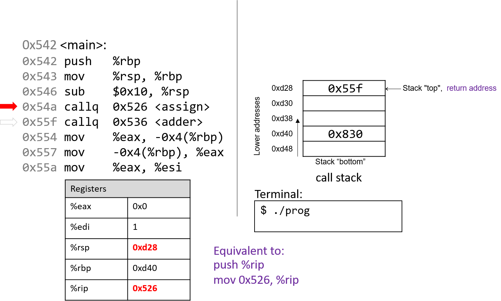
:::
:::

::: paragraph
The `callq <assign>` instruction pushes the value inside register `%rip`
(which denotes the address of the *next* instruction to execute) onto
the stack. Since the next instruction after `callq <assign>` has an
address of 0x55f, that value is pushed onto the stack as the return
address. Recall that the return address indicates the program address
where execution should resume when program execution returns to `main`.
:::

::: paragraph
Next, the `callq` instruction moves the address of the `assign` function
(0x526) into register `%rip`, signifying that program execution should
continue into the callee function `assign` and not the next instruction
in `main`.
:::

------------------------------------------------------------------------

::: imageblock
::: content
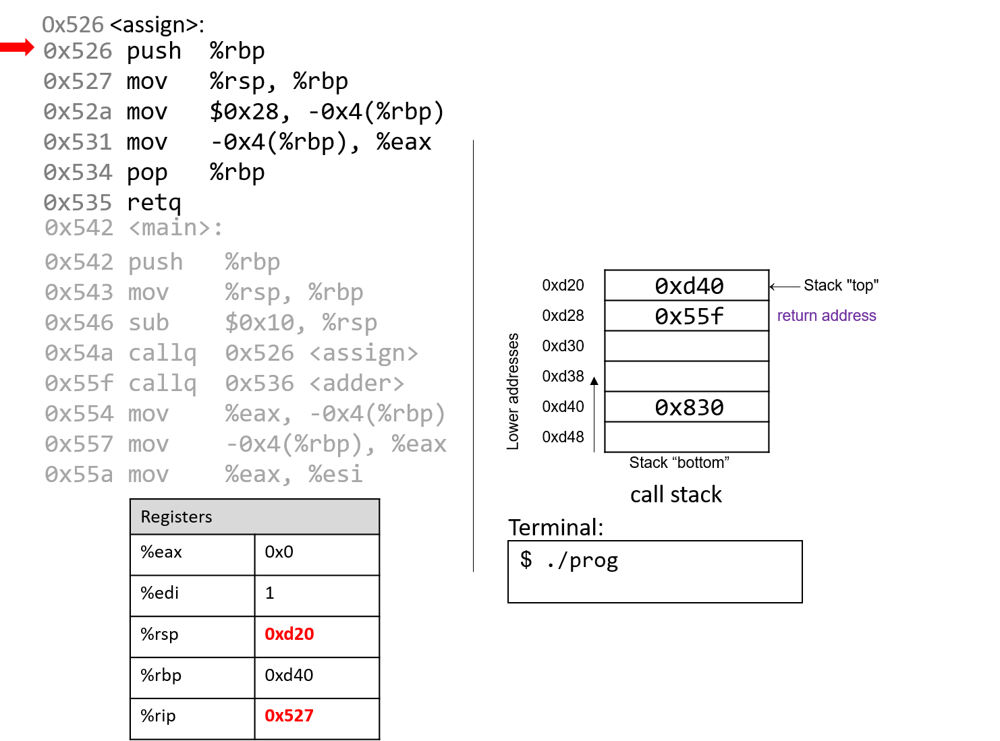
:::
:::

::: paragraph
The first two instructions that execute in the `assign` function are the
usual book-keeping that every function performs. The first instruction
pushes the value stored in `%rbp` (memory address 0xd40) onto the stack.
Recall that this address points to the beginning of the stack frame for
`main`. `%rip` advances to the second instruction in `assign`.
:::

------------------------------------------------------------------------

::: imageblock
::: content

:::
:::

::: paragraph
The next instruction (`mov %rsp, %rbp`) updates `%rbp` to point to the
top of the stack, marking the beginning of the stack frame for `assign`.
The instruction pointer (`%rip`) advances to the next instruction in the
`assign` function.
:::

------------------------------------------------------------------------

::: imageblock
::: content

:::
:::

::: paragraph
The `mov` instruction at address 0x52a moves the value `$0x28` (or 40)
onto the stack at address `-0x4(%rbp)`, which is four bytes above the
frame pointer. Recall that the frame pointer is commonly used to
reference locations on the stack. However, keep in mind that this
operation does not change the value of `%rsp` --- the stack pointer
still points to address 0xd20. Register `%rip` advances to the next
instruction in the `assign` function.
:::

------------------------------------------------------------------------

::: imageblock
::: content
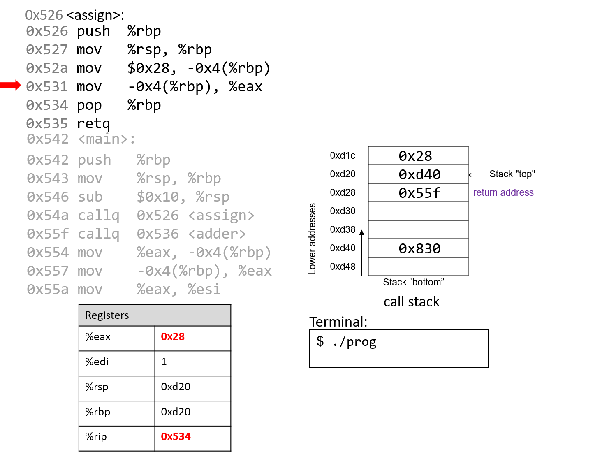
:::
:::

::: paragraph
The `mov` instruction at address 0x531 places the value `$0x28` into
register `%eax`, which holds the return value of the function. `%rip`
advances to the `pop` instruction in the `assign` function.
:::

------------------------------------------------------------------------

::: imageblock
::: content

:::
:::

::: paragraph
At this point, the `assign` function has almost completed execution. The
next instruction that executes is `pop %rbp`, which restores `%rbp` to
its previous value, or 0xd40. Since the `pop` instruction modifies the
stack pointer, `%rsp` updates to 0xd28.
:::

------------------------------------------------------------------------

::: imageblock
::: content
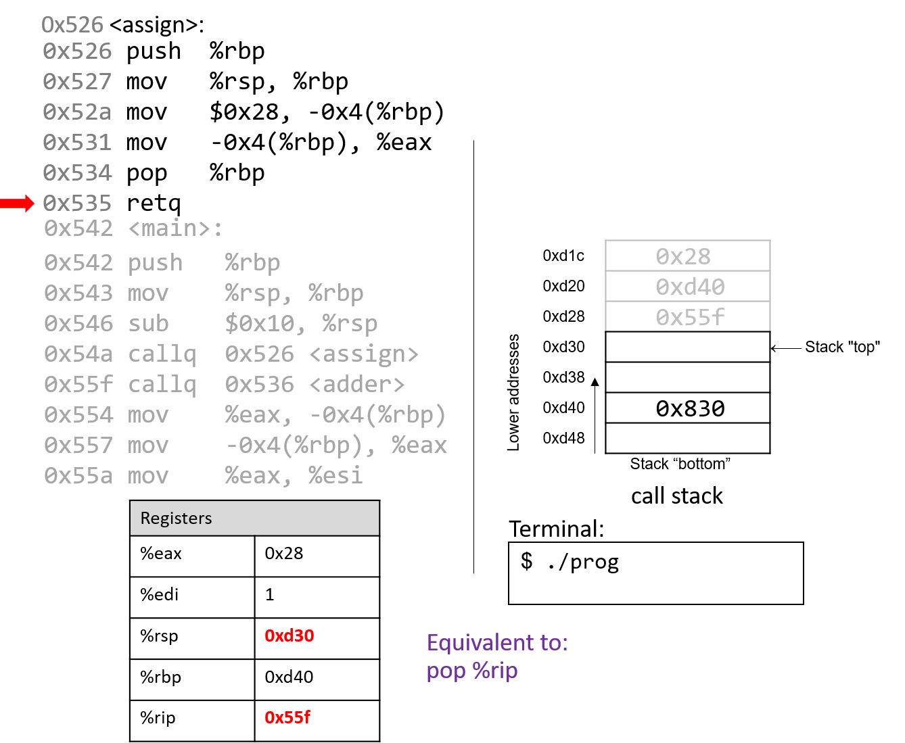
:::
:::

::: paragraph
The last instruction in `assign` is a `retq` instruction. When `retq`
executes, the return address is popped off the stack into register
`%rip`. In our example, `%rip` now advances to point to the `callq`
instruction in `main` at address 0x55f.
:::

::: paragraph
Some important things to notice at this juncture:
:::

::: ulist
-   The stack pointer and the frame pointer have been restored to their
    values prior to the call to `assign`, reflecting that the stack
    frame for `main` is once again the active frame.

-   The old values on the stack from the prior active stack frame are
    *not* removed. They still exist on the call stack.
:::

------------------------------------------------------------------------

::: imageblock
::: content
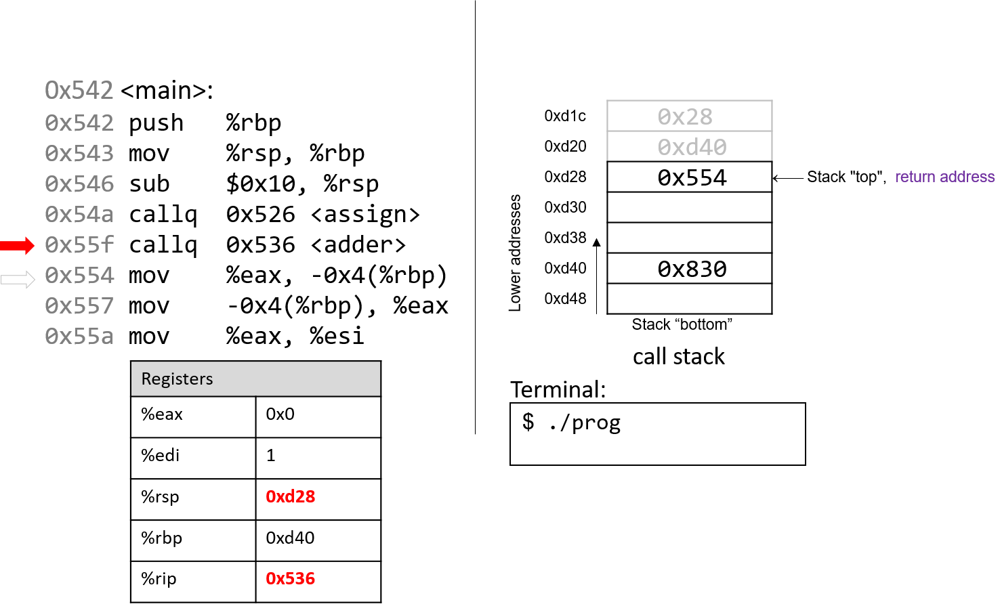
:::
:::

::: paragraph
Back in `main`, the call to `adder` *overwrites* the old return address
on the stack with a new return address (0x554). This return address
points to the next instruction to be executed after `adder` returns, or
`mov %eax, -0x4(%rbp)`. Register `%rip` updates to point to the first
instruction to execute in `adder`, which is at address 0x536.
:::

------------------------------------------------------------------------

::: imageblock
::: content
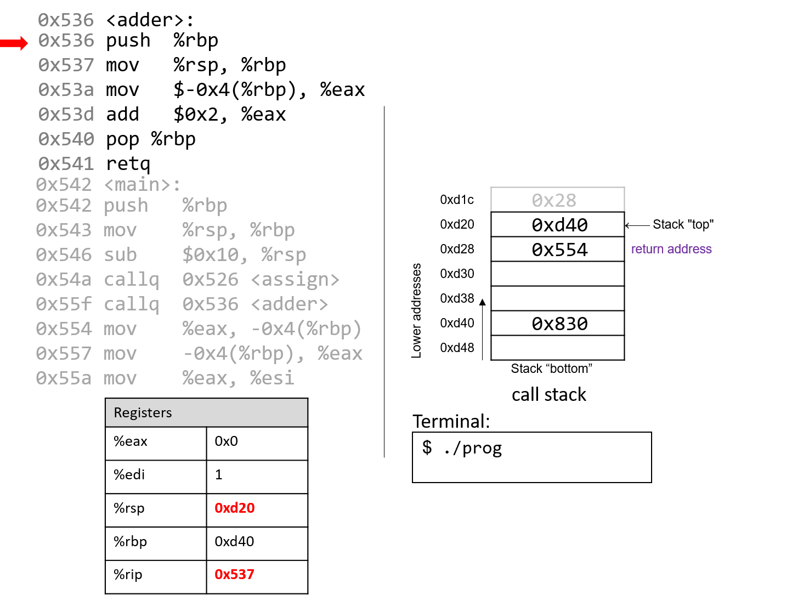
:::
:::

::: paragraph
The first instruction in the `adder` function saves the caller's frame
pointer (`%rbp` of `main`) on the stack.
:::

------------------------------------------------------------------------

::: imageblock
::: content

:::
:::

::: paragraph
The next instruction updates `%rbp` with the current value of `%rsp`, or
address 0xd20. Together, these last two instructions establish the
beginning of the stack frame for `adder`.
:::

------------------------------------------------------------------------

::: imageblock
::: content
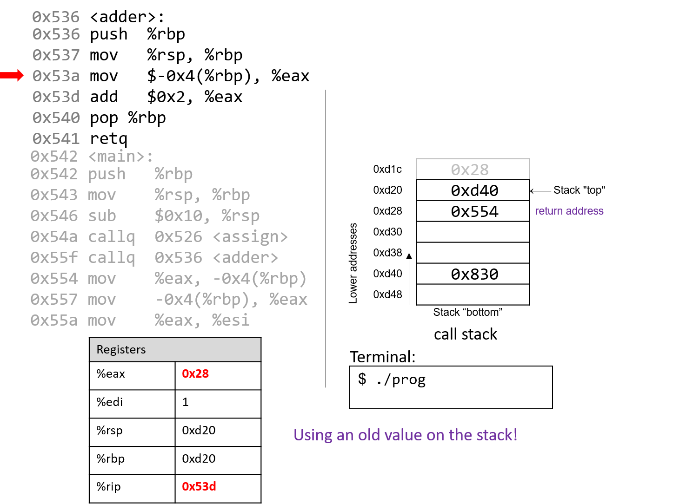
:::
:::

::: paragraph
Pay close attention to the next instruction that executes. Recall that
`$0x28` was placed on the stack during the call to `assign`. The
`mov $-0x4(%rbp), %eax` instruction moves an *old* value that is on the
stack into register `%eax`! This would not have occurred if the
programmer had initialized variable `a` in the `adder` function.
:::

------------------------------------------------------------------------

::: imageblock
::: content
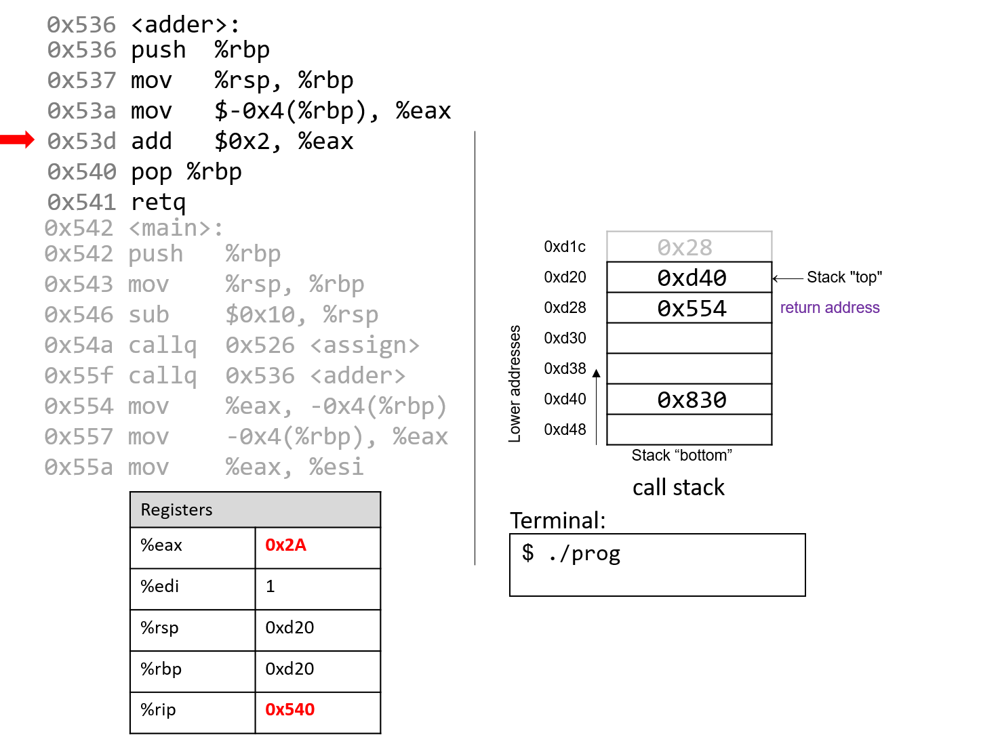
:::
:::

::: paragraph
The `add` instruction at address 0x53d adds 2 to register `%eax`. Recall
that when a 32-bit integer is being returned, x86-64 utilizes component
register `%eax` instead of `%rax`. Together the last two instructions
are equivalent to the following code in `adder`:
:::

::: listingblock
::: content
``` {.highlightjs .highlight}
int a;
return a + 2;
```
:::
:::

------------------------------------------------------------------------

::: imageblock
::: content

:::
:::

::: paragraph
After `pop` executes, the frame pointer again points to the beginning of
the stack frame for `main`, or address 0xd40. The stack pointer now
contains the address 0xd28.
:::

------------------------------------------------------------------------

::: imageblock
::: content

:::
:::

::: paragraph
The execution of `retq` pops the return address off the stack, restoring
the instruction pointer back to 0x554, or the address of the next
instruction to execute in `main`. The address contained in `%rsp` is now
0xd30.
:::

------------------------------------------------------------------------

::: imageblock
::: content

:::
:::

::: paragraph
Back in `main`, the `mov %eax, -0x4(%rbp)` instruction places the value
in `%eax` at a location four bytes above `%rbp`, or at address 0xd3c.
The next instruction replaces it back into register `%eax`.
:::

------------------------------------------------------------------------

::: imageblock
::: content
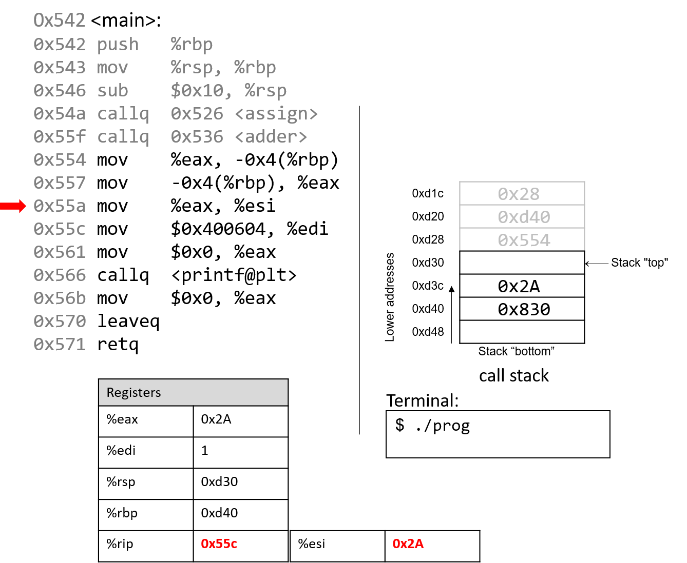
:::
:::

::: paragraph
Skipping ahead a little, the `mov` instruction at address 0x55a copies
the value in `%eax` (or 0x2A) to register `%esi`, which is the 32-bit
component register associated with `%rsi` and typically stores the
second parameter to a function.
:::

------------------------------------------------------------------------

::: imageblock
::: content
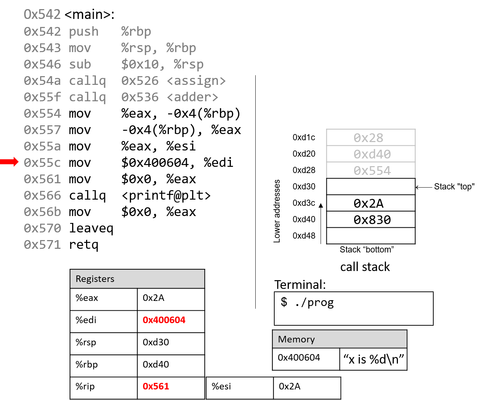
:::
:::

::: paragraph
The next instruction (`mov $0x400604, %edi`) copies a constant value (an
address in code segment memory) to register `%edi`. Recall that register
`%edi` is the 32-bit component register of `%rdi`, which typically
stores the first parameter to a function. The code segment memory
address 0x400604 is the base address of the string `"x is %d\n"`.
:::

------------------------------------------------------------------------

::: imageblock
::: content
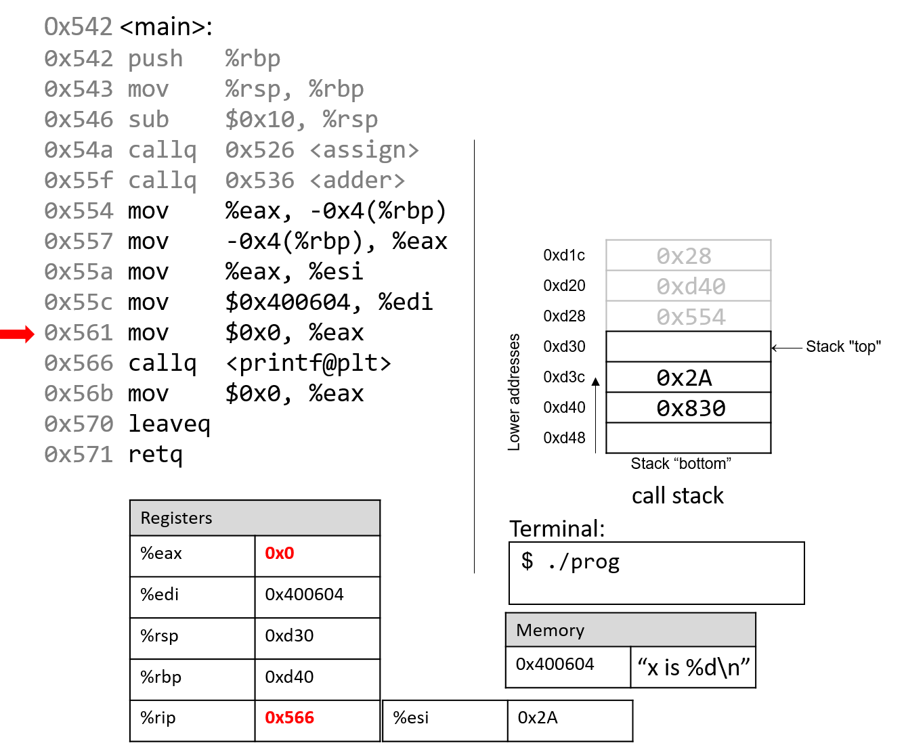
:::
:::

::: paragraph
The next instruction resets register `%eax` with the value 0. The
instruction pointer advances to the call to the `printf` function (which
is denoted with the label `<printf@plt>`).
:::

------------------------------------------------------------------------

::: imageblock
::: content
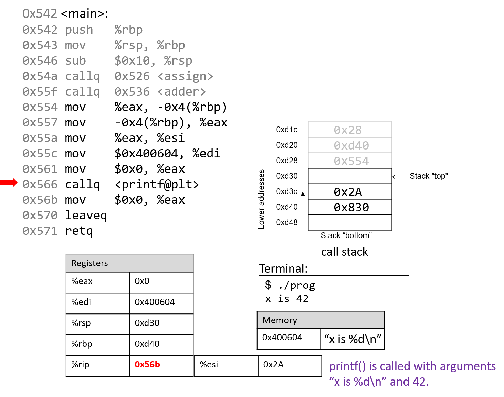
:::
:::

::: paragraph
The next instruction calls the `printf` function. For the sake of
brevity, we will not trace the `printf` function, which is part of
`stdio.h`. However, we know from the manual page (`man -s3 printf`) that
`printf` has the following format:
:::

::: listingblock
::: content
    int printf(const char * format, ...)
:::
:::

::: paragraph
In other words, the first argument is a pointer to a string specifying
the format, and the second argument onward specify the values that are
used in that format. The instructions specified by addresses 0x55a -
0x566 correspond to the following line in the `main` function:
:::

::: listingblock
::: content
``` {.highlightjs .highlight}
printf("x is %d\n", x);
```
:::
:::

::: paragraph
When the `printf` function is called:
:::

::: ulist
-   A return address specifying the instruction that executes after the
    call to `printf` is pushed onto the stack.

-   The value of `%rbp` is pushed onto the stack, and `%rbp` is updated
    to point to the top of the stack, indicating the beginning of the
    stack frame for `printf`.
:::

::: paragraph
At some point, `printf` references its arguments, which are the string
`"x is %d\n"` and the value 0x2A. The first parameter is stored in
component register `%edi`, and the second parameter is stored in
component register `%esi`. The return address is located directly below
`%rbp` at location `%rbp+8`.
:::

::: paragraph
For any function with *n* arguments, GCC places the first six arguments
in registers, as shown in [Table 2](#FunctionParameters), and the
remaining arguments onto the stack *below* the return address.
:::

::: paragraph
After the call to `printf`, the value 0x2A is output to the user in
integer format. Thus, the value 42 is printed to the screen!
:::

------------------------------------------------------------------------

::: imageblock
::: content
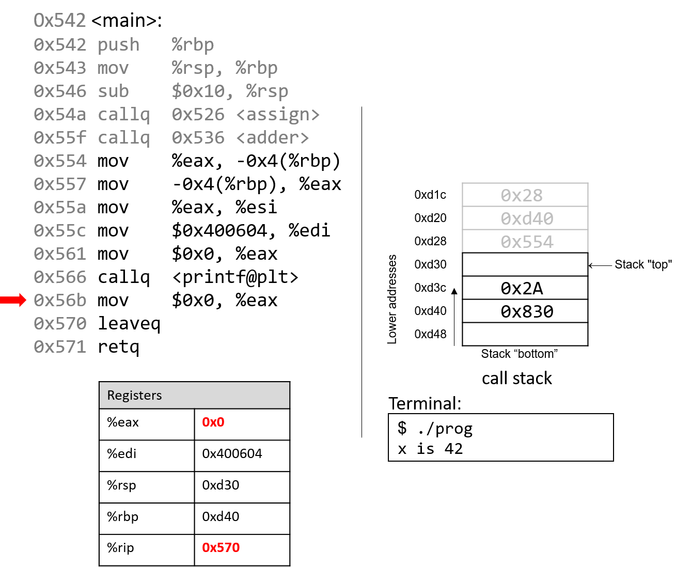
:::
:::

::: paragraph
After the call to `printf`, the last few instructions clean up the stack
and prepare a clean exit from the `main` function. First, the `mov`
instruction at address 0x56b ensures that 0 is in the return register
(since the last thing `main` does is return 0).
:::

------------------------------------------------------------------------

::: imageblock
::: content

:::
:::

::: paragraph
The `leaveq` instruction prepares the stack for returning from the
function call. Recall that `leaveq` is analogous to the following pair
of instructions:
:::

::: listingblock
::: content
    mov %rbp, %rsp
    pop %rbp
:::
:::

::: paragraph
In other words, the CPU overwrites the stack pointer with the frame
pointer. In our example, the stack pointer is initially updated from
0xd30 to 0xd40. Next, the CPU executes `pop %rbp`, which takes the value
located at 0xd40 (in our example, the address 0x830) and places it in
`%rbp`. After `leaveq` executes, the stack and frame pointers revert to
their original values prior to the execution of `main`.
:::

::: paragraph
The last instruction that executes is `retq`. With 0x0 in the return
register `%eax`, the program returns zero, indicating correct
termination.
:::

::: paragraph
If you have carefully read through this section, you should understand
why our program prints out the value 42. In essence, the program
inadvertently uses old values on the stack to cause it to behave in a
way that we didn't expect. This example was pretty harmless; however, we
discuss in future sections how hackers have misused function calls to
make programs misbehave in truly malicious ways.
:::
:::
:::
:::

::: toc-menu
:::
:::
:::
:::

Copyright (C) 2020 Dive into Systems, LLC.

*Dive into Systems,* is licensed under the Creative Commons
[Attribution-NonCommercial-NoDerivatives 4.0
International](https://creativecommons.org/licenses/by-nc-nd/4.0/) (CC
BY-NC-ND 4.0).
