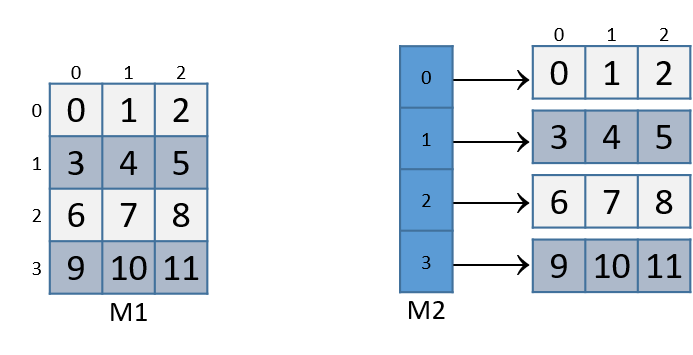
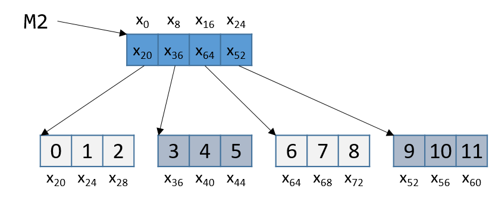

-   -   [4. Binary and Data
        Representation](../C4-Binary/index.html){.nav-link}
        -   [4.1. Number Bases and Unsigned
            Integers](../C4-Binary/bases.html){.nav-link}
        -   [4.2. Converting Between
            Bases](../C4-Binary/conversion.html){.nav-link}
        -   [4.3. Signed Binary
            Integers](../C4-Binary/signed.html){.nav-link}
        -   [4.4. Binary Integer
            Arithmetic](../C4-Binary/arithmetic.html){.nav-link}
            -   [4.4.1.
                Addition](../C4-Binary/arithmetic_addition.html){.nav-link}
            -   [4.4.2.
                Subtraction](../C4-Binary/arithmetic_subtraction.html){.nav-link}
            -   [4.4.3. Multiplication &
                Division](../C4-Binary/arithmetic_mult_div.html){.nav-link}
        -   [4.5. Overflow](../C4-Binary/overflow.html){.nav-link}
        -   [4.6. Bitwise
            Operators](../C4-Binary/bitwise.html){.nav-link}
        -   [4.7. Integer Byte
            Order](../C4-Binary/byte_order.html){.nav-link}
        -   [4.8. Real Numbers in
            Binary](../C4-Binary/floating_point.html){.nav-link}
        -   [4.9. Summary](../C4-Binary/summary.html){.nav-link}
        -   [4.10. Exercises](../C4-Binary/exercises.html){.nav-link}

-   -   [5. What von Neumann Knew: Computer
        Architecture](../C5-Arch/index.html){.nav-link}
        -   [5.1. The Origins of Modern
            Computing](../C5-Arch/hist.html){.nav-link}
        -   [5.2. The von Neumann
            Architecture](../C5-Arch/von.html){.nav-link}
        -   [5.3. Logic Gates](../C5-Arch/gates.html){.nav-link}
        -   [5.4. Circuits](../C5-Arch/circuits.html){.nav-link}
            -   [5.4.1. Arithmetic and Logic
                Circuits](../C5-Arch/arithlogiccircs.html){.nav-link}
            -   [5.4.2. Control
                Circuits](../C5-Arch/controlcircs.html){.nav-link}
            -   [5.4.3. Storage
                Circuits](../C5-Arch/storagecircs.html){.nav-link}
        -   [5.5. Building a Processor](../C5-Arch/cpu.html){.nav-link}
        -   [5.6. The Processor's Execution of Program
            Instructions](../C5-Arch/instrexec.html){.nav-link}
        -   [5.7. Pipelining Instruction
            Execution](../C5-Arch/pipelining.html){.nav-link}
        -   [5.8. Advanced Pipelining
            Considerations](../C5-Arch/pipelining_advanced.html){.nav-link}
        -   [5.9. Looking Ahead: CPUs
            Today](../C5-Arch/modern.html){.nav-link}
        -   [5.10. Summary](../C5-Arch/summary.html){.nav-link}
        -   [5.11. Exercises](../C5-Arch/exercises.html){.nav-link}

-   -   [6. Under the C: Dive into
        Assembly](../C6-asm_intro/index.html){.nav-link}

-   -   [7. 64-bit x86 Assembly](index.html){.nav-link}
        -   [7.1. Assembly Basics](basics.html){.nav-link}
        -   [7.2. Common Instructions](common.html){.nav-link}
        -   [7.3. Additional Arithmetic
            Instructions](arithmetic.html){.nav-link}
        -   [7.4. Conditional Control and
            Loops](conditional_control_loops.html){.nav-link}
            -   [7.4.1. Preliminaries](preliminaries.html){.nav-link}
            -   [7.4.2. If Statements](if_statements.html){.nav-link}
            -   [7.4.3. Loops](loops.html){.nav-link}
        -   [7.5. Functions in Assembly](functions.html){.nav-link}
        -   [7.6. Recursion](recursion.html){.nav-link}
        -   [7.7. Arrays in Assembly](arrays.html){.nav-link}
        -   [7.8. Matrices in Assembly](matrices.html){.nav-link}
        -   [7.9. Structs in Assembly](structs.html){.nav-link}
        -   [7.10. Buffer Overflows](buffer_overflow.html){.nav-link}
        -   [7.11. Exercises](exercises.html){.nav-link}

-   -   [8. 32-bit x86 Assembly](../C8-IA32/index.html){.nav-link}
        -   [8.1. Assembly Basics](../C8-IA32/basics.html){.nav-link}
        -   [8.2. Common
            Instructions](../C8-IA32/common.html){.nav-link}
        -   [8.3. Additional Arithmetic
            Instructions](../C8-IA32/arithmetic.html){.nav-link}
        -   [8.4. Conditional Control and
            Loops](../C8-IA32/conditional_control_loops.html){.nav-link}
            -   [8.4.1.
                Preliminaries](../C8-IA32/preliminaries.html){.nav-link}
            -   [8.4.2. If
                Statements](../C8-IA32/if_statements.html){.nav-link}
            -   [8.4.3. Loops](../C8-IA32/loops.html){.nav-link}
        -   [8.5. Functions in
            Assembly](../C8-IA32/functions.html){.nav-link}
        -   [8.6. Recursion](../C8-IA32/recursion.html){.nav-link}
        -   [8.7. Arrays in Assembly](../C8-IA32/arrays.html){.nav-link}
        -   [8.8. Matrices in
            Assembly](../C8-IA32/matrices.html){.nav-link}
        -   [8.9. Structs in
            Assembly](../C8-IA32/structs.html){.nav-link}
        -   [8.10. Buffer
            Overflows](../C8-IA32/buffer_overflow.html){.nav-link}
        -   [8.11. Exercises](../C8-IA32/exercises.html){.nav-link}

-   -   [9. ARMv8 Assembly](../C9-ARM64/index.html){.nav-link}
        -   [9.1. Assembly Basics](../C9-ARM64/basics.html){.nav-link}
        -   [9.2. Common
            Instructions](../C9-ARM64/common.html){.nav-link}
        -   [9.3. Arithmetic
            Instructions](../C9-ARM64/arithmetic.html){.nav-link}
        -   [9.4. Conditional Control and
            Loops](../C9-ARM64/conditional_control_loops.html){.nav-link}
            -   [9.4.1.
                Preliminaries](../C9-ARM64/preliminaries.html){.nav-link}
            -   [9.4.2. If
                Statements](../C9-ARM64/if_statements.html){.nav-link}
            -   [9.4.3. Loops](../C9-ARM64/loops.html){.nav-link}
        -   [9.5. Functions in
            Assembly](../C9-ARM64/functions.html){.nav-link}
        -   [9.6. Recursion](../C9-ARM64/recursion.html){.nav-link}
        -   [9.7. Arrays in
            Assembly](../C9-ARM64/arrays.html){.nav-link}
        -   [9.8. Matrices in
            Assembly](../C9-ARM64/matrices.html){.nav-link}
        -   [9.9. Structs in
            Assembly](../C9-ARM64/structs.html){.nav-link}
        -   [9.10. Buffer
            Overflows](../C9-ARM64/buffer_overflow.html){.nav-link}
        -   [9.11. Exercises](../C9-ARM64/exercises.html){.nav-link}

-   -   [10. Key Assembly
        Takeaways](../C10-asm_takeaways/index.html){.nav-link}

-   -   [11. Storage and the Memory
        Hierarchy](../C11-MemHierarchy/index.html){.nav-link}
        -   [11.1. The Memory
            Hierarchy](../C11-MemHierarchy/mem_hierarchy.html){.nav-link}
        -   [11.2. Storage
            Devices](../C11-MemHierarchy/devices.html){.nav-link}
        -   [11.3.
            Locality](../C11-MemHierarchy/locality.html){.nav-link}
        -   [11.4. Caching](../C11-MemHierarchy/caching.html){.nav-link}
        -   [11.5. Cache Analysis and
            Cachegrind](../C11-MemHierarchy/cachegrind.html){.nav-link}
        -   [11.6. Looking Ahead: Caching on Multicore
            Processors](../C11-MemHierarchy/coherency.html){.nav-link}
        -   [11.7. Summary](../C11-MemHierarchy/summary.html){.nav-link}
        -   [11.8.
            Exercises](../C11-MemHierarchy/exercises.html){.nav-link}

-   -   [12. Code Optimization](../C12-CodeOpt/index.html){.nav-link}
        -   [12.1. First Steps](../C12-CodeOpt/basic.html){.nav-link}
        -   [12.2. Other Compiler
            Optimizations](../C12-CodeOpt/loops_functions.html){.nav-link}
        -   [12.3. Memory
            Considerations](../C12-CodeOpt/memory_considerations.html){.nav-link}
        -   [12.4. Summary](../C12-CodeOpt/summary.html){.nav-link}

-   -   [13. The Operating System](../C13-OS/index.html){.nav-link}
        -   [13.1. Booting and Running](../C13-OS/impl.html){.nav-link}
        -   [13.2. Processes](../C13-OS/processes.html){.nav-link}
        -   [13.3. Virtual Memory](../C13-OS/vm.html){.nav-link}
        -   [13.4. Interprocess
            Communication](../C13-OS/ipc.html){.nav-link}
            -   [13.4.1. Signals](../C13-OS/ipc_signals.html){.nav-link}
            -   [13.4.2. Message
                Passing](../C13-OS/ipc_msging.html){.nav-link}
            -   [13.4.3. Shared
                Memory](../C13-OS/ipc_shm.html){.nav-link}
        -   [13.5. Summary and Other OS
            Functionality](../C13-OS/advanced.html){.nav-link}
        -   [13.6. Exercises](../C13-OS/exercises.html){.nav-link}

-   -   [14. Leveraging Shared Memory in the Multicore
        Era](../C14-SharedMemory/index.html){.nav-link}
        -   [14.1. Programming Multicore
            Systems](../C14-SharedMemory/multicore.html){.nav-link}
        -   [14.2. POSIX
            Threads](../C14-SharedMemory/posix.html){.nav-link}
        -   [14.3. Synchronizing
            Threads](../C14-SharedMemory/synchronization.html){.nav-link}
            -   [14.3.1. Mutual
                Exclusion](../C14-SharedMemory/mutex.html){.nav-link}
            -   [14.3.2.
                Semaphores](../C14-SharedMemory/semaphores.html){.nav-link}
            -   [14.3.3. Other Synchronization
                Constructs](../C14-SharedMemory/other_syncs.html){.nav-link}
        -   [14.4. Measuring Parallel
            Performance](../C14-SharedMemory/performance.html){.nav-link}
            -   [14.4.1. Parallel Performance
                Basics](../C14-SharedMemory/performance_basics.html){.nav-link}
            -   [14.4.2. Advanced
                Topics](../C14-SharedMemory/performance_advanced.html){.nav-link}
        -   [14.5. Cache
            Coherence](../C14-SharedMemory/cache_coherence.html){.nav-link}
        -   [14.6. Thread
            Safety](../C14-SharedMemory/thread_safety.html){.nav-link}
        -   [14.7. Implicit Threading with
            OpenMP](../C14-SharedMemory/openmp.html){.nav-link}
        -   [14.8. Summary](../C14-SharedMemory/summary.html){.nav-link}
        -   [14.9.
            Exercises](../C14-SharedMemory/exercises.html){.nav-link}

-   -   [15. Looking Ahead: Other Parallel
        Systems](../C15-Parallel/index.html){.nav-link}
        -   [15.1. Hardware Acceleration and
            CUDA](../C15-Parallel/gpu.html){.nav-link}
        -   [15.2. Distributed Memory
            Systems](../C15-Parallel/distrmem.html){.nav-link}
        -   [15.3. To Exascale and
            Beyond](../C15-Parallel/cloud.html){.nav-link}

-   -   [16. Appendix 1: Chapter 1 for Java
        Programmers](../Appendix1/index.html){.nav-link}
        -   [16.1. Getting Started Programming in
            C](../Appendix1/getting_started.html){.nav-link}
        -   [16.2. Input/Output (printf and
            scanf)](../Appendix1/input_output.html){.nav-link}
        -   [16.3. Conditionals and
            Loops](../Appendix1/conditionals.html){.nav-link}
        -   [16.4. Functions](../Appendix1/functions.html){.nav-link}
        -   [16.5. Arrays and
            Strings](../Appendix1/arrays_strings.html){.nav-link}
        -   [16.6. Structs](../Appendix1/structs.html){.nav-link}
        -   [16.7. Summary](../Appendix1/summary.html){.nav-link}
        -   [16.8. Exercises](../Appendix1/exercises.html){.nav-link}

-   -   [17. Appendix 2: Using Unix](../Appendix2/index.html){.nav-link}
        -   [17.1. Unix Command Line and the Unix File
            System](../Appendix2/cmdln_basics.html){.nav-link}
        -   [17.2. Man and the Unix
            Manual](../Appendix2/man.html){.nav-link}
        -   [17.3. Remote Access](../Appendix2/ssh_scp.html){.nav-link}
        -   [17.4. Unix Editors](../Appendix2/editors.html){.nav-link}
        -   [17.5. make and
            Makefiles](../Appendix2/makefiles.html){.nav-link}
        -   [17.6 Searching: grep and
            find](../Appendix2/grep.html){.nav-link}
        -   [17.7 File Permissions](../Appendix2/chmod.html){.nav-link}
        -   [17.8 Archiving and Compressing
            Files](../Appendix2/tar.html){.nav-link}
        -   [17.9 Process Control](../Appendix2/pskill.html){.nav-link}
        -   [17.10 Timing](../Appendix2/timing.html){.nav-link}
        -   [17.11 Command
            History](../Appendix2/history.html){.nav-link}
        -   [17.12 I/0
            Redirection](../Appendix2/ioredirect.html){.nav-link}
        -   [17.13 Pipes](../Appendix2/pipe.html){.nav-link}
        -   [17.14 Dot Files and
            .bashrc](../Appendix2/dotfiles.html){.nav-link}
        -   [17.15 Shell
            Programming](../Appendix2/shellprog.html){.nav-link}
        -   [17.16 Getting System
            Information](../Appendix2/sysinfo.html){.nav-link}


-   [Dive Into Systems](../index-2.html)
-   [7. 64-bit x86 Assembly](index.html)
-   [7.8. Matrices in Assembly](matrices.html)
:::

::: content
::: sect1
## [](#_matrices){.anchor}7.8. Matrices {#_matrices}

::: sectionbody
::: paragraph
A matrix is a two-dimensional array. A matrix in C can be statically
allocated as a two-dimensional array (`M[n][m]`), dynamically allocated
with a single call to `malloc`, or dynamically allocated as an array of
arrays. Let's consider the array of arrays implementation. The first
array contains `n` elements (`M[n]`), and each element `M[i]` in our
matrix contains an array of `m` elements. The following code snippets
each declare matrices of size 4 × 3:
:::

::: listingblock
::: content
``` {.highlightjs .highlight}
//statically allocated matrix (allocated on stack)
int M1[4][3];

//dynamically allocated matrix (programmer friendly, allocated on heap)
int **M2, i;
M2 = malloc(4 * sizeof(int*));
for (i = 0; i < 4; i++) {
    M2[i] = malloc(3 * sizeof(int));
}
```
:::
:::

::: paragraph
In the case of the dynamically allocated matrix, the main array contains
a contiguous array of `int` pointers. Each integer pointer points to a
different array in memory. [Figure 1](#Matrices6) illustrates how we
would normally visualize each of these matrices.
:::

::: {#Matrices6 .imageblock .text-center}
::: content
{width="550"}
:::

::: title
Figure 1. Illustration of a statically allocated (M1) and a dynamically
allocated (M2) 3x4 matrix
:::
:::

::: paragraph
For both of these matrix declarations, element (*i*,*j*) can be accessed
using the double-indexing syntax `M[i][j]`, where `M` is either `M1` or
`M2`. However, these matrices are organized differently in memory. Even
though both store the elements in their primary array contiguously in
memory, our statically allocated matrix also stores all the rows
contiguously in memory, as shown in [Figure 2](#Matrices7).
:::

::: {#Matrices7 .imageblock .text-center}
::: content
{width="600"}
:::

::: title
Figure 2. Matrix M1's memory layout in row-major order
:::
:::

::: paragraph
This contiguous ordering is not guaranteed for `M2`. [Recall
that](../C2-C_depth/arrays.html#_two_dimensional_array_memory_layout){.page}
to contiguously allocate an *n* × *m* matrix on the heap, we should use
a single call to `malloc` that allocates *n* × *m* elements:
:::

::: listingblock
::: content
``` {.highlightjs .highlight}
//dynamic matrix (allocated on heap, memory efficient way)
#define ROWS 4
#define COLS 3
int *M3;
M3 = malloc(ROWS * COLS * sizeof(int));
```
:::
:::

::: paragraph
Recall that with the declaration of `M3`, element (*i*,*j*) *cannot* be
accessed using the `M[i][j]` notation. Instead, we must index the
element using the format `M3[i*COLS + j]`.
:::

::: sect2
### [](#_contiguous_two_dimensional_arrays){.anchor}7.8.1. Contiguous Two-Dimensional Arrays {#_contiguous_two_dimensional_arrays}

::: paragraph
Consider a function `sumMat` that takes a pointer to a contiguously
allocated (either statically allocated or memory-efficiently dynamically
allocated) matrix as its first parameter, along with the numbers of rows
and columns, and returns the sum of all the elements inside the matrix.
:::

::: paragraph
We use scaled indexing in the code snippet that follows because it
applies to both statically and dynamically allocated contiguous
matrices. Recall that the syntax `m[i][j]` does not work with the
memory-efficient contiguous dynamic allocation previously discussed.
:::

::: listingblock
::: content
``` {.highlightjs .highlight}
int sumMat(int *m, int rows, int cols) {
    int i, j, total = 0;
    for (i = 0; i < rows; i++){
        for (j = 0; j < cols; j++){
            total += m[i*cols + j];
        }
    }
    return total;
}
```
:::
:::

::: paragraph
Here is the corresponding assembly. Each line is annotated with its
English translation:
:::

::: listingblock
::: content
    Dump of assembler code for function sumMat:
    0x400686 <+0>:   push %rbp                 # save rbp
    0x400687 <+1>:   mov  %rsp,%rbp            # update rbp (new stack frame)
    0x40068a <+4>:   mov  %rdi,-0x18(%rbp)     # copy m to %rbp-0x18
    0x40068e <+8>:   mov  %esi,-0x1c(%rbp)     # copy rows to %rbp-0x1c
    0x400691 <+11>:  mov  %edx,-0x20(%rbp)     # copy cols parameter to %rbp-0x20
    0x400694 <+14>:  movl $0x0,-0x4(%rbp)      # copy 0 to %rbp-0x4 (total)
    0x40069b <+21>:  movl $0x0,-0xc(%rbp)      # copy 0 to %rbp-0xc (i)
    0x4006a2 <+28>:  jmp  0x4006e1 <sumMat+91> # goto <sumMat+91>
    0x4006a4 <+30>:  movl $0x0,-0x8(%rbp)      # copy 0 to %rbp-0x8 (j)
    0x4006ab <+37>:  jmp  0x4006d5 <sumMat+79> # goto <sumMat+79>
    0x4006ad <+39>:  mov  -0xc(%rbp),%eax      # copy i to %eax
    0x4006b0 <+42>:  imul -0x20(%rbp),%eax     # mult i with cols, place in %eax
    0x4006b4 <+46>:  mov  %eax,%edx            # copy i*cols to %edx
    0x4006b6 <+48>:  mov  -0x8(%rbp),%eax      # copy j to %eax
    0x4006b9 <+51>:  add  %edx,%eax            # add i*cols with j, place in %eax
    0x4006bb <+53>:  cltq                      # convert %eax to a 64-bit int
    0x4006bd <+55>:  lea  0x0(,%rax,4),%rdx    # mult (i*cols+j) by 4,put in %rdx
    0x4006c5 <+63>:  mov  -0x18(%rbp),%rax     # copy m to %rax
    0x4006c9 <+67>:  add  %rdx,%rax            # add m to (i*cols+j)*4,put in %rax
    0x4006cc <+70>:  mov  (%rax),%eax          # copy m[i*cols+j] to %eax
    0x4006ce <+72>:  add  %eax,-0x4(%rbp)      # add m[i*cols+j] to total
    0x4006d1 <+75>:  addl $0x1,-0x8(%rbp)      # add 1 to j (j++)
    0x4006d5 <+79>:  mov  -0x8(%rbp),%eax      # copy j to %eax
    0x4006d8 <+82>:  cmp  -0x20(%rbp),%eax     # compare j with cols
    0x4006db <+85>:  jl   0x4006ad <sumMat+39> # if (j < cols) goto <sumMat+39>
    0x4006dd <+87>:  addl $0x1,-0xc(%rbp)      # add 1 to i
    0x4006e1 <+91>:  mov  -0xc(%rbp),%eax      # copy i to %eax
    0x4006e4 <+94>:  cmp  -0x1c(%rbp),%eax     # compare i with rows
    0x4006e7 <+97>:  jl   0x4006a4 <sumMat+30> # if (i < rows) goto <sumMat+30>
    0x4006e9 <+99>:  mov  -0x4(%rbp),%eax      # copy total to %eax
    0x4006ec <+102>: pop  %rbp                 # clean up stack
    0x4006ed <+103>: retq                      # return total
:::
:::

::: paragraph
The local variables `i`, `j`, and `total` are loaded at addresses
`%rbp-0xc`, `%rbp-0x8`, and `%rbp-0x4` on the stack, respectively. The
input parameters `m`, `row`, and `cols` are stored at locations
`%rbp-0x8`, `%rbp-0x1c`, and `%rbp-0x20`, respectively. Using this
knowledge, let's zoom in on the component that just deals with the
access of element (*i*,*j*) in our matrix:
:::

::: listingblock
::: content
    0x4006ad <+39>: mov  -0xc(%rbp),%eax    # copy i to %eax
    0x4006b0 <+42>: imul -0x20(%rbp),%eax   # multiply i with cols, place in %eax
    0x4006b4 <+46>: mov  %eax,%edx          # copy i*cols to %edx
:::
:::

::: paragraph
The first set of instructions calculates the value `i*cols` and places
it in register `%edx`. Recall that for a matrix named `matrix`,
`matrix + (i * cols)` is equivalent to `&matrix[i]`.
:::

------------------------------------------------------------------------

::: listingblock
::: content
    0x4006b6 <+48>: mov  -0x8(%rbp),%eax    # copy j to %eax
    0x4006b9 <+51>: add  %edx,%eax          # add i*cols with j, place in %eax
    0x4006bb <+53>: cltq                    # convert %eax to a 64-bit int
    0x4006bd <+55>: lea  0x0(,%rax,4),%rdx  # multiply (i*cols+j) by 4,put in %rdx
:::
:::

::: paragraph
The next set of instructions computes `(i*cols+j)*4`. The compiler
multiplies the index `i*cols+j` by four since each element in the matrix
is a four-byte integer, and this multiplication enables the compiler to
compute the correct offset. The `cltq` instruction on line `<sumMat+53>`
is needed to sign-extend the contents of `%eax` into a 64-bit integer,
since that is about to be used for address calculation.
:::

------------------------------------------------------------------------

::: paragraph
Next, the following set of instructions adds the calculated offset to
the matrix pointer and dereferences it to yield the value of element
(*i*,*j*):
:::

::: listingblock
::: content
    0x4006c5 <+63>: mov -0x18(%rbp),%rax   # copy m to %rax
    0x4006c9 <+67>: add %rdx,%rax          # add m to (i*cols+j)*4, place in %rax
    0x4006cc <+70>: mov (%rax),%eax        # copy m[i*cols+j] to %eax
    0x4006ce <+72>: add %eax,-0x4(%rbp)    # add m[i*cols+j] to total
:::
:::

::: paragraph
The first instruction loads the address of matrix `m` into register
`%rax`. The `add` instruction adds `(i*cols + j)*4` to the address of
`m` to correctly calculate the offset of element (*i*,*j*). The third
instruction dereferences the address in `%rax` and places the value in
`%eax`. Notice the use of `%eax` as the destination component register;
since our matrix contains integers, and an integer takes up four bytes
of space, component register `%eax` is again used instead of `%rax`.
:::

::: paragraph
The last instruction adds the value in `%eax` to the accumulator
`total`, which is located at stack address `%rbp-0x4`.
:::

::: paragraph
Let's consider how element (1,2) is accessed in [Figure 2](#Matrices7).
For convenience, the figure is reproduced below:
:::

::: {.imageblock .text-center}
::: content
{width="600"}
:::

::: title
Figure 3. Matrix M1's memory layout in row-major order
:::
:::

::: paragraph
Element (1,2) is located at address `M1 + 1*COLS + 2`. Since `COLS` = 3,
element (1,2) corresponds to `M1+5`. To access the element at this
location, the compiler must multiply 5 by the size of the `int` data
type (four bytes), yielding the offset `M1+20`, which corresponds to
byte x~20~ in the figure. Dereferencing this location yields element 5,
which is indeed element (1,2) in the matrix.
:::
:::

::: sect2
### [](#_noncontiguous_matrix){.anchor}7.8.2. Noncontiguous Matrix {#_noncontiguous_matrix}

::: paragraph
The noncontiguous matrix implementation is a bit more complicated.
[Figure 4](#DynamicMatrix6) visualizes how `M2` may be laid out in
memory.
:::

::: {#DynamicMatrix6 .imageblock .text-center}
::: content
{width="650"}
:::

::: title
Figure 4. Matrix M2's noncontiguous layout in memory
:::
:::

::: paragraph
Notice that the array of pointers is contiguous, and that each array
pointed to by an element of `M2` (e.g., `M2[i]`) is contiguous. However,
the individual arrays are not contiguous with one another. Since `M2` is
an array of pointers, each element of `M2` takes eight bytes of space.
In contrast, as `M2[i]` is an `int` array, each element of `M2[i]` is
four bytes away.
:::

::: paragraph
The `sumMatrix` function in the following example takes an array of
integer pointers (called `matrix`) as its first parameter, and a number
of rows and columns as its second and third parameters:
:::

::: listingblock
::: content
``` {.highlightjs .highlight}
int sumMatrix(int **matrix, int rows, int cols) {
    int i, j, total=0;

    for (i = 0; i < rows; i++) {
        for (j = 0; j < cols; j++) {
            total += matrix[i][j];
        }
    }
    return total;
}
```
:::
:::

::: paragraph
Even though this function looks nearly identical to the `sumMat`
function shown earlier, the matrix accepted by this function consists of
a contiguous array of *pointers*. Each pointer contains the address of a
separate contiguous array, which corresponds to a separate row in the
matrix.
:::

::: paragraph
The corresponding assembly for `sumMatrix` follows. Each line is
annotated with its English translation.
:::

::: listingblock
::: content
    Dump of assembler code for function sumMatrix:
    0x4006ee <+0>:   push   %rbp                    # save rbp
    0x4006ef <+1>:   mov    %rsp,%rbp               # update rbp (new stack frame)
    0x4006f2 <+4>:   mov    %rdi,-0x18(%rbp)        # copy matrix to %rbp-0x18
    0x4006f6 <+8>:   mov    %esi,-0x1c(%rbp)        # copy rows to %rbp-0x1c
    0x4006f9 <+11>:  mov    %edx,-0x20(%rbp)        # copy cols to %rbp-0x20
    0x4006fc <+14>:  movl   $0x0,-0x4(%rbp)         # copy 0 to %rbp-0x4 (total)
    0x400703 <+21>:  movl   $0x0,-0xc(%rbp)         # copy 0 to %rbp-0xc (i)
    0x40070a <+28>:  jmp    0x40074e <sumMatrix+96> # goto <sumMatrix+96>
    0x40070c <+30>:  movl   $0x0,-0x8(%rbp)         # copy 0 to %rbp-0x8 (j)
    0x400713 <+37>:  jmp    0x400742 <sumMatrix+84> # goto <sumMatrix+84>
    0x400715 <+39>:  mov    -0xc(%rbp),%eax         # copy i to %eax
    0x400718 <+42>:  cltq                           # convert i to 64-bit integer
    0x40071a <+44>:  lea    0x0(,%rax,8),%rdx       # mult i by 8, place in %rdx
    0x400722 <+52>:  mov    -0x18(%rbp),%rax        # copy matrix to %rax
    0x400726 <+56>:  add    %rdx,%rax               # put i*8 + matrix in %rax
    0x400729 <+59>:  mov    (%rax),%rax             # copy matrix[i] to %rax (ptr)
    0x40072c <+62>:  mov    -0x8(%rbp),%edx         # copy j to %edx
    0x40072f <+65>:  movslq %edx,%rdx               # convert j to 64-bit integer
    0x400732 <+68>:  shl    $0x2,%rdx               # mult j by 4, place in %rdx
    0x400736 <+72>:  add    %rdx,%rax               # put j*4 + matrix[i] in %rax
    0x400739 <+75>:  mov    (%rax),%eax             # copy matrix[i][j] to %eax
    0x40073b <+77>:  add    %eax,-0x4(%rbp)         # add matrix[i][j] to total
    0x40073e <+80>:  addl   $0x1,-0x8(%rbp)         # add 1 to j (j++)
    0x400742 <+84>:  mov    -0x8(%rbp),%eax         # copy j to %eax
    0x400745 <+87>:  cmp    -0x20(%rbp),%eax        # compare j with cols
    0x400748 <+90>:  jl     0x400715 <sumMatrix+39> # if j<cols goto<sumMatrix+39>
    0x40074a <+92>:  addl   $0x1,-0xc(%rbp)         # add 1 to i (i++)
    0x40074e <+96>:  mov    -0xc(%rbp),%eax         # copy i to %eax
    0x400751 <+99>:  cmp    -0x1c(%rbp),%eax        # compare i with rows
    0x400754 <+102>: jl     0x40070c <sumMatrix+30> # if i<rows goto<sumMatrix+30>
    0x400756 <+104>: mov    -0x4(%rbp),%eax         # copy total to %eax
    0x400759 <+107>: pop    %rbp                    # restore %rbp
    0x40075a <+108>: retq                           # return total
:::
:::

::: paragraph
Once again, the variables `i`, `j`, and `total` are at stack addresses
`%rbp-0xc`, `%rbp-0x8`, and `%rbp-0x4`, respectively. The input
parameters `matrix`, `row`, and `cols` are located at stack addresses
`%rbp-0x18`, `%rbp-0x1c`, and `%rbp-0x20`, respectively. Let's zoom in
on the section that deals specifically with an access to element
(*i*,*j*), or `matrix[i][j]`:
:::

::: listingblock
::: content
    0x400715 <+39>: mov  -0xc(%rbp),%eax       # copy i to %eax
    0x400718 <+42>: cltq                       # convert i to 64-bit integer
    0x40071a <+44>: lea  0x0(,%rax,8),%rdx     # multiply i by 8, place in %rdx
    0x400722 <+52>: mov  -0x18(%rbp),%rax      # copy matrix to %rax
    0x400726 <+56>: add  %rdx,%rax             # add i*8 to matrix, place in %rax
    0x400729 <+59>: mov  (%rax),%rax           # copy matrix[i] to %rax (pointer)
:::
:::

::: paragraph
The five instructions in this example compute `matrix[i]`, or
`*(matrix+i)`. Since `matrix[i]` contains a pointer, `i` is first
converted to a 64-bit integer. Then, the compiler multiplies `i` by
eight prior to adding it to `matrix` to calculate the correct address
offset (recall that pointers are eight bytes in size). The instruction
at `<sumMatrix+59>` then dereferences the calculated address to get the
element `matrix[i]`.
:::

::: paragraph
Since `matrix` is an array of `int` pointers, the element located at
`matrix[i]` is itself an `int` pointer. The *j*^th^ element in
`matrix[i]` is located at offset `j × 4` in the `matrix[i]` array.
:::

::: paragraph
The next set of instructions extract the *j*^th^ element in array
`matrix[i]`:
:::

::: listingblock
::: content
    0x40072c <+62>: mov    -0x8(%rbp),%edx    # copy j to %edx
    0x40072f <+65>: movslq %edx,%rdx          # convert j to a 64-bit integer
    0x400732 <+68>: shl    $0x2,%rdx          # multiply j by 4, place in %rdx
    0x400736 <+72>: add    %rdx,%rax          # add j*4 to matrix[i], put in %rax
    0x400739 <+75>: mov    (%rax),%eax        # copy matrix[i][j] to %eax
    0x40073b <+77>: add    %eax,-0x4(%rbp)    # add matrix[i][j] to total
:::
:::

::: paragraph
The first instruction in this snippet loads variable `j` into register
`%edx`. The `movslq` instruction at `<sumMatrix+65>` converts `%edx`
into a 64-bit integer, storing the result in 64-bit register `%rdx`. The
compiler then uses the left shift (`shl`) instruction to multiply `j` by
four and stores the result in register `%rdx`. The compiler finally adds
the resulting value to the address located in `matrix[i]` to get the
address of element `matrix[i][j]`. The instructions at `<sumMatrix+75>`
and `<sumMatrix+77>` obtain the value at `matrix[i][j]` and add the
value to `total`.
:::

::: paragraph
Let's revisit [Figure 4](#DynamicMatrix6) and consider an example access
to M2\[1\]\[2\]. For convenience, we reproduce the figure below:
:::

::: {.imageblock .text-center}
::: content
{width="650"}
:::

::: title
Figure 5. Matrix M2's noncontiguous layout in memory
:::
:::

::: paragraph
Note that `M2` starts at memory location x~0~. The compiler first
computes the address of `M2[1]` by multiplying 1 by 8 (`sizeof(int *)`)
and adding it to the address of `M2` (x~0~), yielding the new address
x~8~. A dereference of this address yields the address associated with
`M2[1]`, or x~36~. The compiler then multiplies index 2 by 4
(`sizeof(int)`), and adds the result (8) to x~36~, yielding a final
address of x~44~. The address x~44~ is dereferenced, yielding the value
5. Sure enough, the element in [Figure 4](#DynamicMatrix6) that
corresponds to `M2[1][2]` has the value 5.
:::
:::
:::
:::

::: toc-menu
:::
:::
:::
:::

Copyright (C) 2020 Dive into Systems, LLC.

*Dive into Systems,* is licensed under the Creative Commons
[Attribution-NonCommercial-NoDerivatives 4.0
International](https://creativecommons.org/licenses/by-nc-nd/4.0/) (CC
BY-NC-ND 4.0).
