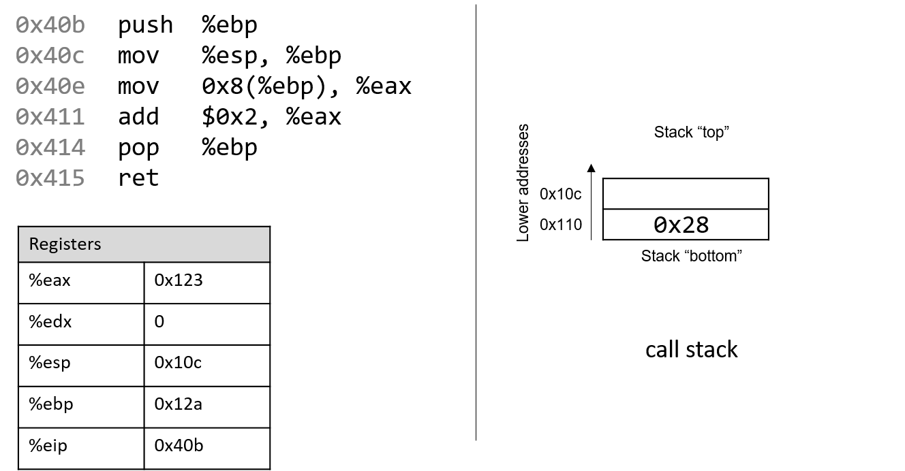
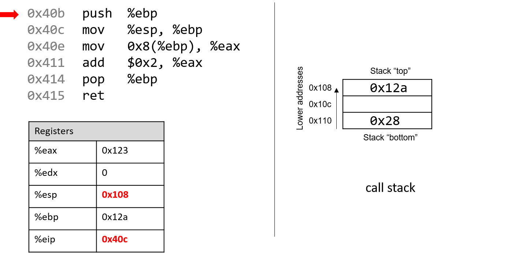
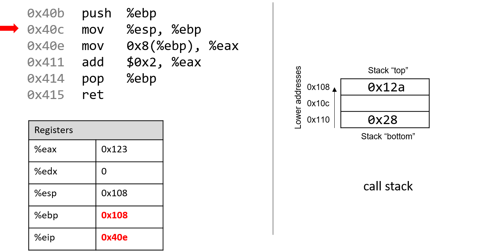
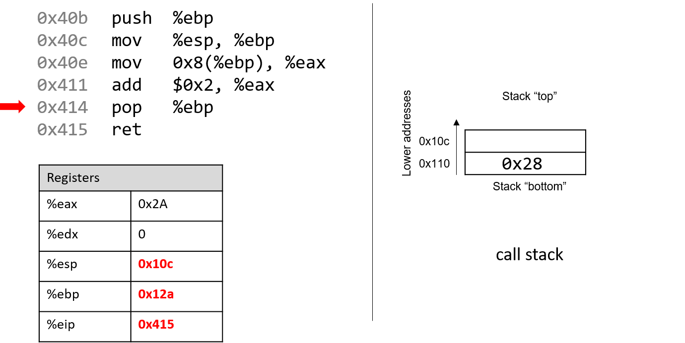

-   -   [4. Binary and Data
        Representation](../C4-Binary/index.html){.nav-link}
        -   [4.1. Number Bases and Unsigned
            Integers](../C4-Binary/bases.html){.nav-link}
        -   [4.2. Converting Between
            Bases](../C4-Binary/conversion.html){.nav-link}
        -   [4.3. Signed Binary
            Integers](../C4-Binary/signed.html){.nav-link}
        -   [4.4. Binary Integer
            Arithmetic](../C4-Binary/arithmetic.html){.nav-link}
            -   [4.4.1.
                Addition](../C4-Binary/arithmetic_addition.html){.nav-link}
            -   [4.4.2.
                Subtraction](../C4-Binary/arithmetic_subtraction.html){.nav-link}
            -   [4.4.3. Multiplication &
                Division](../C4-Binary/arithmetic_mult_div.html){.nav-link}
        -   [4.5. Overflow](../C4-Binary/overflow.html){.nav-link}
        -   [4.6. Bitwise
            Operators](../C4-Binary/bitwise.html){.nav-link}
        -   [4.7. Integer Byte
            Order](../C4-Binary/byte_order.html){.nav-link}
        -   [4.8. Real Numbers in
            Binary](../C4-Binary/floating_point.html){.nav-link}
        -   [4.9. Summary](../C4-Binary/summary.html){.nav-link}
        -   [4.10. Exercises](../C4-Binary/exercises.html){.nav-link}

-   -   [5. What von Neumann Knew: Computer
        Architecture](../C5-Arch/index.html){.nav-link}
        -   [5.1. The Origins of Modern
            Computing](../C5-Arch/hist.html){.nav-link}
        -   [5.2. The von Neumann
            Architecture](../C5-Arch/von.html){.nav-link}
        -   [5.3. Logic Gates](../C5-Arch/gates.html){.nav-link}
        -   [5.4. Circuits](../C5-Arch/circuits.html){.nav-link}
            -   [5.4.1. Arithmetic and Logic
                Circuits](../C5-Arch/arithlogiccircs.html){.nav-link}
            -   [5.4.2. Control
                Circuits](../C5-Arch/controlcircs.html){.nav-link}
            -   [5.4.3. Storage
                Circuits](../C5-Arch/storagecircs.html){.nav-link}
        -   [5.5. Building a Processor](../C5-Arch/cpu.html){.nav-link}
        -   [5.6. The Processor's Execution of Program
            Instructions](../C5-Arch/instrexec.html){.nav-link}
        -   [5.7. Pipelining Instruction
            Execution](../C5-Arch/pipelining.html){.nav-link}
        -   [5.8. Advanced Pipelining
            Considerations](../C5-Arch/pipelining_advanced.html){.nav-link}
        -   [5.9. Looking Ahead: CPUs
            Today](../C5-Arch/modern.html){.nav-link}
        -   [5.10. Summary](../C5-Arch/summary.html){.nav-link}
        -   [5.11. Exercises](../C5-Arch/exercises.html){.nav-link}

-   -   [6. Under the C: Dive into
        Assembly](../C6-asm_intro/index.html){.nav-link}

-   -   [7. 64-bit x86 Assembly](../C7-x86_64/index.html){.nav-link}
        -   [7.1. Assembly Basics](../C7-x86_64/basics.html){.nav-link}
        -   [7.2. Common
            Instructions](../C7-x86_64/common.html){.nav-link}
        -   [7.3. Additional Arithmetic
            Instructions](../C7-x86_64/arithmetic.html){.nav-link}
        -   [7.4. Conditional Control and
            Loops](../C7-x86_64/conditional_control_loops.html){.nav-link}
            -   [7.4.1.
                Preliminaries](../C7-x86_64/preliminaries.html){.nav-link}
            -   [7.4.2. If
                Statements](../C7-x86_64/if_statements.html){.nav-link}
            -   [7.4.3. Loops](../C7-x86_64/loops.html){.nav-link}
        -   [7.5. Functions in
            Assembly](../C7-x86_64/functions.html){.nav-link}
        -   [7.6. Recursion](../C7-x86_64/recursion.html){.nav-link}
        -   [7.7. Arrays in
            Assembly](../C7-x86_64/arrays.html){.nav-link}
        -   [7.8. Matrices in
            Assembly](../C7-x86_64/matrices.html){.nav-link}
        -   [7.9. Structs in
            Assembly](../C7-x86_64/structs.html){.nav-link}
        -   [7.10. Buffer
            Overflows](../C7-x86_64/buffer_overflow.html){.nav-link}
        -   [7.11. Exercises](../C7-x86_64/exercises.html){.nav-link}

-   -   [8. 32-bit x86 Assembly](index.html){.nav-link}
        -   [8.1. Assembly Basics](basics.html){.nav-link}
        -   [8.2. Common Instructions](common.html){.nav-link}
        -   [8.3. Additional Arithmetic
            Instructions](arithmetic.html){.nav-link}
        -   [8.4. Conditional Control and
            Loops](conditional_control_loops.html){.nav-link}
            -   [8.4.1. Preliminaries](preliminaries.html){.nav-link}
            -   [8.4.2. If Statements](if_statements.html){.nav-link}
            -   [8.4.3. Loops](loops.html){.nav-link}
        -   [8.5. Functions in Assembly](functions.html){.nav-link}
        -   [8.6. Recursion](recursion.html){.nav-link}
        -   [8.7. Arrays in Assembly](arrays.html){.nav-link}
        -   [8.8. Matrices in Assembly](matrices.html){.nav-link}
        -   [8.9. Structs in Assembly](structs.html){.nav-link}
        -   [8.10. Buffer Overflows](buffer_overflow.html){.nav-link}
        -   [8.11. Exercises](exercises.html){.nav-link}

-   -   [9. ARMv8 Assembly](../C9-ARM64/index.html){.nav-link}
        -   [9.1. Assembly Basics](../C9-ARM64/basics.html){.nav-link}
        -   [9.2. Common
            Instructions](../C9-ARM64/common.html){.nav-link}
        -   [9.3. Arithmetic
            Instructions](../C9-ARM64/arithmetic.html){.nav-link}
        -   [9.4. Conditional Control and
            Loops](../C9-ARM64/conditional_control_loops.html){.nav-link}
            -   [9.4.1.
                Preliminaries](../C9-ARM64/preliminaries.html){.nav-link}
            -   [9.4.2. If
                Statements](../C9-ARM64/if_statements.html){.nav-link}
            -   [9.4.3. Loops](../C9-ARM64/loops.html){.nav-link}
        -   [9.5. Functions in
            Assembly](../C9-ARM64/functions.html){.nav-link}
        -   [9.6. Recursion](../C9-ARM64/recursion.html){.nav-link}
        -   [9.7. Arrays in
            Assembly](../C9-ARM64/arrays.html){.nav-link}
        -   [9.8. Matrices in
            Assembly](../C9-ARM64/matrices.html){.nav-link}
        -   [9.9. Structs in
            Assembly](../C9-ARM64/structs.html){.nav-link}
        -   [9.10. Buffer
            Overflows](../C9-ARM64/buffer_overflow.html){.nav-link}
        -   [9.11. Exercises](../C9-ARM64/exercises.html){.nav-link}

-   -   [10. Key Assembly
        Takeaways](../C10-asm_takeaways/index.html){.nav-link}

-   -   [11. Storage and the Memory
        Hierarchy](../C11-MemHierarchy/index.html){.nav-link}
        -   [11.1. The Memory
            Hierarchy](../C11-MemHierarchy/mem_hierarchy.html){.nav-link}
        -   [11.2. Storage
            Devices](../C11-MemHierarchy/devices.html){.nav-link}
        -   [11.3.
            Locality](../C11-MemHierarchy/locality.html){.nav-link}
        -   [11.4. Caching](../C11-MemHierarchy/caching.html){.nav-link}
        -   [11.5. Cache Analysis and
            Cachegrind](../C11-MemHierarchy/cachegrind.html){.nav-link}
        -   [11.6. Looking Ahead: Caching on Multicore
            Processors](../C11-MemHierarchy/coherency.html){.nav-link}
        -   [11.7. Summary](../C11-MemHierarchy/summary.html){.nav-link}
        -   [11.8.
            Exercises](../C11-MemHierarchy/exercises.html){.nav-link}

-   -   [12. Code Optimization](../C12-CodeOpt/index.html){.nav-link}
        -   [12.1. First Steps](../C12-CodeOpt/basic.html){.nav-link}
        -   [12.2. Other Compiler
            Optimizations](../C12-CodeOpt/loops_functions.html){.nav-link}
        -   [12.3. Memory
            Considerations](../C12-CodeOpt/memory_considerations.html){.nav-link}
        -   [12.4. Summary](../C12-CodeOpt/summary.html){.nav-link}

-   -   [13. The Operating System](../C13-OS/index.html){.nav-link}
        -   [13.1. Booting and Running](../C13-OS/impl.html){.nav-link}
        -   [13.2. Processes](../C13-OS/processes.html){.nav-link}
        -   [13.3. Virtual Memory](../C13-OS/vm.html){.nav-link}
        -   [13.4. Interprocess
            Communication](../C13-OS/ipc.html){.nav-link}
            -   [13.4.1. Signals](../C13-OS/ipc_signals.html){.nav-link}
            -   [13.4.2. Message
                Passing](../C13-OS/ipc_msging.html){.nav-link}
            -   [13.4.3. Shared
                Memory](../C13-OS/ipc_shm.html){.nav-link}
        -   [13.5. Summary and Other OS
            Functionality](../C13-OS/advanced.html){.nav-link}
        -   [13.6. Exercises](../C13-OS/exercises.html){.nav-link}

-   -   [14. Leveraging Shared Memory in the Multicore
        Era](../C14-SharedMemory/index.html){.nav-link}
        -   [14.1. Programming Multicore
            Systems](../C14-SharedMemory/multicore.html){.nav-link}
        -   [14.2. POSIX
            Threads](../C14-SharedMemory/posix.html){.nav-link}
        -   [14.3. Synchronizing
            Threads](../C14-SharedMemory/synchronization.html){.nav-link}
            -   [14.3.1. Mutual
                Exclusion](../C14-SharedMemory/mutex.html){.nav-link}
            -   [14.3.2.
                Semaphores](../C14-SharedMemory/semaphores.html){.nav-link}
            -   [14.3.3. Other Synchronization
                Constructs](../C14-SharedMemory/other_syncs.html){.nav-link}
        -   [14.4. Measuring Parallel
            Performance](../C14-SharedMemory/performance.html){.nav-link}
            -   [14.4.1. Parallel Performance
                Basics](../C14-SharedMemory/performance_basics.html){.nav-link}
            -   [14.4.2. Advanced
                Topics](../C14-SharedMemory/performance_advanced.html){.nav-link}
        -   [14.5. Cache
            Coherence](../C14-SharedMemory/cache_coherence.html){.nav-link}
        -   [14.6. Thread
            Safety](../C14-SharedMemory/thread_safety.html){.nav-link}
        -   [14.7. Implicit Threading with
            OpenMP](../C14-SharedMemory/openmp.html){.nav-link}
        -   [14.8. Summary](../C14-SharedMemory/summary.html){.nav-link}
        -   [14.9.
            Exercises](../C14-SharedMemory/exercises.html){.nav-link}

-   -   [15. Looking Ahead: Other Parallel
        Systems](../C15-Parallel/index.html){.nav-link}
        -   [15.1. Hardware Acceleration and
            CUDA](../C15-Parallel/gpu.html){.nav-link}
        -   [15.2. Distributed Memory
            Systems](../C15-Parallel/distrmem.html){.nav-link}
        -   [15.3. To Exascale and
            Beyond](../C15-Parallel/cloud.html){.nav-link}

-   -   [16. Appendix 1: Chapter 1 for Java
        Programmers](../Appendix1/index.html){.nav-link}
        -   [16.1. Getting Started Programming in
            C](../Appendix1/getting_started.html){.nav-link}
        -   [16.2. Input/Output (printf and
            scanf)](../Appendix1/input_output.html){.nav-link}
        -   [16.3. Conditionals and
            Loops](../Appendix1/conditionals.html){.nav-link}
        -   [16.4. Functions](../Appendix1/functions.html){.nav-link}
        -   [16.5. Arrays and
            Strings](../Appendix1/arrays_strings.html){.nav-link}
        -   [16.6. Structs](../Appendix1/structs.html){.nav-link}
        -   [16.7. Summary](../Appendix1/summary.html){.nav-link}
        -   [16.8. Exercises](../Appendix1/exercises.html){.nav-link}

-   -   [17. Appendix 2: Using Unix](../Appendix2/index.html){.nav-link}
        -   [17.1. Unix Command Line and the Unix File
            System](../Appendix2/cmdln_basics.html){.nav-link}
        -   [17.2. Man and the Unix
            Manual](../Appendix2/man.html){.nav-link}
        -   [17.3. Remote Access](../Appendix2/ssh_scp.html){.nav-link}
        -   [17.4. Unix Editors](../Appendix2/editors.html){.nav-link}
        -   [17.5. make and
            Makefiles](../Appendix2/makefiles.html){.nav-link}
        -   [17.6 Searching: grep and
            find](../Appendix2/grep.html){.nav-link}
        -   [17.7 File Permissions](../Appendix2/chmod.html){.nav-link}
        -   [17.8 Archiving and Compressing
            Files](../Appendix2/tar.html){.nav-link}
        -   [17.9 Process Control](../Appendix2/pskill.html){.nav-link}
        -   [17.10 Timing](../Appendix2/timing.html){.nav-link}
        -   [17.11 Command
            History](../Appendix2/history.html){.nav-link}
        -   [17.12 I/0
            Redirection](../Appendix2/ioredirect.html){.nav-link}
        -   [17.13 Pipes](../Appendix2/pipe.html){.nav-link}
        -   [17.14 Dot Files and
            .bashrc](../Appendix2/dotfiles.html){.nav-link}
        -   [17.15 Shell
            Programming](../Appendix2/shellprog.html){.nav-link}
        -   [17.16 Getting System
            Information](../Appendix2/sysinfo.html){.nav-link}


-   [Dive Into Systems](../index-2.html)
-   [8. 32-bit x86 Assembly](index.html)
-   [8.2. Common Instructions](common.html)
:::

::: content
::: sect1
## [](#_common_instructions){.anchor}8.2. Common Instructions {#_common_instructions}

::: sectionbody
::: paragraph
In this section, we discuss several common x86 assembly instructions.
[Table 1](#Basic32) lists the most foundational instructions in x86
assembly.
:::

+-----------------------------------+-----------------------------------+
| Instruction                       | Translation                       |
+===================================+===================================+
| `mov S, D`                        | S → D (copies value of S into D)  |
+-----------------------------------+-----------------------------------+
| `add S, D`                        | S + D → D (adds S to D and stores |
|                                   | result in D)                      |
+-----------------------------------+-----------------------------------+
| `sub S, D`                        | D - S → D (subtracts S *from* D   |
|                                   | and stores result in D)           |
+-----------------------------------+-----------------------------------+

: Table 1. Most Common Instructions

::: paragraph
Therefore, the sequence of instructions
:::

::: listingblock
::: content
    mov    0x8(%ebp),%eax
    add    $0x2,%eax
:::
:::

::: paragraph
translates to:
:::

::: ulist
-   Copy the value at location `%ebp` + 0x8 in *memory* (or M\[`%ebp` +
    0x8\]) to register `%eax`.

-   Add the value 0x2 to register `%eax`, and store the result in
    register `%eax`.
:::

::: paragraph
The three instructions shown in [Table 1](#Basic32) also form the
building blocks for instructions that maintain the organization of the
program stack (i.e., the **call stack**). Recall that registers `%ebp`
and `%esp` refer to the *frame* pointer and *stack* pointer,
respectively, and are reserved by the compiler for call stack
management. Recall from our earlier discussion on [program
memory](../C2-C_depth/scope_memory.html#_parts_of_program_memory_and_scope){.page}
that the call stack stores local variables and parameters and helps the
program track its own execution (see [Figure 1](#ProgramMemory32)).
:::

::: {#ProgramMemory32 .imageblock .text-center}
::: content
{width="450"}
:::

::: title
Figure 1. The parts of a program's address space
:::
:::

::: paragraph
On IA32 systems, the execution stack grows toward *lower* addresses.
Like all stack data structures, operations occur at the \"top\" of the
stack. The x86 ISA provides two instructions ([Table 2](#Stack32)) to
simplify call stack management.
:::

+-----------------------------------+-----------------------------------+
| Instruction                       | Translation                       |
+===================================+===================================+
| `push S`                          | ::: content                       |
|                                   | ::: paragraph                     |
|                                   | Pushes a copy of `S` onto the top |
|                                   | of the stack. Equivalent to:      |
|                                   | :::                               |
|                                   |                                   |
|                                   | ::: listingblock                  |
|                                   | ::: content                       |
|                                   |     sub $4, %esp                  |
|                                   |     mov S, (%esp)                 |
|                                   | :::                               |
|                                   | :::                               |
|                                   | :::                               |
+-----------------------------------+-----------------------------------+
| `pop D`                           | ::: content                       |
|                                   | ::: paragraph                     |
|                                   | Pops the top element off the      |
|                                   | stack and places it in location   |
|                                   | `D`. Equivalent to:               |
|                                   | :::                               |
|                                   |                                   |
|                                   | ::: listingblock                  |
|                                   | ::: content                       |
|                                   |     mov (%esp), D                 |
|                                   |     add $4, %esp                  |
|                                   | :::                               |
|                                   | :::                               |
|                                   | :::                               |
+-----------------------------------+-----------------------------------+

: Table 2. Stack Management Instructions

::: paragraph
Notice that while the three instructions in [\[Basic\]](#Basic) require
two operands, the `push` and `pop` instructions in [\[Stack\]](#Stack)
require only one operand apiece.
:::

::: sect2
### [](#_putting_it_all_together_a_more_concrete_example){.anchor}8.2.1. Putting It All Together: A More Concrete Example {#_putting_it_all_together_a_more_concrete_example}

::: paragraph
Let's take a closer look at the `adder2` function:
:::

::: listingblock
::: content
``` {.highlightjs .highlight}
//adds two to an integer and returns the result
int adder2(int a) {
    return a + 2;
}
```
:::
:::

::: paragraph
and its corresponding assembly code:
:::

::: listingblock
::: content
    0804840b <adder2>:
     804840b:       55                      push   %ebp
     804840c:       89 e5                   mov    %esp,%ebp
     804840e:       8b 45 08                mov    0x8(%ebp),%eax
     8048411:       83 c0 02                add    $0x2,%eax
     8048414:       5d                      pop    %ebp
     8048415:       c3                      ret
:::
:::

::: paragraph
The assembly code consists of a `push` instruction, followed by a couple
of `mov` instructions, an `add` instruction, a `pop` instruction, and
finally a `ret` instruction. To understand how the CPU executes this set
of instructions, we need to revisit the structure of [program
memory](../C2-C_depth/scope_memory.html#_parts_of_program_memory_and_scope){.page}.
Recall that every time a program executes, the operating system
allocates the new program's address space (also known as **virtual
memory**). [Virtual memory](../C13-OS/vm.html#_virtual_memory){.page}
and the related concept of
[processes](../C13-OS/processes.html#_processes){.page} are covered in
greater detail in chapter 13; for now, it suffices to think of a process
as the abstraction of a running program and virtual memory as the memory
that is allocated to a single process. Every process has its own region
of memory called the **call stack**. Keep in mind that the call stack is
located in process/virtual memory, unlike registers (which are located
on the CPU).
:::

::: paragraph
[Figure 2](#InitialStep32) depicts a sample state of the call stack and
registers prior to the execution of the `adder2` function.
:::

::: {#InitialStep32 .imageblock}
::: content

:::

::: title
Figure 2. Execution stack prior to execution
:::
:::

::: paragraph
Notice that the stack grows toward *lower* addresses. Registers `%eax`
and `%edx` currently contain junk values. The addresses associated with
the instructions in the code segment of program memory
(0x804840b-0x8048415) have been shortened to (0x40b-0x415) to improve
figure readability. Likewise, the addresses associated with the call
stack segment of program memory have been shortened to 0x108-0x110 from
0xffffd108-0xffffd110. In truth, call stack addresses occur at higher
addresses in program memory than code segment addresses.
:::

::: paragraph
Pay close attention to the initial (made up) values of registers `%esp`
and `%ebp`: they are `0x10c` and `0x12a`, respectively. The call stack
currently has the value `0x28` (or `40`) at stack address `0x110` (why
and how this got here will be covered in our discussion on
[functions](functions.html#_functions_in_assembly){.page}). The
upper-left arrow in the following figures visually indicates the
currently executing instruction. The `%eip` register (or instruction
pointer) shows the next instruction to execute. Initially, `%eip`
contains address `0x40b` which corresponds to the first instruction in
the `adder2` function.
:::

------------------------------------------------------------------------

::: imageblock
::: content

:::
:::

::: paragraph
The first instruction (`push %ebp`) places a copy of the value in `%ebp`
(or 0x12a) on top of the stack. After it executes, the `%eip` register
advances to the address of the next instruction to execute (or 0x40c).
The `push` instruction decrements the stack pointer by 4 (\"growing\"
the stack by 4 bytes), resulting in a new `%esp` value of `0x108`.
Recall that the `push %ebp` instruction is equivalent to:
:::

::: listingblock
::: content
    sub $4, %esp
    mov %ebp, (%esp)
:::
:::

::: paragraph
In other words, subtract 4 from the stack pointer and place a copy of
the contents of `%ebp` in the location pointed to by the dereferenced
stack pointer, `(%esp)`.
:::

------------------------------------------------------------------------

::: imageblock
::: content

:::
:::

::: paragraph
Recall that the structure of the `mov` instruction is `mov S,D`, where
`S` is the source location, and `D` is the destination. Thus, the next
instruction (`mov %esp, %ebp`) updates the value of `%ebp` to 0x108. The
register `%eip` advances to the address of the next instruction to
execute, or 0x40e.
:::

------------------------------------------------------------------------

::: imageblock
::: content

:::
:::

::: paragraph
Next, `mov 0x8(%ebp), %eax` is executed. This is a bit more complicated
than the last `mov` instruction. Let's parse it by consulting the
operand table from the previous section. First, `0x8(%ebp)` translates
to M\[`%ebp` + 0x8\]. Since `%ebp` contains the value 0x108, adding 8 to
it yields 0x110. Performing a (stack) memory lookup on 0x110 yields the
value 0x28 (recall that 0x28 was placed on the stack by previous code).
So, the value 0x28 is copied into register `%eax`. The instruction
pointer advances to address 0x411, the next address to be executed.
:::

------------------------------------------------------------------------

::: imageblock
::: content

:::
:::

::: paragraph
Afterwards, `add $0x2, %eax` is executed. Recall that the `add`
instruction has the form `add S,D` and places the quantity S + D in the
destination D. So, `add $0x2, %eax` adds the constant value 0x2 to the
value stored in `%eax` (or 0x28), resulting in 0x2A being stored in
register `%eax`. Register `%eip` advances to point to the next
instruction to be executed, or 0x414.
:::

------------------------------------------------------------------------

::: imageblock
::: content

:::
:::

::: paragraph
The next instruction that executes is `pop %ebp`. This instruction
\"pops\" a value off call stack and places it in destination register
`%ebp`. Recall that this instruction is equivalent to the following
sequence of two instructions:
:::

::: listingblock
::: content
    mov (%esp), %ebp
    add $4, %esp
:::
:::

::: paragraph
After this instruction executes, the value at the top of the stack
`(%esp)` or (M\[0x108\]) is copied into register `%ebp`. Thus, `%ebp`
now contains the value 0x12a. The stack pointer *increments* by 4, since
the stack grows toward lower addresses (and consequently, *shrinks*
toward higher ones). The new value of `%esp` is 0x10c, and `%eip` now
points to the address of the last instruction to execute in this code
snippet (0x415).
:::

------------------------------------------------------------------------

::: paragraph
The last instruction executed is `ret`. We will talk more about what
happens with `ret` in future sections when we discuss function calls,
but for now it suffices to know that it prepares the call stack for
returning from a function. By convention, the register `%eax` always
contains the return value (if one exists). In this case, the function
returns the value 0x2A, which corresponds to the decimal value 42.
:::

::: paragraph
Before we continue, note that the final values in registers `%esp` and
`%ebp` are 0x10c and 0x12a, respectively, which are the *same values as
when the function started executing*! This is normal and expected
behavior with the call stack. The purpose of the call stack is to store
the temporary variables and data of each function as it executes in the
context of a program. Once a function completes executing, the stack
returns to the state it was in prior to the function call. As a result,
you will commonly see the following two instructions at the beginning of
a function:
:::

::: listingblock
::: content
    push %ebp
    mov %esp, %ebp
:::
:::

::: paragraph
and the following two instructions at the end of every function:
:::

::: listingblock
::: content
    pop %ebp
    ret
:::
:::
:::
:::
:::

::: toc-menu
:::
:::
:::
:::

Copyright (C) 2020 Dive into Systems, LLC.

*Dive into Systems,* is licensed under the Creative Commons
[Attribution-NonCommercial-NoDerivatives 4.0
International](https://creativecommons.org/licenses/by-nc-nd/4.0/) (CC
BY-NC-ND 4.0).
