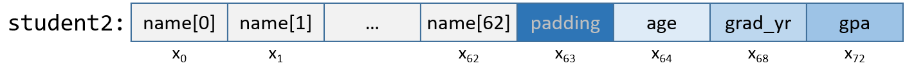

-   -   [4. Binary and Data
        Representation](../C4-Binary/index.html){.nav-link}
        -   [4.1. Number Bases and Unsigned
            Integers](../C4-Binary/bases.html){.nav-link}
        -   [4.2. Converting Between
            Bases](../C4-Binary/conversion.html){.nav-link}
        -   [4.3. Signed Binary
            Integers](../C4-Binary/signed.html){.nav-link}
        -   [4.4. Binary Integer
            Arithmetic](../C4-Binary/arithmetic.html){.nav-link}
            -   [4.4.1.
                Addition](../C4-Binary/arithmetic_addition.html){.nav-link}
            -   [4.4.2.
                Subtraction](../C4-Binary/arithmetic_subtraction.html){.nav-link}
            -   [4.4.3. Multiplication &
                Division](../C4-Binary/arithmetic_mult_div.html){.nav-link}
        -   [4.5. Overflow](../C4-Binary/overflow.html){.nav-link}
        -   [4.6. Bitwise
            Operators](../C4-Binary/bitwise.html){.nav-link}
        -   [4.7. Integer Byte
            Order](../C4-Binary/byte_order.html){.nav-link}
        -   [4.8. Real Numbers in
            Binary](../C4-Binary/floating_point.html){.nav-link}
        -   [4.9. Summary](../C4-Binary/summary.html){.nav-link}
        -   [4.10. Exercises](../C4-Binary/exercises.html){.nav-link}

-   -   [5. What von Neumann Knew: Computer
        Architecture](../C5-Arch/index.html){.nav-link}
        -   [5.1. The Origins of Modern
            Computing](../C5-Arch/hist.html){.nav-link}
        -   [5.2. The von Neumann
            Architecture](../C5-Arch/von.html){.nav-link}
        -   [5.3. Logic Gates](../C5-Arch/gates.html){.nav-link}
        -   [5.4. Circuits](../C5-Arch/circuits.html){.nav-link}
            -   [5.4.1. Arithmetic and Logic
                Circuits](../C5-Arch/arithlogiccircs.html){.nav-link}
            -   [5.4.2. Control
                Circuits](../C5-Arch/controlcircs.html){.nav-link}
            -   [5.4.3. Storage
                Circuits](../C5-Arch/storagecircs.html){.nav-link}
        -   [5.5. Building a Processor](../C5-Arch/cpu.html){.nav-link}
        -   [5.6. The Processor's Execution of Program
            Instructions](../C5-Arch/instrexec.html){.nav-link}
        -   [5.7. Pipelining Instruction
            Execution](../C5-Arch/pipelining.html){.nav-link}
        -   [5.8. Advanced Pipelining
            Considerations](../C5-Arch/pipelining_advanced.html){.nav-link}
        -   [5.9. Looking Ahead: CPUs
            Today](../C5-Arch/modern.html){.nav-link}
        -   [5.10. Summary](../C5-Arch/summary.html){.nav-link}
        -   [5.11. Exercises](../C5-Arch/exercises.html){.nav-link}

-   -   [6. Under the C: Dive into
        Assembly](../C6-asm_intro/index.html){.nav-link}

-   -   [7. 64-bit x86 Assembly](../C7-x86_64/index.html){.nav-link}
        -   [7.1. Assembly Basics](../C7-x86_64/basics.html){.nav-link}
        -   [7.2. Common
            Instructions](../C7-x86_64/common.html){.nav-link}
        -   [7.3. Additional Arithmetic
            Instructions](../C7-x86_64/arithmetic.html){.nav-link}
        -   [7.4. Conditional Control and
            Loops](../C7-x86_64/conditional_control_loops.html){.nav-link}
            -   [7.4.1.
                Preliminaries](../C7-x86_64/preliminaries.html){.nav-link}
            -   [7.4.2. If
                Statements](../C7-x86_64/if_statements.html){.nav-link}
            -   [7.4.3. Loops](../C7-x86_64/loops.html){.nav-link}
        -   [7.5. Functions in
            Assembly](../C7-x86_64/functions.html){.nav-link}
        -   [7.6. Recursion](../C7-x86_64/recursion.html){.nav-link}
        -   [7.7. Arrays in
            Assembly](../C7-x86_64/arrays.html){.nav-link}
        -   [7.8. Matrices in
            Assembly](../C7-x86_64/matrices.html){.nav-link}
        -   [7.9. Structs in
            Assembly](../C7-x86_64/structs.html){.nav-link}
        -   [7.10. Buffer
            Overflows](../C7-x86_64/buffer_overflow.html){.nav-link}
        -   [7.11. Exercises](../C7-x86_64/exercises.html){.nav-link}

-   -   [8. 32-bit x86 Assembly](index.html){.nav-link}
        -   [8.1. Assembly Basics](basics.html){.nav-link}
        -   [8.2. Common Instructions](common.html){.nav-link}
        -   [8.3. Additional Arithmetic
            Instructions](arithmetic.html){.nav-link}
        -   [8.4. Conditional Control and
            Loops](conditional_control_loops.html){.nav-link}
            -   [8.4.1. Preliminaries](preliminaries.html){.nav-link}
            -   [8.4.2. If Statements](if_statements.html){.nav-link}
            -   [8.4.3. Loops](loops.html){.nav-link}
        -   [8.5. Functions in Assembly](functions.html){.nav-link}
        -   [8.6. Recursion](recursion.html){.nav-link}
        -   [8.7. Arrays in Assembly](arrays.html){.nav-link}
        -   [8.8. Matrices in Assembly](matrices.html){.nav-link}
        -   [8.9. Structs in Assembly](structs.html){.nav-link}
        -   [8.10. Buffer Overflows](buffer_overflow.html){.nav-link}
        -   [8.11. Exercises](exercises.html){.nav-link}

-   -   [9. ARMv8 Assembly](../C9-ARM64/index.html){.nav-link}
        -   [9.1. Assembly Basics](../C9-ARM64/basics.html){.nav-link}
        -   [9.2. Common
            Instructions](../C9-ARM64/common.html){.nav-link}
        -   [9.3. Arithmetic
            Instructions](../C9-ARM64/arithmetic.html){.nav-link}
        -   [9.4. Conditional Control and
            Loops](../C9-ARM64/conditional_control_loops.html){.nav-link}
            -   [9.4.1.
                Preliminaries](../C9-ARM64/preliminaries.html){.nav-link}
            -   [9.4.2. If
                Statements](../C9-ARM64/if_statements.html){.nav-link}
            -   [9.4.3. Loops](../C9-ARM64/loops.html){.nav-link}
        -   [9.5. Functions in
            Assembly](../C9-ARM64/functions.html){.nav-link}
        -   [9.6. Recursion](../C9-ARM64/recursion.html){.nav-link}
        -   [9.7. Arrays in
            Assembly](../C9-ARM64/arrays.html){.nav-link}
        -   [9.8. Matrices in
            Assembly](../C9-ARM64/matrices.html){.nav-link}
        -   [9.9. Structs in
            Assembly](../C9-ARM64/structs.html){.nav-link}
        -   [9.10. Buffer
            Overflows](../C9-ARM64/buffer_overflow.html){.nav-link}
        -   [9.11. Exercises](../C9-ARM64/exercises.html){.nav-link}

-   -   [10. Key Assembly
        Takeaways](../C10-asm_takeaways/index.html){.nav-link}

-   -   [11. Storage and the Memory
        Hierarchy](../C11-MemHierarchy/index.html){.nav-link}
        -   [11.1. The Memory
            Hierarchy](../C11-MemHierarchy/mem_hierarchy.html){.nav-link}
        -   [11.2. Storage
            Devices](../C11-MemHierarchy/devices.html){.nav-link}
        -   [11.3.
            Locality](../C11-MemHierarchy/locality.html){.nav-link}
        -   [11.4. Caching](../C11-MemHierarchy/caching.html){.nav-link}
        -   [11.5. Cache Analysis and
            Cachegrind](../C11-MemHierarchy/cachegrind.html){.nav-link}
        -   [11.6. Looking Ahead: Caching on Multicore
            Processors](../C11-MemHierarchy/coherency.html){.nav-link}
        -   [11.7. Summary](../C11-MemHierarchy/summary.html){.nav-link}
        -   [11.8.
            Exercises](../C11-MemHierarchy/exercises.html){.nav-link}

-   -   [12. Code Optimization](../C12-CodeOpt/index.html){.nav-link}
        -   [12.1. First Steps](../C12-CodeOpt/basic.html){.nav-link}
        -   [12.2. Other Compiler
            Optimizations](../C12-CodeOpt/loops_functions.html){.nav-link}
        -   [12.3. Memory
            Considerations](../C12-CodeOpt/memory_considerations.html){.nav-link}
        -   [12.4. Summary](../C12-CodeOpt/summary.html){.nav-link}

-   -   [13. The Operating System](../C13-OS/index.html){.nav-link}
        -   [13.1. Booting and Running](../C13-OS/impl.html){.nav-link}
        -   [13.2. Processes](../C13-OS/processes.html){.nav-link}
        -   [13.3. Virtual Memory](../C13-OS/vm.html){.nav-link}
        -   [13.4. Interprocess
            Communication](../C13-OS/ipc.html){.nav-link}
            -   [13.4.1. Signals](../C13-OS/ipc_signals.html){.nav-link}
            -   [13.4.2. Message
                Passing](../C13-OS/ipc_msging.html){.nav-link}
            -   [13.4.3. Shared
                Memory](../C13-OS/ipc_shm.html){.nav-link}
        -   [13.5. Summary and Other OS
            Functionality](../C13-OS/advanced.html){.nav-link}
        -   [13.6. Exercises](../C13-OS/exercises.html){.nav-link}

-   -   [14. Leveraging Shared Memory in the Multicore
        Era](../C14-SharedMemory/index.html){.nav-link}
        -   [14.1. Programming Multicore
            Systems](../C14-SharedMemory/multicore.html){.nav-link}
        -   [14.2. POSIX
            Threads](../C14-SharedMemory/posix.html){.nav-link}
        -   [14.3. Synchronizing
            Threads](../C14-SharedMemory/synchronization.html){.nav-link}
            -   [14.3.1. Mutual
                Exclusion](../C14-SharedMemory/mutex.html){.nav-link}
            -   [14.3.2.
                Semaphores](../C14-SharedMemory/semaphores.html){.nav-link}
            -   [14.3.3. Other Synchronization
                Constructs](../C14-SharedMemory/other_syncs.html){.nav-link}
        -   [14.4. Measuring Parallel
            Performance](../C14-SharedMemory/performance.html){.nav-link}
            -   [14.4.1. Parallel Performance
                Basics](../C14-SharedMemory/performance_basics.html){.nav-link}
            -   [14.4.2. Advanced
                Topics](../C14-SharedMemory/performance_advanced.html){.nav-link}
        -   [14.5. Cache
            Coherence](../C14-SharedMemory/cache_coherence.html){.nav-link}
        -   [14.6. Thread
            Safety](../C14-SharedMemory/thread_safety.html){.nav-link}
        -   [14.7. Implicit Threading with
            OpenMP](../C14-SharedMemory/openmp.html){.nav-link}
        -   [14.8. Summary](../C14-SharedMemory/summary.html){.nav-link}
        -   [14.9.
            Exercises](../C14-SharedMemory/exercises.html){.nav-link}

-   -   [15. Looking Ahead: Other Parallel
        Systems](../C15-Parallel/index.html){.nav-link}
        -   [15.1. Hardware Acceleration and
            CUDA](../C15-Parallel/gpu.html){.nav-link}
        -   [15.2. Distributed Memory
            Systems](../C15-Parallel/distrmem.html){.nav-link}
        -   [15.3. To Exascale and
            Beyond](../C15-Parallel/cloud.html){.nav-link}

-   -   [16. Appendix 1: Chapter 1 for Java
        Programmers](../Appendix1/index.html){.nav-link}
        -   [16.1. Getting Started Programming in
            C](../Appendix1/getting_started.html){.nav-link}
        -   [16.2. Input/Output (printf and
            scanf)](../Appendix1/input_output.html){.nav-link}
        -   [16.3. Conditionals and
            Loops](../Appendix1/conditionals.html){.nav-link}
        -   [16.4. Functions](../Appendix1/functions.html){.nav-link}
        -   [16.5. Arrays and
            Strings](../Appendix1/arrays_strings.html){.nav-link}
        -   [16.6. Structs](../Appendix1/structs.html){.nav-link}
        -   [16.7. Summary](../Appendix1/summary.html){.nav-link}
        -   [16.8. Exercises](../Appendix1/exercises.html){.nav-link}

-   -   [17. Appendix 2: Using Unix](../Appendix2/index.html){.nav-link}
        -   [17.1. Unix Command Line and the Unix File
            System](../Appendix2/cmdln_basics.html){.nav-link}
        -   [17.2. Man and the Unix
            Manual](../Appendix2/man.html){.nav-link}
        -   [17.3. Remote Access](../Appendix2/ssh_scp.html){.nav-link}
        -   [17.4. Unix Editors](../Appendix2/editors.html){.nav-link}
        -   [17.5. make and
            Makefiles](../Appendix2/makefiles.html){.nav-link}
        -   [17.6 Searching: grep and
            find](../Appendix2/grep.html){.nav-link}
        -   [17.7 File Permissions](../Appendix2/chmod.html){.nav-link}
        -   [17.8 Archiving and Compressing
            Files](../Appendix2/tar.html){.nav-link}
        -   [17.9 Process Control](../Appendix2/pskill.html){.nav-link}
        -   [17.10 Timing](../Appendix2/timing.html){.nav-link}
        -   [17.11 Command
            History](../Appendix2/history.html){.nav-link}
        -   [17.12 I/0
            Redirection](../Appendix2/ioredirect.html){.nav-link}
        -   [17.13 Pipes](../Appendix2/pipe.html){.nav-link}
        -   [17.14 Dot Files and
            .bashrc](../Appendix2/dotfiles.html){.nav-link}
        -   [17.15 Shell
            Programming](../Appendix2/shellprog.html){.nav-link}
        -   [17.16 Getting System
            Information](../Appendix2/sysinfo.html){.nav-link}


-   [Dive Into Systems](../index-2.html)
-   [8. 32-bit x86 Assembly](index.html)
-   [8.9. Structs in Assembly](structs.html)
:::

::: content
::: sect1
## [](#_structs_in_assembly){.anchor}8.9. structs in Assembly {#_structs_in_assembly}

::: sectionbody
::: paragraph
A [struct](../C2-C_depth/structs.html#_c_structs){.page} is another way
to create a collection of data types in C. Unlike arrays, structs enable
different data types to be grouped together. C stores a `struct` like a
single-dimension array, where the data elements (fields) are stored
contiguously.
:::

::: paragraph
Let's revisit `struct studentT` from Chapter 1:
:::

::: listingblock
::: content
``` {.highlightjs .highlight}
struct studentT {
    char name[64];
    int  age;
    int  grad_yr;
    float gpa;
};

struct studentT student;
```
:::
:::

::: paragraph
[Figure 1](#structArray632) shows how `student` is laid out in memory.
For the sake of example, assume that `student` starts at address x~0~.
Each x~i~ denotes the address of a field.
:::

::: {#structArray632 .imageblock}
::: content

:::

::: title
Figure 1. The memory layout of the student struct
:::
:::

::: paragraph
The fields are stored contiguously next to one another in memory in the
order in which they are declared. In [Figure 1](#structArray632), the
`age` field is allocated at the memory location directly after the
`name` field (at byte offset x~64~) and is followed by the `grad_yr`
(byte offset x~68~) and `gpa` (byte offset x~72~) fields. This
organization enables memory-efficient access to the fields.
:::

::: paragraph
To understand how the compiler generates assembly code to work a
`struct`, consider the function `initStudent`:
:::

::: listingblock
::: content
``` {.highlightjs .highlight}
void initStudent(struct studentT *s, char *nm, int ag, int gr, float g) {
    strncpy(s->name, nm, 64);
    s->grad_yr = gr;
    s->age = ag;
    s->gpa = g;
}
```
:::
:::

::: paragraph
The `initStudent` function uses the base address of a `struct studentT`
as its first parameter, and the desired values for each field as its
remaining parameters. The listing that follows depicts this function in
assembly. In general, parameter *i* to function `initStudent` is located
at stack address `(ebp+8)` + 4 × *i*.
:::

::: listingblock
::: content
    <initStudent>:
     <+0>:   push  %ebp                     # save ebp
     <+1>:   mov   %esp,%ebp                # update ebp (new stack frame)
     <+3>:   sub   $0x18,%esp               # add 24 bytes to stack frame
     <+6>:   mov   0x8(%ebp),%eax           # copy first parameter (s) to eax
     <+9>:   mov   0xc(%ebp),%edx           # copy second parameter (nm) to edx
     <+12>   mov   $0x40,0x8(%esp)          # copy 0x40 (or 64) to esp+8
     <+16>:  mov   %edx,0x4(%esp)           # copy nm to esp+4
     <+20>:  mov   %eax,(%esp)              # copy s to top of stack (esp)
     <+23>:  call  0x8048320 <strncpy@plt>  # call strncpy(s->name, nm, 64)
     <+28>:  mov   0x8(%ebp),%eax           # copy s to eax
     <+32>:  mov   0x14(%ebp),%edx          # copy fourth parameter (gr) to edx
     <+35>:  mov   %edx,0x44(%eax)          # copy gr to offset eax+68 (s->grad_yr)
     <+38>:  mov   0x8(%ebp),%eax           # copy s to eax
     <+41>:  mov   0x10(%ebp),%edx          # copy third parameter (ag) to edx
     <+44>:  mov   %edx,0x40(%eax)          # copy ag to offset eax+64 (s->age)
     <+47>:  mov   0x8(%ebp),%edx           # copy s to edx
     <+50>:  mov   0x18(%ebp),%eax          # copy g to eax
     <+53>:  mov   %eax,0x48(%edx)          # copy g to offset edx+72 (s->gpa)
     <+56>:  leave                          # prepare to leave the function
     <+57>:  ret                            # return
:::
:::

::: paragraph
Being mindful of the byte offsets of each field is key to understanding
this code. Here are a few things to keep in mind.
:::

::: ulist
-   The `strncpy` call takes the base address of the `name` field of
    `s`, the address of array `nm`, and a length specifier as its three
    arguments. Recall that because `name` is the first field in
    `struct studentT`, the address of `s` is synonymous with the address
    of `s→name`.
:::

::: listingblock
::: content
     <+6>:   mov   0x8(%ebp),%eax           # copy first parameter (s) to eax
     <+9>:   mov   0xc(%ebp),%edx           # copy second parameter (nm) to edx
     <+12>   mov   $0x40,0x8(%esp)          # copy 0x40 (or 64) to esp+8
     <+16>:  mov   %edx,0x4(%esp)           # copy nm to esp+4
     <+20>:  mov   %eax,(%esp)              # copy s to top of stack (esp)
     <+23>:  call  0x8048320 <strncpy@plt>  # call strncpy(s->name, nm, 64)
:::
:::

::: ulist
-   The next part of the code (instructions `<initStudent+28>` thru
    `<initStudent+35>`) places the value of the `gr` parameter at an
    offset of 68 from the start of `s`. Revisiting the memory layout in
    [Figure 1](#structArray632) shows that this address corresponds to
    `s→grad_yr`.
:::

::: listingblock
::: content
     <+28>:  mov   0x8(%ebp),%eax           # copy s to eax
     <+32>:  mov   0x14(%ebp),%edx          # copy fourth parameter (gr) to edx
     <+35>:  mov   %edx,0x44(%eax)          # copy gr to offset eax+68 (s->grad_yr)
:::
:::

::: ulist
-   The next section of code (instructions `<initStudent+38>` thru
    `<initStudent+53>`) copies the `ag` parameter to the `s→age` field.
    Afterward, the `g` parameter value is copied to the `s→gpa` field
    (byte offset 72):
:::

::: listingblock
::: content
     <+38>:  mov   0x8(%ebp),%eax           # copy s to eax
     <+41>:  mov   0x10(%ebp),%edx          # copy third parameter (ag) to edx
     <+44>:  mov   %edx,0x40(%eax)          # copy ag to offset eax+64 (s->age)
     <+47>:  mov   0x8(%ebp),%edx           # copy s to edx
     <+50>:  mov   0x18(%ebp),%eax          # copy g to eax
     <+53>:  mov   %eax,0x48(%edx)          # copy g to offset edx+72 (s->gpa)
:::
:::

::: sect2
### [](#_data_alignment_and_structs){.anchor}8.9.1. Data Alignment and structs {#_data_alignment_and_structs}

::: paragraph
Consider the following modified declaration of `struct studentT`:
:::

::: listingblock
::: content
``` {.highlightjs .highlight}
struct studentTM {
    char name[63]; //updated to 63 instead of 64
    int  age;
    int  grad_yr;
    float gpa;
};

struct studentTM student2;
```
:::
:::

::: paragraph
The size of the `name` field is modified to be 63 bytes, instead of the
original 64. Consider how this affects the way the `struct` is laid out
in memory. It may be tempting to visualize it as in [Figure
2](#wrongLayout32).
:::

::: {#wrongLayout32 .imageblock}
::: content

:::

::: title
Figure 2. An incorrect memory layout for the updated struct studentTM.
Note that the struct's \"name\" field is reduced from 64 to 63 bytes.
:::
:::

::: paragraph
In this depiction, the `age` field occupies the byte immediately
following the `name` field. But this is incorrect. [Figure
3](#correctLayout32) depicts the actual layout in memory.
:::

::: {#correctLayout32 .imageblock}
::: content

:::

::: title
Figure 3. The correct memory layout for the updated struct studentTM.
Byte x~63~ is added by the compiler to satisfy memory alignment
constraints, but it doesn't correspond to any of the fields.
:::
:::

::: paragraph
IA32's alignment policy requires that two-byte data types (i.e.,
`short`) reside at a two-byte-aligned address whereas four-byte data
types (`int`, `float`, `long`, and pointer types) reside at
four-byte-aligned addresses, and eight-byte data types (`double`,
`long long`) reside at eight-byte-aligned addresses. For a `struct`, the
compiler adds empty bytes as **padding** between fields to ensure that
each field satisfies its alignment requirements. For example, in the
`struct` declared in the previous code snippet, the compiler adds a byte
of empty space (or padding) at byte x~63~ to ensure that the `age` field
starts at an address that is at a multiple of four. Values aligned
properly in memory can be read or written in a single operation,
enabling greater efficiency.
:::

::: paragraph
Consider what happens when a `struct` is defined as follows:
:::

::: listingblock
::: content
``` {.highlightjs .highlight}
struct studentTM {
    int  age;
    int  grad_yr;
    float gpa;
    char name[63];
};

struct studentTM student3;
```
:::
:::

::: paragraph
Moving the `name` array to the end moves the byte of padding to the end
of the struct, ensuring that `age`, `grad_yr`, and `gpa` are four-byte
aligned.
:::
:::
:::
:::

::: toc-menu
:::
:::
:::
:::

Copyright (C) 2020 Dive into Systems, LLC.

*Dive into Systems,* is licensed under the Creative Commons
[Attribution-NonCommercial-NoDerivatives 4.0
International](https://creativecommons.org/licenses/by-nc-nd/4.0/) (CC
BY-NC-ND 4.0).
