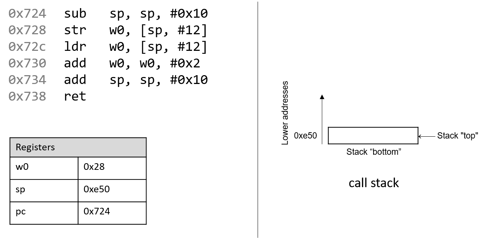
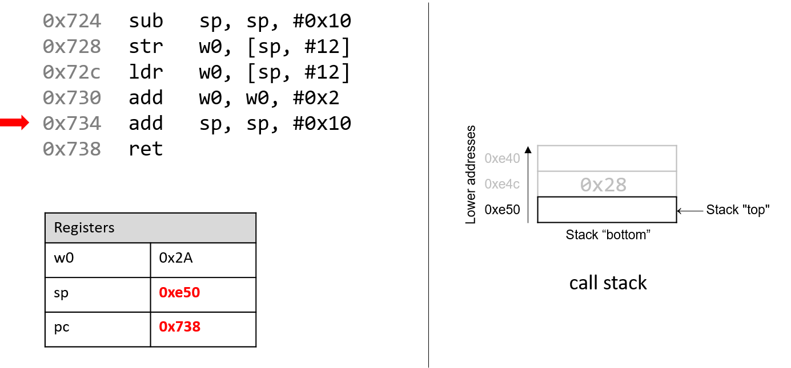
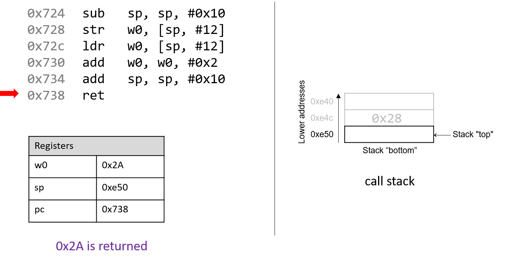

-   -   [4. Binary and Data
        Representation](../C4-Binary/index.html){.nav-link}
        -   [4.1. Number Bases and Unsigned
            Integers](../C4-Binary/bases.html){.nav-link}
        -   [4.2. Converting Between
            Bases](../C4-Binary/conversion.html){.nav-link}
        -   [4.3. Signed Binary
            Integers](../C4-Binary/signed.html){.nav-link}
        -   [4.4. Binary Integer
            Arithmetic](../C4-Binary/arithmetic.html){.nav-link}
            -   [4.4.1.
                Addition](../C4-Binary/arithmetic_addition.html){.nav-link}
            -   [4.4.2.
                Subtraction](../C4-Binary/arithmetic_subtraction.html){.nav-link}
            -   [4.4.3. Multiplication &
                Division](../C4-Binary/arithmetic_mult_div.html){.nav-link}
        -   [4.5. Overflow](../C4-Binary/overflow.html){.nav-link}
        -   [4.6. Bitwise
            Operators](../C4-Binary/bitwise.html){.nav-link}
        -   [4.7. Integer Byte
            Order](../C4-Binary/byte_order.html){.nav-link}
        -   [4.8. Real Numbers in
            Binary](../C4-Binary/floating_point.html){.nav-link}
        -   [4.9. Summary](../C4-Binary/summary.html){.nav-link}
        -   [4.10. Exercises](../C4-Binary/exercises.html){.nav-link}

-   -   [5. What von Neumann Knew: Computer
        Architecture](../C5-Arch/index.html){.nav-link}
        -   [5.1. The Origins of Modern
            Computing](../C5-Arch/hist.html){.nav-link}
        -   [5.2. The von Neumann
            Architecture](../C5-Arch/von.html){.nav-link}
        -   [5.3. Logic Gates](../C5-Arch/gates.html){.nav-link}
        -   [5.4. Circuits](../C5-Arch/circuits.html){.nav-link}
            -   [5.4.1. Arithmetic and Logic
                Circuits](../C5-Arch/arithlogiccircs.html){.nav-link}
            -   [5.4.2. Control
                Circuits](../C5-Arch/controlcircs.html){.nav-link}
            -   [5.4.3. Storage
                Circuits](../C5-Arch/storagecircs.html){.nav-link}
        -   [5.5. Building a Processor](../C5-Arch/cpu.html){.nav-link}
        -   [5.6. The Processor's Execution of Program
            Instructions](../C5-Arch/instrexec.html){.nav-link}
        -   [5.7. Pipelining Instruction
            Execution](../C5-Arch/pipelining.html){.nav-link}
        -   [5.8. Advanced Pipelining
            Considerations](../C5-Arch/pipelining_advanced.html){.nav-link}
        -   [5.9. Looking Ahead: CPUs
            Today](../C5-Arch/modern.html){.nav-link}
        -   [5.10. Summary](../C5-Arch/summary.html){.nav-link}
        -   [5.11. Exercises](../C5-Arch/exercises.html){.nav-link}

-   -   [6. Under the C: Dive into
        Assembly](../C6-asm_intro/index.html){.nav-link}

-   -   [7. 64-bit x86 Assembly](../C7-x86_64/index.html){.nav-link}
        -   [7.1. Assembly Basics](../C7-x86_64/basics.html){.nav-link}
        -   [7.2. Common
            Instructions](../C7-x86_64/common.html){.nav-link}
        -   [7.3. Additional Arithmetic
            Instructions](../C7-x86_64/arithmetic.html){.nav-link}
        -   [7.4. Conditional Control and
            Loops](../C7-x86_64/conditional_control_loops.html){.nav-link}
            -   [7.4.1.
                Preliminaries](../C7-x86_64/preliminaries.html){.nav-link}
            -   [7.4.2. If
                Statements](../C7-x86_64/if_statements.html){.nav-link}
            -   [7.4.3. Loops](../C7-x86_64/loops.html){.nav-link}
        -   [7.5. Functions in
            Assembly](../C7-x86_64/functions.html){.nav-link}
        -   [7.6. Recursion](../C7-x86_64/recursion.html){.nav-link}
        -   [7.7. Arrays in
            Assembly](../C7-x86_64/arrays.html){.nav-link}
        -   [7.8. Matrices in
            Assembly](../C7-x86_64/matrices.html){.nav-link}
        -   [7.9. Structs in
            Assembly](../C7-x86_64/structs.html){.nav-link}
        -   [7.10. Buffer
            Overflows](../C7-x86_64/buffer_overflow.html){.nav-link}
        -   [7.11. Exercises](../C7-x86_64/exercises.html){.nav-link}

-   -   [8. 32-bit x86 Assembly](../C8-IA32/index.html){.nav-link}
        -   [8.1. Assembly Basics](../C8-IA32/basics.html){.nav-link}
        -   [8.2. Common
            Instructions](../C8-IA32/common.html){.nav-link}
        -   [8.3. Additional Arithmetic
            Instructions](../C8-IA32/arithmetic.html){.nav-link}
        -   [8.4. Conditional Control and
            Loops](../C8-IA32/conditional_control_loops.html){.nav-link}
            -   [8.4.1.
                Preliminaries](../C8-IA32/preliminaries.html){.nav-link}
            -   [8.4.2. If
                Statements](../C8-IA32/if_statements.html){.nav-link}
            -   [8.4.3. Loops](../C8-IA32/loops.html){.nav-link}
        -   [8.5. Functions in
            Assembly](../C8-IA32/functions.html){.nav-link}
        -   [8.6. Recursion](../C8-IA32/recursion.html){.nav-link}
        -   [8.7. Arrays in Assembly](../C8-IA32/arrays.html){.nav-link}
        -   [8.8. Matrices in
            Assembly](../C8-IA32/matrices.html){.nav-link}
        -   [8.9. Structs in
            Assembly](../C8-IA32/structs.html){.nav-link}
        -   [8.10. Buffer
            Overflows](../C8-IA32/buffer_overflow.html){.nav-link}
        -   [8.11. Exercises](../C8-IA32/exercises.html){.nav-link}

-   -   [9. ARMv8 Assembly](index.html){.nav-link}
        -   [9.1. Assembly Basics](basics.html){.nav-link}
        -   [9.2. Common Instructions](common.html){.nav-link}
        -   [9.3. Arithmetic Instructions](arithmetic.html){.nav-link}
        -   [9.4. Conditional Control and
            Loops](conditional_control_loops.html){.nav-link}
            -   [9.4.1. Preliminaries](preliminaries.html){.nav-link}
            -   [9.4.2. If Statements](if_statements.html){.nav-link}
            -   [9.4.3. Loops](loops.html){.nav-link}
        -   [9.5. Functions in Assembly](functions.html){.nav-link}
        -   [9.6. Recursion](recursion.html){.nav-link}
        -   [9.7. Arrays in Assembly](arrays.html){.nav-link}
        -   [9.8. Matrices in Assembly](matrices.html){.nav-link}
        -   [9.9. Structs in Assembly](structs.html){.nav-link}
        -   [9.10. Buffer Overflows](buffer_overflow.html){.nav-link}
        -   [9.11. Exercises](exercises.html){.nav-link}

-   -   [10. Key Assembly
        Takeaways](../C10-asm_takeaways/index.html){.nav-link}

-   -   [11. Storage and the Memory
        Hierarchy](../C11-MemHierarchy/index.html){.nav-link}
        -   [11.1. The Memory
            Hierarchy](../C11-MemHierarchy/mem_hierarchy.html){.nav-link}
        -   [11.2. Storage
            Devices](../C11-MemHierarchy/devices.html){.nav-link}
        -   [11.3.
            Locality](../C11-MemHierarchy/locality.html){.nav-link}
        -   [11.4. Caching](../C11-MemHierarchy/caching.html){.nav-link}
        -   [11.5. Cache Analysis and
            Cachegrind](../C11-MemHierarchy/cachegrind.html){.nav-link}
        -   [11.6. Looking Ahead: Caching on Multicore
            Processors](../C11-MemHierarchy/coherency.html){.nav-link}
        -   [11.7. Summary](../C11-MemHierarchy/summary.html){.nav-link}
        -   [11.8.
            Exercises](../C11-MemHierarchy/exercises.html){.nav-link}

-   -   [12. Code Optimization](../C12-CodeOpt/index.html){.nav-link}
        -   [12.1. First Steps](../C12-CodeOpt/basic.html){.nav-link}
        -   [12.2. Other Compiler
            Optimizations](../C12-CodeOpt/loops_functions.html){.nav-link}
        -   [12.3. Memory
            Considerations](../C12-CodeOpt/memory_considerations.html){.nav-link}
        -   [12.4. Summary](../C12-CodeOpt/summary.html){.nav-link}

-   -   [13. The Operating System](../C13-OS/index.html){.nav-link}
        -   [13.1. Booting and Running](../C13-OS/impl.html){.nav-link}
        -   [13.2. Processes](../C13-OS/processes.html){.nav-link}
        -   [13.3. Virtual Memory](../C13-OS/vm.html){.nav-link}
        -   [13.4. Interprocess
            Communication](../C13-OS/ipc.html){.nav-link}
            -   [13.4.1. Signals](../C13-OS/ipc_signals.html){.nav-link}
            -   [13.4.2. Message
                Passing](../C13-OS/ipc_msging.html){.nav-link}
            -   [13.4.3. Shared
                Memory](../C13-OS/ipc_shm.html){.nav-link}
        -   [13.5. Summary and Other OS
            Functionality](../C13-OS/advanced.html){.nav-link}
        -   [13.6. Exercises](../C13-OS/exercises.html){.nav-link}

-   -   [14. Leveraging Shared Memory in the Multicore
        Era](../C14-SharedMemory/index.html){.nav-link}
        -   [14.1. Programming Multicore
            Systems](../C14-SharedMemory/multicore.html){.nav-link}
        -   [14.2. POSIX
            Threads](../C14-SharedMemory/posix.html){.nav-link}
        -   [14.3. Synchronizing
            Threads](../C14-SharedMemory/synchronization.html){.nav-link}
            -   [14.3.1. Mutual
                Exclusion](../C14-SharedMemory/mutex.html){.nav-link}
            -   [14.3.2.
                Semaphores](../C14-SharedMemory/semaphores.html){.nav-link}
            -   [14.3.3. Other Synchronization
                Constructs](../C14-SharedMemory/other_syncs.html){.nav-link}
        -   [14.4. Measuring Parallel
            Performance](../C14-SharedMemory/performance.html){.nav-link}
            -   [14.4.1. Parallel Performance
                Basics](../C14-SharedMemory/performance_basics.html){.nav-link}
            -   [14.4.2. Advanced
                Topics](../C14-SharedMemory/performance_advanced.html){.nav-link}
        -   [14.5. Cache
            Coherence](../C14-SharedMemory/cache_coherence.html){.nav-link}
        -   [14.6. Thread
            Safety](../C14-SharedMemory/thread_safety.html){.nav-link}
        -   [14.7. Implicit Threading with
            OpenMP](../C14-SharedMemory/openmp.html){.nav-link}
        -   [14.8. Summary](../C14-SharedMemory/summary.html){.nav-link}
        -   [14.9.
            Exercises](../C14-SharedMemory/exercises.html){.nav-link}

-   -   [15. Looking Ahead: Other Parallel
        Systems](../C15-Parallel/index.html){.nav-link}
        -   [15.1. Hardware Acceleration and
            CUDA](../C15-Parallel/gpu.html){.nav-link}
        -   [15.2. Distributed Memory
            Systems](../C15-Parallel/distrmem.html){.nav-link}
        -   [15.3. To Exascale and
            Beyond](../C15-Parallel/cloud.html){.nav-link}

-   -   [16. Appendix 1: Chapter 1 for Java
        Programmers](../Appendix1/index.html){.nav-link}
        -   [16.1. Getting Started Programming in
            C](../Appendix1/getting_started.html){.nav-link}
        -   [16.2. Input/Output (printf and
            scanf)](../Appendix1/input_output.html){.nav-link}
        -   [16.3. Conditionals and
            Loops](../Appendix1/conditionals.html){.nav-link}
        -   [16.4. Functions](../Appendix1/functions.html){.nav-link}
        -   [16.5. Arrays and
            Strings](../Appendix1/arrays_strings.html){.nav-link}
        -   [16.6. Structs](../Appendix1/structs.html){.nav-link}
        -   [16.7. Summary](../Appendix1/summary.html){.nav-link}
        -   [16.8. Exercises](../Appendix1/exercises.html){.nav-link}

-   -   [17. Appendix 2: Using Unix](../Appendix2/index.html){.nav-link}
        -   [17.1. Unix Command Line and the Unix File
            System](../Appendix2/cmdln_basics.html){.nav-link}
        -   [17.2. Man and the Unix
            Manual](../Appendix2/man.html){.nav-link}
        -   [17.3. Remote Access](../Appendix2/ssh_scp.html){.nav-link}
        -   [17.4. Unix Editors](../Appendix2/editors.html){.nav-link}
        -   [17.5. make and
            Makefiles](../Appendix2/makefiles.html){.nav-link}
        -   [17.6 Searching: grep and
            find](../Appendix2/grep.html){.nav-link}
        -   [17.7 File Permissions](../Appendix2/chmod.html){.nav-link}
        -   [17.8 Archiving and Compressing
            Files](../Appendix2/tar.html){.nav-link}
        -   [17.9 Process Control](../Appendix2/pskill.html){.nav-link}
        -   [17.10 Timing](../Appendix2/timing.html){.nav-link}
        -   [17.11 Command
            History](../Appendix2/history.html){.nav-link}
        -   [17.12 I/0
            Redirection](../Appendix2/ioredirect.html){.nav-link}
        -   [17.13 Pipes](../Appendix2/pipe.html){.nav-link}
        -   [17.14 Dot Files and
            .bashrc](../Appendix2/dotfiles.html){.nav-link}
        -   [17.15 Shell
            Programming](../Appendix2/shellprog.html){.nav-link}
        -   [17.16 Getting System
            Information](../Appendix2/sysinfo.html){.nav-link}


-   [Dive Into Systems](../index-2.html)
-   [9. ARMv8 Assembly](index.html)
-   [9.2. Common Instructions](common.html)
:::

::: content
::: sect1
## [](#_common_instructions){.anchor}9.2. Common Instructions {#_common_instructions}

::: sectionbody
::: paragraph
In this section, we discuss several common ARM assembly instructions.
[Table 1](#Basica64) lists the most foundational instructions in ARM
assembly.
:::

+-----------------------------------+-----------------------------------+
| Instruction                       | Translation                       |
+===================================+===================================+
| `ldr D, [addr]`                   | D = \*(addr) (loads the value in  |
|                                   | memory into register D)           |
+-----------------------------------+-----------------------------------+
| `str S, [addr]`                   | \*(addr) = S (stores S into       |
|                                   | memory location \*(addr) )        |
+-----------------------------------+-----------------------------------+
| `mov D, S`                        | D = S (copies value of S into D)  |
+-----------------------------------+-----------------------------------+
| `add D, O1, O2`                   | D = O1 + O2 (adds O1 to O2 and    |
|                                   | stores result in D)               |
+-----------------------------------+-----------------------------------+
| `sub D, O1, O2`                   | D = O1 - O2 (subtracts O2 from O1 |
|                                   | and stores result in D)           |
+-----------------------------------+-----------------------------------+

: Table 1. Most Common Instructions

::: paragraph
Therefore, the sequence of instructions
:::

::: listingblock
::: content
    str     w0, [sp, #12]
    ldr     w0, [sp, #12]
    add     w0, w0, #0x2
:::
:::

::: paragraph
translates to:
:::

::: ulist
-   Store the value in register `w0` in the *memory* location specified
    by `sp` + 12 (or `*(sp + 12)`).

-   Load the value *from* memory location `sp` + 12 (or `*(sp + 12)`)
    into register `w0`.

-   Add the value 0x2 to register `w0`, and store the result in register
    `w0` (or `w0` = `w0` + 0x2).
:::

::: paragraph
The `add` and `sub` instructions shown in [Table 1](#Basica64) also
assist with maintaining the organization of the program stack (i.e., the
**call stack**). Recall that the **stack pointer** (`sp`) is reserved by
the compiler for call stack management. Recall also from our earlier
discussion on [program
memory](../C2-C_depth/scope_memory.html#_parts_of_program_memory_and_scope){.page}
that the call stack typically stores local variables and parameters and
helps the program track its own execution (see [Figure
1](#ProgramMemorya64)). On ARM systems, the execution stack grows toward
*lower* addresses. Like all stack data structures, operations occur at
the \"top\" of the call stack; `sp` therefore \"points\" to the top of
the stack, and its value is the address of top of the stack.
:::

::: {#ProgramMemorya64 .imageblock .text-center}
::: content
{width="450"}
:::

::: title
Figure 1. The parts of a program's address space
:::
:::

::: paragraph
The `ldp` and `stp` instructions shown in [Table 2](#Basic2) assist with
moving multiple memory locations, usually either on or off the program
stack. In [Table 2](#Basic2), the register `x0` holds a memory address.
:::

+-----------------------------------+-----------------------------------+
| Instruction                       | Translation                       |
+===================================+===================================+
| `ldp D1, D2, [x0]`                | D1 = \*(x0), D2 = \*(x0+8) (loads |
|                                   | the value at x0 and x0+8 into     |
|                                   | registers D1 and D2,              |
|                                   | respectively)                     |
+-----------------------------------+-----------------------------------+
| `ldp D1, D2, [x0, #0x10]!`        | x0 = x0 + 0x10, *then* sets D1 =  |
|                                   | \*(x0), D2 = \*(x0+8)             |
+-----------------------------------+-----------------------------------+
| `ldp D1, D2, [x0], #0x10`         | D1 = \*(x0), D2 = \*(x0+8),       |
|                                   | *then* sets x0 = x0 + 0x10        |
+-----------------------------------+-----------------------------------+
| `stp S1, S2, [x0]`                | \*(x0) = S1, \*(x0+8) = S2        |
|                                   | (stores S1 and S2 at locations    |
|                                   | \*(x0) and \*(x0+8),              |
|                                   | respectively)                     |
+-----------------------------------+-----------------------------------+
| `stp S1, S2, [x0, #-16]!`         | sets x0 = x0 - 16, *then* stores  |
|                                   | \*(x0) = S1, \*(x0+8) = S2        |
+-----------------------------------+-----------------------------------+
| `stp S1, S2, [x0], #-16`          | stores \*(x0) = S1, \*(x0+8) = S2 |
|                                   | *then* sets x0 = x0 - 16          |
+-----------------------------------+-----------------------------------+

: Table 2. Some Instructions for Accessing Multiple Memory Locations

::: paragraph
In short, the `ldp` instruction loads a pair of values from the memory
locations held in register `x0` and at an offset of eight from that
memory location (i.e., `x0` + 0x8) into the destination registers D1 and
D2, respectively. Meanwhile, the `stp` instruction stores the pair of
values in source registers S1 and S2 to the memory locations held in
register `x0` and at an offset of eight from that address (i.e., `x0` +
0x8). Note that the assumption here is that values in the registers are
64-bit quantities. If 32-bit registers are being used instead, the
memory offsets change to `x0` and `x0` + 0x4 respectively.
:::

::: paragraph
There are also two special forms of the `ldp` and `stp` instructions
that enable simultaneous updates to `x0`. For example, the instruction
`stp S1, S2, [x0, #-16]!` implies that 16 bytes should *first* be
subtracted from `x0`, and only afterward should S1 and S2 be stored at
the offsets `[x0]` and `[x0+0x8]`. In contrast, the instruction
`ldp D1, D2, [x0], #0x10` states that the values at offsets `[x0]` and
`[x0+8]` should first be stored in destination registers D1 and D2 and
*only afterward* should `x0` have 16 bytes added to it. These special
forms are commonly used at the beginning and end of functions that have
multiple function calls, as we will see
[later](functions.html#_tracing_through_an_example){.page}.
:::

::: sect2
### [](#_putting_it_all_together_a_more_concrete_example){.anchor}9.2.1. Putting It All Together: A More Concrete Example {#_putting_it_all_together_a_more_concrete_example}

::: paragraph
Let's take a closer look at the `adder2` function
:::

::: listingblock
::: content
``` {.highlightjs .highlight}
//adds two to an integer and returns the result
int adder2(int a) {
    return a + 2;
}
```
:::
:::

::: paragraph
and its corresponding assembly code:
:::

::: listingblock
::: content
    0000000000000724 <adder2>:
     724:   d10043ff        sub     sp, sp, #0x10
     728:   b9000fe0        str     w0, [sp, #12]
     72c:   b9400fe0        ldr     w0, [sp, #12]
     730:   11000800        add     w0, w0, #0x2
     734:   910043ff        add     sp, sp, #0x10
     738:   d65f03c0        ret
:::
:::

::: paragraph
The assembly code consists of a `sub` instruction, followed by `str` and
`ldr` instructions, two `add` instructions, and finally a `ret`
instruction. To understand how the CPU executes this set of
instructions, we need to revisit the structure of [program
memory](../C2-C_depth/scope_memory.html#_parts_of_program_memory_and_scope){.page}.
Recall that every time a program executes, the operating system
allocates the new program's address space (also known as **virtual
memory**). [Virtual memory](../C13-OS/vm.html#_virtual_memory){.page}
and the related concept of
[processes](../C13-OS/processes.html#_processes){.page} are covered in
greater detail in Chapter 13; for now, it suffices to think of a process
as the abstraction of a running program and virtual memory as the memory
that is allocated to a single process. Every process has its own region
of memory called the **call stack**. Keep in mind that the call stack is
located in process/virtual memory, unlike registers (which are located
in the CPU).
:::

::: paragraph
[Figure 2](#InitialStepa64) depicts a sample state of the call stack and
registers prior to the execution of the `adder2` function.
:::

::: {#InitialStepa64 .imageblock}
::: content

:::

::: title
Figure 2. Execution stack prior to execution
:::
:::

::: paragraph
Notice that the stack grows toward *lower* addresses. The parameter to
the `adder2` function (or `a`) is stored in register `x0` by convention.
Since `a` is of type `int`, it is stored in component register `w0`, as
shown in [Figure 2](#InitialStepa64). Likewise, since the `adder2`
function returns an `int`, component register `w0` is used for the
return value instead of `x0`.
:::

::: paragraph
The addresses associated with the instructions in the code segment of
program memory have been shortened to 0x724-0x738 to improve figure
readability. Likewise, the addresses associated with the call stack
segment of program memory have been shortened to 0xe40-0xe50 from a
range of 0xffffffffee40 to 0xffffffffee50. In truth, call stack
addresses occur at much higher addresses in program memory than code
segment addresses.
:::

::: paragraph
Pay close attention to the initial values of registers `sp` and `pc`:
they are 0xe50 and 0x724, respectively. The `pc` register (or program
counter) indicates the next instruction to execute, and the address
0x724 corresponds to the first instruction in the `adder2` function. The
red (upper-left) arrow in the following figures visually indicates the
currently executing instruction.
:::

------------------------------------------------------------------------

::: imageblock
::: content

:::
:::

::: paragraph
The first instruction (`sub sp, sp, #0x10`) subtracts the constant value
0x10 from the stack pointer, and updates the stack pointer with the new
result. Since the stack pointer contains the address of the top of the
stack, this operation *grows* the stack by 16 bytes. The stack pointer
now contains the address 0xe40, whereas the program counter (`pc`)
register contains the address of the next instruction to execute, or
0x728.
:::

------------------------------------------------------------------------

::: imageblock
::: content

:::
:::

::: paragraph
Recall that the `str` instruction *stores* a value located in a register
into memory. Thus, the next instruction (`str w0, [sp, #12]`) places the
value in `w0` (the value of `a`, or 0x28) at call stack location `sp` +
12, or 0xe4c. Note that this instruction does not modify the contents of
register `sp` in any way; it simply stores a value on the call stack.
Once this instruction executes, `pc` advances to the address of the next
instruction, or 0x72c.
:::

------------------------------------------------------------------------

::: imageblock
::: content

:::
:::

::: paragraph
Next, `ldr w0, [sp, #12]` executes. Recall that the `ldr` instruction
*loads* a value in memory into a register. By executing this
instruction, the CPU replaces the value in register `w0` with the value
located at stack address `sp` + 12. Even though this may seem like a
nonsensical operation (0x28 is replaced by 0x28, after all), it
highlights a convention where the compiler typically stores function
parameters onto the call stack for later use and then reloads them into
registers as needed. Again, the value stored in the `sp` register is not
affected by the `str` operation. As far as the program is concerned, the
\"top\" of the stack is still 0xe40. Once the `ldr` instruction
executes, `pc` advances to address 0x730.
:::

------------------------------------------------------------------------

::: imageblock
::: content

:::
:::

::: paragraph
Afterward, `add w0, w0, #0x2` executes. Recall that the `add`
instruction has the form `add D, O1, O2` and places O1 + O2 in the
destination register D. So, `add w0, w0, #0x2` adds the constant value
0x2 to the value stored in `w0` (0x28), resulting in 0x2A being stored
in register `w0`. Register `pc` advances to the next instruction to be
executed, or 0x734.
:::

------------------------------------------------------------------------

::: imageblock
::: content

:::
:::

::: paragraph
The next instruction that executes is `add sp, sp, #0x10`. This
instruction adds 16 bytes to the address stored in `sp`. Since the stack
grows toward lower addresses, adding 16 bytes to the stack pointer
consequently *shrinks* the stack, and reverts `sp` to its original value
of 0xe50. The `pc` register then advances to 0x738.
:::

::: paragraph
Recall that the purpose of the call stack is to store the temporary data
that each function uses as it executes in the context of a larger
program. By convention, the stack \"grows\" at the beginning of a
function call, and reverts to its original state when the function ends.
As a result, it is common to see a `sub sp, sp, #v` instruction (where
`v` is some constant value) at the beginning of a function, and
`add sp, sp, #v` at the end.
:::

------------------------------------------------------------------------

::: imageblock
::: content

:::
:::

::: paragraph
The last instruction that executes is `ret`. We will talk more about
what `ret` does in future sections when we discuss function calls, but
for now it suffices to know that `ret` prepares the call stack for
returning from a function. By convention, the register `x0` always
contains the return value (if one exists). In this case, since `adder2`
is of type `int`, the return value is stored in component register `w0`
and the function returns the value 0x2A, or 42.
:::
:::
:::
:::

::: toc-menu
:::
:::
:::
:::

Copyright (C) 2020 Dive into Systems, LLC.

*Dive into Systems,* is licensed under the Creative Commons
[Attribution-NonCommercial-NoDerivatives 4.0
International](https://creativecommons.org/licenses/by-nc-nd/4.0/) (CC
BY-NC-ND 4.0).
