-   -   [4. Binary and Data
        Representation](../C4-Binary/index.html){.nav-link}
        -   [4.1. Number Bases and Unsigned
            Integers](../C4-Binary/bases.html){.nav-link}
        -   [4.2. Converting Between
            Bases](../C4-Binary/conversion.html){.nav-link}
        -   [4.3. Signed Binary
            Integers](../C4-Binary/signed.html){.nav-link}
        -   [4.4. Binary Integer
            Arithmetic](../C4-Binary/arithmetic.html){.nav-link}
            -   [4.4.1.
                Addition](../C4-Binary/arithmetic_addition.html){.nav-link}
            -   [4.4.2.
                Subtraction](../C4-Binary/arithmetic_subtraction.html){.nav-link}
            -   [4.4.3. Multiplication &
                Division](../C4-Binary/arithmetic_mult_div.html){.nav-link}
        -   [4.5. Overflow](../C4-Binary/overflow.html){.nav-link}
        -   [4.6. Bitwise
            Operators](../C4-Binary/bitwise.html){.nav-link}
        -   [4.7. Integer Byte
            Order](../C4-Binary/byte_order.html){.nav-link}
        -   [4.8. Real Numbers in
            Binary](../C4-Binary/floating_point.html){.nav-link}
        -   [4.9. Summary](../C4-Binary/summary.html){.nav-link}
        -   [4.10. Exercises](../C4-Binary/exercises.html){.nav-link}

-   -   [5. What von Neumann Knew: Computer
        Architecture](../C5-Arch/index.html){.nav-link}
        -   [5.1. The Origins of Modern
            Computing](../C5-Arch/hist.html){.nav-link}
        -   [5.2. The von Neumann
            Architecture](../C5-Arch/von.html){.nav-link}
        -   [5.3. Logic Gates](../C5-Arch/gates.html){.nav-link}
        -   [5.4. Circuits](../C5-Arch/circuits.html){.nav-link}
            -   [5.4.1. Arithmetic and Logic
                Circuits](../C5-Arch/arithlogiccircs.html){.nav-link}
            -   [5.4.2. Control
                Circuits](../C5-Arch/controlcircs.html){.nav-link}
            -   [5.4.3. Storage
                Circuits](../C5-Arch/storagecircs.html){.nav-link}
        -   [5.5. Building a Processor](../C5-Arch/cpu.html){.nav-link}
        -   [5.6. The Processor's Execution of Program
            Instructions](../C5-Arch/instrexec.html){.nav-link}
        -   [5.7. Pipelining Instruction
            Execution](../C5-Arch/pipelining.html){.nav-link}
        -   [5.8. Advanced Pipelining
            Considerations](../C5-Arch/pipelining_advanced.html){.nav-link}
        -   [5.9. Looking Ahead: CPUs
            Today](../C5-Arch/modern.html){.nav-link}
        -   [5.10. Summary](../C5-Arch/summary.html){.nav-link}
        -   [5.11. Exercises](../C5-Arch/exercises.html){.nav-link}

-   -   [6. Under the C: Dive into
        Assembly](../C6-asm_intro/index.html){.nav-link}

-   -   [7. 64-bit x86 Assembly](../C7-x86_64/index.html){.nav-link}
        -   [7.1. Assembly Basics](../C7-x86_64/basics.html){.nav-link}
        -   [7.2. Common
            Instructions](../C7-x86_64/common.html){.nav-link}
        -   [7.3. Additional Arithmetic
            Instructions](../C7-x86_64/arithmetic.html){.nav-link}
        -   [7.4. Conditional Control and
            Loops](../C7-x86_64/conditional_control_loops.html){.nav-link}
            -   [7.4.1.
                Preliminaries](../C7-x86_64/preliminaries.html){.nav-link}
            -   [7.4.2. If
                Statements](../C7-x86_64/if_statements.html){.nav-link}
            -   [7.4.3. Loops](../C7-x86_64/loops.html){.nav-link}
        -   [7.5. Functions in
            Assembly](../C7-x86_64/functions.html){.nav-link}
        -   [7.6. Recursion](../C7-x86_64/recursion.html){.nav-link}
        -   [7.7. Arrays in
            Assembly](../C7-x86_64/arrays.html){.nav-link}
        -   [7.8. Matrices in
            Assembly](../C7-x86_64/matrices.html){.nav-link}
        -   [7.9. Structs in
            Assembly](../C7-x86_64/structs.html){.nav-link}
        -   [7.10. Buffer
            Overflows](../C7-x86_64/buffer_overflow.html){.nav-link}
        -   [7.11. Exercises](../C7-x86_64/exercises.html){.nav-link}

-   -   [8. 32-bit x86 Assembly](../C8-IA32/index.html){.nav-link}
        -   [8.1. Assembly Basics](../C8-IA32/basics.html){.nav-link}
        -   [8.2. Common
            Instructions](../C8-IA32/common.html){.nav-link}
        -   [8.3. Additional Arithmetic
            Instructions](../C8-IA32/arithmetic.html){.nav-link}
        -   [8.4. Conditional Control and
            Loops](../C8-IA32/conditional_control_loops.html){.nav-link}
            -   [8.4.1.
                Preliminaries](../C8-IA32/preliminaries.html){.nav-link}
            -   [8.4.2. If
                Statements](../C8-IA32/if_statements.html){.nav-link}
            -   [8.4.3. Loops](../C8-IA32/loops.html){.nav-link}
        -   [8.5. Functions in
            Assembly](../C8-IA32/functions.html){.nav-link}
        -   [8.6. Recursion](../C8-IA32/recursion.html){.nav-link}
        -   [8.7. Arrays in Assembly](../C8-IA32/arrays.html){.nav-link}
        -   [8.8. Matrices in
            Assembly](../C8-IA32/matrices.html){.nav-link}
        -   [8.9. Structs in
            Assembly](../C8-IA32/structs.html){.nav-link}
        -   [8.10. Buffer
            Overflows](../C8-IA32/buffer_overflow.html){.nav-link}
        -   [8.11. Exercises](../C8-IA32/exercises.html){.nav-link}

-   -   [9. ARMv8 Assembly](index.html){.nav-link}
        -   [9.1. Assembly Basics](basics.html){.nav-link}
        -   [9.2. Common Instructions](common.html){.nav-link}
        -   [9.3. Arithmetic Instructions](arithmetic.html){.nav-link}
        -   [9.4. Conditional Control and
            Loops](conditional_control_loops.html){.nav-link}
            -   [9.4.1. Preliminaries](preliminaries.html){.nav-link}
            -   [9.4.2. If Statements](if_statements.html){.nav-link}
            -   [9.4.3. Loops](loops.html){.nav-link}
        -   [9.5. Functions in Assembly](functions.html){.nav-link}
        -   [9.6. Recursion](recursion.html){.nav-link}
        -   [9.7. Arrays in Assembly](arrays.html){.nav-link}
        -   [9.8. Matrices in Assembly](matrices.html){.nav-link}
        -   [9.9. Structs in Assembly](structs.html){.nav-link}
        -   [9.10. Buffer Overflows](buffer_overflow.html){.nav-link}
        -   [9.11. Exercises](exercises.html){.nav-link}

-   -   [10. Key Assembly
        Takeaways](../C10-asm_takeaways/index.html){.nav-link}

-   -   [11. Storage and the Memory
        Hierarchy](../C11-MemHierarchy/index.html){.nav-link}
        -   [11.1. The Memory
            Hierarchy](../C11-MemHierarchy/mem_hierarchy.html){.nav-link}
        -   [11.2. Storage
            Devices](../C11-MemHierarchy/devices.html){.nav-link}
        -   [11.3.
            Locality](../C11-MemHierarchy/locality.html){.nav-link}
        -   [11.4. Caching](../C11-MemHierarchy/caching.html){.nav-link}
        -   [11.5. Cache Analysis and
            Cachegrind](../C11-MemHierarchy/cachegrind.html){.nav-link}
        -   [11.6. Looking Ahead: Caching on Multicore
            Processors](../C11-MemHierarchy/coherency.html){.nav-link}
        -   [11.7. Summary](../C11-MemHierarchy/summary.html){.nav-link}
        -   [11.8.
            Exercises](../C11-MemHierarchy/exercises.html){.nav-link}

-   -   [12. Code Optimization](../C12-CodeOpt/index.html){.nav-link}
        -   [12.1. First Steps](../C12-CodeOpt/basic.html){.nav-link}
        -   [12.2. Other Compiler
            Optimizations](../C12-CodeOpt/loops_functions.html){.nav-link}
        -   [12.3. Memory
            Considerations](../C12-CodeOpt/memory_considerations.html){.nav-link}
        -   [12.4. Summary](../C12-CodeOpt/summary.html){.nav-link}

-   -   [13. The Operating System](../C13-OS/index.html){.nav-link}
        -   [13.1. Booting and Running](../C13-OS/impl.html){.nav-link}
        -   [13.2. Processes](../C13-OS/processes.html){.nav-link}
        -   [13.3. Virtual Memory](../C13-OS/vm.html){.nav-link}
        -   [13.4. Interprocess
            Communication](../C13-OS/ipc.html){.nav-link}
            -   [13.4.1. Signals](../C13-OS/ipc_signals.html){.nav-link}
            -   [13.4.2. Message
                Passing](../C13-OS/ipc_msging.html){.nav-link}
            -   [13.4.3. Shared
                Memory](../C13-OS/ipc_shm.html){.nav-link}
        -   [13.5. Summary and Other OS
            Functionality](../C13-OS/advanced.html){.nav-link}
        -   [13.6. Exercises](../C13-OS/exercises.html){.nav-link}

-   -   [14. Leveraging Shared Memory in the Multicore
        Era](../C14-SharedMemory/index.html){.nav-link}
        -   [14.1. Programming Multicore
            Systems](../C14-SharedMemory/multicore.html){.nav-link}
        -   [14.2. POSIX
            Threads](../C14-SharedMemory/posix.html){.nav-link}
        -   [14.3. Synchronizing
            Threads](../C14-SharedMemory/synchronization.html){.nav-link}
            -   [14.3.1. Mutual
                Exclusion](../C14-SharedMemory/mutex.html){.nav-link}
            -   [14.3.2.
                Semaphores](../C14-SharedMemory/semaphores.html){.nav-link}
            -   [14.3.3. Other Synchronization
                Constructs](../C14-SharedMemory/other_syncs.html){.nav-link}
        -   [14.4. Measuring Parallel
            Performance](../C14-SharedMemory/performance.html){.nav-link}
            -   [14.4.1. Parallel Performance
                Basics](../C14-SharedMemory/performance_basics.html){.nav-link}
            -   [14.4.2. Advanced
                Topics](../C14-SharedMemory/performance_advanced.html){.nav-link}
        -   [14.5. Cache
            Coherence](../C14-SharedMemory/cache_coherence.html){.nav-link}
        -   [14.6. Thread
            Safety](../C14-SharedMemory/thread_safety.html){.nav-link}
        -   [14.7. Implicit Threading with
            OpenMP](../C14-SharedMemory/openmp.html){.nav-link}
        -   [14.8. Summary](../C14-SharedMemory/summary.html){.nav-link}
        -   [14.9.
            Exercises](../C14-SharedMemory/exercises.html){.nav-link}

-   -   [15. Looking Ahead: Other Parallel
        Systems](../C15-Parallel/index.html){.nav-link}
        -   [15.1. Hardware Acceleration and
            CUDA](../C15-Parallel/gpu.html){.nav-link}
        -   [15.2. Distributed Memory
            Systems](../C15-Parallel/distrmem.html){.nav-link}
        -   [15.3. To Exascale and
            Beyond](../C15-Parallel/cloud.html){.nav-link}

-   -   [16. Appendix 1: Chapter 1 for Java
        Programmers](../Appendix1/index.html){.nav-link}
        -   [16.1. Getting Started Programming in
            C](../Appendix1/getting_started.html){.nav-link}
        -   [16.2. Input/Output (printf and
            scanf)](../Appendix1/input_output.html){.nav-link}
        -   [16.3. Conditionals and
            Loops](../Appendix1/conditionals.html){.nav-link}
        -   [16.4. Functions](../Appendix1/functions.html){.nav-link}
        -   [16.5. Arrays and
            Strings](../Appendix1/arrays_strings.html){.nav-link}
        -   [16.6. Structs](../Appendix1/structs.html){.nav-link}
        -   [16.7. Summary](../Appendix1/summary.html){.nav-link}
        -   [16.8. Exercises](../Appendix1/exercises.html){.nav-link}

-   -   [17. Appendix 2: Using Unix](../Appendix2/index.html){.nav-link}
        -   [17.1. Unix Command Line and the Unix File
            System](../Appendix2/cmdln_basics.html){.nav-link}
        -   [17.2. Man and the Unix
            Manual](../Appendix2/man.html){.nav-link}
        -   [17.3. Remote Access](../Appendix2/ssh_scp.html){.nav-link}
        -   [17.4. Unix Editors](../Appendix2/editors.html){.nav-link}
        -   [17.5. make and
            Makefiles](../Appendix2/makefiles.html){.nav-link}
        -   [17.6 Searching: grep and
            find](../Appendix2/grep.html){.nav-link}
        -   [17.7 File Permissions](../Appendix2/chmod.html){.nav-link}
        -   [17.8 Archiving and Compressing
            Files](../Appendix2/tar.html){.nav-link}
        -   [17.9 Process Control](../Appendix2/pskill.html){.nav-link}
        -   [17.10 Timing](../Appendix2/timing.html){.nav-link}
        -   [17.11 Command
            History](../Appendix2/history.html){.nav-link}
        -   [17.12 I/0
            Redirection](../Appendix2/ioredirect.html){.nav-link}
        -   [17.13 Pipes](../Appendix2/pipe.html){.nav-link}
        -   [17.14 Dot Files and
            .bashrc](../Appendix2/dotfiles.html){.nav-link}
        -   [17.15 Shell
            Programming](../Appendix2/shellprog.html){.nav-link}
        -   [17.16 Getting System
            Information](../Appendix2/sysinfo.html){.nav-link}


-   [Dive Into Systems](../index-2.html)
-   [9. ARMv8 Assembly](index.html)
-   [9.5. Functions in Assembly](functions.html)
:::

::: content
::: sect1
## [](#_functions_in_assembly){.anchor}9.5. Functions in Assembly {#_functions_in_assembly}

::: sectionbody
::: paragraph
In the previous section, we traced through simple functions in assembly.
In this section, we discuss the interaction between multiple functions
in assembly in the context of a larger program. We also introduce some
new instructions involved with function management.
:::

::: paragraph
Let's begin with a refresher on how the call stack is managed. Recall
that `sp` is the **stack pointer** and always points to the top of the
stack. The register `x29` represents the base pointer (also known as the
**frame pointer** or `FP`) and points to the base of the current stack
frame. The **stack frame** (also known as the **activation frame** or
the **activation record**) refers to the portion of the stack allocated
to a single function call. The currently executing function is always at
the top of the stack, and its stack frame is referred to as the **active
frame**. The active frame is bounded by the stack pointer (at the top of
stack, lower address) and frame pointer (at the bottom of the frame,
higher address). The activation record typically holds local variables
for a function. Lastly, the **return address** indicates the program
address at which the calling function (e.g., `main`) resumes execution
once the callee function exits. In A64 systems, the return address is
stored in register `x30` (also known as `LR`).
:::

::: paragraph
[Figure 1](#StackFramea64) shows the stack frames for `main` and a
function it calls named `fname`. We will refer to the `main` function as
the *caller* function and `fname` as the *callee* function.
:::

::: {#StackFramea64 .imageblock .text-center}
::: content
{width="700"}
:::

::: title
Figure 1. Stack frame management
:::
:::

::: paragraph
In [Figure 1](#StackFramea64), the current active frame belongs to the
callee function (`fname`). The region of the call stack between the
stack and frame pointers is used for local variables. The stack pointer
moves as local values are pushed onto and popped from the stack. The
frame pointer is not commonly used in optimized code, and is usually
optional for operation. As a result, compilers like GCC commonly
reference values on the stack relative to the stack pointer. In [Figure
1](#StackFramea64), the active frame is bounded below by the base
pointer of `fname`, or `x29`, which contains stack address 0xef30. The
value stored at address 0xef30 is the \"saved\" frame pointer value
(0xef50), which itself indicates the bottom of the activation frame for
the `main` function. Right below the frame pointer is a saved **return
address** (stored in `x30`), which indicates the address that the
program will continue executing once `main` exits.
:::

::: {.admonitionblock .warning}
+-----------------------------------+-----------------------------------+
|                                   | ::: title                         |
|                                   | The return address points to code |
|                                   | memory, not stack memory          |
|                                   | :::                               |
|                                   |                                   |
|                                   | ::: paragraph                     |
|                                   | Recall that the call stack region |
|                                   | (stack memory) of a program is    |
|                                   | different from its code region    |
|                                   | (code memory). Whereas `sp` and   |
|                                   | `x29` point to addresses in the   |
|                                   | stack memory, `pc` points to an   |
|                                   | address in *code* memory. In      |
|                                   | other words, the return address   |
|                                   | is an address in *code* memory,   |
|                                   | not stack memory:                 |
|                                   | :::                               |
|                                   |                                   |
|                                   | ::: {#ProgramMem                  |
|                                   | ory2a64 .imageblock .text-center} |
|                                   | ::: content                       |
|                                   | {width="450"} |
|                                   | :::                               |
|                                   |                                   |
|                                   | ::: title                         |
|                                   | Figure 2. The parts of a          |
|                                   | program's address space           |
|                                   | :::                               |
|                                   | :::                               |
+-----------------------------------+-----------------------------------+
:::

::: paragraph
[Table 1](#FunctionManagementa64) contains several additional
instructions that the compiler uses for basic function management.
:::

+-----------------------------------+-----------------------------------+
| Instruction                       | Translation                       |
+===================================+===================================+
| `bl addr <fname>`                 | Sets `x30 = pc + 4` and sets      |
|                                   | `pc = addr`                       |
+-----------------------------------+-----------------------------------+
| `blr R <fname>`                   | Sets `x30 = pc + 4` and sets      |
|                                   | `pc = R`                          |
+-----------------------------------+-----------------------------------+
| `ret`                             | Returns value in `x0` and sets    |
|                                   | `pc = x30`                        |
+-----------------------------------+-----------------------------------+

: Table 1. Common Function Management Instructions

::: paragraph
The `bl` and `ret` instructions play a prominent role in the process
where one function calls another. Both instructions modify the
instruction pointer (register `pc`). When the caller function executes
the `bl` instruction, the value of `pc + 4` is saved in register `x30`
to represent the return address, or the program address at which the
caller resumes executing once the callee function finishes. The `bl`
instruction also replaces the value of `pc` with the address of the
callee function.
:::

::: paragraph
The `ret` instruction restores the value of `pc` to the value saved in
`x30`, ensuring that the program resumes execution at the program
address specified in the caller function. Any value returned by the
callee is stored in register `x0` or its component register `w0`. The
`ret` instruction is usually the last instruction that executes in any
function.
:::

::: sect2
### [](#_function_parameters){.anchor}9.5.1. Function Parameters {#_function_parameters}

::: paragraph
Function parameters are typically preloaded into registers prior to a
function call. The first eight parameters to a function are stored in
registers `x0`...​`x7`. If a function requires more than seven
parameters, the remaining parameters are successively loaded into the
call stack based on their size (4-byte offsets for 32-bit data, 8-byte
offsets for 64-bit data).
:::
:::

::: sect2
### [](#_tracing_through_an_example){.anchor}9.5.2. Tracing Through an Example {#_tracing_through_an_example}

::: paragraph
Using our knowledge of function management, let's trace through the code
example first introduced at the beginning of this chapter.
:::

::: listingblock
::: content
``` {.highlightjs .highlight}
#include <stdio.h>

int assign() {
    int y = 40;
    return y;
}

int adder() {
    int a;
    return a + 2;
}

int main(void) {
    int x;
    assign();
    x = adder();
    printf("x is: %d\n", x);
    return 0;
}
```
:::
:::

::: paragraph
We compile this code with the command `gcc -o prog prog.c` and use
`objdump -d` to view the underlying assembly. The latter command outputs
a pretty big file that contains a lot of information that we don't need.
Use `less` and the search functionality to extract the `adder`,
`assign`, and `main` functions:
:::

::: listingblock
::: content
    0000000000000724 <assign>:
     724:   d10043ff        sub     sp, sp, #0x10
     728:   52800500        mov     w0, #0x28                       // #40
     72c:   b9000fe0        str     w0, [sp, #12]
     730:   b9400fe0        ldr     w0, [sp, #12]
     734:   910043ff        add     sp, sp, #0x10
     738:   d65f03c0        ret

    000000000000073c <adder>:
     73c:   d10043ff        sub     sp, sp, #0x10
     740:   b9400fe0        ldr     w0, [sp, #12]
     744:   11000800        add     w0, w0, #0x2
     748:   910043ff        add     sp, sp, #0x10
     74c:   d65f03c0        ret

    0000000000000750 <main>:
     750:   a9be7bfd        stp     x29, x30, [sp, #-32]!
     754:   910003fd        mov     x29, sp
     758:   97fffff3        bl      724 <assign>
     75c:   97fffff8        bl      73c <adder>
     760:   b9001fa0        str     w0, [x29, #28]
     764:   90000000        adrp    x0, 0 <_init-0x598>
     768:   91208000        add     x0, x0, #0x820
     76c:   b9401fa1        ldr     w1, [x29, #28]
     770:   97ffffa8        bl      610 <printf@plt>
     774:   52800000        mov     w0, #0x0                        // #0
     778:   a8c27bfd        ldp     x29, x30, [sp], #32
     77c:   d65f03c0        ret
:::
:::

::: paragraph
Each function begins with a symbolic label that corresponds to its
declared name in the program. For example, `<main>:` is the symbolic
label for the `main` function. The address of a function label is also
the address of the first instruction in that function. To save space in
the figures that follow, we truncate code addresses to the lower 12
bits, and stack addresses to the lower 16 bits. So, stack address
0xffffffffef50 is shown as 0xef50.
:::
:::

::: sect2
### [](#_tracing_through_main){.anchor}9.5.3. Tracing Through main {#_tracing_through_main}

::: paragraph
[Figure 3](#initialMaina64) shows the execution stack immediately prior
to the execution of `main`.
:::

::: {#initialMaina64 .imageblock}
::: content
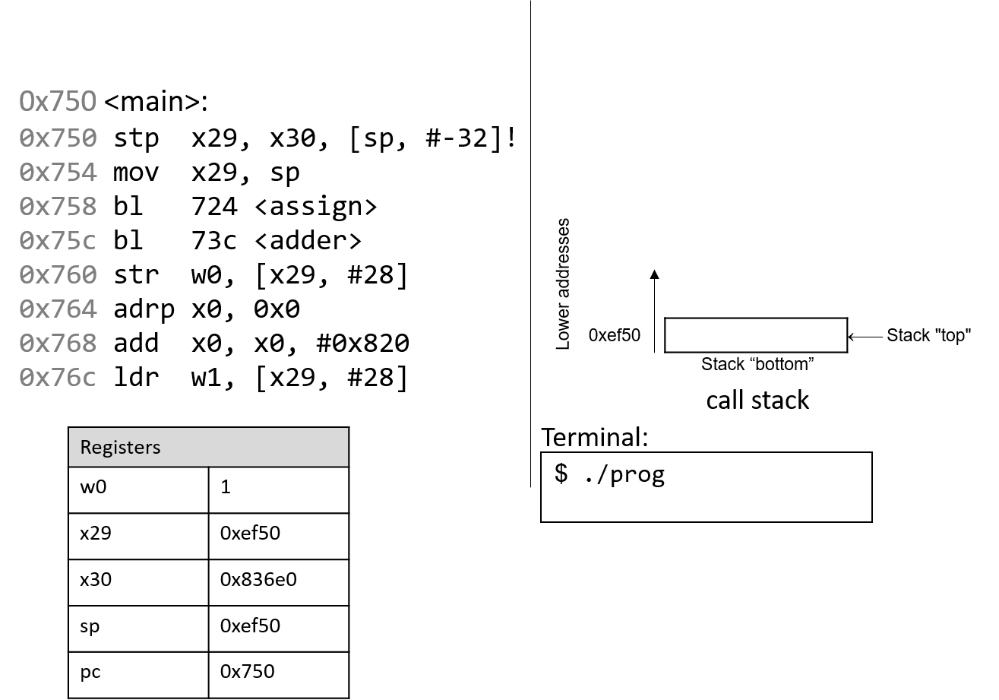
:::

::: title
Figure 3. Initial state of CPU registers and call stack prior to
executing the main function
:::
:::

::: paragraph
Recall that the stack grows toward lower addresses. In this example, the
frame and stack pointers (`x29` and `sp`) both contain address 0xef50.
Initially, `pc` is the address of the first instruction in the `main`
function, or 0x750. Registers `x30` and `w0` are also highlighted in
this example, and both contain initial junk values.
:::

------------------------------------------------------------------------

::: imageblock
::: content

:::
:::

::: paragraph
The first instruction (`stp`) is a composite instruction with two parts.
First, the second operand (`[sp, #-32]!`) decrements the stack pointer
by 32 bytes, thus allocating space for the current stack frame. After
the evaluation of the operand, the stack pointer updates to 0xef30.
Next, the `stp` instruction stores the current values of `x29` and `x30`
at locations `sp` and `sp+8`, respectively. The instruction pointer `pc`
advances to the next instruction in sequence.
:::

------------------------------------------------------------------------

::: imageblock
::: content
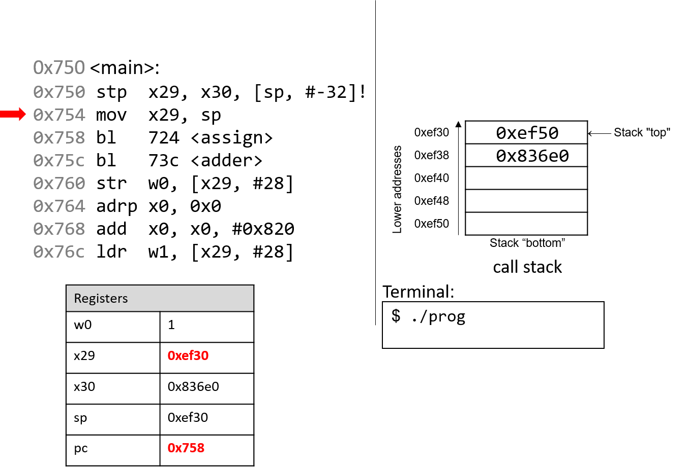
:::
:::

::: paragraph
The next instruction (`mov x29, sp`) updates the value of `x29` to be
the same as `sp`. Thus, the frame pointer (`x29`) now points to the
start of the stack frame for the `main` function. The instruction
pointer `pc` advances to the next instruction in sequence.
:::

------------------------------------------------------------------------

::: imageblock
::: content

:::
:::

::: paragraph
The first `bl` instruction stores `pc+4` (or 0x75c) in register `x30`,
which is the address in `main` at which the program will resume
executing once the `assign` function returns. Next, the register `pc` is
updated with address 0x724, which indicates the address of the first
instruction in the `assign` function.
:::

------------------------------------------------------------------------

::: imageblock
::: content
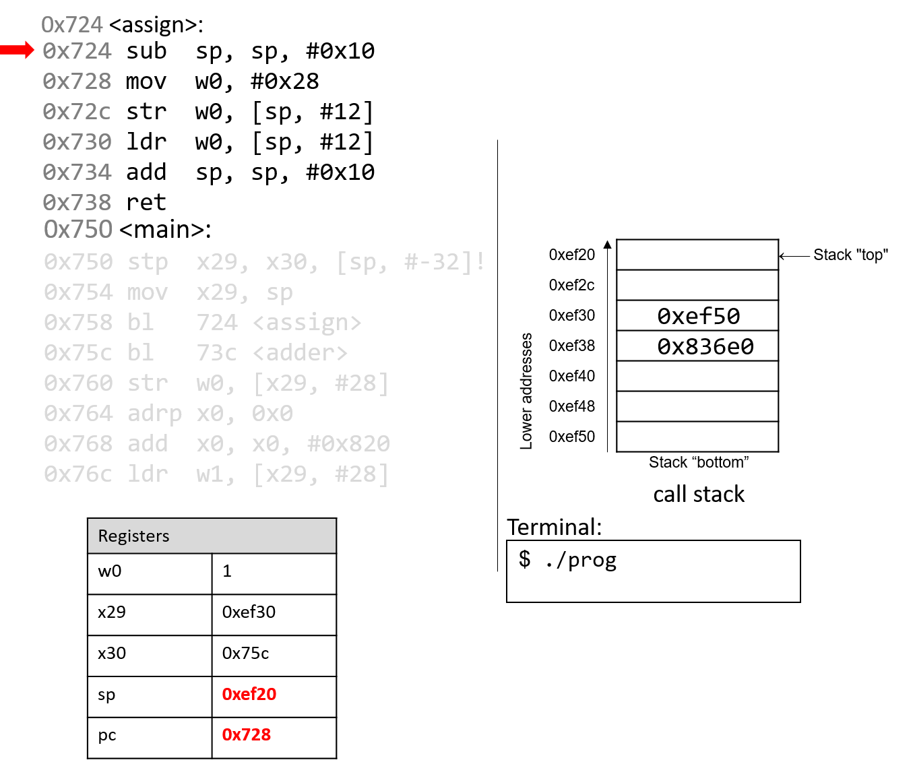
:::
:::

::: paragraph
The next instruction that executes is the first instruction in `assign`.
The `sub` instruction decrements the stack pointer by 16 bytes. Note
that `x29` and `sp` now denote the active stack frame boundaries for the
`assign` function. The program counter advances to the next instruction.
:::

------------------------------------------------------------------------

::: imageblock
::: content

:::
:::

::: paragraph
The `mov` instruction stores the constant value 0x28 in register `w0`.
Register `pc` advances to the next instruction in sequence.
:::

------------------------------------------------------------------------

::: imageblock
::: content

:::
:::

::: paragraph
The `str` instruction stores 0x28 at an offset of 12 bytes from the
stack pointer, or at address 0xef2c. The instruction pointer advances to
the next instruction.
:::

------------------------------------------------------------------------

::: imageblock
::: content

:::
:::

::: paragraph
The `ldr` instruction saves 0x28 from stack address 0xef2c into register
`w0`. The instruction pointer advances to the next instruction.
:::

------------------------------------------------------------------------

::: imageblock
::: content
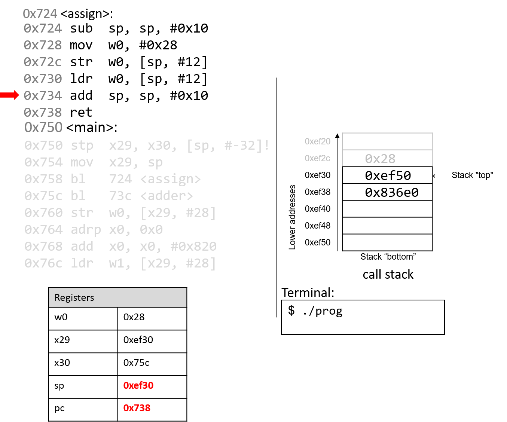
:::
:::

::: paragraph
The `add` instruction deallocates the current stack frame and reverts
`sp` to its previous value, or 0xef30.
:::

------------------------------------------------------------------------

::: imageblock
::: content

:::
:::

::: paragraph
The `ret` instruction replaces the value in `pc` with the value in
`x30`, or 0x75c. As a result, program execution returns to the first
instruction in the `main` function immediately after the call to
`assign`.
:::

------------------------------------------------------------------------

::: imageblock
::: content

:::
:::

::: paragraph
The next instruction that executes is a function call to `adder` (or
`bl 73c <adder>`). Therefore, register `x30` is updated with `pc+4`, or
0x760. The program counter is replaced with address 0x73c, signifying
that program execution continues into the `adder` function.
:::

------------------------------------------------------------------------

::: imageblock
::: content
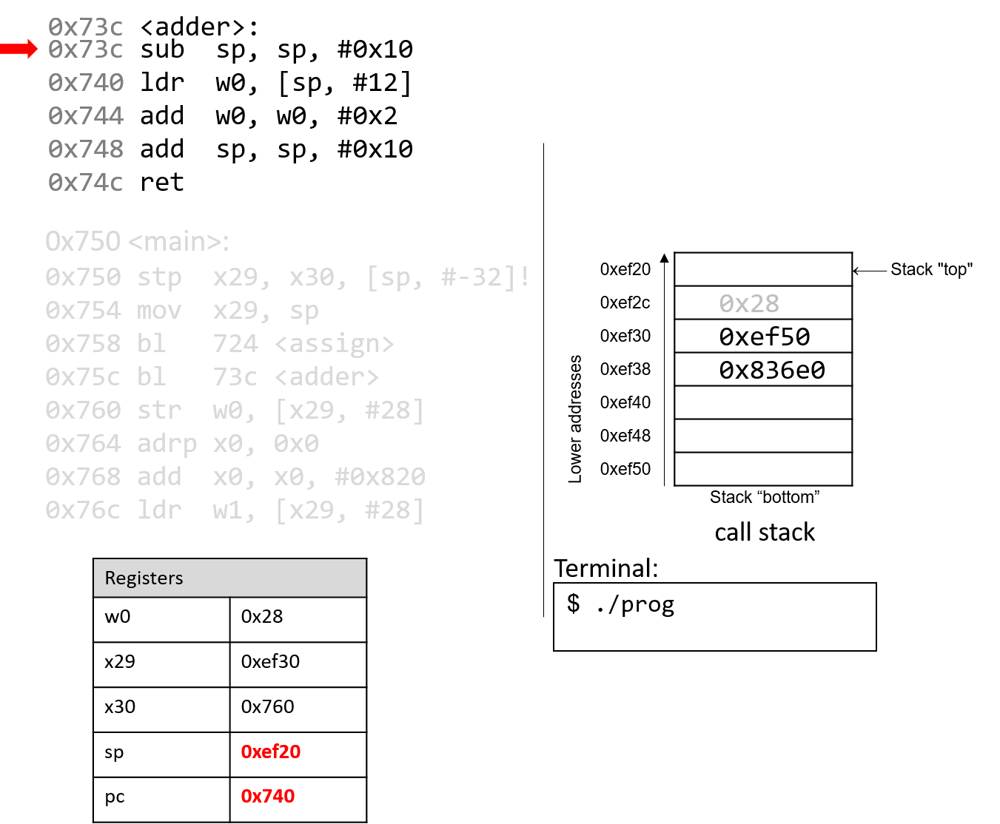
:::
:::

::: paragraph
The first instruction in the `adder` function decrements the stack
pointer by 16 bytes, allocating the new stack frame for the the `adder`
function. Note that the active stack frame boundaries for the `adder`
function are designated by registers `sp` and `x29`. The instruction
pointer advances to the next instruction in sequence.
:::

------------------------------------------------------------------------

::: imageblock
::: content
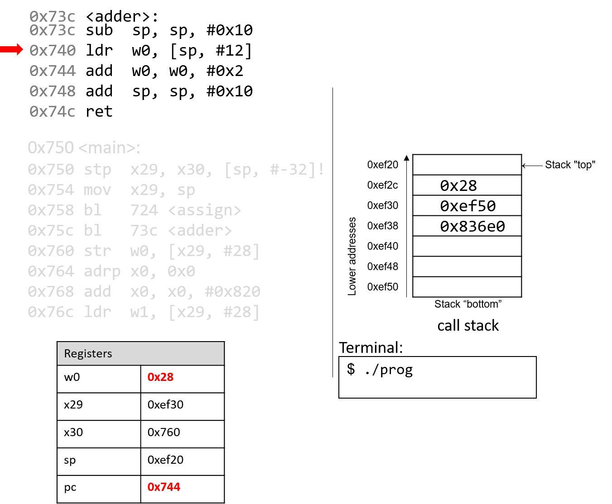
:::
:::

::: paragraph
What happens next is crucial. The `ldr` instruction loads an *old* value
from the stack (at `sp+12`) into register `w0`. This is a direct result
of the fact that the programmer forgot to initialize `a` in the `adder`
function. The instruction pointer advances to the next instruction in
sequence.
:::

------------------------------------------------------------------------

::: imageblock
::: content

:::
:::

::: paragraph
The `add` instruction then adds 0x2 to the value in `w0` and stores the
result (0x2A) in register `w0`. The instruction pointer advances to the
next instruction in sequence.
:::

------------------------------------------------------------------------

::: imageblock
::: content

:::
:::

::: paragraph
The next `add` instruction increments the stack pointer by 16 bytes,
thus destroying the active frame for `adder` and restoring `sp` to its
previous value. The instruction pointer advances to the next instruction
in sequence.
:::

------------------------------------------------------------------------

::: imageblock
::: content
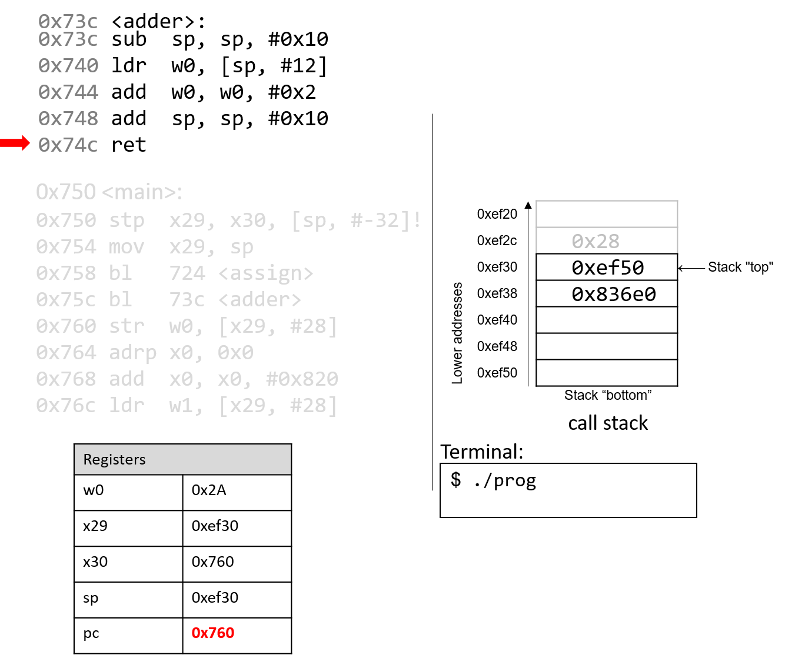
:::
:::

::: paragraph
Finally, the `ret` instruction overwrites `pc` with the address in
register `x30`, indicating that program execution should continue in the
`main` function at code segment address 0x760.
:::

------------------------------------------------------------------------

::: imageblock
::: content
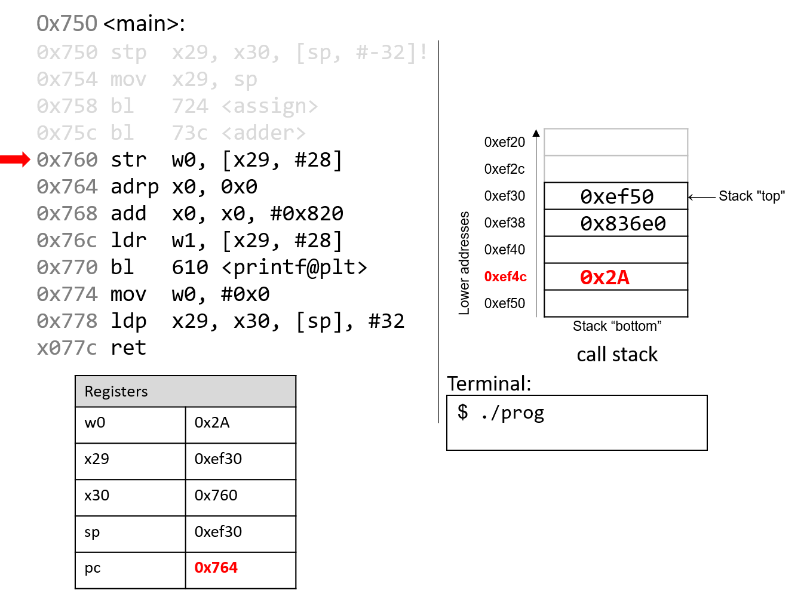
:::
:::

::: paragraph
Back in the `main()` function, the `str` instruction at program address
0x760 stores the contents of the `w0` register (0x2A) at a call stack
location that is 28 bytes from the frame pointer (`x29`). Therefore,
0x2A is stored at stack address 0xef4c.
:::

------------------------------------------------------------------------

::: imageblock
::: content
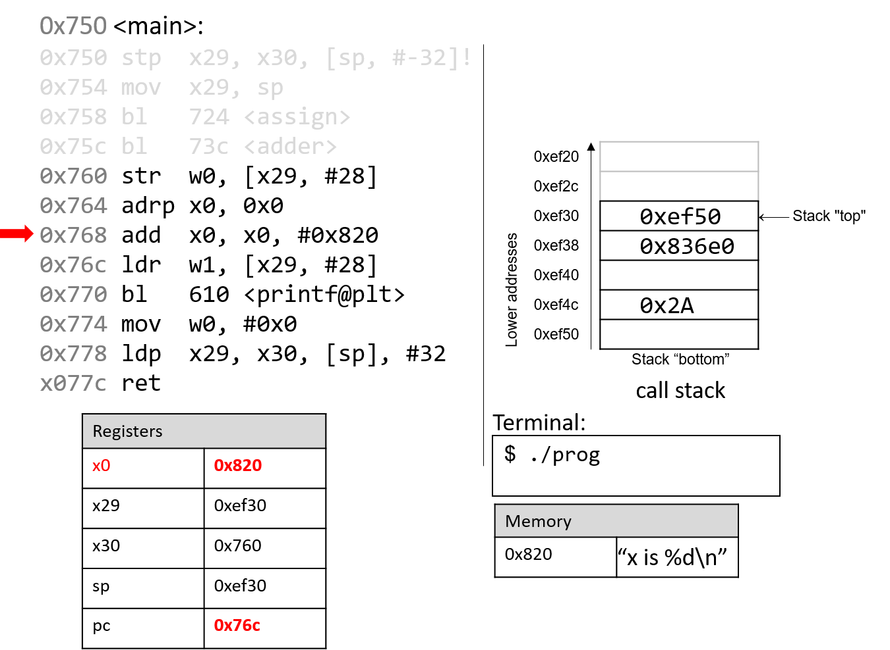
:::
:::

::: paragraph
The next two instructions together load an address of a page into
register `x0`. Since addresses are 8 bytes long, the 64-bit register
`x0` is used instead of its 32-bit component, `w0`. The `adrp`
instruction loads the address (0x0) into register `x0`, while the `add`
instruction at code segment address 0x768 adds the value 0x820 to it. At
the end of these two instructions, register `x0` contains memory address
0x820. Note that the value stored at address 0x820 is the string
`"x is %d\n"`.
:::

------------------------------------------------------------------------

::: imageblock
::: content

:::
:::

::: paragraph
Next, the `ldr` instruction at program address 0x76c loads 0x2A (which
is located at an offset of 28 bytes from the frame pointer) into
register `w1`.
:::

------------------------------------------------------------------------

::: imageblock
::: content
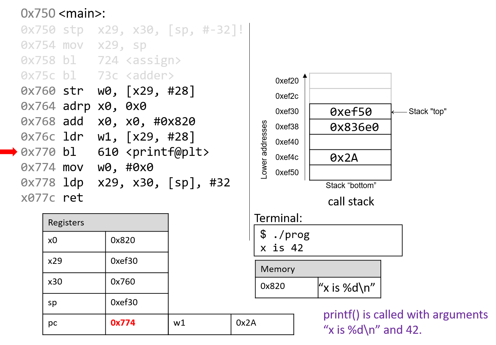
:::
:::

::: paragraph
The next instruction calls the `printf` function. For the sake of
brevity, we will not trace the `printf` function, which is part of
`stdio.h`. However, we know from the manual page (`man -s3 printf`) that
`printf` has the following format:
:::

::: listingblock
::: content
    int printf(const char * format, ...)
:::
:::

::: paragraph
In other words, the first argument is a pointer to a string specifying
the format, and the second argument onward specify the values that are
used in that format. The instructions specified by addresses 0x764 -
0x770 correspond to the following line in the `main` function:
:::

::: listingblock
::: content
``` {.highlightjs .highlight}
printf("x is %d\n", x);
```
:::
:::

::: paragraph
When the `printf` function is called:
:::

::: ulist
-   The return address (`pc+4` or 0x774) is stored in register `x30`.

-   Register `pc` switches address 0x610, which is the start of the
    `printf` function.

-   Register `sp` is updated to reflect the new stack frame for the
    `printf` function.
:::

::: paragraph
At some point, `printf` references its arguments, which are the string
`"x is %d\n"` and the value 0x2A. Recall that for any function with *n*
arguments, gcc places the first eight arguments in registers `x0`-`x7`,
and the remaining arguments onto the stack *below* the frame pointer. In
this case, the first parameter is stored in register `x0` (since it is
an address to a string), and the second parameter is stored in component
register `w1`.
:::

::: paragraph
After the call to `printf`, the value 0x2A is output to the user in
integer format. Thus, the value 42 is printed to the screen. The stack
pointer reverts to its previous value, and `pc` updates to the value
stored in register `x30`, or 0x774.
:::

------------------------------------------------------------------------

::: imageblock
::: content
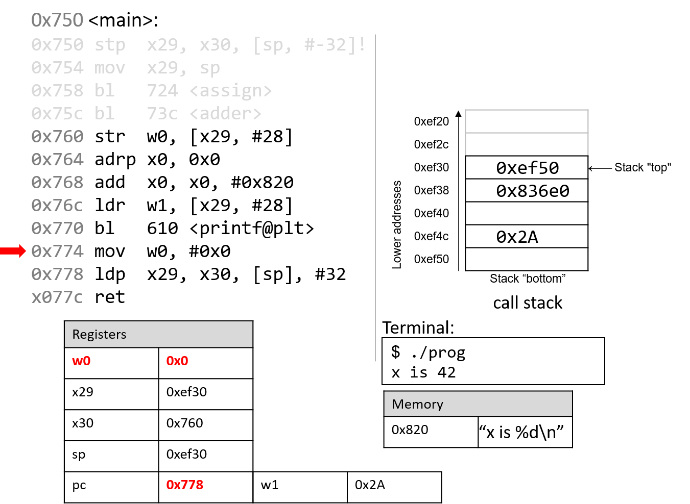
:::
:::

::: paragraph
The `mov` instructions at address 0x774 loads the constant value `#0x0`
into component register `w0`. This represents the value that will be
returned when `main` completes execution. The program counter advances
to the next instruction in sequence.
:::

------------------------------------------------------------------------

::: imageblock
::: content

:::
:::

::: paragraph
The `ldp` instruction at program address 0x778 first copies the values
at `sp` and `sp+8` into registers `x29` and `x30`, reverting them to
their original values prior to the start of the execution of the `main`
function. The last part of the `ldp` instruction (as specified by the
operand `[sp], #32`) increments the stack pointer by 32 bytes, restoring
`sp` to its original value prior to the execution of `main`. Thus, when
the `ldp` instruction completes execution, the stack pointer (`sp`),
frame pointer (`x29`), and return register (`x30`) all have returned to
their original values. The program counter advances to the last
instruction in the `main` function.
:::

------------------------------------------------------------------------

::: imageblock
::: content

:::
:::

::: paragraph
The last instruction that executes is `ret`. With 0x0 in the return
register `w0`, the program returns 0, indicating correct termination.
:::

::: paragraph
If you have carefully read through this section, you should understand
why our program prints out the value 42. In essence, the program
inadvertently uses old values on the stack to cause it to behave in a
way that we didn't expect. This example was pretty harmless; however we
discuss in future sections how hackers have misused function calls to
make programs misbehave in truly malicious ways.
:::
:::
:::
:::

::: toc-menu
:::
:::
:::
:::

Copyright (C) 2020 Dive into Systems, LLC.

*Dive into Systems,* is licensed under the Creative Commons
[Attribution-NonCommercial-NoDerivatives 4.0
International](https://creativecommons.org/licenses/by-nc-nd/4.0/) (CC
BY-NC-ND 4.0).
