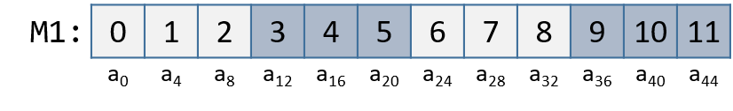

-   -   [4. Binary and Data
        Representation](../C4-Binary/index.html){.nav-link}
        -   [4.1. Number Bases and Unsigned
            Integers](../C4-Binary/bases.html){.nav-link}
        -   [4.2. Converting Between
            Bases](../C4-Binary/conversion.html){.nav-link}
        -   [4.3. Signed Binary
            Integers](../C4-Binary/signed.html){.nav-link}
        -   [4.4. Binary Integer
            Arithmetic](../C4-Binary/arithmetic.html){.nav-link}
            -   [4.4.1.
                Addition](../C4-Binary/arithmetic_addition.html){.nav-link}
            -   [4.4.2.
                Subtraction](../C4-Binary/arithmetic_subtraction.html){.nav-link}
            -   [4.4.3. Multiplication &
                Division](../C4-Binary/arithmetic_mult_div.html){.nav-link}
        -   [4.5. Overflow](../C4-Binary/overflow.html){.nav-link}
        -   [4.6. Bitwise
            Operators](../C4-Binary/bitwise.html){.nav-link}
        -   [4.7. Integer Byte
            Order](../C4-Binary/byte_order.html){.nav-link}
        -   [4.8. Real Numbers in
            Binary](../C4-Binary/floating_point.html){.nav-link}
        -   [4.9. Summary](../C4-Binary/summary.html){.nav-link}
        -   [4.10. Exercises](../C4-Binary/exercises.html){.nav-link}

-   -   [5. What von Neumann Knew: Computer
        Architecture](../C5-Arch/index.html){.nav-link}
        -   [5.1. The Origins of Modern
            Computing](../C5-Arch/hist.html){.nav-link}
        -   [5.2. The von Neumann
            Architecture](../C5-Arch/von.html){.nav-link}
        -   [5.3. Logic Gates](../C5-Arch/gates.html){.nav-link}
        -   [5.4. Circuits](../C5-Arch/circuits.html){.nav-link}
            -   [5.4.1. Arithmetic and Logic
                Circuits](../C5-Arch/arithlogiccircs.html){.nav-link}
            -   [5.4.2. Control
                Circuits](../C5-Arch/controlcircs.html){.nav-link}
            -   [5.4.3. Storage
                Circuits](../C5-Arch/storagecircs.html){.nav-link}
        -   [5.5. Building a Processor](../C5-Arch/cpu.html){.nav-link}
        -   [5.6. The Processor's Execution of Program
            Instructions](../C5-Arch/instrexec.html){.nav-link}
        -   [5.7. Pipelining Instruction
            Execution](../C5-Arch/pipelining.html){.nav-link}
        -   [5.8. Advanced Pipelining
            Considerations](../C5-Arch/pipelining_advanced.html){.nav-link}
        -   [5.9. Looking Ahead: CPUs
            Today](../C5-Arch/modern.html){.nav-link}
        -   [5.10. Summary](../C5-Arch/summary.html){.nav-link}
        -   [5.11. Exercises](../C5-Arch/exercises.html){.nav-link}

-   -   [6. Under the C: Dive into
        Assembly](../C6-asm_intro/index.html){.nav-link}

-   -   [7. 64-bit x86 Assembly](../C7-x86_64/index.html){.nav-link}
        -   [7.1. Assembly Basics](../C7-x86_64/basics.html){.nav-link}
        -   [7.2. Common
            Instructions](../C7-x86_64/common.html){.nav-link}
        -   [7.3. Additional Arithmetic
            Instructions](../C7-x86_64/arithmetic.html){.nav-link}
        -   [7.4. Conditional Control and
            Loops](../C7-x86_64/conditional_control_loops.html){.nav-link}
            -   [7.4.1.
                Preliminaries](../C7-x86_64/preliminaries.html){.nav-link}
            -   [7.4.2. If
                Statements](../C7-x86_64/if_statements.html){.nav-link}
            -   [7.4.3. Loops](../C7-x86_64/loops.html){.nav-link}
        -   [7.5. Functions in
            Assembly](../C7-x86_64/functions.html){.nav-link}
        -   [7.6. Recursion](../C7-x86_64/recursion.html){.nav-link}
        -   [7.7. Arrays in
            Assembly](../C7-x86_64/arrays.html){.nav-link}
        -   [7.8. Matrices in
            Assembly](../C7-x86_64/matrices.html){.nav-link}
        -   [7.9. Structs in
            Assembly](../C7-x86_64/structs.html){.nav-link}
        -   [7.10. Buffer
            Overflows](../C7-x86_64/buffer_overflow.html){.nav-link}
        -   [7.11. Exercises](../C7-x86_64/exercises.html){.nav-link}

-   -   [8. 32-bit x86 Assembly](../C8-IA32/index.html){.nav-link}
        -   [8.1. Assembly Basics](../C8-IA32/basics.html){.nav-link}
        -   [8.2. Common
            Instructions](../C8-IA32/common.html){.nav-link}
        -   [8.3. Additional Arithmetic
            Instructions](../C8-IA32/arithmetic.html){.nav-link}
        -   [8.4. Conditional Control and
            Loops](../C8-IA32/conditional_control_loops.html){.nav-link}
            -   [8.4.1.
                Preliminaries](../C8-IA32/preliminaries.html){.nav-link}
            -   [8.4.2. If
                Statements](../C8-IA32/if_statements.html){.nav-link}
            -   [8.4.3. Loops](../C8-IA32/loops.html){.nav-link}
        -   [8.5. Functions in
            Assembly](../C8-IA32/functions.html){.nav-link}
        -   [8.6. Recursion](../C8-IA32/recursion.html){.nav-link}
        -   [8.7. Arrays in Assembly](../C8-IA32/arrays.html){.nav-link}
        -   [8.8. Matrices in
            Assembly](../C8-IA32/matrices.html){.nav-link}
        -   [8.9. Structs in
            Assembly](../C8-IA32/structs.html){.nav-link}
        -   [8.10. Buffer
            Overflows](../C8-IA32/buffer_overflow.html){.nav-link}
        -   [8.11. Exercises](../C8-IA32/exercises.html){.nav-link}

-   -   [9. ARMv8 Assembly](index.html){.nav-link}
        -   [9.1. Assembly Basics](basics.html){.nav-link}
        -   [9.2. Common Instructions](common.html){.nav-link}
        -   [9.3. Arithmetic Instructions](arithmetic.html){.nav-link}
        -   [9.4. Conditional Control and
            Loops](conditional_control_loops.html){.nav-link}
            -   [9.4.1. Preliminaries](preliminaries.html){.nav-link}
            -   [9.4.2. If Statements](if_statements.html){.nav-link}
            -   [9.4.3. Loops](loops.html){.nav-link}
        -   [9.5. Functions in Assembly](functions.html){.nav-link}
        -   [9.6. Recursion](recursion.html){.nav-link}
        -   [9.7. Arrays in Assembly](arrays.html){.nav-link}
        -   [9.8. Matrices in Assembly](matrices.html){.nav-link}
        -   [9.9. Structs in Assembly](structs.html){.nav-link}
        -   [9.10. Buffer Overflows](buffer_overflow.html){.nav-link}
        -   [9.11. Exercises](exercises.html){.nav-link}

-   -   [10. Key Assembly
        Takeaways](../C10-asm_takeaways/index.html){.nav-link}

-   -   [11. Storage and the Memory
        Hierarchy](../C11-MemHierarchy/index.html){.nav-link}
        -   [11.1. The Memory
            Hierarchy](../C11-MemHierarchy/mem_hierarchy.html){.nav-link}
        -   [11.2. Storage
            Devices](../C11-MemHierarchy/devices.html){.nav-link}
        -   [11.3.
            Locality](../C11-MemHierarchy/locality.html){.nav-link}
        -   [11.4. Caching](../C11-MemHierarchy/caching.html){.nav-link}
        -   [11.5. Cache Analysis and
            Cachegrind](../C11-MemHierarchy/cachegrind.html){.nav-link}
        -   [11.6. Looking Ahead: Caching on Multicore
            Processors](../C11-MemHierarchy/coherency.html){.nav-link}
        -   [11.7. Summary](../C11-MemHierarchy/summary.html){.nav-link}
        -   [11.8.
            Exercises](../C11-MemHierarchy/exercises.html){.nav-link}

-   -   [12. Code Optimization](../C12-CodeOpt/index.html){.nav-link}
        -   [12.1. First Steps](../C12-CodeOpt/basic.html){.nav-link}
        -   [12.2. Other Compiler
            Optimizations](../C12-CodeOpt/loops_functions.html){.nav-link}
        -   [12.3. Memory
            Considerations](../C12-CodeOpt/memory_considerations.html){.nav-link}
        -   [12.4. Summary](../C12-CodeOpt/summary.html){.nav-link}

-   -   [13. The Operating System](../C13-OS/index.html){.nav-link}
        -   [13.1. Booting and Running](../C13-OS/impl.html){.nav-link}
        -   [13.2. Processes](../C13-OS/processes.html){.nav-link}
        -   [13.3. Virtual Memory](../C13-OS/vm.html){.nav-link}
        -   [13.4. Interprocess
            Communication](../C13-OS/ipc.html){.nav-link}
            -   [13.4.1. Signals](../C13-OS/ipc_signals.html){.nav-link}
            -   [13.4.2. Message
                Passing](../C13-OS/ipc_msging.html){.nav-link}
            -   [13.4.3. Shared
                Memory](../C13-OS/ipc_shm.html){.nav-link}
        -   [13.5. Summary and Other OS
            Functionality](../C13-OS/advanced.html){.nav-link}
        -   [13.6. Exercises](../C13-OS/exercises.html){.nav-link}

-   -   [14. Leveraging Shared Memory in the Multicore
        Era](../C14-SharedMemory/index.html){.nav-link}
        -   [14.1. Programming Multicore
            Systems](../C14-SharedMemory/multicore.html){.nav-link}
        -   [14.2. POSIX
            Threads](../C14-SharedMemory/posix.html){.nav-link}
        -   [14.3. Synchronizing
            Threads](../C14-SharedMemory/synchronization.html){.nav-link}
            -   [14.3.1. Mutual
                Exclusion](../C14-SharedMemory/mutex.html){.nav-link}
            -   [14.3.2.
                Semaphores](../C14-SharedMemory/semaphores.html){.nav-link}
            -   [14.3.3. Other Synchronization
                Constructs](../C14-SharedMemory/other_syncs.html){.nav-link}
        -   [14.4. Measuring Parallel
            Performance](../C14-SharedMemory/performance.html){.nav-link}
            -   [14.4.1. Parallel Performance
                Basics](../C14-SharedMemory/performance_basics.html){.nav-link}
            -   [14.4.2. Advanced
                Topics](../C14-SharedMemory/performance_advanced.html){.nav-link}
        -   [14.5. Cache
            Coherence](../C14-SharedMemory/cache_coherence.html){.nav-link}
        -   [14.6. Thread
            Safety](../C14-SharedMemory/thread_safety.html){.nav-link}
        -   [14.7. Implicit Threading with
            OpenMP](../C14-SharedMemory/openmp.html){.nav-link}
        -   [14.8. Summary](../C14-SharedMemory/summary.html){.nav-link}
        -   [14.9.
            Exercises](../C14-SharedMemory/exercises.html){.nav-link}

-   -   [15. Looking Ahead: Other Parallel
        Systems](../C15-Parallel/index.html){.nav-link}
        -   [15.1. Hardware Acceleration and
            CUDA](../C15-Parallel/gpu.html){.nav-link}
        -   [15.2. Distributed Memory
            Systems](../C15-Parallel/distrmem.html){.nav-link}
        -   [15.3. To Exascale and
            Beyond](../C15-Parallel/cloud.html){.nav-link}

-   -   [16. Appendix 1: Chapter 1 for Java
        Programmers](../Appendix1/index.html){.nav-link}
        -   [16.1. Getting Started Programming in
            C](../Appendix1/getting_started.html){.nav-link}
        -   [16.2. Input/Output (printf and
            scanf)](../Appendix1/input_output.html){.nav-link}
        -   [16.3. Conditionals and
            Loops](../Appendix1/conditionals.html){.nav-link}
        -   [16.4. Functions](../Appendix1/functions.html){.nav-link}
        -   [16.5. Arrays and
            Strings](../Appendix1/arrays_strings.html){.nav-link}
        -   [16.6. Structs](../Appendix1/structs.html){.nav-link}
        -   [16.7. Summary](../Appendix1/summary.html){.nav-link}
        -   [16.8. Exercises](../Appendix1/exercises.html){.nav-link}

-   -   [17. Appendix 2: Using Unix](../Appendix2/index.html){.nav-link}
        -   [17.1. Unix Command Line and the Unix File
            System](../Appendix2/cmdln_basics.html){.nav-link}
        -   [17.2. Man and the Unix
            Manual](../Appendix2/man.html){.nav-link}
        -   [17.3. Remote Access](../Appendix2/ssh_scp.html){.nav-link}
        -   [17.4. Unix Editors](../Appendix2/editors.html){.nav-link}
        -   [17.5. make and
            Makefiles](../Appendix2/makefiles.html){.nav-link}
        -   [17.6 Searching: grep and
            find](../Appendix2/grep.html){.nav-link}
        -   [17.7 File Permissions](../Appendix2/chmod.html){.nav-link}
        -   [17.8 Archiving and Compressing
            Files](../Appendix2/tar.html){.nav-link}
        -   [17.9 Process Control](../Appendix2/pskill.html){.nav-link}
        -   [17.10 Timing](../Appendix2/timing.html){.nav-link}
        -   [17.11 Command
            History](../Appendix2/history.html){.nav-link}
        -   [17.12 I/0
            Redirection](../Appendix2/ioredirect.html){.nav-link}
        -   [17.13 Pipes](../Appendix2/pipe.html){.nav-link}
        -   [17.14 Dot Files and
            .bashrc](../Appendix2/dotfiles.html){.nav-link}
        -   [17.15 Shell
            Programming](../Appendix2/shellprog.html){.nav-link}
        -   [17.16 Getting System
            Information](../Appendix2/sysinfo.html){.nav-link}


-   [Dive Into Systems](../index-2.html)
-   [9. ARMv8 Assembly](index.html)
-   [9.8. Matrices in Assembly](matrices.html)
:::

::: content
::: sect1
## [](#_matrices){.anchor}9.8. Matrices {#_matrices}

::: sectionbody
::: paragraph
A matrix is a two-dimensional (2D) array. A matrix in C can be
statically allocated as a 2D array (`M[n][m]`), dynamically allocated
with a single call to `malloc`, or dynamically allocated as an array of
arrays. Let's consider the array of arrays implementation. The first
array contains `n` elements (`M[n]`), and each element `M[i]` in our
matrix contains an array of `m` elements. The following code snippets
each declare matrices of size 4 × 3:
:::

::: listingblock
::: content
``` {.highlightjs .highlight}
//statically allocated matrix (allocated on stack)
int M1[4][3];

//dynamically allocated matrix (programmer friendly, allocated on heap)
int **M2, i;
M2 = malloc(4 * sizeof(int*));
for (i = 0; i < 4; i++) {
    M2[i] = malloc(3 * sizeof(int));
}
```
:::
:::

::: paragraph
In the case of the dynamically allocated matrix, the main array contains
a contiguous array of `int` pointers. Each integer pointer points to a
different array in memory. [Figure 1](#Matrices6a64) illustrates how we
would normally visualize each of these matrices.
:::

::: {#Matrices6a64 .imageblock .text-center}
::: content
{width="550"}
:::

::: title
Figure 1. Illustration of a statically allocated (M1) and
dynamically-allocated (M2) 3×4 matrix
:::
:::

::: paragraph
For both of the these matrix declarations, element (i,j) can be accessed
using the double-indexing syntax `M[i][j]`, where `M` is either `M1` or
`M2`. However, these matrices are organized differently in memory. Even
though both store the elements in their primary array contiguously in
memory, our statically allocated matrix also stores all the rows
contiguously in memory:
:::

::: {#Matrices7a64 .imageblock .text-center}
::: content
{width="600"}
:::

::: title
Figure 2. Matrix M1's memory layout in row-major order
:::
:::

::: paragraph
This contiguous ordering is not guaranteed for `M2`. [Recall
that](../C2-C_depth/arrays.html#_two_dimensional_array_memory_layout){.page}
to contiguously allocate an *n* × *m* matrix on the heap, we should use
a single call to `malloc` that allocates *n* × *m* elements:
:::

::: listingblock
::: content
``` {.highlightjs .highlight}
//dynamic matrix (allocated on heap, memory efficient way)
#define ROWS 4
#define COLS 3
int *M3;
M3 = malloc(ROWS*COLS*sizeof(int));
```
:::
:::

::: paragraph
Recall that with the declaration of `M3`, element (*i*,*j*) *cannot* be
accessed using the `M[i][j]` notation. Instead, we must index the
element using the format: `M3[i*cols + j]`.
:::

::: sect2
### [](#_contiguous_two_dimensional_arrays){.anchor}9.8.1. Contiguous Two-Dimensional Arrays {#_contiguous_two_dimensional_arrays}

::: paragraph
Consider a function `sumMat` that takes a pointer to a contiguously
allocated (either statically allocated or memory-efficient dynamically
allocated) matrix as its first parameter, along with a number of rows
and columns, and returns the sum of all the elements inside the matrix.
:::

::: paragraph
We use scaled indexing in the code snippet that follows because it
applies to both statically and dynamically allocated contiguous
matrices. Recall that the syntax `m[i][j]` does not work with the
memory-efficient contiguous dynamic allocation previously discussed.
:::

::: listingblock
::: content
``` {.highlightjs .highlight}
int sumMat(int *m, int rows, int cols) {
    int i, j, total = 0;
    for (i = 0; i < rows; i++){
        for (j = 0; j < cols; j++){
            total += m[i*cols + j];
        }
    }
    return total;
}
```
:::
:::

::: paragraph
Here is the corresponding assembly. Each line is annotated with its
English translation:
:::

::: listingblock
::: content
    Dump of assembler code for function sumMat:
    0x884 <+0>:   sub   sp, sp, #0x20      // grow stack by 32 bytes (new frame)
    0x888 <+4>:   str   x0, [sp, #8]       // store m in location sp + 8
    0x88c <+8>:   str   w1, [sp, #4]       // store rows in location sp + 4
    0x890 <+12>:  str   w2, [sp]           // store cols at top of stack
    0x894 <+16>:  str   wzr, [sp, #28]     // store zero at sp + 28 (total)
    0x898 <+20>:  str   wzr, [sp, #20]     // store zero at sp + 20 (i)
    0x89c <+24>:  b     0x904 <sumMat+128> // goto <sumMat+128>
    0x8a0 <+28>:  str   wzr, [sp, #24]     // store zero at sp + 24 (j)
    0x8a4 <+32>:  b     0x8e8 <sumMat+100> // goto <sumMat+100>
    0x8a8 <+36>:  ldr   w1, [sp, #20]      // w1 = i
    0x8ac <+40>:  ldr   w0, [sp]           // w0 = cols
    0x8b0 <+44>:  mul   w1, w1, w0         // w1 = cols * i
    0x8b4 <+48>:  ldr   w0, [sp, #24]      // w0 = j
    0x8b8 <+52>:  add   w0, w1, w0         // w0 = (cols * i) + j
    0x8bc <+56>:  sxtw  x0, w0             // x0 = signExtend(cols * i + j)
    0x8c0 <+60>:  lsl   x0, x0, #2         // x0 = (cols * i + j) * 4
    0x8c4 <+64>:  ldr   x1, [sp, #8]       // x1 = m
    0x8c8 <+68>:  add   x0, x1, x0         // x0 = m+(cols*i+j)*4 (or &m[i*cols+j])
    0x8cc <+72>:  ldr   w0, [x0]           // w0 = m[i*cols + j]
    0x8d0 <+76>:  ldr   w1, [sp, #28]      // w1 = total
    0x8d4 <+80>:  add   w0, w1, w0         // w0 = total + m[i*cols + j]
    0x8d8 <+84>:  str   w0, [sp, #28]      // total is now (total + m[i*cols + j])
    0x8dc <+88>:  ldr   w0, [sp, #24]      // w0  = j
    0x8e0 <+92>:  add   w0, w0, #0x1       // w0 = j + 1
    0x8e4 <+96>:  str   w0, [sp, #24]      // update j  with (j + 1)
    0x8e8 <+100>: ldr   w1, [sp, #24]      // w1 = j
    0x8ec <+104>: ldr   w0, [sp]           // w0 = cols
    0x8f0 <+108>: cmp   w1, w0             // compare j with cols
    0x8f4 <+112>: b.lt  0x8a8 <sumMat+36>  // if (j < cols) goto <sumMat+36>
    0x8f8 <+116>: ldr   w0, [sp, #20]      // w0 = i
    0x8fc <+120>: add   w0, w0, #0x1       // w0 = i + 1
    0x900 <+124>: str   w0, [sp, #20]      // update i with (i+1)
    0x904 <+128>: ldr   w1, [sp, #20]      // w1 = i
    0x908 <+132>: ldr   w0, [sp, #4]       // w0 = rows
    0x90c <+136>: cmp   w1, w0             // compare i with rows
    0x910 <+140>: b.lt  0x8a0 <sumMat+28>  // if (i < rows) goto <sumMat+28>
    0x914 <+144>: ldr   w0, [sp, #28]      // w0 = total
    0x918 <+148>: add   sp, sp, #0x20      // revert stack to prior state
    0x91c <+152>: ret                      // return (total)
:::
:::

::: paragraph
The local variables `i`, `j`, and `total` are stored at stack locations
`sp + 20`, `sp + 24` and `sp + 28`, respectively. The input parameters
`m`, `row`, and `cols` are stored at locations `sp + 8`, `sp + 4`, and
`sp` (top of stack), respectively. Using this knowledge, let's zoom in
on the component that just deals with the access of element (*i*,*j*) in
our matrix (0x8a8 to 0x8d8):
:::

::: listingblock
::: content
    0x8a8 <+36>:   ldr   w1, [sp, #20]       // w1 = i
    0x8ac <+40>:   ldr   w0, [sp]            // w0 = cols
    0x8b0 <+44>:   mul   w1, w1, w0          // w1 = cols * i
:::
:::

::: paragraph
The first set of instructions calculates the value `cols * i` and places
it in register `w1`. Recall that for some matrix called `matrix`,
`matrix+i*cols` is equivalent to `&matrix[i]`.
:::

::: listingblock
::: content
    0x8b4 <+48>:   ldr   w0, [sp, #24]       // w0 = j
    0x8b8 <+52>:   add   w0, w1, w0          // w0 = (cols * i) + j
    0x8bc <+56>:   sxtw  x0, w0              // x0 = signExtend(cols * i + j)
    0x8c0 <+60>:   lsl   x0, x0, #2          // x0 = (cols * i + j) * 4
:::
:::

::: paragraph
The next set of instructions computes `(cols*i + j) * 4`. The compiler
multiplies the index `cols * i + j` by four because each element in the
matrix is a four-byte integer, and this multiplication enables the
compiler to compute the correct offset. The `sxtw` instruction on line
`<sumMat+56>` sign-extends the contents of `w0` into a 64-bit integer,
since that value is needed for address calculation.
:::

::: paragraph
The following set of instructions adds the calculated offset to the
matrix pointer and dereferences it to yield the value of element
(*i*,*j*):
:::

::: listingblock
::: content
    0x8c4 <+64>: ldr   x1, [sp, #8]  // x1 = m
    0x8c8 <+68>: add   x0, x1, x0    // x0 = m + (cols*i + j)*4 (or &m[i*cols + j])
    0x8cc <+72>: ldr   w0, [x0]      // w0 = m[i*cols + j]
    0x8d0 <+76>: ldr   w1, [sp, #28] // w1 = total
    0x8d4 <+80>: add   w0, w1, w0    // w0 = total + m[i*cols + j]
    0x8d8 <+84>: str   w0, [sp, #28] // update total with (total + m[i*cols + j])
:::
:::

::: paragraph
The first instruction loads the address of matrix `m` into register
`x1`. The `add` instruction adds `(cols * i + j) * 4` to the address of
`m` to correctly calculate the offset of element (*i*,*j*) and then
places the result in register `x0`. The third instruction dereferences
the address in `x0` and places the value (`m[i * cols + j]`) into `w0`.
Notice the use of `w0` as the destination component register; since our
matrix contains integers, and integers take up four bytes of space,
component register `w0` is again used instead of `x0`.
:::

::: paragraph
The last three instructions load the current value of `total` into
register `w1`, add `total` with `m[i * cols + j]`, and then update
`total` with the resulting sum.
:::

::: paragraph
Let's consider how element (1,2) is accessed in matrix M1 (figure
reproduced below).
:::

::: {.imageblock .text-center}
::: content
{width="600"}
:::

::: title
Figure 3. Matrix M1's memory layout in row-major order
:::
:::

::: paragraph
Element (1,2) is located at address `M1 + 1 * cols + 2`. Since `cols` =
3, element (1,2) corresponds to `M1 + 5`. To access the element at this
location, the compiler must multiply 5 by the size of the `int` data
type (four bytes), yielding the offset `M1 + 20`, which corresponds to
byte a~20~ in the figure. Dereferencing this location yields element 5,
which is indeed element (1,2) in the matrix.
:::
:::

::: sect2
### [](#_noncontiguous_matrix){.anchor}9.8.2. Noncontiguous Matrix {#_noncontiguous_matrix}

::: paragraph
The noncontiguous matrix implementation is a bit more complicated.
[Figure 4](#DynamicMatrix6a64) visualizes how `M2` may be laid out in
memory.
:::

::: {#DynamicMatrix6a64 .imageblock .text-center}
::: content
{width="650"}
:::

::: title
Figure 4. Matrix M2's noncontiguous layout in memory
:::
:::

::: paragraph
Notice that the array of pointers in `M2` is contiguous, and that each
array pointed to by some element of `M2` (e.g., `M2[i]`) is contiguous.
However, the individual arrays are not contiguous with one another.
Since `M2` is an array of pointers, each element of `M2` takes eight
bytes of space. In contrast, because each `M2[i]` is an `int` array, the
elements of every `M2[i]` array are four bytes apart.
:::

::: paragraph
The `sumMatrix` function in the follow example takes an array of integer
pointers (called `matrix`) as its first parameter, and a number of rows
and columns as its second and third parameters:
:::

::: listingblock
::: content
``` {.highlightjs .highlight}
int sumMatrix(int **matrix, int rows, int cols) {
    int i, j, total=0;
    for (i = 0; i < rows; i++) {
        for (j = 0; j < cols; j++) {
            total += matrix[i][j];
        }
    }
    return total;
}
```
:::
:::

::: paragraph
Even though this function looks nearly identical to the `sumMat`
function shown earlier, the matrix accepted by this function consists of
a contiguous array of *pointers*. Each pointer contains the address of a
separate contiguous array, which corresponds to a separate row in the
matrix.
:::

::: paragraph
The corresponding assembly for `sumMatrix` follows. Each line is
annotated with its English translation.
:::

::: listingblock
::: content
    Dump of assembler code for function sumMatrix:
    0x920 <+0>:   sub   sp, sp, #0x20         // grow stack 32 bytes (new frame)
    0x924 <+4>:   str   x0, [sp, #8]          // store matrix at sp + 8
    0x928 <+8>:   str   w1, [sp, #4]          // store rows at sp + 4
    0x92c <+12>:  str   w2, [sp]              // store cols at sp (top of stack)
    0x930 <+16>:  str   wzr, [sp, #28]        // store 0 at sp + 28 (total)
    0x934 <+20>:  str   wzr, [sp, #20]        // store 0 at sp + 20 (i)
    0x938 <+24>:  b     0x99c <sumMatrix+124> // goto <sumMatrix+124>
    0x93c <+28>:  str   wzr, [sp, #24]        // store 0 at sp + 24 (j)
    0x940 <+32>:  b     0x980 <sumMatrix+96>  // goto <sumMatrix+96>
    0x944 <+36>:  ldrsw x0, [sp, #20]         // x0 = signExtend(i)
    0x948 <+40>:  lsl   x0, x0, #3            // x0 = i << 3 (or i * 8)
    0x94c <+44>:  ldr   x1, [sp, #8]          // x1 = matrix
    0x950 <+48>:  add   x0, x1, x0            // x0 = matrix + i * 8
    0x954 <+52>:  ldr   x1, [x0]              // x1 = matrix[i]
    0x958 <+56>:  ldrsw x0, [sp, #24]         // x0 = signExtend(j)
    0x95c <+60>:  lsl   x0, x0, #2            // x0 = j << 2 (or j * 4)
    0x960 <+64>:  add   x0, x1, x0            // x0 = matrix[i] + j * 4
    0x964 <+68>:  ldr   w0, [x0]              // w0 = matrix[i][j]
    0x968 <+72>:  ldr   w1, [sp, #28]         // w1 = total
    0x96c <+76>:  add   w0, w1, w0            // w0 = total + matrix[i][j]
    0x970 <+80>:  str   w0, [sp, #28]         // store total = total+matrix[i][j]
    0x974 <+84>:  ldr   w0, [sp, #24]         // w0 = j
    0x978 <+88>:  add   w0, w0, #0x1          // w0 = j + 1
    0x97c <+92>:  str   w0, [sp, #24]         // update j with (j + 1)
    0x980 <+96>:  ldr   w1, [sp, #24]         // w1 = j
    0x984 <+100>: ldr   w0, [sp]              // w0 = cols
    0x988 <+104>: cmp   w1, w0                // compare j with cols
    0x98c <+108>: b.lt  0x944 <sumMatrix+36>  // if (j < cols) goto <sumMatrix+36>
    0x990 <+112>: ldr   w0, [sp, #20]         // w0 = i
    0x994 <+116>: add   w0, w0, #0x1          // w0 = i + 1
    0x998 <+120>: str   w0, [sp, #20]         // update i with (i + 1)
    0x99c <+124>: ldr   w1, [sp, #20]         // w1 = i
    0x9a0 <+128>: ldr   w0, [sp, #4]          // w0 = rows
    0x9a4 <+132>: cmp   w1, w0                // compare i with rows
    0x9a8 <+136>: b.lt  0x93c <sumMatrix+28>  // if (i < rows) goto <sumMatrix+28>
    0x9ac <+140>: ldr   w0, [sp, #28]         // w0 = total
    0x9b0 <+144>: add   sp, sp, #0x20         // revert stack to its original form
    0x9b4 <+148>: ret                         // return (total)
:::
:::

::: paragraph
Again, variables `i`, `j`, and `total` are at stack addresses `sp 20`,
`sp + 24`, and `sp + 28`, respectively. The input parameters `matrix`,
`row`, and `cols` are located at stack addresses `sp + 8`, `sp + 4`, and
`sp` (top of stack), respectively. Let's zoom in on the section that
deals specifically with an access to element (*i*, *j*), or
`matrix[i][j]`, which is between instructions 0x944 and 0x970:
:::

::: listingblock
::: content
    0x944 <+36>:   ldrsw  x0, [sp, #20]          // x0 = signExtend(i)
    0x948 <+40>:   lsl    x0, x0, #3             // x0 = i << 3 (or i * 8)
    0x94c <+44>:   ldr    x1, [sp, #8]           // x1 = matrix
    0x950 <+48>:   add    x0, x1, x0             // x0 = matrix + i * 8
    0x954 <+52>:   ldr    x1, [x0]               // x1 = matrix[i]
:::
:::

::: paragraph
The five instructions in this example compute `matrix[i]`, or
`*(matrix+i)`. Since `matrix[i]` contains a pointer, `i` is first
converted to a 64-bit integer. Then, the compiler multiplies `i` by
eight by using a shift operation, and then adds the result to `matrix`
to yield the correct address offset (recall that pointers are eight
bytes in size). The instruction at `<sumMatrix+52>` then dereferences
the calculated address to get the element `matrix[i]`.
:::

::: paragraph
Since `matrix` is an array of `int` pointers, the element located at
`matrix[i]` is itself an `int` pointer. The *j*^th^ element in
`matrix[i]` is located at offset `j × 4` in the `matrix[i]` array.
:::

::: paragraph
The next set of instructions extract the *j*^th^ element in array
`matrix[i]`:
:::

::: listingblock
::: content
    0x958 <+56>:   ldrsw  x0, [sp, #24]     // x0 = signExtend(j)
    0x95c <+60>:   lsl    x0, x0, #2        // x0 = j << 2 (or j * 4)
    0x960 <+64>:   add    x0, x1, x0        // x0 = matrix[i] + j * 4
    0x964 <+68>:   ldr    w0, [x0]          // w0 = matrix[i][j]
    0x968 <+72>:   ldr    w1, [sp, #28]     // w1 = total
    0x96c <+76>:   add    w0, w1, w0        // w0 = total + matrix[i][j]
    0x970 <+80>:   str    w0, [sp, #28]     // store total = total + matrix[i][j]
:::
:::

::: paragraph
The first instruction in this snippet loads variable `j` into register
`x0`, sign-extending it in the process. The compiler then uses the left
shift (`lsl`) instruction to multiply `j` by four and stores the result
in register `x0`. The compiler finally adds the resulting value to the
address located in `matrix[i]` to get the address of element
`matrix[i][j]`, or `&matrix[i][j]`. The instruction at `<sumMatrix+68>`
then dereferences the address to get the *value* at `matrix[i][j]`,
which is then stored in register `w0`. Lastly, the instructions from
`<sumMatrix+72>` through `<sumMatrix+80>` add `total` to `matrix[i][j]`
and update the variable `total` with the resulting sum.
:::

::: paragraph
Let's consider an example access to `M2[1][2]` (figure reproduced
below).
:::

::: {#DynamicMatrix6a64repro .imageblock .text-center}
::: content
{width="650"}
:::
:::

::: paragraph
Note that `M2` starts at memory location a~0~. The compiler first
computes the address of `M2[1]` by multiplying 1 by 8 (`sizeof(int *)`)
and adding it to the address of `M2` (a~0~), yielding the new address
a~8~. A dereference of this address yields the address associated with
`M2[1]`, or a~36~. The compiler then multiplies index 2 by 4
(`sizeof(int)`), and adds the result (8) to a~36~, yielding a final
address of a~44~. The address a~44~ is dereferenced, yielding the value
5. Sure enough, the element in
[\[DynamicMatrix6a64repro\]](#DynamicMatrix6a64repro) that corresponds
to `M2[1][2]` has the value 5.
:::
:::
:::
:::

::: toc-menu
:::
:::
:::
:::

Copyright (C) 2020 Dive into Systems, LLC.

*Dive into Systems,* is licensed under the Creative Commons
[Attribution-NonCommercial-NoDerivatives 4.0
International](https://creativecommons.org/licenses/by-nc-nd/4.0/) (CC
BY-NC-ND 4.0).
