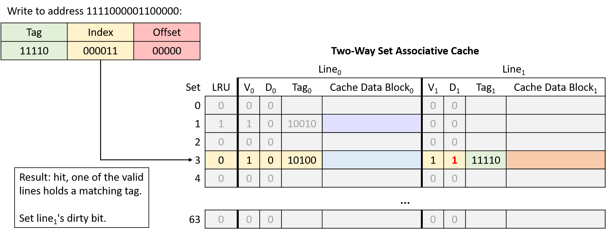

## 11.4. CPU Caches

Sau khi đã [phân loại các thiết bị lưu trữ](devices.html#_storage_devices) và nhận ra các mẫu quan trọng của [temporal locality và spatial locality](locality.html#_locality), giờ chúng ta sẵn sàng tìm hiểu cách CPU cache được thiết kế và triển khai.  
**Cache** là một thiết bị lưu trữ nhỏ, tốc độ cao nằm trên CPU, chứa một tập con giới hạn của dữ liệu từ bộ nhớ chính (main memory).  
Cache phải đối mặt với một số câu hỏi thiết kế quan trọng:

- **Nên chứa** tập con nào của bộ nhớ chương trình?
- **Khi nào** cache nên sao chép một phần dữ liệu từ bộ nhớ chính vào cache, hoặc ngược lại?
- **Làm thế nào** hệ thống xác định được dữ liệu của chương trình có đang nằm trong cache hay không?

---

Trước khi đi sâu vào các câu hỏi này, chúng ta cần giới thiệu một số hành vi và thuật ngữ liên quan đến cache.  
Hãy nhớ rằng khi truy cập dữ liệu trong bộ nhớ, chương trình trước tiên sẽ [tính toán địa chỉ bộ nhớ của dữ liệu](../C8-IA32/basics.html#_instruction_structure).  
Lý tưởng nhất là dữ liệu tại địa chỉ mong muốn đã có sẵn trong cache, cho phép chương trình bỏ qua việc truy cập bộ nhớ chính.  
Để tối đa hóa hiệu năng, phần cứng sẽ đồng thời gửi địa chỉ cần truy cập tới **cả cache và bộ nhớ chính**.  
Vì cache nhanh hơn và gần ALU hơn, nó sẽ phản hồi nhanh hơn nhiều so với bộ nhớ chính.  
Nếu dữ liệu có trong cache (**cache hit**), phần cứng cache sẽ hủy yêu cầu truy cập bộ nhớ đang chờ, vì cache có thể cung cấp dữ liệu nhanh hơn.

Ngược lại, nếu dữ liệu không có trong cache (**cache miss**), CPU buộc phải chờ bộ nhớ chính trả về dữ liệu.  
Điểm quan trọng là khi yêu cầu tới bộ nhớ chính hoàn tất, CPU sẽ nạp dữ liệu vừa lấy được vào cache để các yêu cầu tiếp theo tới cùng địa chỉ đó (rất có khả năng xảy ra nhờ **temporal locality**) có thể được phục vụ nhanh chóng từ cache.  
Ngay cả khi thao tác bộ nhớ gây ra miss là **ghi** dữ liệu, CPU vẫn nạp giá trị đó vào cache, vì nhiều khả năng chương trình sẽ truy cập lại vị trí này trong tương lai.

Khi nạp dữ liệu vào cache sau một lần miss, CPU thường thấy cache không còn đủ chỗ trống.  
Trong trường hợp này, cache phải **evict** (loại bỏ) một số dữ liệu đang có để nhường chỗ cho dữ liệu mới.  
Vì cache lưu các bản sao dữ liệu từ bộ nhớ chính, nếu dữ liệu bị loại bỏ đã bị sửa đổi, cache phải ghi lại nội dung đó về bộ nhớ chính trước khi xóa nó khỏi cache.

Để cung cấp đầy đủ các chức năng trên, các nhà thiết kế cache thường áp dụng một trong ba kiến trúc.  
Phần này bắt đầu với *direct-mapped cache*, loại đơn giản hơn so với các thiết kế khác.

---

### 11.4.1. Direct-Mapped Caches

Một **direct-mapped cache** chia không gian lưu trữ của nó thành các đơn vị gọi là **cache line**.  
Tùy vào kích thước, cache có thể chứa hàng chục, hàng trăm hoặc thậm chí hàng nghìn cache line.  
Trong direct-mapped cache, mỗi cache line độc lập với các line khác và chứa hai loại thông tin quan trọng: **cache data block** và **metadata**.

1. **Cache data block** (thường gọi tắt là **cache block**) lưu một tập con dữ liệu chương trình từ bộ nhớ chính.  
   Cache block lưu các khối dữ liệu nhiều byte để tận dụng [spatial locality](locality.html#_spatial_locality).  
   Kích thước cache block quyết định đơn vị dữ liệu được truyền giữa cache và bộ nhớ chính.  
   Nghĩa là, khi nạp dữ liệu từ bộ nhớ vào cache, cache luôn nhận một khối dữ liệu có kích thước bằng cache block.

   Các nhà thiết kế cache phải cân bằng giữa hai yếu tố khi chọn kích thước block.  
   Với dung lượng lưu trữ cố định, cache có thể chứa nhiều block nhỏ hơn hoặc ít block lớn hơn.  
   Block lớn giúp cải thiện hiệu năng cho các chương trình có spatial locality tốt, trong khi nhiều block hơn cho phép cache lưu trữ đa dạng hơn các vùng bộ nhớ.  
   Chiến lược nào tốt hơn phụ thuộc vào đặc thù tải công việc của ứng dụng.  
   Vì CPU đa dụng không thể giả định trước về ứng dụng, cache của CPU hiện đại thường chọn kích thước block trung bình, khoảng 16–64 byte.

2. **Metadata** lưu thông tin về nội dung của cache block.  
   Metadata **không** chứa dữ liệu chương trình, mà lưu thông tin quản lý cho cache line (ví dụ: giúp xác định cache block này chứa phần nào của bộ nhớ).

---

Khi chương trình cố truy cập một địa chỉ bộ nhớ, cache cần biết phải tìm ở đâu để lấy dữ liệu tương ứng, kiểm tra xem dữ liệu có sẵn ở vị trí đó trong cache hay không, và nếu có thì trả về phần dữ liệu cần thiết cho ứng dụng.  
Quy trình này gồm các bước sau.

#### Xác định vị trí dữ liệu trong cache

Cache phải nhanh chóng xác định xem tập con bộ nhớ tương ứng với địa chỉ yêu cầu có đang nằm trong cache hay không.  
Để làm điều này, cache trước tiên phải xác định cache line cần kiểm tra.  
Trong direct-mapped cache, **mỗi địa chỉ bộ nhớ ánh xạ tới đúng một cache line duy nhất**.  
Điều này giải thích tên gọi *direct-mapped* — ánh xạ trực tiếp mỗi địa chỉ bộ nhớ tới một cache line.

---

**Hình 1** minh họa cách các địa chỉ bộ nhớ ánh xạ tới cache line trong một direct-mapped cache nhỏ có 4 cache line và kích thước cache block là 32 byte.  
Hãy nhớ rằng kích thước block của cache là đơn vị truyền dữ liệu nhỏ nhất giữa cache và bộ nhớ chính.  
Do đó, mỗi địa chỉ bộ nhớ thuộc về một khoảng 32 byte, và mỗi khoảng này ánh xạ tới một cache line.

  

**Hình 1.** Ví dụ ánh xạ địa chỉ bộ nhớ tới cache line trong direct-mapped cache 4 line với cache block 32 byte.

---

Lưu ý rằng mặc dù mỗi vùng bộ nhớ chỉ ánh xạ tới một cache line, nhưng nhiều vùng bộ nhớ khác nhau có thể ánh xạ tới **cùng một** cache line.  
Tất cả các vùng bộ nhớ ánh xạ tới cùng một cache line (tức các khối cùng màu trong Hình 1) sẽ cạnh tranh không gian trong line đó, nên tại một thời điểm chỉ một vùng của mỗi màu có thể nằm trong cache.

Cache ánh xạ một địa chỉ bộ nhớ tới cache line bằng cách sử dụng một phần bit trong địa chỉ bộ nhớ.  
Để phân bố dữ liệu đồng đều hơn giữa các cache line, cache sử dụng các bit ở **giữa** địa chỉ bộ nhớ, gọi là **index** của địa chỉ, để xác định line mà địa chỉ đó ánh xạ tới.  
Số bit dùng làm index (thay đổi tùy thiết kế) quyết định số lượng line mà cache có thể chứa.  
[Hình 2](#FigAddressIndex) minh họa phần index của một địa chỉ bộ nhớ trỏ tới một cache line.

**Hình 2.** Phần *index* ở giữa của một địa chỉ bộ nhớ xác định một cache line.

---

Việc sử dụng các bit ở giữa địa chỉ giúp giảm cạnh tranh cho cùng một cache line khi dữ liệu chương trình được lưu trữ gần nhau — điều này thường xảy ra với các chương trình có **locality** tốt.  
Nói cách khác, các chương trình thường lưu các biến gần nhau trong một vài vùng bộ nhớ nhất định (ví dụ: trên stack hoặc heap).  
Những biến được lưu gần nhau này sẽ có cùng các bit bậc cao (high-order bits) trong địa chỉ.  
Nếu dùng các bit bậc cao để làm index, tất cả các biến này sẽ ánh xạ tới cùng một nhóm cache line, khiến phần còn lại của cache không được sử dụng.  
Bằng cách dùng các bit ở giữa địa chỉ, cache có thể phân bổ dữ liệu đồng đều hơn giữa các cache line hiện có.

---

### Xác định nội dung của Cache

Sau khi đã xác định được cache line phù hợp, cache cần biết liệu line đó có chứa địa chỉ được yêu cầu hay không.  
Vì nhiều vùng bộ nhớ khác nhau có thể ánh xạ tới cùng một cache line, cache sẽ kiểm tra **metadata** của line để trả lời hai câu hỏi quan trọng:  
- *Cache line này có chứa một tập con hợp lệ của bộ nhớ không?*  
- *Nếu có, trong số nhiều tập con ánh xạ tới cache line này, nó hiện đang chứa tập con nào?*

Để trả lời, metadata của mỗi cache line sẽ bao gồm **valid bit** và **tag**:

- **Valid bit**: là một bit cho biết line hiện có đang lưu một tập con hợp lệ của bộ nhớ hay không (valid = 1 nghĩa là hợp lệ).  
  Một line không hợp lệ (valid = 0) sẽ không bao giờ tạo ra cache hit vì chưa có dữ liệu nào được nạp vào.  
  Các line không hợp lệ thực chất là vùng trống trong cache.

- **Tag**: xác định duy nhất tập con bộ nhớ mà cache block trong line đang lưu.  
  Tag lưu các bit bậc cao của dải địa chỉ được lưu trong cache line, cho phép cache biết dữ liệu này đến từ đâu trong bộ nhớ.  
  Vì nhiều tập con bộ nhớ có thể ánh xạ tới cùng một cache line (có cùng index bits), tag sẽ ghi lại tập con nào hiện đang có mặt.

Để một lần tra cứu cache tạo ra **hit**, tag lưu trong cache line phải **khớp chính xác** với phần tag (các bit bậc cao) của địa chỉ bộ nhớ được yêu cầu.  
Nếu tag không khớp, nghĩa là cache block trong line đó không chứa dữ liệu cần tìm, ngay cả khi line đang hợp lệ.

**Hình 3** minh họa cách cache chia một địa chỉ bộ nhớ thành **tag** và **index**, dùng index bits để chọn cache line, kiểm tra valid bit, và so sánh tag.

  
**Hình 3.** Sau khi dùng index bits của địa chỉ để tìm cache line, cache đồng thời kiểm tra valid bit và so sánh tag của line với tag của địa chỉ yêu cầu. Nếu line hợp lệ và tag khớp, đây là một cache hit.

---

### Truy xuất dữ liệu từ Cache

Cuối cùng, sau khi tìm được cache line phù hợp và xác nhận line đó chứa một tập con hợp lệ của bộ nhớ bao gồm địa chỉ yêu cầu, cache sẽ gửi dữ liệu tới các thành phần CPU cần nó.  
Vì kích thước cache block (ví dụ: 64 byte) thường lớn hơn nhiều so với lượng dữ liệu chương trình yêu cầu (ví dụ: 4 byte), cache sẽ dùng các bit bậc thấp của địa chỉ làm **offset** để xác định vị trí byte cần lấy trong cache block.

**Hình 4** minh họa cách phần offset của địa chỉ xác định byte nào trong cache block sẽ được truy xuất.

  
**Hình 4.** Với một cache block, phần offset của địa chỉ xác định byte mà chương trình muốn lấy.

---

### Chia nhỏ địa chỉ bộ nhớ

**Kích thước** (dimensions) của cache quyết định số bit được dùng cho **offset**, **index** và **tag** trong một địa chỉ bộ nhớ.  
Ngược lại, số bit của mỗi phần trong địa chỉ cũng cho biết kích thước cache phải như thế nào.  
Khi xác định bit nào thuộc phần nào, ta thường xét địa chỉ từ phải sang trái (từ bit ít quan trọng nhất đến bit quan trọng nhất).

- **Offset**: phần ngoài cùng bên phải của địa chỉ, độ dài phụ thuộc vào kích thước cache block.  
  Offset phải đủ bit để tham chiếu tới mọi byte trong một cache block.  
  Ví dụ: nếu cache block là 32 byte, cần 5 bit offset (vì log₂32 = 5) để xác định chính xác byte nào trong block.  
  Ngược lại, nếu offset là 4 bit, cache block sẽ có kích thước 16 byte (2⁴ = 16).

- **Index**: nằm ngay bên trái offset.  
  Số bit index phụ thuộc vào số lượng cache line, vì index phải đủ để xác định duy nhất từng line.  
  Ví dụ: cache có 1.024 line cần 10 bit index (log₂1024 = 10).  
  Nếu index là 12 bit, cache sẽ có 4.096 line (2¹² = 4.096).

  
**Hình 5.** Index xác định duy nhất một cache line, offset xác định vị trí byte trong cache block.

- **Tag**: phần còn lại của địa chỉ.  
  Tag phải đủ để xác định duy nhất tập con bộ nhớ trong cache line.  
  Ví dụ: với địa chỉ 32-bit, cache có 5 bit offset và 10 bit index thì tag sẽ chiếm 17 bit còn lại (32 - 15 = 17).

---

### Ví dụ đọc trong Direct-Mapped Cache

Xét một CPU có các đặc điểm:

- Địa chỉ bộ nhớ 16-bit  
- Direct-mapped cache với 128 cache line  
- Cache block 32 byte

Cache ban đầu trống (tất cả line đều invalid), như **Hình 6**.

  
**Hình 6.** Ví dụ cache direct-mapped trống

Giả sử chương trình truy cập các địa chỉ:

1. Đọc từ `1010000001100100`  
2. Đọc từ `1010000001100111`  
3. Đọc từ `1001000000100000`  
4. Đọc từ `1111000001100101`

---

Để lần theo toàn bộ chuỗi truy cập, thực hiện các bước:

1. Chia địa chỉ thành 3 phần từ phải sang trái: **offset** trong cache block, **index** của cache line, và **tag** để xác định tập con bộ nhớ.  
2. Dùng phần index để tìm cache line mà địa chỉ ánh xạ tới.  
3. Kiểm tra valid bit của line. Nếu invalid → cache miss, bất kể tag là gì.  
4. Kiểm tra tag. Nếu tag khớp và line hợp lệ → cache hit. Nếu không → cache miss và phải nạp dữ liệu từ bộ nhớ chính vào line đó.  
5. Nếu hit, dùng offset để lấy đúng byte dữ liệu từ cache block (bước này không minh họa trong ví dụ).

##### Chia nhỏ địa chỉ (Address Division)

Bắt đầu bằng việc xác định cách chia địa chỉ bộ nhớ thành ba phần: *offset*, *index* và *tag*.  
Xét các phần của địa chỉ từ bit bậc thấp đến bit bậc cao (từ phải sang trái):

- **Offset**: Kích thước block là 32 byte nghĩa là 5 bit ngoài cùng bên phải của địa chỉ (log₂ 32 = 5) tạo thành phần offset. Với 5 bit, offset có thể xác định duy nhất bất kỳ byte nào trong 32 byte của block.

- **Index**: Cache có 128 line nghĩa là 7 bit tiếp theo của địa chỉ (log₂ 128 = 7) tạo thành phần index. Với 7 bit, index có thể xác định duy nhất từng cache line.

- **Tag**: Tag bao gồm tất cả các bit còn lại của địa chỉ không thuộc offset hoặc index. Ở đây, địa chỉ còn lại 4 bit tạo thành tag (16 - (5 + 7) = 4).

---

  
**Hình 7.** Đọc từ địa chỉ `1010000001100100`. Index `0000011` (line 3) không hợp lệ, nên yêu cầu bị miss và cache nạp dữ liệu từ bộ nhớ chính.

---

  
**Hình 8.** Đọc từ địa chỉ `1010000001100111`. Index `0000011` (line 3) hợp lệ và tag (`1010`) khớp, nên yêu cầu hit. Cache trả về dữ liệu bắt đầu tại byte 7 (offset `0b00111`) của block dữ liệu.

---

  
**Hình 9.** Đọc từ địa chỉ `1001000000100000`. Index `0000001` (line 1) không hợp lệ, nên yêu cầu bị miss và cache nạp dữ liệu từ bộ nhớ chính.

---

  
**Hình 10.** Đọc từ địa chỉ `1111000001100101`. Index `0000011` (line 3) hợp lệ nhưng tag không khớp, nên yêu cầu bị miss và cache nạp dữ liệu từ bộ nhớ chính.

---

#### Ghi dữ liệu vào Cache (Writing to Cached Data)

Cho đến giờ, phần này chủ yếu xét các thao tác đọc bộ nhớ, khi CPU tra cứu dữ liệu trong cache.  
Cache cũng phải cho phép chương trình ghi dữ liệu, và hỗ trợ thao tác ghi theo một trong hai chiến lược:

1. **Write-through cache**: Mỗi thao tác ghi sẽ cập nhật giá trị trong cache **đồng thời** ghi ngay xuống bộ nhớ chính. Nghĩa là dữ liệu trong cache và bộ nhớ chính luôn được đồng bộ ngay lập tức.

2. **Write-back cache**: Mỗi thao tác ghi chỉ cập nhật giá trị trong cache block, **không** ghi ngay xuống bộ nhớ chính. Do đó, sau khi ghi, dữ liệu trong cache có thể khác với dữ liệu tương ứng trong bộ nhớ chính.

Để xác định cache block nào có dữ liệu khác so với bộ nhớ chính, mỗi line trong write-back cache lưu thêm một bit metadata gọi là **dirty bit**.  
Khi cần **evict** (loại bỏ) một cache block từ line có dirty bit = 1, cache phải ghi dữ liệu đó xuống bộ nhớ chính trước để đồng bộ.  

**Hình 11** minh họa một direct-mapped cache có thêm dirty bit để đánh dấu các line cần ghi xuống bộ nhớ khi bị evict.

  
**Hình 11.** Cache mở rộng với dirty bit

---

Như thường lệ, sự khác biệt giữa hai thiết kế thể hiện sự đánh đổi:

- Write-through cache đơn giản hơn write-back cache và không cần lưu thêm metadata (dirty bit) cho mỗi line.  
- Write-back cache giảm chi phí khi ghi lặp lại nhiều lần vào cùng một vị trí bộ nhớ.

Ví dụ: nếu một chương trình liên tục cập nhật cùng một biến mà biến đó không bao giờ bị loại khỏi cache, write-through cache sẽ ghi xuống bộ nhớ chính **mỗi lần** cập nhật, dù các lần sau chỉ ghi đè giá trị trước đó.  
Ngược lại, write-back cache chỉ ghi xuống bộ nhớ khi block đó bị evict.  
Vì việc phân bổ chi phí truy cập bộ nhớ cho nhiều lần ghi giúp cải thiện hiệu năng đáng kể, hầu hết cache hiện đại chọn thiết kế write-back.

---

#### Ví dụ ghi trong Direct-Mapped Cache (Write-Back)

Ghi vào cache hoạt động tương tự đọc, nhưng sẽ **set dirty bit** của cache line bị sửa đổi.  
Khi evict một cache line có dirty bit = 1, cache phải ghi block dữ liệu đó xuống bộ nhớ trước khi loại bỏ.

Giả sử ví dụ trước tiếp tục với hai thao tác bộ nhớ:

5. Ghi vào địa chỉ: `1111000001100000`  
6. Ghi vào địa chỉ: `1010000001100100`

---

  
**Hình 12.** Ghi vào địa chỉ `1111000001100000`. Index `0000011` (line 3) hợp lệ và tag (`1111`) khớp, nên yêu cầu hit. Vì đây là thao tác ghi, cache set dirty bit của line này thành 1.

---

  
**Hình 13.** Ghi vào địa chỉ `1010000001100100`. Index `0000011` (line 3) hợp lệ nhưng tag không khớp, nên yêu cầu miss. Vì line này vừa hợp lệ vừa dirty, cache phải ghi block dữ liệu hiện tại xuống bộ nhớ chính trước khi nạp block mới. Đây là thao tác ghi, nên cache set dirty bit của line mới thành 1.

---

Trong lần truy cập bộ nhớ thứ tư và thứ sáu của ví dụ, cache phải evict dữ liệu vì hai vùng bộ nhớ cạnh tranh cùng một cache line.  
Tiếp theo, chúng ta sẽ tìm hiểu một thiết kế cache khác nhằm giảm loại cạnh tranh này.

---------------------------

### 11.4.2. Cache Misses và Các thiết kế Associative

Các nhà thiết kế cache hướng tới mục tiêu tối đa hóa **hit rate** (tỉ lệ truy cập trúng) để càng nhiều yêu cầu bộ nhớ càng tránh được việc phải truy cập bộ nhớ chính.  
Mặc dù tính **locality** mang lại hy vọng đạt được hit rate cao, nhưng trong thực tế, cache không thể mong đợi sẽ hit ở mọi lần truy cập vì nhiều lý do:

- **Compulsory misses** hay **cold-start misses**: Nếu một chương trình chưa từng truy cập một vị trí bộ nhớ (hoặc bất kỳ vị trí nào gần đó), gần như chắc chắn dữ liệu tại vị trí đó sẽ không có trong cache. Do đó, chương trình thường không thể tránh được cache miss khi lần đầu truy cập các địa chỉ bộ nhớ mới.

- **Capacity misses**: Cache chỉ lưu một tập con của bộ nhớ chính, và lý tưởng nhất là lưu **chính xác** tập con bộ nhớ mà chương trình đang sử dụng. Tuy nhiên, nếu chương trình đang sử dụng nhiều bộ nhớ hơn dung lượng cache, thì chắc chắn không thể tìm thấy **tất cả** dữ liệu cần trong cache, dẫn đến miss.

- **Conflict misses**: Để giảm độ phức tạp khi tìm dữ liệu, một số thiết kế cache giới hạn vị trí dữ liệu có thể được lưu trong cache, và các giới hạn này có thể gây ra miss. Ví dụ, ngay cả khi direct-mapped cache chưa đầy 100%, chương trình vẫn có thể gặp tình huống hai biến được sử dụng thường xuyên lại ánh xạ tới cùng một vị trí cache. Khi đó, mỗi lần truy cập một biến sẽ đẩy biến kia ra khỏi cache vì chúng cạnh tranh cùng một cache line.

Tần suất tương đối của từng loại miss phụ thuộc vào **mẫu truy cập bộ nhớ** của chương trình.  
Nhìn chung, nếu không tăng kích thước cache, thiết kế cache chủ yếu ảnh hưởng đến **tỉ lệ conflict miss**.  
Mặc dù direct-mapped cache đơn giản hơn các thiết kế khác, nhưng nó chịu ảnh hưởng nặng nhất từ conflict miss.

---

Giải pháp thay thế direct-mapped cache là **associative cache**.  
Thiết kế associative cho phép cache linh hoạt chọn nhiều hơn một vị trí để lưu một vùng bộ nhớ.  
Trực giác cho thấy, càng có nhiều lựa chọn vị trí lưu trữ thì khả năng xảy ra conflict càng thấp, nhưng đồng thời độ phức tạp cũng tăng vì phải kiểm tra nhiều vị trí hơn ở mỗi lần truy cập.

- **Fully associative cache**: Cho phép bất kỳ vùng bộ nhớ nào cũng có thể nằm ở bất kỳ vị trí nào trong cache.  
  Loại này mang lại sự linh hoạt tối đa, nhưng cũng có độ phức tạp cao nhất khi tra cứu và khi thay thế (eviction), vì phải xem xét tất cả các vị trí cùng lúc.  
  Mặc dù hữu ích trong một số ứng dụng nhỏ, chuyên biệt (ví dụ: [TLB](../C13-OS/vm.html#_making_page_accesses_faster)), nhưng độ phức tạp cao khiến nó không phù hợp cho cache của CPU đa dụng.

- **Set associative cache**: Nằm ở mức trung gian giữa direct-mapped và fully associative, phù hợp cho CPU đa dụng.  
  Trong set associative cache, mỗi vùng bộ nhớ ánh xạ tới **một cache set** duy nhất, nhưng mỗi set chứa nhiều cache line.  
  Số lượng line trong một set là cố định, thường từ 2 đến 8 line mỗi set.

### 11.4.3. Set Associative Caches

Thiết kế set associative là sự cân bằng tốt giữa độ phức tạp và tỉ lệ conflict miss.  
Số lượng line trong một set giới hạn số vị trí cần kiểm tra khi tra cứu, và nhiều vùng bộ nhớ ánh xạ tới cùng một set sẽ không gây conflict miss trừ khi toàn bộ set đã đầy.

Trong set associative cache, phần **index** của địa chỉ bộ nhớ ánh xạ địa chỉ đó tới một set các cache line.  
Khi tra cứu địa chỉ, cache sẽ **đồng thời** kiểm tra tất cả các line trong set.  
[Hình 14](#FigAssocLookup) minh họa việc kiểm tra **tag** và **valid bit** trong một cache 2-way set associative.

Nếu bất kỳ line hợp lệ nào trong set có tag khớp với tag của địa chỉ, line đó sẽ hoàn tất quá trình tra cứu.  
Khi việc tra cứu thu hẹp xuống chỉ còn một cache line, quá trình sẽ giống như direct-mapped cache: cache dùng **offset** của địa chỉ để gửi byte dữ liệu mong muốn từ cache block tới các thành phần tính toán của CPU.

  
**Hình 14.** Kiểm tra valid bit và so khớp tag trong cache 2-way set associative

---

Sự linh hoạt bổ sung khi có nhiều cache line trong một set giúp giảm conflict miss, nhưng cũng tạo ra một vấn đề mới: khi nạp dữ liệu vào cache (hoặc khi evict dữ liệu cũ), cache phải quyết định **sử dụng line nào** trong set.

Để giải quyết, cache tận dụng ý tưởng về **locality**.  
Cụ thể, **temporal locality** cho thấy dữ liệu được sử dụng gần đây có khả năng sẽ được dùng lại.  
Do đó, cache áp dụng chiến lược giống như phần trước khi [quản lý ví dụ tủ sách](locality.html#_temporal_locality): khi quyết định line nào trong set sẽ bị thay thế, chọn line **ít được sử dụng gần đây nhất** (**LRU – Least Recently Used**).  
LRU được gọi là **cache replacement policy** vì nó điều khiển cơ chế thay thế của cache.

Chính sách LRU yêu cầu mỗi set lưu thêm các bit metadata để xác định line nào ít được sử dụng gần đây nhất.  
Số bit cần thiết để mã hóa trạng thái LRU tăng theo số lượng line trong set.  
Những bit metadata bổ sung này góp phần làm tăng độ phức tạp của thiết kế set associative so với direct-mapped cache.

**Hình 15** minh họa một cache 2-way set associative, nghĩa là mỗi set chứa 2 line.  
Với chỉ 2 line, mỗi set chỉ cần 1 bit metadata LRU để theo dõi line nào ít được sử dụng gần đây nhất.  
Trong hình, giá trị LRU = 0 nghĩa là line bên trái ít được sử dụng gần đây nhất, còn giá trị LRU = 1 nghĩa là line bên phải ít được sử dụng gần đây nhất.

  
**Hình 15.** Cache 2-way set associative, mỗi set lưu 1 bit metadata LRU để hỗ trợ quyết định thay thế dữ liệu...

> **Lưu ý:** Việc Hình 15 chọn quy ước “0 nghĩa là bên trái” và “1 nghĩa là bên phải” chỉ là tùy ý. Cách diễn giải bit LRU có thể khác nhau giữa các loại cache. Nếu bạn được yêu cầu làm việc với cache trong một bài tập, đừng mặc định rằng bài tập đó dùng cùng một sơ đồ mã hóa LRU như ở đây!

---

#### Ví dụ về Set Associative Cache

Xét một CPU có các đặc điểm sau:

- Địa chỉ bộ nhớ 16-bit.  
- Cache **two-way set associative** với 64 set. Lưu ý: việc thiết kế cache two-way set associative sẽ nhân đôi dung lượng lưu trữ (hai line mỗi set), nên ví dụ này giảm một nửa số set để tổng số line bằng với ví dụ direct-mapped trước đó.  
- Cache block 32 byte.  
- Chính sách thay thế cache **LRU** cho biết line bên trái của set là ít được sử dụng gần đây nhất (LRU = 0) hoặc line bên phải là ít được sử dụng gần đây nhất (LRU = 1).

Ban đầu, cache trống (tất cả line đều invalid và bit LRU = 0), như minh họa ở **Hình 16**.

  
**Hình 16.** Ví dụ cache two-way set associative trống

Giả sử chương trình chạy trên CPU này truy cập các địa chỉ bộ nhớ sau (giống ví dụ direct-mapped):

1. Đọc từ địa chỉ `1010000001100100`  
2. Đọc từ địa chỉ `1010000001100111`  
3. Đọc từ địa chỉ `1001000000100000`  
4. Đọc từ địa chỉ `1111000001100101`  
5. Ghi vào địa chỉ `1111000001100000`  
6. Ghi vào địa chỉ `1010000001100100`

---

##### Chia nhỏ địa chỉ (Address Division)

Bắt đầu bằng việc xác định cách chia địa chỉ bộ nhớ thành *offset*, *index* và *tag*. Xét các phần của địa chỉ từ bit bậc thấp đến bit bậc cao (từ phải sang trái):

- **Offset**: Kích thước block 32 byte ⇒ 5 bit ngoài cùng bên phải của địa chỉ (log₂ 32 = 5) là phần offset. 5 bit này cho phép xác định duy nhất bất kỳ byte nào trong block.  
- **Index**: Cache có 64 set ⇒ 6 bit tiếp theo của địa chỉ (log₂ 64 = 6) là phần index. 6 bit này cho phép xác định duy nhất từng set trong cache.  
- **Tag**: Tag gồm tất cả các bit còn lại của địa chỉ không thuộc offset hoặc index. Ở đây, địa chỉ còn lại 5 bit cho tag (16 - (5 + 6) = 5).

---

  
**Hình 17.** Đọc từ địa chỉ `1010000001100100`. Cả hai line tại index `000011` (set 3) đều invalid, nên yêu cầu miss và cache nạp dữ liệu từ bộ nhớ chính. Bit LRU của set là 0, nên cache nạp dữ liệu vào line bên trái và cập nhật bit LRU thành 1.

---

  
**Hình 18.** Đọc từ địa chỉ `1010000001100111`. Line bên trái tại index `000011` (set 3) có tag khớp, nên yêu cầu hit.

---

  
**Hình 19.** Đọc từ địa chỉ `1001000000100000`. Cả hai line tại index `000001` (set 1) đều invalid, nên yêu cầu miss và cache nạp dữ liệu từ bộ nhớ chính. Bit LRU của set là 0, nên cache nạp dữ liệu vào line bên trái và cập nhật bit LRU thành 1.

---

  
**Hình 20.** Đọc từ địa chỉ `1111000001100101`. Tại index `000011` (set 3), một line có tag không khớp và line còn lại invalid, nên yêu cầu miss. Bit LRU của set là 1, nên cache nạp dữ liệu vào line bên phải và cập nhật bit LRU thành 0.

---

  
**Hình 21.** Ghi vào địa chỉ `1111000001100000`. Line bên phải tại index `000011` (set 3) hợp lệ và có tag khớp, nên yêu cầu hit. Vì đây là thao tác ghi, cache đặt dirty bit của line này thành 1. Bit LRU giữ nguyên giá trị 0 để chỉ ra rằng line bên trái vẫn là line ít được sử dụng gần đây nhất.

---

  
**Hình 22.** Ghi vào địa chỉ `1010000001100100`. Line bên trái tại index `000011` (set 3) hợp lệ và có tag khớp, nên yêu cầu hit. Vì đây là thao tác ghi, cache đặt dirty bit của line này thành 1. Sau khi truy cập line bên trái, cache cập nhật bit LRU thành 1.

---

Trong ví dụ này, cùng một chuỗi truy cập bộ nhớ vốn gây ra **hai conflict miss** ở direct-mapped cache thì lại **không gặp conflict** nào khi dùng cache two-way set associative.