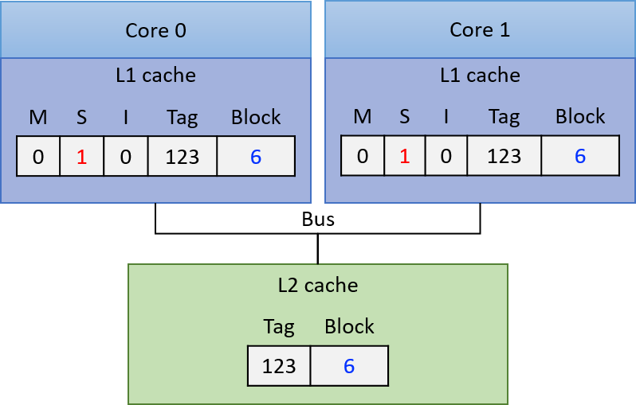
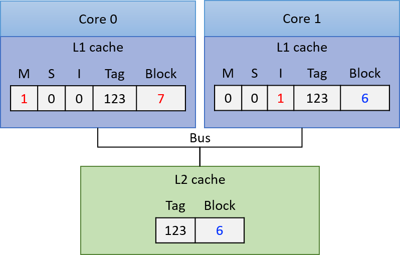
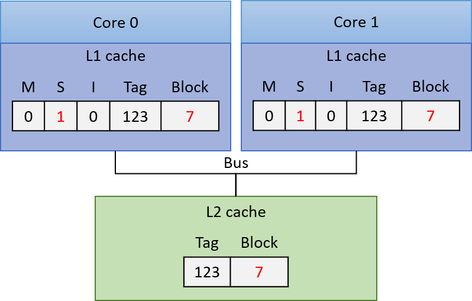

## 11.6. Nhìn về phía trước: Caching trên bộ xử lý đa nhân (multicore processors)

Cho đến giờ, phần thảo luận của chúng ta về caching mới chỉ tập trung vào một cấp bộ nhớ cache duy nhất trên bộ xử lý đơn nhân (single-core processor). Tuy nhiên, các bộ xử lý hiện đại là **multicore** (đa nhân) với nhiều cấp bộ nhớ cache. Thông thường, mỗi **core** duy trì bộ nhớ cache riêng ở cấp cao nhất trong **memory hierarchy** (hệ phân cấp bộ nhớ) và chia sẻ một bộ nhớ cache chung với tất cả các core ở các cấp thấp hơn. Hình 1 minh họa ví dụ về hệ phân cấp bộ nhớ trên một bộ xử lý bốn nhân, trong đó mỗi core có một **L1 cache** riêng, và **L2 cache** được chia sẻ bởi cả bốn core.


**Hình 1.** Ví dụ về hệ phân cấp bộ nhớ trên một bộ xử lý đa nhân. Mỗi core trong bốn core có một **L1 cache** riêng, và cả bốn core chia sẻ một **L2 cache** duy nhất, truy cập thông qua một **shared bus** (bus chia sẻ). Bộ xử lý đa nhân kết nối tới **RAM** thông qua **memory bus**.

Hãy nhớ rằng các cấp cao hơn trong **memory hierarchy** có tốc độ truy cập nhanh hơn và dung lượng nhỏ hơn so với các cấp thấp hơn. Do đó, **L1 cache** nhỏ hơn và nhanh hơn **L2 cache**, và **L2 cache** lại nhỏ hơn và nhanh hơn **RAM**. Ngoài ra, bộ nhớ cache lưu trữ một bản sao của giá trị từ cấp thấp hơn trong hệ phân cấp bộ nhớ; giá trị trong **L1 cache** là bản sao của giá trị trong **L2 cache**, và **L2 cache** lại là bản sao của giá trị trong **RAM**. Vì vậy, các cấp cao hơn trong hệ phân cấp bộ nhớ đóng vai trò là cache cho các cấp thấp hơn. Trong ví dụ ở Hình 1, **L2 cache** là cache của nội dung **RAM**, và **L1 cache** của mỗi core là cache của nội dung **L2 cache**.

Mỗi core trong bộ xử lý đa nhân đồng thời thực thi một luồng lệnh (instruction stream) độc lập, thường đến từ các chương trình khác nhau. Việc cung cấp cho mỗi core một **L1 cache** riêng cho phép core đó lưu trữ các bản sao dữ liệu và lệnh chỉ từ luồng lệnh mà nó đang thực thi, trong bộ nhớ cache nhanh nhất của nó. Nói cách khác, **L1 cache** của mỗi core chỉ lưu các khối bộ nhớ thuộc luồng thực thi của nó, thay vì phải cạnh tranh không gian trong một **L1 cache** chung cho tất cả các core. Thiết kế này giúp tăng **hit rate** (tỉ lệ truy cập trúng) trong **L1 cache** riêng của mỗi core so với trường hợp tất cả các core chia sẻ một **L1 cache** duy nhất.

Các bộ xử lý ngày nay thường có nhiều hơn hai cấp cache. Ba cấp là phổ biến trong các hệ thống desktop, với cấp cao nhất (**L1**) thường được tách thành hai **L1 cache** riêng: một cho lệnh chương trình (**instruction cache**) và một cho dữ liệu chương trình (**data cache**). Các cache ở cấp thấp hơn thường là **unified caches** (cache hợp nhất), nghĩa là lưu trữ cả dữ liệu và lệnh chương trình. Mỗi core thường duy trì một **L1 cache** riêng và chia sẻ một **L3 cache** chung với tất cả các core. Lớp **L2 cache**, nằm giữa **L1 cache** riêng của mỗi core và **L3 cache** chung, có sự khác biệt đáng kể trong các thiết kế CPU hiện đại: **L2 cache** có thể là riêng cho từng core, có thể được chia sẻ bởi tất cả các core, hoặc là dạng lai (hybrid) với nhiều **L2 cache**, mỗi cái được chia sẻ bởi một nhóm core.

> **Thông tin về Processor và Cache trên hệ thống Linux**
>
> Nếu bạn tò mò về thiết kế CPU của mình, có nhiều cách để lấy thông tin về bộ xử lý và tổ chức cache trên hệ thống. Ví dụ, lệnh `lscpu` hiển thị thông tin về bộ xử lý, bao gồm số lượng core và các cấp, kích thước của cache:
>
> ```
> $ lscpu
> ...
> CPU(s):                          12
> Thread(s) per core:              2
> Core(s) per socket:              6
> Socket(s):                       1
> ...
> L1d cache:                       192 KiB
> L1i cache:                       384 KiB
> L2 cache:                        3 MiB
> L3 cache:                        16 MiB
> ```
>
> Kết quả này cho thấy có tổng cộng 6 core (số `Socket(s)` nhân với `Core(s) per socket`), và mỗi core hỗ trợ **hyperthreading** hai luồng (`Thread(s) per core`), khiến 6 core vật lý xuất hiện như 12 CPU đối với hệ điều hành (xem [Chương 5.9.2](../C5-Arch/modern.html#_multicore_and_hardware_multithreading) để biết thêm về **hardware multithreading**). Ngoài ra, kết quả cho thấy có ba cấp cache (`L1`, `L2`, và `L3`), và có hai **L1 cache** riêng biệt: một cho dữ liệu (`L1d`) và một cho lệnh (`L1i`).
>
> Ngoài `lscpu`, các tệp trong **/proc** và **/sys** cũng chứa thông tin về bộ xử lý. Ví dụ, lệnh `cat /proc/cpuinfo` xuất thông tin về CPU, và lệnh sau liệt kê thông tin về cache của một core cụ thể (lưu ý rằng các thư mục này được đặt tên theo CPU logic của core hỗ trợ hyperthreading; trong ví dụ này `cpu0` và `cpu6` là hai CPU logic của core 0):
>
> ```
> $ ls /sys/devices/system/cpu/cpu0/cache
> index0/  index1/  index2/  index3/
> ```
>
> Kết quả này cho thấy core 0 có bốn cache (`index0` đến `index3`). Để xem chi tiết từng cache, ta đọc các tệp `type`, `level`, và `shared_cpu_list` trong mỗi thư mục index:
>
> ```
> $ cat /sys/devices/system/cpu/cpu0/cache/index*/type
> Data
> Instruction
> Unified
> Unified
> $ cat /sys/devices/system/cpu/cpu0/cache/index*/level
> 1
> 1
> 2
> 3
> $ cat /sys/devices/system/cpu/cpu0/cache/index*/shared_cpu_list
> 0,6
> 0,6
> 0,6
> 0-11
> ```
>
> Kết quả `type` cho thấy core 0 có cache dữ liệu và cache lệnh riêng, cùng với hai cache hợp nhất khác. Kết hợp với `level`, ta thấy cache dữ liệu và cache lệnh đều là **L1 cache**, trong khi hai cache hợp nhất là **L2** và **L3**. Thông tin `shared_cpu_list` cho thấy **L1** và **L2 cache** là riêng cho core 0 (chỉ chia sẻ giữa CPU `0` và `6` — hai luồng hyperthread của core 0), còn **L3 cache** được chia sẻ bởi tất cả 6 core (tất cả 12 CPU logic, `0-11`).

### 11.6.1. Cache Coherency (Tính nhất quán của cache)

Vì các chương trình thường có **locality of reference** (tính cục bộ truy cập) cao, nên việc mỗi core có **L1 cache** riêng để lưu trữ bản sao dữ liệu và lệnh từ luồng lệnh mà nó thực thi là rất có lợi. Tuy nhiên, nhiều **L1 cache** có thể dẫn đến vấn đề **cache coherency** (tính nhất quán của cache). Vấn đề này xảy ra khi giá trị của một bản sao khối bộ nhớ trong **L1 cache** của một core khác với giá trị của bản sao cùng khối đó trong **L1 cache** của core khác. Tình huống này xuất hiện khi một core ghi dữ liệu vào một khối đang được cache trong **L1 cache** của nó, và khối đó cũng đang được cache trong **L1 cache** của core khác. Vì mỗi khối cache chỉ là bản sao của nội dung bộ nhớ, hệ thống cần duy trì một giá trị thống nhất cho nội dung bộ nhớ trên tất cả các bản sao của khối cache đó.

Các bộ xử lý đa nhân triển khai **cache-coherence protocol** (giao thức duy trì tính nhất quán cache) để đảm bảo một cái nhìn nhất quán về bộ nhớ, có thể được cache và truy cập bởi nhiều core. Một **cache-coherence protocol** đảm bảo rằng bất kỳ core nào truy cập một vị trí bộ nhớ đều nhìn thấy giá trị mới nhất đã được sửa đổi của vị trí đó, thay vì nhìn thấy một bản sao cũ (stale) có thể đang được lưu trong **L1 cache** của nó.

### 11.6.2. Giao thức MSI (MSI Protocol)

Có nhiều **cache coherency protocol** (giao thức duy trì tính nhất quán cache) khác nhau. Ở đây, chúng ta sẽ tìm hiểu chi tiết một ví dụ: **MSI protocol** (Modified, Shared, Invalid). **MSI protocol** thêm ba **flag** (hoặc bit) vào mỗi **cache line**. Giá trị của một flag có thể là **clear** (0) hoặc **set** (1). Ba flag này mã hóa trạng thái của **data block** (khối dữ liệu) liên quan đến tính nhất quán cache với các bản sao khác của cùng khối dữ liệu, và giá trị của chúng sẽ kích hoạt các hành động duy trì tính nhất quán khi có truy cập đọc hoặc ghi vào khối dữ liệu trong cache line. Ba flag được sử dụng trong **MSI protocol** gồm:

- **M** flag: nếu được set, cho biết khối dữ liệu đã bị **modified** (sửa đổi), nghĩa là core này đã ghi vào bản sao giá trị được cache.
- **S** flag: nếu được set, cho biết khối dữ liệu chưa bị sửa đổi và có thể **safely shared** (chia sẻ an toàn), nghĩa là nhiều **L1 cache** có thể lưu bản sao của khối và đọc từ bản sao đó.
- **I** flag: nếu được set, cho biết khối dữ liệu trong cache là **invalid** (không hợp lệ) hoặc chứa dữ liệu **stale** (lỗi thời — bản sao cũ không phản ánh giá trị hiện tại của khối dữ liệu trong bộ nhớ).

**MSI protocol** được kích hoạt khi có truy cập đọc hoặc ghi vào các mục trong cache.

#### Khi truy cập đọc (read access):

- Nếu cache block đang ở trạng thái **M** hoặc **S**, giá trị trong cache được dùng để đáp ứng yêu cầu đọc (bản sao này chứa giá trị mới nhất của khối dữ liệu trong bộ nhớ).
- Nếu cache block đang ở trạng thái **I**, bản sao trong cache đã lỗi thời so với phiên bản mới hơn của khối dữ liệu, và giá trị mới cần được nạp vào cache line trước khi có thể thực hiện đọc.

    Nếu **L1 cache** của core khác đang lưu giá trị mới (với **M flag** được set, nghĩa là nó lưu bản sao đã được sửa đổi), core đó phải **write-back** (ghi ngược) giá trị của mình xuống cấp thấp hơn (ví dụ: **L2 cache**). Sau khi ghi ngược, nó **clear** M flag (bản sao của nó và bản sao ở cấp thấp hơn giờ đã nhất quán) và **set** S flag để cho biết khối dữ liệu trong cache line này có thể được cache an toàn bởi các core khác (L1 block nhất quán với bản sao trong L2 cache và core đọc giá trị hiện tại từ bản sao L1 này).

    Core khởi tạo truy cập đọc trên một cache line có **I flag** được set sẽ nạp giá trị mới của khối dữ liệu vào cache line của mình. Nó **clear** I flag (khối dữ liệu giờ hợp lệ), lưu giá trị mới, **set** S flag (khối có thể chia sẻ an toàn, nhất quán với các bản sao khác), và **clear** M flag (giá trị trong L1 block khớp với bản sao trong L2 cache — đọc không làm thay đổi bản sao trong L1).

#### Khi truy cập ghi (write access):

- Nếu block đang ở trạng thái **M**, ghi trực tiếp vào bản sao trong cache. Không cần thay đổi flag (block vẫn ở trạng thái M).
- Nếu block đang ở trạng thái **I** hoặc **S**, thông báo cho các core khác rằng block đang bị ghi (modified). Các **L1 cache** khác đang lưu block ở trạng thái **S** phải **clear** S bit và **set** I bit (bản sao của chúng giờ đã lỗi thời so với bản sao đang được ghi). Nếu một **L1 cache** khác có block ở trạng thái **M**, nó sẽ ghi ngược block xuống cấp thấp hơn và đặt bản sao của mình về trạng thái **I**. Core thực hiện ghi sau đó sẽ nạp giá trị mới của block vào **L1 cache** của mình, **set** M flag (bản sao sẽ bị sửa đổi bởi thao tác ghi), **clear** I flag (bản sao giờ hợp lệ), và ghi vào block trong cache.

Từ **Hình 2** đến **Hình 4** minh họa từng bước của **MSI protocol** khi đảm bảo tính nhất quán cho các truy cập đọc và ghi vào một khối dữ liệu được cache trong **L1 cache** riêng của hai core. Trong **Hình 2**, ví dụ bắt đầu với khối dữ liệu dùng chung được sao chép vào **L1 cache** của cả hai core với **S flag** được set, nghĩa là các bản sao trong L1 cache giống với giá trị của block trong **L2 cache** (tất cả bản sao lưu giá trị hiện tại của block là 6). Lúc này, cả core 0 và core 1 đều có thể đọc an toàn từ bản sao trong L1 cache của mình mà không kích hoạt hành động duy trì tính nhất quán (S flag cho biết bản sao chia sẻ là mới nhất).



**Hình 2.** Ban đầu, cả hai core đều có bản sao của block trong L1 cache riêng với **S flag** được set (trạng thái Shared)

Nếu core 0 ghi vào bản sao của block trong L1 cache của mình, **L1 cache controller** của nó sẽ thông báo cho các L1 cache khác **invalidate** (vô hiệu hóa) bản sao của block. **L1 cache controller** của core 1 sẽ **clear** S flag và **set** I flag trên bản sao của mình, cho biết bản sao đã lỗi thời. Core 0 ghi vào bản sao trong L1 cache (thay đổi giá trị thành 7 trong ví dụ), **set** M flag và **clear** S flag trên cache line để cho biết bản sao đã bị sửa đổi và lưu giá trị hiện tại của block. Lúc này, bản sao trong **L2 cache** và trong **L1 cache** của core 1 đều đã lỗi thời. Trạng thái cache sau đó được thể hiện trong **Hình 3**.



**Hình 3.** Trạng thái cache sau khi core 0 ghi vào bản sao của block

Lúc này, core 0 có thể đọc an toàn từ bản sao trong cache vì nó đang ở trạng thái **M**, nghĩa là lưu giá trị mới nhất của block.

Nếu core 1 tiếp theo đọc từ block, **I flag** trên bản sao trong L1 cache của nó cho biết bản sao đã lỗi thời và không thể dùng để đáp ứng yêu cầu đọc. **L1 cache controller** của core 1 phải nạp giá trị mới của block vào L1 cache trước khi đọc. Để làm điều này, **L1 cache controller** của core 0 phải ghi ngược giá trị đã sửa đổi của block xuống **L2 cache**, để **L1 cache** của core 1 có thể đọc giá trị mới vào. Kết quả của các hành động này (thể hiện trong **Hình 4**) là bản sao trong **L1 cache** của cả core 0 và core 1 đều ở trạng thái **S**, cho biết mỗi bản sao đều mới nhất và có thể dùng an toàn cho các lần đọc tiếp theo.



**Hình 4.** Trạng thái cache sau khi Core 1 thực hiện đọc block

### 11.6.3. Triển khai các Cache Coherency Protocol (Giao thức duy trì tính nhất quán cache)

Để triển khai một **cache coherency protocol**, bộ xử lý cần một cơ chế để xác định khi nào việc truy cập vào nội dung **L1 cache** của một core đòi hỏi thay đổi trạng thái nhất quán liên quan đến nội dung **L1 cache** của các core khác.  
Một cách để thực hiện cơ chế này là thông qua **snooping** (theo dõi) trên một **bus** được chia sẻ bởi tất cả các L1 cache. Một **snooping cache controller** sẽ lắng nghe (hoặc snoop) trên bus để phát hiện các thao tác đọc hoặc ghi vào những block mà nó đang cache.  
Vì mọi yêu cầu đọc và ghi đều được xác định theo địa chỉ bộ nhớ, một **snooping L1 cache controller** có thể nhận biết bất kỳ thao tác đọc hoặc ghi nào từ một L1 cache khác đối với block mà nó lưu trữ, và sau đó phản hồi phù hợp dựa trên **coherency protocol**.  
Ví dụ, nó có thể **set** I flag trên một cache line khi snoop thấy một thao tác ghi vào cùng địa chỉ đó bởi một L1 cache khác. Đây là cách một **write-invalidate protocol** (giao thức ghi-vô hiệu hóa) được triển khai với snooping.

**MSI** và các giao thức tương tự như **MESI** và **MOESI** đều là **write-invalidate protocol** — tức là các giao thức sẽ vô hiệu hóa các bản sao cache khi có thao tác ghi.  
Snooping cũng có thể được sử dụng trong các **write-update cache coherency protocol** (giao thức duy trì tính nhất quán cache kiểu ghi-cập nhật), trong đó giá trị mới của dữ liệu được snoop từ bus và áp dụng để cập nhật tất cả các bản sao được lưu trong các L1 cache khác.

Thay vì snooping, có thể sử dụng **directory-based cache coherence mechanism** (cơ chế duy trì tính nhất quán cache dựa trên bảng chỉ mục) để kích hoạt các **cache coherency protocol**.  
Phương pháp này mở rộng tốt hơn snooping do hạn chế về hiệu năng khi nhiều core chia sẻ một bus duy nhất. Tuy nhiên, cơ chế dựa trên bảng chỉ mục yêu cầu lưu trữ nhiều trạng thái hơn để phát hiện khi nào các block bộ nhớ được chia sẻ, và thường chậm hơn snooping.

### 11.6.4. Thêm về Multicore Caching

Lợi ích về hiệu năng khi mỗi core của một **multicore processor** có cache riêng ở cấp cao nhất của **memory hierarchy** — dùng để lưu trữ bản sao dữ liệu và lệnh chương trình mà core đó thực thi — là xứng đáng với sự phức tạp bổ sung do bộ xử lý phải triển khai **cache coherency protocol**.

Mặc dù **cache coherency** giải quyết vấn đề nhất quán bộ nhớ trên các bộ xử lý đa nhân với **L1 cache** riêng, vẫn tồn tại một vấn đề khác có thể phát sinh do các **cache coherency protocol** trên bộ xử lý đa nhân.  
Vấn đề này gọi là **false sharing** (chia sẻ giả), có thể xảy ra khi nhiều **thread** của một chương trình song song đa luồng chạy đồng thời trên nhiều core và truy cập các vị trí bộ nhớ gần với các vị trí được truy cập bởi các thread khác.  
Trong [Chương 14.5](../C14-SharedMemory/cache_coherence.html#_cache_coherence_and_false_sharing), chúng ta sẽ thảo luận về vấn đề **false sharing** và một số giải pháp.

Để biết thêm thông tin chi tiết về **hardware caching** trên **multicore processor**, bao gồm các giao thức khác nhau và cách chúng được triển khai, hãy tham khảo một giáo trình **computer architecture** (kiến trúc máy tính)^1^.