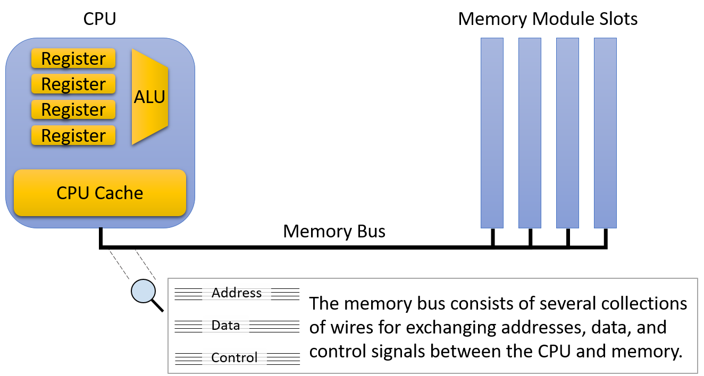
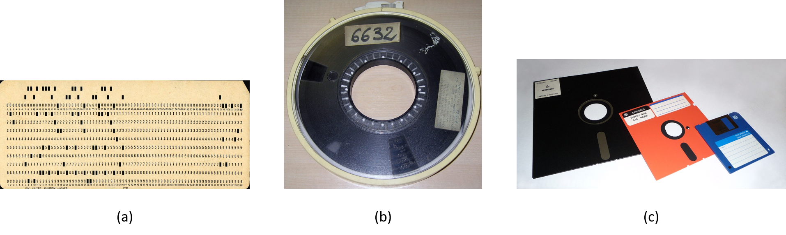
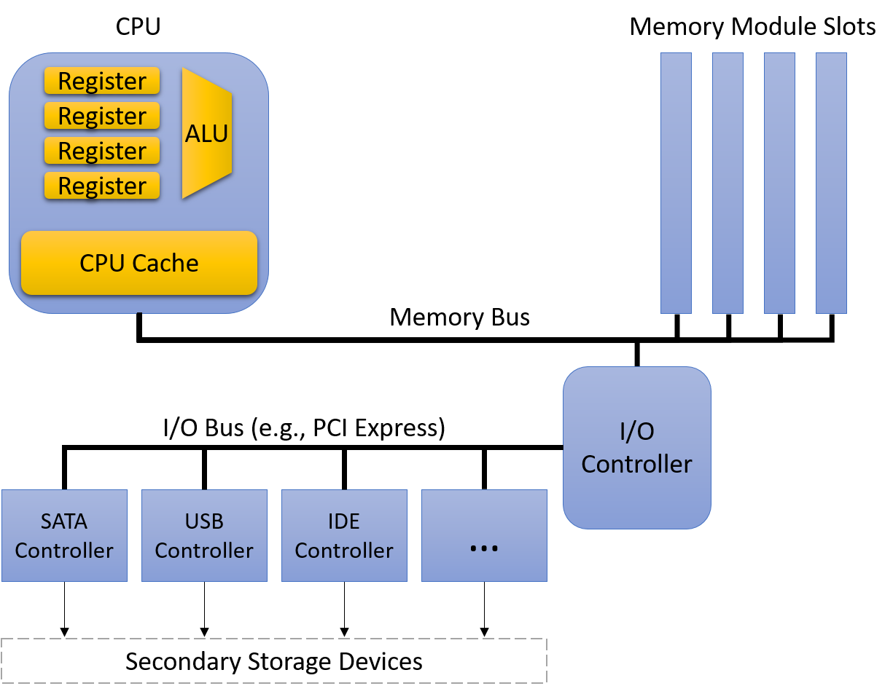
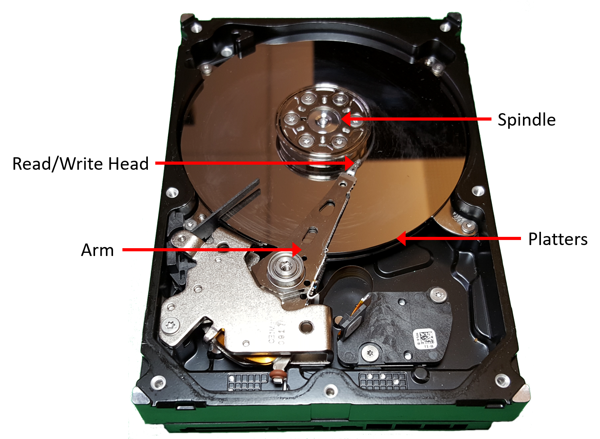

## 11.2. Thiết bị lưu trữ (Storage Devices)

Các nhà thiết kế hệ thống phân loại các thiết bị trong [memory hierarchy](mem_hierarchy.html#_the_memory_hierarchy) (hệ phân cấp bộ nhớ) dựa trên cách chương trình truy cập dữ liệu của chúng.  
**Primary storage** (bộ nhớ chính) là các thiết bị có thể được truy cập trực tiếp bởi một chương trình đang chạy trên CPU. Nói cách khác, các **assembly instruction** (lệnh hợp ngữ) của CPU code hóa chính xác vị trí dữ liệu mà lệnh cần lấy. Ví dụ về **primary storage** bao gồm **CPU register** và **main memory** (RAM), mà các lệnh assembly tham chiếu trực tiếp (ví dụ, trong IA32 assembly là `%reg` và `(%reg)` tương ứng).

Ngược lại, các lệnh CPU không thể trực tiếp tham chiếu đến **secondary storage** (bộ nhớ phụ). Để truy cập nội dung của một thiết bị secondary storage, chương trình trước tiên phải yêu cầu thiết bị sao chép dữ liệu của nó vào primary storage (thường là bộ nhớ chính). Các loại secondary storage quen thuộc nhất là các thiết bị đĩa như **hard disk drive (HDD)** và **solid-state drive (SSD)**, vốn lưu trữ dữ liệu tệp một cách lâu dài. Các ví dụ khác bao gồm **floppy disk**, **magnetic tape cartridge** (băng từ), hoặc thậm chí **remote file server** (máy chủ tệp từ xa).

Ngay cả khi bạn chưa từng nghĩ đến sự phân biệt giữa primary và secondary storage theo cách này, rất có thể bạn đã gặp sự khác biệt của chúng khi lập trình. Ví dụ, sau khi khai báo và gán giá trị cho các biến thông thường (primary storage), chương trình có thể ngay lập tức sử dụng chúng trong các phép toán số học. Khi làm việc với dữ liệu tệp (secondary storage), chương trình phải [đọc giá trị từ tệp vào các biến trong bộ nhớ](../C2-C_depth/IO.html#_file_inputoutput) trước khi có thể truy cập chúng.

Ngoài ra, còn có một số tiêu chí quan trọng khác để phân loại thiết bị bộ nhớ dựa trên đặc điểm hiệu năng và dung lượng. Ba thước đo quan trọng nhất là:

- **Capacity** (dung lượng): Lượng dữ liệu mà thiết bị có thể lưu trữ. Thường được đo bằng byte.
- **Latency** (độ trễ): Thời gian cần để thiết bị phản hồi dữ liệu sau khi nhận lệnh thực hiện một thao tác truy xuất dữ liệu. Thường được đo bằng phần của giây (ví dụ: millisecond hoặc nanosecond) hoặc số chu kỳ CPU.
- **Transfer rate** (tốc độ truyền): Lượng dữ liệu có thể được di chuyển giữa thiết bị và bộ nhớ chính trong một khoảng thời gian. **Transfer rate** còn được gọi là **throughput** (băng thông) và thường được đo bằng byte/giây.

Khám phá các loại thiết bị trong một máy tính hiện đại cho thấy sự chênh lệch rất lớn về hiệu năng giữa các thiết bị theo cả ba thước đo trên. Sự khác biệt này chủ yếu đến từ hai yếu tố: *khoảng cách* và *công nghệ* được sử dụng để chế tạo thiết bị.

**Khoảng cách** là yếu tố quan trọng vì cuối cùng, mọi dữ liệu mà chương trình muốn sử dụng đều phải sẵn sàng cho các thành phần số học của CPU — **ALU** (Arithmetic Logic Unit) — để xử lý. Các nhà thiết kế CPU đặt **register** gần ALU để giảm thiểu thời gian tín hiệu truyền giữa hai thành phần này. Do đó, mặc dù register chỉ lưu được vài byte và số lượng rất ít, nhưng giá trị lưu trong đó gần như có thể được ALU sử dụng ngay lập tức.  
Ngược lại, các thiết bị secondary storage như ổ đĩa truyền dữ liệu vào bộ nhớ thông qua nhiều bộ điều khiển (controller) được kết nối bằng dây dẫn dài hơn. Khoảng cách lớn hơn và quá trình xử lý trung gian này làm chậm đáng kể tốc độ của secondary storage.

> **Grace Hopper's "Nanoseconds"**  
> Khi thuyết trình, nhà tiên phong trong lĩnh vực máy tính và Đô đốc Hải quân Hoa Kỳ **Grace Hopper** thường phát cho khán giả những đoạn dây dài 11,8 inch. Những đoạn dây này tượng trưng cho khoảng cách tối đa mà một tín hiệu điện có thể truyền trong một nanosecond, và được gọi là “Grace Hopper nanoseconds”.  
> Bà dùng chúng để giải thích giới hạn độ trễ của truyền thông vệ tinh và minh họa lý do tại sao các thiết bị máy tính cần phải nhỏ để đạt tốc độ cao.  
> Các bản ghi hình Grace Hopper trình bày về “nanoseconds” có thể xem [trên YouTube](https://www.youtube.com/watch?v=9eyFDBPk4Yw).

**Công nghệ** nền tảng cũng ảnh hưởng đáng kể đến hiệu năng thiết bị. **Register** và **cache** được xây dựng từ các mạch điện tương đối đơn giản, chỉ gồm một vài **logic gate**. Kích thước nhỏ và độ phức tạp tối thiểu giúp tín hiệu điện truyền qua nhanh, giảm độ trễ. Ở phía đối lập, các ổ đĩa cứng truyền thống chứa các **magnetic platter** (đĩa từ) quay để lưu trữ hàng trăm gigabyte dữ liệu. Mặc dù cung cấp mật độ lưu trữ cao, nhưng độ trễ truy cập của chúng khá lớn do phải căn chỉnh và quay cơ học các thành phần vào đúng vị trí.

Phần còn lại của mục này sẽ xem xét chi tiết về các thiết bị primary và secondary storage, đồng thời phân tích đặc điểm hiệu năng của chúng.

### 11.2.1. Primary Storage

**Primary storage** bao gồm **random access memory** (RAM — bộ nhớ truy cập ngẫu nhiên), nghĩa là thời gian truy cập dữ liệu không phụ thuộc vào vị trí dữ liệu trong thiết bị. Nói cách khác, RAM không cần quan tâm đến việc di chuyển các bộ phận cơ học vào đúng vị trí hoặc tua lại cuộn băng từ.  
Có hai loại RAM được sử dụng rộng rãi: **static RAM** (SRAM) và **dynamic RAM** (DRAM), và cả hai đều đóng vai trò quan trọng trong máy tính hiện đại. **Bảng 1** mô tả các thông số hiệu năng của các thiết bị primary storage phổ biến và loại RAM mà chúng sử dụng.

| Thiết bị (Device) | Dung lượng (Capacity) | Độ trễ xấp xỉ (Approx. latency) | Loại RAM (RAM type) |
|-------------------|-----------------------|----------------------------------|---------------------|
| Register          | 4 – 8 bytes           | < 1 ns                           | SRAM                |
| CPU cache         | 1 – 32 megabytes      | 5 ns                             | SRAM                |
| Main memory       | 4 – 64 gigabytes      | 100 ns                           | DRAM                |

**Bảng 1.** Đặc điểm của các thiết bị **Primary Storage** (bộ nhớ chính) trên một workstation điển hình năm 2020

**SRAM** lưu trữ dữ liệu trong các mạch điện nhỏ (ví dụ: [latch](../C5-Arch/storagecircs.html#_rs_latch)). Đây thường là loại bộ nhớ nhanh nhất, và các kỹ sư tích hợp trực tiếp nó vào CPU để xây dựng [register](../C5-Arch/storagecircs.html#_cpu_register) và cache.  
Tuy nhiên, **SRAM** tương đối đắt — cả về chi phí sản xuất, chi phí vận hành (tiêu thụ điện năng), và diện tích chiếm dụng trên chip. Tổng hợp các yếu tố này giới hạn lượng SRAM mà một CPU có thể tích hợp.

**DRAM** lưu trữ dữ liệu bằng các linh kiện điện tử gọi là *capacitor* (tụ điện), có khả năng giữ điện tích. Nó được gọi là “dynamic” vì hệ thống DRAM phải thường xuyên **refresh** (làm mới) điện tích của các tụ để duy trì giá trị lưu trữ.  
Các hệ thống hiện đại sử dụng DRAM để triển khai **main memory** (bộ nhớ chính) trên các module kết nối với CPU thông qua một liên kết tốc độ cao gọi là **memory bus**.

**Hình 1** minh họa vị trí của các thiết bị primary storage so với **memory bus**.  
Để lấy một giá trị từ bộ nhớ, CPU đặt **address** (địa chỉ) của dữ liệu cần lấy lên memory bus và gửi tín hiệu yêu cầu các module bộ nhớ thực hiện thao tác đọc. Sau một khoảng trễ ngắn, module bộ nhớ sẽ gửi giá trị tại địa chỉ được yêu cầu qua bus về CPU.

**Hình 1.** Kiến trúc primary storage và memory bus

Mặc dù CPU và main memory chỉ cách nhau vài inch về mặt vật lý, dữ liệu vẫn phải đi qua **memory bus** khi di chuyển giữa CPU và main memory. Khoảng cách bổ sung và các mạch điện trung gian này làm tăng **latency** (độ trễ) và giảm **transfer rate** (tốc độ truyền) của main memory so với bộ nhớ nằm trực tiếp trên CPU.  
Vì lý do này, memory bus đôi khi được gọi là **von Neumann bottleneck** (nút thắt cổ chai von Neumann).  
Tất nhiên, mặc dù hiệu năng thấp hơn, main memory vẫn là thành phần thiết yếu vì nó lưu trữ lượng dữ liệu lớn hơn nhiều bậc so với khả năng chứa của CPU. Giống như các dạng lưu trữ khác, luôn tồn tại sự đánh đổi rõ ràng giữa dung lượng và tốc độ.

**CPU cache** (phát âm là “cash”) nằm ở vị trí trung gian giữa register và main memory, cả về vị trí vật lý lẫn đặc điểm hiệu năng và dung lượng. CPU cache thường lưu trữ từ vài kilobyte đến vài megabyte dữ liệu trực tiếp trên CPU, nhưng về mặt vật lý, cache không gần ALU bằng register.  
Do đó, cache nhanh hơn main memory, nhưng vẫn cần nhiều chu kỳ hơn so với register để cung cấp dữ liệu cho quá trình tính toán.

Thay vì lập trình viên phải nạp dữ liệu vào cache một cách tường minh, mạch điều khiển bên trong CPU sẽ tự động lưu trữ một phần nội dung của main memory vào cache. CPU điều khiển chiến lược phần dữ liệu nào của main memory được lưu trong cache sao cho càng nhiều yêu cầu bộ nhớ càng được phục vụ từ cache (vốn có hiệu năng cao hơn nhiều).  
Các phần sau của chương này sẽ mô tả các quyết định thiết kế trong việc xây dựng cache và các thuật toán xác định dữ liệu nào nên được lưu trữ.

Các hệ thống thực tế tích hợp nhiều cấp cache hoạt động như một phiên bản thu nhỏ của **memory hierarchy**. Ví dụ, CPU có thể có một **L1 cache** rất nhỏ và nhanh, lưu một phần dữ liệu của **L2 cache** lớn hơn và chậm hơn một chút, và L2 lại lưu một phần dữ liệu của **L3 cache** lớn hơn và chậm hơn nữa.  
Phần còn lại của mục này sẽ mô tả hệ thống chỉ có một cache duy nhất, nhưng sự tương tác giữa các cache trong hệ thống thực tế cũng tương tự như sự tương tác giữa một cache và main memory được trình bày sau đây.

> Nếu bạn tò mò về kích thước cache và main memory trên hệ thống của mình, lệnh `lscpu` sẽ in thông tin về CPU (bao gồm dung lượng cache).  
> Chạy `free -m` sẽ hiển thị dung lượng main memory của hệ thống tính theo megabyte.

### 11.2.2. Secondary Storage (Bộ nhớ phụ)

Về mặt vật lý, các thiết bị **secondary storage** kết nối với hệ thống ở vị trí còn xa CPU hơn cả **main memory** (bộ nhớ chính). So với hầu hết các thiết bị máy tính khác, secondary storage đã trải qua sự thay đổi mạnh mẽ trong nhiều năm qua và vẫn tiếp tục thể hiện sự đa dạng về thiết kế hơn các thành phần khác.  
Một thiết bị mang tính biểu tượng là [punch card](https://en.wikipedia.org/wiki/Punched_card) (thẻ đục lỗ), cho phép con người lưu trữ dữ liệu bằng cách tạo các lỗ nhỏ trên một tấm giấy cứng, tương tự như thẻ chỉ mục. Punch card, với thiết kế có từ cuộc điều tra dân số Hoa Kỳ năm 1890, đã lưu trữ dữ liệu người dùng (thường là chương trình) một cách đáng tin cậy từ những năm 1960 cho đến những năm 1970.

Một [tape drive](https://en.wikipedia.org/wiki/Magnetic_tape_data_storage) (ổ băng từ) lưu dữ liệu trên một cuộn băng từ. Mặc dù thường cung cấp **storage density** (mật độ lưu trữ) tốt (nhiều thông tin trong kích thước nhỏ) với chi phí thấp, nhưng tape drive có tốc độ truy cập chậm vì phải cuộn băng đến đúng vị trí.  
Mặc dù hầu hết người dùng máy tính ngày nay ít gặp chúng, tape drive vẫn thường được sử dụng cho các tác vụ lưu trữ khối lượng lớn (ví dụ: sao lưu dữ liệu lớn) trong đó việc đọc lại dữ liệu là hiếm. Các tape drive hiện đại đóng gói cuộn băng từ vào các **cartridge** (hộp băng) nhỏ để dễ sử dụng.

**Hình 2.** Ví dụ ảnh của (a) punch card, (b) cuộn băng từ, và (c) nhiều kích thước **floppy disk**. Ảnh từ [Wikipedia](https://www.wikipedia.org/).

Các **removable media** (phương tiện lưu trữ rời) như [floppy disk](https://en.wikipedia.org/wiki/Floppy_disk) và [optical disc](https://en.wikipedia.org/wiki/Optical_disc) là một dạng secondary storage phổ biến khác.  
Floppy disk chứa một trục quay của vật liệu ghi từ, quay dưới một **disk head** (đầu đọc/ghi) để đọc và ghi nội dung.  
Optical disc như CD, DVD và Blu-ray lưu thông tin thông qua các vết lõm nhỏ trên bề mặt đĩa. Ổ đọc đĩa chiếu tia laser vào bề mặt, và sự có hoặc không có vết lõm sẽ làm tia phản xạ (hoặc không), code hóa thành các bit 0 và 1.

#### Modern Secondary Storage (Bộ nhớ phụ hiện đại)

| Thiết bị (Device) | Dung lượng (Capacity) | Độ trễ (Latency) | Tốc độ truyền (Transfer rate) |
|-------------------|-----------------------|------------------|--------------------------------|
| Flash disk        | 0.5 – 2 terabytes     | 0.1 – 1 ms       | 200 – 3,000 megabytes/second   |
| Traditional hard disk | 0.5 – 10 terabytes | 5 – 10 ms        | 100 – 200 megabytes/second     |
| Remote network server | Thay đổi đáng kể  | 20 – 200 ms      | Thay đổi đáng kể               |

**Bảng 2.** Đặc điểm của các thiết bị secondary storage trên một workstation điển hình năm 2020

**Bảng 2** mô tả các thiết bị secondary storage thường có trên workstation hiện nay.  
**Hình 3** cho thấy đường đi từ secondary storage đến main memory thường phải qua nhiều **device controller** (bộ điều khiển thiết bị) trung gian.  
Ví dụ, một ổ cứng thông thường kết nối tới **Serial ATA controller**, sau đó kết nối tới **system I/O controller**, rồi mới kết nối tới **memory bus**.  
Các thiết bị trung gian này giúp ổ đĩa dễ sử dụng hơn bằng cách trừu tượng hóa chi tiết giao tiếp ổ đĩa khỏi **OS** và lập trình viên. Tuy nhiên, chúng cũng tạo ra độ trễ truyền dữ liệu khi dữ liệu phải đi qua nhiều thiết bị bổ sung.

**Hình 3.** Secondary storage và kiến trúc I/O bus

Hai loại secondary storage phổ biến nhất hiện nay là **hard disk drive** (HDD) và **solid-state drive** (SSD) dựa trên flash.  
Một HDD gồm một số **platter** (đĩa) phẳng, tròn, làm từ vật liệu cho phép ghi từ. Các platter quay nhanh, thường ở tốc độ từ 5.000 đến 15.000 vòng/phút. Khi platter quay, một **mechanical arm** (cần cơ khí) nhỏ với **disk head** ở đầu di chuyển qua bề mặt platter để đọc hoặc ghi dữ liệu trên các **track** (rãnh) đồng tâm.

**Hình 4** minh họa các thành phần chính của một [hard disk](https://en.wikipedia.org/wiki/Hard_disk_drive).  
Trước khi truy cập dữ liệu, ổ đĩa phải căn chỉnh disk head với track chứa dữ liệu mong muốn. Việc căn chỉnh này yêu cầu di chuyển cần cơ khí ra hoặc vào cho đến khi đầu đọc nằm đúng trên track.  
Quá trình di chuyển cần này gọi là **seeking**, và vì cần chuyển động cơ học, nó tạo ra một khoảng trễ nhỏ gọi là **seek time** (vài millisecond).  
Khi cần đã ở đúng vị trí, ổ đĩa phải chờ platter quay đến khi disk head nằm đúng trên vị trí chứa dữ liệu mong muốn. Điều này tạo ra một khoảng trễ ngắn khác (vài millisecond), gọi là **rotational latency**.  
Do đặc điểm cơ học này, HDD có độ trễ truy cập cao hơn đáng kể so với các thiết bị primary storage đã mô tả trước đó.

**Hình 4.** Các thành phần chính của một hard disk drive

Trong vài năm gần đây, **SSD** — không có bộ phận chuyển động (và do đó có độ trễ thấp hơn) — đã nhanh chóng trở nên phổ biến. Chúng được gọi là **solid-state drive** vì không dựa vào chuyển động cơ học.  
Mặc dù tồn tại nhiều công nghệ solid-state khác nhau, [flash memory](https://en.wikipedia.org/wiki/Flash_memory) vẫn chiếm ưu thế trong các thiết bị SSD thương mại.  
Chi tiết kỹ thuật của flash memory nằm ngoài phạm vi cuốn sách này, nhưng có thể nói rằng các thiết bị dựa trên flash cho phép đọc, ghi và xóa dữ liệu với tốc độ nhanh hơn HDD truyền thống.  
Dù chưa lưu trữ dữ liệu với mật độ cao bằng các thiết bị cơ học, SSD đã gần như thay thế hoàn toàn ổ đĩa quay trong hầu hết các thiết bị tiêu dùng như laptop.
