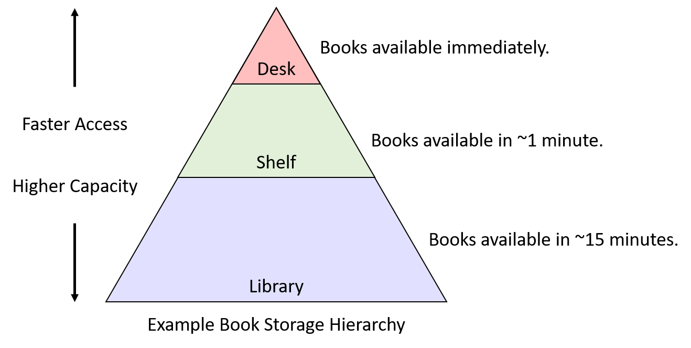

Dưới đây là bản dịch tiếng Việt của mục **11.3. Locality**, tuân thủ đầy đủ các quy ước bạn đã nêu:

---

## 11.3. Locality (Tính cục bộ)

Bởi vì [các thiết bị bộ nhớ rất khác nhau](mem_hierarchy.html#_the_memory_hierarchy) về đặc điểm hiệu năng và dung lượng lưu trữ, các hệ thống hiện đại tích hợp nhiều dạng lưu trữ khác nhau. May mắn thay, hầu hết các chương trình đều thể hiện các mẫu truy cập bộ nhớ phổ biến, được gọi là **locality** (tính cục bộ), và các kỹ sư phần cứng thiết kế hệ thống để khai thác locality tốt nhằm tự động di chuyển dữ liệu vào vị trí lưu trữ thích hợp.  
Cụ thể, một hệ thống cải thiện hiệu năng bằng cách di chuyển phần dữ liệu mà chương trình đang sử dụng tích cực vào bộ nhớ nằm gần mạch tính toán của CPU (ví dụ: trong **register** hoặc **CPU cache**). Khi dữ liệu cần thiết di chuyển lên các cấp cao hơn trong **memory hierarchy** (hệ phân cấp bộ nhớ) về phía CPU, dữ liệu không sử dụng sẽ được đẩy xuống các cấp lưu trữ chậm hơn cho đến khi chương trình cần lại.

Đối với một nhà thiết kế hệ thống, việc xây dựng một hệ thống khai thác locality là một bài toán **abstraction** (trừu tượng hóa). Hệ thống cung cấp một cái nhìn trừu tượng về các thiết bị bộ nhớ sao cho lập trình viên cảm thấy như họ có tổng dung lượng của tất cả các loại bộ nhớ, nhưng với đặc điểm hiệu năng của bộ nhớ nhanh nằm trên chip.  
Tất nhiên, việc mang lại “ảo tưởng màu hồng” này cho người dùng không thể đạt được một cách hoàn hảo, nhưng bằng cách khai thác locality của chương trình, các hệ thống hiện đại đạt được hiệu năng tốt cho hầu hết các chương trình được viết tốt.

Các hệ thống chủ yếu khai thác hai dạng locality:

1. **Temporal locality**: Chương trình có xu hướng truy cập cùng một dữ liệu nhiều lần theo thời gian. Nghĩa là, nếu một chương trình vừa sử dụng một biến gần đây, khả năng cao là nó sẽ sử dụng lại biến đó sớm.
2. **Spatial locality**: Chương trình có xu hướng truy cập dữ liệu nằm gần dữ liệu đã được truy cập trước đó. “Gần” ở đây đề cập đến địa chỉ bộ nhớ của dữ liệu. Ví dụ, nếu một chương trình truy cập dữ liệu tại địa chỉ *N* và *N+4*, thì khả năng cao nó sẽ truy cập *N+8* ngay sau đó.

---

### 11.3.1. Ví dụ về Locality trong mã nguồn

May mắn thay, các mẫu lập trình phổ biến thường thể hiện cả hai dạng locality này. Hãy xem xét ví dụ hàm sau:

```c
/* Sum up the elements in an integer array of length len. */
int sum_array(int *array, int len) {
    int i;
    int sum = 0;

    for (i = 0; i < len; i++) {
        sum += array[i];
    }

    return sum;
}
```

Trong đoạn mã này, tính lặp lại của vòng lặp `for` tạo ra **temporal locality** cho các biến `i`, `len`, `sum`, và `array` (địa chỉ gốc của mảng), vì chương trình truy cập từng biến này trong mỗi vòng lặp.  
Khai thác temporal locality cho phép hệ thống chỉ cần nạp mỗi biến từ main memory vào CPU cache một lần. Mọi lần truy cập sau đó đều có thể được phục vụ từ cache — vốn nhanh hơn rất nhiều.

Các truy cập vào nội dung của mảng cũng được hưởng lợi từ **spatial locality**. Mặc dù chương trình chỉ truy cập mỗi phần tử mảng một lần, hệ thống hiện đại sẽ nạp nhiều hơn một giá trị `int` từ bộ nhớ vào CPU cache mỗi lần.  
Nói cách khác, khi truy cập phần tử đầu tiên của mảng, cache sẽ chứa không chỉ giá trị đó mà còn cả một vài giá trị tiếp theo. Số lượng giá trị bổ sung được nạp vào cache phụ thuộc vào **block size** (kích thước khối) của cache — tức lượng dữ liệu được chuyển vào cache trong một lần.

Ví dụ, với block size là 16 byte, hệ thống sẽ sao chép bốn số nguyên (`int`) từ bộ nhớ vào cache mỗi lần. Do đó, việc truy cập số nguyên đầu tiên phải chịu chi phí cao của việc truy cập main memory, nhưng ba lần truy cập tiếp theo sẽ được phục vụ từ cache, ngay cả khi chương trình chưa từng truy cập chúng trước đó.

Trong nhiều trường hợp, lập trình viên có thể hỗ trợ hệ thống bằng cách cố ý viết mã thể hiện các mẫu locality tốt. Ví dụ, hãy xem xét vòng lặp lồng nhau truy cập mọi phần tử của một ma trận *N*×*N* (ví dụ này cũng đã xuất hiện ở phần mở đầu của chương):

#### averageMat_v1

```c
float averageMat_v1(int **mat, int n) {
    int i, j, total = 0;
    for (i = 0; i < n; i++) {
        for (j = 0; j < n; j++) {
            // Note indexing: [i][j]
            total += mat[i][j];
        }
    }
    return (float) total / (n * n);
}
```

#### averageMat_v2

```c
float averageMat_v2(int **mat, int n) {
    int i, j, total = 0;
    for (i = 0; i < n; i++) {
        for (j = 0; j < n; j++) {
            // Note indexing: [j][i]
            total += mat[j][i];
        }
    }
    return (float) total / (n * n);
}
```

**Bảng 1.** Hai phiên bản của một hàm truy cập mọi phần tử của ma trận *N*×*N*. Chúng chỉ khác nhau ở cách đánh chỉ số khi truy cập bộ nhớ, nhưng phiên bản 1 (bên trái) chạy nhanh hơn khoảng 5 lần.

Trong cả hai phiên bản, các biến vòng lặp (`i` và `j`) và biến tích lũy (`total`) đều thể hiện **temporal locality** (tính cục bộ theo thời gian) tốt vì vòng lặp sử dụng lại chúng nhiều lần trong mỗi lần lặp. Do đó, khi thực thi đoạn mã này, hệ thống sẽ lưu các biến đó trong các vị trí lưu trữ nhanh nằm trên CPU để đạt hiệu năng tốt.

Tuy nhiên, do [tổ chức ma trận trong bộ nhớ theo *row-major order*](../C2-C_depth/arrays.html#_two_dimensional_array_memory_layout), phiên bản đầu tiên của mã (bên trái) chạy nhanh hơn khoảng 5 lần so với phiên bản thứ hai (bên phải). Sự khác biệt này xuất phát từ sự khác nhau về **spatial locality** (tính cục bộ theo không gian) — phiên bản đầu tiên truy cập các giá trị của ma trận theo thứ tự tuần tự trong bộ nhớ (tức là theo các địa chỉ bộ nhớ liên tiếp). Vì vậy, nó tận dụng được lợi ích từ hệ thống khi nạp các khối dữ liệu lớn từ bộ nhớ vào cache, bởi vì nó chỉ phải trả chi phí truy cập bộ nhớ một lần cho mỗi khối giá trị.

Phiên bản thứ hai truy cập các giá trị của ma trận bằng cách liên tục nhảy giữa các hàng qua các địa chỉ bộ nhớ không tuần tự. Nó *không bao giờ* đọc từ cùng một cache block trong các lần truy cập bộ nhớ liên tiếp, nên đối với cache, block đó trông như không cần thiết. Vì vậy, nó phải trả chi phí truy cập bộ nhớ cho từng giá trị của ma trận mà nó đọc.

Ví dụ này minh họa cách lập trình viên có thể ảnh hưởng đến chi phí ở cấp hệ thống của việc thực thi chương trình. Hãy ghi nhớ các nguyên tắc này khi viết các ứng dụng hiệu năng cao, đặc biệt là những ứng dụng truy cập mảng theo một mẫu đều đặn.

---

### 11.3.2. Từ Locality đến Cache

Để minh họa cách các khái niệm **temporal locality** và **spatial locality** hỗ trợ thiết kế cache, chúng ta sẽ sử dụng một ví dụ quen thuộc với các đối tượng đời thực: sách.  
Giả sử Fiona làm tất cả bài tập của mình tại một chiếc bàn trong phòng ký túc xá, và chiếc bàn này chỉ có chỗ để ba cuốn sách. Ngay bên ngoài phòng, cô có một giá sách với nhiều chỗ hơn bàn. Cuối cùng, ở phía bên kia khuôn viên trường, thư viện của trường có một lượng sách khổng lồ.  
“**Book storage hierarchy**” (hệ phân cấp lưu trữ sách) trong ví dụ này có thể trông giống như **Hình 1**. Dựa trên kịch bản này, chúng ta sẽ khám phá cách locality có thể giúp quyết định vị trí lưu trữ sách mà Fiona nên chọn.



**Hình 1.** Ví dụ giả định về hệ phân cấp lưu trữ sách

### 11.3.3. Temporal Locality

**Temporal locality** gợi ý rằng, nếu có một cuốn sách Fiona sử dụng thường xuyên, cô nên giữ nó càng gần bàn làm việc càng tốt. Nếu thỉnh thoảng cần chuyển nó ra giá sách để dọn chỗ làm việc tạm thời thì chi phí không quá lớn, nhưng sẽ thật vô lý nếu mang sách trả lại thư viện khi cô sẽ cần nó vào ngày hôm sau.  
Điều ngược lại cũng đúng: nếu có một cuốn sách chiếm chỗ quý giá trên bàn hoặc giá sách mà cô đã lâu không dùng, thì đó là ứng viên tốt để trả lại thư viện.

Vậy, những cuốn sách nào nên được Fiona đặt ở vị trí quý giá trên bàn? Trong ví dụ này, sinh viên thực tế có thể sẽ xem các bài tập sắp tới và chọn những cuốn sách mà họ dự đoán sẽ hữu ích nhất. Nói cách khác, để đưa ra quyết định lưu trữ tốt nhất, họ cần thông tin về *việc sử dụng trong tương lai*.

Thật không may, các kỹ sư phần cứng chưa tìm ra cách chế tạo mạch có thể dự đoán tương lai. Thay vì dự đoán, ta có thể tưởng tượng một hệ thống yêu cầu lập trình viên hoặc người dùng thông báo trước cho hệ thống cách một chương trình sẽ sử dụng dữ liệu để tối ưu vị trí lưu trữ. Chiến lược này có thể hoạt động tốt trong các ứng dụng chuyên biệt (ví dụ: cơ sở dữ liệu lớn) với mẫu truy cập *rất* đều đặn. Tuy nhiên, trong một hệ thống đa dụng như máy tính cá nhân, việc yêu cầu người dùng cung cấp trước thông tin chi tiết là một gánh nặng quá lớn — nhiều người sẽ không muốn (hoặc không thể) cung cấp đủ thông tin để hệ thống đưa ra quyết định tốt.

Do đó, thay vì dựa vào thông tin truy cập trong tương lai, các hệ thống nhìn vào quá khứ như một cách dự đoán điều *có khả năng* xảy ra trong tương lai. Áp dụng ý tưởng này vào ví dụ về sách gợi ý một chiến lược tương đối đơn giản (nhưng vẫn khá hiệu quả) để quản lý không gian lưu trữ sách:

- Khi Fiona cần dùng một cuốn sách, cô lấy nó từ nơi hiện tại và đặt lên bàn.
- Nếu bàn đã đầy, cô chuyển cuốn sách mà cô dùng *lâu nhất* (tức là cuốn đã nằm trên bàn lâu nhất mà không được động tới) ra giá sách.
- Nếu giá sách đã đầy, cô trả cuốn sách lâu nhất trên giá về thư viện để giải phóng chỗ.

Mặc dù cách này không hoàn hảo, nhưng sự đơn giản khiến nó hấp dẫn. Nó chỉ yêu cầu khả năng di chuyển sách giữa các vị trí lưu trữ và một lượng nhỏ **metainformation** (siêu thông tin) về thứ tự sử dụng sách trước đây. Hơn nữa, chiến lược này đáp ứng tốt hai mục tiêu ban đầu của temporal locality:

1. Sách được dùng thường xuyên có khả năng ở lại trên bàn hoặc giá sách, tránh các chuyến đi không cần thiết đến thư viện.
2. Sách ít được dùng cuối cùng sẽ trở thành cuốn lâu nhất không được sử dụng, và khi đó việc trả nó về thư viện là hợp lý.

Áp dụng chiến lược này cho các thiết bị **primary storage** (bộ nhớ chính) trông rất giống ví dụ về sách: khi dữ liệu được nạp vào **CPU register** từ **main memory**, hãy dành chỗ cho nó trong **CPU cache**. Nếu cache đã đầy, hãy tạo chỗ bằng cách **evict** (loại bỏ) dữ liệu trong cache ít được sử dụng nhất về main memory. Trong [phần tiếp theo về caching](caching.html#_cpu_caches), chúng ta sẽ tìm hiểu chi tiết cách các cơ chế như vậy được tích hợp vào các hệ thống cache hiện đại.

---

### 11.3.4. Spatial Locality

**Spatial locality** gợi ý rằng, khi đã đến thư viện, Fiona nên lấy nhiều hơn một cuốn sách để giảm khả năng phải quay lại thư viện trong tương lai. Cụ thể, cô nên lấy thêm những cuốn sách “gần” cuốn mình cần, vì chúng có khả năng cao sẽ trở thành những cuốn mà cô cần sau này.

Giả sử cô đang học một khóa văn học về các vở lịch sử của Shakespeare. Nếu trong tuần đầu tiên của khóa học, cô được giao đọc *Henry VI, Part I*, khi đến thư viện lấy cuốn này, cô có khả năng sẽ tìm thấy **Part II** và **Part III** ngay gần đó trên kệ. Ngay cả khi chưa biết khóa học có yêu cầu đọc hai phần kia hay không, thì việc nghĩ rằng cô *có thể* cần chúng là hợp lý. Nói cách khác, khả năng cần chúng cao hơn nhiều so với một cuốn sách ngẫu nhiên trong thư viện, chính vì chúng ở gần cuốn cô cần.

Trong kịch bản này, khả năng đó tăng lên nhờ cách thư viện sắp xếp sách trên kệ, và các chương trình cũng tổ chức dữ liệu trong bộ nhớ theo cách tương tự. Ví dụ, một cấu trúc lập trình như **array** hoặc `struct` lưu trữ một tập hợp dữ liệu liên quan trong một vùng bộ nhớ liên tiếp. Khi duyệt qua các phần tử liên tiếp trong một mảng, rõ ràng tồn tại một mẫu không gian trong các địa chỉ bộ nhớ được truy cập.  
Áp dụng các bài học về spatial locality vào các thiết bị primary storage có nghĩa là khi lấy dữ liệu từ main memory, hệ thống cũng nên lấy cả dữ liệu nằm ngay xung quanh nó.

Trong phần tiếp theo, chúng ta sẽ mô tả các đặc điểm của cache và giải thích các cơ chế phần cứng giúp việc nhận diện và khai thác locality diễn ra tự động.


