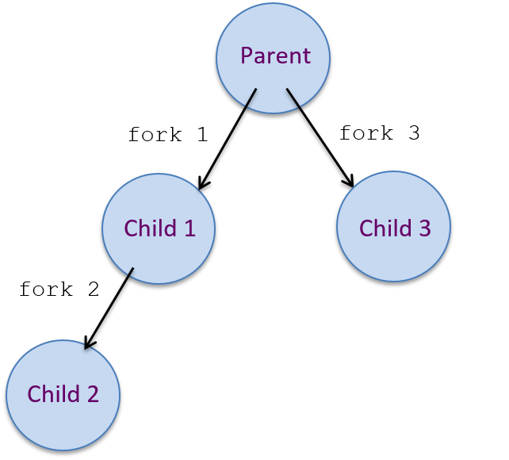

## 13.6. Exercises 

### Exercises for 13.2: Processes {#_exercises_for_13_2_processes .discrete}


1.  Consider the code snippet below with calls to fork (and with error
    handling code removed just for readability sake):


```
    pid_t ret;

    printf("A\n");

    ret = fork();
    if(ret == 0) {
        printf("B\n");

        ret = fork();
        if(ret == 0) {
            printf("C\n");
        }
        printf("D\n");
    } else {
        printf("E\n");

        ret = fork();
        printf("F\n");
    }

    printf("G\n");
```


a.  Draw the process hierarchy created by executing this code.

b.  For each process in the hierarchy, indicate its output sequence (the
    order in which it executes printf's).


#### Solutions {#_solutions .discrete}

**If your browser supports hidden solutions, click here to reveal
them.**

\


1.  For the code snippet:

    
    
    ```
       int ret;

       printf("A\n");
       ret = fork();    // fork 1
       if(ret == 0) {
         printf("B\n");
         ret = fork();  // fork 2
         if(ret == 0) {
           print("C\n");
         }
         printf("D\n");
       } else {
         printf("E\n");
         ret = fork();  // fork 3
         printf("F\n");
      }
      printf("G\n");
    ```
    :::
    

        The process heirarchy created by executing this code (the specific
    fork call that creates each process is annotated on each edge in the
    process heirarchy):
    

    ::: imageblock
    
    
    :::
    

        For each process in the heirarchy, indicate its output sequence
    (which printf's it executes in which order):
    

    
    
        parent: A, E, F, G
        child1: B, D, G
        child2: F, G
        child3: C, D, G
    :::
    


1.  Early Access [Interactive Process
    Questions](https://diveintosystems.org/exercises/dive-into-systems-exercises-16.html)


### Exercises for 13.3: Virtual Memory {#_exercises_for_13_3_virtual_memory .discrete}


2.  Early Access [Interactive Virtual Memory
    Questions](https://diveintosystems.org/exercises/dive-into-systems-exercises-16.html)


