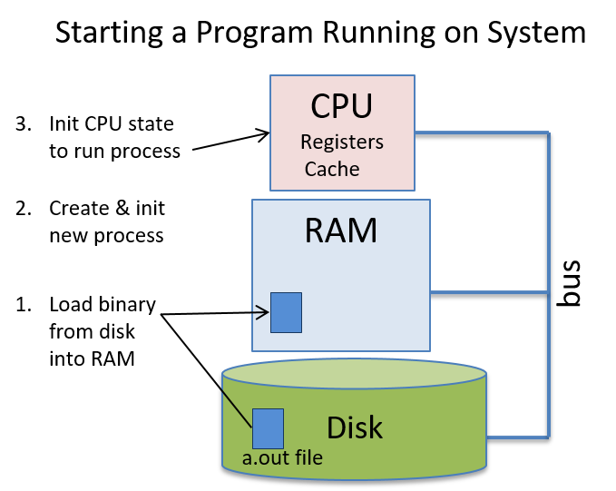
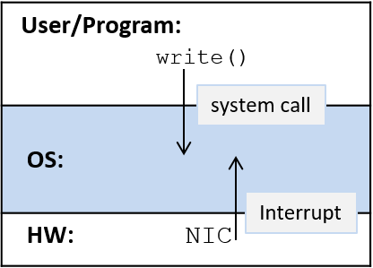
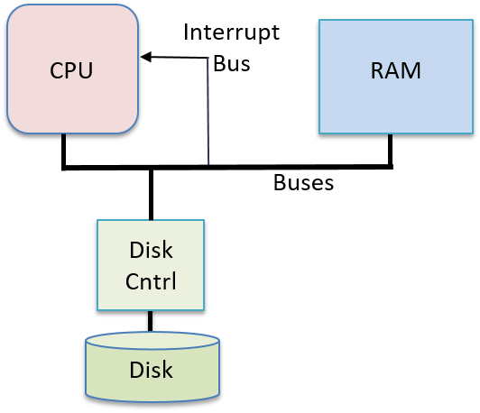
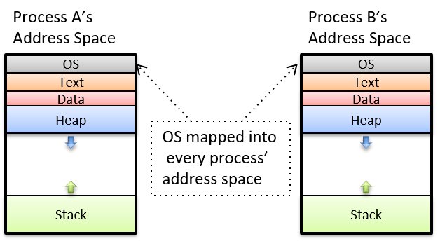

## 13.1. Cách hệ điều hành hoạt động và cách nó chạy

Một phần công việc của **OS** (Operating System – hệ điều hành) là hỗ trợ các chương trình chạy trên hệ thống.  
Để bắt đầu chạy một chương trình trên máy tính, OS sẽ:

1. Cấp phát một phần **RAM** cho chương trình đang chạy.
2. Nạp **binary executable** (tệp thực thi nhị phân) của chương trình từ đĩa vào RAM.
3. Tạo và khởi tạo trạng thái của OS cho **process** (tiến trình) tương ứng với chương trình đang chạy.
4. Khởi tạo CPU để bắt đầu thực thi các lệnh của process (ví dụ: các **CPU register** cần được OS khởi tạo để CPU có thể nạp và thực thi các lệnh của process).

**Hình 1** minh họa các bước này.



**Hình 1.** Các bước OS thực hiện để khởi chạy một chương trình mới trên phần cứng bên dưới.

---

Giống như các chương trình của người dùng, OS cũng là phần mềm chạy trên phần cứng máy tính.  
Tuy nhiên, OS là **system software** (phần mềm hệ thống) đặc biệt, quản lý tất cả tài nguyên hệ thống và triển khai giao diện cho người dùng; nó là thành phần bắt buộc để sử dụng máy tính.  

Vì OS là phần mềm, mã thực thi nhị phân của nó cũng chạy trên phần cứng như bất kỳ chương trình nào khác: dữ liệu và lệnh của nó được lưu trong RAM, và các lệnh được CPU nạp và thực thi giống như lệnh của chương trình người dùng.  
Do đó, để OS chạy, mã thực thi nhị phân của nó cần được nạp vào RAM và CPU phải được khởi tạo để bắt đầu chạy mã của OS.  
Tuy nhiên, vì OS chịu trách nhiệm chạy mã trên phần cứng, nên nó cần một bước hỗ trợ ban đầu để tự khởi động.

---

### 13.1.1. OS Booting

Quá trình OS tự nạp và khởi tạo trên máy tính được gọi là **booting** — OS “tự kéo mình lên bằng dây giày” (*pulls itself up by its bootstraps*), hay *boot* chính nó trên máy tính.  
OS cần một chút hỗ trợ ban đầu để được nạp vào máy tính và bắt đầu chạy mã khởi động (**boot code**).

Để khởi chạy mã OS, một đoạn mã được lưu trong **firmware** (bộ nhớ không mất dữ liệu – nonvolatile memory – trong phần cứng) sẽ chạy khi máy tính vừa bật nguồn.  
**BIOS** (Basic Input/Output System) và **UEFI** (Unified Extensible Firmware Interface) là hai ví dụ của loại firmware này.  

Khi bật nguồn, BIOS hoặc UEFI sẽ chạy và thực hiện đủ các bước khởi tạo phần cứng để nạp **boot block** (khối khởi động) đầu tiên của OS từ đĩa vào RAM, rồi bắt đầu chạy các lệnh trong boot block trên CPU.  
Khi OS bắt đầu chạy, nó sẽ nạp phần còn lại của mình từ đĩa, phát hiện và khởi tạo các tài nguyên phần cứng, đồng thời khởi tạo các cấu trúc dữ liệu và abstraction để hệ thống sẵn sàng cho người dùng.

---

### 13.1.2. Khiến OS thực hiện công việc: Interrupts và Traps

Sau khi OS hoàn tất quá trình boot và khởi tạo hệ thống, nó sẽ **chờ** cho đến khi có việc cần làm.  
Hầu hết các hệ điều hành được triển khai dưới dạng **interrupt-driven system** (hệ thống điều khiển bằng ngắt), nghĩa là OS sẽ không chạy cho đến khi có một tác nhân yêu cầu nó làm việc — OS sẽ được “đánh thức” (bị ngắt khỏi trạng thái chờ) để xử lý yêu cầu.

Các thiết bị ở tầng phần cứng có thể cần OS thực hiện một số tác vụ cho chúng.  
Ví dụ: **network interface card** (NIC – card giao tiếp mạng) là giao diện phần cứng giữa máy tính và mạng.  
Khi NIC nhận dữ liệu qua kết nối mạng, nó sẽ **interrupt** (ngắt) OS để xử lý dữ liệu nhận được (**Hình 2**).  
Ví dụ, OS có thể xác định rằng dữ liệu nhận được từ NIC là một phần của trang web mà trình duyệt web đã yêu cầu; sau đó OS sẽ chuyển dữ liệu từ NIC đến process của trình duyệt web đang chờ.

Các yêu cầu đến OS cũng có thể xuất phát từ ứng dụng người dùng khi chúng cần truy cập tài nguyên được bảo vệ.  
Ví dụ: khi một ứng dụng muốn ghi dữ liệu vào tệp, nó sẽ thực hiện một **system call** tới OS, yêu cầu OS thực hiện thao tác ghi thay cho nó (xem [Hình 2](#FigNICinter)).  
OS sẽ xử lý system call này bằng cách ghi dữ liệu vào tệp được lưu trên đĩa.



**Hình 2.** Trong hệ thống điều khiển bằng ngắt, chương trình ở mức người dùng thực hiện system call, và thiết bị phần cứng phát ra interrupt để khởi tạo hành động của OS.

---

Các interrupt đến từ tầng phần cứng, như khi NIC nhận dữ liệu từ mạng, thường được gọi là **hardware interrupt** hoặc đơn giản là **interrupt**.  
Các interrupt đến từ tầng phần mềm do kết quả của việc thực thi lệnh, như khi một ứng dụng thực hiện system call, thường được gọi là **trap**.  
Nói cách khác, một system call sẽ “trap vào OS”, và OS sẽ xử lý yêu cầu thay cho chương trình ở mức người dùng.

Ngoài ra, **exception** từ cả hai tầng cũng có thể ngắt OS.  
Ví dụ: ổ cứng có thể ngắt OS nếu thao tác đọc thất bại do lỗi block đĩa, và một chương trình ứng dụng có thể gây ra trap tới OS nếu nó thực hiện phép chia cho 0.

---

System call được triển khai bằng các **trap instruction** đặc biệt, được định nghĩa như một phần của **ISA** (Instruction Set Architecture – kiến trúc tập lệnh) của CPU.  
OS gán cho mỗi system call một số định danh duy nhất.  
Khi một ứng dụng muốn gọi system call, nó sẽ đặt số định danh của lời gọi vào một vị trí đã biết (vị trí này phụ thuộc vào ISA) và thực hiện một trap instruction để ngắt OS.  

Trap instruction sẽ khiến CPU dừng thực thi lệnh của chương trình ứng dụng và bắt đầu thực thi lệnh của OS để xử lý trap (chạy **trap handler** của OS).  
Trap handler sẽ đọc số định danh system call do người dùng cung cấp và thực thi phần triển khai tương ứng.

---

Ví dụ về system call `write` trên hệ thống IA32 Linux:

```c
/* C code */
ret = write(fd, buff, size);

# IA32 translation
write:

...            # set up state and parameters for OS to perform write
movl $4, %eax  # load 4 (unique ID for write) into register eax
int  $0x80     # trap instruction: interrupt the CPU and transition to the OS
addl $8, %ebx  # an example instruction after the trap instruction
```

Lệnh đầu tiên (`movl $4, %eax`) đưa số định danh system call cho `write` (4) vào thanh ghi `eax`.  
Lệnh thứ hai (`int $0x80`) kích hoạt trap.  
Khi mã trap handler của OS chạy, nó sẽ dùng giá trị trong thanh ghi `eax` (4) để xác định system call nào đang được gọi và chạy mã xử lý tương ứng (trong trường hợp này là mã xử lý `write`).  
Sau khi OS xử lý xong, nó sẽ tiếp tục thực thi chương trình tại lệnh ngay sau trap instruction (`addl` trong ví dụ này).

---

Không giống như system call (xuất phát từ việc thực thi lệnh của chương trình), **hardware interrupt** được gửi tới CPU qua **interrupt bus**.  
Một thiết bị sẽ đặt một tín hiệu (thường là một số chỉ loại interrupt) lên interrupt bus của CPU (**Hình 3**).  
Khi CPU phát hiện tín hiệu trên interrupt bus, nó sẽ dừng thực thi lệnh của process hiện tại và bắt đầu chạy mã **interrupt handler** của OS.  
Sau khi mã xử lý interrupt của OS chạy xong, OS sẽ tiếp tục thực thi process tại lệnh ứng dụng đang chạy khi interrupt xảy ra.




**Hình 3.** Một thiết bị phần cứng (ổ đĩa) gửi tín hiệu tới CPU qua **interrupt bus** để kích hoạt OS thực thi thay cho nó.

---

Nếu một chương trình người dùng đang chạy trên CPU khi một **interrupt** (hoặc **trap**) xảy ra, CPU sẽ chạy mã **interrupt handler** (hoặc **trap handler**) của OS.  
Khi OS xử lý xong interrupt, nó sẽ tiếp tục thực thi chương trình người dùng bị gián đoạn tại đúng vị trí trước khi bị ngắt.

Vì OS là phần mềm, và mã của nó được nạp vào RAM và chạy trên CPU giống như mã chương trình người dùng, nên OS phải bảo vệ mã và trạng thái của mình khỏi các process thông thường đang chạy trong hệ thống.  
CPU hỗ trợ điều này bằng cách định nghĩa hai **chế độ thực thi**:

1. **User mode**: CPU chỉ thực thi các lệnh ở mức người dùng và chỉ truy cập các vùng bộ nhớ mà OS cho phép.  
   OS thường ngăn CPU ở user mode truy cập vào mã lệnh và dữ liệu của OS.  
   User mode cũng giới hạn các thành phần phần cứng mà CPU có thể truy cập trực tiếp.

2. **Kernel mode**: CPU có thể thực thi bất kỳ lệnh nào và truy cập bất kỳ vùng bộ nhớ nào (bao gồm cả vùng lưu mã lệnh và dữ liệu của OS).  
   Nó cũng có thể truy cập trực tiếp các thành phần phần cứng và thực thi các lệnh đặc biệt.

Khi mã OS chạy trên CPU, hệ thống ở **kernel mode**; khi chương trình người dùng chạy trên CPU, hệ thống ở **user mode**.  
Nếu CPU đang ở user mode và nhận một interrupt, CPU sẽ chuyển sang kernel mode, nạp **interrupt handler routine** và bắt đầu thực thi mã xử lý interrupt của OS.  
Trong kernel mode, OS có thể truy cập phần cứng và các vùng bộ nhớ không được phép trong user mode.  
Khi OS xử lý xong interrupt, nó sẽ khôi phục trạng thái CPU để tiếp tục thực thi mã người dùng tại đúng vị trí bị gián đoạn, rồi trả CPU về user mode (xem [Hình 4](#FigCPUInterrupts)).

---


**Hình 4.** CPU và interrupt. Mã người dùng đang chạy trên CPU bị ngắt (tại thời điểm X trên trục thời gian), và mã xử lý interrupt của OS được thực thi. Sau khi OS xử lý xong interrupt, việc thực thi mã người dùng được tiếp tục (tại thời điểm Y trên trục thời gian).


Trong một hệ thống điều khiển bằng interrupt, interrupt có thể xảy ra bất kỳ lúc nào, nghĩa là OS có thể chuyển từ chạy mã người dùng sang chạy mã xử lý interrupt ở bất kỳ chu kỳ máy nào.  
Một cách để hỗ trợ hiệu quả việc **chuyển ngữ cảnh thực thi** từ user mode sang kernel mode là cho phép kernel chạy trong **execution context** của mọi process trong hệ thống.

Khi boot, OS sẽ nạp mã của mình vào một vị trí cố định trong RAM, vị trí này được **map** vào phần trên cùng của **address space** của mọi process (xem **Hình 5**), và khởi tạo một thanh ghi CPU với địa chỉ bắt đầu của hàm xử lý interrupt của OS.  
Khi có interrupt, CPU sẽ chuyển sang kernel mode và thực thi các lệnh của mã xử lý interrupt của OS, vốn có thể truy cập ở các địa chỉ trên cùng trong address space của mọi process.  

Vì mọi process đều có OS được map vào cùng một vị trí ở trên cùng của address space, mã xử lý interrupt của OS có thể chạy nhanh trong ngữ cảnh của bất kỳ process nào đang chạy trên CPU khi interrupt xảy ra.  
Mã OS này chỉ có thể được truy cập ở kernel mode, giúp bảo vệ OS khỏi các truy cập ở user mode; trong quá trình thực thi bình thường, một process chạy ở user mode và không thể đọc hoặc ghi vào các địa chỉ của OS được map vào phần trên cùng của address space của nó.

---



**Hình 5.** Không gian địa chỉ của process: kernel của OS được map vào phần trên cùng của address space của mọi process.

---

Mặc dù việc map mã OS vào address space của mọi process giúp thực thi mã kernel nhanh khi có interrupt, nhưng nhiều bộ xử lý hiện đại có các đặc điểm khiến cơ chế này bộc lộ lỗ hổng bảo mật đối với kernel.  
Kể từ thông báo vào tháng 1 năm 2018 về lỗ hổng phần cứng **Meltdown**¹, các hệ điều hành đã tách riêng bộ nhớ kernel và bộ nhớ của chương trình người dùng để bảo vệ chống lại lỗ hổng này, nhưng điều đó cũng khiến việc chuyển sang kernel mode để xử lý interrupt kém hiệu quả hơn.

---

### 13.1.3. Tài liệu tham khảo

1. Meltdown and Spectre.  
   [https://meltdownattack.com/](https://meltdownattack.com/)

