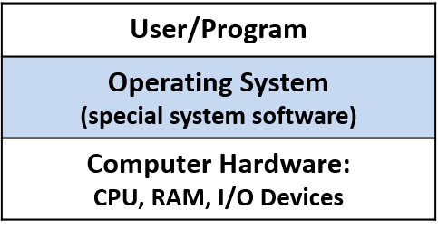
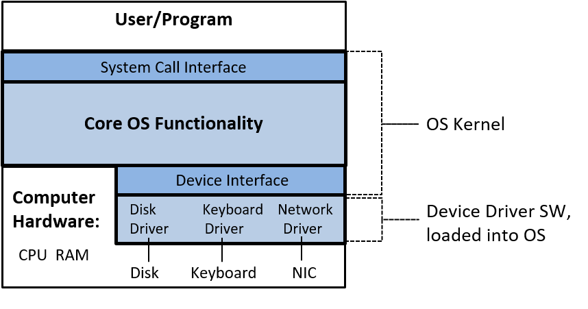

## 13. Hệ điều hành (The Operating System)

**Operating system** (OS – hệ điều hành) là một lớp **system software** (phần mềm hệ thống) đặc biệt, nằm giữa **computer hardware** (phần cứng máy tính) và **application programs** (chương trình ứng dụng) đang chạy trên máy tính (xem **Hình 1**).  
Phần mềm OS tồn tại liên tục trên máy tính, từ khi bật nguồn cho đến khi tắt máy.  
Mục đích chính của nó là **quản lý** các thành phần phần cứng bên dưới để chạy hiệu quả các **program workload** (khối lượng công việc của chương trình) và làm cho máy tính **dễ sử dụng**.

**Hình 1.** OS là phần mềm hệ thống đặc biệt nằm giữa người dùng và phần cứng. Nó quản lý phần cứng máy tính và triển khai các **abstraction** (trừu tượng hóa) để giúp phần cứng dễ sử dụng hơn.

Một trong những cách OS giúp phần cứng máy tính dễ sử dụng là hỗ trợ khởi chạy các chương trình trên máy tính.  
Hãy xem điều gì xảy ra khi người dùng nhấp đúp vào một biểu tượng hoặc gõ tên tệp thực thi của chương trình tại **shell prompt** (ví dụ: `./a.out`) để khởi chạy chương trình trên hệ thống.  
OS sẽ xử lý toàn bộ chi tiết của thao tác này, chẳng hạn như nạp chương trình từ đĩa vào RAM và khởi tạo CPU để bắt đầu chạy các lệnh của chương trình; OS ẩn khỏi người dùng những hành động mức thấp này, vốn là cần thiết để chạy chương trình trên máy tính.

Một ví dụ về cách OS sử dụng hiệu quả tài nguyên hệ thống là triển khai **multiprogramming** (đa chương trình), nghĩa là cho phép nhiều hơn một chương trình chạy trên máy tính tại cùng một thời điểm.  
Multiprogramming không nhất thiết có nghĩa là tất cả các chương trình đều chạy đồng thời trên phần cứng.  
Trên thực tế, tập hợp các chương trình đang chạy trong hệ thống thường lớn hơn nhiều so với số lõi CPU.  
Thay vào đó, nó có nghĩa là OS chia sẻ tài nguyên phần cứng, bao gồm CPU, giữa nhiều chương trình đang chạy.  
Ví dụ: khi một chương trình cần dữ liệu đang nằm trên đĩa, OS có thể đưa một chương trình khác lên CPU trong khi chương trình đầu tiên chờ dữ liệu.  
Nếu không có multiprogramming, CPU sẽ rảnh rỗi bất cứ khi nào chương trình đang chạy truy cập các thiết bị phần cứng chậm hơn.  

Để hỗ trợ multiprogramming, OS cần triển khai một abstraction của chương trình đang chạy, gọi là **process** (tiến trình).  
Abstraction process cho phép OS quản lý tập hợp nhiều chương trình đang chạy trong hệ thống tại bất kỳ thời điểm nào.

Một số ví dụ về hệ điều hành bao gồm: **Microsoft Windows**, **Apple macOS** và **iOS**, **Oracle Solaris**, và các biến thể **Unix** mã nguồn mở như **OpenBSD** và **Linux**.  
Trong cuốn sách này, chúng ta sử dụng các ví dụ trên Linux.  
Tuy nhiên, tất cả các hệ điều hành đa dụng khác đều triển khai các chức năng tương tự, dù đôi khi theo những cách khác nhau.

### Kernel

Thuật ngữ **operating system** thường được dùng để chỉ một tập hợp lớn phần mềm hệ thống thực hiện một số dạng quản lý tài nguyên và triển khai các abstraction “dễ sử dụng” của hệ thống bên dưới.  
Trong chương này, chúng ta tập trung vào **kernel** của hệ điều hành; do đó, khi chỉ nói **OS**, ta đang đề cập đến **OS kernel**.

**OS kernel** triển khai các chức năng cốt lõi của OS — những chức năng cần thiết cho bất kỳ việc sử dụng hệ thống nào.  
Các chức năng này bao gồm:

- Quản lý tầng phần cứng máy tính để chạy chương trình.
- Triển khai và quản lý các abstraction của OS cung cấp cho người dùng hệ thống (ví dụ: **file** là một abstraction của OS trên dữ liệu lưu trữ).
- Triển khai các **interface** (giao diện) tới tầng ứng dụng người dùng và tới tầng thiết bị phần cứng.

Kernel triển khai các **mechanism** (cơ chế) để cho phép phần cứng chạy chương trình và triển khai các abstraction như process.  
**Mechanism** là phần “làm thế nào” của chức năng OS.  
Kernel cũng triển khai các **policy** (chính sách) để quản lý hiệu quả phần cứng và điều khiển các abstraction của nó.  
**Policy** quyết định phần “cái gì”, “khi nào” và “cho ai” của chức năng OS.  
Ví dụ: một mechanism triển khai việc khởi tạo CPU để chạy lệnh từ một process cụ thể, còn policy sẽ quyết định process nào được chạy tiếp theo trên CPU.

Kernel triển khai **system call interface** (giao diện lời gọi hệ thống) cho người dùng hệ thống.  
Người dùng và chương trình tương tác với OS thông qua system call interface này.  
Ví dụ: nếu một chương trình muốn biết thời gian hiện tại trong ngày, nó có thể lấy thông tin đó từ OS bằng cách gọi system call `gettimeofday`.

Kernel cũng cung cấp **device interface** (giao diện thiết bị) để tương tác với phần cứng.  
Thông thường, các thiết bị I/O như **HDD** (ổ cứng), bàn phím, và **SSD** (ổ thể rắn) tương tác với kernel thông qua giao diện này.  
Các thiết bị này đi kèm với **device driver** (trình điều khiển thiết bị) đặc biệt, chạy trong OS và xử lý việc truyền dữ liệu tới hoặc từ thiết bị.  
Device driver tương tác với OS thông qua device interface; một thiết bị mới có thể được thêm vào hệ thống bằng cách nạp mã device driver của nó (được viết tuân theo device interface của OS) vào OS.  
Kernel trực tiếp quản lý các thiết bị phần cứng khác như CPU và RAM.  

**Hình 2** cho thấy lớp OS kernel nằm giữa ứng dụng người dùng và phần cứng máy tính, bao gồm cả giao diện lập trình cho người dùng và giao diện thiết bị phần cứng.

**Hình 2.** OS kernel: chức năng cốt lõi của OS cần thiết để sử dụng hệ thống và hỗ trợ sự phối hợp giữa thiết bị I/O và người dùng hệ thống.

Trong phần còn lại của chương này, chúng ta sẽ xem xét vai trò của OS trong việc chạy chương trình và quản lý hiệu quả tài nguyên hệ thống.  
Phần thảo luận chủ yếu tập trung vào **mechanism** (cách thức) của chức năng OS và việc triển khai hai abstraction chính của OS:

- **Process**: một chương trình đang chạy.
- **Virtual memory**: một góc nhìn về không gian bộ nhớ của process, được trừu tượng hóa khỏi bộ nhớ vật lý bên dưới trong RAM hoặc bộ nhớ phụ.
