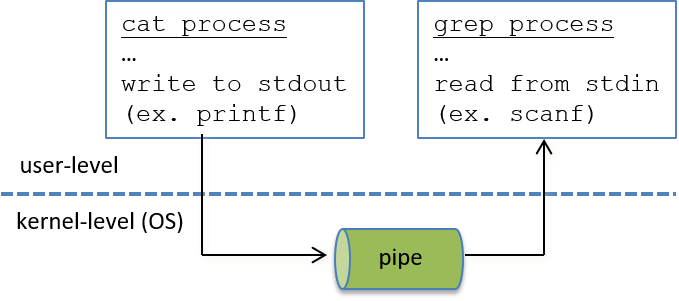

### 13.4.2. Truyền thông điệp (Message Passing)

Một cách để các **process** (tiến trình) với **private virtual address space** (không gian địa chỉ ảo riêng) có thể giao tiếp với nhau là thông qua **message passing** — gửi và nhận thông điệp qua lại.  
Message passing cho phép các chương trình trao đổi dữ liệu tùy ý, thay vì chỉ một tập nhỏ các thông điệp được định nghĩa sẵn như **signal** hỗ trợ.  
Hệ điều hành thường triển khai một số loại **message passing abstraction** (trừu tượng hóa truyền thông điệp) khác nhau mà các process có thể sử dụng để giao tiếp.

Mô hình **message passing** cho **interprocess communication** (IPC – giao tiếp liên tiến trình) gồm ba phần:

1. **Process** yêu cầu OS cấp phát một loại **message channel** (kênh truyền thông điệp).  
   Ví dụ: *pipe* cho giao tiếp một chiều, *socket* cho giao tiếp hai chiều.  
   Có thể cần thêm các bước thiết lập kết nối để cấu hình message channel.
2. Các process sử dụng message channel để gửi và nhận thông điệp với nhau.
3. Khi không còn sử dụng, các process đóng đầu của message channel.

---

**Pipe** là một kênh giao tiếp một chiều cho hai process chạy trên cùng một máy.  
Một chiều nghĩa là một đầu của pipe chỉ dùng để gửi thông điệp (ghi vào), và đầu còn lại chỉ dùng để nhận thông điệp (đọc ra).  
Pipe thường được dùng trong các lệnh shell để gửi **output** của một process làm **input** cho process khác.

Ví dụ, xem lệnh sau được nhập tại **bash shell prompt**, tạo một pipe giữa hai process (`cat` xuất nội dung tệp `foo.c` và pipe (`|`) chuyển hướng output đó làm input cho lệnh `grep` tìm chuỗi `"factorial"` trong dữ liệu đầu vào):

```bash
$ cat foo.c | grep factorial
```

Để thực thi lệnh này, process shell gọi **system call** `pipe` để yêu cầu OS tạo một pipe.  
Pipe này sẽ được dùng bởi hai **child process** (`cat` và `grep`) của shell.  
Chương trình shell thiết lập `stdout` của process `cat` ghi vào đầu ghi của pipe, và `stdin` của process `grep` đọc từ đầu đọc của pipe.  
Nhờ vậy, khi các child process được tạo và chạy, output của `cat` sẽ được gửi làm input cho `grep` (xem **Hình 1**).



**Hình 1.** Pipe là kênh giao tiếp một chiều cho các process trên cùng hệ thống. Trong ví dụ này, process `cat` gửi dữ liệu cho process `grep` bằng cách ghi vào đầu ghi của pipe. Process `grep` nhận dữ liệu này bằng cách đọc từ đầu đọc của pipe.

---

Trong khi pipe chỉ truyền dữ liệu từ một process sang process khác theo một chiều, các abstraction message passing khác cho phép giao tiếp hai chiều.  
**Socket** là một kênh giao tiếp hai chiều, nghĩa là mỗi đầu của socket có thể dùng để gửi và nhận thông điệp.  
Socket có thể được dùng bởi các process giao tiếp chạy trên cùng một máy hoặc trên các máy khác nhau được kết nối qua mạng (xem **Hình 2**).  

Các máy tính này có thể được kết nối qua **LAN** (Local Area Network – mạng cục bộ), kết nối các máy trong một khu vực nhỏ, ví dụ như mạng của một khoa khoa học máy tính trong trường đại học.  
Các process giao tiếp cũng có thể nằm trên các LAN khác nhau, được kết nối với nhau qua Internet.  
Chỉ cần tồn tại một đường kết nối mạng giữa hai máy, các process có thể dùng socket để giao tiếp.


**Hình 2.** Socket là kênh giao tiếp hai chiều, có thể được dùng bởi các process trên các máy khác nhau kết nối qua mạng.

---

Vì mỗi máy tính là một hệ thống riêng (phần cứng và OS), và OS trên một máy không biết hoặc quản lý tài nguyên của máy khác, **message passing** là cách duy nhất để các process trên các máy khác nhau giao tiếp.  
Để hỗ trợ loại giao tiếp này, OS cần triển khai một **message passing protocol** (giao thức truyền thông điệp) chung để gửi và nhận thông điệp qua mạng.  

**TCP/IP** là một ví dụ về giao thức truyền thông điệp có thể dùng để gửi thông điệp qua Internet.  
Khi một process muốn gửi thông điệp cho process khác, nó sẽ gọi system call `send`, truyền cho OS một socket để gửi, **message buffer** (bộ đệm chứa thông điệp), và có thể kèm thêm thông tin về thông điệp hoặc người nhận.  
OS sẽ đóng gói thông điệp trong message buffer và gửi nó qua mạng tới máy kia.  
Khi OS nhận được thông điệp từ mạng, nó sẽ giải nén thông điệp và chuyển cho process trên hệ thống của mình đã yêu cầu nhận thông điệp.  
Process này có thể đang ở trạng thái **Blocked** chờ thông điệp đến; khi nhận được thông điệp, process sẽ chuyển sang trạng thái **Ready** để chạy lại.

---

Có nhiều abstraction phần mềm hệ thống được xây dựng trên message passing để ẩn chi tiết truyền thông điệp khỏi lập trình viên.  
Tuy nhiên, bất kỳ giao tiếp nào giữa các process trên các máy khác nhau đều phải sử dụng message passing ở mức thấp nhất (giao tiếp qua **shared memory** hoặc **signal** là không khả thi cho các process chạy trên các hệ thống khác nhau).  

Trong [Chương Hệ thống song song](../C15-Parallel/index.html#_looking_ahead_other_parallel_systems_and_parallel_programming_models), chúng ta sẽ thảo luận chi tiết hơn về message passing và các abstraction được xây dựng trên nó.