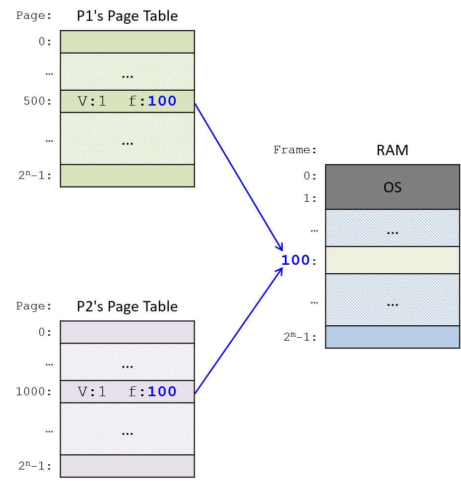

### 13.4.3. Bộ nhớ dùng chung (Shared Memory)

**Message passing** (truyền thông điệp) sử dụng **socket** rất hữu ích cho giao tiếp hai chiều giữa các **process** (tiến trình) chạy trên cùng một máy và giữa các process chạy trên các máy khác nhau.  
Tuy nhiên, khi hai process chạy trên cùng một máy, chúng có thể tận dụng tài nguyên hệ thống dùng chung để giao tiếp hiệu quả hơn so với việc sử dụng message passing.

Ví dụ, một **operating system** (hệ điều hành) có thể hỗ trợ **interprocess communication** (IPC – giao tiếp liên tiến trình) bằng cách cho phép các process chia sẻ toàn bộ hoặc một phần **virtual address space** (không gian địa chỉ ảo) của chúng.  
Một process có thể đọc và ghi giá trị vào phần bộ nhớ được chia sẻ trong address space của mình để giao tiếp với các process khác cùng chia sẻ vùng bộ nhớ đó.

Một cách để OS triển khai chia sẻ một phần address space là thiết lập các **entry** trong **page table** của hai hoặc nhiều process để ánh xạ tới cùng một **physical frame** (khung bộ nhớ vật lý).  
**Hình 1** minh họa một ví dụ ánh xạ như vậy.  
Để giao tiếp, một process ghi giá trị vào một địa chỉ trên **shared page** (trang bộ nhớ dùng chung), và process khác sau đó đọc giá trị này.

**Hình 1.** OS có thể hỗ trợ chia sẻ các trang trong virtual address space bằng cách thiết lập các entry trong page table của các process chia sẻ để trỏ tới cùng một số hiệu physical frame (ví dụ: frame 100).  
Lưu ý rằng các process không cần phải sử dụng cùng một địa chỉ ảo để tham chiếu tới trang bộ nhớ vật lý được chia sẻ.

---

Nếu OS hỗ trợ **partial shared memory** (bộ nhớ dùng chung một phần), nó sẽ triển khai một **interface** (giao diện) cho lập trình viên để tạo và gắn (attach) vào các trang bộ nhớ dùng chung (hoặc vùng/segment bộ nhớ dùng chung).  
Trong các hệ thống Unix, **system call** `shmget` sẽ tạo hoặc gắn vào một **shared memory segment** (đoạn bộ nhớ dùng chung).  
Mỗi shared memory segment tương ứng với một tập liên tiếp các địa chỉ ảo, có ánh xạ vật lý được chia sẻ với các process khác gắn vào cùng segment đó.

---

Hệ điều hành cũng thường hỗ trợ chia sẻ toàn bộ virtual address space.  
**Thread** (luồng) là abstraction của OS về một **execution control flow** (luồng điều khiển thực thi).  
Một process có một thread duy nhất trong một virtual address space duy nhất.  
Một **multithreaded process** (tiến trình đa luồng) có nhiều thread thực thi đồng thời trong cùng một virtual address space dùng chung — tất cả các thread chia sẻ toàn bộ virtual address space của process chứa chúng.

Các thread có thể dễ dàng chia sẻ trạng thái thực thi bằng cách đọc và ghi vào các vị trí bộ nhớ dùng chung trong address space chung.  
Ví dụ: nếu một thread thay đổi giá trị của một biến toàn cục, tất cả các thread khác sẽ thấy kết quả thay đổi đó.

---

Trên các hệ thống **multiprocessor** (đa bộ xử lý) — **SMP** (Symmetric Multiprocessing) hoặc **multicore** (đa lõi) — các thread riêng lẻ của một multithreaded process có thể được lập lịch để chạy đồng thời (*in parallel*) trên nhiều lõi.  
Trong [Chương Shared Memory](../C14-SharedMemory/index.html#_leveraging_shared_memory_in_the_multicore_era), chúng ta sẽ thảo luận chi tiết hơn về thread và lập trình đa luồng song song.