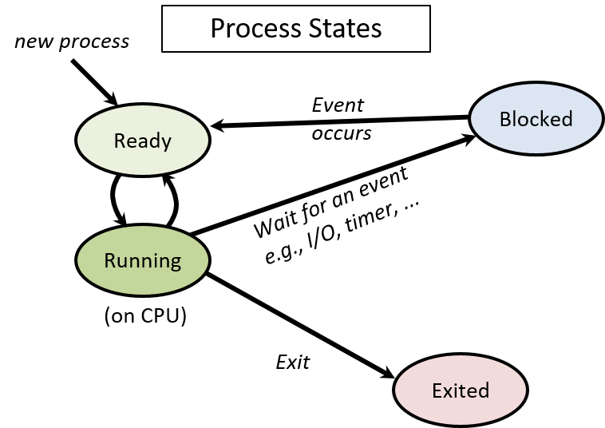
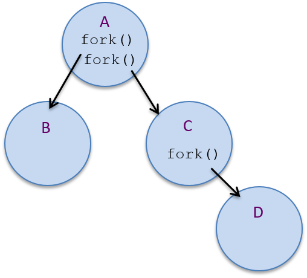
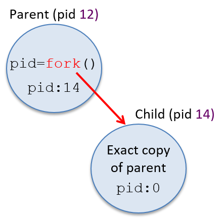
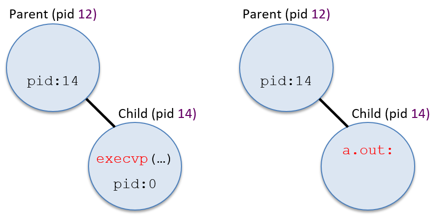
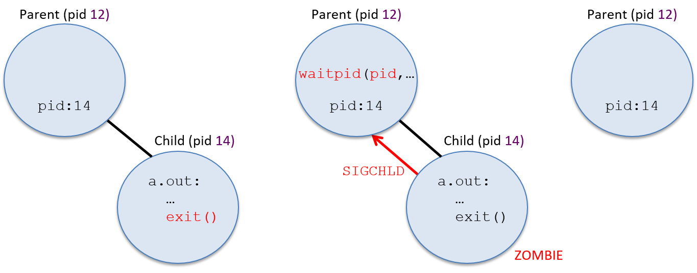
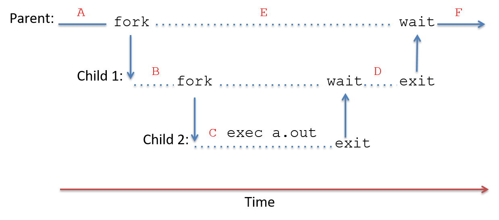

## 13.2. Processes (Tiến trình)

Một trong những **abstraction** (trừu tượng hóa) chính mà **operating system** (OS – hệ điều hành) triển khai là **process** (tiến trình).  
Một process đại diện cho một **instance** (phiên bản) của một chương trình đang chạy trong hệ thống, bao gồm:

- **Binary executable code** (mã thực thi nhị phân) của chương trình.
- **Data** (dữ liệu) của chương trình.
- **Execution context** (ngữ cảnh thực thi).

**Context** theo dõi quá trình thực thi của chương trình bằng cách lưu giữ các giá trị **register** (thanh ghi), vị trí **stack**, và lệnh mà nó đang thực thi.

Process là một abstraction cần thiết trong các hệ thống **multiprogramming** (đa chương trình), vốn hỗ trợ nhiều process tồn tại đồng thời trong hệ thống.  
Abstraction process được OS sử dụng để theo dõi từng instance riêng biệt của các chương trình đang chạy trong hệ thống, và để quản lý việc sử dụng tài nguyên hệ thống của chúng.

OS cung cấp cho mỗi process một abstraction “**lone view**” (cái nhìn riêng biệt) về hệ thống.  
Nghĩa là, OS cô lập các process với nhau và tạo cho mỗi process ảo giác rằng nó đang kiểm soát toàn bộ máy tính.  
Trên thực tế, OS hỗ trợ nhiều process hoạt động đồng thời và quản lý việc chia sẻ tài nguyên giữa chúng.  
OS ẩn khỏi người dùng các chi tiết về việc chia sẻ và truy cập tài nguyên hệ thống, đồng thời bảo vệ các process khỏi tác động của các process khác đang chạy trong hệ thống.

Ví dụ: một người dùng có thể đồng thời chạy hai instance của chương trình Unix shell cùng với một trình duyệt web trên máy tính.  
OS sẽ tạo ra ba process tương ứng với ba chương trình đang chạy này:  
- Một process cho mỗi lần thực thi riêng biệt của Unix shell.  
- Một process cho trình duyệt web.

OS xử lý việc chuyển đổi giữa ba process này khi chúng chạy trên CPU, và đảm bảo rằng khi một process chạy trên CPU, chỉ trạng thái thực thi và tài nguyên hệ thống được cấp cho process đó mới có thể được truy cập.

### 13.2.1. Multiprogramming và Context Switching

**Multiprogramming** cho phép OS sử dụng hiệu quả tài nguyên phần cứng.  
Ví dụ: khi một process đang chạy trên CPU cần truy cập dữ liệu hiện đang nằm trên đĩa, thay vì để CPU rảnh rỗi chờ dữ liệu được đọc vào bộ nhớ, OS có thể chuyển CPU cho một process khác chạy trong khi thao tác đọc dữ liệu của process ban đầu được xử lý bởi đĩa.  

Bằng cách sử dụng multiprogramming, OS có thể giảm bớt tác động của **memory hierarchy** (hệ thống phân cấp bộ nhớ) lên workload của chương trình, bằng cách giữ cho CPU luôn bận rộn thực thi một số process trong khi các process khác đang chờ truy cập dữ liệu ở các tầng thấp hơn của bộ nhớ.

Các hệ điều hành đa dụng thường triển khai **timesharing** (chia sẻ thời gian), là một dạng multiprogramming trong đó OS lập lịch để mỗi process lần lượt thực thi trên CPU trong một khoảng thời gian ngắn (gọi là **time slice** hoặc **quantum**).  
Khi một process hoàn thành time slice của mình trên CPU, OS sẽ loại process đó ra khỏi CPU và cho process khác chạy.  
Hầu hết các hệ thống định nghĩa time slice dài vài **millisecond** (10^-3 giây), đây là một khoảng thời gian dài đối với chu kỳ CPU nhưng con người không nhận thấy được.

Hệ thống timesharing càng củng cố “lone view” của máy tính đối với người dùng; vì mỗi process thường xuyên được thực thi trên CPU trong những khoảng thời gian ngắn, nên việc chúng chia sẻ CPU thường không thể nhận ra đối với người dùng.  
Chỉ khi hệ thống bị tải rất nặng, người dùng mới có thể nhận thấy tác động của các process khác trong hệ thống.  

Lệnh Unix `ps -A` liệt kê tất cả các process đang chạy trong hệ thống — bạn có thể sẽ ngạc nhiên về số lượng process này.  
Lệnh `top` cũng hữu ích để xem trạng thái hệ thống khi nó đang chạy, bằng cách hiển thị tập hợp các process hiện đang sử dụng nhiều tài nguyên hệ thống nhất (như thời gian CPU và dung lượng bộ nhớ).

Trong các hệ thống multiprogramming và timesharing, các process chạy **concurrently** (đồng thời), nghĩa là quá trình thực thi của chúng **chồng lấn về thời gian**.  
Ví dụ: OS có thể bắt đầu chạy process A trên CPU, sau đó chuyển sang chạy process B một lúc, rồi quay lại chạy tiếp process A.  
Trong kịch bản này, process A và B chạy đồng thời vì việc thực thi của chúng trên CPU chồng lấn nhau do OS chuyển đổi qua lại giữa hai process.

#### Context Switching

**Mechanism** (cơ chế) đằng sau multiprogramming xác định cách OS hoán đổi một process đang chạy trên CPU với process khác.  
**Policy** (chính sách) của multiprogramming điều khiển việc lập lịch CPU, tức là chọn process nào từ tập các process ứng viên sẽ được dùng CPU tiếp theo và trong bao lâu.  
Ở đây, chúng ta tập trung chủ yếu vào **mechanism** của việc triển khai multiprogramming.  
Các giáo trình hệ điều hành sẽ trình bày chi tiết hơn về các **scheduling policy** (chính sách lập lịch).

OS thực hiện **context switching** (chuyển ngữ cảnh), hay hoán đổi trạng thái process trên CPU, như là cơ chế chính đằng sau multiprogramming (và timesharing).  
Có hai bước chính để thực hiện một CPU context switch:

1. **OS lưu context** của process hiện đang chạy trên CPU, bao gồm tất cả giá trị register (PC, stack pointer, general-purpose register, condition code, v.v.), trạng thái bộ nhớ, và một số trạng thái khác (ví dụ: trạng thái của các tài nguyên hệ thống mà nó đang sử dụng, như file đang mở).

2. **OS khôi phục context** đã lưu của một process khác lên CPU và bắt đầu cho CPU chạy process này, tiếp tục thực thi từ lệnh mà nó đã dừng trước đó.


Một phần của **context switching** (chuyển ngữ cảnh) có thể khiến bạn nghĩ là “bất khả thi” đó là: mã của OS thực hiện context switching phải chạy trên CPU **trong khi** nó lưu (hoặc khôi phục) **execution context** (ngữ cảnh thực thi) của một process từ (hoặc lên) CPU.  
Các lệnh của mã context switching cần sử dụng **CPU hardware register** (thanh ghi phần cứng của CPU) để thực thi, nhưng giá trị các thanh ghi của process đang bị chuyển ra khỏi CPU lại cần được chính mã context switching lưu lại.  
Phần cứng máy tính cung cấp một số hỗ trợ để điều này khả thi.

Khi khởi động (**boot time**), OS khởi tạo phần cứng, bao gồm cả việc khởi tạo trạng thái CPU, để khi CPU chuyển sang **kernel mode** do một **interrupt**, mã **interrupt handler** của OS sẽ bắt đầu thực thi và trạng thái thực thi của process bị ngắt được bảo vệ khỏi việc bị ghi đè.  

Phần cứng máy tính và OS phối hợp thực hiện một phần việc lưu ban đầu **user-level execution context** (ngữ cảnh thực thi ở mức người dùng), đủ để mã OS có thể chạy trên CPU mà không làm mất trạng thái thực thi của process bị ngắt.  

Ví dụ: các giá trị thanh ghi của process bị ngắt cần được lưu lại để khi process chạy lại trên CPU, nó có thể tiếp tục từ đúng vị trí trước đó, sử dụng các giá trị thanh ghi của mình.  
Tùy thuộc vào hỗ trợ phần cứng, việc lưu giá trị thanh ghi của process ở mức người dùng có thể được thực hiện hoàn toàn bởi phần cứng, hoặc gần như hoàn toàn bằng phần mềm như là phần đầu tiên của mã xử lý ngắt trong kernel.  
Tối thiểu, giá trị **program counter (PC)** của process cần được lưu lại để không bị mất khi địa chỉ của kernel interrupt handler được nạp vào PC.

Khi OS bắt đầu chạy, nó thực thi toàn bộ mã context switching của process, lưu toàn bộ trạng thái thực thi của process đang chạy trên CPU và khôi phục trạng thái thực thi đã lưu của một process khác lên CPU.  
Vì OS chạy ở kernel mode, nó có thể truy cập bất kỳ phần nào của bộ nhớ máy tính, thực thi các lệnh đặc quyền và truy cập bất kỳ thanh ghi phần cứng nào.  

Do đó, mã context switching của OS có thể truy cập và lưu trạng thái thực thi CPU của bất kỳ process nào vào bộ nhớ, và có thể khôi phục từ bộ nhớ trạng thái thực thi của bất kỳ process nào lên CPU.  
Mã context switching của OS kết thúc bằng việc thiết lập CPU để thực thi trạng thái thực thi đã khôi phục của process và chuyển CPU sang user mode.  
Khi đã chuyển sang user mode, CPU sẽ thực thi các lệnh và sử dụng trạng thái thực thi từ process mà OS vừa chuyển lên CPU.

### 13.2.2. Process State (Trạng thái tiến trình)

Trong các hệ thống **multiprogrammed** (đa chương trình), OS phải theo dõi và quản lý nhiều process tồn tại trong hệ thống tại bất kỳ thời điểm nào.  
OS duy trì thông tin về mỗi process, bao gồm:

- **Process id (PID)**: định danh duy nhất cho một process.  
  Lệnh `ps` liệt kê thông tin về các process trong hệ thống, bao gồm cả PID của chúng.

- Thông tin **address space** (không gian địa chỉ) của process.

- **Execution state** (trạng thái thực thi) của process (ví dụ: giá trị CPU register, vị trí stack).

- Tập hợp tài nguyên được cấp phát cho process (ví dụ: các file đang mở).

- **Process state** (trạng thái tiến trình) hiện tại, là giá trị xác định khả năng được thực thi trên CPU của process.

Trong suốt vòng đời của mình, một process sẽ di chuyển qua nhiều trạng thái khác nhau, tương ứng với các mức độ khác nhau về khả năng được thực thi.  
Một cách OS sử dụng process state là để xác định tập hợp các process ứng viên cho việc lập lịch trên CPU.

Các trạng thái thực thi của process gồm:

- **Ready**: Process có thể chạy trên CPU nhưng hiện chưa được lập lịch (là ứng viên để được context switch lên CPU).  
  Khi một process mới được OS tạo và khởi tạo, nó sẽ vào trạng thái *ready* (sẵn sàng để CPU bắt đầu thực thi lệnh đầu tiên).  
  Trong hệ thống timesharing, nếu một process bị context switch ra khỏi CPU vì hết time slice, nó cũng được đưa vào trạng thái *ready* (sẵn sàng để CPU thực thi lệnh tiếp theo, nhưng phải chờ đến lượt được lập lịch lại).

- **Running**: Process đang được lập lịch trên CPU và đang thực thi lệnh.

- **Blocked**: Process đang chờ một sự kiện nào đó trước khi có thể tiếp tục thực thi.  
  Ví dụ: process đang chờ dữ liệu được đọc từ đĩa.  
  Các process ở trạng thái *blocked* không phải là ứng viên để lập lịch trên CPU.  
  Khi sự kiện mà process đang chờ xảy ra, process sẽ chuyển sang trạng thái *ready* (sẵn sàng chạy lại).

- **Exited**: Process đã thoát nhưng vẫn cần được loại bỏ hoàn toàn khỏi hệ thống.  
  Một process thoát khi hoàn thành việc thực thi chương trình, hoặc thoát do lỗi (ví dụ: chia cho 0), hoặc nhận yêu cầu kết thúc từ process khác.  
  Process đã thoát sẽ không bao giờ chạy lại, nhưng vẫn tồn tại trong hệ thống cho đến khi hoàn tất việc dọn dẹp liên quan đến trạng thái thực thi của nó.

**Hình 1** minh họa vòng đời của một process trong hệ thống, cho thấy cách nó di chuyển giữa các trạng thái khác nhau.  
Lưu ý các mũi tên biểu thị sự chuyển đổi từ trạng thái này sang trạng thái khác.  
Ví dụ: một process có thể vào trạng thái *Ready* theo ba cách:

1. Được OS tạo mới.  
2. Đang *blocked* chờ sự kiện và sự kiện xảy ra.  
3. Đang chạy trên CPU nhưng hết time slice, OS context switch nó ra để nhường CPU cho một process *Ready* khác.




**Hình 1.** Các trạng thái của một process trong suốt vòng đời của nó

> **Thời gian chạy của process (Process Runtime)**

Lập trình viên thường sử dụng **thời gian hoàn thành** của một process như một thước đo để đánh giá hiệu năng của nó.  
Đối với các chương trình **noninteractive** (không tương tác), thời gian chạy nhanh hơn thường cho thấy một bản cài đặt tốt hơn hoặc tối ưu hơn.  
Ví dụ: khi so sánh hai chương trình tính **prime factors** (thừa số nguyên tố) của một số lớn, chương trình nào hoàn thành đúng nhiệm vụ nhanh hơn sẽ được ưu tiên.

Có hai cách đo khác nhau về **thời gian chạy** của một process:

- Cách thứ nhất là **tổng wall time** (hay **wall-clock time**).  
  Wall time là khoảng thời gian từ khi bắt đầu đến khi hoàn thành một process — tức là thời gian trôi qua từ lúc process bắt đầu cho đến khi kết thúc, được đo bằng một chiếc đồng hồ treo tường.  
  Wall time bao gồm:
  - Thời gian process ở trạng thái **Running** (đang chạy) và thực thi trên CPU.
  - Thời gian process ở trạng thái **Blocked** (bị chặn) chờ một sự kiện như I/O.
  - Thời gian process ở trạng thái **Ready** (sẵn sàng) chờ đến lượt được lập lịch để chạy trên CPU.  

  Trong các hệ thống **multiprogrammed** và **timeshared**, wall time của một process có thể chậm hơn do các process khác chạy đồng thời và chia sẻ tài nguyên hệ thống.

- Cách thứ hai là **tổng CPU time** (hay **process time**).  
  CPU time chỉ đo lượng thời gian process ở trạng thái **Running** và thực thi lệnh trên CPU.  
  CPU time **không** bao gồm thời gian process ở trạng thái **Blocked** hoặc **Ready**.  
  Do đó, tổng CPU time của một process **không bị ảnh hưởng** bởi các process khác chạy đồng thời trên hệ thống.

### 13.2.3. Tạo (và hủy) process

OS tạo một process mới khi một process hiện có thực hiện **system call** yêu cầu tạo process.  
Trong Unix, system call **fork** tạo ra một process mới.  
Process gọi `fork` là **parent process** (tiến trình cha) và process mới được tạo là **child process** (tiến trình con) của nó.  

Ví dụ: nếu bạn chạy `a.out` trong shell, process shell sẽ gọi system call `fork` để yêu cầu OS tạo một child process mới dùng để chạy chương trình `a.out`.  

Một ví dụ khác: một process trình duyệt web có thể gọi `fork` để tạo các child process xử lý các sự kiện duyệt web khác nhau.  
Trình duyệt web có thể tạo một child process để xử lý giao tiếp với web server khi người dùng tải một trang web, tạo một process khác để xử lý thao tác chuột của người dùng, và các process khác để xử lý các cửa sổ hoặc tab trình duyệt riêng biệt.  

Một trình duyệt web đa tiến trình như vậy có thể tiếp tục xử lý yêu cầu của người dùng thông qua một số child process, đồng thời một số child process khác có thể bị chặn khi chờ phản hồi từ web server từ xa hoặc chờ thao tác chuột của người dùng.

Một **process hierarchy** (cây phân cấp tiến trình) của mối quan hệ cha–con tồn tại giữa tập các process đang hoạt động trong hệ thống.  

Ví dụ: nếu process *A* gọi `fork` hai lần, sẽ tạo ra hai child process mới là *B* và *C*.  
Nếu process *C* tiếp tục gọi `fork`, một process mới *D* sẽ được tạo.  
Process *C* là con của *A* và là cha của *D*.  
Process *B* và *C* là **siblings** (anh/chị/em) vì chúng có cùng một parent process là *A*.  
Process *A* là **ancestor** (tổ tiên) của *B*, *C* và *D*.  

Ví dụ này được minh họa trong **Hình 2**.



**Hình 2.** Ví dụ về cây phân cấp tiến trình được tạo bởi một parent process (*A*) gọi `fork` hai lần để tạo hai child process (*B* và *C*).  
Lời gọi `fork` của *C* tạo ra child process của nó là *D*.  
Để liệt kê cây phân cấp tiến trình trên hệ thống Linux, chạy `pstree` hoặc `ps -Aef --forest`.

Vì các process hiện có kích hoạt việc tạo process mới, nên một hệ thống cần ít nhất **một process ban đầu** để tạo ra các process khác.  
Khi khởi động (**boot time**), OS tạo **process mức người dùng đầu tiên** trong hệ thống.  
Process đặc biệt này, có tên là `init`, nằm ở đỉnh của cây phân cấp tiến trình và là **ancestor** của tất cả các process khác trong hệ thống.


#### fork

System call `fork` được dùng để tạo một **process** (tiến trình) mới.  
Tại thời điểm gọi `fork`, **child process** (tiến trình con) sẽ **kế thừa** trạng thái thực thi (**execution state**) từ **parent process** (tiến trình cha).  
OS sẽ tạo một **bản sao** của trạng thái thực thi của process cha tại thời điểm nó gọi `fork`.  
Trạng thái thực thi này bao gồm:

- Nội dung **address space** (không gian địa chỉ) của process cha.
- Giá trị các **CPU register** (thanh ghi CPU).
- Bất kỳ **system resource** (tài nguyên hệ thống) nào đã được cấp phát (ví dụ: các file đang mở).

OS cũng tạo một **process control struct** (cấu trúc điều khiển tiến trình) mới — đây là cấu trúc dữ liệu của OS dùng để quản lý child process — và gán cho child process một **PID** (Process ID) duy nhất.  
Sau khi OS tạo và khởi tạo process mới, **child** và **parent** sẽ chạy **concurrently** (đồng thời) — cả hai tiếp tục thực thi và xen kẽ nhau khi OS thực hiện **context switch** trên CPU.

Khi child process lần đầu tiên được OS lập lịch để chạy trên CPU, nó sẽ bắt đầu thực thi **tại đúng vị trí mà parent đã dừng** — tức là tại điểm trả về từ lời gọi `fork`.  
Điều này là do `fork` cấp cho child một bản sao trạng thái thực thi của parent (child sẽ chạy bằng bản sao này khi bắt đầu).  

Từ góc nhìn của lập trình viên, **một lời gọi `fork` sẽ trả về hai lần**:  
- Một lần trong ngữ cảnh của parent process đang chạy.  
- Một lần trong ngữ cảnh của child process đang chạy.

Để phân biệt child và parent trong chương trình, lời gọi `fork` sẽ trả về **giá trị khác nhau** cho mỗi bên:  
- Child process **luôn** nhận giá trị trả về là `0`.  
- Parent process nhận giá trị là **PID của child** (hoặc `-1` nếu `fork` thất bại).

Ví dụ, đoạn mã sau minh họa lời gọi system call `fork` tạo một child process mới từ process gọi nó:

```c
pid_t pid;

pid = fork();   /* tạo một child process mới */

printf("pid = %d\n", pid);  /* cả parent và child đều thực thi dòng này */
```

Sau khi `fork` tạo child process mới, cả parent và child sẽ tiếp tục thực thi **trong ngữ cảnh riêng của mình**, tại điểm trả về của lời gọi `fork`.  
Cả hai process sẽ gán giá trị trả về của `fork` cho biến `pid` và đều gọi `printf`.  
Child process sẽ in ra `0`, còn parent process sẽ in ra **PID của child**.

**Hình 3** minh họa ví dụ về cây tiến trình sau khi đoạn mã trên được thực thi.  
Child process nhận **bản sao chính xác** của trạng thái thực thi của parent tại thời điểm `fork`, nhưng giá trị trong biến `pid` của nó khác với parent vì `fork` trả về **PID của child** (14 trong ví dụ này) cho parent, và `0` cho child.



**Hình 3.** Một process (PID 12) gọi `fork` để tạo child process mới.  
Child process nhận bản sao chính xác của address space và trạng thái thực thi của parent, nhưng có PID riêng (14).  
`fork` trả về `0` cho child và trả về PID của child (14) cho parent.

Thông thường, lập trình viên muốn child và parent thực hiện **các tác vụ khác nhau** sau khi gọi `fork`.  
Có thể sử dụng giá trị trả về khác nhau của `fork` để phân nhánh, cho phép parent và child thực thi các đoạn mã khác nhau.  

Ví dụ, đoạn mã sau tạo một child process mới và dùng giá trị trả về của `fork` để phân nhánh thực thi:

```c
pid_t pid;

pid = fork();   /* tạo một child process mới */

if (pid == 0) {
    /* chỉ child process thực thi đoạn mã này */
    ...
} else if (pid != -1)  {
    /* chỉ parent process thực thi đoạn mã này */
    ...
}
```

Điều quan trọng cần nhớ là **ngay khi được tạo**, child và parent sẽ chạy **đồng thời** trong ngữ cảnh thực thi riêng của mình,  
thay đổi các bản sao biến chương trình riêng biệt và có thể thực thi các nhánh mã khác nhau.

Hãy xem [chương trình sau](_attachments/fork.c), trong đó có lời gọi `fork` kết hợp với phân nhánh dựa trên giá trị `pid` để kích hoạt parent và child thực thi các đoạn mã khác nhau (ví dụ này cũng minh họa lời gọi `getpid` trả về PID của process đang gọi):


```c
#include <stdio.h>
#include <stdlib.h>
#include <unistd.h>

int main(void) {

    pid_t pid, mypid;

    printf("A\n");

    pid = fork();   /* create a new child process */

    if(pid == -1) {  /* check and handle error return value */
        printf("fork failed!\n");
        exit(pid);
    }

    if (pid == 0) { /* the child process */
        mypid = getpid();
        printf("Child: fork returned %d, my pid %d\n", pid, mypid);

    } else  {  /* the parent process */
        mypid = getpid();
        printf("Parent: fork returned %d, my pid %d\n", pid, mypid);
    }

    printf("B:%d\n", mypid);

    return 0;
}
```


Khi chạy, chương trình này có thể cho ra kết quả như sau (giả sử PID của **parent** là 12 và PID của **child** là 14):

```
A
Parent: fork returned 14, my pid 12
B:12
Child: fork returned 0, my pid 14
B:14
```

Trên thực tế, kết quả của chương trình có thể xuất hiện theo bất kỳ thứ tự nào trong **Bảng 1** (và nếu bạn chạy chương trình nhiều lần, bạn sẽ thường thấy nhiều hơn một thứ tự xuất hiện).  
Trong **Bảng 1**, parent in ra `B:12` và child in ra `B:14` trong ví dụ này, nhưng giá trị PID chính xác sẽ thay đổi theo từng lần chạy.

| Option 1 | Option 2 | Option 3 | Option 4 | Option 5 | Option 6 |
|----------|----------|----------|----------|----------|----------|
| `A`      | `A`      | `A`      | `A`      | `A`      | `A`      |
| `Parent…`| `Parent…`| `Parent…`| `Child…` | `Child…` | `Child…` |
| `Child…` | `Child…` | `B:12`   | `Parent…`| `Parent…`| `B:14`   |
| `B:12`   | `B:14`   | `Child…` | `B:12`   | `B:14`   | `Parent…`|
| `B:14`   | `B:12`   | `B:14`   | `B:14`   | `B:12`   | `B:12`   |

**Bảng 1.** Sáu thứ tự xuất hiện kết quả có thể xảy ra của chương trình ví dụ.

Sáu thứ tự kết quả khác nhau này có thể xảy ra vì sau khi system call `fork` trả về, **parent** và **child** chạy **concurrently** (đồng thời) và có thể được lập lịch chạy trên CPU theo nhiều cách khác nhau, dẫn đến bất kỳ sự xen kẽ nào của các chuỗi lệnh.  

Hãy xem **Hình 4** minh họa **execution time line** (dòng thời gian thực thi) của chương trình.  
Đường nét đứt biểu thị việc thực thi đồng thời của hai process.  
Tùy thuộc vào thời điểm mỗi process được lập lịch chạy trên CPU, một process có thể thực thi cả hai lệnh `printf` của nó trước process kia, hoặc việc thực thi hai lệnh `printf` của chúng có thể xen kẽ nhau, dẫn đến bất kỳ kết quả nào trong bảng trên.  

Vì chỉ có một process (parent) tồn tại trước khi gọi `fork`, nên `A` **luôn** được in ra bởi parent trước bất kỳ kết quả nào sau lời gọi `fork`.


**Hình 4.** Dòng thời gian thực thi của chương trình. Chỉ có parent tồn tại trước khi gọi `fork`. Sau khi `fork` trả về, cả hai chạy đồng thời (được biểu diễn bằng các đường nét đứt).

### 13.2.4. exec

Thông thường, một process mới được tạo ra để thực thi một chương trình **khác** với chương trình của parent process.  
Điều này có nghĩa là `fork` thường được gọi để tạo một process với mục đích chạy một chương trình mới từ điểm bắt đầu của nó (tức là bắt đầu thực thi từ lệnh đầu tiên).  

Ví dụ: nếu người dùng gõ `./a.out` trong shell, process shell sẽ gọi `fork` để tạo một child process mới chạy `a.out`.  
Vì là hai process riêng biệt, shell và process `a.out` được bảo vệ khỏi nhau; chúng không thể can thiệp vào trạng thái thực thi của nhau.

Mặc dù `fork` tạo ra child process mới, nhưng nó **không** khiến child chạy `a.out`.  
Để khởi tạo child process chạy một chương trình mới, child process sẽ gọi một trong các system call **exec**.  
Unix cung cấp một họ các system call exec, yêu cầu OS **overlay** (ghi đè) image của process gọi bằng một image mới từ file thực thi nhị phân.  

Nói cách khác, một system call exec yêu cầu OS ghi đè nội dung **address space** của process gọi bằng chương trình `a.out` được chỉ định và khởi tạo lại trạng thái thực thi của nó để bắt đầu chạy từ lệnh đầu tiên trong chương trình `a.out`.

Một ví dụ về system call exec là `execvp`, với prototype hàm như sau:

```c
int execvp(char *filename, char *argv[]);
```

- Tham số `filename` chỉ định tên của chương trình thực thi nhị phân để khởi tạo image của process.
- `argv` chứa các đối số dòng lệnh sẽ được truyền vào hàm `main` của chương trình khi nó bắt đầu thực thi.

Dưới đây là ví dụ đoạn mã, khi chạy sẽ tạo một child process mới để chạy `a.out`:


```c
pid_t pid;
int  ret;
char *argv[2];

argv[0] = "a.out";  // initialize command line arguments for main
argv[1] = NULL;

pid = fork();
if (pid == 0) { /* child process */
    ret = execvp("a.out", argv);
    if (ret < 0) {
        printf("Error: execvp returned!!!\n");
        exit(ret);
    }
}
```


Biến `argv` được khởi tạo bằng giá trị của đối số `argv` được truyền vào hàm `main` của chương trình `a.out`:

```c
int main(int argc, char *argv) { ... }
```

`execvp` sẽ xác định giá trị cần truyền cho `argc` dựa trên giá trị `argv` này (trong trường hợp này là 1).

**Hình 5** cho thấy cây phân cấp tiến trình (**process hierarchy**) sẽ trông như thế nào sau khi thực thi đoạn mã này:



**Hình 5.** Khi **child process** gọi `execvp` (bên trái), OS sẽ thay thế **image** của nó bằng `a.out` (bên phải) và khởi tạo child process để bắt đầu chạy chương trình `a.out` từ đầu.

Một điểm cần lưu ý trong ví dụ mã trên là thông báo lỗi có vẻ “lạ” ngay sau lời gọi `execvp`: tại sao việc **trả về** từ một system call `exec` lại là lỗi?  
Nếu system call `exec` thành công, thì đoạn mã phát hiện và xử lý lỗi ngay sau đó sẽ **không bao giờ** được thực thi, vì process lúc này sẽ đang thực thi mã trong chương trình `a.out` thay vì đoạn mã hiện tại (nội dung **address space** của process đã bị thay đổi bởi `exec`).  

Nói cách khác, khi một lời gọi hàm `exec` thành công, process **không** tiếp tục thực thi tại điểm trả về của lời gọi `exec`.  
Chính vì hành vi này, đoạn mã sau tương đương với đoạn mã ở trên (tuy nhiên, đoạn ở trên thường dễ hiểu hơn):

```c
pid_t pid;
int ret;

pid = fork();
if (pid == 0) { /* child process */
    ret = execvp("a.out", argv);
    printf("Error: execvp returned!!!\n");  /* chỉ chạy nếu execvp thất bại */
    exit(ret);
}
```

### 13.2.5. exit và wait

Để kết thúc, một process sẽ gọi system call `exit`, yêu cầu OS dọn dẹp hầu hết trạng thái của process.  
Sau khi chạy mã thoát (**exit code**), process sẽ thông báo cho **parent process** rằng nó đã thoát.  
Parent chịu trách nhiệm dọn dẹp phần trạng thái còn lại của child process đã thoát khỏi hệ thống.

Process có thể bị yêu cầu thoát theo nhiều cách:

1. Process hoàn thành toàn bộ mã ứng dụng của nó.  
   Việc trả về từ hàm `main` sẽ dẫn đến việc process gọi system call `exit`.

2. Process thực hiện một hành động không hợp lệ, chẳng hạn như chia cho 0 hoặc dereference một **null pointer**, dẫn đến việc nó bị thoát.

3. Process nhận một **signal** từ OS hoặc từ process khác, yêu cầu nó thoát  
   (thực tế, chia cho 0 và dereference null pointer sẽ khiến OS gửi cho process các signal `SIGFPE` và `SIGSEGV` yêu cầu nó thoát).

#### **Signals**

**Signal** là một **software interrupt** (ngắt phần mềm) mà OS gửi tới một process.  
Signal là một phương thức để các process có liên quan giao tiếp với nhau.  
OS cung cấp một **interface** để một process gửi signal tới process khác, và để OS giao tiếp với process (ví dụ: gửi signal `SIGSEGV` khi process dereference một null pointer).

Khi một process nhận được signal, nó sẽ bị ngắt để chạy mã **signal handler** đặc biệt.  
Một hệ thống định nghĩa một số lượng cố định các signal để truyền đạt các ý nghĩa khác nhau, mỗi signal được phân biệt bằng một số hiệu duy nhất.  
OS triển khai các **default signal handler** (trình xử lý tín hiệu mặc định) cho từng loại signal, nhưng lập trình viên có thể đăng ký mã signal handler ở mức người dùng để ghi đè hành động mặc định của hầu hết các signal trong ứng dụng của họ.

Phần **Signals** sẽ chứa thêm thông tin chi tiết về signal và cách xử lý signal.


Nếu một **shell process** muốn kết thúc **child process** đang chạy `a.out`, nó có thể gửi cho child một **signal** `SIGKILL`.  
Khi child process nhận được signal này, nó sẽ chạy **signal handler** cho `SIGKILL`, trong đó gọi `exit` để kết thúc child process.  

Nếu người dùng nhấn **CTRL-C** trong một Unix shell đang chạy một chương trình, child process sẽ nhận signal `SIGINT`.  
**Default signal handler** (trình xử lý tín hiệu mặc định) cho `SIGINT` cũng gọi `exit`, dẫn đến việc child process thoát.

Sau khi thực thi system call `exit`, OS sẽ gửi một signal `SIGCHLD` tới **parent process** của process vừa thoát để thông báo rằng child của nó đã kết thúc.  
Child lúc này trở thành một **zombie process** — nó chuyển sang trạng thái **Exited** và không thể chạy lại trên CPU.  
Trạng thái thực thi của zombie process được OS dọn dẹp một phần, nhưng OS vẫn giữ lại một số thông tin về nó, bao gồm cả cách mà nó đã kết thúc.

**Parent process** sẽ **reap** (thu hồi) zombie child của mình (dọn dẹp phần trạng thái còn lại khỏi hệ thống) bằng cách gọi system call `wait`.  
Nếu parent process gọi `wait` **trước** khi child process thoát, parent sẽ bị **block** cho đến khi nhận được signal `SIGCHLD` từ child.  

System call `waitpid` là một phiên bản của `wait` có thêm đối số PID, cho phép parent block trong khi chờ một child process cụ thể kết thúc.

**Hình 6** minh họa trình tự các sự kiện xảy ra khi một process thoát:



**Hình 6.** Quá trình thoát của process.  
- **Trái:** Child process gọi system call `exit` để dọn dẹp phần lớn trạng thái thực thi của nó.  
- **Giữa:** Sau khi chạy `exit`, child process trở thành zombie (ở trạng thái **Exited** và không thể chạy lại), và parent process nhận signal `SIGCHLD` thông báo rằng child đã thoát.  
- **Phải:** Parent gọi `waitpid` để thu hồi zombie child (dọn dẹp phần trạng thái còn lại của child khỏi hệ thống).

Vì parent và child process chạy **concurrently** (đồng thời), nên parent có thể gọi `wait` **trước** khi child thoát, hoặc child có thể thoát **trước** khi parent gọi `wait`.  

- Nếu child vẫn đang chạy khi parent gọi `wait`, parent sẽ bị block cho đến khi child thoát (parent chuyển sang trạng thái **Blocked** chờ sự kiện signal `SIGCHLD`).  
- Hành vi block này có thể quan sát được nếu bạn chạy một chương trình (`a.out`) ở **foreground** của shell — shell sẽ không in ra prompt cho đến khi `a.out` kết thúc, cho thấy shell (parent) đang bị block trong lời gọi `wait`, chờ nhận `SIGCHLD` từ child process đang chạy `a.out`.

Lập trình viên cũng có thể thiết kế mã của parent process sao cho nó **không bao giờ** bị block khi chờ child process thoát.  
Nếu parent triển khai một **signal handler** cho `SIGCHLD` và bên trong có lời gọi `wait`, thì parent chỉ gọi `wait` khi thực sự có child process đã thoát để thu hồi, và do đó sẽ không bị block trong lời gọi `wait`.  

Hành vi này có thể thấy khi chạy một chương trình ở **background** trong shell (`a.out &`).  
Shell sẽ tiếp tục thực thi, in ra prompt và chạy lệnh khác trong khi child của nó chạy `a.out`.

Ví dụ để thấy sự khác biệt giữa parent bị block trong `wait` và parent không block (chỉ gọi `wait` bên trong `SIGCHLD` handler) — hãy chạy một chương trình đủ lâu để nhận thấy sự khác biệt:

```bash
$ a.out        # shell process fork child và gọi wait

$ a.out &      # shell process fork child nhưng không gọi wait
$ ps           # shell có thể chạy ps và a.out đồng thời
```

Dưới đây là ví dụ đoạn mã chứa các system call `fork`, `exec`, `exit` và `wait` (đã bỏ phần xử lý lỗi để dễ đọc).  
Ví dụ này được thiết kế để kiểm tra mức độ hiểu của bạn về các system call này và tác động của chúng đến quá trình thực thi của các process.  

Trong ví dụ:  
- Parent process tạo một child process và chờ nó thoát.  
- Child process sau đó fork một child khác để chạy chương trình `a.out` (child đầu tiên là parent của child thứ hai).  
- Sau đó, child đầu tiên chờ child của nó thoát.


```c
pid_t pid1, pid2, ret;
int status;

printf("A\n");

pid1 = fork();
if (pid1 == 0 ) {       /* child 1 */
    printf("B\n");

    pid2 = fork();
    if (pid2 == 0 ){    /* child 2 */
        printf("C\n");
        execvp("a.out", NULL);
    } else {            /* child 1 (parent of child 2) */
        ret = wait(&status);
        printf("D\n");
        exit(0);
    }
} else {                /* original parent */
    printf("E\n");
    ret = wait(&status);
    printf("F\n");
}
```
**Hình 7** minh họa **execution time line** (dòng thời gian thực thi) của các sự kiện **create / running / blocked / exit** của process khi thực thi ví dụ ở trên.  
Các **đường nét đứt** biểu thị khoảng thời gian khi quá trình thực thi của một process **chồng lấn** với process con hoặc hậu duệ của nó: các process này chạy **concurrently** (đồng thời) và có thể được lập lịch trên CPU theo bất kỳ thứ tự nào.  
Các **đường liền** biểu thị **sự phụ thuộc** trong quá trình thực thi giữa các process.  

Ví dụ: **Child 1** không thể gọi `exit` cho đến khi nó đã **reap** (thu hồi) xong **child process** đã thoát của mình là **Child 2**.  
Khi một process gọi `wait`, nó sẽ **block** cho đến khi child của nó thoát.  
Khi một process gọi `exit`, nó sẽ **không bao giờ** chạy lại.  

Kết quả in ra của chương trình được chú thích dọc theo dòng thời gian thực thi của từng process tại các điểm mà lệnh `printf` tương ứng có thể xảy ra.



**Hình 7.** Dòng thời gian thực thi của chương trình ví dụ, cho thấy một trình tự có thể xảy ra của các lời gọi `fork`, `exec`, `wait` và `exit` từ ba process.  
Các **đường liền** biểu thị sự phụ thuộc về thứ tự thực thi giữa các process, và các **đường nét đứt** biểu thị các điểm thực thi đồng thời.  
**Parent** là parent process của **Child 1**, và **Child 1** là parent process của **Child 2**.

Sau khi các lời gọi `fork` được thực hiện trong chương trình này, **parent process** và **child process** đầu tiên sẽ chạy đồng thời.  
Do đó, lời gọi `wait` trong parent có thể **xen kẽ** với bất kỳ lệnh nào của child.  

Ví dụ: parent process có thể gọi `wait` và bị block **trước** khi child process của nó gọi `fork` để tạo child process của riêng nó.  

**Bảng 2** liệt kê tất cả các kết quả đầu ra có thể có khi chạy chương trình ví dụ.

| Option 1 | Option 2 | Option 3 | Option 4 |
|----------|----------|----------|----------|
| `A`      | `A`      | `A`      | `A`      |
| `B`      | `B`      | `B`      | `E`      |
| `C`      | `C`      | `E`      | `B`      |
| `D`      | `E`      | `C`      | `C`      |
| `E`      | `D`      | `D`      | `D`      |
| `F`      | `F`      | `F`      | `F`      |

**Bảng 2.** Tất cả các thứ tự kết quả có thể có từ chương trình.

Các kết quả trong **Bảng 2** đều có thể xảy ra vì **parent process** chạy đồng thời với các process hậu duệ của nó cho đến khi nó gọi `wait`.  
Do đó, lời gọi `printf("E\n")` của parent có thể được xen kẽ tại bất kỳ điểm nào giữa lúc bắt đầu và lúc kết thúc của các process hậu duệ của nó.