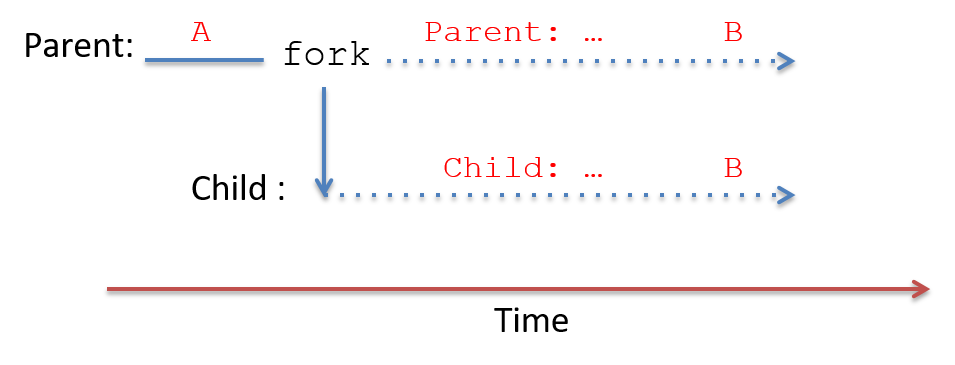

Dưới đây là bản dịch tiếng Việt của mục **13.2. Processes**, tuân thủ đầy đủ các quy ước bạn đã nêu:

---

## 13.2. Processes (Tiến trình)

Một trong những **abstraction** (trừu tượng hóa) chính mà **operating system** (OS – hệ điều hành) triển khai là **process** (tiến trình).  
Một process đại diện cho một **instance** (phiên bản) của một chương trình đang chạy trong hệ thống, bao gồm:

- **Binary executable code** (mã thực thi nhị phân) của chương trình.
- **Data** (dữ liệu) của chương trình.
- **Execution context** (ngữ cảnh thực thi).

**Context** theo dõi quá trình thực thi của chương trình bằng cách lưu giữ các giá trị **register** (thanh ghi), vị trí **stack**, và lệnh mà nó đang thực thi.

---

Process là một abstraction cần thiết trong các hệ thống **multiprogramming** (đa chương trình), vốn hỗ trợ nhiều process tồn tại đồng thời trong hệ thống.  
Abstraction process được OS sử dụng để theo dõi từng instance riêng biệt của các chương trình đang chạy trong hệ thống, và để quản lý việc sử dụng tài nguyên hệ thống của chúng.

OS cung cấp cho mỗi process một abstraction “**lone view**” (cái nhìn riêng biệt) về hệ thống.  
Nghĩa là, OS cô lập các process với nhau và tạo cho mỗi process ảo giác rằng nó đang kiểm soát toàn bộ máy tính.  
Trên thực tế, OS hỗ trợ nhiều process hoạt động đồng thời và quản lý việc chia sẻ tài nguyên giữa chúng.  
OS ẩn khỏi người dùng các chi tiết về việc chia sẻ và truy cập tài nguyên hệ thống, đồng thời bảo vệ các process khỏi tác động của các process khác đang chạy trong hệ thống.

---

Ví dụ: một người dùng có thể đồng thời chạy hai instance của chương trình Unix shell cùng với một trình duyệt web trên máy tính.  
OS sẽ tạo ra ba process tương ứng với ba chương trình đang chạy này:  
- Một process cho mỗi lần thực thi riêng biệt của Unix shell.  
- Một process cho trình duyệt web.

OS xử lý việc chuyển đổi giữa ba process này khi chúng chạy trên CPU, và đảm bảo rằng khi một process chạy trên CPU, chỉ trạng thái thực thi và tài nguyên hệ thống được cấp cho process đó mới có thể được truy cập.

---

### 13.2.1. Multiprogramming và Context Switching

**Multiprogramming** cho phép OS sử dụng hiệu quả tài nguyên phần cứng.  
Ví dụ: khi một process đang chạy trên CPU cần truy cập dữ liệu hiện đang nằm trên đĩa, thay vì để CPU rảnh rỗi chờ dữ liệu được đọc vào bộ nhớ, OS có thể chuyển CPU cho một process khác chạy trong khi thao tác đọc dữ liệu của process ban đầu được xử lý bởi đĩa.  

Bằng cách sử dụng multiprogramming, OS có thể giảm bớt tác động của **memory hierarchy** (hệ thống phân cấp bộ nhớ) lên workload của chương trình, bằng cách giữ cho CPU luôn bận rộn thực thi một số process trong khi các process khác đang chờ truy cập dữ liệu ở các tầng thấp hơn của bộ nhớ.

---

Các hệ điều hành đa dụng thường triển khai **timesharing** (chia sẻ thời gian), là một dạng multiprogramming trong đó OS lập lịch để mỗi process lần lượt thực thi trên CPU trong một khoảng thời gian ngắn (gọi là **time slice** hoặc **quantum**).  
Khi một process hoàn thành time slice của mình trên CPU, OS sẽ loại process đó ra khỏi CPU và cho process khác chạy.  
Hầu hết các hệ thống định nghĩa time slice dài vài **millisecond** (10^-3 giây), đây là một khoảng thời gian dài đối với chu kỳ CPU nhưng con người không nhận thấy được.

---

Hệ thống timesharing càng củng cố “lone view” của máy tính đối với người dùng; vì mỗi process thường xuyên được thực thi trên CPU trong những khoảng thời gian ngắn, nên việc chúng chia sẻ CPU thường không thể nhận ra đối với người dùng.  
Chỉ khi hệ thống bị tải rất nặng, người dùng mới có thể nhận thấy tác động của các process khác trong hệ thống.  

Lệnh Unix `ps -A` liệt kê tất cả các process đang chạy trong hệ thống — bạn có thể sẽ ngạc nhiên về số lượng process này.  
Lệnh `top` cũng hữu ích để xem trạng thái hệ thống khi nó đang chạy, bằng cách hiển thị tập hợp các process hiện đang sử dụng nhiều tài nguyên hệ thống nhất (như thời gian CPU và dung lượng bộ nhớ).

---

Trong các hệ thống multiprogramming và timesharing, các process chạy **concurrently** (đồng thời), nghĩa là quá trình thực thi của chúng **chồng lấn về thời gian**.  
Ví dụ: OS có thể bắt đầu chạy process A trên CPU, sau đó chuyển sang chạy process B một lúc, rồi quay lại chạy tiếp process A.  
Trong kịch bản này, process A và B chạy đồng thời vì việc thực thi của chúng trên CPU chồng lấn nhau do OS chuyển đổi qua lại giữa hai process.

---

#### Context Switching

**Mechanism** (cơ chế) đằng sau multiprogramming xác định cách OS hoán đổi một process đang chạy trên CPU với process khác.  
**Policy** (chính sách) của multiprogramming điều khiển việc lập lịch CPU, tức là chọn process nào từ tập các process ứng viên sẽ được dùng CPU tiếp theo và trong bao lâu.  
Ở đây, chúng ta tập trung chủ yếu vào **mechanism** của việc triển khai multiprogramming.  
Các giáo trình hệ điều hành sẽ trình bày chi tiết hơn về các **scheduling policy** (chính sách lập lịch).

---

OS thực hiện **context switching** (chuyển ngữ cảnh), hay hoán đổi trạng thái process trên CPU, như là cơ chế chính đằng sau multiprogramming (và timesharing).  
Có hai bước chính để thực hiện một CPU context switch:

1. **OS lưu context** của process hiện đang chạy trên CPU, bao gồm tất cả giá trị register (PC, stack pointer, general-purpose register, condition code, v.v.), trạng thái bộ nhớ, và một số trạng thái khác (ví dụ: trạng thái của các tài nguyên hệ thống mà nó đang sử dụng, như file đang mở).

2. **OS khôi phục context** đã lưu của một process khác lên CPU và bắt đầu cho CPU chạy process này, tiếp tục thực thi từ lệnh mà nó đã dừng trước đó.

Dưới đây là bản dịch tiếng Việt của đoạn bạn cung cấp, tuân thủ đầy đủ các quy ước đã nêu:

---

Một phần của **context switching** (chuyển ngữ cảnh) có thể khiến bạn nghĩ là “bất khả thi” đó là: mã của OS thực hiện context switching phải chạy trên CPU **trong khi** nó lưu (hoặc khôi phục) **execution context** (ngữ cảnh thực thi) của một process từ (hoặc lên) CPU.  
Các lệnh của mã context switching cần sử dụng **CPU hardware register** (thanh ghi phần cứng của CPU) để thực thi, nhưng giá trị các thanh ghi của process đang bị chuyển ra khỏi CPU lại cần được chính mã context switching lưu lại.  
Phần cứng máy tính cung cấp một số hỗ trợ để điều này khả thi.

---

Khi khởi động (**boot time**), OS khởi tạo phần cứng, bao gồm cả việc khởi tạo trạng thái CPU, để khi CPU chuyển sang **kernel mode** do một **interrupt**, mã **interrupt handler** của OS sẽ bắt đầu thực thi và trạng thái thực thi của process bị ngắt được bảo vệ khỏi việc bị ghi đè.  

Phần cứng máy tính và OS phối hợp thực hiện một phần việc lưu ban đầu **user-level execution context** (ngữ cảnh thực thi ở mức người dùng), đủ để mã OS có thể chạy trên CPU mà không làm mất trạng thái thực thi của process bị ngắt.  

Ví dụ: các giá trị thanh ghi của process bị ngắt cần được lưu lại để khi process chạy lại trên CPU, nó có thể tiếp tục từ đúng vị trí trước đó, sử dụng các giá trị thanh ghi của mình.  
Tùy thuộc vào hỗ trợ phần cứng, việc lưu giá trị thanh ghi của process ở mức người dùng có thể được thực hiện hoàn toàn bởi phần cứng, hoặc gần như hoàn toàn bằng phần mềm như là phần đầu tiên của mã xử lý ngắt trong kernel.  
Tối thiểu, giá trị **program counter (PC)** của process cần được lưu lại để không bị mất khi địa chỉ của kernel interrupt handler được nạp vào PC.

---

Khi OS bắt đầu chạy, nó thực thi toàn bộ mã context switching của process, lưu toàn bộ trạng thái thực thi của process đang chạy trên CPU và khôi phục trạng thái thực thi đã lưu của một process khác lên CPU.  
Vì OS chạy ở kernel mode, nó có thể truy cập bất kỳ phần nào của bộ nhớ máy tính, thực thi các lệnh đặc quyền và truy cập bất kỳ thanh ghi phần cứng nào.  

Do đó, mã context switching của OS có thể truy cập và lưu trạng thái thực thi CPU của bất kỳ process nào vào bộ nhớ, và có thể khôi phục từ bộ nhớ trạng thái thực thi của bất kỳ process nào lên CPU.  
Mã context switching của OS kết thúc bằng việc thiết lập CPU để thực thi trạng thái thực thi đã khôi phục của process và chuyển CPU sang user mode.  
Khi đã chuyển sang user mode, CPU sẽ thực thi các lệnh và sử dụng trạng thái thực thi từ process mà OS vừa chuyển lên CPU.

---

### 13.2.2. Process State (Trạng thái tiến trình)

Trong các hệ thống **multiprogrammed** (đa chương trình), OS phải theo dõi và quản lý nhiều process tồn tại trong hệ thống tại bất kỳ thời điểm nào.  
OS duy trì thông tin về mỗi process, bao gồm:

- **Process id (PID)**: định danh duy nhất cho một process.  
  Lệnh `ps` liệt kê thông tin về các process trong hệ thống, bao gồm cả PID của chúng.

- Thông tin **address space** (không gian địa chỉ) của process.

- **Execution state** (trạng thái thực thi) của process (ví dụ: giá trị CPU register, vị trí stack).

- Tập hợp tài nguyên được cấp phát cho process (ví dụ: các file đang mở).

- **Process state** (trạng thái tiến trình) hiện tại, là giá trị xác định khả năng được thực thi trên CPU của process.

---

Trong suốt vòng đời của mình, một process sẽ di chuyển qua nhiều trạng thái khác nhau, tương ứng với các mức độ khác nhau về khả năng được thực thi.  
Một cách OS sử dụng process state là để xác định tập hợp các process ứng viên cho việc lập lịch trên CPU.

Các trạng thái thực thi của process gồm:

- **Ready**: Process có thể chạy trên CPU nhưng hiện chưa được lập lịch (là ứng viên để được context switch lên CPU).  
  Khi một process mới được OS tạo và khởi tạo, nó sẽ vào trạng thái *ready* (sẵn sàng để CPU bắt đầu thực thi lệnh đầu tiên).  
  Trong hệ thống timesharing, nếu một process bị context switch ra khỏi CPU vì hết time slice, nó cũng được đưa vào trạng thái *ready* (sẵn sàng để CPU thực thi lệnh tiếp theo, nhưng phải chờ đến lượt được lập lịch lại).

- **Running**: Process đang được lập lịch trên CPU và đang thực thi lệnh.

- **Blocked**: Process đang chờ một sự kiện nào đó trước khi có thể tiếp tục thực thi.  
  Ví dụ: process đang chờ dữ liệu được đọc từ đĩa.  
  Các process ở trạng thái *blocked* không phải là ứng viên để lập lịch trên CPU.  
  Khi sự kiện mà process đang chờ xảy ra, process sẽ chuyển sang trạng thái *ready* (sẵn sàng chạy lại).

- **Exited**: Process đã thoát nhưng vẫn cần được loại bỏ hoàn toàn khỏi hệ thống.  
  Một process thoát khi hoàn thành việc thực thi chương trình, hoặc thoát do lỗi (ví dụ: chia cho 0), hoặc nhận yêu cầu kết thúc từ process khác.  
  Process đã thoát sẽ không bao giờ chạy lại, nhưng vẫn tồn tại trong hệ thống cho đến khi hoàn tất việc dọn dẹp liên quan đến trạng thái thực thi của nó.

---

**Hình 1** minh họa vòng đời của một process trong hệ thống, cho thấy cách nó di chuyển giữa các trạng thái khác nhau.  
Lưu ý các mũi tên biểu thị sự chuyển đổi từ trạng thái này sang trạng thái khác.  
Ví dụ: một process có thể vào trạng thái *Ready* theo ba cách:

1. Được OS tạo mới.  
2. Đang *blocked* chờ sự kiện và sự kiện xảy ra.  
3. Đang chạy trên CPU nhưng hết time slice, OS context switch nó ra để nhường CPU cho một process *Ready* khác.


#### fork 

The `fork` system call is used to create a process. At the time of the
fork, the child inherits its execution state from its parent. The OS
creates a *copy* of the calling (parent) process's execution state at
the point when the parent calls `fork`. This execution state includes
the parent's address space contents, CPU register values, and any system
resources it has allocated (e.g., open files). The OS also creates a new
**process control struct**, an OS data structure for managing the child
process, and it assigns the child process a unique PID. After the OS
creates and initializes the new process, the child and parent are
concurrent --- they both continue running and their executions overlap
as the OS context switches them on and off the CPU.


When the child process is first scheduled by the OS to run on the CPU,
it starts executing at the point at which its parent left off --- at the
return from the `fork` call. This is because `fork` gives the child a
copy of its parent's execution state (the child executes using its own
copy of this state when it starts running). From the programmer's point
of view, *a call to `fork` returns twice*: once in the context of the
running parent process, and once in the context of the running child
process.


In order to differentiate the child and parent processes in a program, a
call to `fork` returns different values to the parent and child. The
child process always receives a return value of 0, whereas the parent
receives the child's PID value (or -1 if `fork` fails).


For example, the following code snippet shows a call to the `fork`
system call that creates a new child process of the calling process:


```
pid_t pid;

pid = fork();   /* create a new child process */

print("pid = %d\n", pid);  /* both parent and child execute this */
```


After the call to `fork` creates a new child process, the parent and
child processes both continue executing, in their separate execution
contexts, at the return point of the `fork` call. Both processes assign
the return value of `fork` to their `pid` variable and both call
`printf`. The child process's call prints out 0 and the parent process
prints out the child's PID value.


Figure 3 shows an example of what the process hierarchy
looks like after this code's execution. The child process gets an exact
copy of the parent process's execution context at the point of the fork,
but the value stored in its variable `pid` differs from its parent
because `fork` returns the child's PID value (14 in this example) to the
parent process, and 0 to the child.


Figure 3. A process (PID 12) calls fork to create a new child process.
The new child process gets an exact copy of its parent's address and
execution state, but gets its own process identifier (PID 14). fork
returns 0 to the child process and the child's PID value (14) to the
parent.


Often, the programmer wants the child and parent processes to perform
different tasks after the `fork` call. A programmer can use the
different return values from `fork` to trigger the parent and child
processes to execute different code branches. For example, the following
code snippet creates a new child process and uses the return value from
`fork` to have the child and parent processes execute different code
branches after the call:


```
pid_t pid;

pid = fork();   /* create a new child process */

if (pid == 0) {
    /* only the child process executes this code */
    ...
} else if (pid != -1)  {
    /* only the parent process executes this code */
    ...
}
```


It is important to remember that as soon as they are created, the child
and parent processes run concurrently in their own execution contexts,
modifying their separate copies of program variables and possibly
executing different branches in the code.


Consider the [following program](_attachments/fork.c) that contains a
call to `fork` with branching on the value of `pid` to trigger the
parent and child processes to execute different code (this example also
shows a call to `getpid` that returns the PID of the calling process):


```
#include <stdio.h>
#include <stdlib.h>
#include <unistd.h>

int main(void) {

    pid_t pid, mypid;

    printf("A\n");

    pid = fork();   /* create a new child process */

    if(pid == -1) {  /* check and handle error return value */
        printf("fork failed!\n");
        exit(pid);
    }

    if (pid == 0) { /* the child process */
        mypid = getpid();
        printf("Child: fork returned %d, my pid %d\n", pid, mypid);

    } else  {  /* the parent process */
        mypid = getpid();
        printf("Parent: fork returned %d, my pid %d\n", pid, mypid);
    }

    printf("B:%d\n", mypid);

    return 0;
}
```


When run, this program's output might look like the following (assume
that the parent's PID is 12 and the child's is 14):


```
A
Parent: fork returned 14, my pid 12
B:12
Child: fork returned 0, my pid 14
B:14
```


In fact, the program's output could look like any of the possible
options shown in Table 1 (and you will often
see more than one possible ordering of output if you run the program
multiple times). In Table 1, the parent
prints B:12 and the child B:14 in this example, but the exact PID values
will vary from run to run.


+----------+----------+----------+----------+----------+-----------+
| Option 1 | Option 2 | Option 3 | Option 4 | Option 5 | Option 6  |
+==========+==========+==========+==========+==========+===========+
| `A`      | `A`      | `A`      | `A`      | `A`      | `A`       |
+----------+----------+----------+----------+----------+-----------+
| `        | `        | `        | `Child…​` | `Child…​` | `Child…​`  |
| Parent…​` | Parent…​` | Parent…​` |          |          |           |
+----------+----------+----------+----------+----------+-----------+
| `Child…​` | `Child…​` | `B:12`   | `        | `        | `B:14`    |
|          |          |          | Parent…​` | Parent…​` |           |
+----------+----------+----------+----------+----------+-----------+
| `B:12`   | `B:14`   | `Child…​` | `B:12`   | `B:14`   | `Parent…​` |
+----------+----------+----------+----------+----------+-----------+
| `B:14`   | `B:12`   | `B:14`   | `B:14`   | `B:12`   | `B:12`    |
+----------+----------+----------+----------+----------+-----------+

: Table 1. All Six Possible Orderings of Example Program Output

These six different output orderings are possible because after the
`fork` system call returns, the parent and child processes are
concurrent and can be scheduled to run on the CPU in many different
orderings, resulting in any possible interleaving of their instruction
sequences. Consider the execution time line of this program, shown in
Figure 4. The dotted line represents concurrent execution
of the two processes. Depending on when each is scheduled to run on the
CPU, one could execute both its `printf` statements before the other, or
the execution of their two `printf` statements could be interleaved,
resulting in any of the possible outcomes shown in the table above.
Because only one process, the parent, exists before the call to `fork`,
A is always printed by the parent before any of the output after the
call to `fork`.





Figure 4. The execution time line of the program. Only the parent
process exists before the call to `fork`. After `fork` returns, both run
concurrently (shown in the dotted lines).


### 13.2.4. exec 

Usually a new process is created to execute a program that is different
from that of its parent process. This means that `fork` is often called
to create a process with the intention of running a new program from its
starting point (that is starting its execution from its first
instruction). For example, if a user types `./a.out` in a shell, the
shell process forks a new child process to run `a.out`. As two separate
processes, the shell and the `a.out` process are protected from each
other; they cannot interfere with each other's execution state.


While `fork` creates the new child process, it does not cause the child
to run `a.out`. To initialize the child process to run a new program,
the child process calls one of the **exec** system calls. Unix provides
a family of exec system calls that trigger the OS to overlay the calling
process's image with a new image from a binary executable file. In other
words, an exec system call tells the OS to overwrite the calling
process's address space contents with the specified `a.out` and to
reinitialize its execution state to start executing the very first
instruction in the `a.out` program.


One example of an exec system call is `execvp`, whose function prototype
is as follows:


```
int execvp(char *filename, char *argv[]);
```


The `filename` parameter specifies the name of a binary executable
program to initialize the process's image, and `argv` contains the
command line arguments to pass into the `main` function of the program
when it starts executing.


Here's an example code snippet that, when executed, creates a new child
process to run `a.out`:


```
pid_t pid;
int  ret;
char *argv[2];

argv[0] = "a.out";  // initialize command line arguments for main
argv[1] = NULL;

pid = fork();
if (pid == 0) { /* child process */
    ret = execvp("a.out", argv);
    if (ret < 0) {
        printf("Error: execvp returned!!!\n");
        exit(ret);
    }
}
```


The `argv` variable is initialized to the value of the `argv` argument
that is passed to the `main` function of `a.out`:


```
int main(int argc, char *argv) { ...
```


`execvp` will figure out the value to pass to `argc` based on this
`argv` value (in this case 1).


Figure 5 shows what the process hierarchy would look like
after executing this code:


Figure 5. When the child process calls execvp (left), the OS replaces
its image with a.out (right) and initializes the child process to start
running the a.out program from its beginning.


Something to note in the example code shown above is its seemingly odd
error message after the call to `execvp`: why would returning from an
exec system call be an error? If the exec system call is successful,
then the error detection and handling code immediately following it will
never be executed because the process will now be executing code in the
`a.out` program instead of this code (the process's address space
contents have been changed by exec). That is, when a call to an exec
function is successful, the process doesn't continue its execution at
the return of the exec call. Because of this behavior, the following
code snippet is equivalent to the one shown above (however, the one
above is typically easier to understand):


```
pid_t pid;
int ret;

pid = fork();
if (pid == 0) { /* child process */
    ret = execvp("a.out", argv);
    printf("Error: execvp returned!!!\n");  /* only executed if execvp fails */
    exit(ret);
}
```


### 13.2.5. exit and wait 

To terminate, a process calls the `exit` system call, which triggers the
OS to clean up most of the process's state. After running the exit code,
a process notifies its parent process that it has exited. The parent is
responsible for cleaning up the exited child's remaining state from the
system.


Processes can be triggered to exit in several ways. First, a process may
complete all of its application code. Returning from its `main` function
leads to a process invoking the `exit` system call. Second, a process
can perform an invalid action, such as dividing by zero or dereferencing
a null pointer, that results in its exiting. Finally, a process can
receive a **signal** from the OS or another process, telling it to exit
(in fact, dividing by zero and NULL pointer dereferences result in the
OS sending the process `SIGFPE` and `SIGSEGV` signals telling it to
exit).


>> Signals


A **signal** is a software interrupt that the OS delivers to a process.
Signals are a method by which related processes can communicate with one
another. The OS provides an interface for one process to send a signal
to another, and for it to communicate with processes (to send a process
a `SIGSEGV` signal when it dereferences a null pointer, for example).


When a process receives a signal, it is interrupted to run special
signal handler code. A system defines a fixed number of signals to
communicate various meanings, each differentiated by a unique signal
number. The OS implements default signal handlers for each signal type,
but programmers can register their own user-level signal handler code to
override the default actions of most signals for their application.


The Signals section contains more
information about signals and signal handling.


If a shell process wants to terminate its child process running `a.out`,
it can send the child a `SIGKILL` signal. When the child process
receives the signal, it runs signal handler code for `SIGKILL` that
calls `exit`, terminating the child process. If a user types CTRL-C in a
Unix shell that is currently running a program, the child process
receives a `SIGINT` signal. The default signal handler for `SIGINT` also
calls `exit`, resulting in the child process exiting.


After executing the `exit` system call, the OS delivers a `SIGCHLD`
signal to the process's parent process to notify it that its child has
exited. The child becomes a **zombie** process; it moves to the Exited
state and can no longer run on the CPU. The execution state of a zombie
process is partially cleaned up, but the OS still maintains a little
information about it, including about how it terminated.


A parent process **reaps** its zombie child (cleans up the rest of its
state from the system) by calling the `wait` system call. If the parent
process calls `wait` before its child process exits, the parent process
blocks until it receives a `SIGCHLD` signal from the child. The
`waitpid` system call is a version of `wait` that takes a PID argument,
allowing a parent to block while waiting for the termination of a
specific child process.


Figure 6 shows the sequence of events that occur when a
process exits.


Figure 6. Process exit. Left: The child process calls the exit system
call to clean up most of its execution state. Middle: After running
exit, the child process becomes a zombie (it is in the Exited state and
cannot run again), and its parent process is sent a SIGCHLD signal,
notifying it that its child is exited. Right: The parent calls waitpid
to reap its zombie child (cleans up the rest of the child's state from
the system).


Because the parent and child processes execute concurrently, the parent
may call `wait` before its child exits, or the child can exit before the
parent calls `wait`. If the child is still executing when the parent
process calls `wait`, the parent blocks until the child exits (the
parent enters the Blocked state waiting for the `SIGCHLD` signal event
to happen). The blocking behavior of the parent can be seen if you run a
program (`a.out`) in the foreground of a shell --- the shell program
doesn't print out a shell prompt until `a.out` terminates, indicating
that the shell parent process is blocked on a call to `wait`, waiting
until it receives a `SIGCHLD` from its child process running `a.out`.


A programmer can also design the parent process code so that it will
never block waiting for a child process to exit. If the parent
implements a `SIGCHLD` signal handler that contains the call to `wait`,
then the parent only calls `wait` when there is an exited child process
to reap, and thus it doesn't block on a `wait` call. This behavior can
be seen by running a program in the background in a shell (`a.out &`).
The shell program will continue executing, print out a prompt, and
execute another command as its child runs `a.out`. Here's an example of
how you might see the difference between a parent blocking on `wait` vs.
a nonblocking parent that only calls `wait` inside a `SIGCHLD` signal
handler (make sure you execute a program that runs for long enough to
notice the difference):


    $  a.out        # shell process forks child and calls wait

    $  a.out &      # shell process forks child but does not call wait
    $  ps           # (the shell can run ps and a.out concurrently)


Below is an example code snippet containing `fork`, `exec`, `exit`, and
`wait` system calls (with error handling removed for readability). This
example is designed to test your understanding of these system calls and
their effects on the execution of the processes. In this example, the
parent process creates a child process and waits for it to exit. The
child then forks another child to run the `a.out` program (the first
child is the parent of the second child). It then waits for its child to
exit.


```
pid_t pid1, pid2, ret;
int status;

printf("A\n");

pid1 = fork();
if (pid1 == 0 ) {       /* child 1 */
    printf("B\n");

    pid2 = fork();
    if (pid2 == 0 ){    /* child 2 */
        printf("C\n");
        execvp("a.out", NULL);
    } else {            /* child 1 (parent of child 2) */
        ret = wait(&status);
        printf("D\n");
        exit(0);
    }
} else {                /* original parent */
    printf("E\n");
    ret = wait(&status);
    printf("F\n");
}
```


Figure 7 illustrates the execution time line of process
create/running/blocked/exit events from executing the above example. The
dotted lines represent times when a process's execution overlaps with
its child or descendants: the processes are concurrent and can be
scheduled on the CPU in any order. Solid lines represent dependencies on
the execution of the processes. For example, Child 1 cannot call `exit`
until it has reaped its exited child process, Child 2. When a process
calls `wait`, it blocks until its child exits. When a process calls
`exit`, it never runs again. The program's output is annotated along
each process's execution time line at points in its execution when the
corresponding `printf` statement can occur.


Figure 7. The execution time line for the example program, showing a
possible sequence of fork, exec, wait, and exit calls from the three
processes. Solid lines represent dependencies in the order of execution
between processes, and dotted line concurrent execution points. Parent
is the parent process of Child 1, and Child 1 is the parent of Child 2.


After the calls to `fork` are made in this program, the parent process
and first child process run concurrently, thus the call to `wait` in the
parent could be interleaved with any instruction of its child. For
example, the parent process could call `wait` and block before its child
process calls `fork` to create its child process. Table 2
lists all possible outputs from running the example program.


  Option 1   Option 2   Option 3   Option 4
  ---------- ---------- ---------- ----------
  `A`        `A`        `A`        `A`
  `B`        `B`        `B`        `E`
  `C`        `C`        `E`        `B`
  `D`        `E`        `C`        `C`
  `E`        `D`        `D`        `D`
  `F`        `F`        `F`        `F`

  : Table 2. All Possible Output Orderings from the Program

The program outputs in Table 2 are all possible because
the parent runs concurrently with its descendant processes until it
calls `wait`. Thus, the parent's call to `printf("E\n")` can be
interleaved at any point between the start and the exit of its
descendant processes.


