## 13.3. Bộ nhớ ảo (Virtual Memory)

**Process abstraction** (trừu tượng hóa tiến trình) của OS cung cấp cho mỗi process một **virtual memory space** (không gian bộ nhớ ảo).  
**Virtual memory** (bộ nhớ ảo) là một abstraction cung cấp cho mỗi process **một không gian địa chỉ logic riêng tư** để lưu trữ lệnh và dữ liệu của nó.  

Không gian địa chỉ ảo của mỗi process có thể được hình dung như một mảng các byte có thể địa chỉ hóa, từ địa chỉ `0` đến một địa chỉ tối đa nào đó.  
Ví dụ: trên hệ thống 32-bit, địa chỉ tối đa là `2^32 - 1`.  
Các process **không thể** truy cập nội dung của không gian địa chỉ của nhau.  

Một số phần của không gian địa chỉ ảo của process đến từ **binary executable file** (tệp thực thi nhị phân) mà nó đang chạy (ví dụ: phần *text* chứa các lệnh chương trình từ tệp `a.out`).  
Các phần khác của không gian địa chỉ ảo được tạo ra **tại thời gian chạy** (runtime) (ví dụ: phần *stack*).

Hệ điều hành triển khai virtual memory như một phần của abstraction **lone view** (cái nhìn riêng biệt) của process.  
Nghĩa là, mỗi process chỉ tương tác với bộ nhớ thông qua **không gian địa chỉ ảo của riêng nó**, thay vì thực tế là nhiều process đang đồng thời chia sẻ bộ nhớ vật lý (RAM) của máy tính.  

OS cũng sử dụng cơ chế virtual memory để **bảo vệ** các process khỏi việc truy cập vào bộ nhớ của nhau.  

Ví dụ, hãy xem chương trình C đơn giản sau:

```c
/* a simple program */
#include <stdio.h>

int main(int argc, char* argv[]) {
    int x, y;

    printf("enter a value: ");
    scanf("%d", &y);

    if (y > 10) {
        x = y;
    } else {
        x = 6;
    }
    printf("x is %d\n", x);

    return 0;
}
```

Nếu hai process đồng thời thực thi chương trình này, mỗi process sẽ nhận được **bản sao riêng** của bộ nhớ stack như một phần của không gian địa chỉ ảo riêng biệt.  
Kết quả là, nếu một process thực thi `x = 6` thì điều đó **không ảnh hưởng** đến giá trị của `x` trong process còn lại — mỗi process có bản sao riêng của `x` trong không gian địa chỉ ảo riêng của mình, như minh họa trong **Hình 1**.

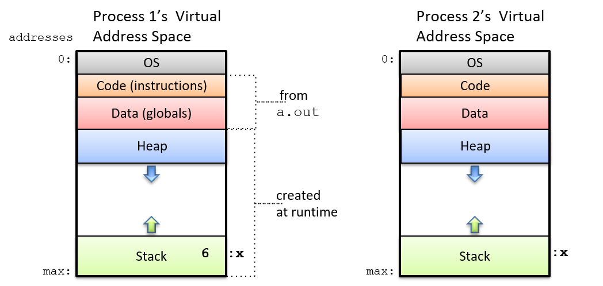

**Hình 1.** Hai lần thực thi `a.out` tạo ra hai process, mỗi process chạy một instance độc lập của chương trình `a.out`.  
Mỗi process có **không gian địa chỉ ảo riêng**, chứa bản sao của lệnh chương trình, biến toàn cục, và vùng bộ nhớ stack và heap.  
Ví dụ: mỗi process có thể có một biến cục bộ `x` trong phần stack của không gian địa chỉ ảo của nó.

Không gian địa chỉ ảo của một process được chia thành nhiều **section** (phần), mỗi phần lưu trữ một loại dữ liệu khác nhau của process:

- **Phần trên cùng** (ở các địa chỉ thấp nhất) được **dành riêng cho OS** và chỉ có thể truy cập ở **kernel mode**.
- **Phần text** và **phần data** của không gian địa chỉ ảo được khởi tạo từ tệp thực thi chương trình (`a.out`):
  - **Text section** chứa các lệnh chương trình.
  - **Data section** chứa các biến toàn cục (thực tế phần data được chia thành hai phần: một cho biến toàn cục đã khởi tạo và một cho biến toàn cục chưa khởi tạo).

**Stack** và **heap** của một process thay đổi kích thước khi process chạy:

- **Stack** tăng khi process thực hiện lời gọi hàm, và giảm khi hàm trả về.
- **Heap** tăng khi process cấp phát bộ nhớ động (qua `malloc`), và giảm khi giải phóng bộ nhớ động (qua `free`).

Thông thường, heap và stack được đặt **xa nhau** trong không gian địa chỉ để tối đa hóa dung lượng mà mỗi bên có thể sử dụng.  
Thông thường, stack nằm ở **cuối không gian địa chỉ** (gần địa chỉ tối đa) và **tăng ngược xuống** các địa chỉ thấp hơn khi thêm **stack frame** mới vào đỉnh stack khi có lời gọi hàm.

> **Về bộ nhớ Heap và Stack**

Tổng dung lượng thực tế của heap và stack **không** thay đổi ở mỗi lần gọi `malloc`/`free` hoặc mỗi lần gọi/trả về hàm.  
Thay vào đó, các thao tác này thường chỉ thay đổi lượng bộ nhớ heap và stack **đang được sử dụng** trong phần dung lượng đã được cấp phát.  

Tuy nhiên, đôi khi các thao tác này **có thể** dẫn đến thay đổi tổng dung lượng heap hoặc stack.

OS chịu trách nhiệm quản lý **virtual address space** của process, bao gồm việc thay đổi tổng dung lượng heap và stack.  
Các system call `brk`, `sbrk` hoặc `mmap` có thể được dùng để yêu cầu OS thay đổi tổng dung lượng bộ nhớ heap.  

Lập trình viên C thường **không** gọi trực tiếp các system call này.  
Thay vào đó, họ gọi **hàm thư viện C chuẩn** `malloc` (và `free`) để cấp phát (và giải phóng) bộ nhớ heap.  
Bên trong, **user-level heap manager** (bộ quản lý heap ở mức người dùng) của thư viện C chuẩn có thể gọi một trong các system call này để yêu cầu OS thay đổi kích thước bộ nhớ heap nhằm đáp ứng yêu cầu `malloc`.


### 13.3.1. Địa chỉ bộ nhớ (Memory Addresses)

Vì các **process** (tiến trình) hoạt động trong **virtual address space** (không gian địa chỉ ảo) riêng của chúng, nên **operating system** (OS – hệ điều hành) phải phân biệt rõ giữa hai loại địa chỉ bộ nhớ:

- **Virtual address**: tham chiếu đến vị trí lưu trữ trong không gian địa chỉ ảo của một process.
- **Physical address**: tham chiếu đến vị trí lưu trữ trong **physical memory** (bộ nhớ vật lý – RAM).

#### Physical Memory (RAM) và Physical Memory Addresses

Như đã đề cập trong [Chương Storage and Memory Hierarchy](../C11-MemHierarchy/index.html#_storage_and_the_memory_hierarchy), **physical memory** (RAM) có thể được xem như một mảng các byte có thể địa chỉ hóa, với địa chỉ từ `0` đến giá trị địa chỉ tối đa phụ thuộc vào tổng dung lượng RAM.  
Ví dụ: trong một hệ thống có 2 gigabyte (GB) RAM, địa chỉ bộ nhớ vật lý sẽ từ `0` đến `2^31 - 1` (1 GB = `2^30` byte, nên 2 GB = `2^31` byte).

Để CPU chạy một chương trình, **instructions** (lệnh) và **data** (dữ liệu) của chương trình phải được OS nạp vào RAM; CPU không thể truy cập trực tiếp các thiết bị lưu trữ khác (ví dụ: ổ đĩa).  
OS quản lý RAM và quyết định vị trí nào trong RAM sẽ lưu nội dung không gian địa chỉ ảo của một process.

Ví dụ: nếu hai process P1 và P2 cùng chạy [chương trình ví dụ](#exampleprog) ở trên, thì P1 và P2 sẽ có **bản sao riêng** của biến `x`, mỗi bản được lưu ở một vị trí khác nhau trong RAM.  
Nói cách khác, `x` của P1 và `x` của P2 có **physical address** khác nhau.  
Nếu OS gán cùng một physical address cho biến `x` của cả P1 và P2, thì việc P1 gán `x = 6` sẽ làm thay đổi giá trị `x` của P2, vi phạm nguyên tắc **private virtual address space** (không gian địa chỉ ảo riêng cho từng process).

Tại bất kỳ thời điểm nào, OS lưu trong RAM nội dung không gian địa chỉ của nhiều process, cũng như code OS có thể được **map** vào không gian địa chỉ ảo của mọi process (code OS thường được nạp bắt đầu từ địa chỉ `0x0` của RAM).  

**Hình 2** minh họa ví dụ OS và ba process (P1, P2, P3) được nạp vào RAM.  
Mỗi process có vùng lưu trữ vật lý riêng cho nội dung không gian địa chỉ của nó (ngay cả khi P1 và P2 chạy cùng một chương trình, chúng vẫn có vùng lưu trữ vật lý riêng cho biến `x`).

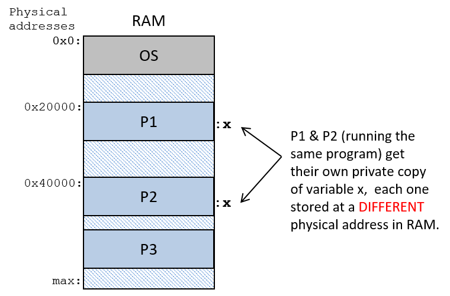

**Hình 2.** Ví dụ nội dung RAM, với OS được nạp tại địa chỉ `0x0` và các process được nạp tại các địa chỉ bộ nhớ vật lý khác nhau trong RAM. Nếu P1 và P2 chạy cùng một `a.out`, physical address của `x` trong P1 sẽ khác với physical address của `x` trong P2.

#### Virtual Memory và Virtual Addresses

**Virtual memory** là góc nhìn của từng process về không gian bộ nhớ của nó, và **virtual address** là địa chỉ trong góc nhìn đó.  

Nếu hai process chạy cùng một **binary executable** (tệp thực thi nhị phân), chúng sẽ có **cùng virtual address** cho code hàm và biến toàn cục trong không gian địa chỉ của mình (các địa chỉ ảo của vùng cấp phát động trên heap và biến cục bộ trên stack có thể khác nhau đôi chút do sự khác biệt tại runtime giữa hai lần thực thi).  

Nói cách khác, cả hai process sẽ có cùng virtual address cho vị trí hàm `main`, và cùng virtual address cho vị trí biến toàn cục `x` trong không gian địa chỉ của chúng, như minh họa trong **Hình 3**.

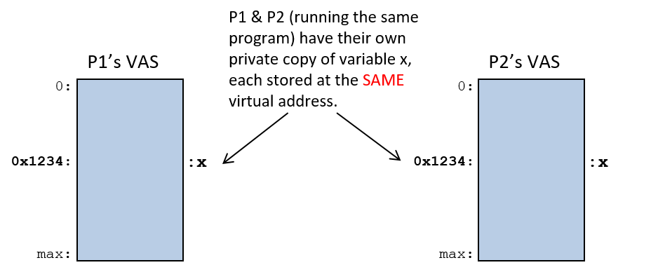

**Hình 3.** Ví dụ nội dung virtual memory của hai process chạy cùng một tệp `a.out`. P1 và P2 có cùng virtual address cho biến toàn cục `x`.

### 13.3.2. Chuyển đổi địa chỉ ảo sang địa chỉ vật lý (Virtual Address to Physical Address Translation)

**Assembly** và **machine code** của một chương trình tham chiếu đến **virtual address**.  
Do đó, nếu hai process thực thi cùng một chương trình `a.out`, CPU sẽ chạy các lệnh với **virtual address giống hệt nhau** để truy cập các phần tương ứng trong hai không gian địa chỉ ảo riêng biệt của chúng.

Ví dụ: giả sử `x` nằm tại virtual address `0x24100`, thì lệnh assembly để gán `x = 6` có thể như sau:

```
movl $0x24100, %eax    # nạp 0x24100 vào thanh ghi eax
movl $6, (%eax)        # lưu giá trị 6 vào địa chỉ bộ nhớ 0x24100
```

Tại runtime, OS sẽ nạp biến `x` của mỗi process vào **physical address** khác nhau (tức là ở các vị trí khác nhau trong RAM).  
Điều này có nghĩa là bất cứ khi nào CPU thực thi lệnh load hoặc store tới bộ nhớ với virtual address, địa chỉ ảo này phải được **dịch** sang physical address tương ứng trong RAM trước khi đọc hoặc ghi dữ liệu.

Vì virtual memory là một abstraction quan trọng và cốt lõi do OS triển khai, nên **processor** (bộ xử lý) thường cung cấp một số hỗ trợ phần cứng cho virtual memory.  
OS có thể tận dụng hỗ trợ phần cứng này để thực hiện việc dịch địa chỉ từ ảo sang vật lý nhanh chóng, tránh việc phải **trap** (ngắt) về OS để xử lý từng lần dịch địa chỉ.  

Một OS cụ thể sẽ quyết định mức độ sử dụng hỗ trợ phần cứng cho **paging** (phân trang) trong việc triển khai virtual memory.  
Thường tồn tại sự đánh đổi giữa **tốc độ** và **tính linh hoạt** khi lựa chọn giữa tính năng được triển khai bằng phần cứng và tính năng được triển khai bằng phần mềm.

**Memory Management Unit** (MMU – đơn vị quản lý bộ nhớ) là phần phần cứng của máy tính thực hiện việc dịch địa chỉ.  
MMU và OS phối hợp để dịch địa chỉ ảo sang địa chỉ vật lý khi ứng dụng truy cập bộ nhớ.  
Tỷ lệ phân chia công việc giữa phần cứng và phần mềm phụ thuộc vào sự kết hợp cụ thể giữa phần cứng và OS.

Ở mức đầy đủ nhất, phần cứng MMU thực hiện toàn bộ quá trình dịch: nhận một virtual address từ CPU và chuyển nó thành physical address để truy cập RAM (như minh họa trong **Hình 4**).  

Bất kể mức độ hỗ trợ phần cứng cho virtual memory đến đâu, vẫn sẽ có một số phép dịch địa chỉ ảo–vật lý mà OS phải xử lý.  
Trong phần thảo luận này, chúng ta giả định một MMU hoàn chỉnh, giúp giảm thiểu tối đa sự can thiệp của OS trong quá trình dịch địa chỉ.

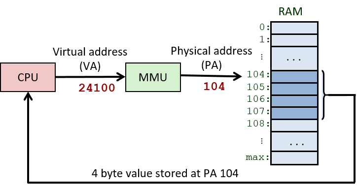


**Hình 4.** **Memory Management Unit** (MMU – đơn vị quản lý bộ nhớ) ánh xạ địa chỉ ảo (**virtual address**) sang địa chỉ vật lý (**physical address**).  
Virtual address được sử dụng trong các lệnh do CPU thực thi.  
Khi CPU cần nạp dữ liệu từ bộ nhớ vật lý, virtual address trước tiên sẽ được MMU dịch sang physical address, và địa chỉ vật lý này sẽ được dùng để truy cập RAM.

OS duy trì **bảng ánh xạ bộ nhớ ảo** cho từng process để đảm bảo có thể dịch chính xác địa chỉ ảo sang địa chỉ vật lý cho bất kỳ process nào đang chạy trên CPU.  
Trong quá trình **context switch** (chuyển ngữ cảnh), OS sẽ cập nhật phần cứng MMU để tham chiếu tới bảng ánh xạ bộ nhớ ảo–vật lý của process vừa được chuyển vào CPU.  

OS bảo vệ các process khỏi việc truy cập vào không gian bộ nhớ của nhau bằng cách hoán đổi trạng thái ánh xạ địa chỉ của từng process trong mỗi lần context switch — việc hoán đổi này đảm bảo rằng virtual address của một process sẽ không ánh xạ tới physical address đang lưu trữ không gian địa chỉ ảo của process khác.

### 13.3.3. Phân trang (Paging)

Mặc dù qua nhiều năm đã có nhiều hệ thống bộ nhớ ảo khác nhau được đề xuất, **paging** hiện là cách triển khai bộ nhớ ảo được sử dụng rộng rãi nhất.  
Trong một hệ thống **paged virtual memory** (bộ nhớ ảo phân trang), OS chia không gian địa chỉ ảo của mỗi process thành các khối có kích thước cố định gọi là **page** (trang).  
OS định nghĩa kích thước page cho hệ thống.  
Ngày nay, trong các hệ điều hành đa dụng, kích thước page thường là vài kilobyte — 4 KB (4.096 byte) là kích thước mặc định trên nhiều hệ thống.

Tương tự, OS cũng chia bộ nhớ vật lý thành các khối có kích thước bằng page, gọi là **frame** (khung).  
Vì page và frame có cùng kích thước, nên bất kỳ page nào của bộ nhớ ảo của một process cũng có thể được lưu trữ trong bất kỳ frame nào của RAM vật lý.

Trong một hệ thống phân trang:

- Page và frame có cùng kích thước, nên bất kỳ page nào của bộ nhớ ảo cũng có thể được nạp vào (lưu tại) bất kỳ frame vật lý nào của RAM.
- Các page của một process **không cần** phải được lưu trong các frame RAM liên tiếp (tức là không cần nằm ở các địa chỉ liền kề nhau trong RAM).
- Không phải tất cả các page của không gian địa chỉ ảo đều cần được nạp vào RAM để process có thể chạy.

**Hình 5** minh họa ví dụ cách các page từ không gian địa chỉ ảo của một process có thể ánh xạ tới các frame của RAM vật lý.

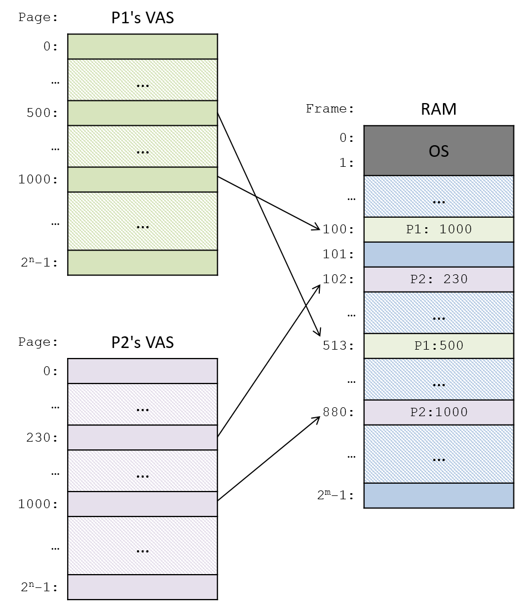

**Hình 5.** Bộ nhớ ảo phân trang. Các page riêng lẻ của không gian địa chỉ ảo của một process được lưu trong các frame của RAM.  
Bất kỳ page nào của không gian địa chỉ ảo cũng có thể được nạp vào (lưu tại) bất kỳ frame nào của bộ nhớ vật lý.  
Trong ví dụ này:  
- Virtual page 1000 của P1 được lưu tại physical frame 100, và page 500 của nó nằm ở frame 513.  
- Virtual page 1000 của P2 được lưu tại physical frame 880, và page 230 của nó nằm ở frame 102.

#### Virtual Address và Physical Address trong hệ thống phân trang

Hệ thống bộ nhớ ảo phân trang chia các bit của một virtual address thành hai phần:

- **High-order bits** (các bit cao) xác định **page number** (số hiệu trang) mà địa chỉ ảo thuộc về.
- **Low-order bits** (các bit thấp) xác định **byte offset** (độ lệch byte) trong page (byte nào tính từ đầu trang tương ứng với địa chỉ đó).

Tương tự, hệ thống phân trang chia physical address thành hai phần:

- **High-order bits** xác định **frame number** (số hiệu khung) của bộ nhớ vật lý.
- **Low-order bits** xác định **byte offset** trong frame.

Vì frame và page có cùng kích thước, nên các bit **byte offset** trong virtual address **giống hệt** các bit byte offset trong physical address sau khi dịch.  
Virtual address và physical address khác nhau ở các bit cao, vốn xác định **virtual page number** và **physical frame number**.

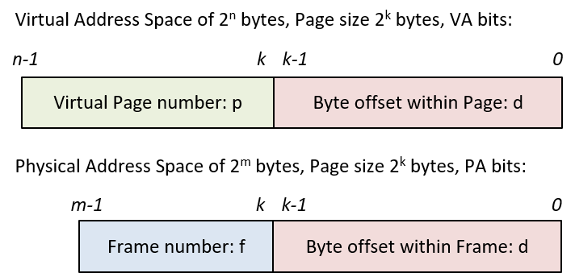


**Hình 6.** Các bit địa chỉ trong **virtual address** và **physical address**

Ví dụ, hãy xét một hệ thống (rất nhỏ) với:

- **Virtual address** dài 16 bit  
- **Physical address** dài 14 bit  
- **Page** có kích thước 8 byte  

Vì kích thước page là 8 byte, nên **3 bit thấp** (low-order bits) của cả physical address và virtual address sẽ xác định **byte offset** (độ lệch byte) trong một page hoặc frame — 3 bit có thể code hóa 8 giá trị byte offset khác nhau, từ 0–7 (vì \( 2^3 = 8 \)).  

Điều này để lại:

- **13 bit cao** (high-order bits) của virtual address để xác định **page number** (số hiệu trang)  
- **11 bit cao** của physical address để xác định **frame number** (số hiệu khung)  

Như minh họa trong ví dụ ở **Hình 7**.

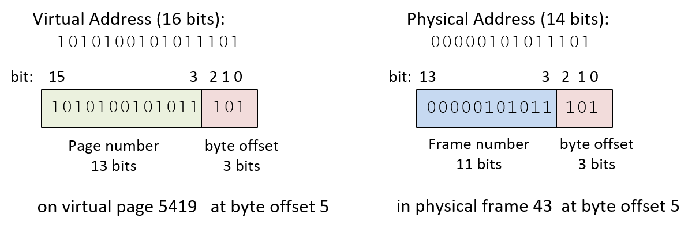

**Hình 7.** Cách chia bit của virtual address và physical address trong một hệ thống ví dụ có virtual address 16 bit, physical address 14 bit, và kích thước page là 8 byte.

Trong ví dụ ở **Hình 7**:

- Virtual address `43357` (hệ thập phân) có:
  - **Byte offset** là `5` (`0b101` trong nhị phân) — 3 bit thấp của địa chỉ.
  - **Page number** là `5419` (`0b1010100101011` trong nhị phân) — 13 bit cao của địa chỉ.

Điều này có nghĩa là địa chỉ ảo này nằm ở **byte thứ 5** tính từ đầu của **page 5419**.

Nếu page này của bộ nhớ ảo được nạp vào **frame 43** (`0b00000101011`) của bộ nhớ vật lý, thì **physical address** sẽ là `349` (`0b00000101011101`), trong đó:

- **3 bit thấp** (`0b101`) xác định byte offset.
- **11 bit cao** (`0b00000101011`) xác định frame number.

Điều này có nghĩa là địa chỉ vật lý này nằm ở **byte thứ 5** tính từ đầu của **frame 43** trong RAM.

#### Page Table cho ánh xạ từ Virtual Page sang Physical Frame

Vì mỗi page trong **virtual memory space** của một process có thể ánh xạ tới một frame khác nhau trong RAM, OS phải duy trì **bảng ánh xạ** cho từng virtual page trong không gian địa chỉ của process.  

OS giữ một **page table** (bảng trang) riêng cho từng process, dùng để lưu ánh xạ từ **virtual page number** sang **physical frame number**.  
Page table là một **data structure** (cấu trúc dữ liệu) do OS triển khai và được lưu trong RAM.  

**Hình 8** minh họa ví dụ OS lưu page table của hai process trong RAM.  
Page table của mỗi process lưu ánh xạ từ các virtual page của nó sang các physical frame trong RAM, sao cho bất kỳ page nào của bộ nhớ ảo cũng có thể được lưu ở bất kỳ frame vật lý nào trong RAM.

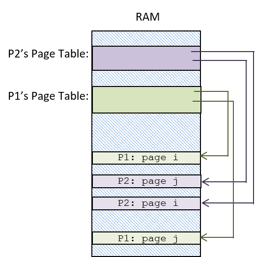

**Hình 8.** Mỗi process có một page table chứa ánh xạ từ virtual page sang physical frame.  
Page table, được lưu trong RAM, được hệ thống dùng để dịch virtual address của process sang physical address để truy cập vị trí trong RAM.  
Ví dụ này cho thấy các page table riêng biệt được lưu trong RAM cho P1 và P2, mỗi bảng có ánh xạ riêng từ virtual page sang physical frame.

Với mỗi page của bộ nhớ ảo, page table lưu một **page table entry** (**PTE**) chứa **frame number** của bộ nhớ vật lý (RAM) đang lưu page ảo đó.  

Ngoài ra, một PTE có thể chứa các thông tin khác về page ảo, bao gồm **valid bit** (bit hợp lệ) dùng để chỉ ra liệu PTE có lưu một ánh xạ hợp lệ hay không.  
Nếu valid bit của một page bằng 0, nghĩa là page đó trong không gian địa chỉ ảo của process hiện **chưa được nạp** vào bộ nhớ vật lý.

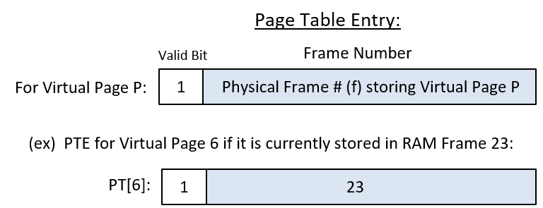

**Hình 9.** Một **page table entry** (PTE) lưu **frame number** (23) của frame RAM chứa page ảo.  
Chúng ta liệt kê frame number (23) ở dạng thập phân, mặc dù thực tế nó được code hóa ở dạng nhị phân trong PTE (`0...010111`).  
Valid bit bằng 1 cho biết entry này lưu một ánh xạ hợp lệ.


#### Sử dụng Page Table để ánh xạ từ Virtual Address sang Physical Address

Có **4 bước** để dịch một **virtual address** (địa chỉ ảo) sang **physical address** (địa chỉ vật lý) (minh họa trong **Hình 10**).  
Tùy vào sự kết hợp cụ thể giữa **OS** và phần cứng, một phần hoặc toàn bộ các bước này có thể được thực hiện bởi OS hoặc phần cứng.  

Trong phần mô tả này, ta giả định một **MMU** (Memory Management Unit – đơn vị quản lý bộ nhớ) đầy đủ tính năng, thực hiện càng nhiều công việc dịch địa chỉ bằng phần cứng càng tốt; tuy nhiên, trên một số hệ thống, OS có thể đảm nhận một phần các bước này.

1. **MMU** chia các bit của virtual address thành hai phần:  
   - Với kích thước page là \( 2^k \) byte, **k bit thấp** (VA bit từ \(k-1\) đến 0) code hóa **byte offset** (*d*) trong page.  
   - **n-k bit cao** (VA bit từ \(n-1\) đến \(k\)) code hóa **virtual page number** (*p*).

2. **MMU** dùng giá trị page number (*p*) làm chỉ số để truy cập **PTE** (Page Table Entry – mục trong bảng trang) của page *p* trong page table.  
   Hầu hết các kiến trúc đều có **page table base register** (**PTBR**) lưu địa chỉ RAM của page table của process đang chạy.  
   Giá trị trong PTBR được kết hợp với page number (*p*) để tính địa chỉ của PTE cho page *p*.

3. Nếu **valid bit** trong PTE được đặt (bằng 1), thì frame number trong PTE biểu thị một ánh xạ hợp lệ từ VA sang PA.  
   Nếu valid bit bằng 0, sẽ xảy ra **page fault**, kích hoạt OS xử lý việc dịch địa chỉ này (phần xử lý page fault sẽ được bàn sau).

4. **MMU** tạo physical address bằng cách:  
   - Lấy các bit frame number (*f*) từ PTE làm **bit cao**.  
   - Lấy các bit page offset (*d*) từ VA làm **bit thấp** của physical address.

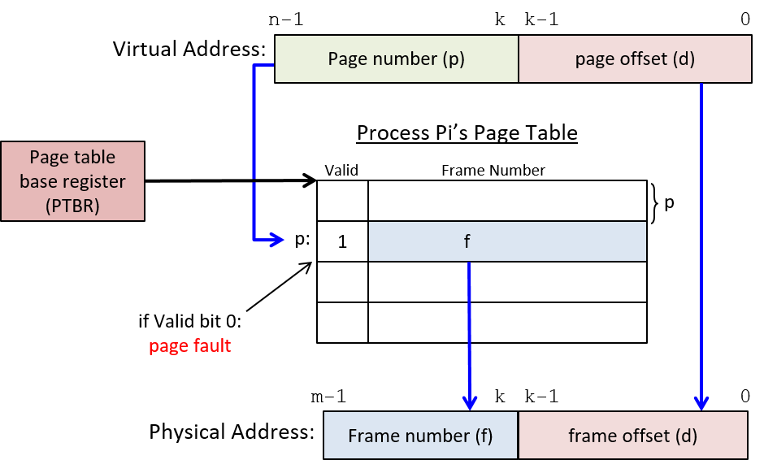

**Hình 10.** Page table của một process được dùng để dịch từ virtual address sang physical address.  
**PTBR** lưu địa chỉ gốc của page table của process đang chạy.

#### Ví dụ: Ánh xạ VA sang PA bằng Page Table

Xét một hệ thống phân trang (rất nhỏ) với các thông số:

- Kích thước page: **4 byte**  
- Virtual address: **6 bit**  
  - 4 bit cao: **page number**  
  - 2 bit thấp: **byte offset**  
- Physical address: **7 bit**

Giả sử page table của process **P1** trong hệ thống này như **Bảng 1** (giá trị ở cả dạng thập phân và nhị phân):

| Entry        | Valid | Frame #         |
|--------------|-------|-----------------|
| 0 (0b0000)   | 1     | 23 (0b10111)    |
| 1 (0b0001)   | 0     | 17 (0b10001)    |
| 2 (0b0010)   | 1     | 11 (0b01011)    |
| 3 (0b0011)   | 1     | 16 (0b10000)    |
| 4 (0b0100)   | 0     | 08 (0b01000)    |
| 5 (0b0101)   | 1     | 14 (0b01110)    |
| ...          | ...   | ...             |
| 15 (0b1111)  | 1     | 30 (0b11110)    |

**Bảng 1.** Page table của process P1

Từ ví dụ này, ta rút ra một số điểm quan trọng về kích thước địa chỉ, các thành phần của địa chỉ và việc dịch địa chỉ:

- **Kích thước (số lượng entry) của page table** được xác định bởi số bit trong virtual address và kích thước page của hệ thống.  
  4 bit cao của mỗi virtual address 6 bit xác định page number, nên có tổng cộng \( 2^4 = 16 \) page trong virtual memory.  
  Vì page table có một entry cho mỗi virtual page, nên mỗi page table của process có 16 PTE.

- **Kích thước của mỗi PTE** phụ thuộc vào số bit trong physical address và kích thước page.  
  Mỗi PTE lưu một valid bit và một physical frame number.  
  - Valid bit cần 1 bit.  
  - Frame number cần 5 bit vì physical address dài 7 bit, trong đó 2 bit thấp là page offset (để địa chỉ hóa 4 byte trong mỗi page), còn lại 5 bit cao là frame number.  
  → Mỗi PTE cần 6 bit: 1 bit cho valid bit và 5 bit cho frame number.

- **Kích thước tối đa của virtual và physical memory** được xác định bởi số bit trong địa chỉ:  
  - Virtual address dài 6 bit → có thể địa chỉ hóa \( 2^6 = 64 \) byte → mỗi process có không gian địa chỉ ảo 64 byte.  
  - Physical address dài 7 bit → kích thước tối đa của physical memory là \( 2^7 = 128 \) byte.

- **Kích thước page**, số bit của virtual/physical address, và page table quyết định cách ánh xạ từ VA sang PA.  
  Ví dụ: nếu process P1 thực thi lệnh load từ virtual address `0b001110`, page table sẽ được dùng để dịch VA này sang physical address `0b1000010`, và địa chỉ này sẽ được dùng để truy cập giá trị trong RAM.


Các bước dịch **virtual address** (VA) sang **physical address** (PA) như sau:

1. **Tách các bit của VA** thành hai phần: **page number** (*p*) và **byte offset** (*d*).  
   - 4 bit cao là page number (`0b0011` hay page 3).  
   - 2 bit thấp là byte offset trong page (`0b10` hay byte thứ 2).

2. **Dùng page number (3)** làm chỉ số để truy cập **page table** và đọc **PTE** (Page Table Entry) của virtual page 3  
   (PT\[3\]: `valid:1`, `frame#:16`).

3. **Kiểm tra valid bit** để xác định ánh xạ PTE có hợp lệ hay không.  
   Trong trường hợp này, valid bit = 1, nghĩa là PTE chứa ánh xạ hợp lệ, tức là virtual page 3 đang được lưu trong physical frame 16.

4. **Tạo physical address** bằng cách:  
   - Lấy 5 bit frame number từ PTE làm **bit cao** của địa chỉ (`0b10000`).  
   - Lấy 2 bit offset từ VA (`0b10`) làm **bit thấp**.  
   → Physical address là `0b1000010` (nằm ở frame 16 của RAM, byte offset 2).

#### Triển khai Paging (Paging Implementation)

Hầu hết phần cứng máy tính đều hỗ trợ ở mức nào đó cho **paged virtual memory**, và OS cùng phần cứng phối hợp để triển khai paging trên một hệ thống cụ thể.  

Tối thiểu, hầu hết các kiến trúc đều cung cấp **page table base register** (**PTBR**) lưu **địa chỉ gốc** của page table của process đang chạy.  
Để dịch từ VA sang PA, phần **virtual page number** của VA sẽ được kết hợp với giá trị trong PTBR để tìm PTE của virtual page đó.  

Nói cách khác:  
- Virtual page number là **chỉ số** trong page table của process.  
- Giá trị này kết hợp với PTBR sẽ cho ra **địa chỉ RAM** của PTE cho page *p*  
  (ví dụ: `PTBR + p × (kích thước PTE)` là địa chỉ RAM của PTE cho page *p*).

Một số kiến trúc có thể hỗ trợ **tra cứu toàn bộ page table** bằng cách xử lý các bit PTE trong phần cứng.  
Nếu không, OS sẽ phải được **ngắt** để xử lý một số phần của quá trình tra cứu page table và truy cập các bit PTE để dịch VA sang PA.

Khi **context switch**, OS sẽ **lưu và khôi phục** giá trị PTBR của các process để đảm bảo rằng khi một process chạy trên CPU, nó sẽ truy cập ánh xạ VA–PA của riêng nó từ page table của chính nó trong RAM.  

Đây là một cơ chế giúp OS bảo vệ **virtual address space** của các process khỏi nhau:  
- Việc thay đổi giá trị PTBR khi context switch đảm bảo một process **không thể** truy cập ánh xạ VA–PA của process khác.  
- Nhờ đó, nó không thể đọc hoặc ghi dữ liệu tại các physical address đang lưu nội dung không gian địa chỉ ảo của bất kỳ process nào khác.

#### Ví dụ: Ánh xạ VA–PA của hai process

Ví dụ, xét một hệ thống với:

- Kích thước page: **8 byte**  
- Virtual address: **7 bit**  
- Physical address: **6 bit**


**Bảng trang của P1** | | | | **Bảng trang của P2** | | |
--- | --- | --- | --- | --- | --- | ---
**Entry**             | Valid | Frame #  |  | **Entry**             | Valid | Frame #  
0                     | 1     | 3        |  | 0                     | 1     | 1  
1                     | 1     | 2        |  | 1                     | 1     | 4  
2                     | 1     | 6        |  | 2                     | 1     | 5  
...                   | ...   | ...      |  | ...                   | ...   | ...  
11                    | 1     | 7        |  | 11                    | 0     | 3  
...                   | ...   | ...      |  | ...                   | ...   | ...  

**Bảng 2.** Ví dụ bảng trang của các process

Với trạng thái hiện tại (chỉ hiển thị một phần) của bảng trang của hai process (P1 và P2) trong **Bảng 2**,  
hãy tính **physical address** cho chuỗi **virtual memory address** sau được CPU tạo ra  
(mỗi địa chỉ được ghi kèm tiền tố là process đang chạy trên CPU):

```
P1: 0000100
P1: 0000000
P1: 0010000
              <---- context switch
P2: 0010000
P2: 0001010
P2: 1011001
              <---- context switch
P1: 1011001
```

**Bước 1:** Xác định cách chia bit trong virtual address và physical address.  
Vì kích thước page là 8 byte, **3 bit thấp** của mỗi địa chỉ code hóa **page offset** (*d*).  
Virtual address dài 7 bit → 3 bit thấp cho page offset, còn lại **4 bit cao** để xác định **page number** (*p*).  
Physical address dài 6 bit → 3 bit thấp cho page offset, **3 bit cao** xác định **frame number**.

**Bước 2:** Với mỗi virtual address, dùng các bit page number (*p*) để tra trong page table của process tương ứng, lấy **PTE** cho page *p*.  
Nếu **valid bit** trong PTE = 1 → dùng **frame number** (*f*) làm các bit cao của PA.  
Các bit thấp của PA lấy từ byte offset (*d*) của VA.

Kết quả được thể hiện trong **Bảng 3** (lưu ý bảng trang nào được dùng để dịch địa chỉ ở mỗi bước):

| Process | VirtAddr | p     | d   | PTE                  | f   | d   | PhysAddr |
|---------|----------|------|-----|----------------------|-----|-----|----------|
| P1      | 0000100  | 0000 | 100 | PT\[0]: 1(v),3(f)     | 011 | 100 | 011100   |
| P1      | 0000000  | 0000 | 000 | PT\[0]: 1(v),3(f)     | 011 | 000 | 011000   |
| P1      | 0010000  | 0010 | 000 | PT\[2]: 1(v),6(f)     | 110 | 000 | 110000   |
| **Context Switch P1 → P2** |          |      |     |                      |     |     |          |
| P2      | 0010000  | 0010 | 000 | PT\[2]: 1(v),5(f)     | 101 | 000 | 101000   |
| P2      | 0001010  | 0001 | 010 | PT\[1]: 1(v),4(f)     | 100 | 010 | 100010   |
| P2      | 1011001  | 1011 | 001 | PT\[11]: 0(v),3(f)    | **page fault (valid bit 0)** |     |          |
| **Context Switch P2 → P1** |          |      |     |                      |     |     |          |
| P1      | 1011001  | 1011 | 001 | PT\[11]: 1(v),7(f)    | 111 | 001 | 111001   |

**Bảng 3.** Ánh xạ địa chỉ cho chuỗi truy cập bộ nhớ ví dụ từ P1 và P2.  
Lưu ý rằng **context switch** sẽ thay đổi bảng trang được dùng để dịch địa chỉ.

**Ví dụ giải thích:**  
Xét lần truy cập địa chỉ đầu tiên của P1:  
- P1 truy cập VA = 8 (`0b0000100`).  
- Chia địa chỉ: **page number** = 0 (`0b0000`), **byte offset** = 4 (`0b100`).  
- Page number 0 → tra PTE entry 0: `valid bit = 1` (ánh xạ hợp lệ), `frame number = 3` (`0b011`).  
- PA được tạo: bit cao = `0b011` (frame number), bit thấp = `0b100` (offset) → PA = `0b011100`.

Khi P2 được **context switch** lên CPU, bảng trang của P2 sẽ được dùng.  
Lưu ý rằng khi P1 và P2 truy cập cùng một VA `0b0010000`, chúng nhận được **physical address khác nhau**.  
Nếu P2 truy cập một PTE có valid bit = 0, sẽ xảy ra **page fault**, yêu cầu OS xử lý.

(TODO)


### 13.3.4. Hiệu quả sử dụng bộ nhớ (Memory Efficiency)

Một trong những mục tiêu chính của **operating system** (OS – hệ điều hành) là quản lý hiệu quả các tài nguyên phần cứng.  
Hiệu năng của hệ thống phụ thuộc đặc biệt vào cách OS quản lý **memory hierarchy** (hệ thống phân cấp bộ nhớ).  
Ví dụ: nếu một **process** truy cập dữ liệu được lưu trong RAM, nó sẽ chạy nhanh hơn nhiều so với khi dữ liệu đó nằm trên đĩa.

OS luôn cố gắng tăng **mức độ multiprogramming** (đa chương trình) trong hệ thống để giữ cho CPU bận rộn thực hiện công việc thực sự, ngay cả khi một số process đang bị **blocked** (chặn) chờ một sự kiện như **disk I/O**.  
Tuy nhiên, vì RAM là bộ nhớ có dung lượng cố định, OS phải quyết định process nào sẽ được nạp vào RAM tại mỗi thời điểm, điều này có thể giới hạn mức độ multiprogramming của hệ thống.  

Ngay cả những hệ thống có lượng RAM lớn (hàng chục hoặc hàng trăm gigabyte) cũng thường không thể đồng thời lưu trữ toàn bộ **address space** (không gian địa chỉ) của tất cả các process trong hệ thống.  
Do đó, OS có thể sử dụng tài nguyên hiệu quả hơn bằng cách chỉ chạy các process với **một phần** không gian địa chỉ ảo của chúng được nạp vào RAM.

#### Triển khai Virtual Memory bằng RAM, đĩa và thay thế trang (Page Replacement)

Như đã đề cập trong [Chương Memory Hierarchy](../C11-MemHierarchy/mem_hierarchy.html#_locality),  
các truy cập bộ nhớ thường thể hiện **tính cục bộ** (locality) rất cao.  
Trong ngữ cảnh **paging**, điều này có nghĩa là các process có xu hướng truy cập các **page** trong không gian bộ nhớ của chúng với mức độ **temporal locality** (cục bộ theo thời gian) hoặc **spatial locality** (cục bộ theo không gian) cao.  
Nó cũng có nghĩa là tại bất kỳ thời điểm nào trong quá trình thực thi, một process thường **không** truy cập một phạm vi lớn trong không gian địa chỉ của nó.  
Trên thực tế, các process thường **không bao giờ** sử dụng hết toàn bộ không gian stack hoặc heap của mình.

Một cách để OS sử dụng hiệu quả cả RAM và CPU là **coi RAM như một bộ nhớ đệm (cache) cho đĩa**.  
Bằng cách này, OS cho phép các process chạy trong hệ thống chỉ với **một số** page bộ nhớ ảo của chúng được nạp vào các **physical frame** của RAM.  
Các page bộ nhớ ảo khác vẫn nằm trên **secondary storage** (bộ nhớ phụ) như đĩa, và OS chỉ nạp chúng vào RAM khi process truy cập tới địa chỉ thuộc các page đó.  

Đây là một phần khác của abstraction **virtual memory** — OS triển khai một góc nhìn về một “bộ nhớ vật lý” lớn duy nhất, được xây dựng từ RAM kết hợp với đĩa hoặc các thiết bị lưu trữ phụ khác.  
Lập trình viên **không cần** quản lý thủ công bộ nhớ của chương trình, cũng như không cần xử lý việc di chuyển dữ liệu vào/ra RAM khi chương trình cần.

Bằng cách coi RAM như cache cho đĩa, OS chỉ giữ trong RAM **những page** từ không gian địa chỉ ảo của các process **đang được truy cập** hoặc **vừa được truy cập gần đây**.  
Kết quả là:

- Các page được truy cập thường xuyên sẽ nằm trong RAM nhanh.
- Các page ít hoặc không được truy cập sẽ nằm trên đĩa chậm hơn.

Điều này giúp sử dụng RAM hiệu quả hơn vì OS chỉ dùng RAM để lưu các page thực sự được dùng, tránh lãng phí dung lượng RAM cho các page sẽ không được truy cập trong thời gian dài hoặc không bao giờ.  

Nó cũng giúp CPU hoạt động hiệu quả hơn bằng cách cho phép nhiều process cùng chia sẻ RAM để lưu các page đang hoạt động, từ đó tăng số lượng process ở trạng thái **ready** trong hệ thống, giảm thời gian CPU rảnh do tất cả process đều đang chờ sự kiện như disk I/O.

Tuy nhiên, trong hệ thống virtual memory, đôi khi process cố gắng truy cập một page **chưa được lưu trong RAM** (gây ra **page fault**).  
Khi xảy ra page fault, OS cần đọc page đó từ đĩa vào RAM trước khi process có thể tiếp tục thực thi.  

**MMU** sẽ đọc **valid bit** của **PTE** để xác định có cần kích hoạt **page fault exception** hay không.  
Khi gặp một PTE có valid bit = 0, MMU sẽ **trap** (ngắt) về OS, và OS sẽ thực hiện các bước sau:

1. **Tìm một frame trống** (ví dụ: frame *j*) trong RAM để nạp page bị lỗi vào.
2. **Đọc từ đĩa** để nạp page vào frame *j* của RAM.
3. Khi việc đọc từ đĩa hoàn tất, **cập nhật PTE**: đặt frame number = *j* và valid bit = 1 (PTE của page bị lỗi giờ đã có ánh xạ hợp lệ tới frame *j*).
4. **Khởi động lại process** tại lệnh đã gây ra page fault.  
   Lúc này, page table đã có ánh xạ hợp lệ cho page bị lỗi, process có thể truy cập địa chỉ bộ nhớ ảo ánh xạ tới offset trong physical frame *j*.


Để xử lý **page fault**, OS cần theo dõi những **RAM frame** nào đang trống để có thể tìm một frame trống và nạp page được đọc từ đĩa vào đó.  
Hệ điều hành thường duy trì một **danh sách các frame trống** sẵn sàng để cấp phát khi xảy ra page fault.  

Nếu không còn frame RAM trống, OS sẽ chọn một frame đang được sử dụng và **thay thế** page trong đó bằng page bị lỗi.  
**PTE** (Page Table Entry) của page bị thay thế sẽ được cập nhật, đặt **valid bit** của nó về 0 (ánh xạ PTE của page này không còn hợp lệ).  

Page bị thay thế sẽ được ghi trở lại đĩa nếu nội dung của nó trong RAM **khác** với bản trên đĩa;  
nếu process sở hữu page đã ghi dữ liệu vào page khi nó đang nằm trong RAM, thì bản RAM của page cần được ghi ra đĩa trước khi bị thay thế để tránh mất các thay đổi trong page của bộ nhớ ảo.  

PTE thường bao gồm một **dirty bit** để cho biết bản sao trong RAM của page đã bị sửa đổi (ghi dữ liệu) hay chưa.  
Trong quá trình thay thế trang, nếu dirty bit của page bị thay thế được đặt, page đó cần được ghi ra đĩa trước khi thay bằng page bị lỗi.  
Nếu dirty bit = 0, bản trên đĩa của page bị thay thế giống với bản trong RAM, và page không cần ghi ra đĩa khi bị thay thế.

Trong phần thảo luận về **virtual memory**, chúng ta chủ yếu tập trung vào phần **mechanism** (cơ chế) của việc triển khai bộ nhớ ảo phân trang.  
Tuy nhiên, còn một phần quan trọng khác là **policy** (chính sách) trong việc triển khai paging của OS.  

Khi RAM trống trong hệ thống đã hết, OS cần thực thi **page replacement policy** (chính sách thay thế trang).  
Chính sách này sẽ chọn một frame RAM đang được sử dụng và thay nội dung của nó bằng page bị lỗi; page hiện tại sẽ bị **evict** (loại bỏ) khỏi RAM để nhường chỗ cho page bị lỗi.  

OS cần triển khai một chính sách thay thế trang tốt để chọn frame nào trong RAM sẽ được ghi ra đĩa nhằm nhường chỗ cho page bị lỗi.  
Ví dụ: OS có thể triển khai chính sách **least recently used** (LRU – ít được sử dụng gần đây nhất), thay thế page trong frame RAM mà đã lâu không được truy cập nhất.  
LRU hoạt động tốt khi các truy cập bộ nhớ có tính cục bộ cao.  
Ngoài ra còn nhiều chính sách khác mà OS có thể lựa chọn để triển khai.  
Xem thêm trong giáo trình hệ điều hành để biết chi tiết về các chính sách thay thế trang.

#### Tăng tốc độ truy cập trang (Making Page Accesses Faster)

Mặc dù **paging** có nhiều lợi ích, nó cũng gây ra sự **chậm lại đáng kể** cho mỗi lần truy cập bộ nhớ.  
Trong hệ thống bộ nhớ ảo phân trang, mỗi lệnh **load** hoặc **store** tới một địa chỉ bộ nhớ ảo cần **hai** lần truy cập RAM:

1. Lần đầu đọc **PTE** để lấy frame number phục vụ dịch địa chỉ từ ảo sang vật lý.
2. Lần thứ hai đọc hoặc ghi byte tại địa chỉ RAM vật lý.

Do đó, trong hệ thống bộ nhớ ảo phân trang, mỗi lần truy cập bộ nhớ sẽ chậm gấp đôi so với hệ thống hỗ trợ truy cập trực tiếp vào RAM vật lý.

Một cách để giảm chi phí phụ trội của paging là **cache** (lưu tạm) ánh xạ từ virtual page number sang physical frame number.  
Khi dịch một virtual address, **MMU** sẽ kiểm tra page number trong cache trước.  
Nếu tìm thấy, ánh xạ frame number của page có thể được lấy trực tiếp từ cache entry, tránh được một lần truy cập RAM để đọc PTE.

**Translation Look-aside Buffer** (**TLB**) là một **hardware cache** (bộ nhớ đệm phần cứng) lưu trữ các ánh xạ (page number, frame number).  
Đây là một cache nhỏ, **fully associative** (liên kết đầy đủ), được tối ưu hóa cho việc tra cứu nhanh trong phần cứng.  

- Khi MMU tìm thấy ánh xạ trong TLB (**TLB hit**), không cần tra cứu page table để dịch địa chỉ ảo sang địa chỉ vật lý, và chỉ cần **một** lần truy cập RAM để thực hiện load hoặc store.  
- Khi không tìm thấy ánh xạ trong TLB (**TLB miss**), cần thêm một lần truy cập RAM để đọc PTE của page, từ đó tạo địa chỉ vật lý cho thao tác load hoặc store.  
  Ánh xạ liên quan đến TLB miss sẽ được thêm vào TLB.

Với tính cục bộ cao trong các truy cập bộ nhớ, **tỉ lệ hit** trong TLB thường rất cao, giúp truy cập bộ nhớ trong hệ thống bộ nhớ ảo phân trang nhanh hơn nhiều — hầu hết các truy cập bộ nhớ ảo chỉ cần **một** lần truy cập RAM.

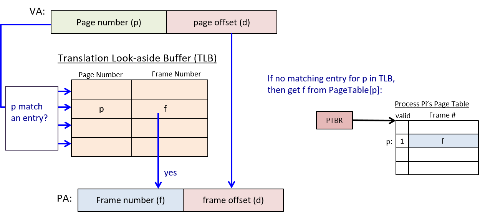

**Hình 11.** **Translation Look-aside Buffer** (TLB) là một cache phần cứng nhỏ lưu trữ ánh xạ từ virtual page sang physical frame.  
TLB được tìm kiếm trước cho entry của page *p*. Nếu tìm thấy, không cần tra cứu page table để dịch địa chỉ ảo sang địa chỉ vật lý.


