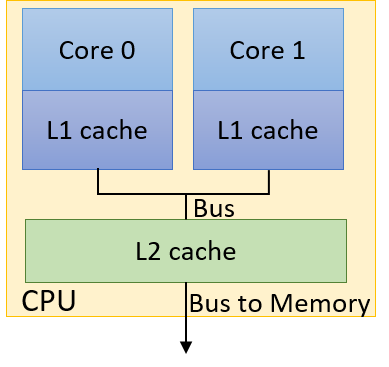

## 14.5. Tính nhất quán bộ nhớ đệm (Cache Coherence) và Chia sẻ sai (False Sharing)

**Multicore cache** (bộ nhớ đệm trên hệ thống đa lõi) có thể ảnh hưởng sâu sắc đến hiệu năng của một chương trình **multithreaded** (đa luồng).  
Trước tiên, hãy cùng điểm lại nhanh một số [khái niệm cơ bản liên quan đến thiết kế cache](../C11-MemHierarchy/caching.html#_cpu_caches):

- Dữ liệu/lệnh không được vận chuyển **từng phần tử riêng lẻ** vào cache.  
  Thay vào đó, dữ liệu được truyền theo **block** (khối), và kích thước block thường **lớn hơn** ở các mức thấp hơn của **memory hierarchy** (hệ thống phân cấp bộ nhớ).

- Mỗi cache được tổ chức thành một tập hợp (**set**), mỗi set chứa một số **line** (dòng).  
  Mỗi line lưu trữ một block dữ liệu.

- Các bit riêng lẻ của **memory address** (địa chỉ bộ nhớ) được dùng để xác định **set**, **tag**, và **block offset** trong cache — nơi sẽ ghi block dữ liệu.

- **Cache hit** xảy ra khi block dữ liệu mong muốn đã tồn tại trong cache.  
  Ngược lại, **cache miss** xảy ra khi block không có trong cache, và hệ thống sẽ tìm kiếm ở mức thấp hơn của memory hierarchy (có thể là cache cấp thấp hơn hoặc **main memory**).

- **Valid bit** cho biết block tại một line cụ thể trong cache có thể được sử dụng an toàn hay không.  
  Nếu valid bit = 0, block dữ liệu tại line đó **không thể** được sử dụng (ví dụ: block có thể chứa dữ liệu từ một process đã thoát).

- Dữ liệu được ghi vào cache/bộ nhớ dựa trên hai chiến lược chính:  
  - **Write-through**: dữ liệu được ghi đồng thời vào cache và main memory.  
  - **Write-back**: dữ liệu chỉ được ghi vào cache và sẽ được ghi xuống các mức thấp hơn trong hierarchy **sau khi** block bị loại bỏ (evict) khỏi cache.

### 14.5.1. Cache trên hệ thống đa lõi (Caches on Multicore Systems)

[Nhớ lại](../C11-MemHierarchy/coherency.html#_looking_ahead_caching_on_multicore_processors) rằng, trong **shared memory architecture** (kiến trúc bộ nhớ chia sẻ), mỗi **core** có thể có cache riêng, và nhiều core có thể chia sẻ một cache chung.  

**Hình 1** minh họa một ví dụ CPU hai lõi (**dual-core CPU**).  
Mặc dù mỗi core có **L1 cache** riêng, nhưng cả hai core chia sẻ chung một **L2 cache**.



**Hình 1.** Ví dụ CPU hai lõi với L1 cache riêng và L2 cache dùng chung

Nhiều **thread** trong cùng một chương trình thực thi có thể chạy các **function** khác nhau.  
Nếu không có [**cache coherence strategy**](../C11-MemHierarchy/coherency.html#_cache_coherency) (chiến lược đảm bảo tính nhất quán bộ nhớ đệm) để đảm bảo mỗi cache duy trì một góc nhìn nhất quán về bộ nhớ chia sẻ, các biến chia sẻ có thể bị cập nhật **không đồng bộ**.

Ví dụ: xét CPU hai lõi trong **Hình 1**, mỗi core đang chạy một thread riêng biệt **đồng thời**:

- Thread trên **Core 0** có biến cục bộ `x`.
- Thread trên **Core 1** có biến cục bộ `y`.
- Cả hai thread cùng chia sẻ quyền truy cập biến toàn cục `g`.

**Bảng 1** cho thấy một kịch bản thực thi có thể xảy ra:

| Time | Core 0       | Core 1       |
|------|--------------|--------------|
| 0    | g = 5        | (other work) |
| 1    | (other work) | y = g * 4    |
| 2    | x += g       | y += g * 2   |

**Bảng 1.** Chia sẻ dữ liệu gây vấn đề do caching

Giả sử giá trị ban đầu của `g` là **10**, và giá trị ban đầu của `x` và `y` đều là **0**.  
Vậy giá trị cuối cùng của `y` sau chuỗi thao tác này là bao nhiêu?  

Không có **cache coherence**, đây là câu hỏi rất khó trả lời, vì tồn tại ít nhất **ba bản sao** của `g`:

1. Một bản trong **L1 cache** của Core 0.  
2. Một bản trong **L1 cache** của Core 1.  
3. Một bản khác trong **L2 cache** dùng chung.


**Hình 2.** Một cập nhật gây vấn đề đối với cache không sử dụng cơ chế **cache coherency**

**Hình 2** minh họa một kết quả sai có thể xảy ra sau khi chuỗi thao tác trong **Bảng 1** hoàn tất.  
Giả sử L1 cache sử dụng **write-back policy** (chính sách ghi-lùi).  
Khi thread chạy trên **Core 0** ghi giá trị `5` vào `g`, nó chỉ cập nhật giá trị `g` trong **L1 cache** của Core 0.  
Giá trị `g` trong **L1 cache** của Core 1 vẫn là `10`, và bản sao trong **L2 cache** dùng chung cũng vẫn là `10`.  
Ngay cả khi sử dụng **write-through policy** (chính sách ghi-xuyên), cũng không có gì đảm bảo rằng bản sao `g` trong L1 cache của Core 1 sẽ được cập nhật!  
Trong trường hợp này, `y` sẽ có giá trị cuối cùng là **60**.

Một **cache coherence strategy** (chiến lược đảm bảo tính nhất quán bộ nhớ đệm) sẽ **invalide** (vô hiệu hóa) hoặc **update** (cập nhật) các bản sao dữ liệu chia sẻ trong các cache khác khi một cache ghi dữ liệu vào giá trị chia sẻ đó.  
**Protocol Modified Shared Invalid (MSI)** (xem chi tiết trong [Chương 11.6](../C11-MemHierarchy/coherency.html#_the_msi_protocol)) là một ví dụ về **invalidating cache coherence protocol** (giao thức nhất quán bộ nhớ đệm kiểu vô hiệu hóa).

Một kỹ thuật phổ biến để triển khai MSI là **snooping**.  
Một **snoopy cache** sẽ “nghe lén” (snoop) trên **memory bus** để phát hiện các tín hiệu ghi.  
Nếu snoopy cache phát hiện một thao tác ghi vào một **shared cache block** (khối cache chia sẻ), nó sẽ **invalidate** line chứa block đó.  
Kết quả là chỉ còn **một bản hợp lệ duy nhất** của block nằm trong cache vừa được ghi, trong khi **tất cả các bản sao khác** của block trong các cache khác sẽ bị đánh dấu là **invalid**.

Việc áp dụng giao thức MSI với snooping sẽ cho ra kết quả đúng là gán giá trị **30** cho biến `y` trong ví dụ trước.

### 14.5.2. False Sharing

**Cache coherence** đảm bảo tính đúng đắn, nhưng nó cũng có thể gây ảnh hưởng tiêu cực đến hiệu năng.  
Hãy nhớ rằng khi thread trên Core 0 cập nhật `g`, **snoopy cache** sẽ **invalidate** không chỉ `g`, mà **toàn bộ cache line** chứa `g`.

Xét [phiên bản thử nghiệm ban đầu](_attachments/countElems_p.c) của chúng ta khi **parallelize** (song song hóa) hàm `countElems` trong thuật toán **CountSort**.  
Để tiện theo dõi, hàm này được trích lại ở đây:


```c
/*parallel version of step 1 (first cut) of CountSort algorithm:
 * extracts arguments from args value
 * calculates portion of the array this thread is responsible for counting
 * computes the frequency of all the elements in assigned component and stores
 * the associated counts of each element in counts array
*/
void *countElems(void *args){
    //extract arguments
    //ommitted for brevity
    int *array = myargs->ap;
    long *counts = myargs->countp;

    //assign work to the thread
    //compute chunk, start, and end
    //ommited for brevity

    long i;
    //heart of the program
    for (i = start; i < end; i++){
        val = array[i];
        counts[val] = counts[val] + 1;
    }

    return NULL;
}
```


Trong phần thảo luận trước về hàm này, chúng ta đã chỉ ra rằng **data race** có thể khiến mảng `counts` không được điền đúng tập giá trị đếm.  
Bây giờ, hãy xem điều gì xảy ra nếu chúng ta thử **đo thời gian** chạy hàm này.  
Ta thêm code đo thời gian vào `main` bằng `gettimeofday` giống hệt như trong [countElems_p_v3.c](_attachments/countElems_p_v3.c).  

Kết quả benchmark phiên bản ban đầu của `countElems` trên 100 triệu phần tử như sau:

```
$ ./countElems_p 100000000 0 1
Time for Step 1 is 0.336239 s

$ ./countElems_p 100000000 0 2
Time for Step 1 is 0.799464 s

$ ./countElems_p 100000000 0 4
Time for Step 1 is 0.767003 s
```

Ngay cả **khi không có bất kỳ cơ chế đồng bộ nào**, phiên bản này của chương trình **vẫn chạy chậm hơn** khi số lượng thread tăng lên!

Để hiểu chuyện gì đang xảy ra, hãy xem lại mảng `counts`.  
Mảng `counts` lưu tần suất xuất hiện của mỗi số trong mảng đầu vào.  
Giá trị lớn nhất được xác định bởi biến `MAX`.  
Trong chương trình ví dụ, `MAX = 10`.  
Nói cách khác, mảng `counts` chiếm **40 byte** dung lượng.

Hãy nhớ rằng thông tin [cache details](../C11-MemHierarchy/coherency.html#_looking_ahead_caching_on_multicore_processors) trên hệ thống Linux nằm trong thư mục `/sys/devices/system/cpu/`.  
Mỗi **logical core** có thư mục con `cpuk` (trong đó `k` là số thứ tự core).  
Mỗi thư mục `cpu` lại có các thư mục `index` riêng, biểu thị các cache có sẵn cho core đó.

Các thư mục `index` chứa nhiều tệp mô tả chi tiết về cache của từng logical core.  
Nội dung ví dụ của thư mục `index0` (thường tương ứng với L1 cache trên Linux) như sau:

```
$ ls /sys/devices/system/cpu/cpu0/cache/index0
coherency_line_size      power            type
level                    shared_cpu_list  uevent
number_of_sets           shared_cpu_map   ways_of_associativity
physical_line_partition  size
```

Để biết kích thước **cache line** của L1 cache, dùng lệnh:

```
$ cat /sys/devices/system/cpu/cpu0/cache/index0/coherency_line_size
64
```

Kết quả cho thấy **L1 cache line size** của máy là **64 byte**.  
Điều này có nghĩa là mảng `counts` 40 byte **nằm gọn trong một cache line**.

Hãy nhớ rằng với các **invalidating cache coherence protocol** như MSI, mỗi khi chương trình cập nhật một biến chia sẻ, **toàn bộ cache line** trong các cache khác chứa biến đó sẽ bị **invalidate**.  

Xem điều gì xảy ra khi hai thread chạy hàm trên.  
Một kịch bản thực thi có thể xảy ra được thể hiện trong **Bảng 2** (giả sử mỗi thread chạy trên một core riêng, và biến `x` là biến cục bộ của từng thread):

| Time  | Thread 0                  | Thread 1                  |
|-------|---------------------------|---------------------------|
| *i*   | Reads array\[x\] (1)       | ...                       |
| *i+1* | Increments counts\[1\]     | Reads array\[x\] (4)       |
|       | (**invalidates cache line**)|                           |
| *i+2* | Reads array\[x\] (6)       | Increments counts\[4\]     |
|       |                           | (**invalidates cache line**)|  
| *i+3* | Increments counts\[6\]     | Reads array\[x\] (2)       |
|       | (**invalidates cache line**)|                           |
| *i+4* | Reads array\[x\] (3)       | Increments counts\[2\]     |
|       |                           | (**invalidates cache line**)|  
| *i+5* | Increments counts\[3\]     | ...                       |
|       | (**invalidates cache line**)|                           |

**Bảng 2.** Một chuỗi thực thi có thể xảy ra của hai thread chạy `countElems`

- Ở bước thời gian *i*, **Thread 0** đọc giá trị tại `array[x]` trong phần dữ liệu của nó, giá trị này là `1` trong ví dụ này.

- Trong các bước thời gian từ *i + 1* đến *i + 5*, mỗi thread đọc một giá trị từ `array[x]`.  
  Lưu ý rằng mỗi thread đang truy cập các phần tử **khác nhau** của mảng.  
  Không chỉ vậy, mỗi lần đọc `array` trong chuỗi thực thi mẫu này đều trả về giá trị **duy nhất** (nên không có **race condition** trong chuỗi thực thi này).  
  Sau khi đọc giá trị từ `array[x]`, mỗi thread sẽ tăng giá trị tương ứng trong `counts`.

- Hãy nhớ rằng mảng `counts` **nằm gọn trong một cache line** của L1 cache.  
  Do đó, **mỗi lần ghi** vào `counts` sẽ **invalidate** (vô hiệu hóa) **toàn bộ cache line** này trong **mọi L1 cache khác**.

- Kết quả là, mặc dù đang cập nhật **các vị trí bộ nhớ khác nhau** trong `counts`, nhưng bất kỳ cache line nào chứa `counts` cũng sẽ bị **invalidate** với **mỗi lần cập nhật** `counts`!

Việc invalidation buộc tất cả các L1 cache phải cập nhật lại cache line này bằng một phiên bản “hợp lệ” từ L2.  
Việc lặp đi lặp lại quá trình invalidation và ghi đè cache line từ L1 cache là một ví dụ về **thrashing** — khi các xung đột lặp lại trong cache gây ra hàng loạt **cache miss**.

Khi số lượng core tăng, vấn đề càng trở nên nghiêm trọng, vì lúc này có nhiều L1 cache hơn cùng thực hiện invalidation trên cache line.  
Kết quả là, việc thêm thread mới sẽ làm **thời gian chạy chậm lại**, mặc dù mỗi thread đang truy cập các phần tử **khác nhau** của mảng `counts`!  

Đây là một ví dụ về **false sharing** — hiện tượng “ảo giác” rằng các phần tử riêng lẻ đang được nhiều core chia sẻ.  
Trong ví dụ trước, có vẻ như tất cả các core đang truy cập cùng một phần tử của `counts`, mặc dù thực tế không phải vậy.

### 14.5.3. Khắc phục False Sharing

Một cách để khắc phục false sharing là **padding** (đệm) mảng (trong trường hợp này là `counts`) bằng các phần tử bổ sung để nó **không vừa** trong một cache line.  
Tuy nhiên, padding có thể gây **lãng phí bộ nhớ** và có thể **không loại bỏ hoàn toàn vấn đề** trên mọi kiến trúc (ví dụ: hai máy khác nhau có kích thước L1 cache khác nhau).  
Trong hầu hết các trường hợp, việc viết code để hỗ trợ nhiều kích thước cache thường **không đáng** so với lợi ích hiệu năng thu được.

Một giải pháp tốt hơn là để các thread ghi vào **local storage** (bộ nhớ cục bộ) bất cứ khi nào có thể.  
Trong ngữ cảnh này, local storage là vùng nhớ **cục bộ** cho một thread.  
Giải pháp sau đây giảm false sharing bằng cách thực hiện cập nhật vào một biến `counts` cục bộ được khai báo riêng, gọi là `local_counts`.

Hãy xem lại phiên bản cuối cùng của hàm `countElems` (trích từ [countElems_p_v3.c](_attachments/countElems_p_v3.c)):

```c
/*parallel version of CountSort algorithm step 1 (final attempt with mutexes):
 * extracts arguments from args value
 * calculates the portion of the array this thread is responsible for counting
 * computes the frequency of all the elements in assigned component and stores
 * the associated counts of each element in counts array
*/
void *countElems( void *args ){
    //extract arguments
    //omitted for brevity
    int *array = myargs->ap;
    long *counts = myargs->countp;

    long local_counts[MAX] = {0}; //local declaration of counts array

    //assign work to the thread
    //compute chunk, start, and end values (omitted for brevity)

    long i;

    //heart of the program
    for (i = start; i < end; i++){
        val = array[i];
        local_counts[val] = local_counts[val] + 1; //update local counts array
    }

    //update to global counts array
    pthread_mutex_lock(&mutex); //acquire the mutex lock
    for (i = 0; i < MAX; i++){
        counts[i] += local_counts[i];
    }
    pthread_mutex_unlock(&mutex); //release the mutex lock

    return NULL;
}
```

Việc sử dụng `local_counts` để cộng dồn tần suất thay vì `counts` là nguyên nhân chính giúp giảm false sharing trong ví dụ này:

```c
for (i = start; i < end; i++){
    val = array[i];
    local_counts[val] = local_counts[val] + 1; // cập nhật mảng đếm cục bộ
}
```

Vì **cache coherence** được thiết kế để duy trì góc nhìn nhất quán về bộ nhớ chia sẻ, nên invalidation chỉ xảy ra khi **ghi** vào **giá trị chia sẻ** trong bộ nhớ.  
Do `local_counts` **không được chia sẻ** giữa các thread, việc ghi vào nó sẽ **không** làm invalidate cache line tương ứng.

Trong phần cuối của code, **mutex** đảm bảo tính đúng đắn bằng cách chỉ cho phép **một thread** cập nhật mảng `counts` chia sẻ tại một thời điểm:

```c
// cập nhật mảng counts toàn cục
pthread_mutex_lock(&mutex); // khóa mutex
for (i = 0; i < MAX; i++){
    counts[i] += local_counts[i];
}
pthread_mutex_unlock(&mutex); // mở khóa mutex
```

Vì `counts` nằm trên **một cache line duy nhất**, nó vẫn sẽ bị invalidate với mỗi lần ghi.  
Điểm khác biệt là chi phí ở đây **tối đa** là `MAX × t` lần ghi so với `n` lần ghi,  
trong đó `n` là độ dài mảng đầu vào và `t` là số lượng thread được sử dụng.

