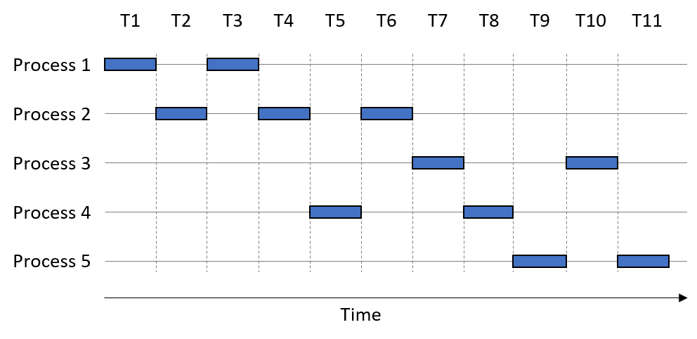
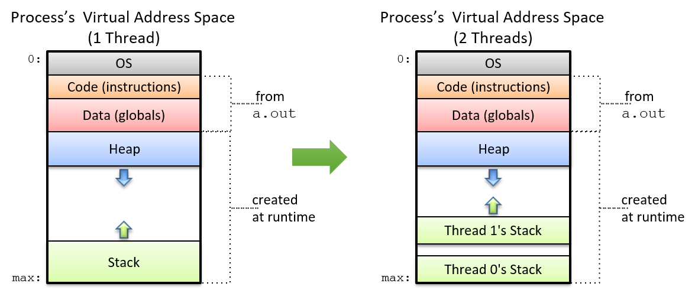

## 14.1. Lập trình hệ thống đa lõi (Programming Multicore Systems)

Hầu hết các ngôn ngữ lập trình phổ biến mà lập trình viên biết ngày nay đều được tạo ra **trước** kỷ nguyên đa lõi.  
Do đó, nhiều ngôn ngữ **không thể** *ngầm định* (hoặc tự động) tận dụng bộ xử lý đa lõi để tăng tốc độ thực thi chương trình.  
Thay vào đó, lập trình viên phải **chủ động** viết phần mềm để khai thác nhiều core trên hệ thống.

---

### 14.1.1. Ảnh hưởng của hệ thống đa lõi đến việc thực thi process

Hãy nhớ rằng một **process** (tiến trình) có thể được xem như một **abstraction** (sự trừu tượng hóa) của một chương trình đang chạy.  
Mỗi process thực thi trong **virtual address space** (không gian địa chỉ ảo) riêng của nó.  
**Operating system** (OS – hệ điều hành) lập lịch (schedule) các process để thực thi trên CPU; một **context switch** (chuyển ngữ cảnh) xảy ra khi CPU thay đổi process mà nó đang thực thi.

---

**Hình 1** minh họa cách năm process ví dụ có thể thực thi trên một CPU lõi đơn.



**Hình 1.** Trình tự thời gian thực thi của năm process khi chúng chia sẻ một CPU lõi đơn

---

Trục ngang là thời gian, với mỗi **time slice** (lát thời gian) tương ứng một đơn vị thời gian.  
Một ô vuông biểu thị thời điểm một process đang sử dụng CPU lõi đơn.  
Giả sử mỗi process thực thi trọn một time slice trước khi xảy ra context switch.  
Ví dụ, **Process 1** sử dụng CPU tại các bước thời gian T1 và T3.

---

Trong ví dụ này, thứ tự thực thi process là:  
P1, P2, P1, P2, P4, P2, P3, P4, P5, P3, P5.

Tại đây, ta phân biệt giữa hai khái niệm về thời gian:

- **CPU time**: lượng thời gian một process thực sự chạy trên CPU.
- **Wall-clock time**: lượng thời gian mà con người cảm nhận process cần để hoàn thành.

Wall-clock time thường **lớn hơn nhiều** so với CPU time, do có context switch.  
Ví dụ, CPU time của Process 1 là 2 đơn vị thời gian, nhưng wall-clock time của nó là 3 đơn vị thời gian.

---

Khi tổng thời gian thực thi của một process **chồng lấn** với process khác, các process đó đang chạy **concurrently** (đồng thời).  
Trong thời kỳ CPU lõi đơn, OS sử dụng concurrency để tạo **ảo giác** rằng máy tính có thể thực hiện nhiều việc cùng lúc  
(ví dụ: bạn có thể mở đồng thời chương trình máy tính bỏ túi, trình duyệt web và tài liệu soạn thảo văn bản).  
Thực tế, mỗi process vẫn thực thi **tuần tự**, và OS quyết định [thứ tự thực thi và hoàn thành của các process](../C13-OS/processes.html#_multiprogramming_and_context_switching) (thứ tự này có thể khác nhau ở mỗi lần chạy).

---

Quay lại ví dụ, ta thấy:

- Process 1 và Process 2 chạy **concurrently** vì thời gian thực thi của chúng chồng lấn tại T2–T4.
- Process 2 và Process 4 cũng chạy concurrently (T4–T6).
- Ngược lại, Process 2 **không** chạy concurrently với Process 3, vì chúng không có khoảng thời gian thực thi trùng nhau; Process 3 chỉ bắt đầu tại T7, trong khi Process 2 kết thúc ở T6.

---

Một CPU đa lõi cho phép OS lập lịch **một process khác nhau** cho **mỗi core** khả dụng, cho phép các process thực thi **simultaneously** (đồng thời thực sự).  
Việc thực thi đồng thời các lệnh từ các process chạy trên nhiều core được gọi là **parallel execution** (thực thi song song).  

**Hình 2** cho thấy cách các process ví dụ có thể thực thi trên hệ thống **dual-core** (2 lõi).


**Hình 2.** Trình tự thời gian thực thi của năm process, mở rộng để bao gồm hai CPU core (một lõi màu xanh đậm, một lõi màu xanh nhạt)

---

Trong ví dụ này, hai CPU core được tô màu khác nhau.  
Giả sử thứ tự thực thi process vẫn là:  
P1, P2, P1, P2, P4, P2, P3, P4, P5, P3, P5.

Sự xuất hiện của nhiều core cho phép một số process **thực thi sớm hơn**.  
Ví dụ:

- Tại T1: Core 1 chạy Process 1, Core 2 chạy Process 2.
- Tại T2: Core 1 chạy Process 2, Core 2 chạy Process 1.

Kết quả: Process 1 hoàn tất sau T2, trong khi Process 2 hoàn tất tại T3.

---

Lưu ý: **Parallel execution** chỉ làm tăng **số lượng process** có thể chạy tại một thời điểm.  
Trong **Hình 2**, tất cả process hoàn tất tại T7.  
Tuy nhiên, **mỗi process riêng lẻ** vẫn cần cùng một lượng CPU time như trong **Hình 1**.  
Ví dụ: Process 2 cần 3 đơn vị thời gian CPU, bất kể chạy trên hệ thống lõi đơn hay đa lõi (tức là *CPU time* không đổi).

---

CPU đa lõi giúp tăng **throughput** (thông lượng) của việc thực thi process — tức là số lượng process có thể hoàn thành trong một khoảng thời gian nhất định.  
Vì vậy, mặc dù CPU time của từng process không thay đổi, **wall-clock time** của nó có thể giảm.


### 14.1.2. Tăng tốc thực thi process bằng Threads

Một cách để tăng tốc thực thi của một process đơn là **phân rã** nó thành các luồng thực thi nhẹ, độc lập gọi là **thread**.  
**Hình 3** cho thấy cách **virtual address space** (không gian địa chỉ ảo) của một process thay đổi khi nó được **multithreaded** (đa luồng) với hai thread.  
Mỗi thread có **call stack** (ngăn xếp lời gọi hàm) riêng, nhưng tất cả các thread **chia sẻ** dữ liệu chương trình, lệnh, và vùng heap được cấp phát cho process đa luồng.

---



**Hình 3.** So sánh không gian địa chỉ ảo của process đơn luồng và process đa luồng với hai thread

---

Hệ điều hành lập lịch (schedule) các thread tương tự như cách nó lập lịch các process.  
Trên một **multicore processor** (bộ xử lý đa lõi), OS có thể tăng tốc thực thi của chương trình đa luồng bằng cách lập lịch cho các thread khác nhau chạy trên các core riêng biệt.  
Số lượng thread tối đa có thể thực thi song song bằng với số lượng **physical core** (lõi vật lý) trên hệ thống.  
Nếu số lượng thread vượt quá số lượng physical core, các thread còn lại phải **chờ đến lượt** để thực thi (tương tự như cách các process chạy trên một core đơn).

---

#### Ví dụ: Nhân vô hướng (Scalar Multiplication)

Ví dụ ban đầu về cách sử dụng multithreading để tăng tốc ứng dụng:  
Xét bài toán nhân vô hướng một mảng `array` với một số nguyên `s`.  
Trong phép nhân vô hướng, mỗi phần tử của mảng được nhân với `s`.

---

Một cài đặt **tuần tự** của hàm nhân vô hướng như sau:

```c
void scalar_multiply(int * array, long length, int s) {
    int i;
    for (i = 0; i < length; i++) {
      array[i] = array[i] * s;
    }
}
```

---

Giả sử `array` có tổng cộng *N* phần tử.  
Để tạo phiên bản đa luồng với *t* thread, cần:

1. Tạo *t* thread.
2. Gán cho mỗi thread một **phần con** của mảng đầu vào (tức là *N*/*t* phần tử).
3. Yêu cầu mỗi thread nhân các phần tử trong phần mảng của nó với `s`.

---

Giả sử phiên bản tuần tự của `scalar_multiply` mất **60 giây** để nhân một mảng 100 triệu phần tử.  
Để xây dựng phiên bản chạy với *t* = 4 thread, ta gán cho mỗi thread **1/4** mảng đầu vào (25 triệu phần tử).

---

**Hình 4** cho thấy điều gì xảy ra khi chạy 4 thread trên **một core**.  
Như trước, thứ tự thực thi do OS quyết định.  
Giả sử thứ tự thực thi thread là: Thread 1, Thread 3, Thread 2, Thread 4.  
Trên CPU lõi đơn (biểu diễn bằng các ô vuông), mỗi thread chạy **tuần tự**.  
Do đó, process đa luồng chạy trên một core vẫn mất **60 giây** (thậm chí lâu hơn một chút do overhead tạo thread).

---


**Hình 4.** Chạy bốn thread trên CPU lõi đơn

---

Bây giờ giả sử chạy process đa luồng trên hệ thống **dual-core**.  
**Hình 5** cho thấy kết quả.  
Vẫn với *t* = 4 thread và thứ tự thực thi: Thread 1, Thread 3, Thread 2, Thread 4.  
Hai core được biểu diễn bằng các ô vuông có màu khác nhau.  

- Tại T1: Thread 1 và Thread 3 chạy song song.  
- Tại T2: Thread 2 và Thread 4 chạy song song.  

Kết quả: process đa luồng vốn mất 60 giây giờ chỉ mất **30 giây**.

---


**Hình 5.** Chạy bốn thread trên CPU hai lõi

---

Cuối cùng, giả sử process đa luồng (*t* = 4) chạy trên CPU **quad-core** (4 lõi).  
**Hình 6** minh họa một trình tự thực thi như vậy.  
Mỗi core trong hình được tô màu khác nhau.  

- Tại T1: Cả 4 thread chạy song song.  

Kết quả: process đa luồng vốn mất 60 giây giờ chỉ mất **15 giây**.

---


**Hình 6.** Chạy bốn thread trên CPU bốn lõi

---

Nhìn chung, nếu số lượng thread bằng số lượng core (*c*) và OS lập lịch để mỗi thread chạy song song trên một core riêng, thì process đa luồng sẽ chạy trong khoảng **1/*c*** thời gian.  
Đây là **linear speedup** (tăng tốc tuyến tính) lý tưởng, nhưng hiếm khi đạt được trong thực tế.  

Ví dụ: nếu có nhiều process khác (hoặc process đa luồng khác) đang chờ CPU, tất cả sẽ cạnh tranh cho số core hạn chế, dẫn đến **resource contention** (tranh chấp tài nguyên).  
Nếu số thread vượt quá số core CPU, mỗi thread phải chờ đến lượt.  

Chúng ta sẽ tìm hiểu các yếu tố khác thường ngăn cản việc đạt được linear speedup [ở phần sau của chương này](performance.html#_measuring_the_performance_of_parallel_programs).

---

Bạn có muốn tôi dịch tiếp sang **14.2. Shared Memory Multiprocessing** để nối tiếp nội dung không?


