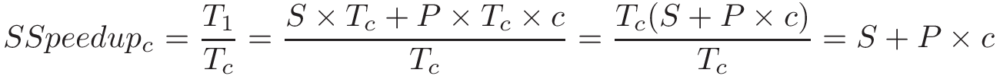

### 14.4.2. Các chủ đề nâng cao (Advanced Topics)

#### Định luật Gustafson–Barsis

Năm 1988, **John L. Gustafson**, một nhà khoa học máy tính và nhà nghiên cứu tại **Sandia National Labs**, đã viết một bài báo có tên *"Reevaluating Amdahl's Law"*[^1].  
Trong bài báo này, Gustafson đã chỉ ra một giả định quan trọng về việc thực thi chương trình song song — một giả định **không phải lúc nào cũng đúng**.

Cụ thể, **Amdahl's Law** ngụ ý rằng số lượng **compute core** (*c*) và tỷ lệ phần chương trình có thể song song hóa (*P*) là **độc lập** với nhau.  
Gustafson lưu ý rằng điều này "*hầu như không bao giờ đúng*"[^1].  

Trong khi việc đo hiệu năng của một chương trình bằng cách thay đổi số lượng core trên một tập dữ liệu cố định là một bài tập học thuật hữu ích, thì trong thực tế, **nhiều core hơn** (hoặc nhiều bộ xử lý hơn, như đã đề cập trong phần thảo luận về **distributed memory**) thường được bổ sung khi **quy mô bài toán tăng**.  
Gustafson viết[^1]: "*Có lẽ thực tế nhất là giả định thời gian chạy là hằng số, chứ không phải kích thước bài toán*".

Do đó, theo Gustafson, phát biểu chính xác nhất là:  
"*Lượng công việc có thể thực hiện song song thay đổi tuyến tính theo số lượng bộ xử lý*"[^1].

Xét một chương trình **song song** mất thời gian T~*c*~ để chạy trên hệ thống có *c* core.  
Gọi *S* là tỷ lệ phần chương trình **bắt buộc phải tuần tự**, mất *S* × T~*c*~ thời gian để chạy.  
Như vậy, phần có thể song song hóa của chương trình *P* = 1 − *S*, mất *P* × T~*c*~ thời gian để chạy trên *c* core.

Khi cùng chương trình này chạy trên **một core duy nhất**, phần tuần tự vẫn mất *S* × T~*c*~ (giả sử các điều kiện khác không đổi).  
Tuy nhiên, phần song song hóa (trước đây được chia cho *c* core) giờ phải chạy **tuần tự** trên một core, và mất *P* × T~*c*~ × *c* thời gian.  
Nói cách khác, thành phần song song sẽ mất **gấp *c* lần** thời gian trên hệ thống một core.  

Từ đó, **scaled speedup** (tăng tốc có tỉ lệ) được tính như sau:

Điều này cho thấy **scaled speedup** tăng **tuyến tính** theo số lượng đơn vị tính toán.

Xét lại ví dụ trước đây, trong đó **99%** chương trình có thể song song hóa (*P* = 0.99).  
Áp dụng công thức scaled speedup, tốc độ lý thuyết trên **100 bộ xử lý** sẽ là **99.01**.  
Trên **1.000 bộ xử lý**, sẽ là **990.01**.  
Lưu ý rằng **hiệu suất** (efficiency) vẫn giữ nguyên ở mức *P*.

Kết luận của Gustafson: "*Speedup nên được đo bằng cách mở rộng kích thước bài toán theo số lượng bộ xử lý, chứ không phải cố định kích thước bài toán*"[^1].  

Kết quả của Gustafson đáng chú ý vì nó cho thấy có thể đạt được **tốc độ tăng dần** bằng cách tăng số lượng bộ xử lý.  
Là một nhà nghiên cứu tại trung tâm siêu máy tính quốc gia, Gustafson quan tâm nhiều hơn đến việc **làm được nhiều việc hơn** trong cùng một khoảng thời gian.  
Trong nhiều lĩnh vực khoa học, khả năng phân tích nhiều dữ liệu hơn thường dẫn đến **độ chính xác** hoặc **độ tin cậy** của kết quả cao hơn.  
Công trình của Gustafson đã chứng minh rằng có thể đạt được **tốc độ rất lớn** trên số lượng bộ xử lý lớn, và đã **khơi dậy lại sự quan tâm** đối với xử lý song song[^2].

#### Khả năng mở rộng (Scalability)

Chúng ta mô tả một chương trình là **scalable** (có khả năng mở rộng) nếu hiệu năng được cải thiện (hoặc giữ nguyên) khi tăng số lượng tài nguyên (core, processor) hoặc kích thước bài toán.  
Hai khái niệm liên quan là **strong scaling** và **weak scaling**.  
Cần lưu ý rằng “weak” và “strong” trong ngữ cảnh này **không** chỉ ra *chất lượng* khả năng mở rộng của chương trình, mà chỉ là hai cách khác nhau để đo lường khả năng mở rộng.

Một chương trình được gọi là **strongly scalable** nếu việc tăng số lượng core/đơn vị xử lý trên một **kích thước bài toán cố định** mang lại cải thiện về hiệu năng.  
Chương trình thể hiện **strong linear scalability** nếu khi chạy trên *n* core, **speedup** cũng là *n*.  
Tất nhiên, **Amdahl’s Law** đảm bảo rằng sau một điểm nào đó, việc thêm core sẽ không còn ý nghĩa.

Một chương trình được gọi là **weakly scalable** nếu việc tăng kích thước dữ liệu **cùng tỷ lệ** với số lượng core (tức là kích thước dữ liệu cố định trên mỗi core/processor) dẫn đến hiệu năng giữ nguyên hoặc được cải thiện.  
Chúng ta nói chương trình có **weak linear scalability** nếu thấy hiệu năng tăng *n* lần khi khối lượng công việc trên mỗi core tăng theo hệ số *n*.

#### Lời khuyên chung khi đo lường hiệu năng

Chúng ta kết thúc phần thảo luận về hiệu năng với một số lưu ý về **benchmarking** và hiệu năng trên **hyperthreaded core**.

**Chạy chương trình nhiều lần khi benchmark.**

> Trong nhiều ví dụ trong sách này, chúng ta chỉ chạy chương trình một lần để ước lượng thời gian chạy.  
> Tuy nhiên, điều này **không đủ** cho các benchmark chính thức.  
> Chạy một lần **không bao giờ** là phép đo chính xác thời gian chạy thực sự của chương trình!  
> **Context switch** và các tiến trình khác đang chạy có thể tạm thời khiến thời gian chạy dao động mạnh.  
> Do đó, tốt nhất là chạy chương trình **nhiều lần** và báo cáo **thời gian trung bình** cùng với nhiều thông tin chi tiết nhất có thể, bao gồm số lần chạy, độ biến thiên quan sát được (ví dụ: error bar, giá trị nhỏ nhất, lớn nhất, trung vị, độ lệch chuẩn) và điều kiện đo.

**Cẩn thận với vị trí đo thời gian.**

> Hàm `gettimeofday` hữu ích để đo chính xác thời gian chạy của chương trình.  
> Tuy nhiên, nó cũng có thể bị lạm dụng.  
> Dù có thể bạn muốn đặt lời gọi `gettimeofday` chỉ quanh phần tạo và join thread trong `main`, nhưng cần cân nhắc **chính xác** bạn muốn đo cái gì.  
> Ví dụ, nếu chương trình cần đọc một tệp dữ liệu ngoài như một phần bắt buộc của quá trình thực thi, thì thời gian đọc tệp **nên** được tính vào thời gian chạy của chương trình.

**Lưu ý tác động của hyperthreaded core.**

> Như đã thảo luận trong [phần mở đầu chương này](index.html#_taking_a_closer_look_how_many_cores) và [mục hardware multithreading](../C5-Arch/modern.html#_multicore_and_hardware_multithreading), **hyper-threaded core** (lõi logic) có thể thực thi nhiều thread trên một core vật lý.  
> Trong một hệ thống 4 core với 2 thread logic mỗi core, ta nói hệ thống có 8 hyperthreaded core.  
> Chạy chương trình song song trên 8 core logic trong nhiều trường hợp cho **wall time** tốt hơn so với chạy trên 4 core vật lý.  
> Tuy nhiên, do **resource contention** (tranh chấp tài nguyên) thường xảy ra với hyperthreaded core, bạn có thể thấy hiệu suất mỗi core giảm và speedup không tuyến tính.

**Cẩn thận với tranh chấp tài nguyên.**

> Khi benchmark, luôn cần xem xét các **process** hoặc ứng dụng đa luồng khác đang chạy trên hệ thống.  
> Nếu kết quả hiệu năng trông bất thường, hãy nhanh chóng chạy `top` để xem có người dùng nào khác đang chạy tác vụ tiêu tốn tài nguyên trên cùng hệ thống hay không.  
> Nếu có, hãy thử dùng hệ thống khác để benchmark (hoặc đợi đến khi hệ thống ít tải hơn).

#### Tài liệu tham khảo

1. John Gustafson. “Reevaluating Amdahl’s law”. *Communications of the ACM* 31(5), tr. 532–533. ACM. 1988.  
2. Caroline Connor. “Movers and Shakers in HPC: John Gustafson” *HPC Wire*.  
   [http://www.hpcwire.com/hpcwire/2010-10-20/movers_and_shakers_in_hpc_john_gustafson.html](http://www.hpcwire.com/hpcwire/2010-10-20/movers_and_shakers_in_hpc_john_gustafson.html)