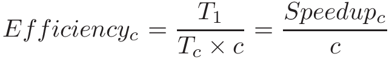

### 14.4.1. Kiến thức cơ bản về hiệu năng song song (Parallel Performance Basics)

#### Speedup (Tăng tốc)

Giả sử một chương trình mất thời gian T~*c*~ để thực thi trên *c* core.  
Như vậy, phiên bản **tuần tự** của chương trình sẽ mất thời gian T~1~ để chạy.

**Speedup** của chương trình trên *c* core được biểu diễn bằng công thức:

Ví dụ: nếu một chương trình tuần tự mất 60 giây để chạy, trong khi phiên bản song song của nó mất 30 giây trên 2 core, thì **speedup** tương ứng là 2.  
Tương tự, nếu chương trình đó mất 15 giây trên 4 core, thì speedup là 4.  
Trong kịch bản lý tưởng, một chương trình chạy trên *n* core với *n* thread sẽ có speedup bằng *n*.

Nếu speedup của chương trình **lớn hơn 1**, điều đó cho thấy việc song song hóa đã mang lại cải thiện hiệu năng.  
Nếu speedup **nhỏ hơn 1**, thì giải pháp song song thực tế còn chậm hơn giải pháp tuần tự.  
Cũng có thể xảy ra trường hợp speedup **lớn hơn *n*** (ví dụ: do hiệu ứng phụ của việc có thêm cache giúp giảm số lần truy cập bộ nhớ).  
Những trường hợp này được gọi là **superlinear speedup** (tăng tốc siêu tuyến tính).

#### Efficiency (Hiệu suất)

Speedup **không** tính đến số lượng core — nó chỉ đơn thuần là tỷ lệ giữa thời gian chạy tuần tự và thời gian chạy song song.  
Ví dụ: nếu một chương trình tuần tự mất 60 giây, nhưng chương trình song song mất 30 giây trên **4 core**, thì speedup vẫn là 2.  
Tuy nhiên, chỉ số này **không phản ánh** việc chương trình đã chạy trên 4 core.

Để đo **tốc độ tăng trên mỗi core**, ta sử dụng **efficiency**:

Efficiency thường nằm trong khoảng từ 0 đến 1.  
- Efficiency = 1 nghĩa là các core được sử dụng **hoàn hảo**.  
- Nếu efficiency gần 0, thì song song hóa hầu như **không mang lại lợi ích**, vì thêm core không cải thiện hiệu năng.  
- Nếu efficiency > 1, điều đó cho thấy có **superlinear speedup**.

Xét lại ví dụ trước:  
- Chương trình tuần tự mất 60 giây.  
- Nếu phiên bản song song mất 30 giây trên **2 core**, efficiency = 1 (100%).  
- Nếu mất 30 giây trên **4 core**, efficiency giảm xuống 0.5 (50%).

#### Hiệu năng song song trong thực tế

Trong thế giới lý tưởng, speedup là **tuyến tính**: mỗi đơn vị tính toán bổ sung sẽ mang lại mức tăng tốc tương ứng.  
Tuy nhiên, điều này **hiếm khi** xảy ra trong thực tế.

Hầu hết các chương trình đều chứa một phần **bắt buộc phải tuần tự** do các phụ thuộc nội tại trong code.  
Chuỗi phụ thuộc dài nhất trong một chương trình được gọi là **critical path** (đường tới hạn).  
Giảm độ dài của critical path là bước quan trọng đầu tiên trong việc song song hóa chương trình.

Ngoài ra, các **điểm đồng bộ hóa thread** và (đối với các chương trình chạy trên nhiều nút tính toán) **chi phí giao tiếp giữa các process** cũng là những yếu tố có thể giới hạn hiệu năng song song.

> **Không phải mọi chương trình đều là ứng viên tốt cho song song hóa!**  
> Độ dài của critical path có thể khiến một số chương trình **rất khó** để song song hóa.  
> Ví dụ: bài toán tính số Fibonacci thứ *n*.  
> Vì mỗi số Fibonacci phụ thuộc vào **hai số trước đó**, nên việc song song hóa hiệu quả chương trình này là **rất khó**.

Xét việc song song hóa hàm `countElems` trong thuật toán **CountSort** đã đề cập trước đó trong chương này.  
Trong thế giới lý tưởng, ta kỳ vọng speedup của chương trình sẽ **tuyến tính** theo số lượng core.  
Tuy nhiên, hãy đo thời gian chạy của nó (trong trường hợp này, chạy trên hệ thống **quad-core** với **8 thread logic**):

$ ./countElems_p_v3 100000000 0 1
Time for Step 1 is 0.331831 s

$ ./countElems_p_v3 100000000 0 2
Time for Step 1 is 0.197245 s

$ ./countElems_p_v3 100000000 0 4
Time for Step 1 is 0.140642 s

$ ./countElems_p_v3 100000000 0 8
Time for Step 1 is 0.107649 s

Bảng 1 cho thấy **speedup** và **efficiency** cho các lần thực thi đa luồng này:

| Number of threads | 2     | 4     | 8     |
|-------------------|-------|-------|-------|
| Speedup           | 1.68  | 2.36  | 3.08  |
| Efficiency        | 0.84  | 0.59  | 0.39  |

**Bảng 1.** Kết quả benchmark hiệu năng

Mặc dù chúng ta đạt **84% efficiency** với 2 core, nhưng efficiency giảm xuống **39%** khi dùng 8 core.  
Hãy lưu ý rằng **speedup lý tưởng** bằng 8 đã **không đạt được**.  
Một lý do là **overhead** của việc phân công công việc cho các thread và việc cập nhật tuần tự mảng `counts` bắt đầu chiếm ưu thế khi số lượng thread tăng cao.  
Thứ hai, **resource contention** (tranh chấp tài nguyên) giữa 8 thread (hãy nhớ đây là bộ xử lý **quad-core**) làm giảm efficiency của core.

#### Amdahl's Law

Năm 1967, **Gene Amdahl**, một kiến trúc sư máy tính hàng đầu tại IBM, đã dự đoán rằng **tốc độ tối đa** mà một chương trình máy tính có thể đạt được bị giới hạn bởi kích thước của thành phần **bắt buộc phải tuần tự** (hiện được gọi là **Amdahl’s Law**).  

Nói chung, Amdahl’s Law phát biểu rằng:  
- Mỗi chương trình đều có một phần **có thể tăng tốc** (tức là phần có thể tối ưu hóa hoặc song song hóa, ký hiệu *P*),  
- Và một phần **không thể tăng tốc** (tức là phần vốn dĩ tuần tự, ký hiệu *S*).  

Ngay cả khi thời gian thực thi của phần *P* được giảm xuống **0**, thì phần *S* vẫn tồn tại và cuối cùng sẽ **chi phối hiệu năng**.  
Vì *S* và *P* là các tỷ lệ, nên *S* + *P* = 1.

Xét một chương trình chạy trên 1 core mất thời gian T~1~.  
- Phần tuần tự chiếm *S* × T~1~ thời gian.  
- Phần song song hóa (*P* = 1 − *S*) chiếm *P* × T~1~ thời gian.

Khi chương trình chạy trên *c* core, phần tuần tự **vẫn** mất *S* × T~1~ thời gian (giả sử các điều kiện khác không đổi), nhưng phần song song hóa được chia cho *c* core.  
Do đó, mức cải thiện tối đa cho bộ xử lý song song với *c* core để chạy cùng một công việc là:

Khi *c* tăng, thời gian thực thi trên bộ xử lý song song sẽ bị **chi phối** bởi phần tuần tự của chương trình.

Để hiểu tác động của Amdahl’s Law, xét một chương trình **90% song song hóa** và chạy trong 10 giây trên 1 core.  
Theo công thức:  
- *P* = 0.9  
- *S* = 0.1  

Bảng 2 cho thấy **tổng thời gian** trên *c* core (T~*c*~) theo Amdahl’s Law và **speedup** tương ứng:

| Number of cores | Serial time (s) | Parallel time (s) | Total Time T~c~ (s) | Speedup (so với 1 core) |
|-----------------|-----------------|-------------------|---------------------|-------------------------|
| 1               | 1               | 9                 | 10                  | 1                       |
| 10              | 1               | 0.9               | 1.9                  | 5.26                    |
| 100             | 1               | 0.09              | 1.09                 | 9.17                    |
| 1000            | 1               | 0.009             | 1.009                | 9.91                    |

**Bảng 2.** Ảnh hưởng của Amdahl’s Law lên một chương trình 10 giây với 90% khả năng song song hóa

Có thể thấy rằng, theo thời gian, **phần tuần tự** của chương trình bắt đầu chiếm ưu thế, và việc thêm nhiều core hơn gần như **không còn tác dụng**.

Một cách nhìn chính xác hơn là đưa công thức tính T~*c*~ của Amdahl vào công thức tính speedup:

Khi lấy giới hạn của công thức này, ta thấy rằng khi *c* tiến tới vô hạn, **speedup tiến tới 1/*S***.  
Trong ví dụ ở Bảng 2, speedup tiến tới 1/0.1 = **10**.

Ví dụ khác: xét một chương trình với *P* = 0.99 (tức 99% chương trình có thể song song hóa).  
Khi *c* tiến tới vô hạn, thời gian tuần tự (*S* = 0.01) bắt đầu chi phối hiệu năng.  
Do đó, speedup tiến tới 1/0.01 = **100**.  
Nói cách khác, ngay cả với **một triệu core**, tốc độ tối đa mà chương trình này đạt được cũng chỉ là 100.

> **Không phải đã hết hy vọng: Giới hạn của Amdahl’s Law**  
> Khi tìm hiểu về Amdahl’s Law, cần xem xét **mục đích** ban đầu của Gene Amdahl.  
> Theo lời ông, định luật này được đề xuất để chứng minh "*tính đúng đắn liên tục của cách tiếp cận bộ xử lý đơn, và sự yếu kém của cách tiếp cận đa bộ xử lý khi áp dụng vào các bài toán thực tế với những bất thường đi kèm*”[^1].  
> Trong bài báo năm 1967, Amdahl viết: "*Trong hơn một thập kỷ, nhiều người đã cho rằng cấu trúc của một máy tính đơn đã đạt tới giới hạn, và những bước tiến thực sự quan trọng chỉ có thể đạt được bằng cách kết nối nhiều máy tính lại với nhau để cho phép giải quyết hợp tác*”[^1].

Những nghiên cứu sau này đã thách thức một số giả định chính của Amdahl.  
Xem [Gustafson–Barsis Law](performance_advanced.html#_gustafson_barsis_law) để tìm hiểu về giới hạn của Amdahl’s Law và một cách tiếp cận khác khi đánh giá lợi ích của song song hóa.

#### References 

1.  Gene Amdahl. \"Validity of the single processor approach to
    achieving large scale computing capabilities\" *Proceedings of the
    April 18-20, 1967, Spring Joint Computer Conference*. pp. 483---​485.
    ACM. 1967.

