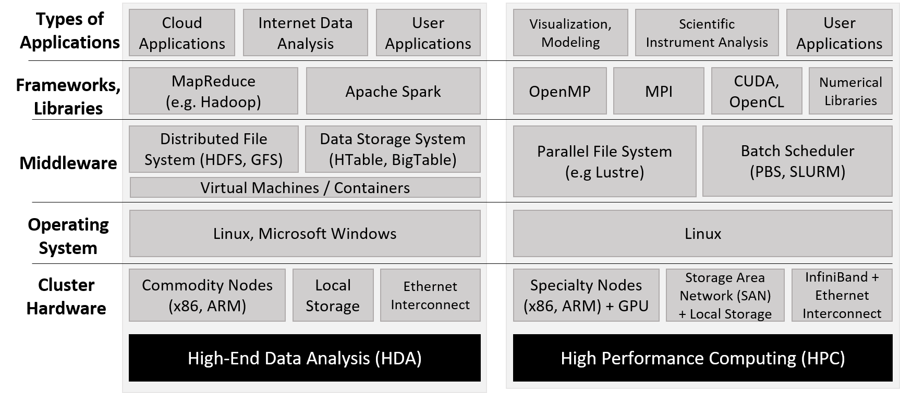
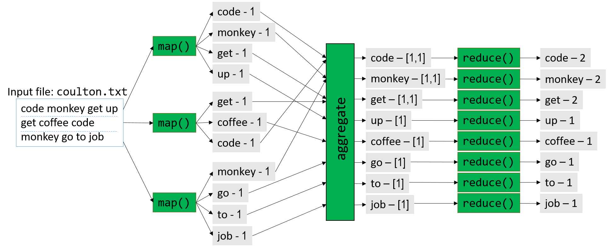

## 15.3. Tới Exascale và hơn thế nữa: Điện toán đám mây, Dữ liệu lớn và Tương lai của tính toán  
(*To Exascale and Beyond: Cloud Computing, Big Data, and the Future of Computing*)

Những tiến bộ trong công nghệ đã giúp con người có khả năng tạo ra dữ liệu với tốc độ chưa từng có.  
Các thiết bị khoa học như kính thiên văn, máy giải trình tự sinh học và cảm biến có thể tạo ra dữ liệu khoa học có độ chính xác cao với chi phí thấp.  
Khi các nhà khoa học phải vật lộn để phân tích “làn sóng dữ liệu” (*data deluge*) này, họ ngày càng dựa nhiều hơn vào các siêu máy tính đa node tinh vi, vốn là nền tảng của **high-performance computing** (HPC – tính toán hiệu năng cao).

Các ứng dụng HPC thường được viết bằng các ngôn ngữ như **C**, **C++** hoặc **Fortran**, với khả năng  
[multithreading](../C14-SharedMemory/multicore.html#_programming_multicore_systems) và  
[message passing](distrmem.html#_distributed_memory_systems_message_passing_and_mpi)  
được hỗ trợ thông qua các thư viện như  
[POSIX threads](../C14-SharedMemory/posix.html#_hello_threading_writing_your_first_multithreaded_program),  
[OpenMP](../C14-SharedMemory/openmp.html#_implicit_threading_with_openmp) và **MPI**.  

Cho đến nay, phần lớn nội dung của cuốn sách này đã mô tả các đặc điểm kiến trúc, ngôn ngữ và thư viện thường được tận dụng trên các hệ thống HPC.  
Các công ty, phòng thí nghiệm quốc gia và các tổ chức quan tâm đến việc thúc đẩy khoa học thường sử dụng hệ thống HPC và tạo thành lõi của hệ sinh thái khoa học tính toán.

Trong khi đó, sự bùng nổ của các thiết bị kết nối internet và sự phổ biến của mạng xã hội đã khiến con người tạo ra một lượng lớn nội dung đa phương tiện trực tuyến một cách dễ dàng, dưới dạng trang web, hình ảnh, video, tweet và bài đăng mạng xã hội.  
Ước tính rằng **90%** tổng dữ liệu trực tuyến được tạo ra chỉ trong **hai năm qua**, và xã hội đang tạo ra **30 terabyte dữ liệu người dùng mỗi giây** (tương đương **2,5 exabyte mỗi ngày**).  

Làn sóng **dữ liệu người dùng** này mang lại cho các công ty và tổ chức một kho thông tin khổng lồ về thói quen, sở thích và hành vi của người dùng, đồng thời hỗ trợ việc xây dựng hồ sơ khách hàng giàu dữ liệu để điều chỉnh sản phẩm và dịch vụ thương mại tốt hơn.  

Để phân tích dữ liệu người dùng, các công ty thường dựa vào các **trung tâm dữ liệu đa node** (multinode data center) có nhiều thành phần kiến trúc phần cứng tương tự siêu máy tính.  
Tuy nhiên, các trung tâm dữ liệu này sử dụng một **software stack** khác, được thiết kế đặc biệt cho dữ liệu dựa trên internet.  

Các hệ thống máy tính được sử dụng để lưu trữ và phân tích dữ liệu internet quy mô lớn đôi khi được gọi là **high-end data analysis** (HDA – phân tích dữ liệu cao cấp).  
Các công ty như Amazon, Google, Microsoft và Facebook có lợi ích trực tiếp trong việc phân tích dữ liệu internet và tạo thành lõi của hệ sinh thái phân tích dữ liệu.  
Cuộc cách mạng HDA và phân tích dữ liệu bắt đầu khoảng năm 2010 và hiện là một lĩnh vực chủ đạo trong nghiên cứu **cloud computing** (điện toán đám mây).

Hình 1 nêu bật những khác biệt chính trong phần mềm được sử dụng bởi cộng đồng HDA và HPC.  
Lưu ý rằng cả hai cộng đồng đều sử dụng phần cứng cụm (cluster hardware) tương tự, tuân theo mô hình  
[distributed memory](distrmem.html#_distributed_memory_systems_message_passing_and_mpi),  
trong đó mỗi **compute node** thường có một hoặc nhiều bộ xử lý  
[multicore](../C14-SharedMemory/index.html#_leveraging_shared_memory_in_the_multicore_era)  
và thường kèm theo GPU.  

Phần cứng cụm thường bao gồm một **distributed filesystem** (hệ thống tệp phân tán) cho phép người dùng và ứng dụng truy cập chung vào các tệp nằm trên nhiều node trong cụm.



**Hình 1.** So sánh các framework HDA và HPC. Dựa trên hình của Jack Dongarra và Daniel Reed.^8^

Không giống như siêu máy tính – vốn thường được xây dựng và tối ưu hóa cho mục đích HPC – cộng đồng HDA dựa vào **data center** (trung tâm dữ liệu), bao gồm một tập hợp lớn các compute node đa dụng, thường được kết nối mạng qua Ethernet.  
Ở cấp độ phần mềm, các trung tâm dữ liệu thường sử dụng **máy ảo** (virtual machine), **cơ sở dữ liệu phân tán lớn** và các **framework** cho phép phân tích dữ liệu internet với thông lượng cao.  

Thuật ngữ **cloud** (đám mây) đề cập đến các thành phần lưu trữ dữ liệu và năng lực tính toán của các trung tâm dữ liệu HDA.

Trong phần này, chúng ta sẽ điểm qua **cloud computing**, một số phần mềm thường được sử dụng để triển khai cloud computing (đặc biệt là **MapReduce**), và một số thách thức trong tương lai.  
Lưu ý rằng phần này **không** nhằm mục đích đi sâu vào các khái niệm này; chúng tôi khuyến khích người đọc quan tâm tìm hiểu thêm từ các nguồn tham khảo được liệt kê.

### 15.3.1. Cloud Computing

**Cloud computing** (điện toán đám mây) là việc sử dụng hoặc thuê tài nguyên đám mây cho nhiều loại dịch vụ khác nhau.  
Cloud computing cho phép hạ tầng tính toán hoạt động như một **dịch vụ tiện ích** (*utility*): một số nhà cung cấp trung tâm cung cấp cho người dùng và tổ chức quyền truy cập (gần như vô hạn) vào sức mạnh tính toán thông qua internet, với việc người dùng và tổ chức lựa chọn sử dụng bao nhiêu tùy ý và trả tiền theo mức độ sử dụng.  

Cloud computing có ba trụ cột chính:  
- **Software as a Service (SaaS)** – Phần mềm như một dịch vụ  
- **Infrastructure as a Service (IaaS)** – Hạ tầng như một dịch vụ  
- **Platform as a Service (PaaS)** – Nền tảng như một dịch vụ ^1^


#### Software as a Service

**Software as a Service** (SaaS – Phần mềm như một dịch vụ) đề cập đến phần mềm được cung cấp trực tiếp cho người dùng thông qua **cloud** (đám mây).  
Hầu hết mọi người sử dụng trụ cột này của cloud computing mà thậm chí không nhận ra.  
Các ứng dụng mà nhiều người dùng hàng ngày (ví dụ: web mail, mạng xã hội, dịch vụ phát video trực tuyến) đều phụ thuộc vào hạ tầng cloud.  

Hãy xét ví dụ kinh điển là dịch vụ web mail:  
Người dùng có thể đăng nhập và truy cập email của mình từ bất kỳ thiết bị nào, gửi và nhận thư, và dường như không bao giờ hết dung lượng lưu trữ.  
Các tổ chức quan tâm có thể “thuê” dịch vụ email trên cloud để cung cấp email cho khách hàng và nhân viên của mình, mà không phải chịu chi phí phần cứng và bảo trì khi tự vận hành dịch vụ.  

Các dịch vụ thuộc trụ cột SaaS được quản lý hoàn toàn bởi nhà cung cấp cloud; tổ chức và người dùng (ngoài việc cấu hình một vài thiết lập nếu cần) không quản lý bất kỳ phần nào của ứng dụng, dữ liệu, phần mềm hay hạ tầng phần cứng — tất cả những thứ này sẽ cần thiết nếu họ tự triển khai dịch vụ trên phần cứng của mình.  

Trước khi cloud computing ra đời, các tổ chức muốn cung cấp web mail cho người dùng sẽ cần có hạ tầng riêng và đội ngũ IT chuyên trách để duy trì.  
Ví dụ phổ biến về nhà cung cấp SaaS gồm **Google’s G Suite** và **Microsoft Office 365**.

#### Infrastructure as a Service

**Infrastructure as a Service** (IaaS – Hạ tầng như một dịch vụ) cho phép cá nhân và tổ chức “thuê” tài nguyên tính toán để đáp ứng nhu cầu của mình, thường dưới dạng truy cập **máy ảo** (virtual machine) — có thể là đa dụng hoặc được cấu hình sẵn cho một ứng dụng cụ thể.  

Ví dụ kinh điển là dịch vụ **Amazon Elastic Compute Cloud (EC2)** của **Amazon Web Services (AWS)**.  
EC2 cho phép người dùng tạo máy ảo tùy chỉnh hoàn toàn.  
Thuật ngữ **elastic** (co giãn) trong EC2 đề cập đến khả năng của người dùng trong việc tăng hoặc giảm yêu cầu tài nguyên tính toán khi cần, và trả phí theo mức sử dụng.  

Ví dụ: một tổ chức có thể sử dụng nhà cung cấp IaaS để lưu trữ website hoặc triển khai một loạt ứng dụng tùy chỉnh cho người dùng.  
Một số phòng thí nghiệm nghiên cứu và lớp học sử dụng dịch vụ IaaS thay cho máy trong phòng lab, chạy thí nghiệm trên cloud hoặc cung cấp nền tảng ảo cho sinh viên học tập.  

Mục tiêu chung là loại bỏ chi phí bảo trì và đầu tư vốn để duy trì một cụm máy chủ hoặc server cá nhân cho các mục đích tương tự.  
Không giống SaaS, các trường hợp sử dụng IaaS yêu cầu khách hàng cấu hình ứng dụng, dữ liệu, và trong một số trường hợp là cả hệ điều hành của máy ảo.  
Tuy nhiên, hệ điều hành host và hạ tầng phần cứng được thiết lập và quản lý bởi nhà cung cấp cloud.  

Các nhà cung cấp IaaS phổ biến gồm **Amazon AWS**, **Google Cloud Services** và **Microsoft Azure**.

#### Platform as a Service

**Platform as a Service** (PaaS – Nền tảng như một dịch vụ) cho phép cá nhân và tổ chức phát triển và triển khai ứng dụng web của riêng mình trên cloud, loại bỏ nhu cầu cấu hình hoặc bảo trì cục bộ.  

Hầu hết các nhà cung cấp PaaS cho phép lập trình viên viết ứng dụng bằng nhiều ngôn ngữ khác nhau và cung cấp nhiều API để sử dụng.  
Ví dụ: dịch vụ của **Microsoft Azure** cho phép người dùng lập trình ứng dụng web trong **Visual Studio IDE** và triển khai ứng dụng lên Azure để kiểm thử.  
**Google App Engine** cho phép lập trình viên xây dựng và kiểm thử ứng dụng di động tùy chỉnh trên cloud bằng nhiều ngôn ngữ.  
**Heroku** và **CloudBees** là những ví dụ nổi bật khác.  

Lưu ý rằng lập trình viên chỉ kiểm soát ứng dụng và dữ liệu của mình; nhà cung cấp cloud kiểm soát phần còn lại của hạ tầng phần mềm và toàn bộ hạ tầng phần cứng bên dưới.

### 15.3.2. MapReduce

Có lẽ mô hình lập trình nổi tiếng nhất được sử dụng trên các hệ thống cloud là **MapReduce**^3^.  
Mặc dù nguồn gốc của MapReduce bắt nguồn từ các phép toán **Map** và **Reduce** trong lập trình hàm (functional programming), **Google** là công ty đầu tiên áp dụng khái niệm này để phân tích khối lượng lớn dữ liệu web.  

MapReduce đã giúp Google thực hiện các truy vấn web nhanh hơn đối thủ, và góp phần đưa Google trở thành nhà cung cấp dịch vụ web và “gã khổng lồ” internet như ngày nay.

#### Hiểu về các phép toán Map và Reduce

Các hàm `map` và `reduce` trong mô hình MapReduce dựa trên các phép toán **Map** và **Reduce** trong lập trình hàm.  
Trong phần này, chúng ta sẽ thảo luận ngắn gọn cách các phép toán này hoạt động, bằng cách xem lại một số ví dụ đã được trình bày trước đó trong sách.

Phép toán **Map** thường áp dụng cùng một hàm cho tất cả các phần tử trong một tập hợp.  
Những độc giả quen thuộc với Python có thể nhận ra chức năng này rõ nhất qua tính năng **list comprehension** (hiểu danh sách) trong Python.  

Ví dụ, hai đoạn mã dưới đây trong [Bảng 1](#ScalarMap) thực hiện phép nhân vô hướng trong Python:

Chắc chắn rồi. Dưới đây là hai đoạn code đã được tách riêng.

#### **Cách nhân vô hướng thông thường**

```python
# array là mảng số
# s là số nguyên
def scalarMultiply(array, s):
    for i in range(len(array)):
        array[i] = array[i] * s
    return array

# Gọi hàm
myArray = [1, 3, 5, 7, 9]
result = scalarMultiply(myArray, 2)
# In kết quả
print(result)
# [2, 6, 10, 14, 18]
```


#### **Cách nhân vô hướng với list comprehension**

```python
# nhân hai số với nhau
def multiply(num1, num2):
    return num1 * num2

# array là mảng số
# s là số nguyên
def scalarMultiply(array, s):
    # dùng list comprehension
    return [multiply(x, s) for x in array]

# Gọi hàm
myArray = [1, 3, 5, 7, 9]
result = scalarMultiply(myArray, 2)
# In kết quả
print(result)
# [2, 6, 10, 14, 18]
```


Cú pháp **list comprehension** áp dụng cùng một hàm (trong trường hợp này là nhân một phần tử của mảng với giá trị vô hướng `s`) cho mọi phần tử `x` trong `array`.

Một phép toán **Reduce** đơn lẻ sẽ lấy một tập hợp các phần tử và kết hợp chúng lại thành một giá trị duy nhất bằng một hàm chung nào đó.  
Ví dụ: hàm `sum` trong Python hoạt động tương tự như một phép Reduce, vì nó nhận vào một tập hợp (thường là một danh sách Python) và cộng tất cả các phần tử lại với nhau.  
Chẳng hạn, áp dụng phép cộng cho tất cả các phần tử trong mảng `result` được trả về từ hàm `scalarMultiply` trong **Bảng 1** sẽ cho ra tổng cộng là **50**.

#### Mô hình lập trình MapReduce (The MapReduce Programming Model)

Một đặc điểm quan trọng của MapReduce là **mô hình lập trình đơn giản**.  
Lập trình viên chỉ cần hiện thực hai loại hàm: `map` và `reduce`; phần còn lại sẽ được **framework MapReduce** tự động xử lý.

Hàm `map` do lập trình viên viết sẽ nhận vào một cặp (*key*, *value*) và xuất ra một loạt các cặp (*key*, *value*) trung gian, được ghi vào **distributed filesystem** (hệ thống tệp phân tán) dùng chung cho tất cả các node.  
Một **combiner** (thường được định nghĩa bởi framework MapReduce) sẽ gom nhóm các cặp (*key*, *value*) theo key, để tạo thành các cặp (*key*, list(*value*)) và chuyển chúng tới hàm `reduce` do lập trình viên định nghĩa.  

Hàm `reduce` sẽ nhận vào một cặp (*key*, list(*value*)) và kết hợp tất cả các giá trị lại thông qua một phép toán do lập trình viên định nghĩa, để tạo ra cặp (*key*, *value*) cuối cùng, trong đó *value* là kết quả của phép giảm (reduction).  
Kết quả từ hàm `reduce` sẽ được ghi vào distributed filesystem và thường được trả về cho người dùng.

Để minh họa cách sử dụng mô hình MapReduce nhằm song song hóa một chương trình, chúng ta xét ví dụ **Word Frequency**.  
Mục tiêu của Word Frequency là xác định tần suất xuất hiện của mỗi từ trong một tập văn bản lớn.

Một lập trình viên C có thể hiện thực hàm `map` cho chương trình Word Frequency như sau:^3^

```c
void map(char *key, char *value) {
    // key is document name
    // value is string containing some words (separated by spaces)
    int i;
    int numWords = 0; // number of words found: populated by parseWords()

    // returns an array of numWords words
    char *words[] = parseWords(value, &numWords);
    for (i = 0; i < numWords; i++) {
        // output (word, 1) key-value intermediate to file system
        emit(words[i], "1");
    }
}
```

Hàm `map` này nhận vào một chuỗi (`key`) tương ứng với tên tệp, và một chuỗi khác (`value`) chứa một phần dữ liệu của tệp.  
Hàm sẽ tách các từ từ chuỗi `value` và phát ra (emit) từng từ (`words[i]`) kèm theo giá trị chuỗi `"1"`.  
Hàm `emit` được cung cấp bởi framework MapReduce và ghi các cặp (*key*, *value*) trung gian vào distributed filesystem.

Để hoàn thiện chương trình Word Frequency, lập trình viên có thể hiện thực hàm `reduce` như sau:

```c
void reduce(char *key, struct Iterator values) {
    // key is individual word
    // value is of type Iterator (a struct that consists of
    // a items array (type char **), and its associated length (type int))
    int numWords = values.length();  // get length
    char *counts[] = values.items(); // get counts
    int i, total = 0;
    for (i = 0; i < numWords; i++) {
        total += atoi(counts[i]); // sum up all counts
    }
    char *stringTotal = itoa(total); // convert total to a string
    emit(key, stringTotal); // output (word, total) pair to file system
}
```

Hàm `reduce` này nhận vào một chuỗi (`key`) tương ứng với một từ cụ thể, và một struct `Iterator` (cũng được cung cấp bởi framework MapReduce) bao gồm một mảng các phần tử đã được gom nhóm theo key (`items`) và độ dài của mảng đó (`length`).  
Trong ứng dụng Word Frequency, `items` là danh sách các số đếm.  

Hàm sẽ lấy số lượng phần tử từ trường `length` của struct `Iterator`, và mảng số đếm từ trường `items`.  
Sau đó, nó lặp qua tất cả các số đếm, cộng dồn giá trị vào biến `total`.  
Vì hàm `emit` yêu cầu tham số kiểu `char *`, hàm sẽ chuyển đổi `total` sang chuỗi trước khi gọi `emit`.

Sau khi hiện thực `map` và `reduce`, trách nhiệm của lập trình viên kết thúc.  
Framework MapReduce sẽ tự động xử lý phần còn lại, bao gồm:

- Chia nhỏ dữ liệu đầu vào (partitioning the input)  
- Tạo và quản lý các tiến trình chạy hàm `map` (**map tasks**)  
- Gom nhóm và sắp xếp các cặp (*key*, *value*) trung gian  
- Tạo và quản lý các tiến trình chạy hàm `reduce` (**reduce tasks**)  
- Sinh ra tệp kết quả cuối cùng

Để đơn giản, **Hình 2** minh họa cách MapReduce song song hóa các câu mở đầu của bài hát nổi tiếng *Code Monkey* của Jonathan Coulton:  
*code monkey get up get coffee, code monkey go to job*.




**Hình 2.** Song song hóa các câu mở đầu của bài hát *"Code Monkey"* bằng **MapReduce framework**

Hình 2 cung cấp cái nhìn tổng quan về quá trình này.  
Trước khi thực thi, **boss node** (nút điều phối) sẽ chia dữ liệu đầu vào thành *M* phần, trong đó *M* tương ứng với số lượng **map task**.  
Trong [Hình 2](#MapReduceFig), *M* = 3, và tệp đầu vào (`coulton.txt`) được chia thành ba phần.  

Trong **map phase** (giai đoạn map), boss node phân phối các map task cho một hoặc nhiều **worker node**, với mỗi map task được thực thi độc lập và song song.  
Ví dụ: map task đầu tiên phân tích đoạn *code monkey get up* thành các từ riêng biệt và phát ra (emit) bốn cặp (*key*, *value*):  
(`code`, `1`), (`monkey`, `1`), (`get`, `1`), (`up`, `1`).  
Mỗi map task sau đó ghi các giá trị trung gian này vào **distributed filesystem** (hệ thống tệp phân tán), chiếm một phần dung lượng lưu trữ trên mỗi node.

Trước khi bắt đầu **reduce phase** (giai đoạn reduce), framework sẽ gom nhóm và kết hợp các cặp (*key*, *value*) trung gian thành các cặp (*key*, list(*value*)).  
Trong Hình 2, ví dụ cặp (`get`, `1`) được phát ra bởi hai map task khác nhau.  
Framework MapReduce sẽ gom các cặp này thành một cặp duy nhất: (`get`, `[1,1]`).  
Các cặp trung gian đã được gom nhóm này sẽ được ghi xuống distributed filesystem trên đĩa.

Tiếp theo, framework MapReduce yêu cầu boss node tạo ra *R* **reduce task**.  
Trong Hình 2, *R* = 8.  
Framework sau đó phân phối các reduce task này cho các worker node.  
Một lần nữa, mỗi reduce task được thực thi độc lập và song song.  

Trong giai đoạn reduce của ví dụ này, cặp (`get`, `[1,1]`) được giảm (reduce) thành cặp (`get`, `2`).  
Mỗi worker node sẽ nối kết quả của các reduce task mà nó xử lý vào tệp kết quả cuối cùng, tệp này sẽ sẵn sàng cho người dùng khi quá trình hoàn tất.

#### Fault Tolerance (Khả năng chịu lỗi)

Các **data center** (trung tâm dữ liệu) thường chứa hàng nghìn node.  
Do đó, tỷ lệ hỏng hóc phần cứng là cao; ví dụ, nếu một node trong data center có 2% khả năng hỏng phần cứng, thì xác suất có ít nhất một node bị hỏng trong một data center 1.000 node là hơn 99,99%.  

Phần mềm viết cho data center vì vậy phải **fault tolerant** (chịu lỗi), nghĩa là có thể tiếp tục hoạt động khi xảy ra sự cố phần cứng (hoặc ít nhất là dừng một cách an toàn).

MapReduce được thiết kế với khả năng chịu lỗi ngay từ đầu.  
Trong bất kỳ lần chạy MapReduce nào, sẽ có một boss node và có thể có hàng nghìn worker node.  
Khả năng một worker node bị hỏng là cao.  

Để xử lý, boss node sẽ **ping** từng worker node theo chu kỳ.  
Nếu boss node không nhận được phản hồi từ một worker node, nó sẽ phân phối lại khối lượng công việc của worker đó sang một node khác và thực thi lại task^3^.  

Nếu boss node bị hỏng (xác suất thấp vì chỉ có một node), job MapReduce sẽ bị hủy và phải chạy lại trên một node khác.  
Lưu ý rằng đôi khi worker node không phản hồi ping của boss node không phải vì hỏng, mà vì bị quá tải.  
MapReduce cũng áp dụng cùng chiến lược ping và phân phối lại công việc để giảm tác động của các worker node chậm (**straggler node**).

#### Hadoop và Apache Spark

Sự ra đời của MapReduce đã tạo nên một làn sóng lớn trong giới công nghệ.  
Tuy nhiên, bản triển khai MapReduce của Google là **closed source** (mã nguồn đóng).  
Do đó, các kỹ sư tại Yahoo! đã phát triển [**Hadoop**](https://hadoop.apache.org/), một bản triển khai **open source** (mã nguồn mở) của MapReduce, sau đó được **Apache Foundation** tiếp nhận.  

Dự án Hadoop bao gồm một hệ sinh thái các công cụ cho Apache Hadoop, trong đó có **Hadoop Distributed File System (HDFS)** — một giải pháp mã nguồn mở thay thế **Google File System**, và **HBase** — được mô phỏng theo **Google BigTable**.

Hadoop có một số hạn chế chính:  
- Thứ nhất, khó kết nối nhiều job MapReduce thành một **workflow** (quy trình) lớn hơn.  
- Thứ hai, việc ghi dữ liệu trung gian xuống HDFS trở thành nút thắt cổ chai, đặc biệt với các job nhỏ (dưới 1 GB).  

[**Apache Spark**](https://spark.apache.org/) được thiết kế để giải quyết các vấn đề này và nhiều vấn đề khác.  
Nhờ các tối ưu hóa và khả năng xử lý phần lớn dữ liệu trung gian **trong bộ nhớ** (in-memory), Apache Spark có thể nhanh hơn Hadoop tới **100 lần** trên một số ứng dụng^4^.


### 15.3.3. Hướng tới tương lai: Cơ hội và Thách thức  
(*Looking Toward the Future: Opportunities and Challenges*)

Bất chấp những đổi mới trong cộng đồng phân tích dữ liệu internet, lượng dữ liệu mà nhân loại tạo ra vẫn tiếp tục tăng.  
Phần lớn dữ liệu mới được tạo ra trong cái gọi là **edge environment** (môi trường biên), tức là gần các cảm biến và các thiết bị tạo dữ liệu khác — vốn theo định nghĩa nằm ở phía “đầu kia” của mạng so với các nhà cung cấp **commercial cloud** (đám mây thương mại) và hệ thống **HPC** (high-performance computing – tính toán hiệu năng cao).  

Truyền thống trước đây, các nhà khoa học và kỹ sư sẽ thu thập dữ liệu và phân tích nó bằng **local cluster** (cụm máy cục bộ), hoặc chuyển dữ liệu tới siêu máy tính hoặc trung tâm dữ liệu để phân tích.  
Cách tiếp cận “tập trung” này không còn khả thi nữa khi công nghệ cảm biến ngày càng phát triển, làm trầm trọng thêm “làn sóng dữ liệu” (*data deluge*).

Một nguyên nhân của sự tăng trưởng bùng nổ này là sự phổ biến của các thiết bị nhỏ có kết nối internet và chứa nhiều loại cảm biến.  
Những **Internet of Things** (IoT – Internet vạn vật) này đã tạo ra các tập dữ liệu lớn và đa dạng trong môi trường biên.  
Việc truyền các tập dữ liệu lớn từ edge lên cloud là khó khăn, vì dữ liệu càng lớn thì càng tốn nhiều thời gian và năng lượng để di chuyển.  

Để giảm bớt các vấn đề hậu cần của cái gọi là **Big Data**, cộng đồng nghiên cứu đã bắt đầu tạo ra các kỹ thuật **tóm tắt dữ liệu mạnh mẽ** tại mỗi điểm truyền giữa edge và cloud^2^.  
Có sự quan tâm mạnh mẽ trong cộng đồng nghiên cứu máy tính về việc xây dựng hạ tầng có khả năng xử lý, lưu trữ và tóm tắt dữ liệu ngay tại môi trường biên trên một nền tảng thống nhất; lĩnh vực này được gọi là **edge computing** hoặc **fog computing**.  

Edge computing đảo ngược mô hình phân tích Big Data truyền thống: thay vì phân tích diễn ra tại siêu máy tính hoặc trung tâm dữ liệu (“last mile”), thì phân tích diễn ra ngay tại nguồn tạo dữ liệu (“first mile”)^2^.

Ngoài vấn đề hậu cần di chuyển dữ liệu, một mối quan tâm xuyên suốt khác trong phân tích Big Data là **quản lý năng lượng**.  
Các tài nguyên tập trung lớn như siêu máy tính và trung tâm dữ liệu tiêu thụ rất nhiều năng lượng; các siêu máy tính hiện đại cần tới hàng megawatt (triệu watt) để vận hành và làm mát.  

Một câu nói quen thuộc trong cộng đồng siêu máy tính là “**a megawatt costs a megabuck**” — nghĩa là cần khoảng 1 triệu USD mỗi năm để duy trì nhu cầu điện năng của 1 megawatt^5^.  

Việc xử lý dữ liệu cục bộ trong môi trường biên giúp giảm bớt vấn đề di chuyển các tập dữ liệu lớn, nhưng hạ tầng tính toán tại đây cũng phải tiêu thụ năng lượng ở mức tối thiểu^2^.  
Đồng thời, việc tăng hiệu suất năng lượng của các siêu máy tính và trung tâm dữ liệu lớn là điều tối quan trọng^5^.

Ngoài ra, còn có sự quan tâm tới việc tìm cách **hội tụ** hai hệ sinh thái HPC và cloud computing để tạo ra một bộ framework, hạ tầng và công cụ chung cho phân tích dữ liệu quy mô lớn.  
Những năm gần đây, nhiều nhà khoa học đã sử dụng các kỹ thuật và công cụ do cộng đồng cloud computing phát triển để phân tích các tập dữ liệu HPC truyền thống, và ngược lại.  

Việc hội tụ hai hệ sinh thái phần mềm này sẽ cho phép **trao đổi chéo** (cross-pollination) trong nghiên cứu và dẫn tới sự phát triển của một hệ thống thống nhất, cho phép cả hai cộng đồng cùng đối phó với làn sóng dữ liệu sắp tới, và thậm chí có thể chia sẻ tài nguyên.  

Nhóm [**Big Data Exascale Computing (BDEC)**](https://www.exascale.org/bdec/) cho rằng thay vì coi HPC và cloud computing là hai mô hình hoàn toàn khác biệt, sẽ hữu ích hơn nếu xem cloud computing như một giai đoạn “**digitally empowered**” (được số hóa mạnh mẽ) của tính toán khoa học, trong đó nguồn dữ liệu ngày càng được tạo ra qua internet^2^.  

Ngoài ra, cần có sự hội tụ về **văn hóa, đào tạo và công cụ** để tích hợp hoàn toàn cộng đồng phần mềm và nghiên cứu HPC với cloud computing.  
BDEC cũng đề xuất một mô hình trong đó các siêu máy tính và trung tâm dữ liệu là các “node” trong một mạng lưới tài nguyên tính toán rất lớn, cùng phối hợp để xử lý dữ liệu tràn về từ nhiều nguồn^2^.  
Mỗi node sẽ tóm tắt dữ liệu chảy vào nó một cách mạnh mẽ, chỉ chuyển tiếp lên node tài nguyên tính toán lớn hơn khi cần thiết.

Khi các hệ sinh thái cloud computing và HPC tìm kiếm sự thống nhất và chuẩn bị đối phó với làn sóng dữ liệu ngày càng tăng, tương lai của hệ thống máy tính hứa hẹn nhiều khả năng thú vị.  
Các lĩnh vực mới như **trí tuệ nhân tạo** (AI) và **tính toán lượng tử** đang dẫn tới sự ra đời của các **domain-specific architecture** (DSA – kiến trúc chuyên biệt theo lĩnh vực) và **application-specific integrated circuit** (ASIC – mạch tích hợp chuyên dụng) mới, có khả năng xử lý các quy trình công việc tùy chỉnh hiệu quả năng lượng hơn trước (xem ví dụ về **TPU**^6^).  

Bên cạnh đó, vấn đề **bảo mật** của các kiến trúc này — vốn lâu nay bị cộng đồng bỏ qua — sẽ trở nên quan trọng khi dữ liệu mà chúng phân tích ngày càng có giá trị.  
Các kiến trúc mới cũng sẽ dẫn tới sự xuất hiện của các ngôn ngữ lập trình mới để lập trình cho chúng, và có thể cả các hệ điều hành mới để quản lý các giao diện khác nhau.  

Để tìm hiểu thêm về tương lai của kiến trúc máy tính, chúng tôi khuyến khích bạn đọc bài viết [này](https://cacm.acm.org/magazines/2019/2/234352-a-new-golden-age-for-computer-architecture/fulltext) của hai huyền thoại kiến trúc máy tính, đồng thời là chủ nhân Giải thưởng Turing ACM 2017 — **John Hennessy** và **David Patterson**^7^.

### Tài liệu tham khảo

1. Armbrust et. al. *A view of cloud computing*. CACM 53(4). 2010.  
2. Asch et. al. *Big data and extreme-scale computing: Pathways to Convergence – Toward a shaping strategy for a future software and data ecosystem for scientific inquiry*. The International Journal of High Performance Computing Applications 32(4), 435–479. 2018.  
3. Dean and Ghemawat. *MapReduce: Simplified Data Processing on Large Clusters*. USENIX. 2004.  
4. DataBricks. *Apache Spark*. [https://databricks.com/spark/about](https://databricks.com/spark/about)  
5. M. Halper. *Supercomputing's Super Energy Needs, and What to Do About Them*. CACM News: [https://cacm.acm.org/news/192296-supercomputings-super-energy-needs-and-what-to-do-about-them/fulltext](https://cacm.acm.org/news/192296-supercomputings-super-energy-needs-and-what-to-do-about-them/fulltext)  
6. Jouppi et. al. *In-datacenter performance analysis of a tensor processing unit*. 2017 ACM/IEEE 44th Annual International Symposium on Computer Architecture (ISCA), pp. 1–12. 2017.  
7. J. Hennessy and D. Patterson. *A New Golden Age for Computer Architecture*. CACM 62(2), 48–60. 2019.  
8. D. A. Reed and J. Dongarra. *Exascale computing and big data*. CACM 58(7), 56–68. 2015.  

Bạn có muốn tôi tiếp tục dịch sang **Chương 16 – Operating Systems** để nối tiếp nội dung cuốn sách không?