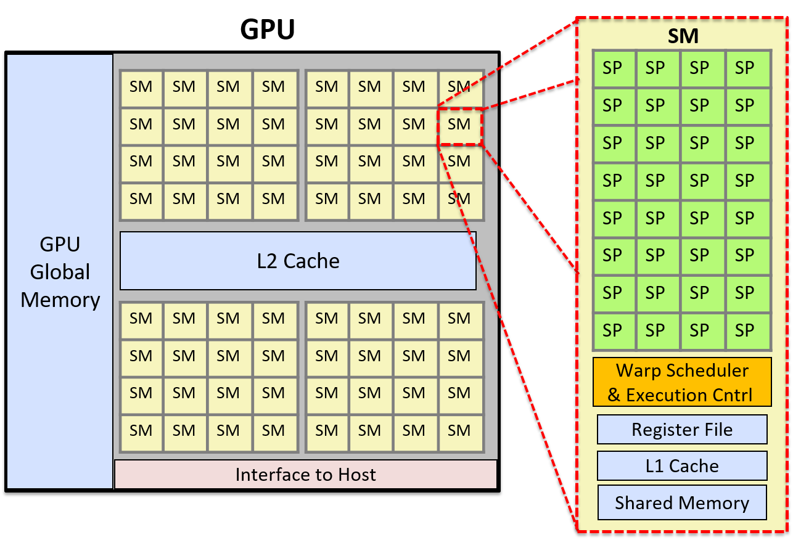
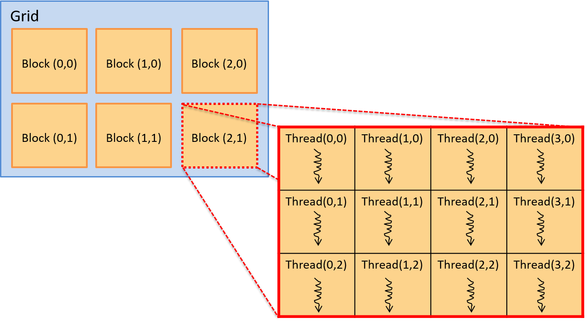

Dưới đây là bản dịch tiếng Việt của mục **15.1. Heterogeneous Computing: Hardware Accelerators, GPGPU Computing, and CUDA**, tuân thủ đầy đủ các quy ước đã nêu:

---

## 15.1. Heterogeneous Computing: Hardware Accelerators, GPGPU Computing, and CUDA

**Heterogeneous computing** (tính toán không đồng nhất) là hình thức tính toán sử dụng nhiều đơn vị xử lý khác nhau có trong một máy tính.  
Các đơn vị xử lý này thường có **ISA** (Instruction Set Architecture – kiến trúc tập lệnh) khác nhau, một số được hệ điều hành quản lý, số khác thì không.  
Thông thường, heterogeneous computing nghĩa là hỗ trợ tính toán song song bằng cách sử dụng các lõi CPU của máy tính cùng với một hoặc nhiều **accelerator unit** (bộ tăng tốc phần cứng) như **graphics processing unit** (GPU – bộ xử lý đồ họa) hoặc **field programmable gate array** (FPGA – mảng cổng lập trình được)^1^.

---

Ngày càng phổ biến việc các lập trình viên triển khai giải pháp heterogeneous computing cho các bài toán lớn, đòi hỏi xử lý dữ liệu và tính toán chuyên sâu.  
Những loại bài toán này xuất hiện nhiều trong **tính toán khoa học** (scientific computing), cũng như trong nhiều ứng dụng khác liên quan đến xử lý Big Data, phân tích và trích xuất thông tin.  
Bằng cách tận dụng khả năng xử lý của cả CPU và các accelerator unit có sẵn trên máy tính, lập trình viên có thể tăng mức độ thực thi song song trong ứng dụng, từ đó cải thiện hiệu năng và khả năng mở rộng.

---

Trong phần này, chúng ta sẽ giới thiệu về heterogeneous computing sử dụng **hardware accelerator** (bộ tăng tốc phần cứng) để hỗ trợ tính toán song song đa mục đích.  
Chúng ta sẽ tập trung vào GPU và ngôn ngữ lập trình **CUDA**.

---

### 15.1.1. Hardware Accelerators

Ngoài CPU, máy tính còn có các đơn vị xử lý khác được thiết kế để thực hiện các tác vụ cụ thể.  
Những đơn vị này không phải là bộ xử lý đa dụng như CPU, mà là phần cứng chuyên dụng được tối ưu hóa để thực hiện các chức năng đặc thù cho một số thiết bị hoặc để xử lý các loại tác vụ chuyên biệt trong hệ thống.  
FPGA, **Cell processor** và GPU là ba ví dụ tiêu biểu của loại đơn vị xử lý này.

---

#### FPGAs

**FPGA** (Field Programmable Gate Array) là một vi mạch tích hợp bao gồm các cổng logic, bộ nhớ và các thành phần kết nối.  
FPGA có thể **lập trình lại** (reprogrammable), nghĩa là có thể cấu hình lại để thực hiện một chức năng cụ thể ở mức phần cứng, và thường được dùng để tạo nguyên mẫu cho **ASIC** (Application-Specific Integrated Circuit – mạch tích hợp chuyên dụng).  

FPGA thường tiêu thụ ít điện năng hơn so với một CPU đầy đủ, giúp vận hành tiết kiệm năng lượng.  
Một số cách FPGA được tích hợp vào hệ thống máy tính bao gồm: làm bộ điều khiển thiết bị (device controller), xử lý dữ liệu cảm biến, thực hiện các tác vụ mật mã (cryptography), và thử nghiệm các thiết kế phần cứng mới (do có thể lập trình lại, các thiết kế có thể được triển khai, gỡ lỗi và kiểm thử trực tiếp trên FPGA).  

FPGA có thể được thiết kế như một mạch với số lượng lớn các đơn vị xử lý đơn giản.  
Chúng cũng là các thiết bị có **độ trễ thấp** (low-latency) và có thể kết nối trực tiếp với bus hệ thống.  
Nhờ đó, FPGA đã được sử dụng để triển khai các phép tính song song tốc độ cao, bao gồm các mẫu xử lý song song độc lập lặp lại trên nhiều kênh dữ liệu đầu vào.  

Tuy nhiên, việc lập trình lại FPGA mất nhiều thời gian, và việc sử dụng chúng thường giới hạn ở việc hỗ trợ thực thi nhanh các phần cụ thể của khối lượng công việc song song hoặc chạy một khối lượng công việc cố định^2^.

---

#### GPUs và Cell Processors

**Cell processor** là một bộ xử lý đa lõi bao gồm một bộ xử lý đa dụng và nhiều **co-processor** (đồng xử lý) chuyên dụng để tăng tốc một loại tính toán cụ thể, chẳng hạn như xử lý đa phương tiện.  
Hệ thống chơi game **Sony PlayStation 3** là kiến trúc Cell đầu tiên, sử dụng các bộ đồng xử lý Cell để xử lý đồ họa nhanh.

**GPU** thực hiện các phép tính đồ họa máy tính — chúng xử lý dữ liệu hình ảnh để hỗ trợ kết xuất đồ họa và xử lý ảnh tốc độ cao.  
GPU ghi kết quả vào **frame buffer**, sau đó dữ liệu này được đưa tới màn hình máy tính.  
Được thúc đẩy bởi các ứng dụng game máy tính, ngày nay các GPU mạnh mẽ đã trở thành tiêu chuẩn trong máy tính để bàn và laptop.

Vào giữa những năm 2000, các nhà nghiên cứu tính toán song song đã nhận ra tiềm năng của việc sử dụng **accelerator** kết hợp với các lõi CPU của máy tính để hỗ trợ tính toán song song đa mục đích.

---

### 15.1.2. Tổng quan kiến trúc GPU (GPU architecture overview)

Phần cứng GPU được thiết kế cho đồ họa máy tính và xử lý hình ảnh.  
Lịch sử phát triển GPU gắn liền với ngành công nghiệp trò chơi điện tử.  
Để hỗ trợ đồ họa chi tiết hơn và tốc độ dựng khung hình nhanh hơn, GPU bao gồm **hàng nghìn bộ xử lý chuyên dụng**, được thiết kế đặc biệt để xử lý hiệu quả dữ liệu hình ảnh, chẳng hạn như giá trị pixel của một ảnh 2D, theo phương thức song song.

---

Mô hình thực thi phần cứng mà GPU áp dụng là **SIMT** (Single Instruction / Multiple Thread – một lệnh, nhiều luồng), một biến thể của SIMD.  
SIMT giống như SIMD đa luồng, trong đó một lệnh được thực thi đồng bộ (lockstep) bởi nhiều thread chạy trên các đơn vị xử lý.  
Trong SIMT, tổng số thread có thể lớn hơn tổng số đơn vị xử lý, đòi hỏi phải lập lịch nhiều nhóm thread trên các bộ xử lý để thực thi cùng một chuỗi lệnh.

---

Ví dụ: GPU của **NVIDIA** bao gồm nhiều **Streaming Multiprocessor** (SM), mỗi SM có các đơn vị điều khiển thực thi và không gian bộ nhớ riêng (register, L1 cache và shared memory).  
Mỗi SM bao gồm nhiều lõi **Scalar Processor** (SP).  
SM có một **warp scheduler** để lập lịch các **warp** (tập hợp các thread của ứng dụng) thực thi đồng bộ trên các lõi SP.  

Trong thực thi đồng bộ (lockstep execution), mỗi thread trong một warp thực thi cùng một lệnh ở mỗi chu kỳ nhưng trên dữ liệu khác nhau.  
Ví dụ: nếu một ứng dụng chuyển đổi ảnh màu sang ảnh xám, mỗi thread trong warp sẽ thực thi cùng một chuỗi lệnh tại cùng thời điểm để đặt giá trị RGB của một pixel thành giá trị xám tương ứng.  
Mỗi thread xử lý một pixel khác nhau, dẫn đến nhiều pixel của ảnh được cập nhật song song.

Vì các thread được thực thi đồng bộ, thiết kế bộ xử lý có thể được đơn giản hóa để nhiều lõi chia sẻ cùng một đơn vị điều khiển lệnh.  
Mỗi đơn vị chứa bộ nhớ cache và nhiều thanh ghi để lưu dữ liệu trong quá trình xử lý đồng bộ bởi các lõi xử lý song song.

---

**Hình 1** minh họa kiến trúc GPU đơn giản hóa, bao gồm cái nhìn chi tiết về một SM.  
Mỗi SM bao gồm nhiều lõi SP, một warp scheduler, một đơn vị điều khiển thực thi, một L1 cache và vùng bộ nhớ chia sẻ.




Dưới đây là bản dịch tiếng Việt của nội dung bạn cung cấp, tuân thủ đầy đủ các quy ước đã nêu:

---

**Hình 1.** Ví dụ về kiến trúc GPU đơn giản hóa với 2.048 lõi.  
Hình này cho thấy GPU được chia thành 64 đơn vị SM, và chi tiết của một SM bao gồm 32 lõi SP. **Warp scheduler** của SM sẽ lập lịch các warp thread trên các lõi SP. Một warp gồm nhiều thread sẽ thực thi đồng bộ (lockstep) trên các lõi SP.

---

### 15.1.3. GPGPU Computing

**General Purpose GPU** (GPGPU – GPU đa dụng) là hình thức sử dụng các bộ xử lý GPU chuyên dụng để thực hiện các tác vụ tính toán song song đa mục đích.  
GPGPU computing kết hợp việc tính toán trên các lõi CPU của host với tính toán **SIMT** trên các bộ xử lý GPU.  
GPGPU hoạt động hiệu quả nhất với các ứng dụng song song (hoặc các phần của ứng dụng) có thể được xây dựng dưới dạng xử lý dòng (stream processing) trên một lưới dữ liệu đa chiều.

---

Hệ điều hành của host **không** quản lý bộ xử lý hoặc bộ nhớ của GPU.  
Do đó, lập trình viên phải tự cấp phát vùng nhớ trên GPU cho dữ liệu của chương trình và sao chép dữ liệu giữa bộ nhớ host và bộ nhớ GPU.  
Các ngôn ngữ và thư viện lập trình GPGPU thường cung cấp giao diện lập trình cho bộ nhớ GPU, giúp ẩn bớt hoặc toàn bộ sự phức tạp của việc quản lý bộ nhớ GPU một cách tường minh.  

Ví dụ: trong **CUDA**, lập trình viên có thể gọi các hàm thư viện CUDA để cấp phát bộ nhớ CUDA trên GPU và sao chép dữ liệu giữa bộ nhớ CUDA trên GPU và bộ nhớ host.  
Lập trình viên CUDA cũng có thể sử dụng **CUDA unified memory** — một lớp trừu tượng của CUDA về không gian bộ nhớ thống nhất giữa host và GPU.  
CUDA unified memory ẩn đi sự tách biệt giữa bộ nhớ GPU và host, cũng như việc sao chép dữ liệu giữa chúng, khỏi lập trình viên CUDA.

---

GPU cũng chỉ hỗ trợ hạn chế cho việc đồng bộ hóa thread, điều này có nghĩa là GPGPU đặc biệt hiệu quả với các ứng dụng song song **embarrassingly parallel** (hoàn toàn độc lập) hoặc có phạm vi lớn các phép tính song song dạng luồng độc lập với rất ít điểm đồng bộ.  
GPU là các bộ xử lý song song quy mô lớn, và bất kỳ chương trình nào thực hiện các chuỗi dài các bước tính toán độc lập, giống hệt (hoặc gần giống hệt) trên dữ liệu đều có thể đạt hiệu năng tốt khi triển khai dưới dạng ứng dụng song song GPGPU.  

GPGPU cũng hoạt động tốt khi số lần sao chép dữ liệu giữa bộ nhớ host và thiết bị là ít.  
Nếu việc truyền dữ liệu GPU–CPU chiếm phần lớn thời gian thực thi, hoặc nếu ứng dụng yêu cầu đồng bộ hóa tinh vi (fine-grained synchronization), thì GPGPU có thể không đạt hiệu năng tốt hoặc không mang lại nhiều lợi ích so với phiên bản đa luồng chạy trên CPU.

---

### 15.1.4. CUDA

**CUDA** (Compute Unified Device Architecture)^3^ là giao diện lập trình của NVIDIA dành cho GPGPU computing trên các thiết bị đồ họa của hãng.  
CUDA được thiết kế cho **heterogeneous computing** (tính toán không đồng nhất), trong đó một số hàm của chương trình chạy trên CPU của host, và các hàm khác chạy trên GPU.  

Lập trình viên thường viết chương trình CUDA bằng **C** hoặc **C++** với các annotation chỉ định **CUDA kernel function** (hàm kernel CUDA), và gọi các hàm thư viện CUDA để quản lý bộ nhớ thiết bị GPU.  
Một **kernel function** trong CUDA là một hàm được thực thi trên GPU, và một **CUDA thread** là đơn vị thực thi cơ bản trong chương trình CUDA.  
Các CUDA thread được lập lịch thành các **warp** và thực thi đồng bộ (lockstep) trên các SM của GPU, chạy mã kernel CUDA trên phần dữ liệu của chúng được lưu trong bộ nhớ GPU.  

Các hàm kernel được đánh dấu bằng từ khóa `global` để phân biệt với các hàm chạy trên host.  
Các hàm `device` trong CUDA là các hàm phụ trợ có thể được gọi từ một hàm kernel CUDA.

---

Không gian bộ nhớ của một chương trình CUDA được chia thành bộ nhớ host và bộ nhớ GPU.  
Chương trình phải **tường minh** cấp phát và giải phóng vùng nhớ GPU để lưu trữ dữ liệu chương trình được xử lý bởi các kernel CUDA.  
Lập trình viên CUDA phải hoặc là sao chép dữ liệu một cách tường minh giữa bộ nhớ host và GPU, hoặc sử dụng **CUDA unified memory** để có một không gian bộ nhớ được chia sẻ trực tiếp giữa GPU và host.  

Dưới đây là ví dụ về các hàm cơ bản của CUDA để cấp phát bộ nhớ, giải phóng bộ nhớ và sao chép dữ liệu một cách tường minh:

```c
/* "returns" through pass-by-pointer param dev_ptr GPU memory of size bytes
 * returns cudaSuccess or a cudaError value on error
 */
cudaMalloc(void **dev_ptr, size_t size);

/* free GPU memory
 * returns cudaSuccess or cudaErrorInvalidValue on error
 */
cudaFree(void *data);

/* copies data from src to dst, direction is based on value of kind
 *   kind: cudaMemcpyHosttoDevice is copy from cpu to gpu memory
 *   kind: cudaMemcpyDevicetoHost is copy from gpu to cpu memory
 * returns cudaSuccess or a cudaError value on error
 */
cudaMemcpy(void *dst, const void *src, size_t count, cudaMemcpyKind kind);
```
---

Các CUDA thread được tổ chức thành **block**, và các block được tổ chức thành **grid**.  
Grid có thể được tổ chức thành nhóm block một chiều, hai chiều hoặc ba chiều.  
Tương tự, block có thể được tổ chức thành nhóm thread một chiều, hai chiều hoặc ba chiều.  

Mỗi thread được định danh duy nhất bởi vị trí (*x*, *y*, *z*) của nó trong block chứa nó, và vị trí (*x*, *y*, *z*) của block đó trong grid.  

Ví dụ: lập trình viên có thể định nghĩa kích thước block và grid hai chiều như sau:

```c
dim3 blockDim(16,16);  // 256 thread mỗi block, sắp xếp 2D 16x16
dim3 gridDim(20,20);   // 400 block mỗi grid, sắp xếp 2D 20x20
```

Khi gọi một kernel, cấu hình block/grid và thread/block được chỉ định trong lời gọi.  
Ví dụ: đây là lời gọi tới một kernel function tên `do_something`, chỉ định cấu hình grid và block sử dụng `gridDim` và `blockDim` ở trên (và truyền tham số `dev_array` và 100):

```c
ret = do_something<<<gridDim,blockDim>>>(dev_array, 100);
```

---

**Hình 2** minh họa ví dụ về cách sắp xếp hai chiều của các block thread.  
Trong ví dụ này, grid là một mảng 3 × 2 block, và mỗi block là một mảng 4 × 3 thread.

---

Bạn có muốn tôi dịch tiếp sang phần **15.1.5. CUDA Example** để nối tiếp nội dung này không?





Dưới đây là bản dịch tiếng Việt của nội dung bạn cung cấp, tuân thủ đầy đủ các quy ước đã nêu:

---

**Hình 2.** Mô hình thread trong CUDA. Một **grid** gồm các **block** chứa các thread. Các block và thread có thể được tổ chức theo bố cục một chiều, hai chiều hoặc ba chiều. Ví dụ này minh họa một grid gồm các block hai chiều, với 3 × 2 block mỗi grid, và mỗi block chứa một tập hợp thread hai chiều, 4 × 3 thread mỗi block.

---

Vị trí của một thread trong bố cục này được xác định bởi tọa độ (*x*, *y*) của nó trong block chứa nó (`threadIdx.x`, `threadIdx.y`) và tọa độ (*x*, *y*) của block đó trong grid (`blockIdx.x`, `blockIdx.y`).  
Lưu ý rằng tọa độ của block và thread đều dựa trên (*x*, *y*), với trục x nằm ngang và trục y nằm dọc. Phần tử (0,0) nằm ở góc trên bên trái.  

CUDA kernel cũng có các biến xác định kích thước của block (`blockDim.x` và `blockDim.y`).  
Do đó, với bất kỳ thread nào đang thực thi kernel, vị trí (row, col) của nó trong mảng hai chiều các thread, bên trong mảng hai chiều các block, có thể được xác định logic như sau:

```c
int row = blockIdx.y * blockDim.y + threadIdx.y;
int col = blockIdx.x * blockDim.x + threadIdx.x;
```

---

Mặc dù không bắt buộc, các lập trình viên CUDA thường tổ chức block và thread sao cho phù hợp với cách tổ chức logic của dữ liệu chương trình.  
Ví dụ: nếu một chương trình thao tác trên ma trận hai chiều, việc tổ chức thread và block thành cấu trúc hai chiều sẽ hợp lý hơn.  
Cách này cho phép sử dụng tọa độ (*x*, *y*) của block và thread bên trong block để ánh xạ vị trí của thread trong các block hai chiều tới một hoặc nhiều giá trị dữ liệu trong mảng hai chiều.

---

#### Ví dụ chương trình CUDA: Nhân vô hướng (Scalar Multiply)

Ví dụ, hãy xét một chương trình CUDA thực hiện phép nhân vô hướng trên một vector:

```c
x = a * x    // trong đó x là vector và a là giá trị vô hướng
```

Vì dữ liệu chương trình là các mảng một chiều, nên việc sử dụng bố cục một chiều cho blocks/grid và threads/block sẽ phù hợp.  
Điều này không bắt buộc, nhưng giúp việc ánh xạ thread tới dữ liệu dễ dàng hơn.

---

Khi chạy, hàm `main` của chương trình sẽ thực hiện các bước sau:

1. Cấp phát bộ nhớ phía host cho vector `x` và khởi tạo nó.  
2. Cấp phát bộ nhớ phía device cho vector `x` và sao chép dữ liệu từ bộ nhớ host sang bộ nhớ GPU.  
3. Gọi hàm CUDA kernel để thực hiện phép nhân vô hướng trên vector song song, truyền vào địa chỉ vector `x` trên device và giá trị vô hướng `a`.  
4. Sao chép kết quả từ bộ nhớ GPU về vector `x` trong bộ nhớ host.

---

Trong ví dụ dưới đây, chúng tôi trình bày một chương trình CUDA thực hiện các bước trên để triển khai phép nhân vô hướng trên vector.  
Một số phần xử lý lỗi và chi tiết đã được lược bỏ, nhưng bạn có thể xem mã nguồn đầy đủ tại: [scalar_multiply_cuda.cu](_attachments/scalar_multiply_cuda.cu).

Hàm `main` của chương trình CUDA^3^ thực hiện bốn bước đã liệt kê ở trên:

```c
#include <cuda.h>

#define BLOCK_SIZE       64     /* threads per block */
#define N              10240    /* vector size */

// some host-side init function
void init_array(int *vector, int size, int step);

// host-side function: main
int main(int argc, char **argv) {

  int *vector, *dev_vector, scalar;

  scalar = 3;     // init scalar to some default value
  if(argc == 2) { // get scalar's value from a command line argument
    scalar = atoi(argv[1]);
  }

  // 1. allocate host memory space for the vector (missing error handling)
  vector = (int *)malloc(sizeof(int)*N);

  // initialize vector in host memory
  // (a user-defined initialization function not listed here)
  init_array(vector, N, 7);

  // 2. allocate GPU device memory for vector (missing error handling)
  cudaMalloc(&dev_vector, sizeof(int)*N);

  // 2. copy host vector to device memory (missing error handling)
  cudaMemcpy(dev_vector, vector, sizeof(int)*N, cudaMemcpyHostToDevice);

  // 3. call the CUDA scalar_multiply kernel
  // specify the 1D layout for blocks/grid (N/BLOCK_SIZE)
  //    and the 1D layout for threads/block (BLOCK_SIZE)
  scalar_multiply<<<(N/BLOCK_SIZE), BLOCK_SIZE>>>(dev_vector, scalar);

  // 4. copy device vector to host memory (missing error handling)
  cudaMemcpy(vector, dev_vector, sizeof(int)*N, cudaMemcpyDeviceToHost);

  // ...(do something on the host with the result copied into vector)

  // free allocated memory space on host and GPU
  cudaFree(dev_vector);
  free(vector);

  return 0;
}
```
---

Mỗi CUDA thread sẽ thực thi hàm CUDA kernel `scalar_multiply`.  
Một hàm kernel CUDA được viết từ góc nhìn của **một thread riêng lẻ**.  
Nó thường gồm hai bước chính:  
1. Thread gọi hàm xác định phần dữ liệu mà nó chịu trách nhiệm xử lý, dựa trên vị trí của thread trong block chứa nó và vị trí của block đó trong grid.  
2. Thread gọi hàm thực hiện phép tính cụ thể của ứng dụng trên phần dữ liệu của mình.

Trong ví dụ này, mỗi thread chịu trách nhiệm thực hiện phép nhân vô hướng trên **chính xác một phần tử** trong mảng.  
Mã hàm kernel trước tiên tính toán một giá trị chỉ số (index) duy nhất dựa trên block và thread identifier của thread gọi hàm.  
Sau đó, nó sử dụng giá trị này làm chỉ số để truy cập vào mảng dữ liệu và thực hiện phép nhân vô hướng trên phần tử đó:

```c
array[index] = array[index] * scalar;
```

Các CUDA thread chạy trên các SM của GPU sẽ tính toán các giá trị index khác nhau để cập nhật các phần tử mảng song song.

---

Bạn có muốn tôi dịch tiếp sang phần **15.1.6. CUDA Resources** để hoàn thiện nội dung CUDA không?


```c
/*
 * CUDA kernel function that performs scalar multiply
 * of a vector on the GPU device
 *
 * This assumes that there are enough threads to associate
 * each array[i] element with a signal thread
 * (in general, each thread would be responsible for a set of data elements)
 */
__global__ void scalar_multiply(int *array, int scalar) {

  int index;

  // compute the calling thread's index value based on
  // its position in the enclosing block and grid
  index = blockIdx.x * blockDim.x + threadIdx.x;

  // the thread's uses its index value is to
  // perform scalar multiply on its array element
  array[index] = array[index] * scalar;
}
```

Dưới đây là bản dịch tiếng Việt của nội dung bạn cung cấp, tuân thủ đầy đủ các quy ước đã nêu:

---

#### CUDA Thread Scheduling and Synchronization (Lập lịch và đồng bộ hóa thread trong CUDA)

Mỗi **CUDA thread block** được thực thi bởi một đơn vị **SM** (Streaming Multiprocessor) của GPU.  
Một SM sẽ lập lịch một **warp** gồm các thread từ cùng một thread block để chạy trên các lõi xử lý của nó.  
Tất cả các thread trong một warp sẽ thực thi cùng một tập lệnh theo kiểu **lockstep** (đồng bộ từng bước), thường là trên các dữ liệu khác nhau.  
Các thread chia sẻ **instruction pipeline** (đường ống lệnh) nhưng mỗi thread có **register** và **stack space** riêng cho biến cục bộ và tham số.

---

Vì các block của thread được lập lịch trên các SM riêng biệt, việc tăng số lượng thread mỗi block sẽ làm tăng mức độ thực thi song song.  
Do SM lập lịch các warp thread để chạy trên các đơn vị xử lý của nó, nếu số lượng thread mỗi block là bội số của kích thước warp, sẽ không có lõi xử lý nào của SM bị lãng phí trong quá trình tính toán.  
Trên thực tế, việc sử dụng số lượng thread mỗi block là một bội số nhỏ của số lõi xử lý trong một SM thường cho hiệu quả tốt.

---

CUDA đảm bảo rằng tất cả các thread từ một lần gọi **kernel** sẽ hoàn thành trước khi bất kỳ thread nào từ lần gọi kernel tiếp theo được lập lịch.  
Do đó, tồn tại một **điểm đồng bộ ngầm** giữa các lần gọi kernel riêng biệt.  
Tuy nhiên, trong một lần gọi kernel duy nhất, các thread block có thể được lập lịch chạy mã kernel theo bất kỳ thứ tự nào trên các SM của GPU.  
Vì vậy, lập trình viên **không nên** giả định bất kỳ thứ tự thực thi nào giữa các thread thuộc các thread block khác nhau.  
CUDA cung cấp một số hỗ trợ đồng bộ hóa thread, nhưng **chỉ** cho các thread nằm trong cùng một thread block.

---

### 15.1.5. Other Languages for GPGPU Programming (Các ngôn ngữ khác cho lập trình GPGPU)

Ngoài CUDA, còn có các ngôn ngữ lập trình khác cho GPGPU computing.  
**OpenCL**, **OpenACC** và **OpenHMPP** là ba ví dụ về các ngôn ngữ có thể được dùng để lập trình cho bất kỳ thiết bị đồ họa nào (không chỉ dành riêng cho thiết bị NVIDIA).

- **OpenCL** (Open Computing Language) có mô hình lập trình tương tự CUDA; cả hai đều triển khai mô hình lập trình cấp thấp (hoặc lớp trừu tượng mỏng hơn) trên kiến trúc phần cứng đích.  
  OpenCL hướng tới nhiều nền tảng tính toán không đồng nhất, bao gồm CPU của host kết hợp với các đơn vị tính toán khác, có thể là CPU hoặc accelerator như GPU và FPGA.

- **OpenACC** (Open Accelerator) là mô hình lập trình trừu tượng cấp cao hơn so với CUDA hoặc OpenCL.  
  Nó được thiết kế để dễ dàng di chuyển (portability) và thuận tiện cho lập trình viên.  
  Lập trình viên chỉ cần chú thích (annotate) các phần mã cần thực thi song song, và trình biên dịch sẽ tạo ra mã song song có thể chạy trên GPU.

- **OpenHMPP** (Open Hybrid Multicore Programming) là một ngôn ngữ khác cung cấp lớp trừu tượng lập trình cấp cao cho lập trình không đồng nhất.

---

### 15.1.6. Tài liệu tham khảo (References)

1. *A Survey Of Techniques for Architecting and Managing Asymmetric Multicore Processors*, Sparsh Mittal, trong **ACM Computing Surveys** 48(3), tháng 2 năm 2016.

2. *FPGAs and the Road to Reprogrammable HPC*, inside HPC, tháng 7 năm 2019  
   [https://insidehpc.com/2019/07/fpgas-and-the-road-to-reprogrammable-hpc/](https://insidehpc.com/2019/07/fpgas-and-the-road-to-reprogrammable-hpc/)

3. **CUDA Toolkit documentation**:  
   [https://docs.nvidia.com/cuda/index.html](https://docs.nvidia.com/cuda/index.html)

4. *GPU Programming*, từ **CSinParallel**:  
   [https://csinparallel.org/csinparallel/modules/gpu_programming.html](https://csinparallel.org/csinparallel/modules/gpu_programming.html)  
   và các module lập trình GPU khác tại:  
   [https://csinparallel.org](https://csinparallel.org)

---

Bạn có muốn tôi dịch tiếp sang **Chương 15.2. Distributed Memory Systems, Message Passing, and MPI** để nối tiếp nội dung không?


