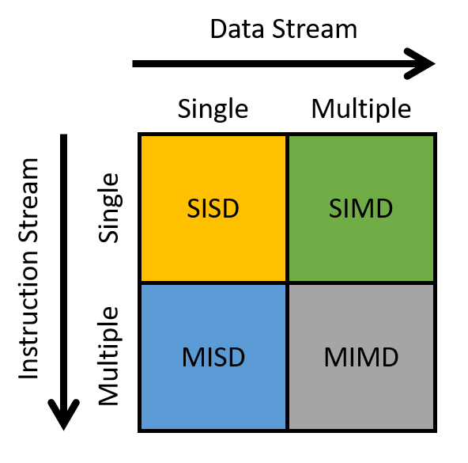

## 15. Nhìn về phía trước: Các hệ thống song song khác và các mô hình lập trình song song (Looking Ahead: Other Parallel Systems and Parallel Programming Models)

Trong [chương trước](../C14-SharedMemory/index.html#_leveraging_shared_memory_in_the_multicore_era), chúng ta đã thảo luận về **shared memory parallelism** (tính song song bộ nhớ chia sẻ) và lập trình đa luồng (multithreaded programming).  
Trong chương này, chúng ta sẽ giới thiệu các mô hình lập trình song song và ngôn ngữ khác cho các loại kiến trúc khác nhau.  
Cụ thể, chúng ta sẽ tìm hiểu:

- Tính song song cho **hardware accelerator** (bộ tăng tốc phần cứng), tập trung vào **graphics processing unit** (GPU – bộ xử lý đồ họa) và **general-purpose computing on GPUs** (GPGPU computing – tính toán đa dụng trên GPU), sử dụng **CUDA** làm ví dụ.
- **Distributed memory systems** (hệ thống bộ nhớ phân tán) và **message passing** (truyền thông điệp), sử dụng **MPI** làm ví dụ.
- **Cloud computing** (điện toán đám mây), sử dụng **MapReduce** và **Apache Spark** làm ví dụ.

---

### Một thế giới hoàn toàn mới: Flynn's Taxonomy of Architecture

**Flynn's taxonomy** thường được sử dụng để mô tả hệ sinh thái của kiến trúc máy tính hiện đại (Hình 1).

**Hình 1.** Flynn's taxonomy phân loại các cách mà bộ xử lý áp dụng lệnh.

---

Trục ngang đề cập đến **data stream** (luồng dữ liệu), trong khi trục dọc đề cập đến **instruction stream** (luồng lệnh).  
**Stream** trong ngữ cảnh này là một dòng dữ liệu hoặc lệnh.  
**Single stream** (luồng đơn) phát ra một phần tử mỗi đơn vị thời gian, tương tự như một hàng đợi.  
Ngược lại, **multiple streams** (nhiều luồng) thường phát ra nhiều phần tử mỗi đơn vị thời gian (tưởng tượng như nhiều hàng đợi).  

Do đó:

- **Single instruction stream (SI)** phát ra một lệnh mỗi đơn vị thời gian.
- **Multiple instruction stream (MI)** phát ra nhiều lệnh mỗi đơn vị thời gian.
- **Single data stream (SD)** phát ra một phần tử dữ liệu mỗi đơn vị thời gian.
- **Multiple data stream (MD)** phát ra nhiều phần tử dữ liệu mỗi đơn vị thời gian.

---

Một bộ xử lý có thể được phân loại vào một trong bốn loại dựa trên kiểu luồng mà nó sử dụng:

- **SISD**: *Single instruction / single data* — Hệ thống có một đơn vị điều khiển xử lý một luồng lệnh duy nhất, cho phép nó chỉ thực thi một lệnh tại một thời điểm.  
  Tương tự, bộ xử lý chỉ có thể xử lý một luồng dữ liệu hoặc một đơn vị dữ liệu tại một thời điểm.  
  Hầu hết các bộ xử lý thương mại trước giữa những năm 2000 là máy SISD.

- **MISD**: *Multiple instruction / single data* — Hệ thống có nhiều đơn vị lệnh cùng xử lý một luồng dữ liệu duy nhất.  
  MISD thường được thiết kế để tích hợp khả năng chịu lỗi (fault tolerance) trong các hệ thống nhiệm vụ quan trọng, chẳng hạn như chương trình điều khiển bay của tàu con thoi NASA.  
  Tuy nhiên, ngày nay máy MISD hầu như không còn được sử dụng trong thực tế.

- **SIMD**: *Single instruction / multiple data* — Hệ thống thực thi **cùng một** lệnh trên nhiều dữ liệu đồng thời và theo kiểu **lockstep** (đồng bộ từng bước).  
  Trong thực thi lockstep, tất cả các lệnh được đưa vào một hàng đợi, trong khi dữ liệu được phân phối cho các đơn vị tính toán khác nhau.  
  Khi thực thi, mỗi đơn vị tính toán sẽ thực hiện đồng thời lệnh đầu tiên trong hàng đợi, sau đó đồng thời thực hiện lệnh tiếp theo, và cứ thế tiếp tục.  
  Ví dụ nổi tiếng nhất của kiến trúc SIMD là **GPU**.  
  Các siêu máy tính đời đầu cũng áp dụng kiến trúc SIMD.  
  Chúng ta sẽ thảo luận về GPU chi tiết hơn trong [phần tiếp theo](gpu.html#_GPUs).

- **MIMD**: *Multiple instruction / multiple data* — Hệ thống thuộc loại kiến trúc được sử dụng rộng rãi nhất.  
  Chúng cực kỳ linh hoạt và có khả năng xử lý nhiều lệnh hoặc nhiều luồng dữ liệu cùng lúc.  
  Vì hầu hết các máy tính hiện đại đều sử dụng CPU đa lõi, nên đa số được phân loại là máy MIMD.  
  Chúng ta sẽ thảo luận về một loại hệ thống MIMD khác — **distributed memory systems** — trong [Mục 15.2](distrmem.html#_distributed_memory_systems_message_passing_and_mpi).

---

Bạn có muốn tôi dịch tiếp sang phần **15.1. Heterogeneous Computing: Hardware Accelerators, GPGPU Computing, and CUDA** ngay sau đây không?