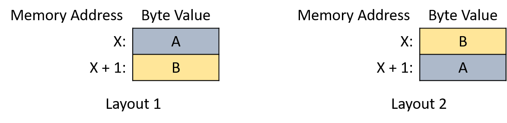
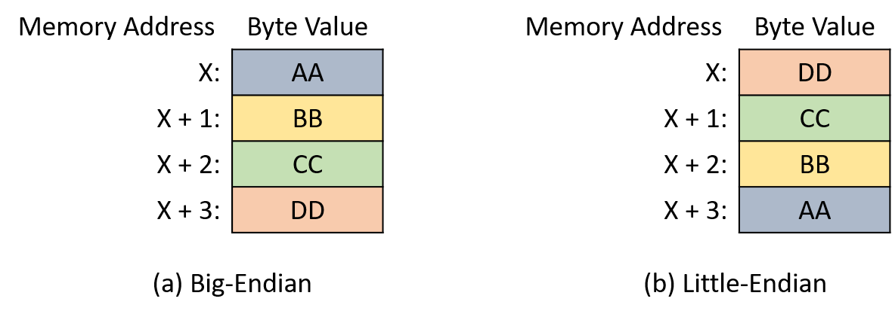

## 4.7. Thứ tự byte của số nguyên (Integer Byte Order)

Cho đến giờ, chương này đã mô tả một số cách code hóa số bằng bit, nhưng chưa đề cập đến việc các giá trị được tổ chức như thế nào trong bộ nhớ.  
Trong các hệ thống hiện đại, đơn vị nhỏ nhất có thể định địa chỉ trong bộ nhớ là **byte**, gồm 8 bit.  
Do đó, để lưu một giá trị 1 byte (ví dụ: biến kiểu `char`) bắt đầu tại địa chỉ *X*, bạn hầu như không có lựa chọn nào khác — chỉ cần lưu byte đó tại vị trí *X*.

Tuy nhiên, với các giá trị nhiều byte (ví dụ: biến kiểu `short` hoặc `int`), phần cứng có nhiều lựa chọn hơn trong việc gán các byte của giá trị vào các địa chỉ bộ nhớ.  
Ví dụ, xét một biến `short` gồm 2 byte có tên `s`, trong đó byte A chứa các bit có trọng số cao của `s` và byte B chứa các bit có trọng số thấp.  
Khi hệ thống được yêu cầu lưu `s` tại địa chỉ *X* (tức là ở các địa chỉ *X* và *X+1*), nó phải xác định byte nào (A hoặc B) sẽ nằm ở địa chỉ *X* và byte nào ở *X+1*.  
Hình 1 minh họa hai cách lưu `s` trong bộ nhớ.



**Hình 1.** Hai cách bố trí bộ nhớ khả dĩ cho một biến `short` 2 byte bắt đầu tại địa chỉ X.

**Byte order** (thứ tự byte) hay **endianness** của một hệ thống xác định cách phần cứng gán các byte của một biến nhiều byte vào các địa chỉ bộ nhớ liên tiếp.  
Mặc dù thứ tự byte hiếm khi gây vấn đề cho các chương trình chỉ chạy trên một hệ thống duy nhất, nó có thể gây bất ngờ nếu chương trình của bạn cố gắng in từng byte một hoặc khi bạn kiểm tra biến bằng **debugger**.

Ví dụ, xét chương trình sau:

> ```c
> #include <stdio.h>
> 
> int main(int argc, char **argv) {
>     // Khởi tạo một số nguyên 4 byte với các giá trị byte dễ phân biệt
>     int value = 0xAABBCCDD;
> 
>     // Khởi tạo một con trỏ kiểu char trỏ đến địa chỉ của số nguyên
>     char *p = (char *) &value;
> 
>     // Với mỗi byte trong số nguyên, in địa chỉ bộ nhớ và giá trị của nó
>     int i;
>     for (i = 0; i < sizeof(value); i++) {
>         printf("Address: %p, Value: %02hhX\n", p, *p);
>         p += 1;
>     }
> 
>     return 0;
> }
> ```

Chương trình này cấp phát một số nguyên 4 byte và khởi tạo các byte của nó, theo thứ tự từ bit có trọng số cao nhất đến thấp nhất, với các giá trị hexa `0xAA`, `0xBB`, `0xCC`, và `0xDD`.  
Sau đó, nó in từng byte bắt đầu từ địa chỉ gốc của số nguyên.  
Bạn có thể nghĩ rằng các byte sẽ được in theo thứ tự bảng chữ cái, nhưng trên các kiến trúc CPU phổ biến (ví dụ: x86 và hầu hết phần cứng ARM), kết quả lại in theo thứ tự ngược:

> ```
> $ ./a.out
> Address: 0x7ffc0a234928, Value: DD
> Address: 0x7ffc0a234929, Value: CC
> Address: 0x7ffc0a23492a, Value: BB
> Address: 0x7ffc0a23492b, Value: AA
> ```

Các CPU x86 lưu số nguyên theo định dạng **little-endian** — từ byte có trọng số thấp nhất (“little end”) đến byte có trọng số cao nhất ở các địa chỉ liên tiếp.  
Ngược lại, các kiến trúc CPU **big-endian** lưu số nguyên nhiều byte theo thứ tự ngược lại.  
Hình 2 minh họa một số nguyên 4 byte trong định dạng (a) big-endian và (b) little-endian.



**Hình 2.** Cách bố trí bộ nhớ của một số nguyên 4 byte trong định dạng (a) big-endian và (b) little-endian.

Thuật ngữ “endian” nghe có vẻ kỳ lạ bắt nguồn từ tiểu thuyết châm biếm *Gulliver’s Travels* (1726) của Jonathan Swift.  
Trong câu chuyện, Gulliver gặp hai vương quốc của những người cao 6 inch đang đánh nhau về cách đập trứng đúng.  
Vương quốc **big-endian** của Blefuscu đập đầu to của quả trứng, trong khi người **little-endian** của Lilliput đập đầu nhỏ.

Trong lĩnh vực máy tính, việc một hệ thống là *big-endian* hay *little-endian* thường chỉ ảnh hưởng đến các chương trình giao tiếp giữa nhiều máy (ví dụ: qua mạng).  
Khi truyền dữ liệu giữa các hệ thống, cả hai phải thống nhất về thứ tự byte để bên nhận có thể diễn giải giá trị chính xác.  
Năm 1980, Danny Cohen đã viết một ghi chú gửi **Internet Engineering Task Force (IETF)** với tiêu đề *On Holy Wars and a Plea for Peace*.  
Trong đó, ông mượn thuật ngữ “endian” của Swift và đề xuất IETF chuẩn hóa thứ tự byte cho truyền dữ liệu mạng.  
Cuối cùng, IETF đã chọn *big-endian* làm chuẩn **network byte order**.

Ngôn ngữ C cung cấp hai thư viện cho phép chương trình sắp xếp lại các byte của một số nguyên phục vụ mục đích truyền thông.

### 4.7.1. Tài liệu tham khảo

1. Jonathan Swift. *Gulliver’s Travels*. [http://www.gutenberg.org/ebooks/829](http://www.gutenberg.org/ebooks/829)  
2. Danny Cohen. *On Holy Wars and a Plea for Peace*. [https://www.ietf.org/rfc/ien/ien137.txt](https://www.ietf.org/rfc/ien/ien137.txt)  
3. [https://linux.die.net/man/3/byteorder](https://linux.die.net/man/3/byteorder)  
4. [https://linux.die.net/man/3/endian](https://linux.die.net/man/3/endian)  

