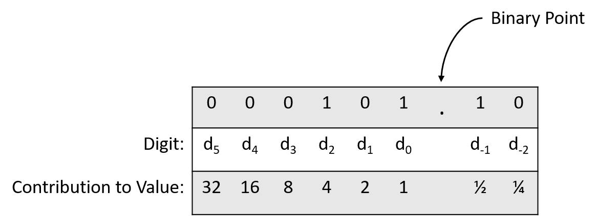
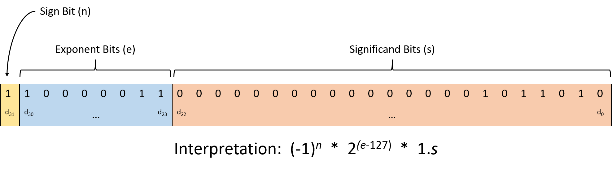

Ok Khánh 👍  

## 4.8. Số thực trong hệ nhị phân (Real Numbers in Binary)

Mặc dù chương này chủ yếu tập trung vào cách biểu diễn số nguyên trong hệ nhị phân, lập trình viên cũng thường cần lưu trữ **số thực**.  
Việc lưu trữ số thực vốn dĩ đã khó, và **không** có cách code hóa nhị phân nào có thể biểu diễn số thực với **độ chính xác tuyệt đối**.  
Điều này có nghĩa là, với bất kỳ cách code hóa nhị phân nào cho số thực, sẽ luôn tồn tại những giá trị **không thể** biểu diễn chính xác.  
Các giá trị vô tỉ như *π* rõ ràng không thể biểu diễn chính xác vì biểu diễn của chúng không bao giờ kết thúc.  
Ngay cả với số hữu tỉ, nếu số bit cố định, vẫn sẽ có những giá trị trong phạm vi biểu diễn mà không thể lưu chính xác.

Không giống số nguyên — vốn là tập **đếm được** ([countably infinite](https://en.wikipedia.org/wiki/Countable_set)) — tập số thực là **không đếm được** ([uncountable](https://en.wikipedia.org/wiki/Uncountable_set)).  
Nói cách khác, ngay cả trong một khoảng hẹp (ví dụ: từ 0 đến 1), số lượng giá trị có thể có là vô hạn đến mức không thể liệt kê.  
Do đó, các cách code hóa số thực thường chỉ lưu **xấp xỉ** giá trị, được **cắt ngắn** (truncate) để vừa với số bit định trước.  
Nếu số bit đủ lớn, độ chính xác thường là chấp nhận được cho hầu hết mục đích, nhưng cần cẩn trọng khi viết ứng dụng **không thể chấp nhận sai số làm tròn**.

Phần còn lại của mục này sẽ giới thiệu ngắn gọn hai phương pháp biểu diễn số thực trong nhị phân:  
- **Fixed-point**: mở rộng từ định dạng số nguyên nhị phân.  
- **Floating-point**: biểu diễn được phạm vi giá trị rộng hơn, nhưng phức tạp hơn.

### 4.8.1. Biểu diễn Fixed-Point

Trong **fixed-point representation** (biểu diễn dấu chấm cố định), vị trí của **binary point** (dấu chấm nhị phân) là **cố định** và không thay đổi.  
Tương tự như **decimal point** (dấu chấm thập phân) trong số thập phân, binary point cho biết phần thập phân bắt đầu từ đâu.  
Quy tắc code hóa fixed-point giống với [unsigned integer](bases.html#_unsigned_binary_numbers), ngoại trừ việc các chữ số sau binary point biểu diễn **lũy thừa âm** của 2.

Ví dụ: xét chuỗi 8 bit `0b000101.10`, trong đó 6 bit đầu biểu diễn phần nguyên, 2 bit sau binary point biểu diễn phần thập phân.  
Hình 1 minh họa vị trí các chữ số và giá trị của từng chữ số.

**Hình 1.** Giá trị của từng chữ số trong số 8 bit với 2 bit sau binary point.

Chuyển `0b000101.10` sang thập phân:

> \((0 \times 2^5) + (0 \times 2^4) + (0 \times 2^3) + (1 \times 2^2) + (0 \times 2^1) + (1 \times 2^0) + (1 \times 2^{-1}) + (0 \times 2^{-2})\)  
> = \(0 + 0 + 0 + 4 + 0 + 1 + 0.5 + 0 = 5.5\)

Với 2 bit sau binary point, phần thập phân có thể là:  
`00` (.00), `01` (.25), `10` (.50), hoặc `11` (.75).  
Thêm 1 bit nữa sẽ tăng độ chính xác lên 0.125 (2^-3^), và cứ thế tiếp tục.

Vì số bit sau binary point là cố định, một số phép tính có thể tạo ra kết quả cần **làm tròn** để vừa định dạng.  
Ví dụ: với định dạng trên, `0.75` (`0b000000.11`) và `2` (`0b000010.00`) đều biểu diễn chính xác.  
Nhưng `0.75 / 2` = `0.375` cần 3 bit thập phân (`0b000000.011`), nên khi cắt bớt còn `0b000000.01` = 0.25.

Lỗi làm tròn có thể **tích lũy** qua nhiều phép tính, và kết quả có thể khác nhau tùy thứ tự thực hiện:

1. `(0.75 / 2) * 3` → 0.75 (do làm tròn sớm)  
2. `(0.75 * 3) / 2` → 1.00 (ít bị làm tròn hơn)

### 4.8.2. Biểu diễn Floating-Point

Trong **floating-point representation** (biểu diễn dấu chấm động), vị trí binary point **không cố định**.  
Cách giải thích chuỗi bit phải bao gồm thông tin về vị trí chia phần nguyên và phần thập phân.  
Chuẩn phổ biến nhất là **IEEE 754** ([Institute of Electrical and Electronics Engineers](https://en.wikipedia.org/wiki/IEEE_754)), được hầu hết phần cứng hiện đại áp dụng.

**Hình 2.** Chuẩn IEEE 754 cho số thực 32 bit (`float` trong C).

Cấu trúc gồm 3 phần:

1. **Significand** (hay *mantissa*): 23 bit thấp (d~22~ đến d~0~), biểu diễn phần cơ sở của giá trị.  
   Luôn ngầm định có số 1 và binary point ở trước.  
   Ví dụ: `0b110000...` = 1 + 0.5 + 0.25 = 1.75.

2. **Exponent**: 8 bit tiếp theo (d~30~ đến d~23~), xác định hệ số nhân \(2^{(exponent - 127)}\).  
   Số 127 là **bias** để biểu diễn cả số rất lớn và rất nhỏ.

3. **Sign bit**: bit cao nhất (d~31~), 0 = số dương, 1 = số âm.

**Ví dụ giải code:**  
`0b11000001101101000000000000000000`

- Significand: `0b01101000000000000000000` = 1.40625  
- Exponent: `0b10000011` = 131 → mũ = 131 − 127 = 4 → nhân 16  
- Sign bit = 1 → số âm

Kết quả: \(1.40625 \times 16 \times -1 = -22.5\)

### 4.8.3. Hệ quả của việc làm tròn

Làm tròn thường không gây vấn đề nghiêm trọng, nhưng đôi khi dẫn đến **thảm họa**:

- **Chiến tranh vùng Vịnh 1991**: Lỗi làm tròn khiến hệ thống tên lửa Patriot [không đánh chặn được tên lửa Scud](http://www-users.math.umn.edu/~arnold/disasters/patriot.html), làm 28 binh sĩ thiệt mạng.  
- **Ariane 5 (1996)**: Tên lửa của ESA [nổ sau 39 giây](https://medium.com/@bishr_tabbaa/crash-and-burn-a-short-story-of-ariane-5-flight-501-3a3c50e0e284) do **overflow** khi chuyển từ floating-point sang integer.
