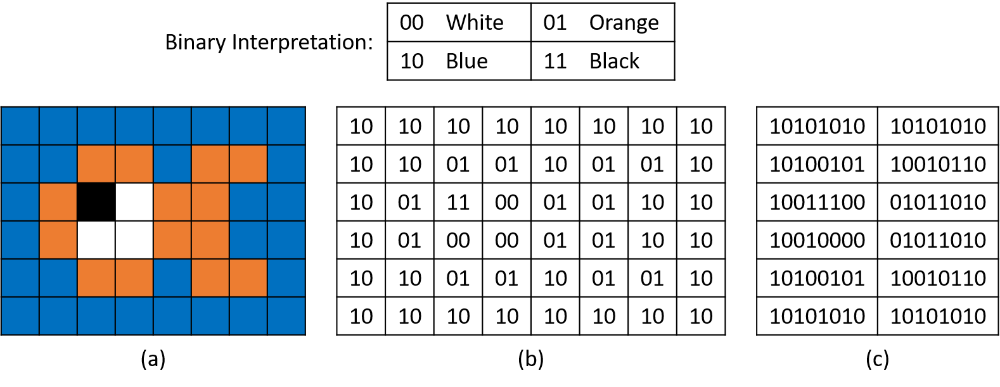

## 4. Biểu diễn dữ liệu và hệ nhị phân (Binary and Data Representation)

Từ những tấm bảng đá và tranh vẽ trong hang động, đến chữ viết và rãnh ghi âm trên đĩa than, con người luôn tìm cách ghi lại và lưu trữ thông tin.  
Trong chương này, chúng ta sẽ tìm hiểu cách mà một trong những bước đột phá lớn nhất của nhân loại trong lưu trữ — **máy tính số** — biểu diễn thông tin.  
Chúng ta cũng sẽ minh họa cách diễn giải ý nghĩa từ dữ liệu số.

Các máy tính hiện đại sử dụng nhiều loại phương tiện để lưu trữ thông tin (ví dụ: đĩa từ, đĩa quang, bộ nhớ flash, băng từ, và các mạch điện tử đơn giản).  
Chúng ta sẽ phân loại các thiết bị lưu trữ này ở [Chương 11](../C11-MemHierarchy/devices.html#_storage_devices).  
Tuy nhiên, trong phạm vi thảo luận này, bản chất của phương tiện lưu trữ không quá quan trọng — dù là tia laser quét bề mặt DVD hay đầu đọc di chuyển trên đĩa từ, thì đầu ra cuối cùng từ thiết bị lưu trữ vẫn là một chuỗi tín hiệu điện.  
Để đơn giản hóa mạch điện, mỗi tín hiệu là **binary** (nhị phân), nghĩa là chỉ có thể ở một trong hai trạng thái: không có điện áp (diễn giải là 0) hoặc có điện áp (diễn giải là 1).  
Chương này sẽ khám phá cách hệ thống code hóa thông tin thành nhị phân, bất kể phương tiện lưu trữ ban đầu là gì.

Trong hệ nhị phân, mỗi tín hiệu tương ứng với một **bit** (binary digit — chữ số nhị phân) thông tin: 0 hoặc 1.  
Có thể bạn sẽ ngạc nhiên khi biết rằng mọi loại dữ liệu đều có thể được biểu diễn chỉ bằng 0 và 1.  
Tất nhiên, khi thông tin phức tạp hơn, số lượng bit cần thiết để biểu diễn nó cũng tăng lên.  
May mắn là, số lượng giá trị duy nhất có thể biểu diễn sẽ **gấp đôi** mỗi khi thêm một bit vào chuỗi bit, nên một chuỗi *N* bit có thể biểu diễn \(2^N\) giá trị khác nhau.

Hình 1 minh họa sự tăng trưởng số lượng giá trị có thể biểu diễn khi độ dài chuỗi bit tăng lên.  
Một bit có thể biểu diễn **2** giá trị: 0 và 1.  
Hai bit có thể biểu diễn **4** giá trị: cả hai giá trị 1-bit với số 0 ở đầu (00 và 01), và cả hai giá trị 1-bit với số 1 ở đầu (10 và 11).  
Mẫu này tiếp tục cho mỗi bit mới được thêm vào: bit mới có thể là 0 hoặc 1, và các bit còn lại vẫn biểu diễn cùng phạm vi giá trị như trước.  
Do đó, việc thêm bit làm tăng **theo cấp số nhân** số lượng giá trị mà chuỗi mới có thể biểu diễn.

**Hình 1.** Các giá trị có thể biểu diễn với từ 1 đến 4 bit. Các bit được gạch chân thể hiện phần tiền tố được kế thừa từ hàng phía trên.

Vì một bit đơn lẻ không chứa được nhiều thông tin, các hệ thống lưu trữ thường nhóm nhiều bit lại thành chuỗi dài hơn để lưu trữ giá trị phức tạp hơn.  
Nhóm phổ biến nhất là **byte**, gồm 8 bit.  
Một byte có thể biểu diễn \(2^8 = 256\) giá trị khác nhau (0–255) — đủ để code hóa các chữ cái và ký hiệu thông dụng trong tiếng Anh.  
Byte cũng là đơn vị nhỏ nhất có thể định địa chỉ trong bộ nhớ máy tính, nghĩa là chương trình không thể yêu cầu ít hơn 8 bit để lưu một biến.

Các CPU hiện đại cũng thường định nghĩa **word** là 32 bit hoặc 64 bit, tùy thiết kế phần cứng.  
Kích thước của word xác định kích thước “mặc định” mà phần cứng sử dụng để truyền dữ liệu giữa các thành phần (ví dụ: giữa bộ nhớ và thanh ghi).  
Những chuỗi bit dài hơn này cần thiết để lưu trữ các số lớn, vì chương trình thường cần đếm vượt quá 256.

Nếu bạn đã lập trình C, bạn sẽ biết rằng mình phải [khai báo biến trước khi sử dụng](../C1-C_intro/getting_started.html#_variables_and_c_numeric_types).  
Khai báo này cho trình biên dịch C biết hai thông tin quan trọng về cách biểu diễn nhị phân của biến:  
1. Số lượng bit cần cấp phát.  
2. Cách chương trình sẽ **diễn giải** các bit đó.

Về mặt số lượng bit, trình biên dịch chỉ cần tra [kích thước kiểu dữ liệu](../C1-C_intro/getting_started.html#_c_numeric_types) (ví dụ: `char` là 1 byte) và cấp phát đúng lượng bộ nhớ.  
Nhưng cách **diễn giải** chuỗi bit mới là phần thú vị hơn.  
Mọi dữ liệu trong bộ nhớ máy tính đều được lưu dưới dạng bit, nhưng bit **không có ý nghĩa cố hữu**.  
Ví dụ, ngay cả với một bit duy nhất, bạn có thể diễn giải hai giá trị của nó theo nhiều cách: lên/xuống, đen/trắng, có/không, bật/tắt, v.v.

Khi tăng độ dài chuỗi bit, phạm vi diễn giải cũng mở rộng.  
Ví dụ, biến `char` sử dụng tiêu chuẩn code hóa **ASCII** (American Standard Code for Information Interchange), định nghĩa cách giá trị nhị phân 8 bit tương ứng với chữ cái và ký hiệu tiếng Anh.  
Bảng 1 cho thấy một phần nhỏ của bảng ASCII (để xem đầy đủ, bạn có thể chạy `man ascii` trên dòng lệnh).  
Không có lý do đặc biệt nào để ký tự `'X'` phải tương ứng với `01011000`, nên bạn không cần ghi nhớ bảng này.  
Điều quan trọng là mọi chương trình lưu trữ chữ cái đều thống nhất cách diễn giải chuỗi bit, và đó là lý do ASCII được định nghĩa bởi một ủy ban tiêu chuẩn.

| Giá trị nhị phân | Ký tự | Giá trị nhị phân | Ký tự |
|------------------|-------|------------------|-------|
| 01010111         | W     | 00100000         | space |
| 01011000         | X     | 00100001         | !     |
| 01011001         | Y     | 00100010         | "     |
| 01011010         | Z     | 00100011         | #     |

**Bảng 1.** Một phần nhỏ của bảng code ASCII 8 bit.

Bất kỳ loại thông tin nào cũng có thể được code hóa thành nhị phân, kể cả dữ liệu phức tạp như hình ảnh và âm thanh.  
Ví dụ, giả sử một hệ code hóa ảnh định nghĩa:  
`00` = trắng, `01` = cam, `10` = xanh dương, `11` = đen.  
Hình 2 minh họa cách ta có thể dùng code hóa 2 bit này để vẽ một hình con cá đơn giản chỉ với 12 byte.  
Ở phần (a), mỗi ô ảnh tương ứng với một chuỗi 2 bit.  
Phần (b) và (c) cho thấy cách code hóa nhị phân này dưới dạng chuỗi 2 bit và chuỗi byte.

**Hình 2.** (a) Biểu diễn hình ảnh, (b) biểu diễn theo ô 2 bit, và (c) biểu diễn theo byte của hình con cá đơn giản.

Vừa giới thiệu hai cách code hóa, ta thấy cùng một chuỗi bit `01011010` có thể được trình soạn thảo văn bản hiểu là ký tự `'Z'`, nhưng một chương trình đồ họa lại hiểu là một phần đuôi cá.  
Cách diễn giải nào đúng phụ thuộc vào **ngữ cảnh**.  
Mặc dù các bit bên dưới là giống nhau, con người thường thấy một số cách diễn giải dễ hiểu hơn (ví dụ: nhìn thấy hình con cá với màu sắc thay vì bảng byte).

Phần còn lại của chương này sẽ tập trung vào việc biểu diễn và thao tác với **số nhị phân**, nhưng điều quan trọng cần nhớ là:  
Mọi thông tin trong bộ nhớ máy tính đều được lưu dưới dạng 0 và 1, và việc diễn giải nghĩa đống bits đó hoàn toàn phụ thuộc vào chương trình, cũng như những người đang vận hành nó.

