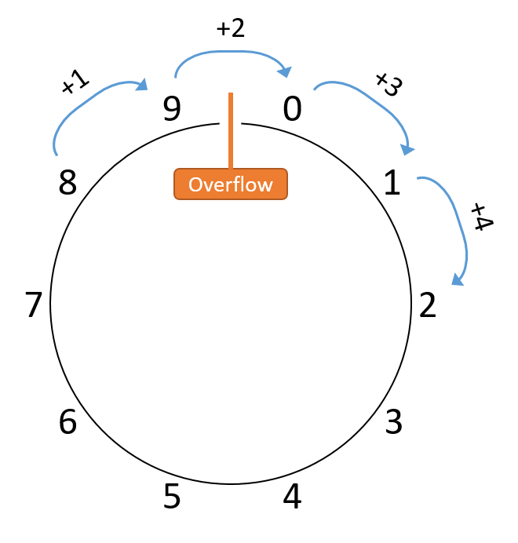
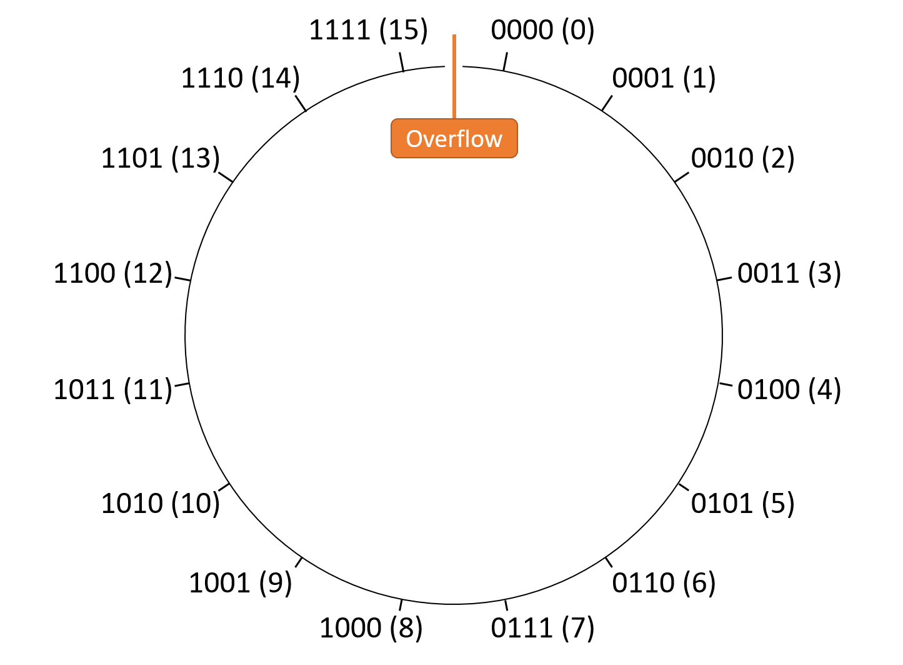
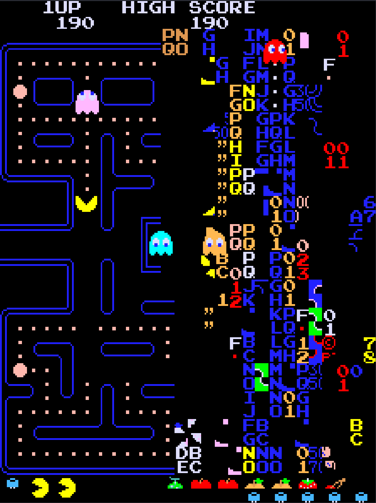

## 4.5. Tràn số nguyên (Integer Overflow)

Mặc dù về mặt toán học, tập hợp các số nguyên là vô hạn, nhưng trong thực tế, các kiểu dữ liệu số trong bộ nhớ máy tính [chiếm một số bit cố định](bases.html#_storage_limitations).  
Như đã gợi ý xuyên suốt chương này, việc sử dụng số bit cố định đồng nghĩa với việc chương trình có thể **không thể** biểu diễn một số giá trị mà nó muốn lưu trữ.  
Ví dụ, phần thảo luận về phép cộng đã cho thấy rằng việc cộng hai giá trị hợp lệ có thể tạo ra [một kết quả không thể biểu diễn](arithmetic_addition.html#carryout).  
Một phép tính không có đủ dung lượng để lưu trữ kết quả của nó được gọi là **overflow** (tràn số).

### 4.5.1. Phép so sánh với đồng hồ đo quãng đường (Odometer Analogy)

Để hình dung về overflow, hãy xét một ví dụ ngoài lĩnh vực máy tính: **odometer** (đồng hồ đo quãng đường) của ô tô.  
Odometer đếm số dặm xe đã chạy, và dù là loại cơ hay điện tử, nó chỉ có thể hiển thị một số lượng chữ số (cơ số 10) nhất định.  
Nếu xe chạy nhiều hơn số dặm mà odometer có thể biểu diễn, nó sẽ **quay vòng** về 0, vì giá trị thực không thể hiển thị.  
Ví dụ, với odometer 6 chữ số, giá trị lớn nhất là 999999.  
Chạy thêm 1 dặm *lẽ ra* sẽ hiển thị 1000000, nhưng giống như [ví dụ phép cộng bị tràn](arithmetic_addition.html#carryout), số 1 bị “carry out” ra ngoài 6 chữ số, để lại 000000.

Để đơn giản, giả sử odometer chỉ có **1 chữ số thập phân**.  
Nó biểu diễn phạm vi \[0, 9\], nên sau mỗi 10 dặm, odometer sẽ quay lại 0.  
Nếu minh họa phạm vi này, ta có thể vẽ như [Hình 1](#FigBaseTenWheel):


**Hình 1.** Minh họa trực quan các giá trị có thể của odometer 1 chữ số.

Vì odometer 1 chữ số quay vòng khi đạt 10, việc vẽ nó thành hình tròn giúp nhấn mạnh điểm **gián đoạn** ở đỉnh vòng tròn (và *chỉ* ở đó).  
Cụ thể, khi cộng 1 vào bất kỳ giá trị nào *khác 9*, kết quả sẽ là giá trị mong đợi.  
Ngược lại, cộng 1 vào 9 sẽ nhảy sang 0 — một giá trị không liền kề theo thứ tự tự nhiên.  
Nói chung, bất kỳ phép toán nào vượt qua điểm gián đoạn giữa 9 và 0 đều gây ra overflow.

Ví dụ, xét phép cộng \(8 + 4\) như trong [Hình 2](#FigBaseTenWheelAdding):



**Hình 2.** Kết quả của \(8 + 4\) với chỉ một chữ số thập phân.  
Việc vượt qua điểm gián đoạn giữa 0 và 9 cho thấy overflow đã xảy ra.

Trong ví dụ này, tổng thu được là 2 thay vì 12 như mong đợi.  
Lưu ý rằng nhiều giá trị khác cộng với 8 (ví dụ: \(8 + 14\)) cũng sẽ cho ra 2, chỉ khác ở chỗ phép tính sẽ “quay vòng” nhiều lần hơn.  
Do đó, không quan trọng xe chạy 2, 12 hay 152 dặm — cuối cùng odometer vẫn hiển thị 2.

Bất kỳ thiết bị nào hoạt động như odometer đều thực hiện **modular arithmetic** (số học mô-đun).  
Trong trường hợp này, mọi phép toán đều được tính theo mô-đun 10, vì một chữ số thập phân chỉ biểu diễn được 10 giá trị.  
Do đó, với bất kỳ số dặm nào, ta có thể tính giá trị odometer hiển thị bằng cách chia số dặm cho 10 và lấy **phần dư**.  
Nếu odometer có 2 chữ số thay vì 1, mô-đun sẽ là 100, vì nó có thể biểu diễn phạm vi \[0, 99\].  
Tương tự, đồng hồ cũng thực hiện số học mô-đun với mô-đun giờ là 12.

### 4.5.2. Tràn số nguyên nhị phân (Binary Integer Overflow)

Sau khi đã thấy một dạng overflow quen thuộc, giờ hãy xét cách biểu diễn số trong hệ nhị phân.  
Nhớ rằng *N* bit lưu trữ có thể biểu diễn \(2^N\) chuỗi bit khác nhau, và các chuỗi này có thể được diễn giải theo nhiều cách (*unsigned* hoặc *signed*).  
Một số phép toán có thể cho kết quả đúng theo một cách diễn giải, nhưng lại gây overflow theo cách diễn giải khác, nên phần cứng cần nhận biết overflow theo từng trường hợp.

Ví dụ, giả sử máy dùng chuỗi 4 bit để tính \(0b0010\) (2) − \(0b0101\) (5).  
Thực hiện phép toán này theo [thủ tục trừ](arithmetic_subtraction.html#_subtraction) cho ra kết quả nhị phân \(0b1101\).

- Nếu diễn giải kết quả này là **signed**: \( -8 + 4 + 1 = -3 \) → đúng với kết quả mong đợi của \(2 - 5\), **không** bị overflow.  
- Nếu diễn giải là **unsigned**: \( 8 + 4 + 1 = 13 \) → sai, rõ ràng là dấu hiệu của overflow.

Xem xét kỹ hơn, điều này khá hợp lý — kết quả lẽ ra phải là số âm, và cách diễn giải signed cho phép số âm, trong khi unsigned thì không.

#### Tràn số nguyên không dấu (Unsigned Overflow)

Các số **unsigned** (không dấu) hoạt động tương tự như ví dụ odometer (đồng hồ đo quãng đường) ở hệ thập phân, vì cả hai chỉ biểu diễn các giá trị không âm.  
Với *N* bit, giá trị unsigned nằm trong phạm vi \[0, \(2^N - 1\)\], khiến mọi phép toán đều là **modular arithmetic** (số học mô-đun) theo mô-đun \(2^N\).  
Hình 3 minh họa cách sắp xếp các giá trị unsigned 4-bit trong một không gian mô-đun.



**Hình 3.** Sắp xếp các giá trị unsigned 4-bit trong không gian mô-đun. Mọi phép toán đều là mô-đun theo \(2^4 = 16\).

Vì cách diễn giải unsigned không thể chứa giá trị âm, điểm gián đoạn lại nằm giữa giá trị lớn nhất và số 0.  
Do đó, **unsigned overflow** xảy ra khi bất kỳ phép toán nào vượt qua ranh giới giữa \(2^N - 1\) và 0.  
Nói một cách đơn giản, nếu thực hiện phép cộng (lẽ ra kết quả phải **lớn hơn**) nhưng lại cho ra kết quả nhỏ hơn, thì phép cộng đó gây ra unsigned overflow. Ngược lại, nếu thực hiện phép trừ (lẽ ra kết quả phải **nhỏ hơn**) nhưng lại cho ra kết quả lớn hơn, thì phép trừ đó gây ra unsigned overflow.

Một cách rút gọn để phát hiện unsigned overflow trong phép cộng và phép trừ là dựa vào bit **carry out** (số nhớ ra) và **carry in** (số nhớ vào) của các phép toán này:

- **Carry out**: số nhớ ra từ bit có trọng số cao nhất trong kết quả.  
- **Carry in**: số nhớ vào bit có trọng số thấp nhất (d~0~) của phép toán.  
  Trong phép trừ, carry in được đặt thành 1 như một phần của **negation procedure** (thủ tục phủ định).

**Quy tắc rút gọn cho số học unsigned**:  
**Carry out** phải **bằng** **carry in**, nếu không thì phép toán gây ra overflow.

Trực giác của quy tắc này:

- **Phép cộng** (carry in = 0):  
  Kết quả phải lớn hơn hoặc bằng toán hạng thứ nhất.  
  Nếu tổng cần thêm một bit để lưu trữ (carry out = 1), việc cắt bỏ (truncate) bit này sẽ tạo ra kết quả nhỏ hơn → overflow.  
  Ví dụ: trong không gian số unsigned 4-bit, \(0b1100\) (12) + \(0b1101\) (13) cần **5 bit** để lưu \(0b1\,1001\) (25).  
  Khi cắt còn 4 bit, kết quả là \(0b1001\) (9), nhỏ hơn các toán hạng → overflow.

- **Phép trừ** (carry in = 1):  
  Kết quả phải nhỏ hơn hoặc bằng toán hạng thứ nhất.  
  Vì phép trừ được thực hiện như cộng với số phủ định, nên phép cộng này lẽ ra phải cho kết quả nhỏ hơn.  
  Cách duy nhất để phép cộng cho ra giá trị nhỏ hơn là khi cần cắt bớt bit (carry out = 1).  
  Nếu không cần cắt (carry out = 0), phép trừ sẽ cho kết quả lớn hơn → overflow.

**Ví dụ 1 – Tràn số**: \(0b0111\) (7) − \(0b1001\) (9)  
Thủ tục trừ xử lý như sau:

> ```
>  1 (carry in)         1 (carry in)
>  0111                 0111
> -1001               + 0110 (bits flipped)
> 
>  Result:   1110
>  Carry out: 0
> ```

Phép tính **không** tạo carry out từ d~3~, nên không có cắt bớt bit.  
Carry in (1) **không khớp** với carry out (0) → overflow.  
Kết quả \(0b1110\) (14) lớn hơn cả hai toán hạng, rõ ràng sai cho \(7 - 9\).

**Ví dụ 2 – Không tràn số**: \(0b0111\) (7) − \(0b0101\) (5)  
Thủ tục trừ xử lý như sau:

> ```
>  1 (carry in)         1 (carry in)
>  0111                 0111
> -0101               + 1010 (bits flipped)
> 
>  Result:   0010
>  Carry out: 1
> ```

Phép tính tạo carry out sang d~4~, nên carry in (1) **khớp** với carry out (1) → không overflow.  
Kết quả \(0b0010\) (2) đúng với \(7 - 5\).

#### Tràn số nguyên có dấu (Signed Overflow)

Nguyên tắc trực giác về overflow cũng áp dụng cho cách diễn giải số nhị phân **signed** (có dấu): tồn tại một **điểm gián đoạn** trong không gian số mô-đun.  
Tuy nhiên, vì cách diễn giải signed cho phép giá trị âm, điểm gián đoạn **không** xảy ra quanh số 0.  
Hãy nhớ rằng [two’s complement](signed.html#_twos_complement) (bù hai) “quay vòng” mượt mà từ -1 (`0b1111...111`) sang 0 (`0b0000...000`).  
Do đó, điểm gián đoạn nằm ở **đầu kia** của không gian số, nơi giá trị dương lớn nhất và giá trị âm nhỏ nhất gặp nhau.

Hình 4 minh họa cách sắp xếp các giá trị signed 4-bit trong một không gian mô-đun.  
Lưu ý rằng một nửa giá trị là âm, nửa còn lại là không âm, và điểm gián đoạn nằm ở ranh giới min/max giữa chúng.


**Hình 4.** Sắp xếp các giá trị signed 4-bit trong không gian mô-đun.  
Vì cách diễn giải signed cho phép giá trị âm, điểm gián đoạn không còn nằm ở số 0.

Khi thực hiện số học signed, việc tạo ra kết quả **tiến gần về 0** luôn an toàn.  
Nói cách khác, bất kỳ phép toán nào làm giảm giá trị tuyệt đối của kết quả sẽ **không thể** gây overflow, vì điểm gián đoạn nằm ở nơi độ lớn của giá trị biểu diễn được là lớn nhất.

Do đó, hệ thống phát hiện overflow trong phép cộng và phép trừ signed bằng cách so sánh **bit có trọng số cao nhất** (most significant bit) của các toán hạng với bit có trọng số cao nhất của kết quả.  
Với phép trừ, trước tiên hãy viết lại phép toán dưới dạng phép cộng (ví dụ: viết lại \(5 - 2\) thành \(5 + (-2)\)).

- Nếu hai toán hạng của phép cộng có **bit cao nhất khác nhau** (tức là một số âm, một số dương), sẽ **không thể** xảy ra signed overflow, vì giá trị tuyệt đối của kết quả phải nhỏ hơn hoặc bằng một trong hai toán hạng. Kết quả đang tiến **về phía** 0.
- Nếu hai toán hạng có **bit cao nhất giống nhau** (cùng dương hoặc cùng âm), kết quả đúng cũng phải có bit cao nhất giống như vậy.  
  Do đó, khi cộng hai số cùng dấu, signed overflow xảy ra nếu **dấu của kết quả khác** dấu của các toán hạng.

**Ví dụ với số nhị phân signed 4-bit:**

- \(5 - 4\) tương đương \(5 + (-4)\). Toán hạng thứ nhất (5) là dương, toán hạng thứ hai (-4) là âm → kết quả tiến về 0 → **không overflow**.
- \(4 + 2\) (cả hai dương) cho ra 6 (dương) → **không overflow**.
- \(-5 - 1\) tương đương \(-5 + (-1)\) (cả hai âm) cho ra -6 (âm) → **không overflow**.
- \(4 + 5\) (cả hai dương) cho ra -7 (âm) → dấu kết quả khác dấu toán hạng → **overflow**.
- \(-3 - 8\) tương đương \(-3 + (-8)\) (cả hai âm) cho ra 5 (dương) → dấu kết quả khác dấu toán hạng → **overflow**.

### 4.5.3. Tóm tắt về Overflow

Nói chung, **integer overflow** xảy ra khi một phép toán số học vượt qua ranh giới giữa giá trị nhỏ nhất và lớn nhất mà kết quả có thể biểu diễn.  
Nếu không chắc về quy tắc overflow của signed và unsigned, hãy xét giá trị min và max của chuỗi N-bit:

- **Unsigned**:  
  - Min = 0 (vì unsigned không biểu diễn số âm)  
  - Max = \(2^N - 1\) (vì một chuỗi bit dành cho số 0)  
  → Điểm gián đoạn nằm giữa \(2^N - 1\) và 0.
- **Signed**:  
  - Min = \(-2^{N-1}\) (vì một nửa chuỗi bit dành cho số âm)  
  - Max = \(2^{N-1} - 1\) (vì trong nửa còn lại, một giá trị dành cho số 0)  
  → Điểm gián đoạn nằm giữa \(2^{N-1} - 1\) và \(-2^{N-1}\).

### 4.5.4. Hệ quả của Overflow

Mặc dù bạn có thể không thường xuyên gặp integer overflow, nhưng khi xảy ra, nó có thể phá vỡ chương trình theo những cách đáng chú ý (và đôi khi **thảm khốc**).

- **Ví dụ 1 – YouTube & Gangnam Style (2014)**:  
  Video [Gangnam Style](https://en.wikipedia.org/wiki/Gangnam_Style) của PSY suýt làm tràn bộ đếm 32-bit mà YouTube dùng để theo dõi lượt xem.  
  Kết quả là YouTube đã chuyển sang dùng bộ đếm 64-bit.

- **Ví dụ 2 – Pac-Man (1980)**:  
  Trò chơi arcade *Pac-Man* dùng giá trị unsigned 8-bit để lưu cấp độ người chơi.  
  Khi vượt qua cấp 255 (max của unsigned 8-bit), nửa bàn chơi bị lỗi hiển thị nghiêm trọng như trong Hình 5.



**Hình 5.** Bàn chơi *Pac-Man* “loạn” khi đạt cấp 256.

- **Ví dụ 3 – Therac-25 (1980s)**:  
  Máy xạ trị [Therac-25](https://en.wikipedia.org/wiki/Therac-25) gặp nhiều lỗi thiết kế, trong đó có một lỗi tăng giá trị biến cờ logic (truth flag) thay vì gán hằng số.  
  Sau đủ số lần sử dụng, biến này bị overflow, quay về 0 (false) và bỏ qua cơ chế an toàn.  
  Hậu quả: gây thương tích nghiêm trọng (và trong một số trường hợp tử vong) cho 6 bệnh nhân.
