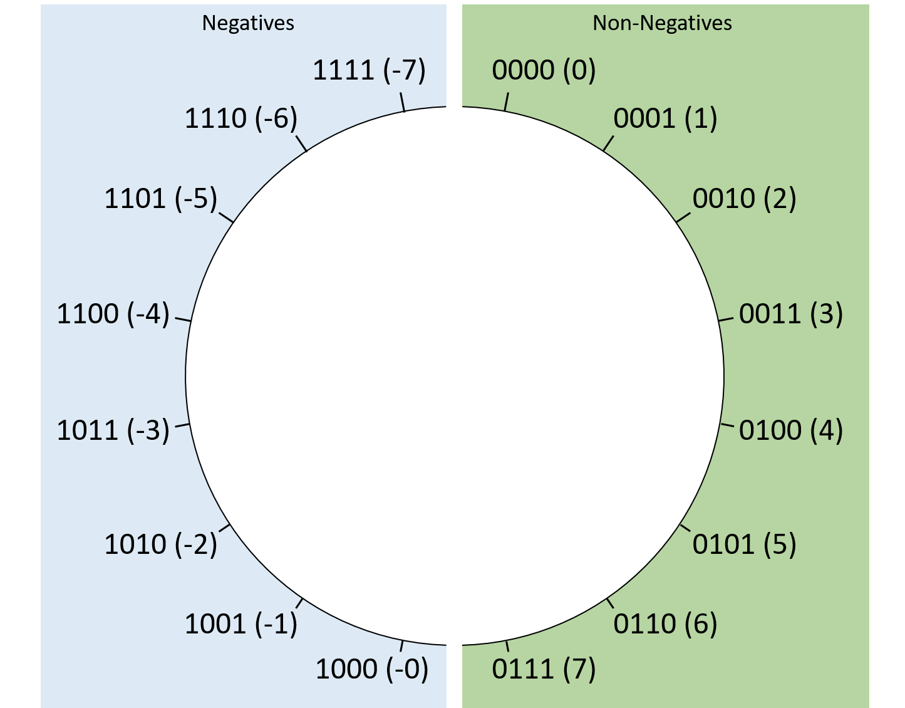

## 4.3. Số nguyên nhị phân có dấu (Signed Binary Integers)

Cho đến giờ, chúng ta mới chỉ giới hạn việc thảo luận về số nhị phân ở dạng **unsigned** (chỉ gồm các số không âm).  
Phần này giới thiệu một cách diễn giải khác của nhị phân để biểu diễn cả số âm.  
Vì biến có dung lượng lưu trữ hữu hạn, một cách code hóa nhị phân có dấu phải phân biệt được giữa số âm, số 0 và số dương.  
Việc thao tác với số có dấu cũng đòi hỏi một **procedure** (thủ tục) để thực hiện phép phủ định (negation).

Một cách code hóa nhị phân có dấu phải chia tập hợp các chuỗi bit thành hai nhóm: số âm và số không âm.  
Trong thực tế, các nhà thiết kế hệ thống thường xây dựng hệ thống **general-purpose** (đa dụng), nên việc chia đôi 50% / 50% là lựa chọn cân bằng.  
Vì vậy, các cách code hóa số có dấu được trình bày trong chương này sẽ biểu diễn số lượng giá trị âm và không âm bằng nhau.

> **Lưu ý:** Có sự khác biệt tinh tế nhưng quan trọng giữa *non-negative* (không âm) và *positive* (dương).  
> Tập hợp số dương loại trừ số 0, trong khi tập hợp số không âm bao gồm cả 0.  
> Ngay cả khi chia đều 50% số chuỗi bit cho số âm và số không âm, vẫn cần dành một giá trị không âm để biểu diễn số 0.  
> Do đó, với số bit cố định, hệ thống số có thể biểu diễn nhiều số âm hơn số dương (ví dụ: trong hệ **two’s complement**).

Các cách code hóa số có dấu sử dụng **một bit** để phân biệt giữa nhóm số âm và nhóm số không âm.  
Theo quy ước, **bit ngoài cùng bên trái** cho biết số đó là âm (1) hay không âm (0).  
Bit này được gọi là **high-order bit** hoặc **most significant bit**.

Chương này sẽ giới thiệu hai cách code hóa số có dấu: **signed magnitude** và **two’s complement**.  
Mặc dù chỉ có **two’s complement** còn được sử dụng trong thực tế, việc so sánh cả hai sẽ giúp minh họa các đặc điểm quan trọng.

### 4.3.1. Signed Magnitude

**Signed magnitude** coi bit cao nhất chỉ là bit dấu.  
Nghĩa là, giá trị tuyệt đối của số được xác định bởi các bit còn lại, còn bit dấu chỉ quyết định số đó là dương (bit dấu = 0) hay âm (bit dấu = 1).  
So với **two’s complement**, signed magnitude giúp việc chuyển đổi sang thập phân và phủ định số trở nên đơn giản hơn:

- Để tính giá trị thập phân của một chuỗi signed magnitude *N* bit:  
  Tính giá trị của các bit từ d~0~ đến d~N-2~ theo cách **unsigned**.  
  Sau đó kiểm tra bit cao nhất d~N-1~: nếu là 1 → số âm, nếu là 0 → số không âm.
- Để phủ định một giá trị: chỉ cần đảo bit cao nhất.

> **Hiểu lầm thường gặp:**  
> Signed magnitude được trình bày ở đây chỉ nhằm mục đích giảng dạy.  
> Một số máy tính cũ (ví dụ: [IBM 7090](https://en.wikipedia.org/wiki/IBM_7090) những năm 1960) từng sử dụng, nhưng không hệ thống hiện đại nào dùng signed magnitude để biểu diễn số nguyên (mặc dù cơ chế tương tự vẫn được dùng trong chuẩn lưu trữ [floating-point](https://en.wikipedia.org/wiki/Single-precision_floating-point_format)).  
> Trừ khi được yêu cầu rõ ràng, **không nên** giả định rằng việc đảo bit đầu tiên sẽ phủ định giá trị của một số trên hệ thống hiện đại.

Hình 1 cho thấy cách các chuỗi signed magnitude 4-bit tương ứng với giá trị thập phân.  
Thoạt nhìn, signed magnitude có vẻ đơn giản, nhưng nó có hai nhược điểm lớn:

1. Có **hai cách biểu diễn số 0**: 0b0000 (0) và 0b1000 (-0).  
   Điều này gây khó khăn cho phần cứng vì phải xử lý hai chuỗi bit khác nhau nhưng giá trị bằng nhau.
2. Có **điểm gián đoạn** giữa số âm và số 0.  
   Ví dụ: trong signed magnitude 4-bit, 0b1111 (-7) + 1 sẽ “quay vòng” thành 0b0000 (0) thay vì -6, gây nhầm lẫn.



**Hình 1.** Cách sắp xếp giá trị signed magnitude với chuỗi bit dài 4.

Vì những lý do này, signed magnitude hầu như biến mất trong thực tế, nhường chỗ cho **two’s complement**.

### 4.3.2. Two’s Complement

**Two’s complement** giải quyết các vấn đề của signed magnitude một cách gọn gàng.  
Giống signed magnitude, bit cao nhất cho biết số đó là âm hay không âm.  
Tuy nhiên, trong two’s complement, bit này **cũng tham gia vào giá trị tuyệt đối** của số.

Cách tính giá trị thập phân của một số two’s complement *N* bit tương tự như cách **unsigned**,  
nhưng **bit cao nhất được tính với giá trị âm**:  
Thay vì đóng góp \(d_{N-1} \times 2^{N-1}\), nó đóng góp \(-d_{N-1} \times 2^{N-1}\).  
Do đó, nếu bit cao nhất là 1 → giá trị âm (vì nó đóng góp giá trị tuyệt đối lớn nhất và mang dấu âm).  
Công thức đầy đủ:

> **-**(d~N-1~ × 2^(N-1)) + (d~N-2~ × 2^(N-2)) + … + (d~1~ × 2^1) + (d~0~ × 2^0)

Hình 2 minh họa cách sắp xếp các giá trị two’s complement 4-bit.  
Cách này chỉ có **một cách biểu diễn số 0** (tất cả bit = 0).  
Two’s complement biểu diễn được **nhiều số âm hơn số dương**: với 4-bit, min = 0b1000 (-8), max = 0b0111 (7).  
Điều này không gây khó khăn cho phần cứng và hiếm khi ảnh hưởng đến ứng dụng.


**Hình 2.** Cách sắp xếp giá trị two’s complement với chuỗi bit dài 4.

Two’s complement cũng giúp việc chuyển đổi giữa số âm và số 0 trở nên đơn giản:  
Bất kể số bit, chuỗi toàn bit 1 luôn là -1, và -1 + 1 sẽ “quay vòng” thành 0.

#### Phủ định (Negation)

Phủ định một số two’s complement phức tạp hơn signed magnitude một chút.  
Để phủ định giá trị *N* bit X, tìm **bổ sung** của nó so với \(2^N\) (đây là nguồn gốc tên gọi two’s complement).  
Nói cách khác, tìm Y sao cho \(X + Y = 2^N\).

Cách nhanh trong thực tế: **đảo tất cả các bit rồi cộng thêm 1**.

Ví dụ: phủ định số 13 (8-bit):

1. 13 = 0b00001101  
2. Đảo bit → 0b11110010  
3. Cộng 1 → 0b11110011 (theo công thức two’s complement, giá trị = -13)

> **Lập trình C với số signed và unsigned:**  
> Khi khai báo `int`, trình biên dịch hiểu là số nguyên signed two’s complement.  
> Nếu muốn unsigned, khai báo `unsigned int`.  
> Sự khác biệt này cũng quan trọng khi in giá trị với `printf`:  
> ```c
> printf("%d  %u\n", example, example);
> ```
> Nếu `example = -100`, kết quả sẽ là `-100  4294967196`.

#### Mở rộng dấu (Sign Extension)

Đôi khi, bạn sẽ cần thực hiện phép toán giữa hai số có số bit lưu trữ khác nhau.  
Ví dụ, trong C, bạn có thể muốn cộng một `int` 32-bit với một `short` 16-bit.  
Trong những trường hợp như vậy, số nhỏ hơn cần được **mở rộng dấu** (sign extension) — tức là lặp lại **bit có trọng số cao nhất** của nó đủ số lần để kéo dài chuỗi bit thành độ dài mong muốn.  
Trong C, trình biên dịch sẽ tự động xử lý việc này, nhưng hiểu cơ chế hoạt động vẫn rất hữu ích.

Ví dụ:

- Mở rộng chuỗi 4-bit `0b0110` (6) thành chuỗi 8-bit:  
  Lấy bit cao nhất (0) và chèn thêm bốn số 0 vào đầu → `0b00000110` (vẫn là 6).

- Mở rộng chuỗi 4-bit `0b1011` (-5) thành chuỗi 8-bit:  
  Lấy bit cao nhất (1) và chèn thêm bốn số 1 vào đầu → `0b11111011` (vẫn là -5).

Để kiểm chứng, hãy xem giá trị thay đổi thế nào khi thêm từng bit mới:

```
0b1011     =  -8  + 0  + 2 + 1  =  -5
0b11011    = -16 + 8  + 0 + 2 + 1  =  -5
0b111011   = -32 + 16 + 8 + 0 + 2 + 1  =  -5
0b1111011  = -64 + 32 + 16 + 8 + 0 + 2 + 1  =  -5
0b11111011 = -128 + 64 + 32 + 16 + 8 + 0 + 2 + 1  =  -5
```

Như bạn thấy, số **không âm** (bit cao nhất = 0) vẫn giữ nguyên là không âm khi thêm các bit 0 vào đầu.  
Tương tự, số **âm** (bit cao nhất = 1) vẫn giữ nguyên là âm khi thêm các bit 1 vào đầu.

> **Zero extension cho số unsigned**  
> Với giá trị **unsigned** (ví dụ: biến C khai báo với từ khóa `unsigned`), việc mở rộng thành chuỗi bit dài hơn sẽ dùng **zero extension** (mở rộng bằng số 0), vì kiểu unsigned không bao giờ được hiểu là số âm.  
> Zero extension đơn giản là thêm các bit 0 vào đầu chuỗi bit.  
> Ví dụ: `0b1110` (14 khi hiểu là unsigned) sẽ được mở rộng thành `0b00001110` dù bit đầu tiên ban đầu là 1.
