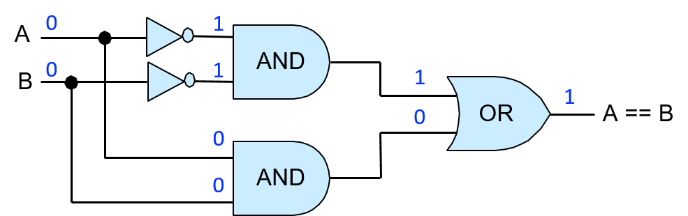

### 5.4.1. Mạch Số học và Logic

Các mạch số học và logic thực hiện các lệnh số học và logic của một ISA (instruction set architecture – "kiến trúc tập lệnh") mà cùng nhau tạo thành **arithmetic logic unit** (ALU – "bộ số học và logic") của bộ xử lý. Các mạch này cũng đảm nhiệm một phần chức năng khác trong CPU. Ví dụ, mạch số học được dùng để tăng giá trị của program counter (PC – "bộ đếm chương trình") như một phần của bước đầu tiên trong quá trình thực thi lệnh, và được dùng để tính toán địa chỉ bộ nhớ bằng cách kết hợp các bit toán hạng trong lệnh với giá trị của các thanh ghi.

Thiết kế mạch thường bắt đầu bằng việc triển khai phiên bản 1-bit của một mạch đơn giản từ các cổng logic. Mạch 1-bit này sau đó được dùng làm khối xây dựng để triển khai phiên bản *M*-bit của mạch. Các bước thiết kế một mạch 1-bit từ các cổng logic cơ bản gồm:

1. Thiết kế bảng chân trị (truth table – "bảng chân trị") cho mạch: xác định số lượng đầu vào và đầu ra, và thêm một dòng cho mỗi tổ hợp của các bit đầu vào, chỉ rõ giá trị của các bit đầu ra.

2. Dựa vào bảng chân trị, viết biểu thức cho các trường hợp đầu ra của mạch bằng 1, sử dụng các phép toán AND, OR, NOT trên các giá trị đầu vào.

3. Chuyển biểu thức thành chuỗi các cổng logic, trong đó mỗi cổng nhận đầu vào từ đầu vào của mạch hoặc từ đầu ra của một cổng logic trước đó.

Ta sẽ theo các bước trên để triển khai một mạch *equals* (so sánh bằng) 1-bit: phép so sánh từng bit `A == B` sẽ cho ra 1 khi giá trị của `A` và `B` giống nhau, và cho ra 0 nếu khác nhau.

Đầu tiên, thiết kế bảng chân trị cho mạch:

+----------------------+----------------------+-----------------------+
| A                    | B                    | A == B output         |
+======================+======================+=======================+
| 0                    | 0                    | 1                     |
+----------------------+----------------------+-----------------------+
| 0                    | 1                    | 0                     |
+----------------------+----------------------+-----------------------+
| 1                    | 0                    | 0                     |
+----------------------+----------------------+-----------------------+
| 1                    | 1                    | 1                     |
+----------------------+----------------------+-----------------------+

: Bảng 1. Bảng chân trị cho mạch so sánh bằng đơn giản

Tiếp theo, viết biểu thức cho các trường hợp `A == B` bằng 1, sử dụng các phép toán AND, OR, NOT trên `A` và `B`. Trước tiên, xét từng dòng trong bảng chân trị mà đầu ra là 1, bắt đầu với dòng đầu tiên:

+----------------------+----------------------+-----------------------+
| A                    | B                    | A == B                |
+======================+======================+=======================+
| 0                    | 0                    | 1                     |
+----------------------+----------------------+-----------------------+

Với các giá trị đầu vào ở dòng này, ta xây dựng một *conjunction* (phép hội – kết hợp bằng AND) của các biểu thức đầu vào sao cho kết quả là 1. Một **conjunction** kết hợp các biểu thức con có giá trị 0 hoặc 1 bằng phép AND, và chỉ cho ra 1 khi tất cả các biểu thức con đều bằng 1. Bắt đầu bằng cách biểu diễn khi nào mỗi đầu vào bằng 1:

> NOT(A)    # bằng 1 khi A là 0  
> NOT(B)    # bằng 1 khi B là 0

Sau đó, kết hợp chúng bằng AND để tạo biểu thức cho trường hợp dòng này trong bảng chân trị cho ra 1:

> NOT(A) AND NOT(B)    # bằng 1 khi cả A và B đều là 0

Ta thực hiện tương tự với dòng cuối trong bảng chân trị, nơi đầu ra cũng là 1:

+----------------------+----------------------+-----------------------+
| A                    | B                    | A == B                |
+======================+======================+=======================+
| 1                    | 1                    | 1                     |
+----------------------+----------------------+-----------------------+

> A AND B   # bằng 1 khi cả A và B đều là 1

Cuối cùng, tạo một **disjunction** (phép tuyển – kết hợp bằng OR) của các conjunction tương ứng với các dòng trong bảng chân trị có đầu ra bằng 1:

> (NOT(A) AND NOT(B)) OR (A AND B)  # bằng 1 khi A và B đều là 0 hoặc đều là 1

Tại thời điểm này, ta đã có một biểu thức cho `A == B` có thể được chuyển thành mạch. Ở bước này, các kỹ sư thiết kế mạch thường áp dụng các kỹ thuật để đơn giản hóa biểu thức nhằm tạo ra biểu thức tương đương tối giản (biểu thức có ít toán tử nhất và/hoặc độ dài đường đi qua các cổng ngắn nhất). Việc tối giản biểu thức cần được thực hiện cẩn thận để đảm bảo tính tương đương. Có các phương pháp chính quy để tối giản mạch, nhưng nằm ngoài phạm vi của chương này; tuy nhiên, ta sẽ sử dụng một vài phương pháp heuristic khi phát triển mạch.

Trong ví dụ này, ta sẽ chuyển trực tiếp biểu thức trên thành mạch. Có thể ta sẽ muốn thay thế `(NOT(A) AND NOT(B))` bằng `(A NAND B)`, nhưng cần lưu ý rằng hai biểu thức này **không** tương đương: chúng không cho ra kết quả giống nhau với mọi tổ hợp của A và B. Ví dụ, khi A là 1 và B là 0, `(A == B)` là 0 còn `(A NAND B)` là 1.

Để chuyển biểu thức thành mạch, bắt đầu từ biểu thức trong cùng và làm việc ra ngoài (biểu thức trong cùng sẽ là các cổng đầu tiên, đầu ra của chúng sẽ là đầu vào cho các cổng tiếp theo). Bộ cổng đầu tiên sẽ là các cổng NOT cho các đầu vào A và B. Tiếp theo, với mỗi conjunction, tạo phần mạch đưa các giá trị đầu vào vào cổng AND. Đầu ra của các cổng AND sau đó được đưa vào cổng OR đại diện cho disjunction. Mạch kết quả được minh họa trong Hình 1.

**Hình 1. Mạch so sánh bằng 1-bit (A == B) được xây dựng từ các cổng logic AND, OR và NOT.**

Để kiểm tra tính đúng đắn của mạch này, ta mô phỏng tất cả các tổ hợp đầu vào có thể của A và B qua mạch, và xác minh rằng đầu ra của mạch khớp với dòng tương ứng trong bảng chân trị của phép so sánh (A == B). Ví dụ, nếu A là 0 và B là 0, hai cổng NOT sẽ đảo giá trị của chúng trước khi được đưa vào cổng AND phía trên, nên đầu vào của cổng AND này là (1, 1), cho ra đầu ra là 1, đây là đầu vào phía trên của cổng OR. Các giá trị A và B (0, 0) được đưa trực tiếp vào cổng AND phía dưới, cho ra đầu ra là 0 từ cổng AND phía dưới, đây là đầu vào phía dưới của cổng OR. Do đó, cổng OR nhận đầu vào là (1, 0) và cho ra giá trị 1. Vậy, khi A và B đều bằng 0, mạch cho ra đầu ra đúng là 1. [Hình 2](#Fig1bitequalcircuitex) minh họa ví dụ này.

**Hình 2. Ví dụ minh họa cách mạch so sánh bằng 1-bit tính toán (A == B).** Bắt đầu với giá trị đầu vào là 0 cho A và 0 cho B, các giá trị này được truyền qua các cổng trong mạch để tính ra giá trị đầu ra đúng là 1 cho A == B.

Xem việc triển khai mạch so sánh bằng 1-bit như một đơn vị cho phép ta trừu tượng hóa nó khỏi phần triển khai chi tiết, từ đó dễ dàng sử dụng nó như một khối xây dựng cho các mạch khác. Ta biểu diễn phiên bản trừu tượng của mạch so sánh bằng 1-bit (hiển thị trong [Hình 3](#Fig1bitequal)) dưới dạng một hộp với hai đầu vào được gắn nhãn *A* và *B*, và một đầu ra duy nhất được gắn nhãn *A == B*. Các cổng bên trong thực hiện mạch so sánh bằng 1-bit được ẩn đi trong phiên bản trừu tượng này.

**Hình 3. Phiên bản trừu tượng của mạch so sánh bằng 1-bit.** Mạch này có thể được sử dụng như một khối xây dựng trong các mạch khác.

Các phiên bản 1-bit của mạch NAND, NOR và XOR cũng có thể được xây dựng tương tự, chỉ sử dụng các cổng AND, OR và NOT, bắt đầu từ bảng chân trị của chúng (Bảng 2) và áp dụng các bước giống như với mạch so sánh bằng 1-bit.

+-------------+-------------+-------------+-------------+-------------+
| A           | B           | A NAND B    | A NOR B     | A XOR B     |
+=============+=============+=============+=============+=============+
| 0           | 0           | 1           | 1           | 0           |
+-------------+-------------+-------------+-------------+-------------+
| 0           | 1           | 1           | 0           | 1           |
+-------------+-------------+-------------+-------------+-------------+
| 1           | 0           | 1           | 0           | 1           |
+-------------+-------------+-------------+-------------+-------------+
| 1           | 1           | 0           | 0           | 0           |
+-------------+-------------+-------------+-------------+-------------+

Bảng 2. Bảng chân trị cho các mạch NAND, NOR và XOR.

Các phiên bản nhiều bit của các mạch này được xây dựng từ nhiều phiên bản 1-bit của mạch, tương tự như cách mạch [AND 4-bit](gates.html#_basic_logic_gates) được xây dựng từ bốn mạch AND 1-bit.

#### Mạch Số học

Các mạch số học được xây dựng theo đúng phương pháp mà ta đã dùng để xây dựng các mạch logic. Ví dụ, để xây dựng mạch cộng 1-bit, ta bắt đầu với bảng chân trị cho phép cộng từng bit, gồm hai đầu vào là A và B, và hai đầu ra: một cho tổng (SUM) của A và B, và một cho giá trị tràn (CARRY OUT). [Bảng 3](#Table1bitadder) hiển thị bảng chân trị kết quả cho phép cộng 1-bit.

+-----------------+-----------------+-----------------+-----------------+
| A               | B               | SUM             | CARRY OUT       |
+=================+=================+=================+=================+
| 0               | 0               | 0               | 0               |
+-----------------+-----------------+-----------------+-----------------+
| 0               | 1               | 1               | 0               |
+-----------------+-----------------+-----------------+-----------------+
| 1               | 0               | 1               | 0               |
+-----------------+-----------------+-----------------+-----------------+
| 1               | 1               | 0               | 1               |
+-----------------+-----------------+-----------------+-----------------+

: Bảng 3. Bảng chân trị cho mạch cộng 1-bit.

Ở bước tiếp theo, với mỗi đầu ra là SUM và CARRY OUT, ta tạo các biểu thức logic cho trường hợp đầu ra bằng 1. Các biểu thức này được biểu diễn dưới dạng phép tuyển (OR) của các phép hội (AND) theo từng dòng của bảng chân trị:

> SUM: (NOT(A) AND B) OR (A AND NOT(B))     # bằng 1 khi chỉ một trong A hoặc B là 1  
> CARRY OUT: A AND B                        # bằng 1 khi cả A và B đều là 1

Biểu thức cho CARRY OUT không thể đơn giản hơn. Tuy nhiên, biểu thức cho SUM phức tạp hơn và có thể được đơn giản hóa, dẫn đến thiết kế mạch đơn giản hơn. Điều đầu tiên cần lưu ý là đầu ra SUM cũng có thể được biểu diễn dưới dạng (A XOR B). Nếu ta có cổng XOR hoặc mạch XOR, biểu diễn SUM dưới dạng (A XOR B) sẽ giúp thiết kế mạch cộng đơn giản hơn. Nếu không, ta sử dụng biểu thức với AND, OR và NOT như trên và triển khai bằng các cổng tương ứng.

Giả sử ta có cổng XOR để sử dụng trong việc triển khai mạch cộng 1-bit. Mạch kết quả được hiển thị trong [Hình 4](#Fig1bitaddr).

**Hình 4. Mạch cộng 1-bit có hai đầu vào là A và B, và hai đầu ra là SUM và CARRY OUT.**

Mạch cộng 1-bit có thể được sử dụng như một khối xây dựng cho các mạch phức tạp hơn. Ví dụ, ta có thể muốn tạo các mạch cộng *N*-bit để thực hiện phép cộng trên các giá trị có kích thước khác nhau (ví dụ: mạch cộng 1-byte, 2-byte hoặc 4-byte). Tuy nhiên, việc tạo mạch cộng *N*-bit từ *N* mạch cộng 1-bit đòi hỏi sự cẩn trọng hơn so với việc tạo mạch logic *N*-bit từ *N* mạch logic 1-bit.

Khi thực hiện phép cộng nhiều bit (hoặc phép trừ), các bit riêng lẻ được cộng theo thứ tự từ bit ít quan trọng nhất đến bit quan trọng nhất. Trong quá trình cộng từng bit này, nếu tổng của các bit thứ *i* tạo ra giá trị tràn bằng 1, thì một giá trị 1 bổ sung sẽ được cộng với hai bit thứ *(i+1)*. Nói cách khác, giá trị tràn của mạch cộng bit thứ *i* sẽ là đầu vào cho mạch cộng bit thứ *(i+1)*.

Do đó, để triển khai mạch cộng nhiều bit, ta cần một mạch cộng 1-bit mới có ba đầu vào: A, B và CARRY IN. Để làm điều này, ta thực hiện lại các bước trên để tạo mạch cộng 1-bit, với ba đầu vào (A, B, CARRY IN) và hai đầu ra (SUM và CARRY OUT), bắt đầu với bảng chân trị cho tất cả các tổ hợp đầu vào có thể. Việc thiết kế mạch này được để lại như một bài tập cho người đọc, nhưng ta sẽ hiển thị phiên bản trừu tượng của mạch cộng 1-bit này trong Hình 5.

**Hình 5. Mạch cộng 1-bit với ba đầu vào (A, B và CARRY IN) và hai đầu ra (SUM và CARRY OUT).**

Sử dụng phiên bản mạch cộng 1-bit này như một khối xây dựng, ta có thể tạo ra mạch cộng *N*-bit bằng cách đưa các bit toán hạng tương ứng qua từng mạch cộng 1-bit riêng biệt, và truyền giá trị CARRY OUT từ mạch cộng 1-bit thứ *i* sang đầu vào CARRY IN của mạch cộng 1-bit thứ *(i+1)*. Mạch cộng 1-bit cho các bit thứ 0 nhận giá trị CARRY IN bằng 0 từ một phần khác trong mạch CPU, nơi thực hiện giải mã lệnh ADD.

Loại mạch cộng *N*-bit được xây dựng từ *N* mạch cộng 1-bit này được gọi là **ripple carry adder** ("mạch cộng lan truyền"), được minh họa trong Hình 6. Kết quả SUM sẽ *lan truyền* hoặc được truyền qua mạch từ các bit thấp đến các bit cao. Chỉ sau khi tính toán xong giá trị SUM và CARRY OUT của bit 0 thì giá trị SUM và CARRY OUT của bit 1 mới được tính đúng. Điều này là do CARRY IN của bit thứ 1 nhận giá trị từ CARRY OUT của bit thứ 0, và quá trình này tiếp tục cho các bit cao hơn trong kết quả.

**Hình 6. Mạch cộng lan truyền 4-bit được tạo từ bốn mạch cộng 1-bit.**

Các mạch cho các phép toán số học và logic khác cũng được xây dựng theo cách tương tự bằng cách kết hợp các mạch và cổng logic. Ví dụ, một mạch trừ để tính (A - B) có thể được xây dựng từ mạch cộng và mạch đảo (negation – "phép phủ định") bằng cách tính phép trừ dưới dạng (A + (-B)).
