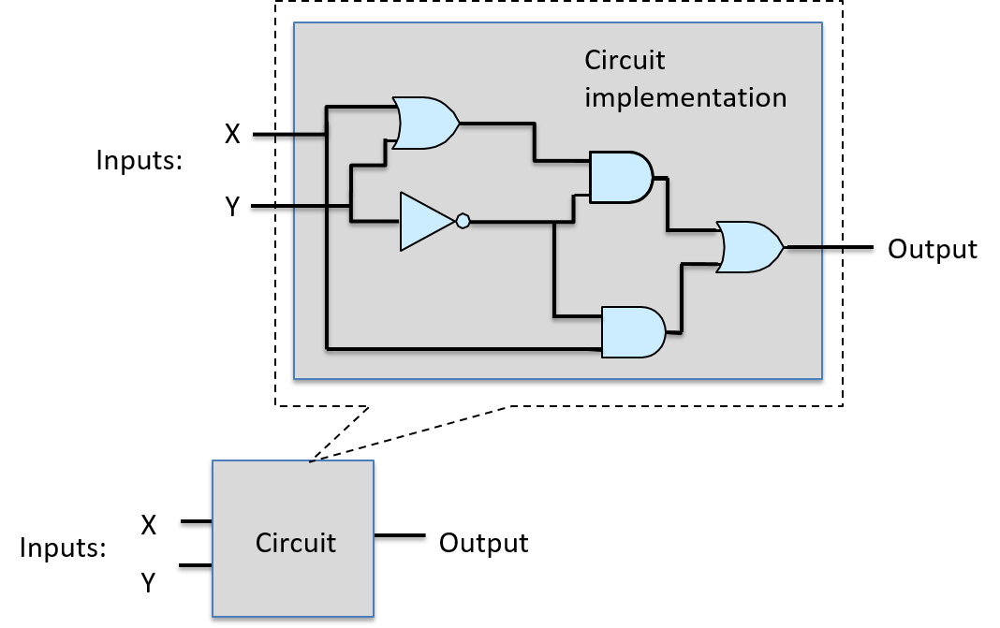

## 5.4. Circuits 

Digital circuits implement core functionality of the architecture. They
implement the **Instruction Set Architecture** (ISA) in hardware, and
also implement storage and control functionality throughout the system.
Designing digital circuits involves applying multiple levels of
abstraction: circuits implementing complex functionality are built from
smaller circuits that implement partial functionality, which are built
from even simpler circuits, and so on down to the basic logic gate
building blocks of all digital circuits. [Figure
1](#Figcircuitabstraction) illustrates a circuit abstracted from its
implementation. The circuit is represented as a *black box* labeled with
its functionality or name and with only its input and output shown,
hiding the details of its internal implementation.

Figure 1. A circuit is implemented by linking together subcircuits and
logic gates. Its functionality is abstracted from the details of its
implementation and can be used as a building block for creating other
circuits.

There are three main categories of circuit building blocks:
arithmetic/logic, control, and storage circuits. A processor integrated
circuit, for example, contains all three types of subcircuits: its
register set uses storage circuits; its core functionality for
implementing arithmetic and logic functions uses arithmetic and logic
circuits; and control circuits are used throughout the processor to
drive the execution of instructions and to control loading and storing
values in its registers.

In this section, we discuss these three types of circuit, showing how to
design a basic circuit from logic gates, and then how to build larger
circuits from basic circuits and logic gates.

-   [Arithmetic / Logic
    Circuits](arithlogiccircs.html#_arithmetic_and_logic_circuits)

-   Control Circuits

-   Storage Circuits

