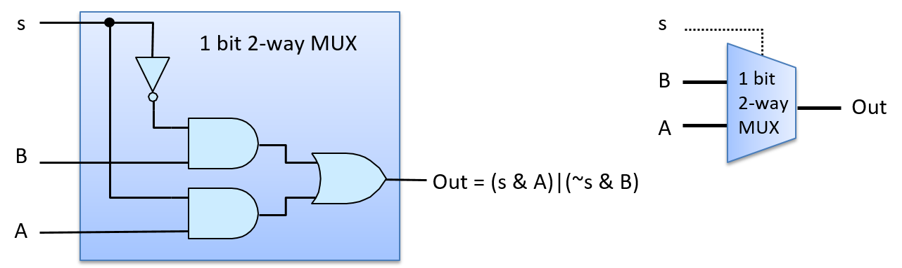
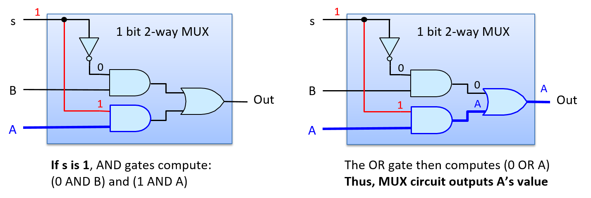
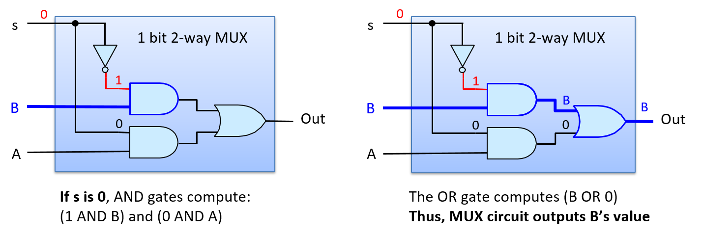
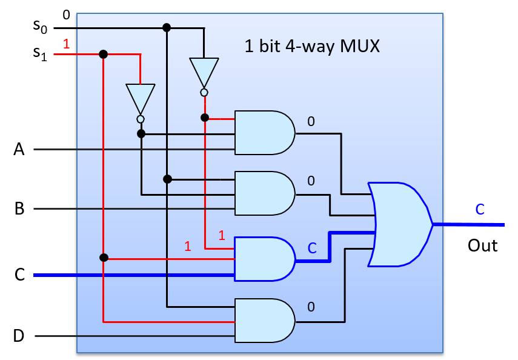
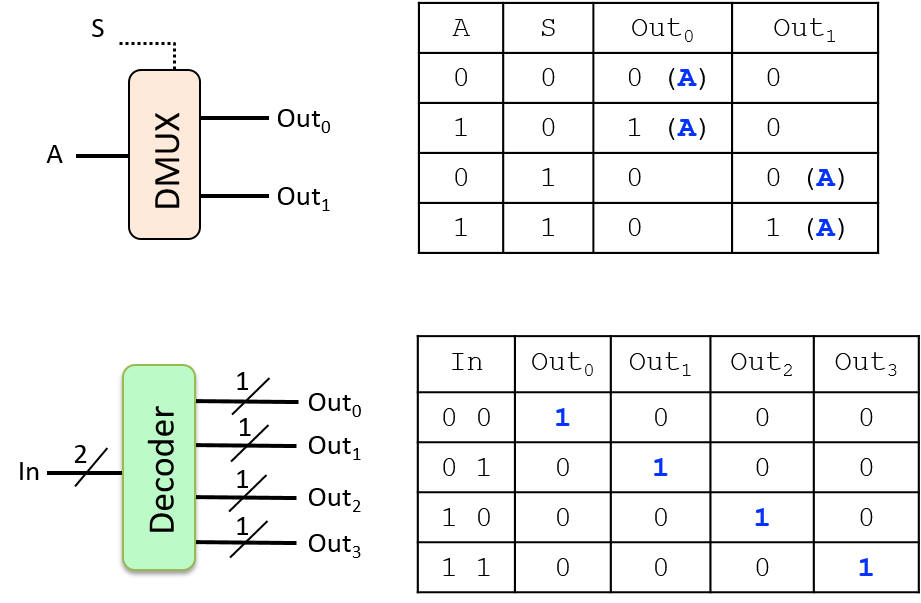

### 5.4.2. Mạch Điều khiển

Mạch điều khiển (control circuits – "mạch điều khiển") được sử dụng xuyên suốt trong toàn bộ hệ thống. Trên bộ xử lý (processor), chúng điều khiển quá trình thực thi các lệnh chương trình trên dữ liệu chương trình. Chúng cũng kiểm soát việc nạp và lưu giá trị giữa các cấp độ lưu trữ khác nhau (giữa các thanh ghi, bộ nhớ đệm cache và RAM), và điều khiển các thiết bị phần cứng trong hệ thống. Tương tự như mạch số học và logic, các mạch điều khiển thực hiện chức năng phức tạp được xây dựng bằng cách kết hợp các mạch đơn giản hơn và các cổng logic.

Một ví dụ về mạch điều khiển là **multiplexer** (MUX – "bộ chọn"), dùng để lựa chọn một trong nhiều giá trị. CPU có thể sử dụng mạch multiplexer để chọn thanh ghi nào trong CPU sẽ được đọc để lấy giá trị toán hạng của một lệnh.

Một multiplexer *N*-ngõ vào có một tập hợp gồm *N* giá trị đầu vào và một đầu ra duy nhất được chọn từ một trong các đầu vào đó. Một đầu vào bổ sung, gọi là **Select** (S – "bit chọn"), code hóa việc chọn đầu vào nào trong số *N* đầu vào để đưa ra đầu ra.

Multiplexer cơ bản nhất là loại hai ngõ vào, chọn giữa hai đầu vào 1-bit, A và B. Đầu vào chọn của multiplexer hai ngõ vào là một bit duy nhất: nếu đầu vào S là 1, nó sẽ chọn A làm đầu ra; nếu S là 0, nó sẽ chọn B làm đầu ra. Bảng chân trị cho multiplexer 1-bit hai ngõ vào được hiển thị bên dưới. Giá trị của bit chọn (S) quyết định chọn giá trị của A hoặc B làm đầu ra của MUX.

| A | B | S | out             |
|---|---|---|-----------------|
| 0 | 0 | 0 | 0 (giá trị của B) |
| 0 | 1 | 0 | 1 (giá trị của B) |
| 1 | 0 | 0 | 0 (giá trị của B) |
| 1 | 1 | 0 | 1 (giá trị của B) |
| 0 | 0 | 1 | 0 (giá trị của A) |
| 0 | 1 | 1 | 0 (giá trị của A) |
| 1 | 0 | 1 | 1 (giá trị của A) |
| 1 | 1 | 1 | 1 (giá trị của A) |

*Bảng 1. Bảng chân trị cho multiplexer 1-bit*

Hình 1 minh họa mạch multiplexer hai ngõ vào cho đầu vào 1-bit.

**Hình 1. Mạch multiplexer 1-bit hai ngõ vào.** Giá trị của tín hiệu đầu vào (S) được dùng để chọn một trong hai đầu vào (A hoặc B) làm đầu ra của mạch: khi S là 1, A được chọn; khi S là 0, B được chọn.

Hình 2 minh họa cách multiplexer chọn đầu ra là A khi đầu vào S có giá trị là 1. Ví dụ, giả sử các giá trị đầu vào là: A = 1, B = 0, và S = 1. S được đảo (NOT) trước khi đưa vào cổng AND phía trên cùng với B (0 AND B), cho ra giá trị đầu ra là 0 từ cổng AND phía trên. S được đưa vào cổng AND phía dưới cùng với A, tạo ra (1 AND A), kết quả là giá trị của A được đưa ra từ cổng AND phía dưới. Giá trị của A (1 trong ví dụ này) và 0 từ cổng AND phía trên được đưa vào cổng OR, tạo ra đầu ra là (0 OR A). Nói cách khác, khi S là 1, MUX chọn giá trị của A làm đầu ra (giá trị A là 1 trong ví dụ). Giá trị của B không ảnh hưởng đến đầu ra cuối cùng của MUX, vì đầu ra của cổng AND phía trên luôn là 0 khi S là 1.

**Hình 2. Mạch multiplexer 1-bit hai ngõ vào chọn (xuất ra) A khi S là 1.**

Hình 3 minh họa đường đi qua multiplexer khi đầu vào S có giá trị là 0 và chọn đầu ra là B. Nếu ta giữ nguyên giá trị đầu vào của A và B như ví dụ trên, nhưng thay đổi S thành 0, thì phép đảo của 0 được đưa vào cổng AND phía trên, tạo ra (1 AND B), tức là giá trị của B được đưa ra từ cổng AND phía trên. Đầu vào của cổng AND phía dưới là (0 AND A), cho ra 0 từ cổng AND phía dưới. Do đó, đầu vào của cổng OR là (B OR 0), kết quả là giá trị của B được chọn làm đầu ra của MUX (giá trị B là 0 trong ví dụ).

**Hình 3. Mạch multiplexer 1-bit hai ngõ vào chọn (xuất ra) B khi S là 0.**

Mạch multiplexer 1-bit hai ngõ vào là một khối xây dựng để tạo ra các mạch multiplexer *N*-bit hai ngõ vào. Ví dụ, Hình 4 minh họa một mạch multiplexer 4-bit hai ngõ vào được xây dựng từ bốn mạch multiplexer 1-bit hai ngõ vào.

**Hình 4. Mạch multiplexer 4-bit hai ngõ vào được xây dựng từ bốn mạch multiplexer 1-bit hai ngõ vào.** Một bit tín hiệu duy nhất, S, được dùng để chọn A hoặc B làm đầu ra.

Một multiplexer *N*-ngõ vào sẽ chọn một trong *N* đầu vào làm đầu ra. Nó yêu cầu một thiết kế mạch MUX hơi khác so với loại hai ngõ vào, và cần log₂(*N*) bit cho đầu vào Select. Các bit chọn bổ sung này là cần thiết vì với log₂(*N*) bit, ta có thể code hóa *N* giá trị khác nhau, mỗi giá trị tương ứng với một lựa chọn trong số *N* đầu vào. Mỗi tổ hợp khác biệt của các bit Select log₂(*N*) được đưa vào cùng với một trong các giá trị đầu vào *N* vào một cổng AND, kết quả là đúng một giá trị đầu vào được chọn làm đầu ra của MUX. Hình 5 minh họa một ví dụ về mạch multiplexer 1-bit bốn ngõ vào.

**Hình 5. Mạch multiplexer bốn ngõ vào có bốn đầu vào và hai bit chọn (log₂(4)) dùng để code hóa đầu vào nào trong số bốn đầu vào sẽ được chọn làm đầu ra.**

Mạch multiplexer bốn ngõ vào sử dụng bốn cổng AND ba ngõ vào và một cổng OR bốn ngõ vào. Các phiên bản cổng nhiều ngõ vào có thể được xây dựng bằng cách nối chuỗi nhiều cổng AND (hoặc OR) hai ngõ vào. Ví dụ, một cổng AND ba ngõ vào được xây dựng từ hai cổng AND hai ngõ vào: cổng AND đầu tiên nhận hai giá trị đầu vào, và cổng AND thứ hai nhận giá trị đầu vào thứ ba cùng với đầu ra từ cổng AND đầu tiên. Biểu thức (x AND y AND z) tương đương với ((x AND y) AND z).

Để hiểu cách mạch multiplexer bốn ngõ vào hoạt động, hãy xét trường hợp đầu vào S có giá trị là 2 (0b10 trong hệ nhị phân), như minh họa trong Hình 6. Cổng AND phía trên nhận đầu vào là (NOT(S₀) AND NOT(S₁) AND A), tức là (1 AND 0 AND A), cho ra đầu ra là 0. Cổng AND thứ hai nhận đầu vào là (0 AND 0 AND B), cho ra 0. Cổng AND thứ ba nhận đầu vào là (1 AND 1 AND C), cho ra giá trị của C. Cổng AND cuối cùng nhận đầu vào là (0 AND 1 AND D), cho ra 0. Cổng OR nhận các đầu vào là (0 OR 0 OR C OR 0), kết quả là giá trị của C được chọn làm đầu ra của MUX (giá trị S bằng 2 chọn C).

**Hình 6. Mạch multiplexer bốn ngõ vào chọn C làm đầu ra khi đầu vào Select, S, là 2 (0b10).**

**Demultiplexer** và **decoder** là hai ví dụ khác về mạch điều khiển.

Một **demultiplexer** (DMUX – "bộ phân phối") là nghịch đảo của multiplexer. Trong khi multiplexer chọn một trong *N* đầu vào, thì demultiplexer chọn một trong *N* đầu ra. Một DMUX nhận một giá trị đầu vào duy nhất và một đầu vào chọn, và có *N* đầu ra. Dựa vào giá trị của S, nó gửi giá trị đầu vào đến đúng một trong số *N* đầu ra (giá trị đầu vào được định tuyến đến một trong *N* đường đầu ra). Mạch DMUX thường được dùng để chọn một trong *N* mạch để truyền giá trị.

Một mạch **decoder** nhận một đầu vào đã được code hóa và kích hoạt một trong nhiều đầu ra dựa trên giá trị đầu vào. Ví dụ, một mạch decoder có đầu vào *N*-bit sẽ sử dụng giá trị đó để kích hoạt (đặt bằng 1) đúng một trong số các đường đầu ra 2^N^ (đường tương ứng với code hóa của giá trị *N*-bit).

[Hình 7](#dmux) minh họa một ví dụ về mạch demultiplexer 1-bit hai ngõ ra, trong đó giá trị đầu vào chọn (s) quyết định đầu ra nào trong hai đầu ra sẽ nhận giá trị đầu vào A. Hình cũng minh họa một ví dụ về mạch decoder 2-bit, trong đó các bit đầu vào xác định đầu ra nào trong bốn đầu ra sẽ được đặt bằng 1. Bảng chân trị của cả hai mạch cũng được hiển thị.

**Hình 7. Mạch demultiplexer 1-bit hai ngõ ra, và mạch decoder 2-bit, cùng với bảng chân trị của chúng.**

