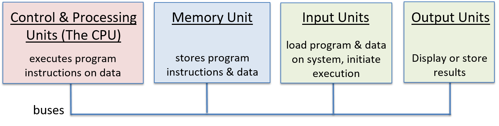
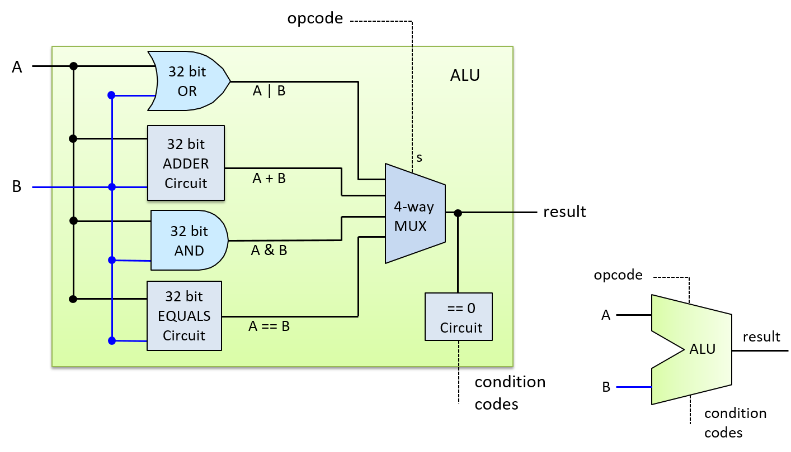
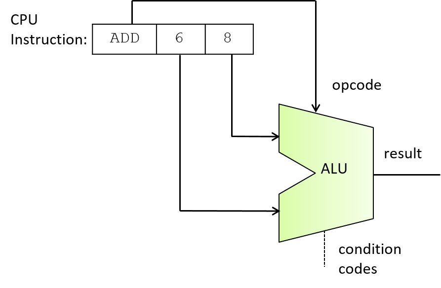
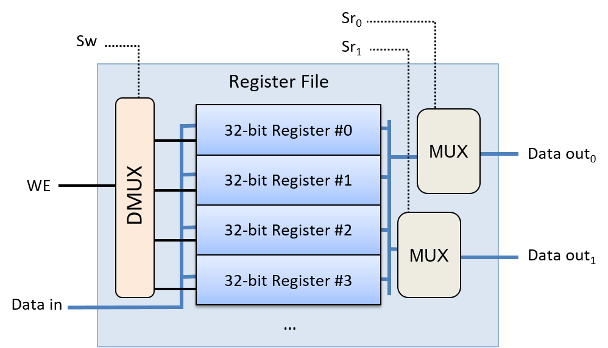

## 5.5. Xây dựng Bộ xử lý: Tổng hợp tất cả thành phần

**Central processing unit** (CPU – "bộ xử lý trung tâm") triển khai các đơn vị xử lý và điều khiển trong kiến trúc von Neumann – là các phần đảm nhiệm việc thực thi các lệnh chương trình trên dữ liệu chương trình (xem [Hình 1](#FigCPUVonNeumann)).



**Hình 1. CPU triển khai các phần xử lý và điều khiển trong kiến trúc von Neumann.**

CPU được xây dựng từ các khối mạch cơ bản: mạch số học/logic, mạch lưu trữ và mạch điều khiển. Các thành phần chức năng chính của nó gồm:

- **Arithmetic logic unit** (ALU – "bộ số học và logic") thực hiện các phép toán số học và logic;
- Một tập hợp các **registers** (thanh ghi) đa dụng để lưu trữ dữ liệu chương trình;
- Một số mạch điều khiển và thanh ghi chuyên dụng dùng trong quá trình thực thi lệnh;
- Và một **clock** (xung nhịp) điều khiển hoạt động của mạch CPU để thực thi các lệnh chương trình.

Trong phần này, ta sẽ trình bày các thành phần chính của CPU, bao gồm ALU và tập thanh ghi, và cách chúng được kết hợp để tạo thành một CPU. Trong phần tiếp theo, ta sẽ tìm hiểu cách CPU thực thi các lệnh chương trình và cách xung nhịp được sử dụng để điều khiển quá trình thực thi.

### 5.5.1. ALU

ALU là một mạch phức tạp thực hiện tất cả các phép toán số học và logic trên số nguyên có dấu và không dấu. Một đơn vị riêng biệt gọi là floating-point unit (đơn vị số thực dấu chấm động) thực hiện các phép toán trên giá trị dấu chấm động. ALU nhận các toán hạng kiểu số nguyên và một giá trị **opcode** (code lệnh – "code thao tác") xác định phép toán cần thực hiện (ví dụ: phép cộng). ALU xuất ra giá trị kết quả của phép toán được chỉ định trên các đầu vào toán hạng, cùng với các giá trị **condition code** (code điều kiện – "code trạng thái") code hóa thông tin về kết quả của phép toán. Các code điều kiện phổ biến cho biết liệu kết quả của ALU có âm, bằng 0 hay có bit tràn (carry-out) hay không.

Ví dụ, với câu lệnh C sau:

```c
x = 6 + 8;
```

CPU bắt đầu thực hiện phép cộng bằng cách đưa các giá trị toán hạng (6 và 8) cùng với các bit code hóa phép cộng ADD vào mạch ALU. ALU tính toán kết quả và xuất ra giá trị đó cùng với các code điều kiện để chỉ ra rằng kết quả là không âm, khác 0 và không gây tràn. Mỗi code điều kiện được code hóa bằng một bit. Bit có giá trị 1 nghĩa là điều kiện đúng, còn bit có giá trị 0 nghĩa là điều kiện không đúng với kết quả của ALU. Trong ví dụ này, mẫu bit 000 biểu thị ba điều kiện liên quan đến phép cộng 6 + 8: kết quả không âm (0), không bằng 0 (0), và không có tràn (0).

Các code điều kiện do ALU thiết lập trong quá trình thực hiện phép toán đôi khi được các lệnh tiếp theo sử dụng để quyết định hành động dựa trên một điều kiện cụ thể. Ví dụ, lệnh ADD có thể tính phần `(x + 8)` trong câu lệnh `if` sau:

```c
if( (x + 8) != 0 ) {
    x++;
}
```

Việc thực thi lệnh ADD bởi ALU sẽ thiết lập các code điều kiện dựa trên kết quả của phép cộng `(x + 8)`. Một lệnh nhảy có điều kiện (conditional jump) được thực thi sau lệnh ADD sẽ kiểm tra các bit code điều kiện do lệnh ADD thiết lập và sẽ nhảy (bỏ qua việc thực thi các lệnh trong thân `if`) hoặc không, tùy theo giá trị của các bit đó. Ví dụ, nếu lệnh ADD thiết lập code điều kiện zero bằng 0, lệnh nhảy có điều kiện sẽ không bỏ qua các lệnh trong thân `if` (0 nghĩa là kết quả của phép cộng không bằng 0). Nếu code điều kiện zero là 1, nó sẽ nhảy qua các lệnh trong thân `if`. Để thực hiện việc nhảy qua một tập hợp lệnh, CPU sẽ ghi địa chỉ bộ nhớ của lệnh đầu tiên sau thân `if` vào **program counter** (PC – "bộ đếm chương trình"), là thanh ghi chứa địa chỉ của lệnh tiếp theo cần thực thi.

Một mạch ALU kết hợp nhiều mạch số học và logic (để thực hiện tập hợp các phép toán của nó) với một mạch multiplexer để chọn đầu ra của ALU. Thay vì chỉ kích hoạt mạch số học tương ứng với phép toán cụ thể, một ALU đơn giản sẽ gửi các giá trị đầu vào toán hạng đến tất cả các mạch số học và logic bên trong. Đầu ra từ tất cả các mạch số học và logic bên trong ALU được đưa vào mạch multiplexer, mạch này sẽ chọn đầu ra của ALU. Đầu vào opcode được dùng làm tín hiệu điều khiển cho multiplexer để chọn phép toán số học/logic nào sẽ được chọn làm đầu ra của ALU. Đầu ra code điều kiện được xác định dựa trên đầu ra của multiplexer kết hợp với mạch kiểm tra giá trị đầu ra để xác định từng bit code điều kiện.

Hình 2 minh họa một mạch ALU ví dụ thực hiện bốn phép toán khác nhau (ADD, OR, AND và EQUALS) trên hai toán hạng 32-bit. Nó cũng tạo ra một code điều kiện duy nhất để chỉ ra liệu kết quả của phép toán có bằng 0 hay không. Lưu ý rằng ALU sử dụng opcode để điều khiển multiplexer nhằm chọn phép toán nào trong bốn phép toán sẽ được xuất ra.




**Hình 2. Một ALU thực hiện bốn phép toán: ADD, OR, AND và EQUALS trên hai toán hạng 32-bit. Nó có một bit đầu ra code điều kiện cho biết kết quả có bằng 0 hay không.**

Đầu vào opcode của ALU được lấy từ các bit trong lệnh mà CPU đang thực thi. Ví dụ, code nhị phân của một lệnh ADD có thể gồm bốn phần:

```
| OPCODE BITS | OPERAND A SOURCE | OPERAND B SOURCE | RESULT DESTINATION |
```

Tùy thuộc vào kiến trúc CPU, các bit nguồn toán hạng có thể code hóa một thanh ghi CPU, địa chỉ bộ nhớ chứa giá trị toán hạng, hoặc giá trị toán hạng trực tiếp. Ví dụ, trong một lệnh thực hiện phép cộng 6 + 8, các giá trị trực tiếp 6 và 8 có thể được code hóa trực tiếp vào các bit chỉ định toán hạng của lệnh.

Với ALU của chúng ta, opcode cần hai bit vì ALU hỗ trợ bốn phép toán, và hai bit có thể code hóa bốn giá trị khác nhau (00, 01, 10, 11), mỗi giá trị tương ứng với một phép toán. Nói chung, một ALU thực hiện *N* phép toán khác nhau sẽ cần log₂(*N*) bit opcode để chỉ định phép toán nào sẽ được xuất ra từ ALU.

Hình 3 minh họa cách các bit opcode và toán hạng của một lệnh ADD được sử dụng làm đầu vào cho ALU.



**Hình 3. Các bit opcode từ một lệnh được ALU sử dụng để chọn phép toán cần xuất ra.** Trong ví dụ này, các bit khác nhau từ một lệnh ADD được đưa vào đầu vào toán hạng và opcode của ALU để thực hiện phép cộng 6 và 8.

### 5.5.2. Register File

Ở đỉnh của hệ phân cấp bộ nhớ, tập hợp các thanh ghi đa dụng của CPU lưu trữ các giá trị tạm thời. CPU chỉ cung cấp một số lượng rất nhỏ thanh ghi, thường là từ 8 đến 32 (ví dụ: kiến trúc IA32 cung cấp 8, MIPS cung cấp 16, và ARM cung cấp 13). Các lệnh thường lấy giá trị toán hạng từ các thanh ghi đa dụng, hoặc lưu kết quả vào đó. Ví dụ, một lệnh ADD có thể được code hóa là *"cộng giá trị từ Register 1 với giá trị từ Register 2 và lưu kết quả vào Register 3"*.

Tập hợp các thanh ghi đa dụng của CPU được tổ chức thành một mạch **register file** ("tập thanh ghi"). Một register file bao gồm một tập các [register circuits](storagecircs.html#_cpu_register) (mạch thanh ghi) để lưu trữ dữ liệu, và một số [control circuits](controlcircs.html#_control_circuits) (mạch điều khiển) để điều khiển việc đọc và ghi vào các thanh ghi. Mạch này thường có một đường dữ liệu đầu vào duy nhất để ghi giá trị vào một thanh ghi, và hai đường dữ liệu đầu ra để đọc đồng thời hai giá trị từ các thanh ghi.

Hình 4 minh họa một ví dụ về mạch register file với bốn thanh ghi. Hai giá trị đầu ra của nó (Data out₀ và Data out₁) được điều khiển bởi hai mạch multiplexer. Mỗi đầu vào chọn đọc (Sr₀ và Sr₁) được đưa vào một trong các MUX để chọn giá trị thanh ghi tương ứng cho đầu ra. Đầu vào dữ liệu của register file (đường Data in) được gửi đến tất cả các mạch thanh ghi, và đầu vào ghi (WE) được đưa qua một mạch demultiplexer (DMUX) trước khi được gửi đến từng mạch thanh ghi. Mạch DMUX nhận một giá trị đầu vào và chọn đầu ra nào trong số *N* đầu ra để gửi giá trị đó, còn lại *N-1* đầu ra sẽ nhận giá trị 0. Đầu vào chọn ghi (Sw) của register file được gửi đến mạch DMUX để chọn thanh ghi đích nhận giá trị WE. Khi giá trị WE của register file là 0, không có giá trị nào được ghi vào thanh ghi vì mỗi bit WE của thanh ghi cũng nhận giá trị 0 (do đó, Data in không ảnh hưởng đến giá trị lưu trong các thanh ghi). Khi bit WE là 1, DMUX sẽ xuất ra bit WE bằng 1 chỉ đến thanh ghi được chỉ định bởi đầu vào chọn ghi (Sw), kết quả là giá trị Data in chỉ được ghi vào đúng thanh ghi được chọn.



**Hình 4. Register file: tập hợp các thanh ghi đa dụng của CPU dùng để lưu trữ toán hạng và giá trị kết quả của lệnh.**

#### Special-Purpose Registers

Ngoài tập hợp các thanh ghi đa dụng trong register file, CPU còn có các thanh ghi chuyên dụng (special-purpose registers) dùng để lưu địa chỉ và nội dung của lệnh. **Program counter** (PC – "bộ đếm chương trình") lưu địa chỉ bộ nhớ của lệnh tiếp theo cần thực thi, và **instruction register** (IR – "thanh ghi lệnh") lưu các bit của lệnh hiện tại đang được CPU thực thi. Các bit của lệnh được lưu trong IR sẽ được sử dụng làm đầu vào cho các phần khác nhau của CPU trong quá trình thực thi lệnh. Ta sẽ thảo luận chi tiết hơn về các thanh ghi này trong phần tiếp theo về [instruction execution](instrexec.html#_the_processors_execution_of_program_instructions) (thực thi lệnh của bộ xử lý).

### 5.5.3. CPU

Với các mạch ALU và register file, ta có thể xây dựng các thành phần chính của CPU như minh họa trong Hình 5. Vì toán hạng của lệnh thường được lấy từ các giá trị lưu trong thanh ghi đa dụng, đầu ra của register file sẽ được gửi đến đầu vào của ALU. Tương tự, vì kết quả của lệnh thường được lưu vào thanh ghi, đầu ra kết quả của ALU sẽ được gửi làm đầu vào cho register file. CPU còn có thêm các mạch để truyền dữ liệu giữa ALU, register file và các thành phần khác (ví dụ: bộ nhớ chính).


**Hình 5. ALU và register file tạo thành các thành phần chính của CPU.** ALU thực hiện các phép toán, còn register file lưu trữ toán hạng và giá trị kết quả. Các thanh ghi chuyên dụng bổ sung lưu địa chỉ lệnh (PC) và nội dung lệnh (IR). Lưu ý rằng lệnh có thể lấy toán hạng từ hoặc lưu kết quả vào các vị trí khác ngoài register file (ví dụ: bộ nhớ chính).

Các thành phần chính này của CPU tạo thành **data path** ("đường dữ liệu"). Data path bao gồm các phần của CPU thực hiện các phép toán số học và logic (ALU), lưu trữ dữ liệu (các thanh ghi), và các bus kết nối các phần này. CPU cũng triển khai một **control path** ("đường điều khiển") để điều khiển quá trình thực thi lệnh chương trình bởi ALU trên các toán hạng lưu trong register file. Ngoài ra, control path còn phát lệnh đến các thiết bị I/O và điều phối truy cập bộ nhớ theo yêu cầu của lệnh. Ví dụ, một số lệnh có thể lấy toán hạng trực tiếp từ (hoặc lưu kết quả trực tiếp vào) các vị trí bộ nhớ thay vì từ các thanh ghi đa dụng. Trong phần tiếp theo, ta sẽ tập trung thảo luận về việc thực thi lệnh của CPU với các lệnh lấy toán hạng và lưu kết quả vào register file. CPU cần thêm mạch điều khiển để đọc toán hạng hoặc ghi kết quả lệnh vào các vị trí khác, nhưng các bước thực thi lệnh chính vẫn giống nhau bất kể nguồn và đích của dữ liệu.