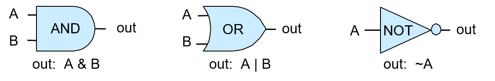
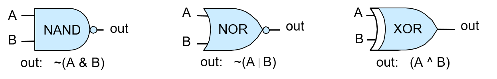

## 5.3. Cổng Logic

**Logic gates** (cổng logic) là các khối xây dựng cơ bản của mạch số dùng để triển khai các chức năng số học, điều khiển và lưu trữ trong máy tính số. Việc thiết kế các mạch số phức tạp đòi hỏi mức độ trừu tượng cao: người thiết kế tạo ra các mạch đơn giản thực hiện chức năng cơ bản từ một tập nhỏ các cổng logic cơ bản; các mạch đơn giản này, sau khi được trừu tượng hóa khỏi phần triển khai chi tiết, sẽ được dùng làm khối xây dựng để tạo ra các mạch phức tạp hơn (các mạch đơn giản được kết hợp lại để tạo ra mạch mới có chức năng phức tạp hơn); các mạch phức tạp hơn này lại có thể được trừu tượng hóa tiếp và dùng làm khối xây dựng cho các chức năng phức tạp hơn nữa; và cứ thế tiếp tục để xây dựng nên các thành phần xử lý, lưu trữ và điều khiển hoàn chỉnh của một bộ xử lý.

> Transistors

Các cổng logic được tạo ra từ các transistor được khắc lên vật liệu bán dẫn (ví dụ: chip silicon). Transistor hoạt động như công tắc điều khiển dòng điện chạy qua chip. Một transistor có thể chuyển trạng thái giữa bật và tắt (tương ứng với đầu ra điện áp cao hoặc thấp). Trạng thái đầu ra của nó phụ thuộc vào trạng thái hiện tại và trạng thái đầu vào (điện áp cao hoặc thấp). Các giá trị nhị phân được code hóa bằng điện áp cao (1) và thấp (0), và các cổng logic được triển khai bằng cách sắp xếp một số transistor để thực hiện hành động chuyển mạch trên các đầu vào nhằm tạo ra đầu ra của cổng logic. Số lượng transistor có thể đặt trên một mạch tích hợp (chip) là một chỉ số sơ bộ về sức mạnh của nó; càng nhiều transistor trên mỗi chip thì càng có nhiều khối xây dựng để triển khai nhiều chức năng hoặc lưu trữ hơn.

### 5.3.1. Cổng Logic Cơ Bản

Ở cấp độ thấp nhất, tất cả các mạch đều được xây dựng bằng cách liên kết các cổng logic với nhau. Cổng logic thực hiện các phép toán boolean trên các toán hạng boolean (0 hoặc 1). Bộ ba cổng **AND**, **OR** và **NOT** tạo thành một tập đầy đủ các cổng logic từ đó có thể xây dựng bất kỳ mạch nào. Một cổng logic nhận một (NOT) hoặc hai (AND và OR) giá trị đầu vào nhị phân và tạo ra một giá trị đầu ra nhị phân là kết quả của phép toán logic từng bit trên đầu vào. Ví dụ, đầu vào 0 vào cổng NOT sẽ cho ra 1 (1 là NOT(0)). Một **truth table** (bảng chân trị – "bảng giá trị logic") của một phép toán logic liệt kê giá trị kết quả của phép toán với từng tổ hợp đầu vào. Bảng 1 dưới đây trình bày bảng chân trị của các cổng logic AND, OR và NOT.

| A | B | A AND B | A OR B | NOT A |
|---|---|----------|---------|--------|
| 0 | 0 | 0        | 0       | 1      |
| 0 | 1 | 0        | 1       | 1      |
| 1 | 0 | 0        | 1       | 0      |
| 1 | 1 | 1        | 1       | 0      |

: Bảng 1. Bảng chân trị cho các phép toán logic cơ bản.

Hình 1 minh họa cách các kiến trúc sư máy tính biểu diễn các cổng logic này trong sơ đồ mạch.

**Hình 1. Các cổng logic AND, OR và NOT với đầu vào 1-bit tạo ra đầu ra 1-bit.**

Phiên bản nhiều bit của một cổng logic (với đầu vào và đầu ra *M*-bit) là một mạch rất đơn giản được xây dựng từ *M* cổng logic 1-bit. Mỗi bit riêng lẻ trong giá trị đầu vào *M*-bit được đưa vào một cổng logic 1-bit khác nhau, và mỗi cổng sẽ tạo ra bit đầu ra tương ứng trong kết quả *M*-bit. Ví dụ, Hình 2 minh họa một mạch AND 4-bit được xây dựng từ bốn cổng AND 1-bit.

**Hình 2. Mạch AND 4-bit được xây dựng từ bốn cổng AND 1-bit.**

Loại mạch đơn giản này – chỉ mở rộng độ rộng bit của đầu vào và đầu ra cho một cổng logic – thường được gọi là cổng *M*-bit, với *M* là số bit đầu vào và đầu ra.

### 5.3.2. Các Cổng Logic Khác

Mặc dù tập hợp các cổng logic gồm AND, OR và NOT là đủ để triển khai bất kỳ mạch nào, vẫn có một số cổng logic cơ bản khác thường được sử dụng trong thiết kế mạch số. Các cổng bổ sung này bao gồm:

- **NAND** (phủ định của A AND B),
- **NOR** (phủ định của A OR B),
- **XOR** (exclusive OR – "hoặc độc quyền").

Bảng chân trị của các cổng này được trình bày trong Bảng 2.

| A | B | A NAND B | A NOR B | A XOR B |
|---|---|-----------|----------|----------|
| 0 | 0 | 1         | 1        | 0        |
| 0 | 1 | 1         | 0        | 1        |
| 1 | 0 | 1         | 0        | 1        |
| 1 | 1 | 0         | 0        | 0        |

: Bảng 2. Bảng chân trị của các cổng NAND, NOR và XOR.

Các cổng NAND, NOR và XOR thường xuất hiện trong sơ đồ mạch, như minh họa trong Hình 3.

**Hình 3. Các cổng logic NAND, NOR và XOR.**

Vòng tròn ở cuối các cổng NAND và NOR biểu thị phép phủ định hoặc NOT. Ví dụ, cổng NOR trông giống như cổng OR với một vòng tròn ở cuối, biểu thị rằng NOR là phủ định của OR.

> Tập hợp tối thiểu của các cổng logic

Các cổng NAND, NOR và XOR không bắt buộc phải có để xây dựng mạch, nhưng chúng là các cổng bổ sung được thêm vào tập {AND, OR, NOT} và thường được sử dụng trong thiết kế mạch. Bất kỳ cổng nào trong số này đều có thể được triển khai từ transistor (khối xây dựng của cổng logic), hoặc từ tổ hợp các cổng logic khác.

Trong tập hợp mở rộng {AND, OR, NOT, NAND, NOR, XOR}, tồn tại một số tập con tối thiểu đủ để xây dựng bất kỳ mạch nào. Ví dụ, tập con {AND, NOT} là một tập tối thiểu: biểu thức (A OR B) tương đương với NOT(NOT(A) AND NOT(B)). Tuy nhiên, thay vì sử dụng tập tối thiểu, ta sử dụng tập {AND, OR, NOT} vì đây là tập dễ hiểu nhất.

Vì NAND, NOR và XOR không bắt buộc, nên chức năng của chúng có thể được triển khai bằng cách kết hợp các cổng AND, OR và NOT để tạo thành các mạch thực hiện chức năng tương ứng. Ví dụ, NOR có thể được xây dựng bằng cách kết hợp một cổng OR và một cổng NOT: `(A NOR B) ≡ NOT(A OR B)`, như minh họa trong Hình 4.

**Hình 4. Cổng NOR có thể được triển khai bằng cách kết hợp một cổng OR và một cổng NOT.** Các đầu vào A và B được đưa qua cổng OR, và đầu ra của cổng OR được đưa vào cổng NOT (NOR là phủ định của OR).

Các chip mạch tích hợp hiện đại ngày nay được xây dựng bằng công nghệ CMOS, trong đó cổng NAND được sử dụng làm khối xây dựng cơ bản của các mạch trên chip. Cổng NAND tự nó tạo thành một tập hợp tối thiểu khác của các cổng logic đầy đủ.