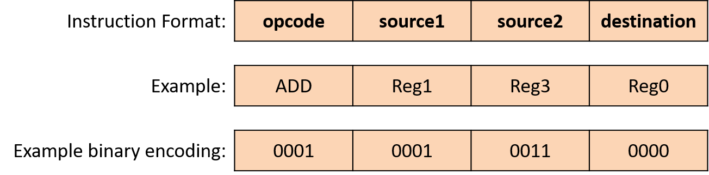
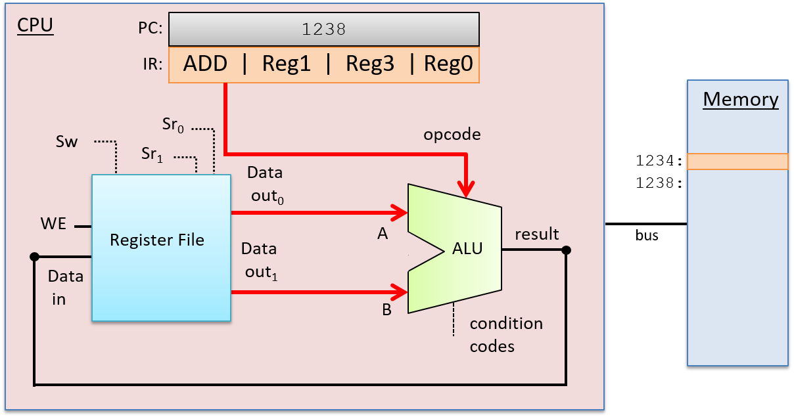
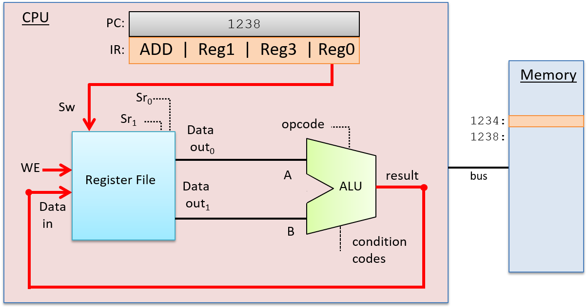
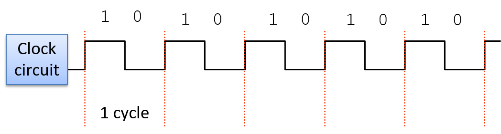
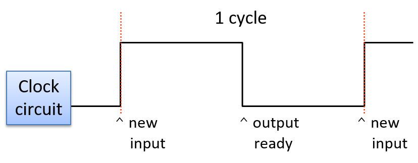
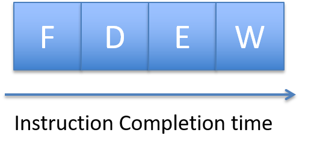

Dưới đây là bản dịch tiếng Việt của mục **5.6. The Processor's Execution of Program Instructions**, tuân thủ đầy đủ các quy tắc bạn đã đề ra:

---

## 5.6. Quá trình thực thi lệnh chương trình của bộ xử lý

Việc thực thi lệnh được thực hiện qua nhiều giai đoạn. Các kiến trúc khác nhau có thể triển khai số lượng giai đoạn khác nhau, nhưng hầu hết đều triển khai các pha Fetch, Decode, Execute và WriteBack trong ít nhất bốn giai đoạn riêng biệt. Trong phần thảo luận về quá trình thực thi lệnh, ta sẽ tập trung vào bốn giai đoạn này và sử dụng một lệnh ADD làm ví dụ minh họa. Lệnh ADD ví dụ được mã hóa như minh họa trong Hình 1.

**Hình 1. Một ví dụ về định dạng lệnh cho phép toán ba thanh ghi.**  
Lệnh được mã hóa dưới dạng nhị phân, với các nhóm bit con tương ứng với các phần khác nhau của lệnh: phép toán (opcode), hai thanh ghi nguồn (toán hạng), và thanh ghi đích để lưu kết quả phép toán. Ví dụ minh họa cách mã hóa một lệnh ADD theo định dạng này.

---

Để thực thi một lệnh, CPU đầu tiên sẽ *fetch* (nạp) lệnh tiếp theo từ bộ nhớ vào một thanh ghi chuyên dụng gọi là instruction register (IR – "thanh ghi lệnh"). Địa chỉ bộ nhớ của lệnh cần nạp được lưu trong một thanh ghi chuyên dụng khác gọi là program counter (PC – "bộ đếm chương trình"). PC theo dõi địa chỉ bộ nhớ của lệnh tiếp theo cần nạp và được tăng lên như một phần của giai đoạn fetch, để nó lưu địa chỉ của lệnh kế tiếp. Ví dụ, nếu tất cả lệnh đều dài 32 bit, thì giá trị của PC sẽ được tăng thêm 4 (vì mỗi byte = 8 bit có địa chỉ riêng) để lưu địa chỉ bộ nhớ của lệnh ngay sau lệnh vừa được nạp. Các mạch số học riêng biệt với ALU sẽ thực hiện việc tăng giá trị của PC. Giá trị của PC cũng có thể thay đổi trong giai đoạn WriteBack. Ví dụ, một số lệnh sẽ nhảy đến địa chỉ cụ thể, như trong các vòng lặp, cấu trúc `if`-`else`, hoặc lời gọi hàm. [Hình 2](#Figfetchstage) minh họa giai đoạn fetch.

**Hình 2. Giai đoạn Fetch trong quá trình thực thi lệnh:**  
Lệnh tại địa chỉ bộ nhớ được lưu trong thanh ghi PC sẽ được đọc từ bộ nhớ và lưu vào IR. Giá trị của PC cũng được tăng lên ở cuối giai đoạn này (nếu mỗi lệnh dài 4 byte thì địa chỉ tiếp theo là 1238; kích thước thực tế của lệnh phụ thuộc vào kiến trúc và loại lệnh).

---

Sau khi nạp lệnh, CPU sẽ *decode* (giải mã) các bit lệnh được lưu trong IR thành bốn phần: các bit cao của lệnh mã hóa opcode, xác định phép toán cần thực hiện (ví dụ: ADD, SUB, OR, ...), và các bit còn lại được chia thành ba nhóm con để chỉ định hai nguồn toán hạng và vị trí lưu kết quả. Trong ví dụ này, ta sử dụng các thanh ghi cho cả hai nguồn và đích kết quả. Opcode được truyền qua các dây dẫn đến đầu vào của ALU, và các bit nguồn được truyền đến đầu vào của register file. Các bit nguồn được gửi đến hai đầu vào chọn đọc (Sr₀ và Sr₁), xác định giá trị thanh ghi nào sẽ được đọc từ register file. Giai đoạn Decode được minh họa trong Hình 3.

**Hình 3. Giai đoạn Decode trong quá trình thực thi lệnh:**  
Tách các bit lệnh trong IR thành các thành phần và truyền chúng làm đầu vào cho ALU và register file. Các bit opcode trong IR được gửi đến đầu vào chọn của ALU để chọn phép toán cần thực hiện. Hai nhóm bit toán hạng trong IR được gửi đến đầu vào chọn của register file để chọn các thanh ghi cần đọc giá trị toán hạng. Các bit đích trong IR sẽ được gửi đến register file trong giai đoạn WriteBack, xác định thanh ghi cần ghi kết quả từ ALU.

---

Sau khi giai đoạn Decode xác định được phép toán cần thực hiện và nguồn toán hạng, ALU sẽ thực hiện phép toán đó trong giai đoạn tiếp theo – *Execution*. Đầu vào dữ liệu của ALU đến từ hai đầu ra của register file, và đầu vào chọn của ALU đến từ các bit opcode của lệnh. Các đầu vào này được truyền qua ALU để tạo ra kết quả bằng cách kết hợp các giá trị toán hạng với phép toán. Trong ví dụ này, ALU sẽ xuất ra kết quả của phép cộng giữa giá trị lưu trong Reg1 và giá trị lưu trong Reg3, đồng thời xuất ra các mã điều kiện liên quan đến kết quả. Giai đoạn Execution được minh họa trong Hình 4.

**Hình 4. Giai đoạn Execution trong quá trình thực thi lệnh:**  
ALU thực hiện phép toán được chỉ định (từ các bit opcode của lệnh) trên các giá trị đầu vào (từ đầu ra của register file).

---

Trong giai đoạn *WriteBack*, kết quả từ ALU sẽ được lưu vào thanh ghi đích. Register file nhận đầu ra kết quả của ALU qua đầu vào Data in, thanh ghi đích (từ các bit lệnh trong IR) qua đầu vào chọn ghi (Sw), và giá trị 1 ở đầu vào WE. Ví dụ, nếu thanh ghi đích là Reg0, thì các bit mã hóa Reg0 trong IR sẽ được gửi đến đầu vào Sw của register file để chọn thanh ghi đích. Đầu ra từ ALU được gửi đến đầu vào Data in của register file, và bit WE được đặt bằng 1 để cho phép ghi kết quả từ ALU vào Reg0. Giai đoạn WriteBack được minh họa trong [Hình 5](#Figrbstage).

**Hình 5. Giai đoạn WriteBack trong quá trình thực thi lệnh:**  
Kết quả từ giai đoạn thực thi (đầu ra từ ALU) được ghi vào thanh ghi đích trong register file. Đầu ra của ALU là đầu vào Data in của register file, các bit đích của lệnh được gửi đến đầu vào chọn ghi (Sw), và đầu vào WE được đặt bằng 1 để cho phép ghi giá trị Data in vào thanh ghi đích được chỉ định.

### 5.6.1. Clock-Driven Execution 

A clock drives the CPU's execution of instructions, triggering the start
of each stage. In other words, the clock is used by the CPU to determine
when inputs to circuits associated with each stage are ready to be used
by the circuit, and it controls when outputs from circuits represent
valid results from one stage and can be used as inputs to other circuits
executing the next stage.

A CPU clock measures discrete time as opposed to continuous time. In
other words, there exists a time 0, followed by a time 1, followed by a
time 2, and so on for each subsequent clock tick. A processor's **clock
cycle time** measures the time between each clock tick. A processor's
**clock speed** (or **clock rate**) is `1/(clock cycle time)`. It is
typically measured in megahertz (MHz) or gigahertz (GHz). A 1-MHz clock
rate has one million clock ticks per second, and 1-GHz has one billion
clock ticks per second. The clock rate is a measure of how fast the CPU
can run, and is an estimate of the maximum number of instructions per
second a CPU can execute. For example, on simple scalar processors like
our example CPU, a 2-GHz processor might achieve a maximum instruction
execution rate of two billion instructions per second (or two
instructions every nanosecond).

Although increasing the clock rate on a single machine will improve its
performance, clock rate alone is not a meaningful metric for comparing
the performance of different processors. For example, some architectures
(such as RISC) require fewer stages to execute instructions than others
(such as CISC). In architectures with fewer execution stages a slower
clock may yield the same number of instructions completed per second as
on another architecture with a faster clock rate but more execution
stages. For a specific microprocessor, however, doubling its clock speed
will roughly double its instruction execution speed.

>> Clock Rates and Processor Performance

Historically, increasing the clock rate (along with designing more
complicated and powerful microarchitectures that a faster clock can
drive) has been a very effective way for computer architects to improve
processor performance. For example, in 1974, the Intel 8080 CPU ran at 2
MHz (a clock rate of two million cycles per second). The clock rate of
the Intel Pentium Pro, introduced in 1995, was 150 MHz (150 million
cycles per second), and the clock rate of the Intel Pentium 4,
introduced in 2000, was 1.3 GHz or (1.3 *billion* cycles per second).
Clock rates peaked in the mid to late 2000s with processors like the IBM
z10, which had a clock rate of 4.4 GHz.

Today, however, CPU clock rates have reached their limit due to problems
associated with handling heat dissipation of faster clocks. This limit
is known as the **power wall**. The power wall resulted in the
development of multicore processors starting in the mid 2000s. Multicore
processors have multiple \"simple\" CPU cores per chip, each core driven
by a clock whose rate has not increased from the previous-generation
core. Multicore processor design is a way to improve CPU performance
without having to increase the CPU clock rate.

#### The Clock Circuit 

A clock circuit uses an oscillator circuit to generate a very precise
and regular pulse pattern. Typically, a crystal oscillator generates the
base frequency of the oscillator circuit, and the pulse pattern of the
oscillator is used by the clock circuit to output a pattern of
alternating high and low voltages corresponding to an alternating
pattern of 1 and 0 binary values. Figure 6 shows an
example clock circuit generating a regular output pattern of 1 and 0.

Figure 6. The regular output pattern of 1 and 0 of a clock circuit. Each
sequence of 1 and 0 makes up a clock cycle.

A **clock cycle** (or tick) is a 1 and 0 subsequence from the clock
circuit pattern. The transition from a 1 to a 0 or a 0 to a 1 is called
a **clock edge**. Clock edges trigger state changes in CPU circuits,
driving the execution of instructions. The rising clock edge (the
transition from 0 to 1 at the beginning of a new clock cycle) indicates
a state in which input values are ready for a stage of instruction
execution. For example, the rising edge transition signals that input
values to the ALU circuit are ready. While the clock's value is 1, these
inputs propagate through the circuit until the output of the circuit is
ready. This is called the **propagation delay** through the circuit. For
example, while the clock signal is 1 the input values to the ALU
propagate through the ALU operation circuits and then through the
multiplexer to produce the correct output from the ALU for the operation
combining the input values. On the falling edge (the transition from 1
to 0), the outputs of the stage are stable and ready to be propagated to
the next location (shown as \"output ready\" in [Figure
7](#Figrisingedge)). For example, the output from the ALU is ready on
the falling edge. For the duration of the clock value 0, the ALU's
output propagates to register file inputs. On the next clock cycle the
rising edge indicates that the register file input value is ready to
write into a register (shown as \"new input\" in [Figure
7](#Figrisingedge)).

Figure 7. The rising edge of a new clock cycle triggers changes in the
inputs to the circuits it controls. The falling edge triggers when the
outputs are valid from the circuits it controls.

Dưới đây là bản dịch tiếng Việt của mục **5.6.1. Clock-Driven Execution**, tuân thủ đầy đủ các quy tắc bạn đã đề ra:

---

### 5.6.1. Thực thi điều khiển bằng xung nhịp

Một xung nhịp (clock) điều khiển quá trình thực thi lệnh của CPU, kích hoạt điểm bắt đầu của mỗi giai đoạn. Nói cách khác, xung nhịp được CPU sử dụng để xác định khi nào các đầu vào của mạch ở mỗi giai đoạn đã sẵn sàng để được xử lý, và nó kiểm soát thời điểm đầu ra từ các mạch là kết quả hợp lệ từ một giai đoạn và có thể được sử dụng làm đầu vào cho các mạch thực thi giai đoạn tiếp theo.

Xung nhịp của CPU đo thời gian rời rạc thay vì liên tục. Tức là tồn tại thời điểm 0, sau đó là thời điểm 1, rồi thời điểm 2, và cứ thế tiếp tục với mỗi nhịp xung tiếp theo. **Clock cycle time** (thời gian chu kỳ xung nhịp) của bộ xử lý đo khoảng thời gian giữa hai nhịp xung liên tiếp. **Clock speed** (tốc độ xung nhịp) hay **clock rate** (tần số xung nhịp) của bộ xử lý được tính bằng công thức `1 / (clock cycle time)`. Đơn vị đo phổ biến là megahertz (MHz) hoặc gigahertz (GHz). Tần số 1 MHz tương ứng với một triệu nhịp xung mỗi giây, còn 1 GHz là một tỷ nhịp xung mỗi giây. Tần số xung nhịp là thước đo tốc độ chạy của CPU, và là ước lượng số lệnh tối đa mà CPU có thể thực thi mỗi giây. Ví dụ, với bộ xử lý đơn giản kiểu scalar như CPU ví dụ của chúng ta, một CPU 2 GHz có thể đạt tốc độ thực thi tối đa là hai tỷ lệnh mỗi giây (tức là hai lệnh mỗi nanosecond).

Mặc dù việc tăng tần số xung nhịp trên một máy đơn lẻ sẽ cải thiện hiệu năng của nó, nhưng tần số xung nhịp không phải là chỉ số có ý nghĩa khi so sánh hiệu năng giữa các bộ xử lý khác nhau. Ví dụ, một số kiến trúc (như RISC) yêu cầu ít giai đoạn thực thi hơn so với các kiến trúc khác (như CISC). Trong các kiến trúc có ít giai đoạn thực thi hơn, một xung nhịp chậm hơn vẫn có thể hoàn thành số lượng lệnh mỗi giây tương đương với kiến trúc khác có xung nhịp nhanh hơn nhưng nhiều giai đoạn hơn. Tuy nhiên, với một vi xử lý cụ thể, nếu tăng gấp đôi tần số xung nhịp thì tốc độ thực thi lệnh cũng sẽ tăng gần gấp đôi.

> Tần số xung nhịp và hiệu năng bộ xử lý

Trong lịch sử, việc tăng tần số xung nhịp (kết hợp với thiết kế các vi kiến trúc phức tạp và mạnh mẽ hơn để tận dụng xung nhịp nhanh hơn) là một cách rất hiệu quả để các kiến trúc sư máy tính cải thiện hiệu năng bộ xử lý. Ví dụ, vào năm 1974, CPU Intel 8080 chạy ở tần số 2 MHz (hai triệu chu kỳ mỗi giây). CPU Intel Pentium Pro ra mắt năm 1995 có tần số 150 MHz (150 triệu chu kỳ mỗi giây), và CPU Intel Pentium 4 ra mắt năm 2000 có tần số 1.3 GHz (tức là 1.3 *tỷ* chu kỳ mỗi giây). Tần số xung nhịp đạt đỉnh vào giữa đến cuối những năm 2000 với các bộ xử lý như IBM z10, có tần số 4.4 GHz.

Tuy nhiên, ngày nay tần số xung nhịp của CPU đã chạm đến giới hạn do các vấn đề liên quan đến việc tản nhiệt khi xung nhịp tăng cao. Giới hạn này được gọi là **power wall** ("bức tường năng lượng"). Power wall đã dẫn đến sự phát triển của các bộ xử lý đa nhân (multicore) bắt đầu từ giữa những năm 2000. Bộ xử lý đa nhân có nhiều nhân CPU “đơn giản” trên mỗi chip, mỗi nhân được điều khiển bởi một xung nhịp có tần số không tăng so với thế hệ trước. Thiết kế bộ xử lý đa nhân là một cách để cải thiện hiệu năng CPU mà không cần tăng tần số xung nhịp.

---

#### Mạch xung nhịp

Một mạch xung nhịp sử dụng mạch dao động (oscillator) để tạo ra chuỗi xung rất chính xác và đều đặn. Thông thường, một mạch dao động tinh thể (crystal oscillator) tạo ra tần số cơ bản của mạch dao động, và chuỗi xung của mạch dao động được mạch xung nhịp sử dụng để tạo ra chuỗi điện áp cao và thấp luân phiên, tương ứng với chuỗi giá trị nhị phân 1 và 0. Hình 6 minh họa một mạch xung nhịp tạo ra chuỗi đầu ra đều đặn gồm 1 và 0.

**Hình 6. Chuỗi đầu ra đều đặn gồm 1 và 0 của mạch xung nhịp.**  
Mỗi chuỗi 1 và 0 tạo thành một chu kỳ xung nhịp.

Một **clock cycle** (chu kỳ xung nhịp, hay tick) là một chuỗi con gồm 1 và 0 từ chuỗi mạch xung nhịp. Việc chuyển từ 1 sang 0 hoặc từ 0 sang 1 được gọi là **clock edge** (cạnh xung nhịp). Các cạnh xung nhịp kích hoạt sự thay đổi trạng thái trong các mạch của CPU, điều khiển quá trình thực thi lệnh. Cạnh xung nhịp lên (rising edge – chuyển từ 0 sang 1 ở đầu chu kỳ mới) biểu thị trạng thái mà các giá trị đầu vào đã sẵn sàng cho một giai đoạn thực thi lệnh. Ví dụ, cạnh lên báo hiệu rằng các giá trị đầu vào cho mạch ALU đã sẵn sàng. Trong khi giá trị xung nhịp là 1, các đầu vào này sẽ truyền qua mạch cho đến khi đầu ra của mạch sẵn sàng. Quá trình này gọi là **propagation delay** (độ trễ lan truyền) qua mạch. Ví dụ, khi tín hiệu xung nhịp là 1, các giá trị đầu vào sẽ truyền qua mạch thực hiện phép toán của ALU, sau đó qua multiplexer để tạo ra đầu ra chính xác từ ALU cho phép toán kết hợp các giá trị đầu vào. Ở cạnh xuống (falling edge – chuyển từ 1 sang 0), đầu ra của giai đoạn sẽ ổn định và sẵn sàng truyền đến vị trí tiếp theo (được biểu thị là “output ready” trong [Hình 7](#Figrisingedge)). Ví dụ, đầu ra từ ALU sẽ sẵn sàng ở cạnh xuống. Trong khoảng thời gian xung nhịp có giá trị 0, đầu ra của ALU sẽ truyền đến đầu vào của register file. Ở chu kỳ xung nhịp tiếp theo, cạnh lên sẽ báo hiệu rằng giá trị đầu vào của register file đã sẵn sàng để ghi vào thanh ghi (biểu thị là “new input” trong [Hình 7](#Figrisingedge)).

**Hình 7. Cạnh lên của chu kỳ xung nhịp mới kích hoạt thay đổi ở đầu vào của các mạch mà nó điều khiển.**  
Cạnh xuống kích hoạt thời điểm đầu ra từ các mạch trở nên hợp lệ.

Độ dài của chu kỳ xung nhịp (hoặc tần số xung nhịp) bị giới hạn bởi độ trễ lan truyền dài nhất qua bất kỳ giai đoạn nào trong quá trình thực thi lệnh. Giai đoạn thực thi và quá trình lan truyền qua ALU thường là giai đoạn dài nhất. Do đó, một nửa thời gian chu kỳ xung nhịp không được nhanh hơn thời gian cần thiết để các giá trị đầu vào của ALU truyền qua mạch thực hiện phép toán chậm nhất để đến đầu ra của ALU (nói cách khác, đầu ra phản ánh kết quả của phép toán trên đầu vào). Ví dụ, trong ALU có bốn phép toán (OR, ADD, AND và EQUALS), mạch ripple carry adder có độ trễ lan truyền dài nhất và quyết định độ dài tối thiểu của chu kỳ xung nhịp.

Vì cần một chu kỳ xung nhịp để hoàn thành một giai đoạn trong quá trình thực thi lệnh của CPU, một bộ xử lý có chuỗi thực thi lệnh gồm bốn giai đoạn (Fetch, Decode, Execute, WriteBack; xem [Hình 8](#Fig4cycleinstr)) sẽ hoàn thành tối đa một lệnh sau mỗi bốn chu kỳ xung nhịp.

**Hình 8. Thực thi lệnh gồm bốn giai đoạn cần bốn chu kỳ xung nhịp để hoàn tất.**

Ví dụ, nếu tần số xung nhịp là 1 GHz, thì một lệnh mất 4 nanosecond để hoàn thành (mỗi giai đoạn mất 1 nanosecond). Với tần số 2 GHz, một lệnh chỉ mất 2 nanosecond để hoàn thành.

Mặc dù tần số xung nhịp là một yếu tố ảnh hưởng đến hiệu năng của bộ xử lý, nhưng bản thân nó không phải là thước đo có ý nghĩa để đánh giá hiệu năng. Thay vào đó, số chu kỳ trung bình trên mỗi lệnh (**cycles per instruction**, viết tắt là CPI) được đo trên toàn bộ quá trình thực thi của chương trình là thước đo tốt hơn cho hiệu năng của CPU. Thông thường, một bộ xử lý không thể duy trì CPI tối đa trong suốt quá trình thực thi chương trình. CPI thấp hơn mức tối đa là kết quả của nhiều yếu tố, bao gồm việc thực thi các cấu trúc chương trình phổ biến làm thay đổi luồng điều khiển như vòng lặp, rẽ nhánh `if`-`else`, và lời gọi hàm. CPI trung bình khi chạy một tập hợp chương trình chuẩn (benchmark) được sử dụng để so sánh giữa các kiến trúc khác nhau. CPI là thước đo chính xác hơn về hiệu năng CPU vì nó đo tốc độ thực thi toàn bộ chương trình, thay vì chỉ đo một khía cạnh của việc thực thi một lệnh đơn lẻ. Để tìm hiểu thêm về hiệu năng bộ xử lý và cách thiết kế để cải thiện hiệu năng, hãy tham khảo các giáo trình kiến trúc máy tính[^1].

---

### 5.6.2. Tổng hợp: CPU trong một máy tính hoàn chỉnh

Đường dữ liệu (data path – gồm ALU, register file và các bus kết nối chúng) và đường điều khiển (control path – mạch thực thi lệnh) tạo thành CPU. Chúng cùng nhau triển khai các phần xử lý và điều khiển trong kiến trúc von Neumann. Các bộ xử lý hiện đại ngày nay được triển khai dưới dạng mạch số khắc trên chip silicon. Chip bộ xử lý cũng bao gồm một số bộ nhớ đệm (cache) tốc độ cao trên chip (được triển khai bằng mạch lưu trữ latch), dùng để lưu bản sao của dữ liệu chương trình và lệnh vừa được sử dụng gần đây, giúp chúng nằm gần CPU hơn. Xem [Chương Bộ nhớ và Hệ phân cấp lưu trữ](../C11-MemHierarchy/index.html#_storage_and_the_memory_hierarchy) để biết thêm thông tin về bộ nhớ cache trên chip.

Hình 9 minh họa một ví dụ về bộ xử lý trong ngữ cảnh của một máy tính hiện đại hoàn chỉnh, nơi các thành phần cùng nhau triển khai kiến trúc von Neumann.

**Hình 9. CPU trong một máy tính hiện đại hoàn chỉnh.**  
Các bus kết nối chip bộ xử lý, bộ nhớ chính, và các thiết bị vào ra.

---

[^1]: Hennessy, John & Patterson, David. *Computer Architecture: A Quantitative Approach*. Morgan Kaufmann, 2017.
