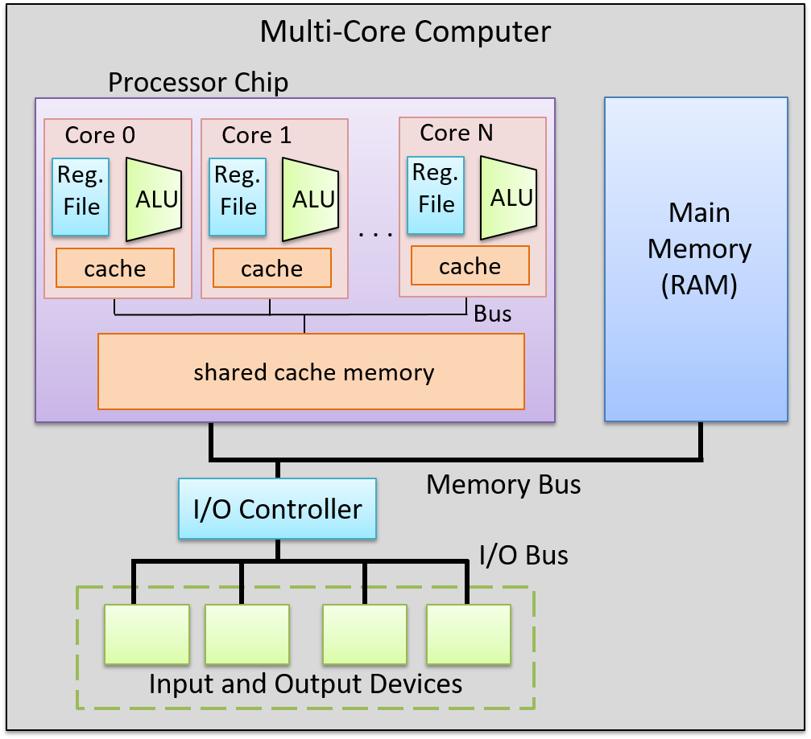

## 5.9. Nhìn về phía trước: CPU ngày nay

Kỹ thuật pipeline trong CPU là một ví dụ của **instruction-level parallelism** (ILP – "song song ở cấp độ lệnh"), trong đó CPU thực thi đồng thời nhiều lệnh song song. Trong thực thi kiểu pipeline, CPU thực hiện đồng thời nhiều lệnh bằng cách chồng lấn quá trình thực thi của chúng trong pipeline. Một CPU pipeline đơn giản có thể đạt CPI bằng 1, tức là hoàn thành một lệnh mỗi chu kỳ xung nhịp. Các vi xử lý hiện đại thường sử dụng pipeline kết hợp với các kỹ thuật ILP khác và bao gồm nhiều nhân CPU để đạt CPI nhỏ hơn 1. Với các vi kiến trúc này, số lượng trung bình **instructions per cycle** (IPC – "lệnh mỗi chu kỳ") là chỉ số thường dùng để mô tả hiệu năng. IPC lớn cho thấy bộ xử lý đạt mức độ thực thi lệnh đồng thời cao và ổn định.

Transistor là khối xây dựng của mọi mạch trên mạch tích hợp (chip). Các đơn vị xử lý và điều khiển của CPU hiện đại được xây dựng từ các mạch, mà bản thân chúng được tạo thành từ các mạch con và cổng logic cơ bản, được triển khai bằng transistor. Transistor cũng được dùng để triển khai các mạch lưu trữ trong thanh ghi CPU và bộ nhớ đệm (cache) tốc độ cao trên chip, nơi lưu bản sao của dữ liệu và lệnh vừa được truy cập gần đây (ta sẽ thảo luận chi tiết về bộ nhớ cache trong [Chương 11](../C11-MemHierarchy/index.html#_storage_and_the_memory_hierarchy)).

Số lượng transistor có thể đặt trên một chip là một chỉ số sơ bộ về hiệu năng của nó. **Định luật Moore** là một quan sát do Gordon Moore đưa ra năm 1975, rằng số lượng transistor trên mỗi mạch tích hợp sẽ tăng gấp đôi khoảng mỗi hai năm[^1,^2]. Việc số lượng transistor trên chip tăng gấp đôi mỗi hai năm có nghĩa là các kiến trúc sư máy tính có thể thiết kế chip mới với gấp đôi không gian dành cho mạch lưu trữ và tính toán, từ đó hiệu năng cũng tăng gần gấp đôi. Trong lịch sử, các kiến trúc sư máy tính đã sử dụng số transistor tăng thêm để thiết kế các bộ xử lý đơn phức tạp hơn, sử dụng các kỹ thuật ILP nhằm cải thiện hiệu năng tổng thể.

### 5.9.1. Song song ở cấp độ lệnh (Instruction-Level Parallelism)

Instruction-level parallelism (ILP) là thuật ngữ chỉ tập hợp các kỹ thuật thiết kế dùng để hỗ trợ thực thi song song các lệnh của một chương trình đơn trên một bộ xử lý đơn. Các kỹ thuật ILP là minh bạch đối với lập trình viên, nghĩa là lập trình viên viết chương trình C tuần tự, nhưng bộ xử lý sẽ thực thi nhiều lệnh của chương trình đó đồng thời, song song, trên một hoặc nhiều đơn vị thực thi. Pipeline là một ví dụ của ILP, trong đó một chuỗi lệnh chương trình được thực thi đồng thời, mỗi lệnh ở một giai đoạn khác nhau trong pipeline. Một bộ xử lý pipeline có thể thực thi một lệnh mỗi chu kỳ (đạt IPC bằng 1). Các thiết kế vi xử lý ILP khác có thể thực thi nhiều hơn một lệnh mỗi chu kỳ xung nhịp và đạt IPC lớn hơn 1.

Một **vector processor** là một kiến trúc triển khai ILP thông qua các lệnh vector đặc biệt, nhận các mảng một chiều (vector) dữ liệu làm toán hạng. Các lệnh vector được thực thi song song bởi vector processor trên nhiều đơn vị thực thi, mỗi đơn vị thực hiện một phép toán trên từng phần tử của toán hạng vector. Trước đây, vector processor thường được sử dụng trong các máy tính song song quy mô lớn. Siêu máy tính Cray-1 ra mắt năm 1976 là siêu máy tính đầu tiên dựa trên vector processor, và Cray tiếp tục thiết kế các siêu máy tính dùng vector processor trong suốt thập niên 1990. Tuy nhiên, thiết kế này cuối cùng không thể cạnh tranh với các thiết kế siêu máy tính song song khác, và ngày nay vector processor chủ yếu xuất hiện trong các thiết bị tăng tốc như GPU (graphics processing unit – "bộ xử lý đồ họa"), vốn được tối ưu hóa đặc biệt để xử lý dữ liệu hình ảnh lưu dưới dạng mảng một chiều.

**Superscalar** là một ví dụ khác về thiết kế bộ xử lý ILP. Một bộ xử lý superscalar là bộ xử lý đơn có nhiều đơn vị thực thi và nhiều pipeline thực thi. Superscalar processor sẽ nạp một tập hợp lệnh từ dòng lệnh tuần tự của chương trình, và phân tách chúng thành nhiều dòng lệnh độc lập được thực thi song song bởi các đơn vị thực thi. Superscalar processor là một **out-of-order processor** ("bộ xử lý thực thi không theo thứ tự"), tức là nó thực thi các lệnh không theo thứ tự xuất hiện trong dòng lệnh tuần tự. Việc thực thi không theo thứ tự đòi hỏi phải xác định các chuỗi lệnh không có phụ thuộc, có thể thực thi song song một cách an toàn. Superscalar processor có chức năng tạo động các dòng lệnh độc lập để đưa vào các đơn vị thực thi. Chức năng này phải thực hiện phân tích phụ thuộc để đảm bảo thứ tự đúng của bất kỳ lệnh nào phụ thuộc vào kết quả của lệnh trước đó trong dòng lệnh tuần tự. Ví dụ, một superscalar processor với năm đơn vị thực thi có pipeline có thể thực thi năm lệnh từ một chương trình tuần tự trong một chu kỳ (đạt IPC bằng 5). Tuy nhiên, do phụ thuộc giữa các lệnh, không phải lúc nào superscalar processor cũng có thể giữ cho tất cả pipeline đều hoạt động.

**Very long instruction word** (VLIW) là một thiết kế vi kiến trúc ILP khác, tương tự superscalar. Tuy nhiên, trong kiến trúc VLIW, trình biên dịch chịu trách nhiệm xây dựng các dòng lệnh độc lập được thực thi song song bởi bộ xử lý. Trình biên dịch cho kiến trúc VLIW sẽ phân tích các lệnh chương trình để xây dựng tĩnh một lệnh VLIW gồm nhiều lệnh, mỗi lệnh thuộc một dòng lệnh độc lập. VLIW dẫn đến thiết kế bộ xử lý đơn giản hơn so với superscalar, vì bộ xử lý VLIW không cần thực hiện phân tích phụ thuộc để xây dựng các dòng lệnh độc lập trong quá trình thực thi. Thay vào đó, bộ xử lý VLIW chỉ cần thêm mạch để nạp lệnh VLIW tiếp theo và tách nó thành các lệnh riêng biệt để đưa vào từng pipeline thực thi. Tuy nhiên, vì đẩy việc phân tích phụ thuộc sang trình biên dịch, kiến trúc VLIW đòi hỏi trình biên dịch chuyên biệt để đạt hiệu năng tốt.

Một vấn đề chung của cả superscalar và VLIW là mức độ hiệu năng song song thường bị giới hạn đáng kể bởi bản chất tuần tự của các chương trình ứng dụng mà chúng thực thi. Các phụ thuộc giữa các lệnh trong chương trình làm hạn chế khả năng giữ cho tất cả pipeline đều hoạt động.

### 5.9.2. Bộ xử lý đa nhân và đa luồng phần cứng

Bằng cách thiết kế các bộ xử lý đơn sử dụng ngày càng nhiều kỹ thuật ILP phức tạp và tăng tần số xung nhịp CPU để điều khiển các chức năng ngày càng phức tạp này, các kiến trúc sư máy tính đã tạo ra những bộ xử lý có hiệu năng theo kịp Định luật Moore cho đến đầu những năm 2000. Sau thời điểm đó, tần số xung nhịp CPU không thể tiếp tục tăng mà không làm tăng đáng kể mức tiêu thụ điện năng của bộ xử lý[^3]. Điều này dẫn đến kỷ nguyên hiện tại của các vi kiến trúc đa nhân (multicore) và đa luồng phần cứng (hardware multithreading), cả hai đều yêu cầu lập trình viên phải thực hiện *explicit parallel programming* ("lập trình song song tường minh") để tăng tốc độ thực thi của một chương trình đơn.

**Hardware multithreading** là thiết kế bộ xử lý đơn hỗ trợ thực thi nhiều luồng phần cứng. Một **thread** (luồng) là một dòng thực thi độc lập. Ví dụ, hai chương trình đang chạy sẽ có hai luồng thực thi độc lập. Hai luồng này có thể được hệ điều hành lập lịch để chạy “đồng thời” trên một bộ xử lý đa luồng. Hardware multithreading có thể được triển khai bằng cách cho bộ xử lý luân phiên thực thi các lệnh từ mỗi dòng lệnh của các luồng trong mỗi chu kỳ. Trong trường hợp này, các lệnh từ các luồng phần cứng khác nhau không được thực thi đồng thời trong cùng một chu kỳ. Thay vào đó, bộ xử lý được thiết kế để chuyển đổi nhanh chóng giữa các dòng lệnh của các luồng khác nhau. Điều này thường giúp tăng tốc độ thực thi tổng thể so với khi chạy trên bộ xử lý đơn luồng.

Multithreading có thể được triển khai bằng phần cứng trên cả vi xử lý kiểu scalar và superscalar. Tối thiểu, phần cứng cần hỗ trợ việc nạp lệnh từ nhiều dòng lệnh riêng biệt (mỗi dòng tương ứng với một luồng thực thi), và có tập thanh ghi riêng cho mỗi dòng lệnh. Các kiến trúc này được gọi là **explicitly multithreaded**[^4] vì, khác với kiến trúc superscalar, mỗi dòng thực thi được hệ điều hành lập lịch độc lập để chạy một chuỗi lệnh chương trình riêng biệt. Các dòng thực thi này có thể đến từ nhiều chương trình tuần tự khác nhau hoặc từ nhiều luồng phần mềm của một chương trình song song đa luồng đơn (ta sẽ thảo luận về lập trình song song đa luồng trong [Chương 14](../C14-SharedMemory/multicore.html#_programming_multicore_systems)).

Các vi kiến trúc đa luồng phần cứng dựa trên bộ xử lý superscalar có nhiều pipeline và nhiều đơn vị thực thi, do đó chúng có thể thực thi các lệnh từ nhiều luồng phần cứng đồng thời, song song, đạt IPC lớn hơn 1. Các kiến trúc đa luồng dựa trên bộ xử lý scalar đơn giản thường triển khai **interleaved multithreading** ("đa luồng xen kẽ"). Các vi kiến trúc này thường dùng chung một pipeline và luôn dùng chung ALU của bộ xử lý (CPU sẽ luân phiên thực thi các luồng trên cùng một ALU). Loại đa luồng này không thể đạt IPC lớn hơn 1. Đa luồng phần cứng được hỗ trợ bởi vi kiến trúc dựa trên superscalar thường được gọi là **simultaneous multithreading** (SMT – "đa luồng đồng thời")[^4]. Đáng tiếc là thuật ngữ SMT thường được dùng để chỉ cả hai loại đa luồng phần cứng, và bản thân thuật ngữ này không đủ để xác định liệu một vi kiến trúc đa luồng có thực sự triển khai đa luồng đồng thời hay chỉ là đa luồng xen kẽ.

**Multicore processors** (bộ xử lý đa nhân) chứa nhiều nhân CPU hoàn chỉnh. Giống như bộ xử lý đa luồng, mỗi nhân được hệ điều hành lập lịch độc lập. Tuy nhiên, mỗi nhân trong bộ xử lý đa nhân là một nhân CPU đầy đủ, có chức năng riêng biệt để thực thi lệnh chương trình. Một bộ xử lý đa nhân chứa các bản sao của các nhân CPU này, cùng với một số phần cứng bổ sung để các nhân chia sẻ dữ liệu cache. Mỗi nhân trong bộ xử lý đa nhân có thể là scalar, superscalar hoặc đa luồng phần cứng. [Hình 1](#Figmulticoreprocesor) minh họa một ví dụ về máy tính đa nhân.

**Hình 1. Một máy tính với bộ xử lý đa nhân.**  
Bộ xử lý chứa nhiều nhân CPU hoàn chỉnh, mỗi nhân có bộ nhớ cache riêng. Các nhân giao tiếp với nhau và chia sẻ bộ nhớ cache lớn hơn thông qua các bus trên chip.

Thiết kế vi xử lý đa nhân là cách chính để hiệu năng kiến trúc bộ xử lý tiếp tục theo kịp Định luật Moore mà không cần tăng tần số xung nhịp. Một máy tính đa nhân có thể chạy đồng thời nhiều chương trình tuần tự, hệ điều hành sẽ lập lịch mỗi nhân với một dòng lệnh của chương trình khác nhau. Nó cũng có thể tăng tốc độ thực thi của một chương trình đơn nếu chương trình đó được viết dưới dạng chương trình song song đa luồng tường minh (luồng phần mềm). Ví dụ, hệ điều hành có thể lập lịch các luồng của một chương trình để chạy đồng thời trên các nhân riêng biệt của bộ xử lý đa nhân, giúp chương trình thực thi nhanh hơn so với phiên bản tuần tự của chính nó. Trong [Chương 14](../C14-SharedMemory/index.html#_leveraging_shared_memory_in_the_multicore_era), ta sẽ thảo luận về lập trình song song đa luồng tường minh cho hệ thống đa nhân và các hệ thống song song khác có bộ nhớ chính chia sẻ.

### 5.9.3. Một số bộ xử lý tiêu biểu

Ngày nay, các bộ xử lý được xây dựng bằng cách kết hợp các công nghệ ILP, đa luồng phần cứng và đa nhân. Thực tế, rất khó để tìm thấy một bộ xử lý không phải đa nhân. Các bộ xử lý dành cho máy tính để bàn thường có từ hai đến tám nhân, nhiều trong số đó cũng hỗ trợ mức đa luồng thấp trên mỗi nhân. Ví dụ, các bộ xử lý đa nhân AMD Zen[^5] và các bộ xử lý đa nhân Intel Xeon và Core có hỗ trợ hyperthreading[^6] đều hỗ trợ hai luồng phần cứng trên mỗi nhân. Các nhân hyperthreaded của Intel triển khai đa luồng xen kẽ. Do đó, mỗi nhân chỉ đạt IPC bằng 1, nhưng với nhiều nhân CPU trên mỗi chip, bộ xử lý vẫn có thể đạt IPC tổng thể cao hơn.

Các bộ xử lý được thiết kế cho hệ thống cao cấp, như máy chủ và siêu máy tính, có nhiều nhân, mỗi nhân có mức độ đa luồng cao. Ví dụ, bộ xử lý Oracle SPARC M7[^7] dùng trong máy chủ cao cấp có 32 nhân. Mỗi nhân có tám luồng phần cứng, trong đó hai luồng có thể thực thi đồng thời, đạt IPC tối đa là 64 cho toàn bộ bộ xử lý. Hai siêu máy tính nhanh nhất thế giới (tính đến tháng 6 năm 2019)[^8] sử dụng bộ xử lý IBM Power 9[^9]. Bộ xử lý Power 9 có tối đa 24 nhân trên mỗi chip, và mỗi nhân hỗ trợ đa luồng đồng thời lên đến tám luồng. Phiên bản 24 nhân của Power 9 có thể đạt IPC tối đa là 192.

### Ghi chú

[^1]:  Moore first observed a doubling every year in 1965, that he then
    updated in 1975 to every \> 2 years, which became known as Moore's
    Law.

2.  Moore's Law held until around 2012 when improvements in transistor
    density began to slow. Moore predicted the end of Moore's Law in the
    mid 2020s.

3.  \"The End of Dennard scaling\" by Adrian McMenamin, 2013.
    [https://cartesianproduct.wordpress.com/2013/04/15/the-end-of-dennard-scaling/](https://cartesianproduct.wordpress.com/2013/04/15/the-end-of-dennard-scaling/){.bare}

4.  \"A Survey of Processors with Explicit Multithreading\", by Ungerer,
    Robic, and Silc. In ACM Computing Surveys, Vol. 35, No. 1, March
    2003, pp. 29--63.
    [http://citeseerx.ist.psu.edu/viewdoc/download?doi=10.1.1.96.9105&rep=rep1&type=pdf](http://citeseerx.ist.psu.edu/viewdoc/download?doi=10.1.1.96.9105&rep=rep1&type=pdf){.bare}

5.  AMD's Zen Architectures:
    [https://www.amd.com/en/technologies/zen-core](https://www.amd.com/en/technologies/zen-core){.bare}

6.  Intel's Xeon and Core processors with Hyper-Threading:
    [https://www.intel.com/content/www/us/en/architecture-and-technology/hyper-threading/hyper-threading-technology.html](https://www.intel.com/content/www/us/en/architecture-and-technology/hyper-threading/hyper-threading-technology.html){.bare}

7.  Oracle's SPARC M7 Processor:
    [http://www.oracle.com/us/products/servers-storage/sparc-m7-processor-ds-2687041.pdf](http://www.oracle.com/us/products/servers-storage/sparc-m7-processor-ds-2687041.pdf){.bare}

8.  Top 500 Lists:
    [https://www.top500.org/lists/top500/](https://www.top500.org/lists/top500/){.bare}

9.  IBM's Power 9 Processor:
    [https://www.ibm.com/it-infrastructure/power/power9](https://www.ibm.com/it-infrastructure/power/power9){.bare}

