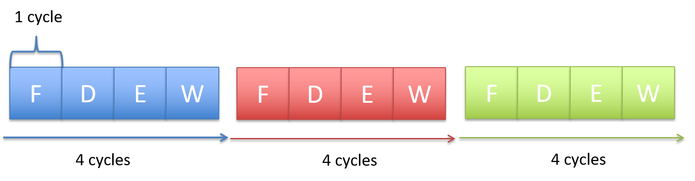

## 5.7. Pipelining: Làm cho CPU nhanh hơn

CPU bốn giai đoạn của chúng ta cần bốn chu kỳ xung nhịp để thực thi một lệnh: chu kỳ đầu tiên dùng để nạp lệnh từ bộ nhớ; chu kỳ thứ hai để giải code lệnh và đọc toán hạng từ register file; chu kỳ thứ ba để ALU thực hiện phép toán; và chu kỳ thứ tư để ghi kết quả từ ALU vào một thanh ghi trong register file. Để thực thi một chuỗi gồm *N* lệnh, CPU cần *4N* chu kỳ xung nhịp, vì mỗi lệnh được thực thi tuần tự, từng cái một.

**Hình 1. Thực thi ba lệnh cần tổng cộng 12 chu kỳ.**

Hình 1 minh họa ba lệnh cần tổng cộng 12 chu kỳ để thực thi, tức là bốn chu kỳ cho mỗi lệnh, dẫn đến CPI bằng 4 (CPI là số chu kỳ trung bình để thực thi một lệnh). Tuy nhiên, mạch điều khiển của CPU có thể được cải tiến để đạt giá trị CPI tốt hơn (thấp hơn).

Khi xem xét mô hình thực thi mà mỗi lệnh cần bốn chu kỳ, rồi lệnh tiếp theo cũng cần bốn chu kỳ, và cứ thế tiếp tục, ta thấy rằng mạch CPU tương ứng với mỗi giai đoạn chỉ thực sự hoạt động một lần mỗi bốn chu kỳ. Ví dụ, sau giai đoạn Fetch, mạch fetch trong CPU không được sử dụng để thực hiện bất kỳ hành động hữu ích nào liên quan đến việc thực thi lệnh trong ba chu kỳ tiếp theo. Tuy nhiên, nếu mạch fetch có thể tiếp tục thực hiện giai đoạn Fetch của các lệnh tiếp theo trong ba chu kỳ đó, thì CPU có thể hoàn thành việc thực thi nhiều hơn một lệnh mỗi bốn chu kỳ.

**CPU pipelining** là ý tưởng bắt đầu thực thi lệnh tiếp theo trước khi lệnh hiện tại hoàn tất. CPU pipelining vẫn thực thi lệnh theo thứ tự, nhưng cho phép các lệnh trong chuỗi được thực thi chồng lấn nhau. Ví dụ, trong chu kỳ đầu tiên, lệnh đầu tiên bước vào giai đoạn Fetch. Trong chu kỳ thứ hai, lệnh đầu tiên chuyển sang giai đoạn Decode, và đồng thời lệnh thứ hai bước vào giai đoạn Fetch. Trong chu kỳ thứ ba, lệnh đầu tiên chuyển sang giai đoạn Execute, lệnh thứ hai sang Decode, và lệnh thứ ba được nạp từ bộ nhớ. Trong chu kỳ thứ tư, lệnh đầu tiên chuyển sang giai đoạn WriteBack và hoàn tất, lệnh thứ hai sang Execute, lệnh thứ ba sang Decode, và lệnh thứ tư bước vào giai đoạn Fetch. Tại thời điểm này, pipeline của CPU đã đầy — mỗi giai đoạn của CPU đang thực thi một lệnh chương trình, và mỗi lệnh tiếp theo cách lệnh trước đó một giai đoạn. Khi pipeline đầy, CPU hoàn tất việc thực thi một lệnh mỗi chu kỳ xung nhịp!

**Hình 2. Pipelining: chồng lấn việc thực thi lệnh để đạt một lệnh hoàn tất mỗi chu kỳ.**  
Vòng tròn biểu thị trạng thái ổn định khi CPU hoàn tất một lệnh mỗi chu kỳ.

Hình 2 minh họa ví dụ về thực thi lệnh kiểu pipeline trong CPU của chúng ta. Bắt đầu từ chu kỳ xung nhịp thứ tư, pipeline đầy, nghĩa là CPU hoàn tất một lệnh mỗi chu kỳ, đạt CPI bằng 1 (được biểu thị bằng vòng tròn trong Hình 2). Lưu ý rằng tổng số chu kỳ cần để thực thi một lệnh đơn (gọi là **latency** của lệnh) không giảm trong thực thi kiểu pipeline — mỗi lệnh vẫn cần bốn chu kỳ để hoàn tất. Thay vào đó, pipelining làm tăng **throughput** của lệnh — tức là số lượng lệnh CPU có thể thực thi trong một khoảng thời gian nhất định — bằng cách chồng lấn việc thực thi các lệnh tuần tự theo kiểu so le qua các giai đoạn khác nhau của pipeline.

Từ những năm 1970, các kiến trúc sư máy tính đã sử dụng pipelining như một cách để cải thiện mạnh mẽ hiệu năng của vi xử lý. Tuy nhiên, pipelining phải đánh đổi bằng việc thiết kế CPU phức tạp hơn so với thiết kế không hỗ trợ thực thi kiểu pipeline. Cần thêm mạch lưu trữ và điều khiển để hỗ trợ pipelining. Ví dụ, có thể cần nhiều thanh ghi lệnh để lưu trữ các lệnh đang nằm trong pipeline. Mặc dù phức tạp hơn, nhưng lợi ích về CPI mà pipelining mang lại gần như luôn xứng đáng. Do đó, hầu hết các vi xử lý hiện đại đều triển khai thực thi kiểu pipeline.

Ý tưởng pipelining cũng được sử dụng trong nhiều ngữ cảnh khác trong khoa học máy tính để tăng tốc độ thực thi, và cũng áp dụng cho nhiều lĩnh vực ngoài ngành CNTT. Ví dụ, hãy xem việc giặt nhiều mẻ quần áo bằng một máy giặt. Nếu mỗi mẻ giặt gồm bốn bước (giặt, sấy, gấp, cất quần áo), thì sau khi giặt xong mẻ đầu tiên, ta có thể cho mẻ thứ hai vào máy giặt trong khi mẻ đầu tiên đang được sấy — tức là chồng lấn việc giặt các mẻ để rút ngắn tổng thời gian giặt bốn mẻ. Dây chuyền lắp ráp trong nhà máy cũng là một ví dụ điển hình của pipelining.

Trong phần thảo luận về cách CPU thực thi lệnh chương trình và pipelining, ta đã sử dụng pipeline đơn giản gồm bốn giai đoạn và ví dụ lệnh ADD. Để thực thi các lệnh nạp và lưu dữ liệu giữa bộ nhớ và thanh ghi, cần dùng pipeline năm giai đoạn. Pipeline năm giai đoạn bao gồm thêm giai đoạn Memory để truy cập bộ nhớ: Fetch–Decode–Execute–Memory–WriteBack. Các bộ xử lý khác nhau có thể có ít hoặc nhiều giai đoạn pipeline hơn so với pipeline năm giai đoạn điển hình. Ví dụ, kiến trúc ARM ban đầu có ba giai đoạn (Fetch, Decode và Execute, trong đó giai đoạn Execute thực hiện cả phép toán ALU và ghi kết quả vào register file). Các kiến trúc ARM hiện đại có nhiều hơn năm giai đoạn trong pipeline. Kiến trúc Intel Pentium ban đầu có pipeline năm giai đoạn, nhưng các kiến trúc sau đó có số giai đoạn pipeline nhiều hơn đáng kể. Ví dụ, Intel Core i7 có pipeline gồm 14 giai đoạn.